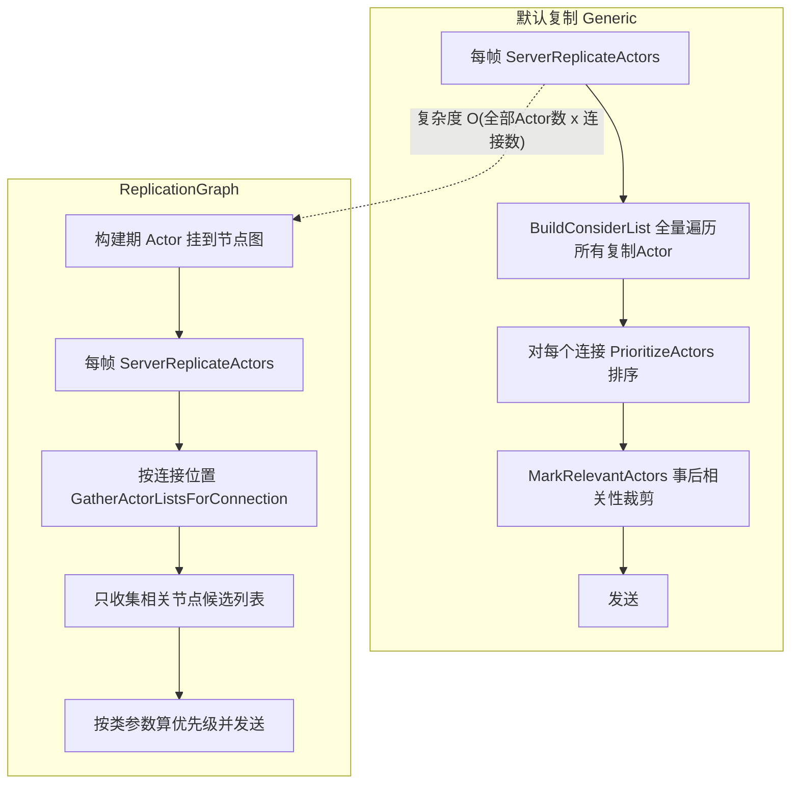
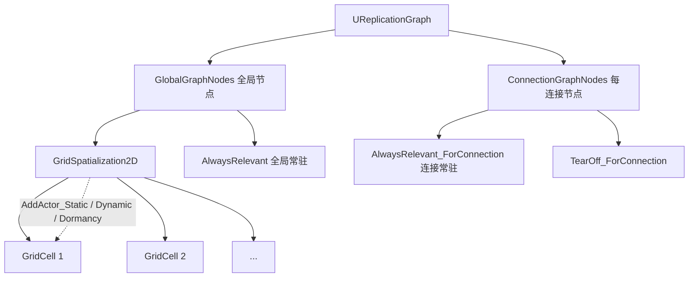
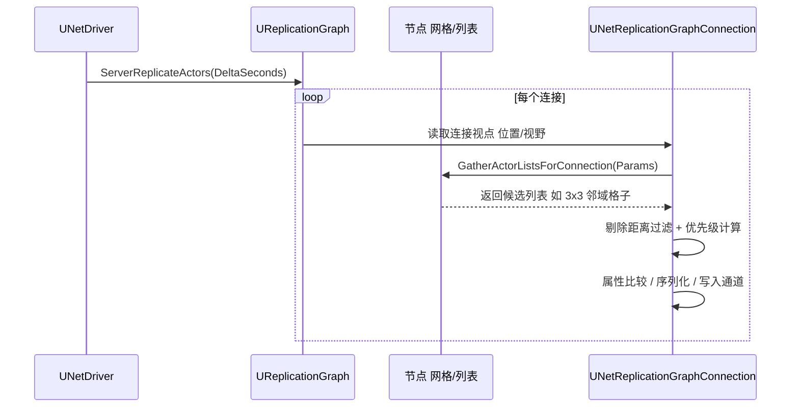

# 05 · ReplicationGraph 兴趣管理
> 版本基准：UE 5.8.0（本机 `Engine/Build/Build.version`：CL 55116800，分支 `++UE5+Release-5.8`）。
> 兼容性边界：适用于 UE5.8 编辑器/运行时，UE4.27 与早期 UE5 仅作迁移背景，具体模块以正文为准。
> 官方参考：[Unreal Engine UE5.8 官方文档总页](https://dev.epicgames.com/documentation/en-us/unreal-engine)。
> 最后更新：2026-08-06（本轮元数据维护）。

> 本篇是「06-网络同步」分类的第五篇，回答三个问题：
> **① 默认复制为什么在大规模多人下扛不住？**（`ServerReplicateActors` 全量遍历）
> **② ReplicationGraph 用什么结构替代全量遍历？**（节点图 + 2D 网格兴趣管理）
> **③ 生产项目怎么落地与调优？**（子类化、类级配置、调试命令、与 Iris 的关系）
> 适用版本：UE 5.8。本文 API 均已对照本机源码验证：
> `Engine/Plugins/Runtime/ReplicationGraph/Source/Public/ReplicationGraph.h`（5.8 起节点类全部收拢于此）
> 与 `Engine/Source/Runtime/Engine/Private/NetDriver.cpp`。
> 前置：建议先读本分类 [01](01-网络架构与复制基础.md)（Relevancy、NetUpdateFrequency）与 [02](02-RPC与属性同步.md)（属性同步）。

---

## 一、概述

### 1.1 默认复制路径的瓶颈

UE 默认（不启用 Replication Graph）时，每次服务器 Tick 由 `UNetDriver::ServerReplicateActors()`（`NetDriver.cpp:6277`）驱动复制，流程分四步：

| 步骤 | 函数（NetDriver.cpp 行号） | 干什么 |
| --- | --- | --- |
| ① 准备连接 | `ServerReplicateActors_PrepConnections()`（5198） | 遍历 ClientConnections，计算每个连接的 NetViewer（位置/视角/视野） |
| ② 构建考虑列表 | `ServerReplicateActors_BuildConsiderList()`（5303） | **全量遍历**世界中所有 `bReplicates=true` 的 Actor，把到期（NetUpdateTime）的塞进 ConsiderList |
| ③ 优先级排序 | `ServerReplicateActors_PrioritizeActors()`（5528） | 对**每个连接**把 ConsiderList 里所有 Actor 按距离/饥饿度算优先级并排序 |
| ④ 处理与发送 | `ServerReplicateActors_ProcessPrioritizedActors()`（5681）、`ServerReplicateActors_MarkRelevantActors()`（5896） | 逐个走相关性判定 → 属性比较 → 序列化 → 写入连接 |

这套流程的特点是：

- **全量遍历**：`BuildConsiderList` 每帧扫一遍世界里的**所有**复制 Actor，不管连接在哪儿；
- **每连接重复**：`PrioritizeActors` 对每个连接都要处理同一份 ConsiderList，复杂度近似 **O(全部复制 Actor × 连接数)**；
- **相关性判定晚**：Relevancy 判定发生在"已经遍历到、已经入列"之后，属于事后裁剪，省不了前面的开销。

8~30 人的中小规模游戏完全够用；但 100 人、大世界、多战区的场景下，服务器每帧的"全量遍历 × 每连接排序"会吃掉大量 CPU。典型症状：`stat net` 里 ServerReplicateActors 时间持续高企、Tick 掉帧、连接数增加时性能线性恶化。

### 1.2 ReplicationGraph 是什么

ReplicationGraph 是引擎官方提供的 `UReplicationDriver` 实现（插件 `Engine/Plugins/Runtime/ReplicationGraph`），核心思想一句话：

> **把"每帧全量遍历 + 事后过滤"换成"预构建的兴趣结构 + 按连接定向收集"。**

- 服务器把 Actor 按兴趣规则提前"挂"到一张**节点图**上（2D 网格、AlwaysRelevant 列表、按类分组的列表等）；
- 每帧复制时，图根据每个连接的位置只收集**可能相关**的候选 Actor（例如玩家周围 3×3 网格内的 Actor）；
- 候选列表小了，优先级排序、相关性判定、发送成本随之大幅下降；
- 引擎仍然负责属性比较、序列化、发送——RepGraph 只负责"给每个连接喂哪份名单"。

### 1.3 UE 5.8 的源码布局变化（重要）

早期 UE5 版本把 RepGraph 节点类分散在多个头文件：`ReplicationGraphNode_GridSpatialization2D.h`、`ReplicationGraphNode_ActorList.h`、`ReplicationGraphNode_AlwaysRelevant.h` 等。

**本机 UE 5.8 验证**：`Engine/Plugins/Runtime/ReplicationGraph/Source/` 下只剩 `Public/BasicReplicationGraph.h`、`Public/ReplicationGraph.h`、`Public/ReplicationGraphModule.h`、`Public/ReplicationGraphTypes.h` 与 `Private/` 下 5 个 .cpp。**全部节点类（`UReplicationGraphNode_GridSpatialization2D`、`UReplicationGraphNode_ActorList`、`UReplicationGraphNode_AlwaysRelevant` 等 12 个类）已合并进 `Public/ReplicationGraph.h`**。引用时只需 `#include "ReplicationGraph.h"`；网上旧教程的分头文件路径在 5.8 需要替换。

> 5.8 `ReplicationGraph.h` 中 UCLASS 清单（行号）：`UReplicationGraphNode`(69)、`UReplicationGraphNode_ActorList`(188)、`UReplicationGraphNode_ActorListFrequencyBuckets`(239)、`UReplicationGraphNode_DynamicSpatialFrequency`(322)、`UReplicationGraphNode_ConnectionDormancyNode`(428)、`UReplicationGraphNode_DormancyNode`(485)、`UReplicationGraphNode_GridCell`(535)、`UReplicationGraphNode_GridSpatialization2D`(579)、`UReplicationGraphNode_AlwaysRelevant`(771)、`UReplicationGraphNode_AlwaysRelevant_ForConnection`(827)、`UReplicationGraphNode_TearOff_ForConnection`(888)、`UReplicationGraph`(920)。

---

## 二、核心概念（速查表）

### 2.1 默认复制 vs ReplicationGraph

| 维度 | 默认复制（Generic） | ReplicationGraph |
| --- | --- | --- |
| 驱动类 | `UNetDriver` 内建逻辑 | `UReplicationDriver`（`UReplicationGraph` 是官方实现） |
| 候选 Actor 来源 | 每帧全量遍历（BuildConsiderList） | 节点图定向收集（GatherActorListsForConnection） |
| 相关性判定 | 每连接事后判定 | 图结构预裁剪（网格/列表），收集即相关 |
| 频率控制 | `AActor::NetUpdateFrequency` | 类级 `FClassReplicationInfo::ReplicationPeriodFrame` |
| 剔除距离 | `AActor::NetCullDistanceSquared` 等 | 类级 `CullDistanceSquared`（可运行期改） |
| 适用规模 | 小规模（约 ≤32 人） | 大规模、大世界、多战区 |

### 2.2 关键类（行号以 5.8 ReplicationGraph.h 为准）

| 类 | 位置 | 职责 |
| --- | --- | --- |
| `UReplicationDriver` | `Engine/Classes/Engine/NetDriver.h:342`（前向声明） | 复制驱动器抽象：ServerReplicateActors / AddNetworkActor / ForceNetUpdate… |
| `UReplicationGraph` | ReplicationGraph.h:920 | 驱动器主类：持全局节点与连接管理器，调度每帧复制 |
| `UReplicationGraphNode` | :69 | 所有节点基类（UObject），定义 NotifyAddNetworkActor / GatherActorListsForConnection 等虚函数 |
| `UNetReplicationGraphConnection` | :1284 | 每个客户端连接一个，保存该连接的复制状态与视图信息 |
| `UReplicationGraphNode_ActorList` | :188 | 最常用的"名单节点"，内部用 FActorRepList 存 Actor，收集时整表给出 |
| `UReplicationGraphNode_ActorListFrequencyBuckets` | :239 | 把 Actor 分桶、按帧轮流输出，做粗粒度负载均衡 |
| `UReplicationGraphNode_DynamicSpatialFrequency` | :322 | 动态 Actor 按"到连接视点的距离"调节复制频率 |
| `UReplicationGraphNode_ConnectionDormancyNode` | :428 | 每连接的休眠状态管理 |
| `UReplicationGraphNode_DormancyNode` | :485 | 全局休眠 Actor 管理 |
| `UReplicationGraphNode_GridCell` | :535 | 网格的一个格子节点（持有该格子的 Actor） |
| `UReplicationGraphNode_GridSpatialization2D` | :579 | 2D 网格兴趣管理节点（本篇主角） |
| `UReplicationGraphNode_AlwaysRelevant` | :771 | 对所有人始终相关的 Actor（如 GameState） |
| `UReplicationGraphNode_AlwaysRelevant_ForConnection` | :827 | 对单个连接始终相关的 Actor（如 PlayerController） |
| `UReplicationGraphNode_TearOff_ForConnection` | :888 | TearOff Actor 的每连接处理 |
| `AReplicationGraphDebugActor` | :1514 | 调试用复制 Actor，提供 ServerSetCullDistanceForClass 等 RPC |

### 2.3 FClassReplicationInfo 关键字段（ReplicationGraphTypes.h:877）

每个 Actor 类的复制参数，在 `InitGlobalActorClassSettings` 里注册：

| 字段 | 默认值 | 含义 |
| --- | --- | --- |
| `ReplicationPeriodFrame` | 1 | 每隔多少帧复制一次（等效"类级 NetUpdateFrequency"） |
| `FastPath_ReplicationPeriodFrame` | 1 | Fast Path（快速路径）专用周期 |
| `ActorChannelFrameTimeout` | 4 | 多少帧不复制就关闭该 Actor 的 Actor 通道 |
| `CullDistanceSquared` | 由 `SetCullDistanceSquared()` 设置 | 剔除距离的平方，决定"多远算相关" |
| `DistancePriorityScale` | 1.0 | 距离优先级缩放 |
| `StarvationPriorityScale` | 1.0 | 饥饿度优先级缩放（长期未复制的 Actor 提权） |
| `AccumulatedNetPriorityBias` | 0.0 | 累积优先级偏置 |
| `FastSharedReplicationFunc` | nullptr | Fast Shared 复制函数（一写多读优化） |

### 2.4 常用调试命令（ReplicationGraphDebugging.cpp）

| 命令 | 作用 |
| --- | --- |
| `Net.RepGraph.PrintGraph` | 把整张节点图打印到日志（层次化结构 + 各列表） |
| `Net.RepGraph.DrawGraph` | 在 HUD 上绘制节点图 |
| `Net.RepGraph.PrintAllActorInfo <匹配串>` | 打印匹配 Actor 的全局/连接级复制信息（客户端也可调用） |
| `Net.RepGraph.PrioritizedLists.Print/Draw <连接索引>` | 打印/绘制某连接的优先级列表 |
| `Net.RepGraph.PrintAll <帧数> <连接> <Class/Num>` | 连续多帧打印图与优先级列表 |
| `Net.RepGraph.Lists.Stats / Details` | 输出 FActorRepList 统计/细节 |
| `Net.RepGraph.StarvedList <连接索引>` | 输出饥饿（长期未复制）Actor 列表 |
| `Net.RepGraph.Spatial.CellInfo` | 输出当前网格单元信息 |
| `Net.RepGraph.SetClassCullDistance <Class> <距离>` | 运行期修改类剔除距离 |
| `Net.RepGraph.SetPeriodFrame <Class> <帧数>` | 运行期修改类复制周期 |
| `Net.RepGraph.Spatial.SetCellSize <尺寸>` | 运行期修改网格尺寸 |
| `Net.RepGraph.Spatial.ForceRebuild` | 强制重建网格 |
| `Net.RepGraph.SetDebugActor <Class>` | 客户端指定服务器调试 Actor，用于条件断点 |

---

## 三、原理详解

### 3.1 默认复制 vs RepGraph：一图对比



### 3.2 节点图架构



图的结构要点：

- **全局节点（GlobalGraphNodes）**：所有连接共享，如网格节点、AlwaysRelevant 节点（`AddGlobalGraphNode`，ReplicationGraph.h:1015）；
- **连接节点（ConnectionGraphNodes）**：每个连接独立一份（`AddConnectionGraphNode`），如 AlwaysRelevant_ForConnection；
- Actor 进图时由 `RouteAddNetworkActorToNodes()`（:979）按规则分发：`bAlwaysRelevant` → 全局常驻节点、`bOnlyRelevantToOwner` → OwnerOnly 节点、其余 → 网格节点（可自定义类路由表）；
- 每帧复制时 `UReplicationGraph::ServerReplicateActors()`（:975）对每个连接调用节点们的 `GatherActorListsForConnection()`，把各节点候选列表合并后走发送管线。

### 3.3 网格兴趣管理（GridSpatialization2D）

`UReplicationGraphNode_GridSpatialization2D`（:579）把世界切成正方形格子，关键参数：

| 参数 | 行号 | 说明 |
| --- | --- | --- |
| `CellSize` | :613 | 格子边长（cm），如 10000 表示 100m |
| `SpatialBias` | :614 | 世界原点偏移（FVector2D），把负坐标映射成非负格子索引 |
| `ConnectionMaxZ` | :615 | 连接位置 Z 必须 ≤ 该值才从网格取 Actor（多层关卡/上下层隔离） |
| `SetBiasAndGridBounds(FBox)` | :621 | 限定网格范围；范围外 Actor/视点会被钳制到最近格子 |
| `CreateCellNodeOverride` | :624 | 覆盖格子节点的创建函数（自定义 GridCell 子类） |
| `ForceRebuild()` | :626 | 强制重建整棵空间树 |
| `AddToClassRebuildDenyList(Class)` | :629 | 某类 Actor 出界时**钳制**而不是触发重建（适合弹道） |
| `bDestroyDormantDynamicActors` | :636 | 休眠动态 Actor 离开相关范围后通知客户端销毁 |
| `DestroyDormantDynamicActorsCellTTL` | :638 | 上述销毁的延迟帧数（防抖动误杀） |

相关性规则：**连接所在格子及其 3×3 邻域格子**内的 Actor 进入候选列表。Actor 分流：

- `AddActor_Static()`（:598）：静态 Actor，格子索引缓存，不随帧移动；
- `AddActor_Dynamic()`（:599）：动态 Actor，移动时重算格子（触发列表迁移）；
- `AddActor_Dormancy()`（:600）：休眠驱动的 Actor。

### 3.4 每帧复制流程



`FConnectionGatherActorListParameters`（ReplicationGraphTypes.h:1720）携带 `Viewers`、`ConnectionManager`、`ReplicationFrameNum` 与输出 `OutGatheredReplicationLists`，节点把候选列表通过 `AddReplicationActorList()`（:652）写进去。

### 3.5 与休眠（Dormancy）的配合

- `UReplicationGraphNode_DormancyNode`（:485）与 `UReplicationGraphNode_ConnectionDormancyNode`（:428）把休眠 Actor 单独管理，避免休眠 Actor 反复走收集；
- `UReplicationGraph` 实现了休眠相关的驱动接口：`FlushNetDormancy()`（:967）、`NotifyActorDormancyChange()`（:970）、`NotifyActorFullyDormantForConnection()`（:969）——唤醒时会重新入图；
- 网格节点侧，休眠且离开相关范围的动态 Actor 由 `bDestroyDormantDynamicActors` + `DestroyDormantDynamicActorsCellTTL` 延迟销毁（:636-638），配合 `ReplicatedDormantDestructionInfosPerFrame`（:640）错帧发送销毁通知。

### 3.6 大规模多人优化实践要点

- **战区拆分**：大地图按战区/子关卡拆成多个 `GridSpatialization2D`，避免单网格过大、单格候选过多；
- **类级周期**：用 `ServerSetPeriodFrameForClass()`（AReplicationGraphDebugActor:1549）或 ini 配置把低优先级类（装饰物、掉落物）的 `ReplicationPeriodFrame` 调大；
- **发现预算**：`SetActorDiscoveryBudget()`（:985）限制新连接每秒可发现的 Actor 数据量（KB/s），防止大世界涌入时瞬间打爆带宽；
- **分桶平滑**：`UReplicationGraphNode_ActorListFrequencyBuckets`（:239）把 Actor 分桶错帧输出；
- **距离调频**：`UReplicationGraphNode_DynamicSpatialFrequency`（:322）按到连接的距离动态调复制频率；
- **优先级权重**：`FClassReplicationInfo::DistancePriorityScale / StarvationPriorityScale` 控制排序。

### 3.7 与 Iris 的关系（UE 5.8）

- **Iris** 是 UE 新一代复制系统（实验性），5.8 位于 `Engine/Source/Runtime/Net/Iris`（`Public/Iris/ReplicationSystem/` 下含 Filtering、Prioritization、ReplicationBridge、ReplicationView 等）；
- `UNetDriver` 支持三种复制模型（NetDriver.h:2520 注释）：**Generic**（默认）、**RepGraph**、**Iris**；
- 可用 `UNetDriver::IsUsingIrisReplication()`（NetDriver.h:2014）判断当前是否 Iris；
- **ReplicationGraph 仍是传统复制管线的驱动器**：它接管的是"候选 Actor 选择/兴趣管理"这一段；Iris 则是整条复制管线的替换（状态跟踪、序列化、过滤全部重写）；
- 5.8 中 Iris 仍为 Beta 状态（`Plugins/Experimental/Iris`，描述符 `IsBetaVersion=true`，并非 Experimental），生产项目主流仍是"传统管线 + ReplicationGraph"。兴趣管理的思想（空间网格、距离剔除、优先级）在 Iris 中同样存在，本篇知识不会浪费。

---

## 四、C++ 示例

### 4.1 启用 ReplicationGraph（DefaultEngine.ini）

```ini
[/Script/OnlineSubsystemUtils.IpNetDriver]
ReplicationDriverClassName="/Script/我的项目.MyReplicationGraph"
```

- `UNetDriver::ReplicationDriverClassName`（NetDriver.h:849）是 Config 属性，引擎启动时据此实例化驱动器（`InitReplicationDriverClass()`，:1626）；
- 也可在 GameMode 或测试代码里用 `UNetDriver::SetReplicationDriver()`（:2009）动态注入；
- 专用服务器与监听服务器都适用；客户端不需要（RepGraph 只在服务器端跑）。

### 4.2 子类化 UReplicationGraph

```cpp
// MyReplicationGraph.h
#pragma once
#include "ReplicationGraph.h"
#include "MyReplicationGraph.generated.h"

UCLASS()
class UMyReplicationGraph : public UReplicationGraph
{
    GENERATED_BODY()
public:
    virtual void InitGlobalActorClassSettings() override;
    virtual void InitGlobalGraphNodes() override;
    virtual void InitConnectionGraphNodes(UNetReplicationGraphConnection* RepGraphConnection) override;
    virtual void RouteAddNetworkActorToNodes(const FNewReplicatedActorInfo& ActorInfo,
                                             FGlobalActorReplicationInfo& GlobalInfo) override;

    UPROPERTY()
    TObjectPtr<UReplicationGraphNode_GridSpatialization2D> GridNode;

    UPROPERTY()
    TObjectPtr<UReplicationGraphNode_ActorList> AlwaysRelevantNode;

    UPROPERTY()
    TObjectPtr<UReplicationGraphNode_ActorList> OwnerOnlyNode;
};
```

```cpp
// MyReplicationGraph.cpp
#include "MyReplicationGraph.h"
#include "GameFramework/GameStateBase.h"
#include "GameFramework/PlayerController.h"
#include "GameFramework/PlayerState.h"
#include "GameFramework/Pawn.h"

void UMyReplicationGraph::InitGlobalActorClassSettings()
{
    Super::InitGlobalActorClassSettings();

    // GameState：永不剔除、每帧复制、对所有人常驻
    FClassReplicationInfo GameStateInfo;
    GameStateInfo.SetCullDistanceSquared(0.f);
    GameStateInfo.ReplicationPeriodFrame = 1;
    GlobalActorReplicationInfoMap.SetClassInfo(AGameStateBase::StaticClass(), GameStateInfo);
    AddAlwaysRelevantClass(AGameStateBase::StaticClass());

    // Pawn：150m 剔除，每帧复制
    FClassReplicationInfo PawnInfo;
    PawnInfo.SetCullDistanceSquared(15000.f * 15000.f);
    PawnInfo.ReplicationPeriodFrame = 1;
    GlobalActorReplicationInfoMap.SetClassInfo(APawn::StaticClass(), PawnInfo);

    // 拾取物：50m 剔除，每 4 帧复制一次
    FClassReplicationInfo PickupInfo;
    PickupInfo.SetCullDistanceSquared(5000.f * 5000.f);
    PickupInfo.ReplicationPeriodFrame = 4;
    GlobalActorReplicationInfoMap.SetClassInfo(APickup::StaticClass(), PickupInfo);
}
```

> `FGlobalActorReplicationInfoMap::SetClassInfo()`（ReplicationGraphTypes.h:1273）是 5.8 的类信息注册入口；旧教程的 `RegisterClassInfo` 写法在新版本已并入该 Map 体系。

### 4.3 构建全局节点与连接节点

```cpp
void UMyReplicationGraph::InitGlobalGraphNodes()
{
    Super::InitGlobalGraphNodes();

    // —— 网格节点：空间兴趣管理的主干 ——
    GridNode = CreateNewNode<UReplicationGraphNode_GridSpatialization2D>(); // 必须用 CreateNewNode（:997）
    GridNode->CellSize = 10000.f;                                           // 格子边长 100m
    GridNode->SpatialBias = FVector2D(-2097152.f, -2097152.f);              // 世界原点偏移
    AddGlobalGraphNode(GridNode);

    // —— 全局常驻节点：GameState 等 ——
    AlwaysRelevantNode = CreateNewNode<UReplicationGraphNode_ActorList>();
    AddGlobalGraphNode(AlwaysRelevantNode);

    // —— OwnerOnly 节点：只对拥有者相关的 Actor ——
    OwnerOnlyNode = CreateNewNode<UReplicationGraphNode_ActorList>();
    AddGlobalGraphNode(OwnerOnlyNode);
}

void UMyReplicationGraph::InitConnectionGraphNodes(UNetReplicationGraphConnection* RepGraphConnection)
{
    Super::InitConnectionGraphNodes(RepGraphConnection);

    // 每个连接一个"本连接常驻"节点：PlayerController / 本连接专属对象
    UReplicationGraphNode_AlwaysRelevant_ForConnection* NodeForConn =
        CreateNewNode<UReplicationGraphNode_AlwaysRelevant_ForConnection>();
    AddConnectionGraphNode(NodeForConn, RepGraphConnection);
}
```

> 官方最小实现见插件 `Private/BasicReplicationGraph.cpp`：`UBasicReplicationGraph::InitGlobalGraphNodes()` 正是"`CellSize = 10000.f` + `SpatialBias = FVector2D(-UE_OLD_WORLD_MAX, -UE_OLD_WORLD_MAX)` + AlwaysRelevant 节点"的套路。

### 4.4 Actor 路由（RouteAddNetworkActorToNodes）

```cpp
void UMyReplicationGraph::RouteAddNetworkActorToNodes(
    const FNewReplicatedActorInfo& ActorInfo, FGlobalActorReplicationInfo& GlobalInfo)
{
    if (ActorInfo.Actor->bAlwaysRelevant)
    {
        AlwaysRelevantNode->NotifyAddNetworkActor(ActorInfo);   // GameState 等全局对象
    }
    else if (ActorInfo.Actor->bOnlyRelevantToOwner)
    {
        OwnerOnlyNode->NotifyAddNetworkActor(ActorInfo);        // 只对 Owner 相关
    }
    else
    {
        GridNode->NotifyAddNetworkActor(ActorInfo);             // 默认：网格兴趣管理
    }
}
```

> 引擎不会自动分发——`bAlwaysRelevant` 的 Actor 必须由你在这里送进常驻节点，否则它只会按默认规则进网格。BasicReplicationGraph 的示例实现与此一致（`BasicReplicationGraph.cpp:91` 起）。

### 4.5 自定义节点（按类分组 + 自定义收集）

```cpp
// 把弹道类集中管理：低优先级、可整体调频
UCLASS()
class UMyRepGraphNode_Projectiles : public UReplicationGraphNode_ActorList
{
    GENERATED_BODY()
public:
    virtual void NotifyAddNetworkActor(const FNewReplicatedActorInfo& ActorInfo) override
    {
        ReplicationActorList.Add(ActorInfo.Actor);
    }

    virtual void GatherActorListsForConnection(
        const FConnectionGatherActorListParameters& Params) override
    {
        // 把本列表并入该连接的候选列表
        Params.OutGatheredReplicationLists.AddReplicationActorList(ReplicationActorList);
    }
};
```

路由侧按类分发：

```cpp
// RouteAddNetworkActorToNodes 中：
if (ActorInfo.Actor->IsA(AProjectile::StaticClass()))
{
    ProjectileNode->NotifyAddNetworkActor(ActorInfo);
    return;
}
```

> 这就是 Lyra 示例"按类路由"的经典做法（BasicReplicationGraph.cpp 注释也提示参考 Lyra 的 class routing mapping）。类路由表（TMap<UClass*, 节点*>）比逐类 if-else 更好维护。

### 4.6 运行时调整（调试接口与控制台）

```cpp
// 控制台（服务器）：
//   Net.RepGraph.SetPeriodFrame AProjectile 3          —— 投射物每 3 帧复制一次
//   Net.RepGraph.SetClassCullDistance AProjectile 20000 —— 200m 剔除
//   Net.RepGraph.Spatial.SetCellSize 20000             —— 热调整格子尺寸
//   Net.RepGraph.PrintAllActorInfo BP_Pickup           —— 查单个类的复制信息

// 代码内：AReplicationGraphDebugActor 提供服务端 RPC（ReplicationGraph.h:1546/1549）
//   ServerSetCullDistanceForClass(UClass*, float)
//   ServerSetPeriodFrameForClass(UClass*, int32)
```

### 4.7 网格边界与重建控制

```cpp
// 限制网格范围（小地图 / 分层关卡）：
GridNode->SetBiasAndGridBounds(FBox(FVector(-100000, -100000, -100000),
                                    FVector( 100000,  100000,  100000)));

// 弹道类出界时钳制而不是重建（高频跨格对象）：
GridNode->AddToClassRebuildDenyList(AProjectile::StaticClass());

// 需要时强制重建（比如大地图传送后）：
GridNode->ForceRebuild();
```

---

## 五、最佳实践

1. **先用数据说话**：上线前用 `stat net`、`Net.RepGraph.Lists.Stats` 记录"考虑列表长度 × 连接数"，确认瓶颈在服务器 CPU（ServerReplicateActors 耗时）而非带宽；
2. **CellSize 与地图匹配**：10000（100m）是常用起点；格子太大 → 候选过多，太小 → 跨格重建频繁；用 `Net.RepGraph.Spatial.CellInfo` 观察格子负载；
3. **静态与动态分离**：静态 Actor 走 `AddActor_Static`、动态走 `AddActor_Dynamic`，避免每帧重算静态对象的格子索引；
4. **AlwaysRelevant 宁少勿多**：`bAlwaysRelevant` 对象会进**所有**连接的候选列表，只放 GameState/GameMode 这类真正全局的对象；玩家相关对象用 `AlwaysRelevant_ForConnection`（每连接一份）；
5. **类级配置代替逐个改频率**：同类对象统一用 `ReplicationPeriodFrame` + `CullDistanceSquared`，可配置、可调试、可热改；
6. **大世界拆战区**：多个 GridSpatialization2D 分区（按地图区块/楼层），配 `SetBiasAndGridBounds` 限定范围；
7. **休眠 + TTL 防"尸体"**：离开相关范围的休眠动态 Actor 靠 `bDestroyDormantDynamicActors` + `DestroyDormantDynamicActorsCellTTL` 自动销毁，避免客户端残留；
8. **新连接体验**：`SetActorDiscoveryBudget` 控制发现速率，避免大批 Actor 同时涌入新连接；
9. **调试三件套**：`Net.RepGraph.PrintGraph` 看结构、`Net.RepGraph.PrintAllActorInfo <名字>` 看单对象、`Net.RepGraph.PrioritizedLists.Print` 看排序结果；
10. **只改需要改的**：RepGraph 不改变属性复制/RPC 的写法（02 篇内容照旧），只改变"谁相关、多久一次、多高优先级"。

---

## 六、常见问题 FAQ

**Q1：ReplicationGraph 能降低带宽吗？**
不能直接降低——它主要降低服务器 CPU（全量遍历 → 定向收集）。带宽由剔除距离、复制周期、属性大小决定；但候选列表变小后优先级更准，配合类级周期/剔除距离可间接减少无谓发送。

**Q2：CellSize 到底怎么选？**
经验起点 10000（100m）。原则：格子边长 ≈ 多数 Actor 剔除距离的 1~2 倍；再用 `Net.RepGraph.Spatial.CellInfo` 与 `Net.RepGraph.Lists.Stats` 观察，让单格子内动态 Actor 数量可控（几十到几百）。

**Q3：bAlwaysRelevant 的 Actor 会自动进 AlwaysRelevant 节点吗？**
不会。必须在自己的 `RouteAddNetworkActorToNodes()` 里分发（见 4.4）。BasicReplicationGraph 示例就是检查 `ActorInfo.Actor->bAlwaysRelevant` 后放进 AlwaysRelevantNode。

**Q4：动态 Actor 跨格子移动会不会很贵？**
会触发列表迁移（旧格子移除 + 新格子加入）。对策：用 `AddActor_Dynamic` 的增量更新；弹道等高频跨格类加入 `ClassRebuildDenyList`（出界钳制）；必要时 `ForceRebuild()` 错峰重建。

**Q5：RepGraph 下 NetUpdateFrequency 还有用吗？**
有用，但 RepGraph 更推荐类级 `ReplicationPeriodFrame`。两者是不同层：NetUpdateFrequency 决定 Actor 何时"到期进入候选"，PeriodFrame 决定"候选后多久真发"。生产项目建议统一用 RepGraph 类配置，避免两套频率互相打架。

**Q6：5.8 里 ReplicationGraphNode_GridSpatialization2D.h 等头文件去哪了？**
已合并进 `Public/ReplicationGraph.h`（见 1.3）。迁移：把多个节点头文件 include 替换为一个 `#include "ReplicationGraph.h"`，类名不变。

**Q7：RepGraph 和 Iris 能一起用吗？**
5.8 中 Iris 是独立的新复制系统（实验性），NetDriver 按 Generic / RepGraph / Iris 三种模型择一（`IsUsingIrisReplication()` 判断）。Iris 有自己的一套过滤/优先级（Iris/ReplicationSystem 下的 Filtering、Prioritization），目前两者是"替代"关系而非叠加关系。

**Q8：监听服务器（Listen Server）用 RepGraph 有什么注意点？**
配置与专用服务器相同，可以正常使用；但本机玩家也占一个连接，宿主机器 CPU 压力更大，大规模场景仍建议专用服务器。

**Q9：ForceNetUpdate / FlushNetDormancy 在 RepGraph 下还生效吗？**
生效。`UReplicationGraph` 实现了 `ForceNetUpdate()`（:966）与 `FlushNetDormancy()`（:967）驱动接口；休眠唤醒会重新入图参与收集。

**Q10：AReplicationGraphDebugActor 是什么？**
调试专用复制 Actor（:1514），随 RepGraph 自动创建，提供 `ServerSetCullDistanceForClass` / `ServerSetPeriodFrameForClass` 等服务端 RPC；配合 `Net.RepGraph.SetDebugActor <Class>` 可对指定对象设条件断点。

---

## 七、关联阅读

- 本分类：[01-网络架构与复制基础.md](01-网络架构与复制基础.md) —— Relevancy、NetUpdateFrequency、NetPriority 前置概念（3.2.3 / 3.2.4 节）
- 本分类：[02-RPC与属性同步.md](02-RPC与属性同步.md) —— RepGraph 不管属性怎么同步，只管"谁相关"；4.2/4.4 示例中的复制属性写法见 02
- 本分类：[03-客户端预测与延迟补偿.md](03-客户端预测与延迟补偿.md) —— 移动数据在客户端预测，RepGraph 决定预测对象何时对客户端可见
- 本分类：[04-多人游戏框架与玩家状态.md](04-多人游戏框架与玩家状态.md) —— GameState/PlayerController 等常驻对象的复制与登录流程
- 本仓库：[../01-引擎基础/README.md](../01-引擎基础/README.md) —— UObject 生命周期与反射（RepGraph 节点是 UObject）
- 官方文档：Unreal Engine 5 官方 Replication Graph 章节（Overview / Node Graph / Grid 网格兴趣管理）
- 引擎源码（本机 5.8）：
  - `Engine/Plugins/Runtime/ReplicationGraph/Source/Public/ReplicationGraph.h`（全部节点类，5.8 起）
  - `Engine/Plugins/Runtime/ReplicationGraph/Source/Public/ReplicationGraphTypes.h`（FClassReplicationInfo、FGlobalActorReplicationInfoMap 等）
  - `Engine/Plugins/Runtime/ReplicationGraph/Source/Private/BasicReplicationGraph.cpp`（官方最小示例）
  - `Engine/Plugins/Runtime/ReplicationGraph/Source/Private/ReplicationGraphDebugging.cpp`（Net.RepGraph.* 调试命令）
  - `Engine/Source/Runtime/Engine/Private/NetDriver.cpp`（默认复制路径 5198~6460 行）
  - `Engine/Source/Runtime/Net/Iris/`（Iris 复制系统，实验性）
