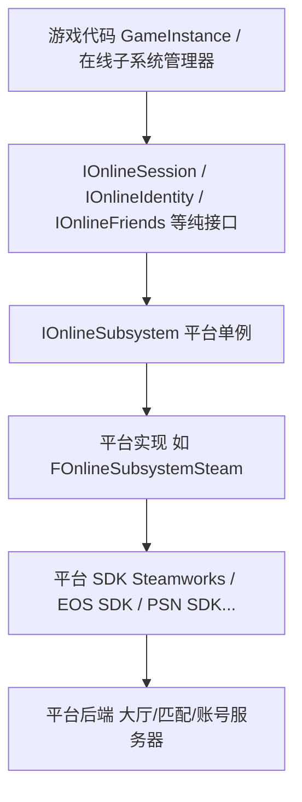
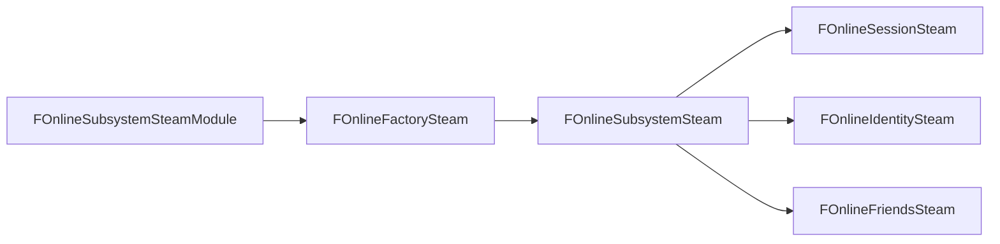
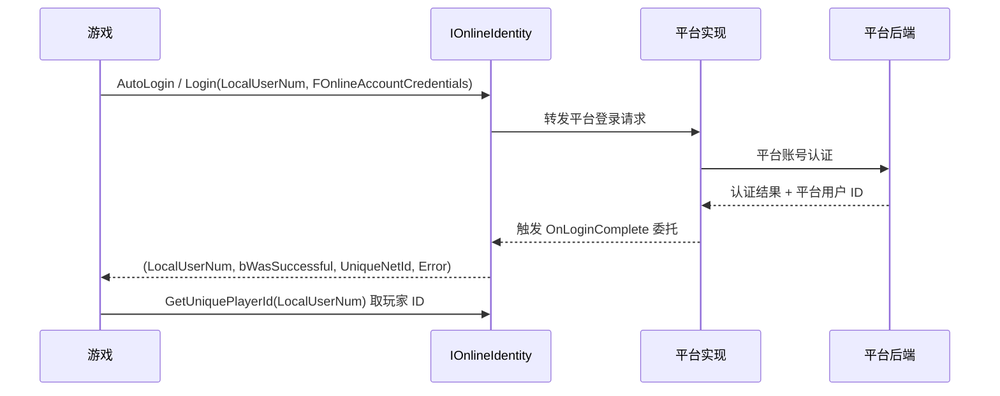
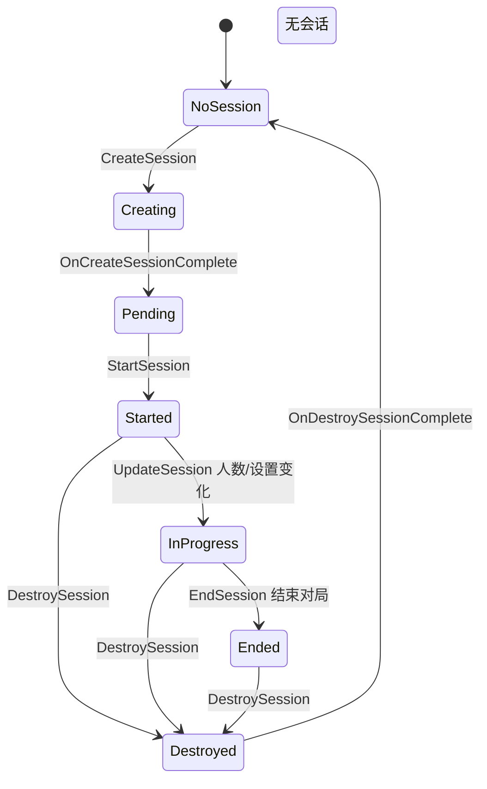
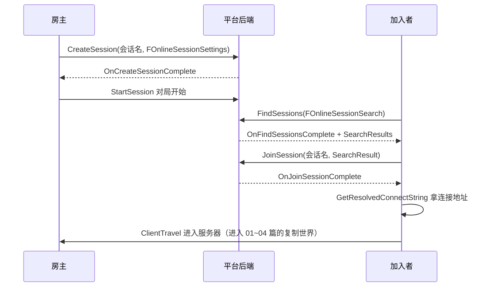
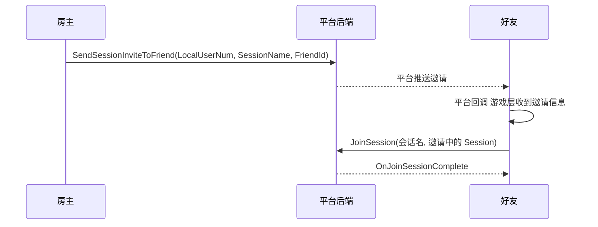

# 06 · 在线子系统与会话匹配
> 版本基准：UE 5.8.0（本机 `Engine/Build/Build.version`：CL 55116800，分支 `++UE5+Release-5.8`）。
> 兼容性边界：适用于 UE5.8 编辑器/运行时，UE4.27 与早期 UE5 仅作迁移背景，具体模块以正文为准。
> 官方参考：[Unreal Engine UE5.8 官方文档总页](https://dev.epicgames.com/documentation/en-us/unreal-engine)。
> 最后更新：2026-08-06（本轮元数据维护）。

> 本篇是「06-网络同步」分类的第六篇，回答三个问题：
> **① 玩家怎么"登录"到游戏平台？**（IOnlineIdentity 与 OnlineSubsystem 架构）
> **② 大厅/房间/匹配是怎么来的？**（IOnlineSession：创建、搜索、加入、邀请、Matchmaking）
> **③ OSS 的"会话"和服务器里的"游戏会话"是一回事吗？**（区别与衔接）
> 适用版本：UE 5.8。本文 API 均已对照本机源码验证：
> `Engine/Plugins/Online/OnlineSubsystem/Source/Public/OnlineSubsystem.h`、`Interfaces/OnlineSessionInterface.h`、
> `Interfaces/OnlineIdentityInterface.h`、`OnlineSessionSettings.h`、
> `Engine/Plugins/Online/OnlineSubsystemSteam/Source/Public/OnlineSubsystemSteamModule.h`。
> 前置：建议先读本分类 [04](04-多人游戏框架与玩家状态.md)（连接建立后的登录握手与框架对象）。

---

## 一、概述

**OnlineSubsystem（OSS）** 是 UE 对"平台在线服务"的统一抽象层：Steam、Epic Online Services（EOS）、PSN、Xbox、Switch、腾讯等平台各自有完全不同的 SDK，而 OSS 用一套 C++ 接口把它们包起来，让游戏代码只写一遍：

- **身份（Identity）**：登录/登出、玩家唯一 ID、登录状态；
- **会话（Session）**：大厅/房间的创建、搜索、加入、邀请、匹配；
- **好友（Friends）**：好友列表、在线状态、邀请入口；
- 其他：成就、排行榜、存档（User Cloud）、语音、外部 UI 等。

本篇聚焦**登录与会话匹配**这条主线：OSS 怎么组织、登录流程怎么走、会话从创建到销毁的完整生命周期、Matchmaking 是什么、Steam/EOS 平台差异，以及最常被混淆的问题——**OSS 的"会话"与服务器上的"游戏会话"（GameSession/GameMode）不是一回事**。

> 5.8 中 OSS 核心代码在 `Engine/Plugins/Online/OnlineSubsystem/`（旧版 API，本文主角）与 `Engine/Plugins/Online/OnlineServices/`（新版"Online Services" API，v2，尚未完全普及）；平台实现如 `OnlineSubsystemSteam`、`OnlineSubsystemEOS`、`OnlineSubsystemNull`（本地空实现，测试用）。

---

## 二、核心概念（速查表）

### 2.1 OSS 接口一览（OnlineSubsystem.h）

| 接口 | 获取方式（IOnlineSubsystem 成员） | 行号 | 职责 |
| --- | --- | --- | --- |
| `IOnlineSubsystem` | `IOnlineSubsystem::Get()` | OnlineSubsystem.h:150/168 | OSS 根对象，平台单例入口 |
| `IOnlineSessionPtr` | `GetSessionInterface()` | :304 | 会话：创建/搜索/加入/邀请/匹配 |
| `IOnlineFriendsPtr` | `GetFriendsInterface()` | :310 | 好友列表与在线状态 |
| `IOnlineIdentityPtr` | `GetIdentityInterface()` | :378 | 登录/登出/玩家 ID |
| `IOnlinePresencePtr` | `GetPresenceInterface()` | — | 在线状态（在线/离开/游戏中） |
| `IOnlineAchievementsPtr` | `GetAchievementsInterface()` | — | 成就系统 |
| `IOnlineUserPtr` | `GetUserInterface()` | — | 玩家资料查询 |
| `IOnlineExternalUIPtr` | `GetExternalUIInterface()` | — | 平台自带 UI（商店/好友/邀请） |

### 2.2 子系统名称（OnlineSubsystemNames.h）

`IOnlineSubsystem::Get(FName)` 用 FName 选择平台：

| 常量 | 平台 | 说明 |
| --- | --- | --- |
| `NULL_SUBSYSTEM` | 空实现 | 无后端，本地测试/开发用 |
| `STEAM_SUBSYSTEM` | Steam | PC 最常用，基于 Steamworks SDK |
| `EOS_SUBSYSTEM` | Epic Online Services | 跨平台在线服务（EOS SDK） |
| `TENCENT_SUBSYSTEM` | 腾讯 | 国内平台（WeGame 等） |
| `GDK_SUBSYSTEM` | Xbox (GDK) | 主机平台 |
| `PS5_SUBSYSTEM` / `PS4_SUBSYSTEM` | PlayStation | 主机平台 |
| `IOS_SUBSYSTEM` / `APPLE_SUBSYSTEM` | Apple | 苹果生态 |
| `GOOGLEPLAY_SUBSYSTEM` / `GOOGLE_SUBSYSTEM` | Google | Android |

### 2.3 FOnlineSessionSettings 关键字段（OnlineSessionSettings.h:226）

| 字段 | 行号 | 含义 |
| --- | --- | --- |
| `NumPublicConnections` | :230 | 公开连接数（可被搜索到的空位） |
| `NumPrivateConnections` | :232 | 私有连接数（仅邀请/密码） |
| `bShouldAdvertise` | :234 | 是否在平台公告（可被搜到） |
| `bAllowJoinInProgress` | :236 | 是否允许中途加入 |
| `bIsLANMatch` | :238 | 是否仅局域网 |
| `bIsDedicated` | :240 | 是否专用服务器（vs 玩家房主） |
| `bUsesStats` | :242 | 是否采集统计 |
| `bAllowInvites` | :244 | 是否允许邀请 |
| `bUsesPresence` | :246 | 是否使用 Presence 驱动的会话（跟随在线状态） |
| `bAllowJoinViaPresence` | :248 | 是否允许通过 Presence 加入 |
| `bAllowJoinViaPresenceFriendsOnly` | :250 | 仅好友可通过 Presence 加入 |
| `bAntiCheatProtected` | :252 | 是否反作弊保护 |
| `bUseLobbiesIfAvailable` | :254 | 5.8 新增：平台支持 Lobby API 时优先用 Lobby |
| `bUseLobbiesVoiceChatIfAvailable` | :256 | 5.8 新增：为 Lobby 自动建语音房 |
| `SessionIdOverride` | :258 | 5.8 新增：手动指定 SessionId |
| `BuildUniqueId` | :261 | 构建标识，防止不同版本互相搜到 |
| `Settings` | :263 | 自定义键值表（FSessionSettings = TMap<FName, FOnlineSessionSetting>） |

### 2.4 搜索相关类型（OnlineSessionSettings.h）

| 类型 | 行号 | 说明 |
| --- | --- | --- |
| `FOnlineSessionSearchParam` | :97 | 单个搜索条件（值 + 比较符 `EOnlineComparisonOp`） |
| `FOnlineSessionSearchResult` | :530 | 一条搜索结果：`Session` + `PingInMs`，`IsValid()` 判断可用 |
| `FOnlineSessionSearch` | :573 | 一次搜索：`SearchResults`、`SearchState`、`MaxSearchResults`、`QuerySettings`、`bIsLanQuery`、`TimeoutInSeconds` |
| `FOnlineSession` | :398 | 会话数据本体（OwningUserId、SessionInfo、SessionSettings） |

### 2.5 关键委托

| 委托 | 定义位置 | 签名 |
| --- | --- | --- |
| `FOnCreateSessionComplete` | OnlineSessionDelegates.h:13 | `(FName SessionName, bool bWasSuccessful)` |
| `FOnStartSessionComplete` | :22 | `(FName, bool)` |
| `FOnUpdateSessionComplete` | :31 | `(FName, bool)` |
| `FOnEndSessionComplete` | :40 | `(FName, bool)` |
| `FOnDestroySessionComplete` | :49 | `(FName, bool)` |
| `FOnFindSessionsComplete` | :85 | `(bool bWasSuccessful)` |
| `FOnMatchmakingComplete` | :58 | `(FName, bool)` |
| `FOnStartMatchmakingComplete` | :69 | `(FName, FOnlineError, FSessionMatchmakingResults)` |
| `FOnJoinSessionComplete` | OnlineSessionInterface.h:636 | `(FName, EOnJoinSessionCompleteResult::Type)` |
| `FOnLoginComplete` | OnlineIdentityInterface.h:169/316 | `(int32 LocalUserNum, bool bWasSuccessful, FUniqueNetId, FString Error)` |
| `FOnLoginStatusChanged` | :139/278 | `(int32, ELoginStatus::Type Old, ELoginStatus::Type New, FUniqueNetId)` |
| `FOnLogoutComplete` | :179/334 | `(int32, bool)` |

---

## 三、原理详解

### 3.1 OSS 分层架构



要点：

- 游戏只依赖**接口**（IOnlineSession 等），不依赖具体平台类；
- `IOnlineSubsystem::Get()`（OnlineSubsystem.h:168）按配置返回当前平台的单例；`GetByPlatform()`（:182）按运行平台自动选；
- 每个平台一个模块（如 `OnlineSubsystemSteam`），模块的 Factory 负责创建 OSS 实例。

### 3.2 模块与工厂：以 Steam 为例



- `FOnlineSubsystemSteamModule : public IModuleInterface`（OnlineSubsystemSteamModule.h:12），持有 `FOnlineFactorySteam* SteamFactory`（:17）；
- 引擎启动时按 `DefaultEngine.ini` 的 `[/Script/OnlineSubsystemSteam.OnlineSubsystemSteam]` 配置加载对应模块；
- 平台实现类均以"FOnlineXxxSteam"命名（如 `FOnlineSubsystemSteam`，OnlineSubsystemSteam.h:59）。

### 3.3 登录流程



细节：

- `Login()`（OnlineIdentityInterface.h:306）需要 `FOnlineAccountCredentials`（:27，字段 Type/Id/Token）；`AutoLogin()`（:353）读取命令行参数（如 `-AUTH_LOGIN=`）；
- 成功后用 `GetUniquePlayerId()`（:378）取 `FUniqueNetId`——后续创建/加入会话、邀请都要它；
- `GetLoginStatus()`（:415/424）返回 `ELoginStatus::Type`；登录状态变化触发 `FOnLoginStatusChanged`（:278）。

### 3.4 会话生命周期



完整时序（房主视角 + 加入者视角）：



关键 API（OnlineSessionInterface.h）：

| 操作 | 函数 | 行号 |
| --- | --- | --- |
| 创建 | `CreateSession(PlayerNum/Id, SessionName, Settings)` | :360/:373 |
| 开始/结束 | `StartSession` / `EndSession` | — |
| 更新 | `UpdateSession` | — |
| 搜索 | `FindSessions(PlayerNum/Id, SearchSettings)` | :527/:537 |
| 取消搜索 | `CancelFindSessions()` | :581 |
| 加入 | `JoinSession(LocalUserNum, SessionName, SearchResult)` | :616/:627 |
| 拿地址 | `GetResolvedConnectString(SessionName/Result, ConnectInfo, PortType)` | :793/:804 |
| 邀请 | `SendSessionInviteToFriend(s)(...)` | :725-758 |
| 销毁 | `DestroySession` | — |

### 3.5 搜索与 Matchmaking

- **手动搜索（Browser）**：`FindSessions` 按 `FOnlineSessionSearch::QuerySettings` 条件查平台上的会话列表，玩家自己选房；
- **云匹配（Matchmaking）**：`StartMatchmaking(LocalPlayers, SessionName, Settings, SearchSettings, ...)`（:473/:485）把玩家交给平台后端自动撮合，完成后通过 `FOnMatchmakingComplete`（OnlineSessionDelegates.h:58）或 `FOnStartMatchmakingComplete`（:69）回调；`CancelMatchmaking()`（:501/:509）取消；
- 匹配质量通常由平台算法决定（延迟、段位、语言），游戏侧通过 `QuerySettings`/自定义键值（如模式、地图）缩小范围；
- `FOnlineSessionSearch` 默认 `MaxSearchResults=1`（:600），搜索前记得调大；`PingBucketSize`（:590）用于把延迟分桶。

### 3.6 邀请流程



注意（5.8 验证）：核心 OSS 头文件中已**不再提供统一的 `OnSessionInviteAccepted` 委托**（早期版本在 OnlineSessionInterface 中声明）；邀请的接收与确认由各平台实现自行回调（如 Steam 的 Lobby 邀请回调、EOS 的 UI 事件），游戏层需要针对平台做封装。`SendSessionInviteToFriend(s)`（:725-758）本身是统一的。

### 3.7 Steam / EOS 平台简述

| 维度 | Steam（OnlineSubsystemSteam） | EOS（OnlineSubsystemEOS） |
| --- | --- | --- |
| 后端 | Steamworks SDK（大厅/好友/成就） | Epic Online Services SDK（Sessions/Lobbies/匹配/反作弊） |
| 会话实现 | 基于 Steam Lobby（`FOnlineSessionSteam`） | EOS Sessions/Lobbies API |
| 传输 | SocketSubsystemSteamIP（Steam Datagram 或直连） | SocketSubsystemEOS（EOS P2P/中继） |
| 匹配 | 手动搜索为主（云匹配较弱） | 原生 Matchmaking（EOS 有专门的匹配服务） |
| 适用 | PC Steam 发行 | 跨平台（PC/主机/移动）、Epic 商店 |
| 模块类 | `FOnlineSubsystemSteamModule`（SteamModule.h:12） | `FOnlineSubsystemEOSModule` |

选择原则：只发 Steam → Steam 子系统；要跨平台/做自家账号体系 → EOS；都要 → 封装一层自己的"平台服务"，按渠道切换。

### 3.8 与游戏服务端会话的区别（易混淆点）

| 维度 | OSS 会话（Session） | 游戏内会话（GameSession/GameMode） |
| --- | --- | --- |
| 存在位置 | 平台后端 + 客户端 OSS 内存 | 游戏服务器（专用服务器进程） |
| 本质 | **元数据/房间列表**：谁在、几个空位、地图/模式 | **权威游戏状态**：规则、玩家、对局进程 |
| 生命周期 | 大厅阶段：创建 → 满员 → 开局 | 对局阶段：开局 → 进行 → 结算 |
| 连接 | 不承载游戏流量 | 承载全部复制流量（01~04 篇内容） |
| 玩家数量来源 | `NumPublicConnections` 等设置 | 服务器实际连接的 NetConnection |
| 关联 | JoinSession 成功 → GetResolvedConnectString → ClientTravel 进服务器 | 之后由 GameMode 的 PreLogin/Login 接管 |

一句话：**OSS 会话负责"把人凑齐、告诉客户端去哪连"；游戏会话负责"连上之后玩什么、状态怎么同步"。**

---

## 四、C++ 示例

### 4.1 获取 OSS 与接口

```cpp
#include "OnlineSubsystem.h"
#include "Interfaces/OnlineSessionInterface.h"
#include "Interfaces/OnlineIdentityInterface.h"

IOnlineSubsystem* OSS = IOnlineSubsystem::Get();                 // 默认子系统（配置决定）
// IOnlineSubsystem::Get(STEAM_SUBSYSTEM) 可强制指定平台（OnlineSubsystemNames.h）
IOnlineSessionPtr   Sessions   = OSS ? OSS->GetSessionInterface()   : nullptr;
IOnlineIdentityPtr  Identity   = OSS ? OSS->GetIdentityInterface()  : nullptr;
```

> `IOnlineSubsystem::Get()`（OnlineSubsystem.h:168）与 `GetByPlatform()`（:182）返回裸指针；接口均为 TSharedPtr。

### 4.2 登录

```cpp
// 绑定登录完成回调
FOnLoginCompleteDelegate::FDelegate LoginCb = FOnLoginCompleteDelegate::FDelegate::CreateUObject(
    this, &UMyOnlineComponent::HandleLoginComplete);
Identity->AddOnLoginCompleteDelegate_Handle(0, LoginCb);

// 平台自动登录（命令行 -AUTH_LOGIN=... / -AUTH_PASSWORD=...）
if (!Identity->AutoLogin(0))
{
    // 手动登录：需要 FOnlineAccountCredentials(Type, Id, Token)（OnlineIdentityInterface.h:27）
    FOnlineAccountCredentials Creds(TEXT("accountportal"), TEXT("user"), TEXT("pass"));
    Identity->Login(0, Creds);
}

void UMyOnlineComponent::HandleLoginComplete(int32 LocalUserNum, bool bWasSuccessful,
                                             const FUniqueNetId& UserId, const FString& Error)
{
    if (bWasSuccessful)
    {
        FUniqueNetIdPtr MyId = Identity->GetUniquePlayerId(LocalUserNum); // :378
        // 进入大厅 UI……
    }
    else
    {
        // Error 里带平台错误码（OnlineIdentityErrors.h）
    }
}
```

### 4.3 创建会话（房主）

```cpp
FOnlineSessionSettings Settings;
Settings.NumPublicConnections = 8;
Settings.bShouldAdvertise      = true;   // 可被搜索到
Settings.bAllowJoinInProgress  = true;
Settings.bIsLANMatch           = false;
Settings.bIsDedicated          = false;  // 玩家房主（监听服务器）
Settings.bAllowInvites         = true;
Settings.bUsesPresence         = true;   // Presence 驱动会话
Settings.bAllowJoinViaPresence = true;
Settings.bAllowJoinViaPresenceFriendsOnly = false;
// Settings.BuildUniqueId 默认已按构建生成（:285），防止跨版本互搜

// 自定义键值（5.8 建议直接使用 FName 常量；旧版 SETTING_MAPNAME 等宏已不在核心头文件）
Settings.Settings.Add(FName(TEXT("MAPNAME")),   FOnlineSessionSetting(FString(TEXT("DM_Arena"))));
Settings.Settings.Add(FName(TEXT("GAMEMODE")),  FOnlineSessionSetting(FString(TEXT("TeamDeathMatch"))));
Settings.Settings.Add(FName(TEXT("NUMPLAYERS")), FOnlineSessionSetting(8, EOnlineDataAdvertisementType::ViaOnlineService));

Sessions->CreateSession(0, FName(TEXT("MyGameSession")), Settings);
// 回调：FOnCreateSessionComplete(SessionName, bWasSuccessful)
```

### 4.4 搜索会话（加入者）

```cpp
SearchSettings = MakeShareable(new FOnlineSessionSearch());
SearchSettings->MaxSearchResults = 20;                       // 默认只有 1（:600），务必调大
SearchSettings->bIsLanQuery = false;
SearchSettings->TimeoutInSeconds = 10.f;
SearchSettings->QuerySettings.Set(FName(TEXT("GAMEMODE")), FString(TEXT("TeamDeathMatch")),
                                  EOnlineComparisonOp::Equals);

Sessions->FindSessions(0, SearchSettings.ToSharedRef());
// 回调：FOnFindSessionsComplete(bWasSuccessful) 后读取 SearchSettings->SearchResults

void UMyOnlineComponent::OnFindComplete(bool bWasSuccessful)
{
    for (const FOnlineSessionSearchResult& Result : SearchSettings->SearchResults)
    {
        if (Result.IsValid())   // 检查 OwningUserId 与 SessionInfo 是否有效（:546）
        {
            int32 Ping = Result.PingInMs;
            FString MapName;
            Result.Session.SessionSettings.Settings.Find(FName(TEXT("MAPNAME")))->Data.GetValue(MapName);
            // 展示到服务器列表 UI……
        }
    }
}
```

### 4.5 加入会话并连接服务器

```cpp
void UMyOnlineComponent::JoinServer(const FOnlineSessionSearchResult& Result)
{
    Sessions->JoinSession(0, FName(TEXT("MyGameSession")), Result);
}

void UMyOnlineComponent::OnJoinComplete(FName SessionName, EOnJoinSessionCompleteResult::Type Result)
{
    if (Result == EOnJoinSessionCompleteResult::Success)
    {
        FString ConnectString;
        if (Sessions->GetResolvedConnectString(SessionName, ConnectString, NAME_GamePort)) // :793
        {
            // 进入服务器——之后的登录握手与复制见 04/01 篇
            GetWorld()->GetFirstPlayerController()->ClientTravel(ConnectString, TRAVEL_Absolute);
        }
    }
    else
    {
        // 失败枚举：SessionIsFull / SessionDoesNotExist / CouldNotRetrieveAddress /
        // AlreadyInSession / UnknownError（OnlineSessionInterface.h:28 起）
    }
}
```

### 4.6 邀请

```cpp
// 房主邀请单个好友
if (FUniqueNetIdPtr FriendId = Friends->GetFriend(0, FriendIndex, EFriendsLists::ToString(EFriendsLists::Default))->GetUserId())
{
    Sessions->SendSessionInviteToFriend(0, FName(TEXT("MyGameSession")), *FriendId); // :725
}

// 批量邀请
TArray<FUniqueNetIdRef> FriendsList;
Sessions->SendSessionInviteToFriends(0, FName(TEXT("MyGameSession")), FriendsList);  // :747
```

> 5.8 核心 OSS 不再提供统一的"邀请被接受"委托（见 3.6），需要接平台回调（Steam Lobby 邀请 / EOS UI 事件）后自行调 `JoinSession`。

### 4.7 销毁会话（房主离开）

```cpp
Sessions->DestroySession(FName(TEXT("MyGameSession")));
// 回调：FOnDestroySessionComplete(SessionName, bWasSuccessful)

// 对局结束收尾顺序：EndSession（结算）→ DestroySession（释放房间）
```

### 4.8 云匹配（Matchmaking）

```cpp
// 交给平台后端自动撮合（5.8 提供两个重载：:473 旧式 / :485 带 FSessionMatchmakingUser 与完成委托）
FOnStartMatchmakingComplete Cb;
Cb.BindUObject(this, &UMyOnlineComponent::OnMatchmakingDone);
Sessions->StartMatchmaking({ Identity->GetUniquePlayerId(0).ToSharedRef() },
                           FName(TEXT("MyGameSession")), Settings,
                           SearchSettings.ToSharedRef(), Cb);

void UMyOnlineComponent::OnMatchmakingDone(FName SessionName, const FOnlineError& Error,
                                           const FSessionMatchmakingResults& Results)
{
    // 成功：平台已把玩家撮合进同一会话，直接 JoinSession / 或由后端推送
    // 失败：FOnlineError 提供平台错误码
}
```

---

## 五、最佳实践

1. **只走 OSS 接口**：游戏代码不要直接调 Steamworks/EOS SDK，否则换平台要重写；需要平台专属能力时封装成自己的服务层；
2. **会话命名统一**：客户端与服务器使用相同的 `SessionName`（FName），避免"客户端加入 A、服务器等 B"；
3. **GameInstance 承载 OSS**：登录/会话状态放 GameInstance 子类（跨关卡存活），不要在 PlayerController 里裸管；
4. **先 Null 后真平台**：开发期用 `NULL_SUBSYSTEM` 跑通流程，再接 Steam/EOS，减少平台账号依赖；
5. **BuildUniqueId 别乱改**：它隔离不同构建的玩家，测试服与正式服版本不一致时搜不到房间是正常现象；
6. **搜索参数要收敛**：`MaxSearchResults` 调大 + `QuerySettings` 收敛（模式/地图/段位），别让玩家翻 500 个房间；
7. **处理断线重连**：网络断开 → 会话还在平台侧 → 重新 `FindSessions`/`JoinSession` 回房，OSS 层与游戏层都要做；
8. **人数以服务器为准**：`NumPublicConnections` 只是公告，真正上限由服务器（GameMode 登录校验）裁决，防"房间写着 8 人却进了 10 个"；
9. **邀请状态机**：大厅 + 对局中收到邀请要区分处理（加入中/对局中/观战）；平台 UI 邀请与游戏内邀请统一入口；
10. **性能与安全**：OSS 回调可能跨线程/延迟到达，UI 更新回 GameThread；登录票据类信息不要落盘明文，交给平台安全存储。

---

## 六、常见问题 FAQ

**Q1：IOnlineSubsystem::Get() 拿到的是哪个平台？**
由 `DefaultEngine.ini` 的 `[OnlineSubsystem]` 与各平台模块配置决定；`Get(STEAM_SUBSYSTEM)` 可显式指定。多平台打包时通常按目标平台自动选择。

**Q2：OSS 会话和 GameSession 到底什么关系？**
OSS 会话是"房间元数据"（平台侧），GameSession/GameMode 是"服务器上的权威游戏状态"。典型链路：OSS 凑齐人 → `GetResolvedConnectString` → `ClientTravel` 进服务器 → GameMode 登录 → 复制世界开始（04 篇）。

**Q3：为什么 Steam 上搜不到自己创建的房间？**
检查：`bShouldAdvertise=true`、`bIsLANMatch=false`、双方 `BuildUniqueId` 一致、`bUsesPresence` 会话要求对方也在线、`MaxSearchResults` 足够大、防火墙/UDP 端口（Steam 大厅走 Steam 后端，连接阶段才需要开端口）。

**Q4：bUsesPresence 是什么？为什么主机平台经常要求它？**
Presence 驱动的会话把"房间"和"玩家在线状态"绑定，好友能看到"正在玩 XX（可加入）"。主机平台（PSN/Xbox）的派对/加入功能依赖它；纯专用服务器匹配（无大厅）可以不开。

**Q5：专用服务器也走 OSS 吗？**
视架构而定：常见做法是**大厅/匹配走 OSS（客户端侧）**，服务器进程本身只监听 GamePort；服务器也可用 OSS 把自身注册进平台（如 EOS 的 Sessions 服务端注册），但游戏逻辑不依赖 OSS。

**Q6：5.8 里 SETTING_MAPNAME / SEARCH_DEDICATED_ONLY 这些宏去哪了？**
本机 5.8 核心头文件（OnlineSubsystem 及其 Utils）中这些宏已不在（仅残留注释引用）。建议用自定义 FName 常量（如 `FName(TEXT("MAPNAME"))`）并集中管理，跨版本更稳。

**Q7：StartMatchmaking 和 FindSessions 有什么区别？**
`FindSessions` 是"查列表，玩家自己选"；`StartMatchmaking` 是"把玩家参数交给平台后端，后端撮合后回调结果"。部分平台（如早期 Steam 大厅）云匹配能力弱，通常用 FindSessions + 自定义排序模拟。

**Q8：EOS 需要额外付费/配置吗？**
EOS 有免费档（开发/小规模），生产需按 Epic 的计费政策；需要 Epic Developer Portal 建产品、配 Client ID/Secret、启用 Sessions/Lobbies 模块。EOS 的优势是跨平台统一账号与匹配。

**Q9：登录失败有哪些常见原因？**
未配置平台凭证（AppID/ClientId）、测试账号权限、网络无法到达平台后端、`FOnlineAccountCredentials` 类型不匹配（如 Steam 用 `steam` 类型但传了 `accountportal`）、命令行参数缺失（AutoLogin 依赖 `-AUTH_LOGIN=...`）。

**Q10：新版 Online Services（OnlineServicesEOS）和旧版 OSS 选哪个？**
5.8 中旧版 OSS（OnlineSubsystem）仍是最成熟、文档最多、蓝图支持最全的路径；新版 `OnlineServices` 面向 EOS 重构、API 更现代但仍在演进。新项目若纯 EOS 可评估新版，跨平台老项目建议旧版 OSS 起步。

---

## 七、关联阅读

- 本分类：[01-网络架构与复制基础.md](01-网络架构与复制基础.md) —— 连上服务器之后的网络架构与复制管线（本篇的 ClientTravel 之后的世界）
- 本分类：[02-RPC与属性同步.md](02-RPC与属性同步.md) —— 对局内通信（大厅阶段基本不复制，进入服务器后才开始）
- 本分类：[03-客户端预测与延迟补偿.md](03-客户端预测与延迟补偿.md) —— 匹配进对局后的移动同步体验
- 本分类：[04-多人游戏框架与玩家状态.md](04-多人游戏框架与玩家状态.md) —— GameMode 登录回调链与 NetConnection 握手（衔接 OSS Join 之后）
- 本分类：[05-ReplicationGraph兴趣管理.md](05-ReplicationGraph兴趣管理.md) —— 大规模对局的服务器端兴趣管理（人凑齐之后的性能保障）
- 本仓库：[../01-引擎基础/README.md](../01-引擎基础/README.md) —— UObject/模块机制（OSS 接口均为 UE 模块导出）
- 官方文档：Unreal Engine 5 官方 Online Subsystem / Sessions / Identity / Matchmaking 章节
- 引擎源码（本机 5.8）：
  - `Engine/Plugins/Online/OnlineSubsystem/Source/Public/OnlineSubsystem.h`（IOnlineSubsystem）
  - `Engine/Plugins/Online/OnlineSubsystem/Source/Public/Interfaces/OnlineSessionInterface.h`（IOnlineSession）
  - `Engine/Plugins/Online/OnlineSubsystem/Source/Public/Interfaces/OnlineIdentityInterface.h`（IOnlineIdentity）
  - `Engine/Plugins/Online/OnlineSubsystem/Source/Public/OnlineSessionSettings.h`（FOnlineSessionSettings / FOnlineSessionSearch）
  - `Engine/Plugins/Online/OnlineSubsystem/Source/Public/OnlineSubsystemNames.h`（各平台子系统名）
  - `Engine/Plugins/Online/OnlineSubsystemSteam/Source/Public/OnlineSubsystemSteamModule.h`（Steam 模块）
  - `Engine/Plugins/Online/OnlineSubsystemEOS/`、`Engine/Plugins/Online/OnlineSubsystemNull/`（EOS / 空实现）
