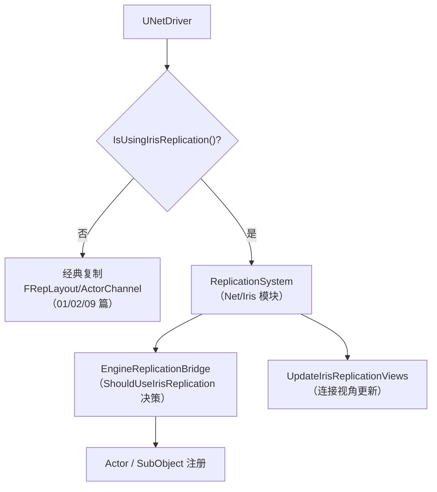
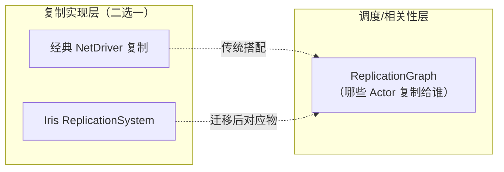
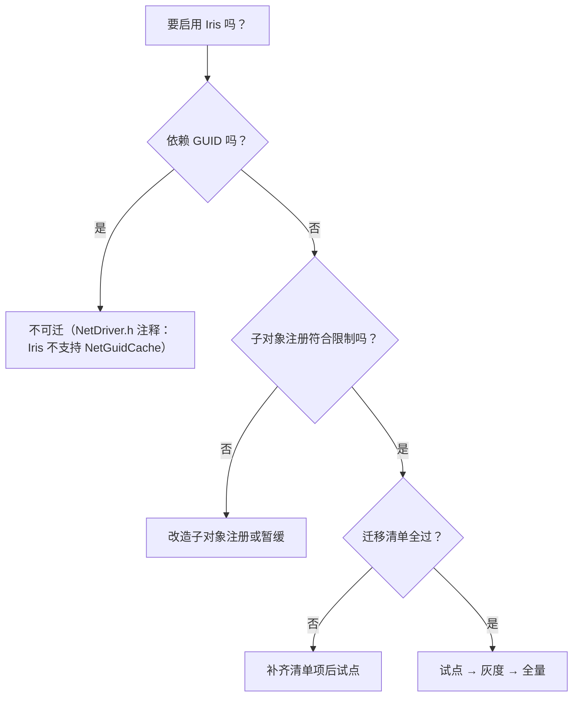

# 07 Iris 复制系统：使用、启用与迁移

> 版本基准：UE 5.8.0（本机 `Engine/Build/Build.version`：CL 55116800，分支 `++UE5+Release-5.8`）。
> 适用范围：UE 客户端/服务端 · 多人网络（Iris 复制系统的使用层配置、启用决策与迁移路径）。
> 事实边界：本文"本机核对"项来自只读检索本机 `C:\Program Files\Epic Games\UE_5.8\Engine`（`Source\Runtime\Net\Iris`、`Source\Runtime\Engine\Public\Net\Iris\ReplicationSystem\EngineReplicationBridge.h`、`Classes\Engine\NetDriver.h`、`Private\NetDriver.cpp`、`Plugins\Experimental\Iris\Iris.uplugin`）；工程级配置项与编辑器 UI 以目标版本为准，无法核对处标注"待核对"。Iris 内部实现（NetRefHandle、ReplicationBridge/State/Protocol、dirty state、serializer/data stream）的源码级深读见 [20-Iris复制源码.md](../12-引擎源码分析/20-Iris复制源码.md)，本文不重复其调用链。
> 官方参考：[Iris Replication System](https://dev.epicgames.com/documentation/en-us/unreal-engine/iris-replication-system)、[Migrate to Iris](https://dev.epicgames.com/documentation/en-us/unreal-engine/migrate-to-iris-in-unreal-engine)、[Unreal Engine 文档首页](https://dev.epicgames.com/documentation/en-us/unreal-engine)。
> 最后更新：2026-08-07（初稿）。

## 概述

**Iris** 是 UE 的**新一代复制系统**（实验性）：它重新实现了"服务器状态 → 客户端"的属性复制与对象实例化链路，目标是取代经典路径中 `UNetDriver`/`FRepLayout` 承载的复制实现。对大多数开发者的意义不是"重写代码"，而是**开关与迁移决策**：同样写 `Replicated` 属性与 RPC，底层走的序列化、注册、实例化链路不同，能力边界与调试手段也不同。

本机 5.8 关键证据（已核对）：

- 运行时模块：`Engine\Source\Runtime\Net\Iris`（核心在 `Private\Iris\ReplicationSystem\ReplicationSystem.cpp`）；
- 引擎接入：`Engine\Source\Runtime\Engine\Public\Net\Iris\ReplicationSystem\EngineReplicationBridge.h`（`ShouldUseIrisReplication(const UObject*)`，约 28 行）与 `Private\Net\Iris\ReplicationSystem\EngineReplicationBridge.cpp`；
- 驱动决策：`Engine\Source\Runtime\Engine\Classes\Engine\NetDriver.h` 的 `IsUsingIrisReplication()`（约 2014 行）、`UpdateIrisReplicationViews()`（约 2511 行）；`Private\NetDriver.cpp` 多处 `!IsUsingIrisReplication()` 分支（约 1326/1867 行）与 `IsUsingIrisReplication() && !ReplicationSystem` 的创建逻辑（约 1921 行）；
- 边界注释：`NetDriver.h`（约 1171/1185 行）明确"使用 Iris 复制时不支持 NetGuidCache/FNetworkGUIDs"；
- 插件形态：`Plugins\Experimental\Iris\Iris.uplugin`（实验性）。

本文与 01（复制基础）、02（RPC/属性同步）、05（ReplicationGraph）互补：前几篇讲"复制是什么、怎么写"，本文讲"Iris 是什么、怎么开、怎么迁、有什么限制"。

与 20 篇的分工：20 篇是**实现层深读**（ReplicationSystem 内部调用链、Bridge/State/Protocol、NetRefHandle、serializer/data stream、接收端实例化）；本文是**使用层指南**（启用决策、迁移清单、灰度流程、观测入口）。读本文遇到"为什么"就翻 20 篇，遇到"怎么办"留在本文。

阅读路径建议：先 01（复制基础）→ 02（RPC/属性同步）→ 05（ReplicationGraph 概念）→ 本文（Iris 决策与迁移）→ 12 章 20 篇（Iris 实现）→ 12 章 34 篇（ReplicationGraph 实现）→ 12 章 33 篇（UNetDriver/通道）。本文的"迁移映射表"依赖 20 篇与 34 篇的源码结论，若对"Filter/Prioritizer 到底映射什么"有疑问，回到 20 篇的迁移表核对。

## 核心概念表

| 概念 | 英文 | 说明（本机 5.8 依据） |
| --- | --- | --- |
| Iris | Iris Replication System | 新一代复制系统（实验性），`Source\Runtime\Net\Iris` |
| 复制系统 | ReplicationSystem | Iris 的核心运行时（`ReplicationSystem.cpp`），负责对象注册、dirty 状态、序列化与发送 |
| 复制桥接 | Replication Bridge | 引擎对象（Actor/SubObject）与 Iris 复制系统之间的适配层（`EngineReplicationBridge`） |
| 网络引用句柄 | NetRefHandle | Iris 中对象的网络引用标识（内部实现细节见 20 篇） |
| 过滤器 | Filter | 控制"对象复制给哪些连接"的规则（Iris 侧对应 ReplicationGraph 的节点/相关性） |
| 优先级器 | Prioritizer | 控制"对象按什么优先级发送"的规则（Iris 侧对应 ReplicationGraph 的优先级排序） |
| 经典路径 | Legacy Replication | 传统 `NetDriver` + `FRepLayout` + `ActorChannel` 复制实现 |
| 互斥边界 | Mutual Exclusion | 本机源码显示经典路径与 Iris 在 NetDriver 层二选一（`IsUsingIrisReplication` 分支） |

## 原理详解

### 4.1 Iris 在 5.8 的形态与接入点



接入点集中在 `UNetDriver`：`IsUsingIrisReplication()` 决定走哪条复制链路；`NetDriver.cpp` 1921 行附近在"使用 Iris 但尚未创建复制系统"时创建 `ReplicationSystem`；每帧视角更新走 `UpdateIrisReplicationViews`。`ShouldUseIrisReplication(const UObject*)` 是桥接层对"这个对象是否该用 Iris 复制"的决策入口。

### 4.2 启用与配置

Iris 的启用是**项目级开关 + 对象级决策**的组合：

- **项目级**：官方以 Project Settings 提供"Use Iris Replication"类开关（以目标版本 UI 为准，标注待核对），配合 `UE_WITH_IRIS` 编译条件（未启用 Iris 时相关代码被裁剪）；
- **对象级**：桥接层按对象类型/条件决定是否走 Iris（`ShouldUseIrisReplication`），因此工程可"部分对象走 Iris、部分走经典路径"过渡；
- **验证**：`IsUsingIrisReplication()` 分支与 `ReplicationSystem` 创建点（`NetDriver.cpp`）是判断当前构建是否真正启用 Iris 的源码依据。

> 注意：启用 Iris 会改变复制底层（句柄体系、实例化、序列化），不是"换一行配置就完事"，必须按 4.4 的迁移清单回归验证。

工程化落地的关键是把"启用"变成"可验证、可回退"的决策：先明确目标（性能/可扩展性收益），再按对象维度灰度，最后全量切换——每个阶段都有独立验收与回退预案（见下文"试点与灰度流程"）。

### 4.3.1 与 ReplicationGraph 的协作边界（补充）

ReplicationGraph 的节点图仍然负责"哪些 Actor 复制给谁"；Iris 替换的是"复制实现"。因此迁移 Iris 时**不需要重写 ReplicationGraph 图**，但要注意：ReplicationGraph 的类级复制参数（`FClassReplicationInfo` 的 `ReplicationPeriodFrame`/`ActorChannelFrameTimeout`/`NetPriority` 等，见 12 章 34 篇）与 Iris 的 Filter/Prioritizer 是两套"节奏与优先级"配置，迁移后要对照校准，避免"图说发、Iris 说不发"或节奏错配。

### 4.3 与经典复制、ReplicationGraph 的关系



本机源码显示的边界（与 20 篇结论一致）：

- **实现层互斥**：`NetDriver` 在经典路径与 Iris 之间二选一（`IsUsingIrisReplication` 分支）；Iris 下 `NetGuidCache/FNetworkGUIDs` 不支持（`NetDriver.h` 注释）；
- **调度层可共存**：ReplicationGraph 负责"哪些 Actor 复制给谁"的调度/相关性，Iris 负责"怎么序列化/实例化"；两者不是同层替代品，迁移时把"节点/网格兴趣/类级参数"映射为 Iris 侧的 Filter/Prioritizer 规则（映射表见 20 篇）；
- **迁移顺序**：先核对 20 篇的迁移映射，再在试点对象上开启 Iris，最后全量切换并回退演练。

### 4.4 迁移路径与兼容性清单

从经典路径迁移到 Iris 的**代码侧要求**（结合 20 篇与官方 Migrate to Iris 文档）：

| 关注点 | 经典路径 | Iris 侧要求/差异 |
| --- | --- | --- |
| 属性复制 | `Replicated` + `DOREPLIFETIME` + `OnRep` | 语法基本兼容，序列化底层替换（serializer/data stream） |
| RPC | Server/Client/Multicast | 兼容，但注册与派发走 Iris 通道 |
| 条件复制 | `COND_*` | 对应关系需按 Iris 过滤能力核对（部分条件语义有差异，待核对） |
| 数组复制 | Fast Array（`FFastArraySerializer`） | 需核对 Iris 对 Fast Array 的支持与序列化差异 |
| 子对象 | 注册子对象列表 | Iris 对子对象注册有限制（列表边界见 20 篇），动态创建子对象需符合注册规则 |
| 相关性/优先级 | ReplicationGraph 节点/网格/类级参数 | 映射为 Iris Filter/Prioritizer |
| 网络 GUID | NetGuidCache / FNetworkGUID | Iris 下不支持（`NetDriver.h` 注释），依赖 GUID 的代码需改造 |
| 调试 | `net.` 系列命令/通道日志 | Iris 使用自己的调试/日志通道（以 20 篇与官方文档为准） |

### 4.5 运行时链路一句话回顾

启用后每帧：`ReplicationSystem` 维护对象注册表与 dirty 状态 → 按连接视角（`UpdateIrisReplicationViews`）与 Filter/Prioritizer 选出待发对象 → serializer/data stream 序列化 → 接收端按 NetRefHandle 实例化/更新对象。调用链细节、`UE_WITH_IRIS` 条件与接收端实例化见 20 篇，本文只负责"决策与迁移"视角。

## 代码 / 示例

### 5.1 核对当前构建是否启用 Iris（验证命令）

```powershell
$UE = 'C:\Program Files\Epic Games\UE_5.8\Engine'
# 模块与接入点存在性
Test-Path "$UE\Source\Runtime\Net\Iris\Private\Iris\ReplicationSystem\ReplicationSystem.cpp"
Test-Path "$UE\Source\Runtime\Engine\Public\Net\Iris\ReplicationSystem\EngineReplicationBridge.h"
# 启用决策与分支
rg -n "IsUsingIrisReplication|ShouldUseIrisReplication|UpdateIrisReplicationViews" "$UE\Source\Runtime\Engine\Classes\Engine\NetDriver.h" "$UE\Source\Runtime\Engine\Private\NetDriver.cpp"
```

### 5.2 对象级启用决策（示意）

> 节选/示意：`ShouldUseIrisReplication` 为引擎真实函数（`EngineReplicationBridge.h`），自定义决策逻辑以目标版本 API 为准。

```cpp
// 示意：桥接层按对象类型决定是否走 Iris（真实决策入口为引擎的 ShouldUseIrisReplication）
// 工程侧一般通过项目设置/配置控制，而不是直接改桥接层。
bool bUseIrisForActor = /* 目标版本项目设置与对象条件 */;
```

### 5.3 迁移试点配置（示意）

```ini
; 示意：迁移试点期只对指定对象/关卡启用，其余保持经典路径
; 具体键名与取值以目标版本官方文档为准（待核对）
[/Script/Engine.NetDriver]
; bUseIrisReplication=...
```

### 5.4 观测与调试

Iris 的调试与经典路径不同：经典路径看 `net.` 系列命令与通道日志，Iris 看自己的日志通道与调试工具（以 20 篇与目标版本官方文档为准，此处只给验证入口）：

```powershell
$UE = 'C:\Program Files\Epic Games\UE_5.8\Engine'
# 模块与决策入口存在性（本机已核对）
Test-Path "$UE\Source\Runtime\Net\Iris\Private\Iris\ReplicationSystem\ReplicationSystem.cpp"
Test-Path "$UE\Source\Runtime\Engine\Public\Net\Iris\ReplicationSystem\EngineReplicationBridge.h"
# 决策分支与视角更新
rg -n "ShouldUseIrisReplication" "$UE\Source\Runtime\Engine\Public\Net\Iris\ReplicationSystem\EngineReplicationBridge.h"
rg -n "IsUsingIrisReplication|UpdateIrisReplicationViews" "$UE\Source\Runtime\Engine\Classes\Engine\NetDriver.h"
```

> 说明：Iris 日志通道名、`net.iris.*` 命令与 Insights 集成以目标版本为准（待核对）；20 篇已给出实现层的调试边界。

## 迁移检查清单

切换 Iris 前逐项勾选（工程级清单，非引擎断言）：

- [ ] 目标版本确认：锁定 UE 版本并确认 Iris 开关位置与 `UE_WITH_IRIS` 构建条件；
- [ ] 对象盘点：列出试点对象的复制属性/RPC/子对象清单，标注 Fast Array、`COND_*`、GUID 依赖；
- [ ] 子对象注册核对：确认试点对象符合 Iris 子对象注册限制（见 20 篇），动态子对象有注册路径；
- [ ] GUID 依赖清理：`NetGuidCache/FNetworkGUIDs` 在 Iris 下不支持（本机 `NetDriver.h` 注释），相关代码改造或列入不回退项；
- [ ] 迁移映射：ReplicationGraph 节点/网格/类级参数 → Iris Filter/Prioritizer 映射表（20 篇）落地并评审；
- [ ] 回归用例：丢包/延迟/重连/人数峰值场景用例就绪（联机验收与机器人压测专题）；
- [ ] 性能基线：迁移前后同场景 CPU/带宽/内存数据可对比；
- [ ] 回退预案：一键回退经典路径的配置与验证步骤。

## 试点与灰度流程


每个阶段都执行：迁移清单核对 → 联机回归（丢包/延迟/重连）→ 性能对比 → 结论（继续/回退）。Iris 是实验性系统，**可回退性比性能收益更重要**。

## 启用决策树



决策树的目的：把"能不能迁"从感觉变成清单——GUID 依赖与子对象注册限制（20 篇）是硬门槛，其余是可补齐的工程项。

## 常见误区

- **误区一：Iris 是 ReplicationGraph 的替代品**——不是，两者分层不同（实现层 vs 调度层），迁移后 ReplicationGraph 图仍可保留；
- **误区二：改了开关就等于迁移完成**——启用只是开始，Fast Array/COND_*/子对象/GUID 等差异必须逐项回归；
- **误区三：Iris 下调试命令和经典路径一样**——调试通道与工具不同（以 20 篇与官方文档为准）；
- **误区四：混用两条链路没成本**——试点期混用可行，但长期并存会增加维护与调试复杂度，正式切换尽量统一。
- **误区五：Iris 会自动提升性能**——Iris 提供更优的底层模型，但收益取决于对象注册质量、Filter/Prioritizer 配置与序列化效率，迁移后必须用基线数据验证；
- **误区六：升级引擎后 Iris 配置不用动**——Iris 是实验性系统，开关位置、限制与工具随版本变化，每次升级都要重跑迁移检查清单。

把"误区"当作验收视角：每个误区对应一条验收项（调试命令可用性、性能对比、版本回归），写进团队迁移 SOP，避免把"看起来能跑"当成"迁移完成"。

## 术语补充表

| 术语 | 英文 | 一句话说明 |
| --- | --- | --- |
| 复制系统 | ReplicationSystem | Iris 核心运行时（`ReplicationSystem.cpp`），管注册、dirty、序列化与发送 |
| 复制桥接 | EngineReplicationBridge | 引擎对象与 Iris 的适配层，`ShouldUseIrisReplication` 决策入口 |
| 视角更新 | Iris Replication Views | `UpdateIrisReplicationViews`：按连接视角更新复制视图 |
| 对象注册 | Object Registration | 对象进入/退出复制系统的注册流程（限制见 20 篇） |
| 迁移映射 | Migration Mapping | ReplicationGraph 节点/网格/类级参数 → Iris Filter/Prioritizer 的对应关系 |
| 回退预案 | Rollback Plan | 一键回到经典路径的配置与验证步骤（实验系统必备） |

> 实现层术语（NetRefHandle、Replication State/Protocol、serializer/data stream）见 20 篇，本文不展开。

## 最佳实践

1. **先读 20 篇再动手**：Iris 的注册/序列化/实例化差异都在源码层面，先建立实现层认知，避免把迁移当成"改个开关"。
2. **试点 + 灰度**：先对"无子对象、无 GUID 依赖、复制简单的 Actor"开 Iris，验证后再扩展；保留一键回退（经典路径开关）。
3. **迁移清单逐项核对**：按 4.4 的表逐项检查：Fast Array、COND_*、子对象注册、RPC、OnRep、GUID 依赖。
4. **网络回归测试**：迁移后跑完整的联机验收（丢包/延迟/重连场景，见 游戏测试与质量 的联机验收与机器人压测专题），Iris 的时序与经典路径有差异，不能只看"能连上"。
5. **性能对比基线**：迁移前后记录同场景的服务器复制 CPU、带宽与客户端处理耗时，用数据决定是否全量切换。
6. **记录版本差异**：Iris 仍为实验性，每次升级引擎都要回归；在工程 Wiki 或本文对应章节登记"目标版本开关位置与已知差异"。

## 常见问题 FAQ

### Q1：Iris 和 ReplicationGraph 是竞争关系吗？

不是同层竞争：ReplicationGraph 管"复制哪些 Actor 给谁"（调度/相关性），Iris 管"怎么复制"（实现层）。经典路径 + ReplicationGraph 是传统搭配；Iris + ReplicationGraph 调度层可继续使用，迁移时把图节点规则映射为 Iris Filter/Prioritizer（见 20 篇）。

### Q2：我的代码要重写吗？

大部分不需要：`Replicated` 属性、RPC、OnRep 的写法基本兼容。需要核对的是 Fast Array、COND_* 语义、子对象注册与 GUID 依赖这些"底层行为差异"项。

### Q3：怎么知道当前构建真的在用 Iris？

用 5.1 的命令核对模块存在性，再在源码/日志中确认 `IsUsingIrisReplication()` 分支与 `ReplicationSystem` 创建点；运行时可通过 Iris 日志通道观察（以目标版本为准）。

### Q4：Iris 稳定吗？生产项目能用吗？

Iris 在 UE5.8 仍是实验性系统（`Plugins\Experimental\Iris`），官方持续演进；生产使用必须"试点 + 回归 + 可回退"，并锁定引擎版本，升级前重新验收。

### Q5：Iris 支持 Fast Array 吗？

语法层面兼容，但序列化底层不同；数组复制在 Iris 下是否有性能/行为差异需按目标版本核对（标注待核对，以官方文档与 20 篇为准）。

### Q6：Iris 下还能用 NetGuidCache 吗？

不能。本机 `NetDriver.h` 注释明确"使用 Iris 复制时不支持 NetGuidCache/FNetworkGUIDs"；依赖 GUID 的代码（如自定义引用解析）需要改造。

### Q7：迁移后网络表现和之前不一样怎么办？

先区分"行为差异"与"性能差异"：行为差异查迁移清单（COND_*、子对象、Fast Array）；性能差异用基线对比定位（带宽/CPU/延迟），必要时调整 Filter/Prioritizer 与发送频率。

### Q8：Iris 能只对部分对象启用吗？

可以走对象级决策过渡（`ShouldUseIrisReplication` 类入口），但混用会增加复杂度；建议试点期混用、正式切换尽量统一，降低"两套链路并存"的维护成本。

### Q9：官方资料在哪？

Iris Replication System 与 Migrate to Iris 官方文档（文首链接）是权威；本机 `Source\Runtime\Net\Iris` 与 `EngineReplicationBridge.cpp` 是实现权威；20 篇是本仓库的源码级深读。

### Q10：什么时候不该用 Iris？

当项目高度依赖经典路径特性（GUID 引用、成熟的自定义序列化、海量子对象注册）且没有迁移预算时，保持经典路径 + ReplicationGraph 是更稳妥的选择；Iris 的收益（性能与可扩展性）需要在可迁移的前提下兑现。

### Q11：迁移检查清单要多久做一次？

每次引擎升级都要重跑"迁移检查清单"：Iris 是实验性系统，开关位置、子对象限制与 Filter/Prioritizer 语义都可能变化；升级后先核对目标版本文档与 20 篇登记的实现边界，再决定是否延续使用。

### Q12：Iris 迁移会影响 DS 平台化（容器/灰度）吗？

不影响平台层（生命周期、健康检查、调度），但会影响"联机验收"与"容量评估"：Iris 下的带宽/CPU 曲线与经典路径不同，压测容量模型要基于 Iris 实际数据重新标定（见 游戏测试与质量 的机器人压测与容量评估专题）。

### Q13：迁移前后性能基线怎么对比才可信？

用同一场景、同一机器人数量与行为脚本，分别记录：服务器复制 CPU、每连接带宽、客户端接收/实例化耗时、丢包重连表现；每个指标跑多轮取中位数，并保存基线报告（可回放场景见 游戏测试与质量 的回放/评测专题），供后续版本回归对比。

## 关联阅读

- [01-网络架构与复制基础.md](./01-网络架构与复制基础.md)：复制体系的地基（NetMode/NetRole/Actor 复制/连接与通道），Iris 替换的是其中"实现层"。
- [02-RPC与属性同步.md](./02-RPC与属性同步.md)：属性复制与 RPC 的写法规格——Iris 下写法基本兼容。
- [05-ReplicationGraph兴趣管理.md](./05-ReplicationGraph兴趣管理.md)：调度/相关性层，迁移时映射为 Iris Filter/Prioritizer。
- [06-在线子系统与会话匹配.md](./06-在线子系统与会话匹配.md)：会话层与复制层的关系（Iris 不改变会话/连接流程）。
- [20-Iris复制源码](../12-引擎源码分析/20-Iris复制源码.md)：Iris 内部实现、迁移映射表与限制的源码级深读（本文的上游依据）。
- [34-ReplicationGraph源码](../12-引擎源码分析/34-ReplicationGraph源码.md)：ReplicationGraph 插件源码，理解调度层实现后再迁移更稳。
- [09-网络复制与RPC源码](../12-引擎源码分析/09-网络复制与RPC源码.md)：经典路径源码（FRepLayout/通道），用于对照差异。

## 更新日志

- 2026-08-07：初稿创建。已核对本机 UE5.8 的 Iris 模块、`EngineReplicationBridge.h`（`ShouldUseIrisReplication`）、`NetDriver.h`（`IsUsingIrisReplication`/`UpdateIrisReplicationViews`/GUID 边界注释）与 `NetDriver.cpp` 分支；项目设置开关、COND_* 语义与 Fast Array 差异标注"待核对"。
