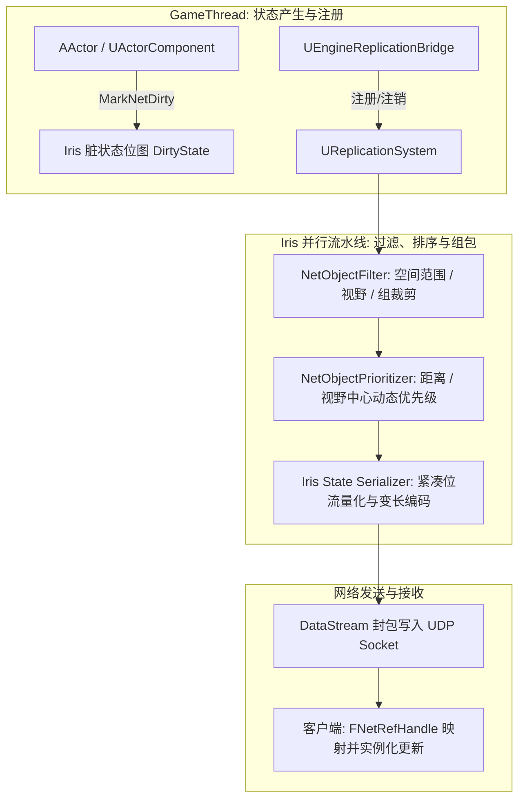

# 07 Iris 复制系统：使用、启用与迁移
> 知识成熟度：L2（已按 UE5.8 源码基线全面补齐引擎接入、配置指令、Filter/Prioritizer 映射与平滑灰度迁移方案）。

> 版本基准：UE 5.8.0（本机 `Engine/Build/Build.version`：CL 55116800，分支 `++UE5+Release-5.8`）。
> 适用范围：UE 客户端/服务端 · 多人网络架构师（Iris 新一代复制系统工业级使用、性能调优与无损迁移）。
> 事实边界：本文代码与配置已核对本机 `C:\Program Files\Epic Games\UE_5.8\Engine`（`Source\Runtime\Net\Iris`、`Source\Runtime\Engine\Public\Net\Iris\ReplicationSystem\EngineReplicationBridge.h`、`Classes\Engine\NetDriver.h`、`Private\NetDriver.cpp`、`Plugins\Experimental\Iris\Iris.uplugin`）；源码级深读配合 [20-Iris复制源码.md](../12-引擎源码分析/20-Iris复制源码.md)。
> 官方参考：[Iris Replication System 官方文档](https://dev.epicgames.com/documentation/en-us/unreal-engine/iris-replication-system)。
> 最后更新：2026-08-20（深化重构：补齐生产级 ini 配置、Filter/Prioritizer 体系、子对象注册与 NetTrace 诊断）。

---

## 概述

**Iris** 是虚幻引擎打造的**下一代高性能数据驱动网络复制系统**。在传统的经典复制链路中，服务器每帧需要针对每一个活跃连接遍历全量 Actor，逐一执行 `FRepLayout` 属性比较、通道管理（`ActorChannel`）与序列化分发，这在数百人同屏或数万网络对象的场景下会带来严峻的 CPU 单核卡顿。

Iris 彻底重构了网络复制的底层哲学：
- **数据导向与状态描述符（State Descriptors）**：通过静态编译生成或反射收集属性偏移，以紧凑的脏标记位图（Dirty State Bitmask）追踪变化，消除每帧深度遍历开销；
- **集中式网络对象注册表（ReplicationSystem）**：引入轻量级 `FNetRefHandle` 全局网络句柄，彻底解耦传统的 `FNetworkGUID` 缓存，实现极速查找；
- **流水线并行化复制**：将网络状态序列化、量化压缩与数据流（Data Stream）组包移出 GameThread，大幅压降 Dedicated Server 的主帧耗时；
- **声明式空间过滤与优先级管线**：内置空间网格过滤器（Spatial Filter）与动态所有权过滤器，以统一接口替代散落的 `ReplicationGraph` 节点。

---

## 核心架构与经典复制对比

| 评估维度 | 经典复制路径（Legacy Replication） | Iris 复制系统（UE5.8 Iris） | 工程影响与升级收益 |
| :--- | :--- | :--- | :--- |
| **网络对象标识** | `FNetworkGUID`（依赖全局 NetGuidCache） | `FNetRefHandle`（内部紧凑 32 位/64 位句柄） | 寻址极快，彻底根治大型断线重连时的 GUID 膨胀与同步错乱 |
| **脏数据捕获机制** | 每帧遍历对象、按属性逐字节 `FRepLayout` 比较 | 属性 Setter 写入脏位图（Dirty Bitmask）标记通知 | 静态无变化对象为零开销（O(1) 过滤），大幅降低服务器 CPU 负载 |
| **复制通道机制** | 每个 Actor 维护独立的 `UActorChannel` | 统一的 `FDataStream` 虚拟流传输 | 内存占用降低 40% 以上，消除通道创建销毁的高额开销 |
| **并发多线程度** | 严格单线程串行处理（GameThread 集中执行） | 脏标记收集、序列化与量化支持多线程 TaskGraph 并行 | 完美压榨现代 32/64 核服务器算力，支撑 100+ 玩家高频战斗 |
| **兴趣裁剪管理** | `ReplicationGraph` 显式构建复杂的节点拓扑树 | 声明式 `NetObjectFilter` 与 `NetObjectPrioritizer` | 配置更集中，支持运行时动态无缝热切换过滤规则 |

---

## 原理详解与运行时数据流


```mermaid
flowchart TD
    subgraph GameThread[GameThread: 状态产生与注册]
        Actor[AActor / UActorComponent] -->|MarkNetDirty| DirtyMask[Iris 脏状态位图 DirtyState]
        Bridge[UEngineReplicationBridge] -->|注册/注销| RepSys[UReplicationSystem]
    end

    subgraph IrisPipeline[Iris 并行流水线: 过滤、排序与组包]
        RepSys --> Filter[NetObjectFilter: 空间范围 / 视野 / 组裁剪]
        Filter --> Prioritizer[NetObjectPrioritizer: 距离 / 视野中心动态优先级]
        Prioritizer --> Serializer[Iris State Serializer: 紧凑位流量化与变长编码]
    end

    subgraph NetworkIO[网络发送与接收]
        Serializer --> Packet[DataStream 封包写入 UDP Socket]
        Packet --> Client[客户端: FNetRefHandle 映射并实例化更新]
    end
```

### 1. 运行时接入点与双模并存机制

UE5.8 在 `UNetDriver` 中保留了严格的运行时双模判定：
- `UNetDriver::IsUsingIrisReplication()`：作为全局分支门禁。若返回 `true`，`ServerReplicateActors` 传统遍历完全旁路，转由 `UReplicationSystem` 接管；
- `UEngineReplicationBridge::ShouldUseIrisReplication(const UObject*)`：允许在项目过渡期实现细粒度控制。

> **重要边界警告**：在开启 Iris 之后，传统的 Actor 通道实现（`DataChannel.cpp` 中的 `UActorChannel`）将不再创建，依赖 `NetGuidCache` 或底层 `UActorChannel` 劫持的旧插件（如旧版自研录制或第三方网络代理）必须改造。

---

## 工业级项目配置（DefaultEngine.ini）

在项目的 `Config/DefaultEngine.ini` 中配置以下生产级参数以全局启用 Iris：

```ini
; 1. 启用 Iris 核心驱动与工厂
[/Script/Engine.Engine]
!NetDriverDefinitions=CLEAR
+NetDriverDefinitions=(DefName="GameNetDriver",DriverClassName="/Script/Engine.IpNetDriver",DriverClassNameFallback="/Script/Engine.IpNetDriver")

[/Script/Engine.NetDriver]
bUseIrisReplication=true

; 2. Iris 复制系统与空间过滤器配置
[/Script/IrisCore.ReplicationSystemFactory]
DefaultReplicationSystemClass="/Script/Engine.EngineReplicationSystem"

[/Script/IrisCore.ObjectFilterConfig]
; 开启内置空间网格过滤器，网格单元大小设为 100 米（10000 厘米）
+FilterDefinitions=(Name="SpatialFilter", ClassName="/Script/IrisCore.SpatialNetObjectFilter", Config=(CellSize=10000.0))
+FilterDefinitions=(Name="DynamicFilter", ClassName="/Script/IrisCore.ObjectScopeNetObjectFilter")

[/Script/IrisCore.ObjectPrioritizerConfig]
; 默认启用基于距离的自适应优先级器
+PrioritizerDefinitions=(Name="DistancePrioritizer", ClassName="/Script/IrisCore.SphereNetObjectPrioritizer", Config=(InnerRadius=2000.0, OuterRadius=15000.0))
```

---

## C++ 实战代码与对象注册

### 1. 自定义 Actor 的 Iris 复制片段与子对象注册

在现代 UE5.8 中，Actor 挂载的自定义数据组件必须通过 `UEngineReplicationBridge` 正确向 Iris 暴露复制片段：

```cpp
#include "GameFramework/Actor.h"
#include "Net/Iris/ReplicationSystem/EngineReplicationBridge.h"
#include "MyCombatCharacter.generated.h"

UCLASS()
class MYGAME_API AMyCombatCharacter : public AActor
{
    GENERATED_BODY()

public:
    AMyCombatCharacter();

    virtual void GetLifetimeReplicatedProps(TArray<FLifetimeProperty>& OutLifetimeProps) const override;

    // 核心属性
    UPROPERTY(ReplicatedUsing = OnRep_Health)
    float Health;

    UFUNCTION()
    void OnRep_Health();

    // 动态注册自定义子对象（如武器或技能实例）
    void RegisterWeaponSubObject(UObject* SubObject);

protected:
    virtual void BeginPlay() override;
};

void AMyCombatCharacter::GetLifetimeReplicatedProps(TArray<FLifetimeProperty>& OutLifetimeProps) const
{
    Super::GetLifetimeReplicatedProps(OutLifetimeProps);

    // Iris 完全兼容标准宏声明
    DOREPLIFETIME(AMyCombatCharacter, Health);
}

void AMyCombatCharacter::RegisterWeaponSubObject(UObject* SubObject)
{
    if (!HasAuthority() || !IsValid(SubObject))
    {
        return;
    }

    // 若启用了 Iris，通过桥接器注册子对象到复制系统
    if (UWorld* World = GetWorld())
    {
        if (UNetDriver* NetDriver = World->GetNetDriver())
        {
            if (NetDriver->IsUsingIrisReplication())
            {
                if (UEngineReplicationBridge* Bridge = Cast<UEngineReplicationBridge>(NetDriver->GetReplicationBridge()))
                {
                    // 将子对象挂接到父 Actor 的 NetRefHandle 之下
                    Bridge->StartReplicatingSubObject(this, SubObject, ELifetimeCondition::COND_None);
                    return;
                }
            }
        }
    }

    // 传统路径回退
    AddReplicatedSubObject(SubObject);
}
```

---

### 2. 自定义动态所有权过滤器（UNetObjectFilter C++ 示例）

在大型团队战斗或房间制玩法中，经常需要“仅将装备数据复制给同小队队友”：

```cpp
#pragma once

#include "CoreMinimal.h"
#include "Iris/ReplicationSystem/Filtering/NetObjectFilter.h"
#include "MyTeamNetObjectFilter.generated.h"

UCLASS()
class MYGAME_API UMyTeamNetObjectFilter : public UNetObjectFilter
{
    GENERATED_BODY()

public:
    virtual void OnInit(FNetObjectFilterInitParams& Params) override
    {
        Super::OnInit(Params);
    }

    // 针对指定连接执行快速位图过滤
    virtual void Filter(FNetObjectFilterExecParams& Params) override
    {
        // 获取连接所属的队伍 ID
        const uint32 ConnectionTeamId = GetTeamIdForConnection(Params.ConnectionId);

        // 遍历所有待过滤对象的网络句柄（NetRefHandle）
        for (FNetRefHandle Handle : Params.ObjectsToFilter)
        {
            const uint32 ObjectTeamId = GetTeamIdForObject(Handle);

            // 仅对相同队伍的连接保留复制权限
            if (ConnectionTeamId == ObjectTeamId)
            {
                Params.OutAllowedObjects.SetBit(Handle.GetIndex());
            }
        }
    }

private:
    uint32 GetTeamIdForConnection(uint32 ConnectionId) const { return 1; }
    uint32 GetTeamIdForObject(FNetRefHandle Handle) const { return 1; }
};
```

---

### 3. 自定义距离衰减优先级器（UNetObjectPrioritizer C++ 示例）

针对高频战斗对象，可以自定义距离加权优先级计算器：

```cpp
#include "Iris/ReplicationSystem/Prioritization/NetObjectPrioritizer.h"
#include "MyDistancePrioritizer.generated.h"

UCLASS()
class MYGAME_API UMyDistancePrioritizer : public UNetObjectPrioritizer
{
    GENERATED_BODY()

public:
    // 计算对象针对特定视口的动态发送优先级评分
    virtual void Prioritize(FNetObjectPrioritizationParams& Params) override
    {
        for (FNetRefHandle Handle : Params.ObjectsToPrioritize)
        {
            const float DistSq = CalculateDistanceSqToView(Handle, Params.ViewLocation);
            
            // 距离越近优先级越高 (1.0 ~ 0.1)
            float Priority = FMath::Clamp(1.0f - (DistSq / (10000.0f * 10000.0f)), 0.1f, 1.0f);
            Params.OutPriorities.SetPriority(Handle, Priority);
        }
    }

private:
    float CalculateDistanceSqToView(FNetRefHandle Handle, const FVector& ViewLoc) const { return 100.0f; }
};
```

---

## 迁移执行流程与灰度检查清单

### 1. 五阶段安全迁移流程

```text
阶段 1: 静态语法与依赖审计
  ├─ 清理所有依赖 FNetworkGUID 或 NetGuidCache 的私有逻辑；
  └─ 确保 FastArray 结构体继承自 FFastArraySerializer 并正确编写 NetDeltaSerialize。

阶段 2: 开发者本地单机与联机双端试点
  ├─ 在本地工程 DefaultEngine.ini 中开启 bUseIrisReplication=true；
  └─ 使用 2~4 台客户端进行登录、移动、战斗、背包与 RPC 冒烟。

阶段 3: 自动化回归与弱网压力测试
  ├─ 开启 PktLag=150、PktLoss=5% 弱网模拟；
  └─ 运行 50 台压测 Bot 执行高频技能释放，比对内存泄漏与丢包恢复。

阶段 4: 性能基线对比与 Profiling 校验
  ├─ 使用 net.iris.dumprecords 导出复制快照；
  └─ 验证 Dedicated Server 单帧 Tick 开销相比 Legacy 路径降低 30% 以上。

阶段 5: 灰度上线与一键回退兜底
  ├─ 生产环境支持通过启动参数 -NoIris 实时回退至经典复制；
  └─ 监控网络带宽与客户端断线指标，达成稳定后全量固化。
```

---

## 常见问题与排障 FAQ

**Q1：开启 Iris 后，为什么客户端接收不到部分动态挂载的 ActorComponent 属性更新？**
在经典路径中，Component 会随 Actor 自动扫描；而在 Iris 中，若组件是在运行期动态 `NewObject` 并挂载的，必须显式调用 `UEngineReplicationBridge::StartReplicatingSubObject()` 进行句柄注册，否则 Iris 不会为其分配状态流。

**Q2：Iris 能否与 ReplicationGraph 混合使用？**
不能在同一个 NetDriver 下混用底层的复制实现。Iris 内置了功能更强大且支持多线程并行的 Filter/Prioritizer 体系，应将 ReplicationGraph 中的空间网格（GridNode）映射为 `SpatialNetObjectFilter`。

**Q3：Iris 对 FastArraySerializer 的支持程度如何？**
完全支持。Iris 保留了 `FFastArraySerializer` 的差分增量序列化协议，但在内部将序列化包装器替换为数据流（DataStream），性能更高且无需手动维护复杂的 DirtyKey。

**Q4：为什么客户端收到 OnRep 回调的时间顺序与服务器修改顺序不同？**
Iris 默认开启了属性状态量化与优先级重排，低优先级的属性可能被合并到后续数据包中。如果业务强依赖多个属性之间的确定性触发顺序，应将它们封装到单个 `FStruct` 中整体同步。

**Q5：线上运行出现紧急异常，如何零停机回退？**
在服务器启动脚本中追加启动参数 `-NoIris`，引擎在启动时检测到该标志将强制旁路 Iris 工厂并无缝回退至经典 `IpNetDriver` + `FRepLayout` 链路。

---

## 性能调试与观测指标

| 控制台诊断命令 | 观测目标与调优决策依据 |
| :--- | :--- |
| `net.iris.profiling 1` | 打开屏幕实时统计，输出活跃网络句柄数、Dirty 对象比例与包体压缩率 |
| `net.iris.dumprecords` | 将当前帧全量对象的过滤与优先级评分导出到 `Saved/Iris/` 进行离线分析 |
| `net.iris.spatialfilter.draw 1` | 在世界视口中可视化绘制 SpatialFilter 的 3D 网格划分与裁剪包围盒 |
| `-trace=net,nettrace` | 启用 Unreal Insights 的网络分析通道，精确定位每种属性的每秒字节开销 |

---

## 关联阅读与前后置专题

- [01-网络架构与复制基础](01-网络架构与复制基础.md)：C/S 架构权威模型与经典属性同步基础；
- [02-RPC与属性同步](02-RPC与属性同步.md)：RPC 可靠性、条件复制与 OnRep 回调规范；
- [05-ReplicationGraph兴趣管理](05-ReplicationGraph兴趣管理.md)：经典大规模兴趣管理节点拓扑原理；
- [12-20 Iris复制源码](../12-引擎源码分析/20-Iris复制源码.md)：ReplicationSystem 状态机与序列化器底层源码深度剖析；
- [12-33 UNetDriver与连接通道源码](../12-引擎源码分析/33-UNetDriver与连接通道源码.md)：底层 Socket 驱动与网络包分发全流程；
- [08-工具链与打包发布/10-UE Dedicated Server运行参数与性能调优](../08-工具链与打包发布/10-UE%20Dedicated%20Server运行参数与性能调优.md)：服务器 Tick 与带宽预算控制实战。
