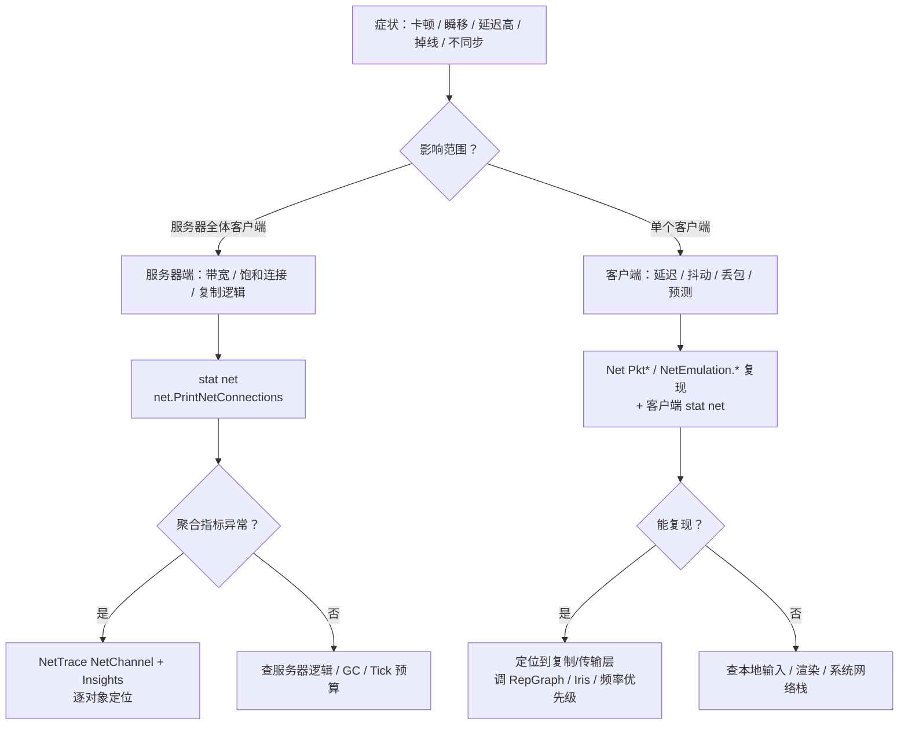
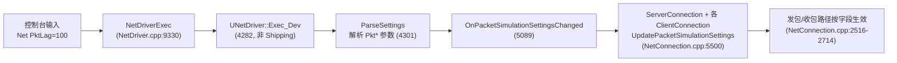
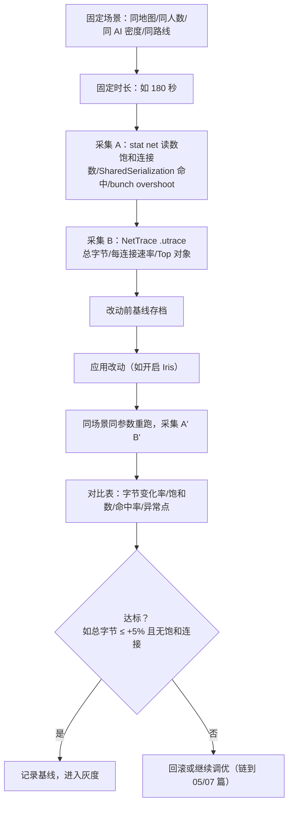

# 08 网络调试与性能分析

> 版本基准：UE 5.8.0（本机 `Engine/Build/Build.version`：CL 55116800，分支 `++UE5+Release-5.8`）。
> 适用范围：UE 客户端/服务端 · 多人网络（联机问题的定位方法论、网络仿真、统计命令、NetTrace/Unreal Insights、带宽与性能基线）。
> 事实边界：本文"本机核对"项来自只读检索本机 `C:\Program Files\Epic Games\UE_5.8\Engine`（`Source\Runtime\Engine\Private\NetConnection.cpp`、`Private\NetDriver.cpp`、`Private\Net\NetEmulationHelper.cpp`、`Private\DataChannel.cpp`、`Classes\Engine\NetDriver.h`、`Classes\Engine\NetConnection.h`、`Source\Runtime\Net\Core\Public\Net\Core\Trace\NetTrace.h`、`...\Private\Net\Core\Trace\Reporters\NetTraceReporter.cpp` 等）；编辑器 UI、官方文档中的命令写法若无法在本机核对，标注"待核对"并以官方文档为准。各命令与统计项均在行号级给出源码依据，便于在目标版本复查。
> 官方参考：[Unreal Insights](https://dev.epicgames.com/documentation/en-us/unreal-engine/unreal-insights)、[网络调试文档](https://dev.epicgames.com/documentation/en-us/unreal-engine/networking-and-multiplayer)、[Unreal Engine 文档首页](https://dev.epicgames.com/documentation/en-us/unreal-engine)。
> 最后更新：2026-08-07（初稿）。

## 概述

联机问题（卡顿、瞬移、高延迟、掉线、不同步）的定位不能靠猜：UE 提供了从"传输层仿真"到"逐对象复制开销"的一整条可观测链路。本文是这条链路的**使用层地图**：

- **先定性**：症状属于哪一层（表现层 / 复制逻辑 / 传输层 / 系统网络）；
- **再复现**：用网络仿真（`Pkt*` 参数、`NetEmulation.*` 命令）在本地制造弱网；
- **后量化**：用 `stat net`、`net.PrintNetConnections` 看聚合统计，用 NetTrace（`NetChannel` 通道）+ Unreal Insights 看逐对象细节；
- **最后基线化**：任何优化（Iris 迁移、ReplicationGraph 调整、频率/优先级改动）都以固定场景的基线对比验收。

与既有文档的分工：12 章 [33-UNetDriver与连接通道源码](../12-引擎源码分析/33-UNetDriver与连接通道源码.md) 讲连接/通道/超时的**实现**，[09-网络复制与RPC源码](../12-引擎源码分析/09-网络复制与RPC源码.md) 讲复制管线的**实现**；本目录 01/02/03/05/07 篇讲复制、同步、预测、RepGraph、Iris 的**写法与开关**；本文讲"**出了问题怎么查、改了东西怎么测**"，所有命令与统计项均给出本机 5.8 源码依据。

图释：先按"影响范围"分流到服务器端或客户端，用聚合统计（`stat net`）缩小范围，再用 NetTrace 下钻到对象级；仿真用于复现与回归，基线与对比用于验收改动。

## 核心概念表

| 概念 | 英文 | 说明（本机 5.8 依据） |
| --- | --- | --- |
| 网络仿真 | Packet Simulation | 在 NetDriver 层模拟延迟/抖动/丢包/乱序/重复；`FPacketSimulationSettings` 为 `UNetConnection` 成员（NetConnection.h 约 908 行），字段使用见 NetConnection.cpp 2516-2714 |
| 仿真编译门 | DO_ENABLE_NET_TEST | `NetDriver.h:450`：`!(UE_BUILD_SHIPPING)`，**Shipping 构建编译期关闭仿真** |
| 传统 exec | `Net PktLag=...` | `NetDriverExec`（NetDriver.cpp:9330）路由 `Net <驱动名> <命令>` → `UNetDriver::Exec_Dev`（4282）→ `FPacketSimulationSettings::ParseSettings`（4301） |
| 新式命令 | `NetEmulation.*` | 5.8 的 `FAutoConsoleCommand` 系列（NetEmulationHelper.cpp:49-359），含预置 Profile、RPC 定向丢弃、`PktLagMin/PktLagMax` |
| 统计组 | STATGROUP_Net | `stat net` 显示；计数器注册于 NetConnection.cpp:131-134、NetDriver.cpp:159-173、DataChannel.cpp:62-64/3035 |
| 连接清单 | `net.PrintNetConnections` | NetDriver.cpp:9375，打印全部连接：ConnectionId/ViewTarget/NetId/FullDescription |
| 网络追踪 | NetTrace | `Runtime\Net\Core` 的追踪埋点体系，输出到 Trace 通道 `NetChannel`（NetTraceReporter.cpp:16-17） |
| 追踪通道 | NetChannel / FrameChannel | `UE_TRACE_CHANNEL_DEFINE(NetChannel, ...)`（NetTraceReporter.cpp:17）；启停时同步开关 FrameChannel（NetTraceInternal.cpp:219-220） |
| 分析器 | Unreal Insights | 打开 `.utrace` 文件查看 Network 通道（官方描述为 "Network Insights profiler"，NetTraceReporter.cpp:17 通道描述原文） |
| 基线 | Baseline | 固定场景 + 固定时长 + 固定采集，改动前后对比的验收方法 |

## 原理详解

### 1. 症状 → 层级定位方法论

联机问题建议按"表现 → 复制 → 传输 → 系统"四层逐层排除，每层都有对应工具：

| 层 | 典型症状 | 观察手段（本文） | 常见根因 |
| --- | --- | --- | --- |
| 表现层 | 画面卡顿、动画瞬移 | 客户端延迟统计、逐帧回放（Replay） | 插值/预测失效、帧率、GC |
| 复制层 | 不同步、属性回跳、RPC 丢失 | `stat net` 计数、NetTrace 对象级 | 复制频率/优先级、条件复制错误、RPC 可靠性选择 |
| 传输层 | 延迟高、掉线、丢包 | `Pkt*` 仿真复现、连接统计 | 带宽饱和、MTU、路由/防火墙 |
| 系统网络 | 全体延迟、间歇断流 | 服务器 `net.PrintNetConnections`、系统抓包（待核对项） | NAT/代理、机房网络、DDOS |

定位顺序建议：**先服务器端聚合统计，再客户端复现，最后 NetTrace 下钻**——不要一开始就抓包或翻对象。

### 2. 网络仿真：参数体系与命令入口

#### 2.1 仿真参数（本机核对）

`FPacketSimulationSettings` 的字段在 `UNetConnection` 的发包/收包路径中被消费（NetConnection.cpp）：

| 参数 | 含义 | 本机依据（NetConnection.cpp） |
| --- | --- | --- |
| `PktLag` | 固定延迟（ms），叠加 ±`PktLagVariance` | 2666-2672 |
| `PktLagVariance` | 延迟随机方差（ms） | 2653-2655、2670-2672 |
| `PktLagMin` / `PktLagMax` | 延迟区间 [Min, Max]（优先于 PktLag） | 2675-2681 |
| `PktJitter` | 抖动（ms），叠加在最小延迟上 | 2642、2660-2662 |
| `PktLoss` | 丢包率（百分比，0-100） | 2712-2714 |
| `PktLossMinSize` / `PktLossMaxSize` | 按包大小过滤的丢包范围（字节） | ParseSettings 552-557（NetEmulationHelper.cpp） |
| `PktOrder` | 乱序（1 表示乱序重排） | 2619 |
| `PktDup` | 重复包（百分比） | 2516 |
| `PktIncomingLagMin/Max`、`PktIncomingLoss` | 入站方向（对端发来的包）延迟/丢包 | ParseSettings 592-606 |
| `PktBufferBloatInMS` / `PktIncomingBufferBloatInMS` | 缓冲膨胀（ms，模拟缓冲堆积） | ParseSettings 612-621 |

> 提示：`PktLagVariance` 与 `PktJitter` 的区别——Variance 使"固定延迟 ± 随机量"，Jitter 是在最小延迟之上再叠加随机抖动，二者可同时生效（2653-2662 两段逻辑并存）。

#### 2.2 生效路径

图释：`Net` 前缀命令由 `NetDriverExec` 先尝试按驱动名路由（`Net GameNetDriver ...` 指定驱动，`Net ...` 路由到全部活动驱动），随后 `Exec_Dev` 在 `DO_ENABLE_NET_TEST` 且未禁用仿真时调用 `ParseSettings` 解析参数，最后把设置同步到该驱动下所有连接。

#### 2.3 命令入口对照

| 入口 | 示例 | 说明（本机核对） |
| --- | --- | --- |
| 传统 exec | `Net PktLag=100`、`Net PktLoss=10 PktJitter=50`、`Net PktEmulationProfile=Mobile` | `Exec_Dev` → `ParseSettings`（NetDriver.cpp:4301-4302），支持一次多个参数；`PktEmulationProfile=` 加载预置档（NetEmulationHelper.cpp:542-546） |
| 指定驱动 | `Net GameNetDriver PktLag=100` | `NetDriverExec` 按名路由（NetDriver.cpp:9341-9347），且 `ParseSettings` 以 `NetDriverDefinition` 为限定符支持按驱动配置（4302） |
| 预置档 | `NetEmulation.PktEmulationProfile <Name>` | 应用 `UNetworkSettings.NetworkEmulationProfiles`（Engine.ini）中的档位，未找到时列出可用档（NetEmulationHelper.cpp:49-86） |
| 关闭 | `NetEmulation.Off` | 重置全部仿真设置（NetEmulationHelper.cpp:88-94） |
| RPC 定向丢弃 | `NetEmulation.DropAnyUnreliable`（默认 20%）、`NetEmulation.DropUnreliableRPC <函数名> [0-100]`、`NetEmulation.DropUnreliableOfActorClass <类> [0-100]`、`NetEmulation.DropUnreliableOfSubObjectClass <类> [0-100]`、`NetEmulation.DropNothing` | 5.8 新增：直接挂接 `SendRPCDel` 丢弃不可靠 RPC（NetEmulationHelper.cpp:97-339） |
| 延迟区间 | `NetEmulation.PktLagMin <ms>`、`NetEmulation.PktLagMax <ms>` | `BUILD_NETEMULATION_CONSOLE_COMMAND` 生成（NetEmulationHelper.cpp:358-359） |
| 配置文件 | `[PacketSimulationSettings]` 节（GEngineIni） | `ConfigHelperInt/Bool` 读取（NetEmulationHelper.cpp:502-507），可选带驱动名限定前缀 |

#### 2.4 生效范围与限制

- **编译门**：`DO_ENABLE_NET_TEST = !(UE_BUILD_SHIPPING)`（NetDriver.h:450），Shipping 构建无仿真能力，需用 Development 构建调试弱网问题；
- **持久化**：`PersistentPacketSimulationSettings` 独立于 NetDriver 生命周期，新驱动创建时自动套用（NetEmulationHelper.cpp:16/44-47）；
- **回放禁用**：`DemoNetDriver` 强制 `bNeverApplyNetworkEmulationSettings = true`（DemoNetDriver.cpp:731），录制/回放期间仿真不生效；
- **单驱动禁用**：`bNeverApplyNetworkEmulationSettings`（NetDriver.h:1261）置位后 `SetPacketSimulationSettings` 直接返回（NetDriver.cpp:5077-5080）；
- **可观测性**：每次参数变更都有 `UE_LOGF(LogNet, Log, "PktLag set to %d" ...)` 日志（NetEmulationHelper.cpp:547-621），便于确认命令已生效。

### 3. 统计命令与 NetDriver 观测

#### 3.1 `stat net`（Net 统计组）

Net 统计组（`STATGROUP_Net`）的计数器注册位置与含义（本机核对）：

| 统计项 | 注册位置 | 说明 |
| --- | --- | --- |
| NetConnection SendAcks / Tick / ReceivedNak / ReceivedAcks | NetConnection.cpp:131-134 | 连接级 ACK 发送、Tick、Nak/ACK 接收的耗时循环 |
| NetDriver AddClientConnection | NetDriver.cpp:159 | 新客户端接入耗时 |
| NetDriver ProcessRemoteFunction | NetDriver.cpp:160 | RPC 处理耗时 |
| Net bunch time % overshoot frames | NetDriver.cpp:166 | bunch 超过帧预算的比例（带宽超支信号） |
| Num Saturated Connections | NetDriver.cpp:168 | **饱和连接数**（连接带宽打满的个数，服务器容量核心指标） |
| SharedSerialization RPC Hit / Miss | NetDriver.cpp:169-170 | RPC 共享序列化命中/未命中 |
| Empty Object Replicate Properties Skipped | NetDriver.cpp:171 | 空属性更新跳过数（无变化但被调度的次数） |
| SharedSerialization Property Hit / Miss | NetDriver.cpp:172-173 | 属性共享序列化命中/未命中 |
| ActorChan_CleanUp / ReceivedRawBunch / FindOrCreateRep | DataChannel.cpp:62-64 | Actor 通道清理、原始 bunch 接收、复制器创建耗时 |
| ProcessQueuedBunches time | DataChannel.cpp:3035 | 排队 bunch 处理耗时 |

> `stat net` 依赖 STATS 统计编译开关：Development/Debug 默认可用，Shipping 默认关闭（以目标构建配置为准）。

#### 3.2 `net.PrintNetConnections`

打印 NetDriver 的全部连接（服务器侧为所有 ClientConnection，客户端侧为 ServerConnection），含 `ConnectionId`、`ViewTarget`、`NetId`、`FullDescription`（NetDriver.cpp:9375-9425）。可选参数 `NetDriverName=` / `NetDriverDef=` 指定驱动（默认 GameNetDriver）。适合快速确认"谁连着、连接状态如何"。

#### 3.3 `Exec_Dev` 其他调试命令（非 Shipping）

| 命令 | 作用（本机核对，NetDriver.cpp:4282-4353） |
| --- | --- |
| `SOCKETS` | 打印套接字信息 |
| `PACKAGEMAP` | 打印包映射（NetGUID 映射） |
| `NETFLOOD` | 洪水发包（带宽/容量压测辅助） |
| `PKTLOSSBURST=<ms>` | 突发丢包窗口（毫秒） |
| `NETDEBUGTEXT` | 调试文本开关 |
| `NETDISCONNECT` | 触发断开（模拟断线） |
| `DUMPSERVERRPC` | 转储服务器 RPC |
| `DUMPDORMANCY` | 转储休眠（Dormancy）状态 |
| `FLUSHALLNETDORMANCY` | 刷新全部休眠状态 |
| `DUMPSUBOBJECTS` | 转储子对象复制器 |
| `DUMPREPLAYOUTFLAGS` | 转储复制布局标志 |
| `PUSHMODELMEM` / `PROPERTYCONDITIONMEM` | 转储 PushModel / 属性条件内存 |

#### 3.4 条件编译命令

`net.DumpRelevantActors`（NetDriver.cpp:9315-9318）需编译宏 `NET_DEBUG_RELEVANT_ACTORS` 才注册（9319 `#endif`），用于下一网络更新时转储相关 Actor 清单。

### 4. NetTrace 与 Unreal Insights

#### 4.1 通道与启用

NetTrace 是埋点体系，输出到 Trace 通道：

- `NetChannel`：`UE_TRACE_CHANNEL_DEFINE(NetChannel, "Network connections, packets (sent/received/dropped), packet content, replicated object lifecycle, and per-connection stats. Viewable in the Network Insights profiler.")`（NetTraceReporter.cpp:16-17，通道描述原文）；
- 追踪会话启动时还会同步开启 `FrameChannel`（NetTraceInternal.cpp:219-220），便于把网络事件对齐到帧；
- 启用方式：启动参数 `-trace=NetChannel`（可追加 `FrameChannel`；标准 Insights 通道选择语法）。> 待核对：旧版本文档常见的 `-trace=net` 写法与 5.8 通道名差异，以目标版本官方文档为准。

#### 4.2 事件类型（NetTraceReporter.cpp）

| 事件 | 含义 |
| --- | --- |
| `InitEvent` / `InstanceUpdatedEvent` / `InstanceDestroyedEvent` | 追踪实例（进程）生命周期 |
| `PacketEvent` / `PacketDroppedEvent` | 发包/收包与丢包 |
| `PacketContentEvent` | 包内容（bunch 级） |
| `ConnectionCreatedEvent` / `ConnectionStateUpdatedEvent` / `ConnectionUpdatedEvent` / `ConnectionClosedEvent` | 连接生命周期与状态 |
| `PacketStatsCounterEvent` / `FrameStatsCounterEvent` | 包/帧级统计计数 |
| `NameEvent` | 对象/名称注册 |

#### 4.3 在 Insights 中看什么

- **Packet 视图**：每连接的发送/接收/丢弃包数量与时间线，对齐帧（FrameChannel）看"哪一帧带宽超支"；
- **Connection 视图**：连接创建/关闭/状态变更，配合 `net.PrintNetConnections` 交叉核对；
- **对象下钻**：NetDriver 在 bunch 上挂 `UE_NET_TRACE_CREATE_COLLECTOR` / `UE_NET_TRACE_OBJECT_SCOPE`（NetDriver.cpp:3350-3426），可定位"哪个对象/哪个 bunch 占了多少字节"；
- **Iris 衔接**：Iris 复制系统通过 `ReplicationSystem->GetId()` 提供 `NetTraceId`（NetDriver.cpp:7558），NetTrace 会话按实例标识（920-923、1941-1943），Iris 路径同样可追踪。

#### 4.4 使用建议

录制一小段（30-60 秒）固定场景的 `.utrace`，用 Insights 对比：带宽总量、每连接速率、Top 对象复制开销、RPC 分布。这是"改了什么 → 数据说话"的最短路径。

### 5. 带宽/频率基线对比

任何网络改动（Iris 迁移、RepGraph 调整、频率/优先级、属性压缩）都应按同一基线流程验收：

图释：基线对比的关键是**同场景同参数**（人数、时长、路线、Tick 率一致），否则带宽差异无法归因；对比指标优先选"饱和连接数、总字节、SharedSerialization 命中率、bunch overshoot"，它们直接对应容量与序列化效率。

典型基线表（示意）：

| 指标 | 改动前 | 改动后 | 变化 |
| --- | --- | --- | --- |
| 总字节 / 180s | 48 MB | 41 MB | -14.6% |
| 饱和连接数峰值 | 3 | 0 | -3 |
| SharedSerialization 属性命中率 | 62% | 71% | +9% |
| 单对象 Top 复制开销（Bytes/s） | 12 KB | 6 KB | -50% |

> 呼应 07 篇 FAQ"迁移前后性能基线"：Iris 迁移的验收就是本流程的特例，见 [07-Iris复制使用与迁移](07-Iris复制使用与迁移.md)。

### 6. 延迟/抖动/丢包观测

- **整体延迟**：服务器执行 `Net PktLag=100`，全体客户端同时感受 +100ms 延迟，观察预测/插值是否按预期工作（配合 03 篇的延迟补偿逻辑）；
- **单客户端**：客户端本地执行 `Net PktLag=100 PktJitter=50`，只影响自己，用于复现单人问题；
- **丢包**：`Net PktLoss=5` 起步，观察可靠 RPC 是否重传、不可靠 RPC 是否可接受丢失；`PktLossMinSize/MaxSize` 可模拟"小包不丢、大包丢"的典型链路；
- **方向区分**：`PktIncoming*` 系列作用于入站方向（对端 → 本端），用于模拟"服务器→客户端"单向劣化（如上行好、下行差）；
- **掉线**：`NETDISCONNECT` 或高 `PktLoss` 模拟断线，验证重连/断线处理路径。

### 7. 服务器与客户端双端视角

| 视角 | 看什么 | 工具 |
| --- | --- | --- |
| 服务器 | 全局带宽、饱和连接数、各连接状态、复制总负载 | `stat net`、`net.PrintNetConnections`、NetTrace（服务器进程） |
| 客户端 | 自身延迟/抖动、插值平滑度、本地统计 | `stat net`、本地仿真、Insights 客户端进程 |
| 对比 | 同一时刻服务器/客户端带宽是否对称（不对称 = 服务器逻辑或客户端请求过多） | 双端同时录 trace |

服务器端带宽问题（全体玩家卡顿）优先看 `Num Saturated Connections` 与 `Net bunch time % overshoot frames`；客户端单点问题优先本地仿真复现。

### 8. 常见案例

**案例 1：全体玩家周期性卡顿**。服务器 `stat net` 显示 Saturated Connections 持续 >0、bunch overshoot 高 → 定位到某 Actor 复制频率过高 → 调整复制频率/休眠，或用 RepGraph 裁剪兴趣（链到 05 篇）。

**案例 2：某玩家频繁掉线，其余正常**。`net.PrintNetConnections` 看该连接状态与描述；客户端本地 `Net PktLoss=10` 复现 → 判断是传输链路问题还是客户端逻辑（如连接超时设置，链到 33 篇源码）。

**案例 3：迁移 Iris 后带宽不降反升**。按第 5 节基线流程对比，检查 SharedSerialization 命中率与对象注册数量；用 NetTrace 的对象下钻找"Iris 下新增的复制对象"（链到 07 篇迁移清单）。

**案例 4：RPC 丢失导致玩法不同步**。用 `NetEmulation.DropUnreliableRPC <函数名>` 定向丢弃复现，确认是否误用不可靠 RPC；修复后 `NetEmulation.DropNothing` 复位（链到 02 篇 RPC 可靠性）。

**案例 5：高帧率下网络表现反而差**。NetTrace + FrameChannel 对齐帧，检查服务器 Tick 率与帧率不匹配导致的 bunch 堆积（服务器调优见 08-工具链 10 篇）。

## 命令速查（本机 5.8 核对）

| 命令 | 作用 | 端 | 依据 |
| --- | --- | --- | --- |
| `Net PktLag=100 PktLoss=5 PktJitter=50` | 组合仿真 | 服务器或客户端 | NetDriver.cpp:4301 |
| `Net GameNetDriver PktLag=100` | 指定驱动仿真 | 任意 | NetDriver.cpp:9341-9347 |
| `Net PktEmulationProfile=<名>` | 加载预置档 | 任意 | NetEmulationHelper.cpp:542 |
| `NetEmulation.PktEmulationProfile <名>` | 应用/列出预置档 | 任意 | NetEmulationHelper.cpp:49 |
| `NetEmulation.Off` | 关闭仿真 | 任意 | NetEmulationHelper.cpp:88 |
| `NetEmulation.DropAnyUnreliable [0-100]` | 丢弃不可靠 RPC（默认 20%） | 任意 | NetEmulationHelper.cpp:109 |
| `NetEmulation.DropUnreliableRPC <名> [0-100]` | 按函数丢弃 | 任意 | NetEmulationHelper.cpp:219 |
| `NetEmulation.DropUnreliableOfActorClass <类> [0-100]` | 按 Actor 类丢弃 | 任意 | NetEmulationHelper.cpp:150 |
| `NetEmulation.DropUnreliableOfSubObjectClass <类> [0-100]` | 按子对象类丢弃 | 任意 | NetEmulationHelper.cpp:279 |
| `NetEmulation.PktLagMin/Max <ms>` | 延迟区间 | 任意 | NetEmulationHelper.cpp:358-359 |
| `stat net` | Net 统计组 | 任意（非 Shipping） | STATGROUP_Net（NetConnection.cpp:131 等） |
| `net.PrintNetConnections` | 连接清单 | 任意 | NetDriver.cpp:9375 |
| `NETDISCONNECT` | 模拟断开 | 服务器/客户端 | NetDriver.cpp:4312 |
| `PKTLOSSBURST=<ms>` | 突发丢包 | 任意 | NetDriver.cpp:4324 |
| `NETFLOOD` | 洪水发包 | 服务器 | NetDriver.cpp:4295 |
| `DUMPDORMANCY` / `FLUSHALLNETDORMANCY` | 休眠状态转储/刷新 | 服务器 | NetDriver.cpp:4320/4329 |
| `net.DumpRelevantActors` | 相关 Actor 转储（需编译宏） | 服务器 | NetDriver.cpp:9315 |

## 最佳实践

1. **先聚合后下钻**：先 `stat net` + `net.PrintNetConnections` 缩小范围，再 NetTrace 下钻，避免在对象级大海捞针；
2. **仿真在 Development 构建做**：Shipping 无 `DO_ENABLE_NET_TEST`（NetDriver.h:450），弱网验证统一用 Development；
3. **基线先行**：任何网络优化前先存档基线（第 5 节流程），没有基线就不算优化完成；
4. **双端同录**：服务器与客户端同时录 trace 才能区分"发送端问题"与"接收端问题"；
5. **仿真参数从低到高**：`PktLoss` 从 5% 起步，避免极端参数掩盖真实根因；
6. **善用预置档**：把典型弱网档（如"移动端 4G"）写进 `UNetworkSettings.NetworkEmulationProfiles`（Engine.ini），全组统一口径；
7. **用日志确认命令生效**：每次 `Pkt*` 变更都有 `LogNet` 日志回显（NetEmulationHelper.cpp:547-621），无回显 = 未生效（多半是 Shipping 或 `bNeverApplyNetworkEmulationSettings`）；
8. **回放期间仿真不生效**：需要弱网回放时改用外部网络工具（如系统级丢包模拟，待核对具体工具选型）。

## FAQ

**Q1：执行 `Net PktLag=100` 没有效果？**
依次检查：构建是否为 Shipping（`DO_ENABLE_NET_TEST=!(UE_BUILD_SHIPPING)`，NetDriver.h:450）；是否在回放录制/回放中（DemoNetDriver 强制禁用，DemoNetDriver.cpp:731）；驱动是否被 `bNeverApplyNetworkEmulationSettings` 禁用（NetDriver.cpp:5077）；日志是否有 `PktLag set to 100` 回显（NetEmulationHelper.cpp:567-571）。

**Q2：`NetEmulation.*` 与旧的 `Net Pkt*` 有什么区别？**
二者最终都写入 `FPacketSimulationSettings`；`NetEmulation.*` 是 5.8 的 `FAutoConsoleCommand` 封装（含预置档、RPC 定向丢弃等便利命令，NetEmulationHelper.cpp:49-359），`Net Pkt*` 走 `Exec_Dev` 传统 exec 路径（NetDriver.cpp:4301），可一次传多参数。

**Q3：仿真在回放（Replays）中生效吗？**
不生效。`DemoNetDriver` 构造时强制 `bNeverApplyNetworkEmulationSettings = true`（DemoNetDriver.cpp:731）。

**Q4：`stat net` 没有输出？**
STATS 统计默认在 Development/Debug 构建开启，Shipping 默认关闭；确认构建配置包含统计编译开关。

**Q5：NetTrace 数据在哪里看？**
启动参数 `-trace=NetChannel`（可加 `FrameChannel`）录制 `.utrace`，用 Unreal Insights 打开 Network 通道查看（NetTraceReporter.cpp:17 通道描述原文："Viewable in the Network Insights profiler"）。

**Q6：服务器端执行仿真和客户端执行仿真有何区别？**
仿真作用于执行侧连接的**发送/接收路径**：服务器执行影响其与所有客户端的连接（全体受影响）；客户端执行只影响自己；`PktIncoming*` 参数作用于入站方向，可模拟单向劣化。

**Q7：迁移 Iris 后如何对比性能？**
按第 5 节基线流程：同场景同参数，对比总字节、饱和连接数、SharedSerialization 命中率与 NetTrace Top 对象开销；Iris 迁移注意事项见 [07-Iris复制使用与迁移](07-Iris复制使用与迁移.md)。

**Q8：带宽高但没有饱和连接，说明什么？**
可能是个别连接瞬时超支（看 `Net bunch time % overshoot frames`，NetDriver.cpp:166）、序列化效率低（SharedSerialization 命中率低，NetDriver.cpp:169-173）或复制对象过多（用 NetTrace 对象下钻定位）。

**Q9：`PktLagVariance` 和 `PktJitter` 到底怎么选？**
要"固定延迟 + 波动"用 `PktLag` + `PktLagVariance`；要模拟链路抖动叠加用 `PktJitter`；两者逻辑并存（NetConnection.cpp:2653-2662）。

**Q10：如何定位"某个对象复制开销大"？**
NetTrace 的 bunch 级 `UE_NET_TRACE_OBJECT_SCOPE` 埋点（NetDriver.cpp:3422）可在 Insights 中按对象聚合字节；再结合 `stat net` 的饱和连接数与 05 篇的 RepGraph 调试命令（`Net.RepGraph.Debug.*`）确认兴趣管理是否失效。

## 关联阅读

- [01-网络架构与复制基础](01-网络架构与复制基础.md)：复制模型与 NetMode/NetRole 基础（本文假设已掌握）
- [02-RPC与属性同步](02-RPC与属性同步.md)：RPC 可靠性选择（案例 4 的修复依据）
- [03-客户端预测与延迟补偿](03-客户端预测与延迟补偿.md)：延迟/抖动对预测的影响（第 6 节联动）
- [05-ReplicationGraph兴趣管理](05-ReplicationGraph兴趣管理.md)：兴趣裁剪与调试命令（案例 1、Q10 联动）
- [07-Iris复制使用与迁移](07-Iris复制使用与迁移.md)：迁移决策与灰度（第 5 节基线流程的特例）
- [33-UNetDriver与连接通道源码](../12-引擎源码分析/33-UNetDriver与连接通道源码.md)：连接/通道/超时实现（案例 2 联动）
- [09-网络复制与RPC源码](../12-引擎源码分析/09-网络复制与RPC源码.md)：复制管线实现
- [20-Iris复制源码](../12-引擎源码分析/20-Iris复制源码.md)：Iris 实现层（NetTraceId 衔接）
- [10-UE Dedicated Server运行参数与性能调优](<../08-工具链与打包发布/10-UE Dedicated Server运行参数与性能调优.md>)：服务器 Tick 率/带宽预算（案例 5 联动）
- [04-DS日志崩溃与可观测性实战](<../../游戏服务端/05-UE Dedicated Server平台化/04-DS日志崩溃与可观测性实战.md>)：生产环境观测与告警（基线方法的上线形态）

## 更新日志

2026-08-07：初稿。本机 UE5.8（CL 55116800）源码核对项：`DO_ENABLE_NET_TEST`（NetDriver.h:450）、`NetDriverExec`/`Exec_Dev`/`ParseSettings`（NetDriver.cpp:9330/4282/4301、NetEmulationHelper.cpp:534）、`NetEmulation.*` 命令族（NetEmulationHelper.cpp:49-359）、`STATGROUP_Net` 计数器（NetConnection.cpp:131-134、NetDriver.cpp:159-173、DataChannel.cpp:62-64）、`net.PrintNetConnections`（NetDriver.cpp:9375）、`NetChannel` 通道与事件（NetTraceReporter.cpp:16-221）。待核对项：`-trace=net` 旧写法与 5.8 通道名差异、系统级抓包工具选型。
