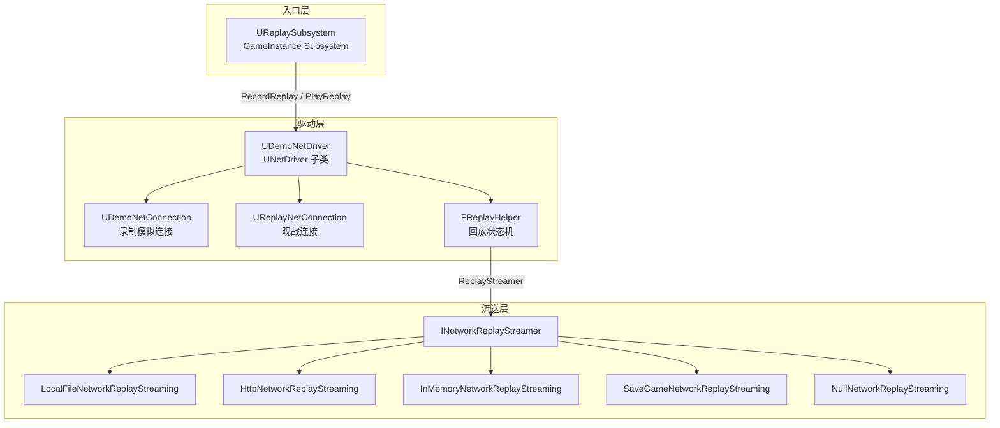
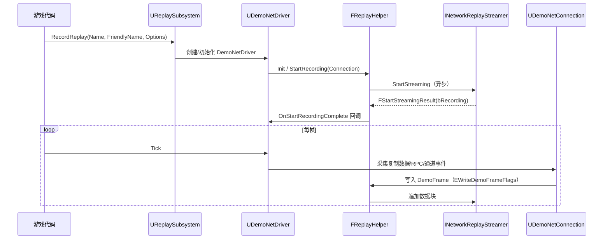
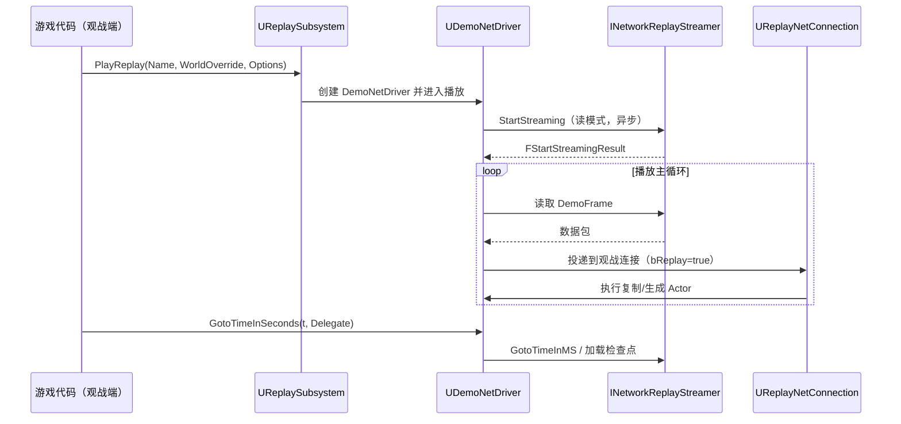

# 09 网络回放与 DemoNetDriver

> 版本基线：UE5.8.0 / CL55116800 / `++UE5+Release-5.8`
> 适用范围：联机回放的录制、播放与观战开发（录播、赛事复盘、观战系统、反作弊取证）
> 事实边界：本文引用的全部符号与行号均经本机引擎 `C:\Program Files\Epic Games\UE_5.8\Engine\Source` 只读核对；凡无法在本机核实的条目一律标注"**待核对**"，未虚构任何 API。
> 官方参考：[Replays in Unreal Engine](https://dev.epicgames.com/documentation/en-us/unreal-engine/replays-in-unreal-engine)
> 最后更新：2026-08-07

---

## 概述

UE 的网络回放（Replay）系统录制的是**整个游戏会话的网络数据流**（复制数据、RPC、属性变化、Actor 生命周期事件），而不是视频帧。播放时由 `UDemoNetDriver` 以"模拟网络连接"的方式重放这些数据，引擎照常执行复制与同步逻辑，因此回放天然支持：

- **视角自由**：观战者可切换任意被记录 Actor 的视角（本质上是重放期本地的 `ViewTarget` 切换，不依赖录制端的画面）；
- **多人观战**：同一份回放可供多个观战连接（`UReplayNetConnection`）同时消费；
- **数据可分析**：回放中保留完整的属性/RPC 流，可用于赛后统计、反作弊取证、AI 行为复盘；
- **体积可控**：相比视频录屏，网络级回放通常小一到两个数量级（取决于检查点策略与内容复杂度）。

回放系统在工程上由三层构成：

1. **入口层**：`UReplaySubsystem`（GameInstance 子系统）——5.1 重构后的官方录制/播放入口；
2. **驱动层**：`UDemoNetDriver` + `UDemoNetConnection`（录制）/ `UReplayNetConnection`（观战）——模拟网络连接，读写回放数据流；
3. **流送层**：`INetworkReplayStreamer` 一族实现——决定回放文件"写到哪、从哪读"（本地文件、HTTP、内存、云存档等）。

> **5.8 版本差异（本机核对）**：`UGameplayStatics`（`Engine\Classes\Kismet\GameplayStatics.h`，共 1567 行）中**已不存在任何 Replay 相关 API**（全文件检索 `Replay` 零命中）。旧教程中常见的 `UGameplayStatics::StartRecordingReplay / StopRecordingReplay / PlayReplay` 在 5.8 中已由 `UReplaySubsystem::RecordReplay / PlayReplay` 取代。迁移代码时请以本机实际头文件为准。

---

## 核心概念表

| 概念 | 类 / 符号（本机 5.8 核对） | 职责 |
|---|---|---|
| 回放子系统 | `UReplaySubsystem : UGameInstanceSubsystem`（`Engine\Public\ReplaySubsystem.h` L23） | 录制/播放入口：`RecordReplay`（L40）、`PlayReplay`（L49）、`GetActiveReplayName`（L62）、`RequestCheckpoint`（L134）、`bLoadDefaultMapOnStop`（L149，默认 true） |
| 回放网络驱动 | `UDemoNetDriver : UNetDriver`（`Engine\Classes\Engine\DemoNetDriver.h` L151，774 行） | 回放录制与播放的"虚拟"网络驱动：`IsRecording`（L385）/`IsPlaying`（L386）、`GetDemoTotalTime`（L389）/`GetDemoCurrentTime`（L397）、`GotoTimeInSeconds`（L383）、`RequestCheckpoint`（L244） |
| 录制连接 | `UDemoNetConnection : UNetConnection`（`Engine\Classes\Engine\DemoNetConnection.h` L19，81 行） | "模拟网络连接，用于录制与回放游戏会话"（头文件原文）；`InitRemoteConnection`/`InitLocalConnection` 为空实现（L51-52），`IsNetReady`（L34）、`HandleClientPlayer`（L42） |
| 观战连接 | `UReplayNetConnection : UNetConnection`（`Engine\Public\ReplayNetConnection.h` L12，86 行，`transient, config=Engine`） | 播放期挂到 `UDemoNetDriver` 的观战连接：`RemoteAddressToString` 返回 `"Replay"`（L38）、`IsReplayReady`（L42）、`AddUserToReplay`（L54）、`GetReplayCurrentTime/TotalTime`（L57-58） |
| 回放状态核心 | `FReplayHelper`（`Engine\Public\ReplayHelper.h` L568 行） | 录制/播放的共享状态机：`StartRecording`（L61）、`SaveCheckpoint`（L100）、`RequestCheckpoint`（L124）、`DemoFrameNum`（L222）、`DemoCurrentTime`（L225）、`DemoTotalTime`（L228）、`bHasDeltaCheckpoints`（L244）、`LevelNamesAndTimes`（L216） |
| 回放流送器 | `INetworkReplayStreamer`（`Runtime\NetworkReplayStreaming\NetworkReplayStreaming\Public\NetworkReplayStreaming.h` L515） | 回放数据读写抽象：`StartStreaming`/`StopStreaming`/`GotoTimeInMS`/`EnumerateStreams`/`RenameReplayFriendlyName`（L582-583）；`EReplayStreamerState`（L497，Idle 等） |
| 流送结果 | `FStartStreamingResult : FStreamingResultBase`（同文件 L227，含 `bRecording` L230）、`FGotoResult`（L267） | 异步操作结果；`EStreamingOperationResult`（L196，含 `Unsupported` L199）；约定所有结果类型继承 `FStreamingResultBase`（L214） |
| 回放元数据 | `FNetworkReplayStreamInfo`（同文件 L70） | `FriendlyName`/`Timestamp`/`SizeInBytes`/`LengthInMS`/`NumViewers`/`Changelist`/`bIsLive`/`bShouldKeep` |
| 回放版本 | `FReplayCustomVersion`（`Engine\Public\ReplayTypes.h` L123） | 5.2 起使用自定义版本管理回放格式（`FReplayCustomVersion::Latest`）；旧 `ENetworkVersionHistory` 已弃用（L96，`UE_DEPRECATED(5.2,...)`） |
| 回放头/帧 | `FNetworkDemoHeader`（`ReplayTypes.h` L177）、`EWriteDemoFrameFlags`（L42）、`FPlaybackPacket`（L50） | 回放文件头与每帧写入标志 |
| Delta 检查点数据 | `FDeltaCheckpointData`（`ReplayTypes.h` L234）、`FQueuedDemoPacket`（L256）、`FReplayExternalData`（L484，`TimeSeconds`+`FBitReader`） | 增量检查点、排队数据包、外部数据（如动画通知等） |
| 连接回放标志 | `UNetConnection::bReplay`（`Engine\Classes\Engine\NetConnection.h` L386）、`IsReplay()`（L355）/`SetReplay(bool)`（L356-358） | "标识回放连接，与可靠性无关"（源码注释）；回放期所有通道与复制的特殊语义都依赖此标志 |
| 世界侧入口 | `UWorld::GetDemoNetDriver()`（`Engine\Classes\Engine\World.h` L669/L1209）、`DestroyDemoNetDriver()`（L3703） | 从 World 取回放驱动；`W 播放回放且时间轴成功 scrub 后`由驱动通知（L1467 注释） |

---

## 原理详解

### 1. 总体架构



图释：`UReplaySubsystem` 是唯一入口；`UDemoNetDriver` 内部持有 `FReplayHelper` 与 `TSharedPtr<INetworkReplayStreamer>`（`DemoNetDriver.h` L182/L185）；录制与观战分别使用 `UDemoNetConnection` 与 `UReplayNetConnection`；流送层按项目配置选择实现。本机 `Runtime\NetworkReplayStreaming` 目录实测存在上述 6 个流送模块（含 `LocalFileNetworkReplayStreaming`）。

### 2. 录制链路



图释：录制入口是 `UReplaySubsystem::RecordReplay`（4 参：名称、友好名、附加选项、可选分析提供者，`ReplaySubsystem.h` L40）。`FReplayHelper::StartRecording(UNetConnection*)`（`ReplayHelper.h` L61）发起流送，完成后回调 `OnStartRecordingComplete(const FStartStreamingResult&)`（L64）。此后每帧 `UDemoNetDriver` 通过 `UDemoNetConnection`（一个"模拟"连接，`InitLocalConnection`/`InitRemoteConnection` 均为空实现）把真实游戏世界的复制流量"镜像"写入回放流。

> **录制时的连接语义**：录制本质是"用假的网络连接骗过复制管线，把数据写进文件"。因此录制通常发生在服务器或监听主机（Listen Server）上——谁有权威数据，谁就能录。

### 3. 播放 / 观战链路



图释：播放入口是 `UReplaySubsystem::PlayReplay`（3 参：回放名、World 覆盖、附加选项，`ReplaySubsystem.h` L49）。播放期 `UDemoNetDriver` 创建 `UReplayNetConnection`（观战连接，`RemoteAddressToString()` 返回 `"Replay"`，`ReplayNetConnection.h` L38）作为数据出口；连接上的 `bReplay` 标志为 true，复制管线据此走回放语义。`bLoadDefaultMapOnStop = true`（L149）表示停止播放时默认加载初始地图。

### 4. 检查点（Checkpoint）与 Delta 压缩

回放文件不是纯增量流：为支持**任意时间点跳转（scrub）**，录制端会周期性写入**检查点**——某一时刻全部 Actor 属性/通道状态的完整快照。播放端跳转时先加载最近的检查点，再快速重放（fast-forward）到目标时间。

5.8 中的关键事实（本机核对）：

- `FReplayHelper::SaveCheckpoint(UNetConnection*)`（`ReplayHelper.h` L100）、`TickCheckpoint`（L101）、`ShouldSaveCheckpoint()`（L102）驱动检查点保存；
- **Delta 压缩**：`bHasDeltaCheckpoints`（L244，注释原文 "Checkpoints are delta compressed"）——5.x 起检查点默认增量压缩，`HasDeltaCheckpoints()`（L81）可查询；
- **分帧保存**：`ECheckpointSaveState`（L259，含 `ProcessCheckpointActors` 等阶段）与 `FCheckpointStepHelper`（L273：保存状态+开始时间+当前索引+总数）把检查点保存拆到多帧，配合 `CheckpointSaveMaxMSPerFrame`（L254，每帧检查点保存时间预算，0 表示单帧完成）避免卡顿；`demo.CheckpointSaveMaxMSPerFrameOverride` 可运行时覆盖（`ReplayHelper.h` L104-105 注释）；
- **手动请求**：`UReplaySubsystem::RequestCheckpoint()`（L134）与 `UDemoNetDriver::RequestCheckpoint()`（`DemoNetDriver.h` L244）可主动落检查点（如比赛关键节点）；
- **增量数据族**：`FReplayHelper` 的 `SerializeGuidCache`（L169）/`SerializeDeletedStartupActors`（L170）/`SerializeDeltaDynamicDestroyed`（L171）/`SerializeDeltaClosedChannels`（L172）分别序列化 GUID 缓存、删除的启动 Actor、动态销毁 Actor、关闭通道——这些都是 Delta 检查点协议的一部分；对应数据结构见 `ReplayTypes.h` 的 `FDeltaCheckpointData`（L234）与 `FQueuedDemoPacket`（L256）。

> **性能提示**：`UDemoNetDriver::MaxDesiredRecordTimeMS`（`DemoNetDriver.h` L292）限制每帧录制开销，`SetMaxDesiredRecordTimeMS`（L407）可运行时调整；`CheckpointSaveMaxMSPerFrame`（L299）控制检查点分帧预算。

### 5. 时间控制：跳转、快进与回滚

跳转（scrub）是回放最复杂的路径，涉及"回到检查点 → 快进 → 修正状态"三步：

- `UDemoNetDriver::GotoTimeInSeconds(const float TimeInSeconds, const FOnGotoTimeDelegate&)`（`DemoNetDriver.h` L383）是官方跳转入口；内部走 `SkipTimeInternal(SecondsToSkip, InFastForward, InIsForCheckpoint)`（L337）；
- 跳转后 `LoadCheckpoint(const FGotoResult&)`（L218）加载检查点；`PlaybackDeltaCheckpointData`（L220）承载增量数据；
- **回滚（rollback）**：scrub 时启动 Actor 需要"销毁重建"以回到录制时刻状态——`DemoNetDriver.h` L197 注释："启动 Actor 在 scrub 期间需要回滚：销毁并重新生成"；`AddNonQueuedActorForScrubbing`（L579）/`AddNonQueuedGUIDForScrubbing`（L581）把特定 Actor/GUID 排除出排队 bunch（避免快进时重复投递）；
- `RestoreConnectionPostScrub(APlayerController*, UNetConnection*)`（L475）在 scrub 后恢复观战玩家控制器的连接；
- 通道索引复用：`NetConnection.h` L1475（"replays 用已存在索引打开通道以快进包流"）、L1692（"replay 快进时销毁 actor 以回收通道索引"）、L1806（"replay 标志下跟踪重映射的通道索引"）——快进时引擎通过**销毁旧 Actor + 复用通道索引**重放状态；
- 启动参数 `-skipreplayrollback`（`DemoNetDriver.h` L769 注释："不生成回滚数据，假设不会有 scrub"）可省去回滚数据，缩小录制文件并降低开销——仅当确认产品不需要任意时间跳转时使用。

### 6. 回放中的网络同步语义（bReplay）

`UNetConnection::bReplay`（`NetConnection.h` L386，"标识回放连接，独立于可靠性"）是回放同步的开关：

- **所有通道**（ActorChannel/PropertyChannel/RPC 通道）在回放连接上走"写文件/读文件"路径，而非真实网络；
- 检查点保存时会**复用现有连接与通道**来录制快照（`NetConnection.h` L947 注释）；
- 属性重发类型与检查点配合：`NetConnection.h` L157（"回放检查点使用的属性数据重发类型"）；
- `FReplayExternalData`（`ReplayTypes.h` L484，`TimeSeconds` + `FBitReader`）用于携带"外部数据"（如动画通知、非复制数据），随帧回放；
- 回放播放期的 `NetMode` 表现为 `NM_Client`（本地伪客户端），观战者视角由 `UDemoNetConnection::HandleClientPlayer`（`DemoNetConnection.h` L42）等路径建立。

> **对游戏逻辑的影响**：`bReplay` 连接不产生真实网络流量，因此 `IsNetReady` 类容量判断、带宽统计在回放中无意义；回放连接上的 RPC 会真实执行（这正是回放能复现逻辑的原因），所以**回放播放端会运行完整游戏逻辑**，需要与"真服务器"等效的配置（如确定性、随机种子策略）。

### 7. 流送层：INetworkReplayStreamer

`INetworkReplayStreamer`（`NetworkReplayStreaming.h` L515）定义回放数据读写契约：

- 核心操作：`StartStreaming`（录制/播放共用，通过 `bRecording` 区分，见 `FStartStreamingResult::bRecording` L230）、`StopStreaming`、`GotoTimeInMS`、`EnumerateStreams`（列出回放，回调 `FOnEnumerateStreamsComplete` L155）、`RenameReplayFriendlyName`（L582-583）、`DeleteStream`；
- 结果约定：所有异步操作回调携带 `F<MethodName>Result`，继承 `FStreamingResultBase`（L214，含 `EStreamingOperationResult Result` L216）；操作不支持时返回 `EStreamingOperationResult::Unsupported`（L199）；
- 状态：`GetReplayStreamerState()`（L602）返回 `EReplayStreamerState`（L497，`Idle` 等）；
- 本机 5.8 内置实现（`Runtime\NetworkReplayStreaming` 目录实测）：`LocalFileNetworkReplayStreaming`（本地文件，默认）、`HttpNetworkReplayStreaming`（HTTP 后端，官方示例/自建服务）、`InMemoryNetworkReplayStreaming`、`SaveGameNetworkReplayStreaming`（云存档）、`NullNetworkReplayStreaming`（空实现）。

回放文件包含：文件头（`FNetworkDemoHeader`，`ReplayTypes.h` L177）、关卡时间表（`FLevelNameAndTime`，L64，驱动 `LevelNamesAndTimes` 列表）、逐帧数据（`FPlaybackPacket`，L50）、检查点与 Delta 数据。版本兼容由 `FReplayCustomVersion`（L123，`FReplayCustomVersion::Latest`）保证，5.2 起不再依赖 `ENetworkVersionHistory`（L96 已弃用）。

### 8. 回放文件与流送元数据

- `DemoSessionID`（`DemoNetDriver.h` L289）：录制会话唯一 ID，`GetDemoSessionID()`（L599）可取——用于把回放与会话服务关联；
- `LevelNamesAndTimes`（`ReplayHelper.h` L216）：关卡名+时间戳列表，支持**多关卡/无缝旅行**的回放（旅行时记录关卡切换点，播放时按列表加载）；
- `FNetworkReplayStreamInfo`（`NetworkReplayStreaming.h` L70）：回放列表项元数据（友好名、时间戳、大小、时长、观众数、Changelist、`bIsLive` 直播中、`bShouldKeep` 保留标记）——观战大厅/回放列表 UI 的数据来源；
- `IsRecordingMapChanges()`（`DemoNetDriver.h` L242）：是否录制地图变更（World Partition 相关，见 `WorldPartitionReplay.h`）。

### 9. 观战与延迟

- 观战连接 `UReplayNetConnection` 的 `AddUserToReplay(const FString&)`（`ReplayNetConnection.h` L54）把观战者标识写入回放流（回放内多人观战可见）；
- `GetReplayCurrentTime()/GetReplayTotalTime()`（L57-58）提供观战 UI 的时间轴数据；
- 回放是"播放本地数据"，**没有真实网络延迟**；但 scrub/快进可能产生明显的"追赶"开销（重放大量帧），观战 UI 需处理加载态；
- 直播回放（`bIsLive`）：录制与观看同时进行，观看端延迟取决于流送实现与检查点策略（待核对：各流送实现的直播刷新频率）。

---

## 代码 / 示例

> 以下代码均基于本机核对到的真实签名；仅作"节选"，请以项目实际封装为准。

### 示例 1：开始 / 停止录制（C++，真实签名）

```cpp
// 入口：UReplaySubsystem（GameInstance 子系统）
// 签名核对自 Engine\Public\ReplaySubsystem.h
UReplaySubsystem* Replay = GetGameInstance()->GetSubsystem<UReplaySubsystem>();
if (Replay)
{
    // 第 1 参：回放名称（唯一标识）；第 2 参：展示用友好名；
    // 第 3 参：附加选项（如观战人数上限等，按流送实现解释）；第 4 参：可选分析提供者
    Replay->RecordReplay(TEXT("match_20260807_001"), TEXT("2026-08-07 对局 #001"), {}, nullptr);
}

// 停止录制（本机未核对该方法签名，此处为示意）：
// Replay->StopRecordingReplay(); // 待核对：5.8 中的确切入口
```

> **待核对**：停止录制的官方入口在本机 `ReplaySubsystem.h`（159 行）未发现独立 `StopRecording` 方法；实践中常见做法是调用 `RecordReplay` 的反向流程（如 `UDemoNetDriver` 销毁/World Teardown），或经由流送器 `StopStreaming`。请以 5.8 实际头文件为准。

### 示例 2：播放回放（C++，真实签名）

```cpp
UReplaySubsystem* Replay = GetGameInstance()->GetSubsystem<UReplaySubsystem>();
if (Replay)
{
    // 播放指定名称的回放；WorldOverride 传 nullptr 表示使用当前 World
    Replay->PlayReplay(TEXT("match_20260807_001"), nullptr, {});
}
```

### 示例 3：获取驱动并跳转时间（C++，真实签名）

```cpp
// 从 World 获取回放驱动（签名核对自 Engine\Classes\Engine\World.h L669/L1209）
if (UDemoNetDriver* DemoDriver = GetWorld()->GetDemoNetDriver())
{
    if (DemoDriver->IsPlaying())
    {
        // 跳转到第 120 秒；完成回调（成功或失败各触发一次，见 L279 注释）
        DemoDriver->GotoTimeInSeconds(120.0f, FOnGotoTimeDelegate::CreateLambda(
            [](const bool bWasSuccessful)
            {
                // 更新观战 UI / 暂停逻辑
            }));
    }
}
```

### 示例 4：请求检查点与查询状态（C++，真实签名）

```cpp
// 关键比赛节点主动落检查点
GetGameInstance()->GetSubsystem<UReplaySubsystem>()->RequestCheckpoint(); // ReplaySubsystem.h L134

// 状态查询（DemoNetDriver.h 核对）
if (UDemoNetDriver* DemoDriver = GetWorld()->GetDemoNetDriver())
{
    const bool bRecording = DemoDriver->IsRecording();                 // L385
    const bool bPlaying   = DemoDriver->IsPlaying();                   // L386
    const float CurTime   = DemoDriver->GetDemoCurrentTime();          // L397
    const float TotTime   = DemoDriver->GetDemoTotalTime();            // L389
    const bool bHasDelta  = DemoDriver->HasDeltaCheckpoints();         // L611
    const uint32 FrameNum = DemoDriver->GetDemoFrameNum();             // L163
}
```

### 示例 5：观战者接入（示意）

```cpp
// 播放期观战连接（UReplayNetConnection，ReplayNetConnection.h L54）
// 当观战玩家加入时，把观战者标识写入回放流
if (UReplayNetConnection* ReplayConn = Cast<UReplayNetConnection>(SomeNetConnection))
{
    ReplayConn->AddUserToReplay(TEXT("viewer_zhangsan"));
    const FString ActiveName = ReplayConn->GetActiveReplayName();   // L56
}
```

---

## 最佳实践

1. **只在一端录制**：录制应发生在权威端（服务器或监听主机），避免多端录制文件不一致；录制端与玩家端时间基准需统一。
2. **入口用 `UReplaySubsystem`**：5.8 中不要再使用 `UGameplayStatics` 的旧回放 API（本机已确认不存在），统一走 `RecordReplay/PlayReplay`。
3. **合理设置检查点预算**：用 `CheckpointSaveMaxMSPerFrame`（或 `demo.CheckpointSaveMaxMSPerFrameOverride`）限制每帧检查点耗时，避免录制端卡顿；长对局定期 `RequestCheckpoint()` 降低 scrub 加载时间。
4. **评估 `-skipreplayrollback`**：若产品不需要任意时间跳转（只顺序观看），加该启动参数可显著减小文件与开销（`DemoNetDriver.h` L769）。
5. **scrub 后重置观战者状态**：跳转会销毁重建启动 Actor（L197 注释），观战 UI 需要监听跳转完成回调（`GotoTimeInSeconds` 的 Delegate）再刷新视图，避免中间态。
6. **录制/播放使用相同版本与 Changelist**：回放格式由 `FReplayCustomVersion`（`ReplayTypes.h` L123）管理，跨版本回放不保证兼容；上线前用 `Changelist`（`FNetworkReplayStreamInfo` L93）校验。
7. **回放列表走 `EnumerateStreams`**：大厅/战绩页的回放列表用流送器的枚举接口 + `FNetworkReplayStreamInfo` 展示元数据（时长/大小/是否直播）。
8. **回放中禁用非确定性逻辑**：回放会真实执行游戏逻辑，随机数、系统时钟、外部服务调用应做确定性处理（种子注入/服务端权威数据），否则观战与实况不一致。
9. **录制端负载监控**：用 `MaxDesiredRecordTimeMS`（L292）控制每帧录制开销；高 CCU 服务器上录制会叠加 CPU 消耗，压测时需计入。
10. **与观战人数解耦**：回放是本地播放，多人观战只增加"读同一个文件"的连接数，不增加网络带宽；但每个观战连接会各自执行复制逻辑，CPU 仍随观战者数增长（待核对：5.8 是否有共享读取优化）。

---

## FAQ

1. **Q：回放和录屏（视频）有什么区别？**
   A：回放录制网络数据流，体积小、可自由切视角、可多人观战、可做数据分析；录屏是像素级画面，体积大且不可交互。回放不记录渲染细节，因此画面表现取决于播放端设置。

2. **Q：5.8 中 `UGameplayStatics::StartRecordingReplay` 还能用吗？**
   A：不能依赖。本机核对 `GameplayStatics.h`（1567 行）无任何 Replay 引用，旧 API 已迁移到 `UReplaySubsystem::RecordReplay/PlayReplay`（`ReplaySubsystem.h` L40/L49）。旧代码需要迁移。

3. **Q：回放文件存在哪里？**
   A：由流送实现决定：默认本地文件（`LocalFileNetworkReplayStreaming`，`Runtime\NetworkReplayStreaming` 目录实测存在）；也可用 `HttpNetworkReplayStreaming` 上传自建/云服务，或 `SaveGameNetworkReplayStreaming` 走云存档。具体目录与配置项待核对各实现文档。

4. **Q：录制端（服务器）每帧开销有多大？**
   A：由 `MaxDesiredRecordTimeMS`（`DemoNetDriver.h` L292）控制录制上限，检查点另受 `CheckpointSaveMaxMSPerFrame`（L299）分帧预算约束。实际开销与复制数据量、Actor 数量、检查点频率强相关，需用 profiling 实测。

5. **Q：为什么跳转（scrub）后有些 Actor 消失了？**
   A：scrub 会回到检查点并快进；启动 Actor 在回滚时"销毁重建"（`DemoNetDriver.h` L197 注释），动态 Actor 依赖 Delta 数据（`SerializeDeltaDynamicDestroyed`，`ReplayHelper.h` L171）恢复。若使用了 `-skipreplayrollback` 且录制期没有回滚数据，跳转会失败或状态错乱。

6. **Q：回放能跨版本播放吗？**
   A：不能保证。回放格式由 `FReplayCustomVersion`（`ReplayTypes.h` L123）管理，5.2 起自定义版本机制取代旧 `ENetworkVersionHistory`（L96 已弃用）；跨 Changelist 的回放需按版本兼容策略处理（如拒绝播放并提示）。

7. **Q：回放与 ReplicationGraph 兼容吗？**
   A：**待核对**（本机未找到官方明确声明）。实践上 ReplicationGraph 作用于"真实连接的 Actor 收集"，回放走 `bReplay` 模拟连接路径（`NetConnection.h` L386），兴趣管理对回放数据的"录制侧"影响有限，但播放侧仍会执行连接级收集逻辑。建议在目标版本做录制→播放全链路验证。

8. **Q：回放与 Iris 复制兼容吗？**
   A：**待核对**（本机未核对到官方兼容性矩阵）。Iris 的 NetTrace 通道（见 `08-网络调试与性能分析.md`）与回放的 `FReplayExternalData`（`ReplayTypes.h` L484）机制属于不同层；启用 Iris 的项目必须验证：录制数据能否被播放端 Iris 正确反序列化、检查点序列化是否覆盖 Iris 的 GUID/对象状态。上线前务必做录制-播放-跳转全链路回归。

9. **Q：支持多关卡（无缝旅行）回放吗？**
   A：支持。`FReplayHelper::LevelNamesAndTimes`（`ReplayHelper.h` L216）记录关卡切换点，播放端按列表加载；`FLevelNameAndTime`（`ReplayTypes.h` L64）定义条目结构。World Partition 的地图变更录制见 `IsRecordingMapChanges()`（`DemoNetDriver.h` L242）。

10. **Q：回放里能多人同时观战吗？**
    A：可以。播放端可挂多个 `UReplayNetConnection`（`ReplayNetConnection.h` L12），`AddUserToReplay`（L54）记录观战者；`FNetworkReplayStreamInfo::NumViewers`（`NetworkReplayStreaming.h` L90）统计观战人数（录制时由流送实现上报，待核对细节）。

---

## 关联阅读

- [01-网络架构与复制基础.md](01-网络架构与复制基础.md) —— 复制/NetDriver 基础，理解回放"镜像"的前提
- [04-多人游戏框架与玩家状态.md](04-多人游戏框架与玩家状态.md) —— 玩家状态与观战视角、重连
- [08-网络调试与性能分析.md](08-网络调试与性能分析.md) —— 网络仿真、NetTrace 与带宽基线（回放场景同工具链）
- [09-网络复制与RPC源码.md](../12-引擎源码分析/09-网络复制与RPC源码.md) —— 复制/RPC 源码层，回放数据的产生源头

---

## 更新日志

- 2026-08-07：初稿。全部符号经本机 UE5.8（CL55116800）只读核对：`UDemoNetDriver`（DemoNetDriver.h 774 行）、`UDemoNetConnection`（DemoNetConnection.h 81 行）、`UReplayNetConnection`（ReplayNetConnection.h 86 行，位于 `Engine\Public`）、`UReplaySubsystem`（ReplaySubsystem.h 159 行）、`FReplayHelper`（ReplayHelper.h 568 行）、`INetworkReplayStreamer` 与结果类型（NetworkReplayStreaming.h 733 行）、`ReplayTypes.h`（557 行）、`UNetConnection::bReplay`（NetConnection.h L386）、`UWorld::GetDemoNetDriver`（World.h L669）；确认 5.8 中 `GameplayStatics.h` 无回放 API。
