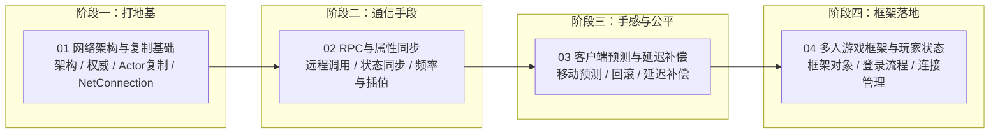

# 06 · 网络同步

> 本分类面向 UE5 客户端开发者，系统讲解 Unreal Engine 的多人在线游戏网络架构与同步技术。
> 覆盖范围：客户端-服务器架构与权威性、Actor 复制、RPC 与属性同步、客户端预测与延迟补偿、多人游戏框架与连接流程。
> 同步目录：`C:\project\git\游戏知识\06-网络同步` → https://github.com/fantuan812/learning.git

---

## 分类简介

网络同步是多人游戏开发中最容易"出问题"也最难调试的部分。UE 的网络系统建立在**客户端-服务器（Client-Server）架构**之上：服务器是唯一权威（Authority），负责所有游戏逻辑的最终裁决；客户端负责输入采集、表现渲染与本地预测。

本分类把 UE 网络同步拆成六个递进的主题：

1. **网络架构与复制基础**：先回答"谁说了算"与"东西怎么传到别人机器上"这两个根本问题，包括 NetMode / NetRole、Actor 复制管线、NetConnection 与通道、带宽控制。
2. **RPC 与属性同步**：掌握两种远程通信手段——RPC（函数级远程调用）与属性复制（状态级自动同步），以及可靠性、条件、频率、抖动与插值等工程细节。
3. **客户端预测与延迟补偿**：解决"手感"问题——如何在有延迟的前提下让移动、射击等操作响应及时，同时保证服务器权威不被破坏。
4. **多人游戏框架与玩家状态**：把知识落到框架层面——PlayerController / Pawn / PlayerState / GameState 各自在网络中的角色，以及连接、登录、进入游戏的完整流程。
5. **ReplicationGraph 兴趣管理**：大规模场景的服务器性能保障——用节点图 + 2D 网格兴趣管理替代"全量遍历 × 每连接排序"，配合类级复制参数与调试命令调优。
6. **在线子系统与会话匹配**：平台接入层——OnlineSubsystem 的登录、会话创建/搜索/加入/邀请与 Matchmaking，以及 OSS 会话与游戏内会话的区别与衔接。

建议在阅读本分类前先掌握 `01-引擎基础`（UObject / Actor / Gameplay 框架）与 `03-游戏玩法编程`（输入系统、GAS）的基础内容。

---

## 知识地图

---

## 文件列表

| 文件 | 一句话简介 |
| --- | --- |
| [01-网络架构与复制基础.md](01-网络架构与复制基础.md) | 客户端-服务器架构与权威性模型、Actor 复制机制、NetConnection 与通道、UE5 Iris 简述 |
| [02-RPC与属性同步.md](02-RPC与属性同步.md) | Server/Client/Multicast 三类 RPC 与可靠性、属性复制与条件、同步频率、抖动与插值 |
| [03-客户端预测与延迟补偿.md](03-客户端预测与延迟补偿.md) | CharacterMovement 网络移动、SavedMove 与回滚重放、服务器延迟补偿（回退命中检测） |
| [04-多人游戏框架与玩家状态.md](04-多人游戏框架与玩家状态.md) | PlayerController/Pawn/PlayerState/GameState 网络角色、连接握手与登录流程、NetConnection 管理 |
| [05-ReplicationGraph兴趣管理.md](05-ReplicationGraph兴趣管理.md) | ReplicationGraph 节点图架构、网格兴趣管理、自定义节点与大规模多人复制优化 |
| [06-在线子系统与会话匹配.md](06-在线子系统与会话匹配.md) | OnlineSubsystem 架构、会话创建/搜索/加入/邀请、Matchmaking 与 Steam/EOS 平台对接 |

---

## 学习顺序建议

### 路径 A：按依赖顺序（推荐）

1. **先读 `01-网络架构与复制基础.md`**
   建立全局心智模型：网络模式、网络角色、谁有权威、Actor 如何被复制。不搞懂 NetRole 与 Relevancy，后面所有代码都难以理解。
2. **再读 `02-RPC与属性同步.md`**
   学会两种通信"语法"。RPC 与属性复制的取舍贯穿整个 UE 网络开发，是本分类最常用的工具。
3. **然后读 `03-客户端预测与延迟补偿.md`**
   在掌握同步手段后，研究"手感"问题：为什么角色移动要预测、服务器如何修正、射击如何做延迟补偿。
4. **最后读 `04-多人游戏框架与玩家状态.md`**
   把零散知识串成完整流程：从玩家点击连接，到进入游戏、生成 Pawn、看到其他玩家，全程发生了什么。

### 路径 B：按需求速查

- 只想知道"游戏怎么连起来的"→ 先看 `04` 的登录流程章节，再回头补 `01`。
- 正在写"同步血量/得分/物品"→ 直接看 `02` 的属性同步章节。
- 正在调"角色移动发飘、瞬移、橡皮筋"→ 直接看 `03`。
- 正在做帧同步/状态同步方案选型 → 先看 `01` 的架构对比与 `03` 的预测模型。

---

## 各篇内容预览

### 01-网络架构与复制基础.md

从"为什么 UE 采用客户端-服务器而不是 P2P"讲起，对比监听服务器（Listen Server）与专用服务器（Dedicated Server）的优劣；然后深入 Actor 复制管线：`bReplicates`、`Replicated` 属性、`OnRep` 回调、条件复制、Relevancy 判定、`NetUpdateFrequency` 与 `NetPriority` 的带宽调度；最后介绍 UNetConnection、控制/语音/Actor 通道与连接状态机，并简述 UE5 新一代 Iris 复制系统。

### 02-RPC与属性同步.md

详解 `UFUNCTION(Server/Client/NetMulticast)` 三类 RPC 的调用方向、可靠性（Reliable/Unreliable）、`WithValidation` 校验，并用 Mermaid 图展示 RPC 从调用到执行的完整路径；属性同步部分覆盖 `DOREPLIFETIME` 宏族、`COND_*` 条件、`OnRep` 通知、Fast Array 高效数组复制，以及同步频率、抖动来源与插值平滑策略。

### 03-客户端预测与延迟补偿.md

围绕 CharacterMovementComponent 讲解网络移动模型：AutonomousProxy 本地预测 → `ServerMove` 上行 → 服务器权威修正 → `ClientAdjustPosition` 下行 → SavedMove 回滚重放；随后讲解延迟补偿（Lag Compensation）的服务器时间窗回滚命中检测，以及射击/动画预测、插值与外推的取舍。

### 04-多人游戏框架与玩家状态.md

梳理 GameInstance / GameMode / GameState / PlayerState / PlayerController / Pawn 在网络中的分布与职责；用时序图还原从连接建立（UDP）、Hello/Login/Welcome 握手、PreLogin/Login/PostLogin 到 RestartPlayer 的完整登录流程；最后介绍 NetConnection 的细节（地址、状态、流量、踢人、断线处理）与 Seamless Travel。

---

## 术语速查表

| 术语 | 英文 | 中文含义 | 详细出处 |
| --- | --- | --- | --- |
| NetMode | Network Mode | 当前进程的网络模式（单机/监听/专用服务器/客户端） | 01 |
| NetRole | Network Role | 当前 Actor 在某连接视角下的角色（权威/自主代理/模拟代理） | 01 |
| Authority | Authority | 权威：服务器对游戏状态的最终裁决权 | 01 |
| Replication | Replication | 复制：把服务器状态同步到客户端的过程 | 01 |
| Relevancy | Relevancy | 相关性：判断某 Actor 是否需要复制给某连接 | 01 |
| NetUpdateFrequency | Net Update Frequency | Actor 每秒检查并发送更新的次数 | 01 |
| NetPriority | Net Priority | Actor 在网络带宽预算中的发送优先级 | 01 |
| NetConnection | Net Connection | 服务器与单个客户端之间的逻辑连接 | 01 / 04 |
| Channel | Channel | 连接内按用途划分的通信通道（控制/语音/Actor） | 01 |
| RPC | Remote Procedure Call | 远程过程调用：让函数在另一台机器上执行 | 02 |
| Reliable / Unreliable | Reliable / Unreliable | 可靠（保证送达与顺序）/ 不可靠（尽力而为） | 02 |
| Replicated Property | Replicated Property | 由服务器自动同步到客户端的属性 | 02 |
| OnRep / RepNotify | Replication Notify | 客户端收到复制属性更新时触发的回调 | 02 |
| Fast Array | Fast Array Serializer | 高效复制数组的序列化器 | 02 |
| Autonomous Proxy | Autonomous Proxy | 拥有本地控制权与预测能力的代理（自己控制的角色） | 03 |
| Simulated Proxy | Simulated Proxy | 只做插值模拟的代理（看到的其他玩家） | 03 |
| Saved Move | Saved Move | 客户端保存的移动输入历史，用于回滚重放 | 03 |
| Correction | Correction | 服务器对客户端预测位置的修正 | 03 |
| Lag Compensation | 延迟补偿 | 服务器按客户端时间戳回滚状态做命中判定 | 03 |
| PlayerController | Player Controller | 玩家输入/视角控制对象，存在于服务器与所属客户端 | 04 |
| PlayerState | Player State | 跨客户端可见的玩家信息（名字/分数/队伍） | 04 |
| GameState | Game State | 复制到所有人的全局游戏状态 | 04 |
| GameMode | Game Mode | 仅存在于服务器的规则对象 | 04 |
| Possess | Possess | 控制器接管（附身）Pawn 的过程 | 04 |
| Seamless Travel | Seamless Travel | 无缝切换地图，保留连接与控制器 | 04 |
| Iris | Iris Replication System | UE5 引入的下一代复制系统（实验性） | 01 |

---

## 撰写与阅读约定

- 示例以 C++ 为主（UE 5.8 语法），涉及网络宏（`UFUNCTION`、`DOREPLIFETIME` 等）会单独说明其含义。
- 涉及流程的地方使用 Mermaid 图辅助理解；图中中文为概念标注，非引擎字面量。
- 引擎 API 在不同版本间有小幅差异（如 Iris 的启用方式），文中会标注版本相关说明。
- 阅读时建议打开引擎源码对照：`Engine/Source/Runtime/Engine/Private/NetDriver.cpp`、`DataChannel.cpp`、`CharacterMovementComponent.cpp`、`GameModeBase.cpp`。

---

## 关联资源

- 官方文档：Unreal Engine 5 Networking Overview、Replication、RPCs、Replicated Properties、Client-Side Prediction
- 引擎源码目录：`Engine/Source/Runtime/Engine/Classes/Engine/`、`Engine/Source/Runtime/Engine/Private/Net/`
- 本仓库相关分类：[01-引擎基础](../01-引擎基础/README.md)（UObject/Actor 基础）、[03-游戏玩法编程](../03-游戏玩法编程/README.md)（输入与 GAS）
- 社区资源：Epic 官方示例项目 ShooterGame / Lyra（Lyra 是研究多人框架与移动预测的最佳参考）

---

## 更新日志

- 2026-08-03：创建本分类，完成 01 ~ 06 六篇正文与导航页。
