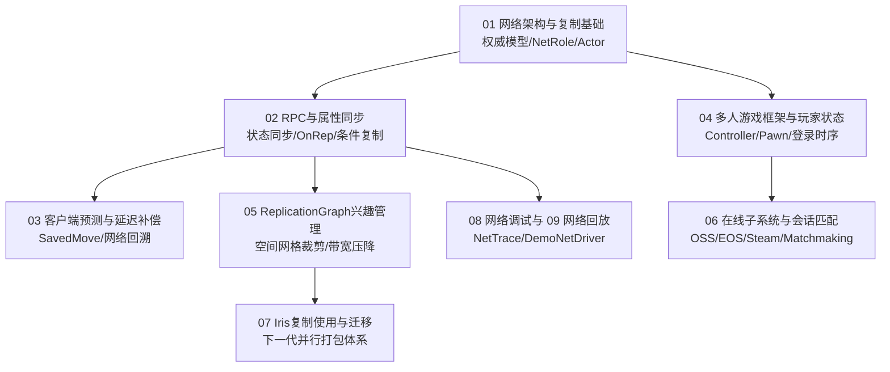

# 06 网络同步

> 知识成熟度：L2（子域工程手册，已按 9 篇核心专题与 UE5.8 源码基线全面标准化）。
>
> 领域权威导航：[游戏知识 Domain MOC](../../00_Index/domains/游戏知识.md) ｜ [游戏知识总目录](../README.md)。

---

## 1. 核心定位与设计思想

「06-网络同步」负责虚幻引擎多人在线游戏中的状态同步、指令分发与网络公平性保障。虚幻引擎网络体系基于经典的**客户端-服务器（C/S）架构**与**服务器绝对权威（Server Authority）**模型：
- **权威性与角色分工**：通过 NetRole（Role/RemoteRole）区分自主代理（AutonomousProxy）、模拟代理（SimulatedProxy）与权威（Authority），服务器是唯一状态真理源；
- **状态复制与远程过程调用**：属性复制（Replication）保障最终一致性，RPC（Server/Client/NetMulticast）驱动离散事件通信，配合 FastArraySerializer 与条件复制（DOREPLIFETIME_CONDITION）精细控制带宽；
- **客户端自主预测与延迟补偿**：在 CharacterMovementComponent 框架下，客户端以本地输入先行模拟（SavedMove），服务器验证时间并确认/纠偏（ServerMove），减轻等待网络往返的操作延迟；
- **空间兴趣管理与下一代复制体系**：通过 ReplicationGraph 节点空间网格剪裁解决大地图全量遍历开销，并演进至 UE5.8 下一代数据驱动、并行化脏标记处理的 Iris 复制系统。

---

## 2. 专题矩阵与知识状态

| 专题文件（Canonical 路径） | 知识类型 | 成熟度 | 核心工程关注点与落地场景 |
| :--- | :---: | :---: | :--- |
| [01-网络架构与复制基础.md](01-网络架构与复制基础.md) | Concept | L2 | C/S 权威性模型、NetMode/NetRole 状态机、Actor 复制管线、NetConnection 通道与带宽预算控制 |
| [02-RPC与属性同步.md](02-RPC与属性同步.md) | Concept | L2 | Server/Client/NetMulticast RPC、属性复制与 OnRep 回调、条件复制、同步频率与丢包插值 |
| [03-客户端预测与延迟补偿.md](03-客户端预测与延迟补偿.md) | Concept | L2 | CMC ACK 与输入重放、三种时间域、有界历史查询、命中公平性策略与 C++11 练习 |
| [04-多人游戏框架与玩家状态.md](04-多人游戏框架与玩家状态.md) | Concept | L2 | PlayerController/Pawn/PlayerState/GameState 网络所有权映射、连接握手三阶段与登录时序 |
| [05-ReplicationGraph兴趣管理.md](05-ReplicationGraph兴趣管理.md) | Concept | L2 | ReplicationGraph 节点图、2D 网格空间裁剪节点、动态优先级排序与大型万人大世界复制优化 |
| [06-在线子系统与会话匹配.md](06-在线子系统与会话匹配.md) | Concept | L2 | OnlineSubsystem（OSS）跨平台接口、Steam/EOS 会话创建/搜索/加入、好友邀请与大厅匹配（Matchmaking） |
| [07-Iris复制使用与迁移.md](07-Iris复制使用与迁移.md) | Concept | L2 | Iris 下一代复制系统：数据导向并行打包、属性状态描述符、与经典 ReplicationGraph 差异与平滑迁移 |
| [08-网络调试与性能分析.md](08-网络调试与性能分析.md) | Concept | L2 | 弱网仿真（PktLag/PktLoss）、NetTrace 网络通道捕获、NetworkProfiler 带宽诊断与丢包断线排障 |
| [09-网络回放与DemoNetDriver.md](09-网络回放与DemoNetDriver.md) | Concept | L2 | DemoNetDriver 录制与播放流、UReplaySubsystem、时间轴跳跃检查点（Checkpoint）与观战视角管理 |

---

## 3. 逻辑学习顺序建议

```mermaid
flowchart TD
    A[01 网络架构与复制基础<br/>权威模型/NetRole/Actor] --> B[02 RPC与属性同步<br/>状态同步/OnRep/条件复制]
    B --> C[03 客户端预测与延迟补偿<br/>SavedMove/网络回溯]
    A --> D[04 多人游戏框架与玩家状态<br/>Controller/Pawn/登录时序]
    B --> E[05 ReplicationGraph兴趣管理<br/>空间网格裁剪/带宽压降]
    D --> F[06 在线子系统与会话匹配<br/>OSS/EOS/Steam/Matchmaking]
    E --> G[07 Iris复制使用与迁移<br/>下一代并行打包体系]
    B --> H[08 网络调试与 09 网络回放<br/>NetTrace/DemoNetDriver]
```

1. **第一阶段（基础心智与通信语法）**：精读 `01-网络架构与复制基础` 与 `02-RPC与属性同步`，牢固建立“服务器是唯一权威”的工程意识，掌握属性复制与 RPC 的严谨选型。
2. **第二阶段（手感保障与多人框架）**：深入 `03-客户端预测与延迟补偿` 与 `04-多人游戏框架与玩家状态`，解决弱网环境下的位移拉扯与玩家登录初始化数据对齐。
3. **第三阶段（性能扩展与现代架构）**：研读 `05-ReplicationGraph` 与 `07-Iris复制使用与迁移`，掌握大地图海量实体复制开销的工业化裁剪手段。
4. **第四阶段（平台接入与运维诊断）**：学习 `06-在线子系统`、`08-网络调试与性能分析` 与 `09-网络回放`，打通平台对接与线上疑难网络 Bug 定位闭环。

---

## 4. 游戏与引擎工程落地场景

- **FPS/TPS 射击命中延迟补偿**：服务器收到开火 RPC 后，校验请求时间、历史窗口与表现缓冲，在明确遮挡策略下查询历史形状；解释攻击方与防守方之间的公平性取舍；
- **开放世界海量实体带宽暴增治理**：配置 ReplicationGraph 网格节点（Grid Node），仅对玩家视距 150 米内的 Actor 执行属性复制，远距离对象降频到 2Hz 或完全剔除，将每秒带宽稳定在 25KB/s 以内；
- **弱网 200ms 高丢包移动抗拉扯**：先记录 ACK、未确认输入、修正幅度与实际 RTT，再验证自定义输入重放及表现平滑；误差阈值不能代替正确模拟。

---

## 5. 跨域技术依赖与前后置导航

- **向下扎根（计算机底座）**：
  - Socket 非阻塞与 Epoll：[00-07 Linux系统编程](../../00-计算机与工程基础/07-Linux系统编程/README.md)
  - 网络分层协议与 UDP/TCP：[00-09 计算机网络基础](../../00-计算机与工程基础/09-计算机网络基础/README.md)
- **向上驱动（引擎源码剖析）**：
  - 网络复制与 RPC 源码：[12-09 网络复制与RPC源码](../12-引擎源码分析/09-网络复制与RPC源码.md)
  - UNetDriver 通信链路：[12-33 UNetDriver与连接通道源码](../12-引擎源码分析/33-UNetDriver与连接通道源码.md)
  - ReplicationGraph 源码：[12-34 ReplicationGraph源码](../12-引擎源码分析/34-ReplicationGraph源码.md)
  - Iris 复制系统源码：[12-20 Iris复制源码](../12-引擎源码分析/20-Iris复制源码.md)
- **横向协同（服务端与实战）**：
  - 游戏服务端状态同步：[游戏服务端 01-架构与网络](../../游戏服务端/01-架构与网络/03-帧同步与状态同步.md)
  - Dedicated Server 平台化：[游戏服务端 05-UE Dedicated Server平台化](../../游戏服务端/05-UE%20Dedicated%20Server平台化/README.md)

## 6. 本轮深化后的能力验收

先读 [03 客户端预测与延迟补偿](03-客户端预测与延迟补偿.md)的时间域与实现契约，再完成独立历史查询模型和弱网测试矩阵。目标是能解释“哪一个输入被确认、查询的是哪一刻、为何拒绝回退”，而不只是会调用 RPC。纯 C++11 断言不代表 UE 多人测试已通过；继续沿[跨域主题递进路线](../../00_Index/axes/跨域主题.md#知识面持续深化路线)连接世界时钟、碰撞与质量域。
