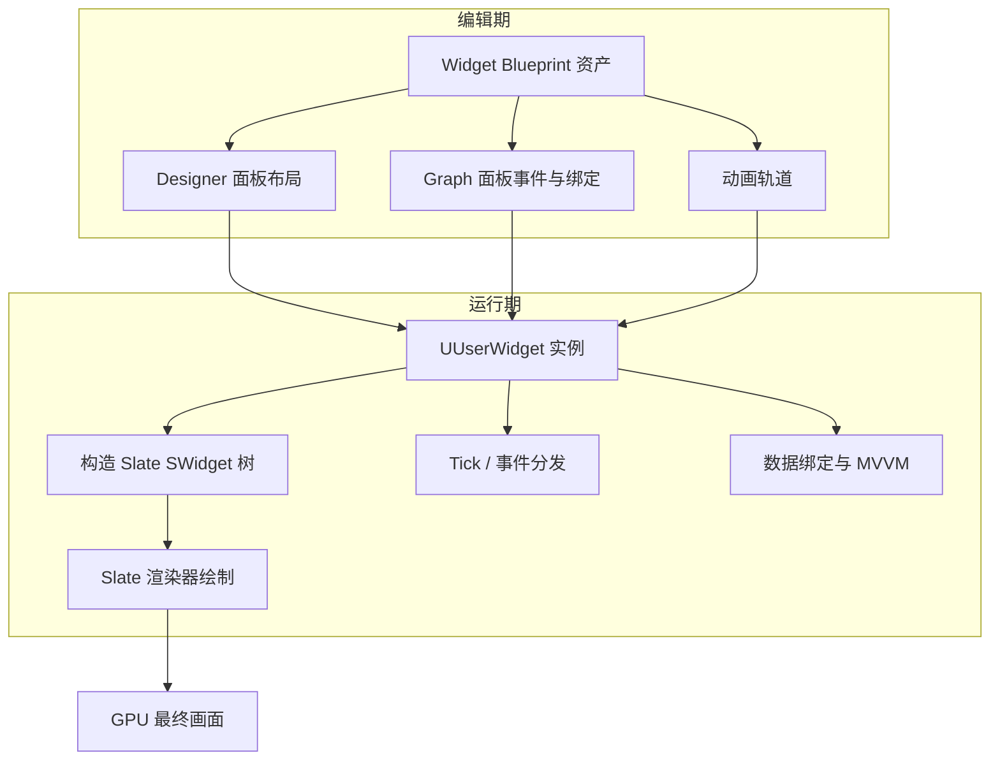
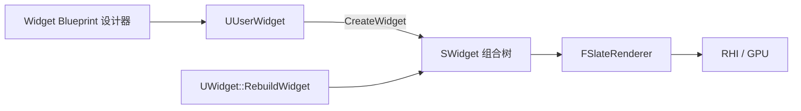
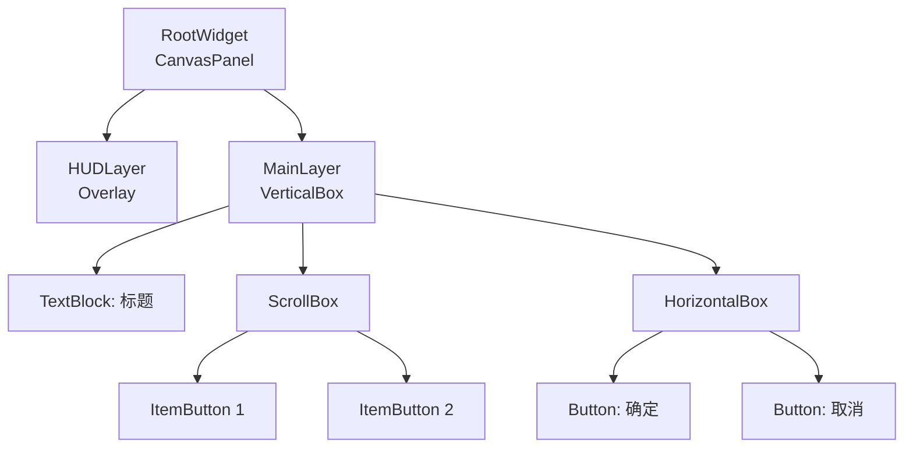
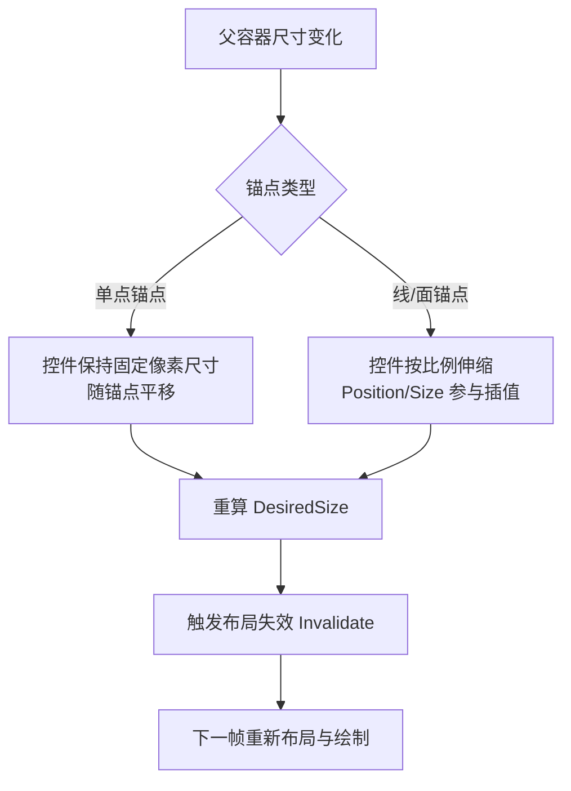
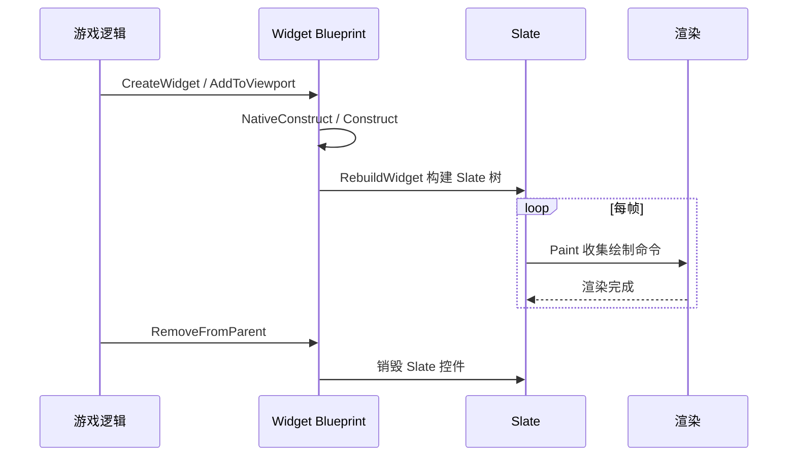
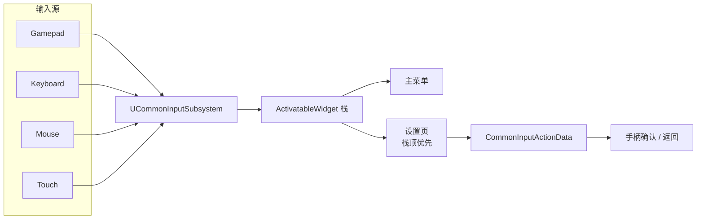
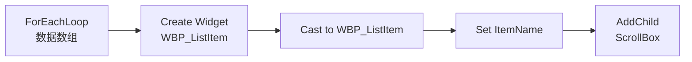

# 01 · UMG 框架与控件系统
> 版本基准：UE 5.8.0（本机 `Engine/Build/Build.version`：CL 55116800，分支 `++UE5+Release-5.8`）。
> 兼容性边界：适用于 UE5.8 编辑器/运行时，UE4.27 与早期 UE5 仅作迁移背景，具体模块以正文为准。
> 最后更新：2026-08-06（本轮元数据维护）。

## 1. 概述

UMG（Unreal Motion Graphics）是 Unreal Engine 面向游戏 UI 的控件系统，构建在底层 Slate UI 框架之上。它提供了所见即所得的 **Widget Blueprint** 编辑器、丰富的内置控件（Widget）、灵活的锚点（Anchor）与布局（Layout）机制，以及基于 `UUserWidget` 的事件与动画系统，是绝大多数 UE 游戏（大厅、HUD、背包、商城、设置界面）的首选 UI 方案。

本章回答三个核心问题：

1. **UMG 是什么**：控件层级如何组织、Widget Blueprint 如何工作、与 Slate 是什么关系；
2. **UMG 怎么用**：锚点与布局、事件绑定、动画（Widget Animation）的完整使用方式；
3. **大型项目怎么管**：CommonUI 如何解决输入路由、焦点管理与控件复用问题。

理解 UMG 的关键是理解它的"双重身份"：

- **编辑器身份**：你在 Designer 面板里摆放的每个控件，最终会编译成 Slate 层的 `SWidget` 实例；
- **运行时身份**：每个 Widget Blueprint 对应一个 `UUserWidget` 对象，它是 `UWidget` 的派生类，负责与游戏逻辑（C++/蓝图）交互。



---

## 2. 核心概念（表格）

| 概念 | 英文 | 说明 | 所属层 |
| --- | --- | --- | --- |
| 控件 | Widget | UI 的最小组成单元，如 Button、Image、TextBlock | UMG |
| 控件蓝图 | Widget Blueprint | 以 `UUserWidget` 为基类的蓝图资产，含设计器与图表 | UMG |
| 控件层级 | Widget Tree | Widget 按父子关系组成的树，根为 `RootWidget` | UMG |
| 画布面板 | Canvas Panel | 自由定位的容器，配合锚点实现自适应布局 | UMG |
| 锚点 | Anchor | 定义控件相对父容器的对齐参考点与伸缩行为 | UMG |
| 插槽 | Slot | 控件在父容器中的布局参数（如 CanvasSlot 的位置与尺寸） | UMG |
| 尺寸盒 | Size Box | 强制子控件保持指定尺寸的容器 | UMG |
| 滚动盒 | Scroll Box | 提供滚动视口的容器，支持列表虚拟化场景 | UMG |
| 滑动条 | Slider / SpinBox | 数值输入类控件 | UMG |
| 事件 | Event | 如 OnClicked、OnHovered，支持蓝图与 C++ 绑定 | UMG |
| 控件动画 | Widget Animation | 时间轴驱动的属性动画，可绑定事件回调 | UMG |
| Slate | Slate | UE 的 UI 框架，UMG 的底层实现 | Slate |
| SWidget | SWidget | Slate 控件基类，轻量、无 GC | Slate |
| 布局槽 | SBoxPanel / SOverlay 等 | Slate 层的布局容器 | Slate |
| 样式 | Style / FSlateBrush | 控件的绘制资源（图片、边框、字体） | Slate |
| CommonUI | CommonUI 插件 | 输入路由、焦点管理、控件激活器的框架 | 插件 |
| ViewModel | MVVM ViewModel | 暴露给 UI 的数据模型，UE5.1+ 原生支持 | MVVM |

---

## 3. 原理详解

### 3.1 Slate 与 UMG 的关系

Slate 是 UE 从 4.0 起引入的跨平台 UI 框架，特点是：

- **混合模式**：Slate 控件树每帧被"比较与绘制"，同时控件实例被缓存复用；
- **纯 C++、无 GC**：`SWidget` 继承自 `FWidget`（非 UObject），通过引用计数（`TSharedRef` / `TWeakPtr`）管理生命周期；
- **声明式布局**：Slate 控件用 C++ 声明式语法构造。

```cpp
// Slate 声明式构造示例
SNew(SVerticalBox)
    + SVerticalBox::Slot()
    .AutoHeight()
    [
        SNew(STextBlock).Text(FText::FromString(TEXT("Hello Slate")))
    ]
```

UMG 是 Slate 之上的一层"用户友好封装"：



关键机制：

- `UWidget::RebuildWidget()` 在控件实例化时被调用，返回对应 Slate 控件的 `TSharedRef<SWidget>`；
- `UUserWidget` 的每个 `UWidget` 子对象（如 `UButton`）都会在 `TakeWidget()` 时创建自己的 Slate 控件（如 `SButton`）；
- 布局与绘制最终全部由 Slate 层完成，UMG 只负责把蓝图属性映射到 Slate 参数；
- 因此**所有 UMG 性能问题本质上都是 Slate 性能问题**：控件数量、失效重绘（Invalidation）、Paint 开销都在 Slate 层发生。

#### Slate 渲染管线（简化）

1. `SWidget::Paint()` 递归遍历控件树，生成 `FPaintGeometry` 与绘制命令；
2. 绘制命令被收集为 `FSlateDrawElement` 批次（Batched Elements），按材质/图集自动合批；
3. `FSlateRenderer` 将批次提交给 RHI，生成网格体并上传 GPU；
4. GPU 按批次绘制，Slate 支持纹理图集（Texture Atlas）与动态图集（Dynamic Atlas）。

**Slate 失效机制（Invalidation）**：Slate 不会每帧重绘全部控件。当属性变化时，控件调用 `Invalidate(EInvalidateWidgetReason::Layout / Paint / Volatility)` 标记子树失效，只有失效子树参与下一帧重绘。这也是 `stat slate` 中 Invalidation 统计的意义所在。

### 3.2 控件层级（Widget Tree）

每个 Widget Blueprint 在运行期拥有一个控件树，根节点是设计器中的根容器（默认 `Canvas Panel`）。控件树特点：

- 父子关系决定**绘制顺序**（后绘制的在上层）与**布局传递**；
- 事件（点击、悬停）按**命中测试**（Hit Test）从顶层向下分发；
- 可见性（Visibility）有三种状态：`Visible`（参与布局+绘制+命中）、`Collapsed`（不参与布局+不绘制+不命中）、`Hidden`（参与布局+不绘制+不命中）；
- 控件树过大、更新频繁是 UI 性能的第一大杀手。



#### 常用容器控件速查

| 容器 | 布局方式 | 典型用途 |
| --- | --- | --- |
| Canvas Panel | 绝对定位（Position + Size + Anchor） | 全屏 HUD、自由摆放 |
| Vertical Box | 纵向自动排列 | 菜单列表、表单 |
| Horizontal Box | 横向自动排列 | 按钮组、图标行 |
| Overlay | 子控件层叠（同尺寸） | 背景+内容叠加、Toast |
| Grid Panel | 网格排列（行列） | 背包格子、技能面板 |
| Wrap Box | 自动换行排列 | 聊天表情、标签 |
| Stack Box | 横向或纵向自动排列 | 类似 HBox/VBox 的轻量替代 |
| Size Box | 固定子控件尺寸 | 按钮最小尺寸约束 |
| Scale Box | 按比例缩放子控件 | 9-slice 背景、图标适配 |

### 3.3 锚点与布局（Anchor & Layout）

锚点（Anchor）决定控件在父容器中的**对齐基准**与**伸缩规则**：

- **锚点位置**：左上、中上、右上、左中、正中……共 9 个标准锚点 + 自定义锚点；
- **锚点对齐**：控件自身参考点与锚点重合，例如锚点居中时控件中心随父容器中心移动；
- **锚点拉伸**：当锚点被"拉成一条线/一个面"时，控件会随父容器尺寸变化自动拉伸；
- **布局算法**：`Anchors`（归一化 0~1）+ `Alignment`（归一化 0~1）+ `Position`（像素偏移）+ `Size`（像素尺寸）共同决定最终矩形。



#### 自适应布局最佳公式

对全屏自适应的 HUD：

- 背景图：锚点四角拉伸（锚点 = 全屏面），`Size` 设为 0；
- 右上角小地图：锚点右上，`Alignment = (1,1)`，`Position = (-20,-20)`；
- 底部按钮栏：锚点底部，`Alignment = (0.5,1)`，水平居中；
- 弹窗：锚点正中，`Alignment = (0.5,0.5)`，尺寸固定。

> 注意：Canvas Panel 之外的容器（如 Vertical Box）中，锚点不生效，由插槽（Slot）自动计算。

### 3.4 Widget Blueprint 开发流程

Widget Blueprint 由四部分组成：

1. **Designer（设计器）**：拖拽控件、设置属性、管理层级；
2. **Graph（图表）**：编写事件与函数逻辑；
3. **Details（细节面板）**：编辑选中控件的属性、绑定（Binding）、事件；
4. **Animations（动画轨道）**：创建控件动画（Widget Animation）。

一个典型的 Widget Blueprint 生命周期：



#### 生命周期事件

| 事件 | 触发时机 | 用途 |
| --- | --- | --- |
| `PreConstruct` | 设计器中预览时 / 实例化前 | 编辑器预览逻辑 |
| `Construct` | 控件已构建、加入视口前 | 初始化数据、注册委托 |
| `NativeConstruct` | C++ 侧构造完成 | C++ 初始化 |
| `Tick` | 每帧（仅启用时） | 持续更新，谨慎使用 |
| `Destruct` | 从视口移除、销毁前 | 反注册委托、释放资源 |
| `OnAddedToFocusPath` | 获得焦点 | 键盘导航联动 |

### 3.5 事件与动画

#### 事件系统

UMG 事件分为三类：

1. **控件事件**：`OnClicked`（Button）、`OnTextCommitted`（EditableTextBox）、`OnValueChanged`（Slider）、`OnSelectionChanged`（ComboBox）等；
2. **用户控件事件**：在 Widget Blueprint 中自定义的 `Event`，供外部调用或通过 `BindEvent` 绑定；
3. **生命周期事件**：`Construct`、`Destruct`、`Tick` 等。

事件绑定的三种方式：

- 设计器中直接在 Details 面板点击 `+` 创建事件图表；
- 蓝图中用 `BindEvent` 节点动态绑定（需先 `Create Event`）；
- C++ 中通过 `UWidget::OnClicked.AddDynamic(...)` 或覆写 `NativeOnClicked`。

#### 控件动画（Widget Animation）

动画轨道支持对以下属性做时间轴动画：

- 变换：位置、旋转、缩放（Transform）；
- 颜色与透明度：Color And Opacity、Opacity；
- 渲染变换：Render Transform（不触发布局重算，性能友好）；
- 自定义属性（通过 C++ 暴露的 `UPROPERTY` 或蓝图属性绑定）。

常用节点：

- `Play Animation` / `Play Animation Reverse` / `Play Animation Forward`；
- `Stop Animation` / `Pause Animation`；
- 动画结束时事件：`OnAnimationFinished` 绑定委托。

> 性能提示：动画应尽量使用 **Render Transform** 与 **Opacity**（Slate 层可合并绘制），避免每帧修改布局属性（Position、Size），否则会触发 `Invalidate(EInvalidateWidgetReason::Layout)` 导致整棵子树重新布局。

### 3.6 CommonUI 简述

CommonUI 是 Epic 官方插件（UE4.26+ 内置，UE5 默认开启），面向复杂产品 UI 提供：

1. **输入路由（Input Routing）**：`CommonActivatableWidget` 支持栈式激活（Push/Pop），输入自动路由到栈顶控件；
2. **焦点管理**：`UCommonInputSubsystem` 统一管理游戏手柄 / 键盘 / 触摸的焦点切换；
3. **控件激活器（Activatable Widget）**：弹窗、菜单等可激活/失活，失活时自动暂停输入与动画；
4. **通用按钮与文本**：`CommonButtonBase`、`CommonTextBlock` 等基础控件，统一样式与交互；
5. **平台输入样式**：`CommonInputActionData` 把游戏手柄按键映射到 UI 操作（如 `UI_Confirm`）。



CommonUI 的核心价值：**让同一套 UI 同时支持手柄与键鼠，且输入焦点永远不会"迷路"**。

---

## 4. 代码 / 蓝图示例

### 4.1 C++：创建并显示一个 UMG 控件

```cpp
// 在 GameMode 或 Pawn 中
#include "Blueprint/UserWidget.h"

// 1. 加载 Widget 蓝图类
static ConstructorHelpers::FClassFinder<UUserWidget> WidgetBPClass(
    TEXT("/Game/UI/WBP_HUD.WBP_HUD_C"));

// 2. 创建实例
UUserWidget* HUDWidget = CreateWidget<UUserWidget>(GetWorld(), WidgetBPClass.Class);

// 3. 添加到视口（ZOrder = 10，覆盖普通 UI）
HUDWidget->AddToViewport(10);

// 4. 移除
HUDWidget->RemoveFromParent();
```

### 4.2 C++：动态创建控件并添加为子控件

```cpp
UButton* Btn = NewObject<UButton>(this);
Btn->SetVisibility(ESlateVisibility::Visible);

// 添加进 VerticalBox
UVerticalBox* VBox = Cast<UVerticalBox>(RootWidget);
if (VBox)
{
    VBox->AddChildToVerticalBox(Btn);
}

// 绑定点击事件
Btn->OnClicked.AddDynamic(this, &AMyHUD::OnBtnClicked);
```

### 4.3 蓝图：动态创建列表项

1. `Create Widget` → 选择 `WBP_ListItem`；
2. `Add Child` → 目标为 `ScrollBox_Items`；
3. 通过 `Get Widget` 或 `Cast` 访问子控件属性并赋值。



### 4.4 C++：事件绑定与委托

```cpp
// 头文件
DECLARE_DYNAMIC_MULTICAST_DELEGATE_OneParam(FOnItemClicked, int32, Index);

UCLASS()
class UMyListWidget : public UUserWidget
{
    GENERATED_BODY()
public:
    UPROPERTY(BlueprintAssignable)
    FOnItemClicked OnItemClicked;

    UFUNCTION(BlueprintCallable)
    void AddItem(const FString& Name);
};

// 实现
void UMyListWidget::AddItem(const FString& Name)
{
    // 创建子控件并绑定事件
    UButton* Btn = ...;
    Btn->OnClicked.AddDynamic(this, &UMyListWidget::HandleItemClicked);
}

void UMyListWidget::HandleItemClicked()
{
    OnItemClicked.Broadcast(CurrentIndex);
}
```

### 4.5 动画：蓝图播放控件动画

1. 在 Animations 面板新建 `OpenAnim`，添加对 `MainPanel` 的 `Render Transform` 关键帧（透明度 + 位移）；
2. 在按钮点击事件中调用 `Play Animation (OpenAnim)`；
3. 需要循环时勾选动画属性 `Loop`，或用 `Play Animation` 的 `NumLoopsToPlay` 参数。

### 4.6 stat 命令清单表（与 UMG 相关）

| 命令 | 作用 | 关注指标 | 使用场景 |
| --- | --- | --- | --- |
| `stat unit` | 帧时间总览 | `Frame` / `Game` / `Draw` / `GPU` | 定位瓶颈在 CPU 还是 GPU |
| `stat slate` | Slate 层统计 | `Slate Tick`、`Invalidate` 次数 | 控件树更新开销 |
| `stat slate` | Slate 调试信息 | 控件数量、绘制批次 | 控件过多排查 |
| `stat UMG` | UMG 层统计 | Widget 数量、Construct/Destruct 频率 | 控件频繁创建销毁 |
| `stat gpu` | GPU 时间 | `Slate Elements` | UI 绘制 GPU 开销 |
| `ProfileGPU` | GPU 帧捕获 | Slate 相关 Pass | 精细定位 GPU 瓶颈 |
| `stat startfile` / `stat stopfile` | 记录统计文件 | 生成 `.uprof` | 与 Unreal Insights 联用 |
| `Slate.EnableInvalidationPanels 1` | 启用失效面板 | 减少重绘 | 高开销控件优化实验 |

---

## 5. 最佳实践

### 5.1 结构设计

- **按功能拆分 Widget Blueprint**：HUD、弹窗、列表项、图标各自独立，避免"万金油"巨型控件；
- **数据与表现分离**：Widget 只负责展示，数据获取放在 Controller / ViewModel 层（见第 2 篇）；
- **使用 CommonUI 管理弹窗栈**：复杂项目不要手写"打开弹窗-关闭弹窗"状态机；
- **列表虚拟化**：条目多时使用 `ListView` / `TileView`（内部复用 Item Widget），不要手工堆 `ScrollBox`；
- **控件复用**：频繁显示/隐藏的控件用 `Visibility` 切换而非销毁重建。

### 5.2 布局与锚点

- 全屏 UI 用四角拉伸锚点，保证分辨率适配；
- 避免嵌套过深的容器（深度 > 5 层时布局与绘制开销显著上升）；
- 布局属性只在"需要时"修改，动画优先用 Render Transform；
- 使用 Widget Reflector（`~` 键打开）调试布局问题。

### 5.3 事件与动画

- 按钮事件内避免执行重量级操作（异步加载、同步 IO），否则卡 UI 线程；
- 大量按钮使用同一事件处理器 + 参数区分（如按钮 Tag），减少委托数量；
- 动画时长控制在 0.1~0.3s，避免每帧驱动布局属性；
- `Tick` 事件尽量不勾选；需要持续更新的用 `Timer` 或 MVVM 属性变更。

### 5.4 C++ 侧规范

- 创建 Widget 使用 `CreateWidget`（不要在 `BeginPlay` 前创建需要 World 的控件）；
- 持有 Widget 引用时使用 `TWeakObjectPtr<UUserWidget>`，避免阻止 GC；
- 覆写 `NativeOnInitialized` / `NativeConstruct` 做初始化，区分"设计器预览"与"运行时"（`IsDesignTime()`）；
- 大批量列表项使用 `UListView::SetListItems`，并注意启用虚拟化选项。

### 5.5 性能红线（经验值）

| 指标 | 预算建议 | 说明 |
| --- | --- | --- |
| 单屏可见控件数 | < 300（PC）/ < 150（移动端） | 超出考虑合并与虚拟化 |
| Widget 树深度 | < 10 层 | 过深影响布局与绘制 |
| UI Draw Call | < 100（移动端） | 超出需要材质合并/图集 |
| 每帧 Slate Tick 耗时 | < 1ms（移动端） | 超标检查 Invalidation |
| UI 内存 | 见项目预算 | 常用 `MemReport` 监控 |

---

## 6. 常见问题 FAQ

### Q1：为什么 UI 打开瞬间卡顿？

**原因**：首次创建 Widget 需要加载纹理、字体、构建 Slate 树；列表一次性创建大量 Item 也会卡。
**解决**：预创建常用 UI（池化）；列表用 `ListView`；纹理用 Texture Atlas；打开时播放动画掩盖加载。

### Q2：锚点设置后控件跑到了奇怪的位置？

**原因**：`Alignment` 与 `Position` 理解错误；或父容器不是 Canvas Panel（锚点不生效）。
**解决**：确认父容器类型；`Alignment` 是归一化值（0~1），`Position` 是像素偏移；用设计器顶部对齐工具辅助。

### Q3：控件点击无响应？

**原因**：命中测试被遮挡（上层控件挡住）；`Hit Test Invisible` 设置错误；父容器 `Visibility` 为 `Hidden`；输入模式未设置（`SetInputModeUIOnly`）。
**解决**：检查 ZOrder 与 Visibility；检查 `SetInputMode` 设置；用 Widget Reflector 查看命中对象。

### Q4：手柄无法操作 UI？

**原因**：未启用 CommonUI 或未设置焦点；按钮不可聚焦（`IsFocusable`）。
**解决**：使用 `CommonActivatableWidget`；按钮勾选 `Is Focusable`；检查 `UCommonInputSubsystem` 的平台输入映射。

### Q5：动画播放后控件位置偏移？

**原因**：动画修改了 `Slot` 的 Position 或锚点，结束后未复位。
**解决**：动画只操作 `Render Transform`；结束时用 `OnAnimationFinished` 显式复位；不要对布局属性做"往返动画"。

### Q6：UI 纹理花屏 / 图集溢出？

**原因**：超出 Slate 纹理图集（默认 2048x2048）或动态图集上限。
**解决**：UI 贴图尺寸设为 2 的幂；使用 `Slate Brush` 的 `Draw As`（Border/Box）；检查 `Slate.bAllowThrottling`（5.8 真实名称，无 `r.` 前缀）等控制台变量。

### Q7：Widget Blueprint 与 C++ 如何选择？

- 简单一次性界面：纯蓝图；
- 需要频繁实例化、大量数据交互、或性能敏感：C++ 基类 + 蓝图子类（数据逻辑在 C++，布局在蓝图）；
- 框架级控件（通用按钮、弹窗基类）：全 C++。

### Q8：UMG 能否用于编辑器工具 UI？

**可以**。UE5 起 `UUserWidget` 可在编辑器扩展中使用，但传统编辑器 UI 仍以 Slate 为主。若目标是做编辑器工具，建议直接学 Slate。

---

## 7. 关联阅读

- [UE 5.8 官方文档：UMG UI Designer 快速入门](https://dev.epicgames.com/documentation/en-us/unreal-engine/umg-ui-designer-quick-start-guide-in-unreal-engine)（布局、控件与 Widget Blueprint）
- [UE 5.8 官方文档：Slate UI Framework](https://dev.epicgames.com/documentation/en-us/unreal-engine/slate-user-interface-programming-framework-for-unreal-engine)（底层架构）
- [UE 5.8 官方文档：Common UI](https://dev.epicgames.com/documentation/unreal-engine/common-ui-plugin-for-advanced-user-interfaces-in-unreal-engine?lang=en-US)（输入路由与焦点）
- 本知识库：`02-UI数据绑定与MVVM.md`（数据驱动刷新）
- 本知识库：`03-性能分析工具与Profiling.md`（UI 耗时分析）
- 本知识库：`04-渲染与加载性能优化.md`（UI 渲染与内存优化）

---

*下一篇：02-UI数据绑定与MVVM —— 让界面"自己"响应数据变化。*
