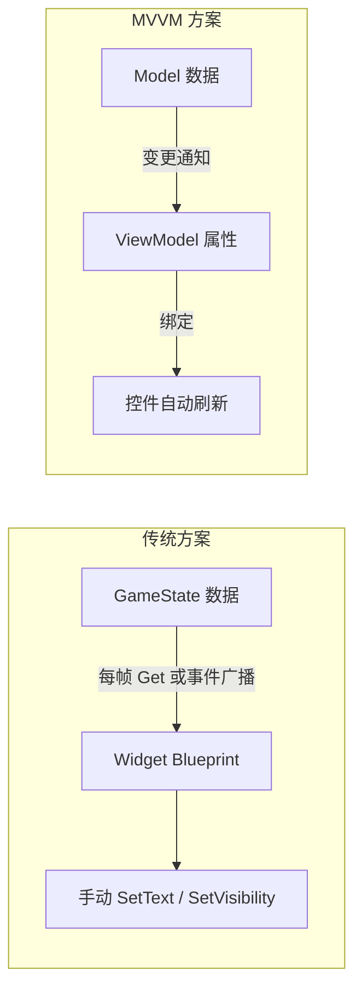
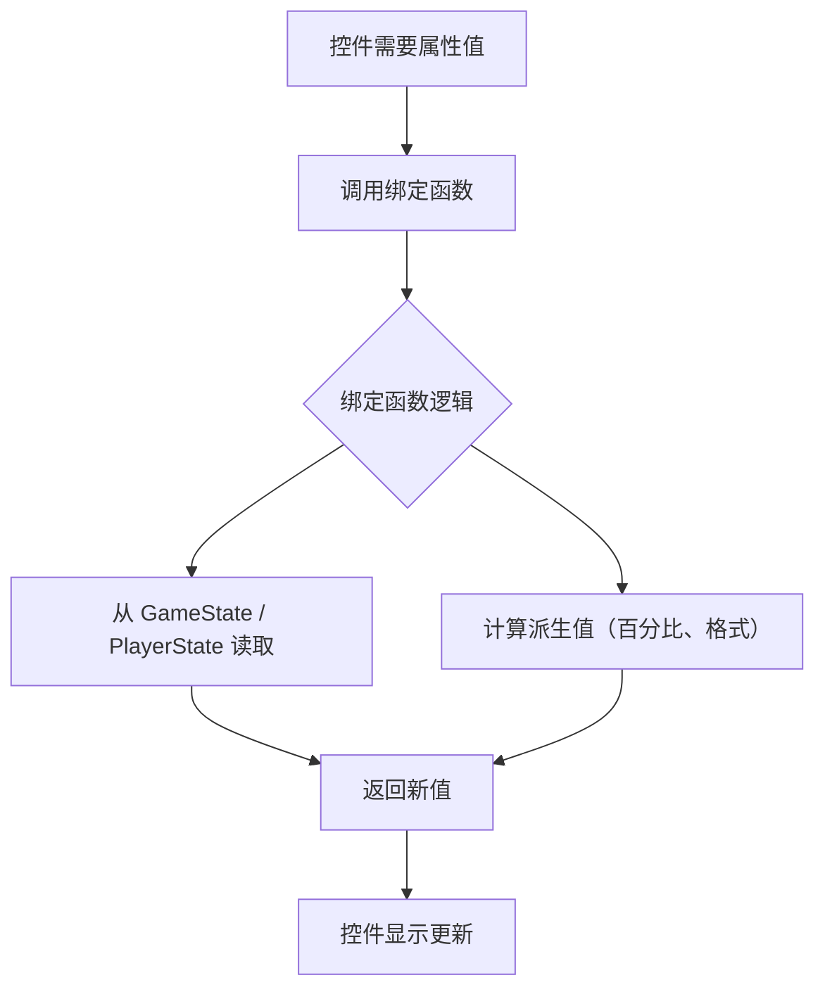
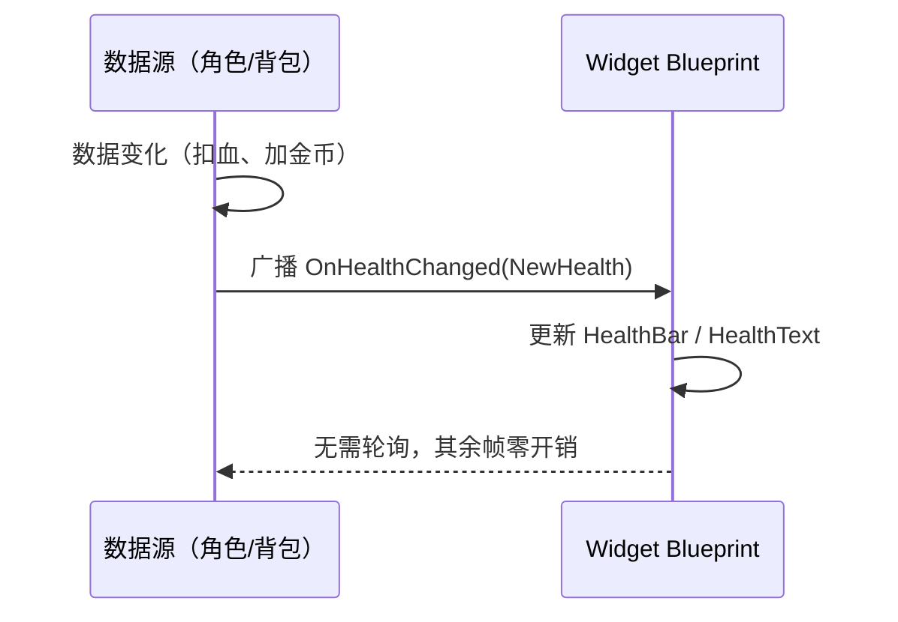
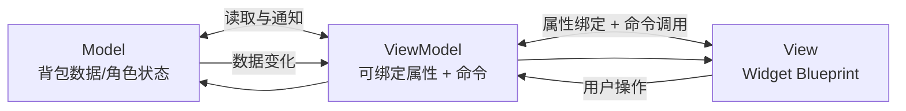
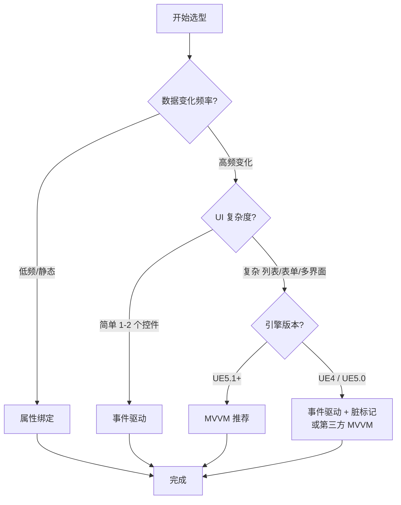

# 02 · UI 数据绑定与 MVVM
> 版本基准：UE 5.8.0（本机 `Engine/Build/Build.version`：CL 55116800，分支 `++UE5+Release-5.8`）。
> 兼容性边界：适用于 UE5.8 编辑器/运行时，UE4.27 与早期 UE5 仅作迁移背景，具体模块以正文为准。
> 最后更新：2026-08-06（本轮元数据维护）。

## 1. 概述

UI 开发中最大的复杂度来源不是"画界面"，而是"让界面跟上数据"。本章系统讲解 UE 中 UI 与数据同步的三种主流方案，从最基础的**属性绑定（Binding）**，到**事件驱动刷新（Event-driven Refresh）**，再到 UE5.1+ 引入的**原生 MVVM（Model-View-ViewModel）框架**，并给出各自的适用场景与工程实践。

三种方案的本质区别：

| 方案 | 刷新机制 | 粒度 | 解耦程度 | 适用场景 |
| --- | --- | --- | --- | --- |
| 属性绑定 | 每帧轮询（Poll） | 粗（整控件） | 低 | 少量低频数据 |
| 事件驱动 | 数据变更时广播（Push） | 中（可精确到控件） | 中 | 大多数游戏 UI |
| MVVM（UE5.1+） | 属性变更通知 + 自动绑定 | 细（精确到属性） | 高 | 大型项目、列表、复杂表单 |



选择建议：

- **原型 / 小功能**：属性绑定或事件驱动即可，不要过度设计；
- **核心 UI（背包、商城、角色面板）**：优先 MVVM（UE5.1+）或规范的事件驱动；
- **已有 UE4 项目**：事件驱动 + 手动刷新是主流，MVVM 需要升级到 UE5.1+ 并引入插件。

---

## 2. 核心概念（表格）

| 概念 | 英文 | 说明 | 所属方案 |
| --- | --- | --- | --- |
| 属性绑定 | Widget Binding | 在 Widget Blueprint 中把控件属性绑定到函数返回值 | 属性绑定 |
| 绑定函数 | Binding Function | 每帧被调用的返回函数，如 `GetHealthText` | 属性绑定 |
| 轮询 | Polling | 每帧查询数据源判断是否变化 | 属性绑定 |
| 委托 | Delegate | C++/蓝图的事件回调机制 | 事件驱动 |
| 动态多播委托 | Dynamic Multicast Delegate | 可序列化、可在蓝图中绑定的委托 | 事件驱动 |
| 事件分发器 | Event Dispatcher | 蓝图侧的事件广播机制 | 事件驱动 |
| 脏标记 | Dirty Flag | 记录"数据已变化待刷新"的标志 | 事件驱动 |
| Model | Model | 数据与业务规则（游戏状态、背包数据） | MVVM |
| View | View | 界面（Widget Blueprint） | MVVM |
| ViewModel | ViewModel | 暴露给 View 的属性与命令，UI 与 Model 的中介 | MVVM |
| 属性通知 | Property Notification | 属性变化时触发 `FieldNotify` 回调 | MVVM |
| 字段通知 | FieldNotify | UE5.1+ 中标记可被 UI 绑定的属性 | MVVM |
| 绑定属性 | Bindable Property | 可被 View 绑定的属性（`UE::FieldNotify`） | MVVM |
| 绑定源 | Binding Source | 绑定的数据来源（ViewModel 或自身属性） | MVVM |
| 命令 | Command | ViewModel 暴露的可执行操作（如 `OnClick`） | MVVM |
| 列表虚拟化 | List Virtualization | ListView 只实例化可见条目 | 事件驱动 / MVVM |

---

## 3. 原理详解

### 3.1 属性绑定（Widget Binding）

#### 工作机制

在 Widget Blueprint 的 Details 面板中，某些属性（如 `Text`、`Visibility`、`Color`）右侧有"绑定"下拉菜单，选择"Bind"后会生成一个绑定函数（如 `Get_Text_0`）。**该函数在控件需要该属性时被调用**：

- 静态绑定：控件重绘/重建时调用；
- 动态绑定：对 `Text` 等属性，实际上每次 `Tick`（或失效时）都会重新求值，以确保文本更新。



#### 优缺点

优点：

- 零样板代码，蓝图里点几下即可；
- 无需手动管理刷新时机，简单场景非常省事。

缺点：

- **每帧轮询**：绑定函数每帧被调用（或频繁求值），对象多时开销大；
- **解耦差**：绑定函数直接依赖数据源类型，无法复用；
- **粒度粗**：一个绑定变化会触发整个控件（甚至子树）失效重绘；
- **难调试**：调用时机隐式，排查"为什么没刷新"很痛苦。

> 结论：属性绑定适合"静态显示 + 低频变化"（如角色名字、版本号）。高频变化的数值（血量、金币）不建议用绑定函数。

### 3.2 事件驱动刷新（Event-driven Refresh）

#### 工作机制

数据源在变化时**主动广播事件**，UI 监听事件并更新自己。UE 提供两层机制：

- **C++ 动态多播委托**（`DECLARE_DYNAMIC_MULTICAST_DELEGATE`）：可被蓝图绑定；
- **蓝图 Event Dispatcher**：蓝图侧的事件广播器。



#### 关键实践：脏标记 + 批量刷新

高频事件（如每帧更新位置）需要"合并刷新"：

1. 事件处理器只设置脏标记（Dirty Flag），不立即刷新；
2. 在 Widget 的 `Tick`（或 MVVM 的刷新时机）检查脏标记，统一刷新一次。

```cpp
// 示例：脏标记合并刷新
void UHUDWidget::OnHealthChanged(float NewHealth)
{
    bHealthDirty = true; // 只标记，不立刻刷新
}

void UHUDWidget::NativeTick(const FGeometry& MyGeometry, float InDeltaTime)
{
    Super::NativeTick(MyGeometry, InDeltaTime);
    if (bHealthDirty)
    {
        bHealthDirty = false;
        UpdateHealthDisplay();
    }
}
```

#### 优缺点

优点：

- **零空闲开销**：不变化就不消耗；
- **解耦好**：数据源不知道 UI 的存在，只广播事件；
- **刷新可控**：可以精确到控件、精确到属性。

缺点：

- **样板代码多**：每个数据都要"声明委托 + 绑定 + 解绑 + 更新函数"；
- **生命周期管理麻烦**：Widget 销毁时必须解绑，否则悬空委托；
- **列表/复杂表单**：增删改事件组合容易出错。

### 3.3 MVVM 框架（UE5.1+）

#### 设计目标

MVVM（Model-View-ViewModel）把 UI 拆成三层：

- **Model**：数据与业务逻辑（不依赖 UI）；
- **View**：界面（Widget Blueprint），只声明"我显示什么数据"，不写刷新逻辑；
- **ViewModel**：暴露可绑定属性与命令，监听 Model 变化并转发给 View。



#### UE5.1+ 原生 MVVM 的核心机制

1. **FieldNotify 字段**：`UPROPERTY(BlueprintReadWrite, FieldNotify)` 标记的属性，变化时自动通知绑定方；
2. **绑定源（Binding Source）**：Widget Blueprint 中为控件属性选择绑定源（ViewModel 实例或自身），并在 Details 中选择要绑定的属性；
3. **自动刷新**：绑定属性变化时，框架自动标记对应控件失效并刷新，无需手写更新函数；
4. **列表支持**：`ListView` 可直接绑定 ViewModel 集合，支持增删改自动同步；
5. **编辑器工具**：Widget Designer 中提供"绑定"下拉框，可直接选择 ViewModel 属性。

```cpp
// C++ 中声明一个可绑定属性
UCLASS()
class UInventoryViewModel : public UMVVMViewModelBase
{
    GENERATED_BODY()

public:
    UPROPERTY(BlueprintReadWrite, FieldNotify, Setter, Getter)
    int32 GoldCount;

    void SetGoldCount(int32 NewValue)
    {
        UE_MVVM_SET_PROPERTY_VALUE(GoldCount, NewValue);
    }
};
```

> 注意：`UE_MVVM_SET_PROPERTY_VALUE` 宏会自动调用 `UE_MVVM_BROADCAST_FIELD_VALUE_CHANGED`，把"属性已变化"广播给所有绑定的控件。

#### MVVM 的代价与前提

- 需要 UE5.1+（5.0 及以下需要第三方插件，如 MVVM 社区插件）；
- ViewModel 生命周期需要管理（谁创建、谁销毁、何时绑定/解绑）；
- 绑定是"隐式"的，出问题时排查链路比事件驱动长；
- 对简单 UI 属于过度设计。

---

## 4. 代码 / 蓝图示例

### 4.1 属性绑定：蓝图绑定函数

1. 选中 `TextBlock_Health`；
2. Details → `Text` → 绑定（Bind）→ 创建绑定函数 `Get_HealthText`；
3. 在函数中：

```mermaid
flowchart LR
    A[Get Player State] --> B[Cast to AMyPlayerState]
    B --> C[Get Health]
    C --> D[To Text Format<br/>血量：{0}]
    D --> E[Return Value]
```

### 4.2 事件驱动：C++ 委托 + 蓝图绑定

```cpp
// MyPlayerState.h
DECLARE_DYNAMIC_MULTICAST_DELEGATE_OneParam(FOnHealthChanged, float, NewHealth);

UCLASS()
class AMyPlayerState : public APlayerState
{
    GENERATED_BODY()
public:
    UPROPERTY(BlueprintAssignable)
    FOnHealthChanged OnHealthChanged;

    void SetHealth(float NewHealth);
};

// MyPlayerState.cpp
void AMyPlayerState::SetHealth(float NewHealth)
{
    Health = NewHealth;
    OnHealthChanged.Broadcast(NewHealth);
}
```

蓝图中：`Event Construct` → `Get Player State` → `Cast` → `Bind Event to OnHealthChanged` → 在事件中 `Set Percent`。

### 4.3 事件驱动：蓝图 Event Dispatcher

1. 在数据组件（如 `UInventoryComponent`）中创建 Event Dispatcher `OnGoldChanged`；
2. 数据变化处调用 `OnGoldChanged.Broadcast(NewGold)`；
3. Widget 的 `Construct` 中 `Bind Event to OnGoldChanged`；
4. Widget 的 `Destruct` 中 `Unbind Event`（重要！）。

### 4.4 MVVM：创建 ViewModel 并绑定

**步骤 1**：创建 ViewModel 蓝图（或 C++ 类）：

- 右键 → Blueprint Class → 父类选择 `MVVMViewModelBase`；
- 添加 `UPROPERTY(BlueprintReadWrite, FieldNotify)` 的变量 `GoldCount`；
- 变量名右键 → 属性通知设置，勾选"属性变化时通知"。

**步骤 2**：在 Widget Blueprint 中初始化：

- Details → `Initialize View Model`（或 C++ `InitializeViewModel`）；
- 选择 ViewModel 类，设置初始化数据。

**步骤 3**：绑定控件属性：

- 选中 `TextBlock_Gold` → `Text` → 绑定 → 选择绑定源为 ViewModel → 选择 `GoldCount`（自动生成 `To Text` 转换）；
- 运行后修改 `GoldCount`，文本自动更新。

```cpp
// C++ 侧初始化与修改
UInventoryViewModel* VM = NewObject<UInventoryViewModel>(this);
Widget->InitializeViewModel(VM);
VM->SetGoldCount(100);   // 界面自动刷新
```

### 4.5 MVVM 列表绑定

1. ViewModel 添加 `UPROPERTY(BlueprintReadOnly, FieldNotify)` 的 `TArray<FItemData> Items`；
2. Widget 中添加 `ListView`，在 Details 中把 `ListItems` 绑定到 ViewModel 的 `Items`；
3. 设置 `Entry Widget Class` 为列表项 Widget；
4. 数据增删时调用 `UE_MVVM_SET_PROPERTY_VALUE`，列表自动同步。

### 4.6 stat / 调试命令清单表

| 命令 | 作用 | 关注指标 | 使用场景 |
| --- | --- | --- | --- |
| `stat unit` | 帧时间总览 | `Game` 线程耗时 | 确认 UI 刷新是否拖慢帧 |
| `stat slate` | Slate 统计 | `Invalidate` 次数 | 绑定导致的重绘风暴 |
| `stat UMG` | UMG 统计 | Widget 数量 | 绑定创建的控件泄漏 |
| `stat memory` | 内存统计 | `UObject` 数量 | ViewModel / Widget 泄漏 |
| `obj list class=UserWidget` | 列出所有 UserWidget 实例 | 数量与引用 | 排查控件未销毁 |
| `obj list class=MVVMViewModelBase` | 列出 ViewModel 实例 | 数量 | 排查 ViewModel 泄漏 |
| `log LogMVVM Verbose` | MVVM 日志 | 绑定/通知记录 | MVVM 绑定链路调试 |
| `Slate.EnableInvalidationPanels 0` | 关闭失效面板 | 对比开销 | 判断重绘是否来自绑定 |

---

## 5. 最佳实践

### 5.1 方案选型决策流程



### 5.2 数据层设计规范

- **数据只存一处**：血量为 PlayerState 属性，UI 不缓存副本；
- **派生值由数据层计算**：百分比、格式化文本在数据层/ViewModel 完成，UI 只显示；
- **广播时机统一**：所有数据修改走同一个 Setter，确保一定会广播；
- **批量变更合并**：一次逻辑产生多次数据变化时，用脏标记合并刷新，避免重复重绘。

### 5.3 事件生命周期管理

- Widget `Construct` 中绑定，`Destruct` 中必须解绑；
- 优先使用 `TWeakObjectPtr` 持有数据源引用，避免强引用导致数据源无法销毁；
- C++ 绑定建议使用 `AddDynamic` + `RemoveDynamic` 对称调用；
- 跨模块事件用 `GameInstanceSubsystem` 或事件总线（Event Bus）转发，避免网状引用。

### 5.4 MVVM 工程规范（UE5.1+）

- ViewModel 只包含"界面所需数据"，不包含游戏逻辑；
- 每个 Widget 绑定 1~2 个 ViewModel，避免"上帝 ViewModel"；
- ViewModel 由谁创建就由谁销毁（推荐与 Widget 同生命周期）；
- 使用 `FieldNotify` 时注意：频繁变化属性（如位置）不要绑定到 UI，仍用脏标记；
- 列表条目 ViewModel 由列表项 Widget 自行创建，条目销毁时一并销毁。

### 5.5 性能红线（经验值）

| 指标 | 预算建议 | 说明 |
| --- | --- | --- |
| 属性绑定函数数 | < 20 个/界面 | 绑定函数每帧求值，过多拖慢 Game 线程 |
| 每帧刷新控件数 | < 50 | 超过考虑脏标记合并 |
| 事件广播频率 | < 1000 次/秒 | 高频事件必须合并 |
| 列表可见条目 | < 50（移动端） | 超出必须虚拟化 |
| ViewModel 绑定数 | < 200/Widget | 绑定过多影响初始化与失效管理 |

---

## 6. 常见问题 FAQ

### Q1：绑定函数每帧执行，性能太差怎么办？

**原因**：`Text` 等属性的绑定函数在控件失效时频繁求值。
**解决**：改用事件驱动或 MVVM；或把绑定函数逻辑改为"仅在数据变化时被调用"的更新函数。

### Q2：事件绑定后 Widget 销毁了还报错（悬空引用）？

**原因**：`Destruct` 中未解绑，数据源广播时调用了已销毁控件的方法。
**解决**：`Construct`/`Destruct` 对称绑定/解绑；绑定目标用 `TWeakObjectPtr`；或在数据源侧用 `IsValid()` 防护。

### Q3：MVVM 绑定后界面不刷新？

**原因**：属性未标 `FieldNotify`；修改属性时未走 Setter（直接改内部变量）；或绑定源未初始化。
**解决**：确认 `UPROPERTY(FieldNotify)`；修改必须走 `UE_MVVM_SET_PROPERTY_VALUE`；检查 Widget 的 `InitializeViewModel` 是否调用。

### Q4：列表数据变化但 UI 不更新？

**原因**：`TArray` 是值类型，直接 `Add` 不会触发 FieldNotify。
**解决**：修改后调用 `UE_MVVM_SET_PROPERTY_VALUE(Items, Items)`（整体赋值触发通知），或使用支持增量通知的容器（如 `FMVVMFieldNotification` 结合 `UListView` 的 `SetListItems`）。

### Q5：MVVM 与 CommonUI 能一起用吗？

**可以**。CommonUI 管输入与焦点，MVVM 管数据绑定，两者职责互补。常见组合：`CommonActivatableWidget`（View）+ `MVVMViewModelBase`（ViewModel）。

### Q6：要不要给 UE4 项目引入 MVVM？

**建议**：除非项目有明确的重构预算，否则 UE4 项目继续用"事件驱动 + 手动刷新"，并在升级 UE5.1+ 时再迁移 MVVM。第三方 MVVM 插件需要评估维护风险。

### Q7：绑定函数的返回值类型可以自定义吗？

**可以**。绑定函数可以返回任意蓝图可访问类型；对于 `Text` 绑定建议返回 `FText`（本地化友好），不要返回 `FString`。

### Q8：多个界面需要同一份数据，怎么共享？

**推荐**：数据放在共享的 Subsystem / 组件中，每个界面持有自己的 ViewModel 或事件绑定；不要让多个 Widget 直接修改同一份 UI 状态。

---

## 7. 关联阅读

- [UE 5.8 官方文档：UMG Viewmodel](https://dev.epicgames.com/documentation/en-us/unreal-engine/umg-viewmodel-for-unreal-engine)（FieldNotify、Viewmodel、绑定源）
- [UE 5.8 官方 API：ModelViewViewModel 模块](https://dev.epicgames.com/documentation/en-us/unreal-engine/API/Plugins/ModelViewViewModel)（运行时类与源码位置）
- [UE 5.8 官方 API：UListView](https://dev.epicgames.com/documentation/unreal-engine/API/Runtime/UMG/UListView?lang=en-US)（虚拟化列表）
- 本知识库：`01-UMG框架与控件系统.md`（控件与事件基础）
- 本知识库：`03-性能分析工具与Profiling.md`（绑定开销分析）
- 本知识库：`04-渲染与加载性能优化.md`（UI 渲染与内存优化）

---

*下一篇：03-性能分析工具与Profiling —— 用数据说话，定位 UI 与渲染瓶颈。*
