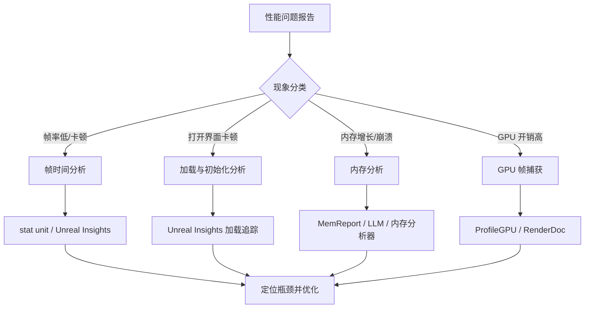
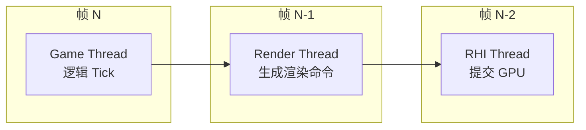
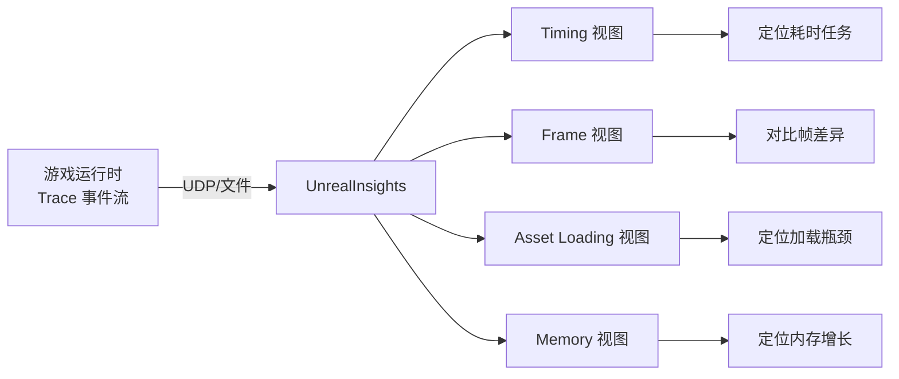
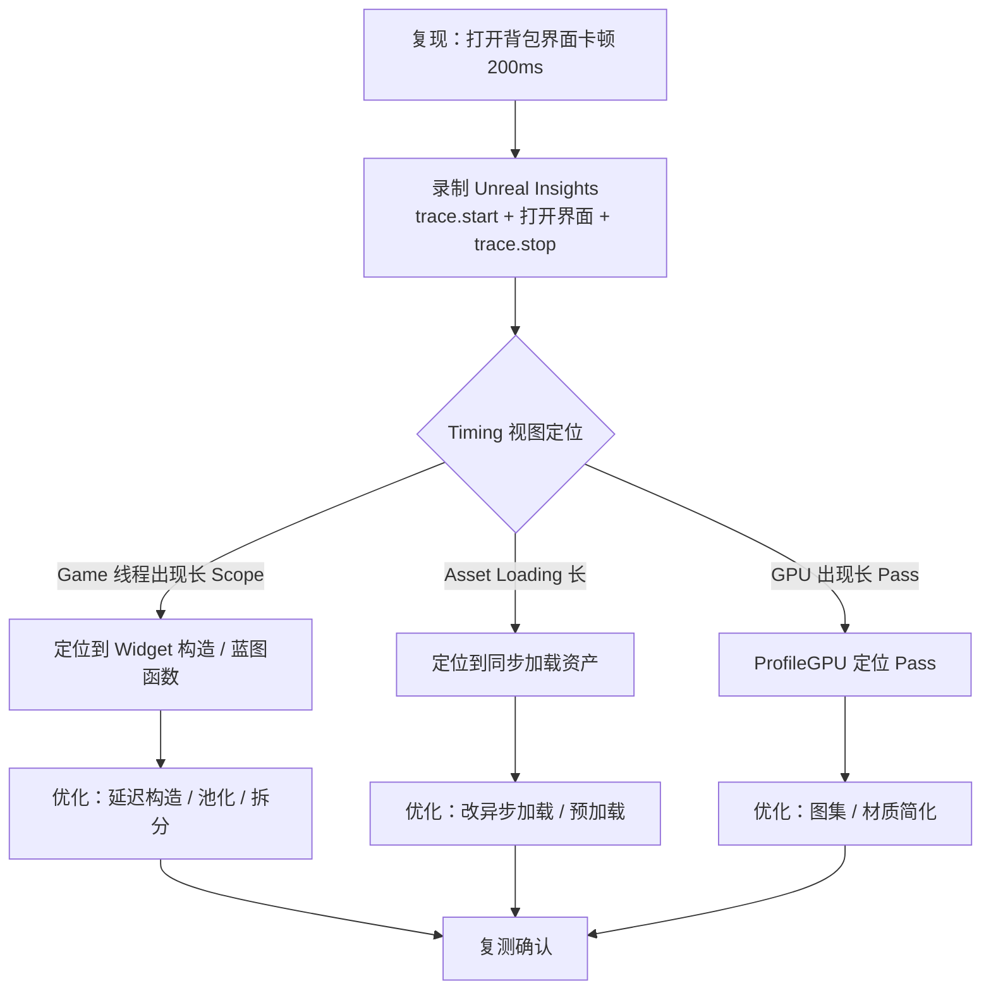

# 03 · 性能分析工具与 Profiling

## 1. 概述

性能优化必须遵循"**先测量，再优化**"的原则。本章系统介绍 UE 客户端性能分析工具链：从开发期的 `stat` 系列控制台命令、`ProfileGPU` 帧捕获，到系统级的 **Unreal Insights** 时间线分析，再到内存分析（LLM、MemReport、内存分析器），帮助开发者快速定位"CPU 卡在哪、GPU 卡在哪、内存多在哪"。



工具选择速查：

| 场景 | 首选工具 | 备选 |
| --- | --- | --- |
| 帧时间拆解（CPU/GPU） | `stat unit` / `stat unitGraph` | Unreal Insights |
| 单帧内部耗时分布 | Unreal Insights（Timing Insights） | `stat startfile` + 分析器 |
| 具体系统耗时 | `stat` 系列细分命令 | Unreal Insights 追踪 |
| GPU 瓶颈定位 | `ProfileGPU` | RenderDoc、PIX |
| 内存占用分析 | `MemReport` / LLM | 内存分析器（Memory Profiler） |
| 对象泄漏 | `obj list` / `memreport -full` | Unreal Insights 内存追踪 |
| 加载耗时分析 | Unreal Insights（Asset Load） | `log LogStreaming Verbose` |

---

## 2. 核心概念（表格）

| 概念 | 英文 | 说明 |
| --- | --- | --- |
| 帧时间 | Frame Time | 一帧的总耗时（ms），目标平台预算决定帧率 |
| Game 线程 | Game Thread | 游戏逻辑线程（Tick、蓝图、GC 的起点） |
| Render 线程 | Render Thread | 生成渲染命令的线程 |
| RHI 线程 | RHI Thread | 提交 GPU 命令的线程 |
| 瓶颈 | Bottleneck | 限制帧率的最慢环节（CPU/GPU/IO） |
| stat 命令 | Stat Commands | 控制台性能统计命令（`stat unit` 等） |
| 统计组 | Stat Group | 一组相关统计项（`stat game`、`stat gpu`） |
| Unreal Insights | Unreal Insights | UE 官方性能追踪分析工具（独立应用） |
| Trace | Trace | 运行时事件记录系统（`Trace.*` 控制台命令） |
| 追踪会话 | Trace Session | 一次录制与分析会话 |
| ProfileGPU | ProfileGPU | GPU 帧内各 Pass 耗时统计命令 |
| 捕获 | Capture | 录制一帧/一段时间的数据 |
| LLM | Low Level Memory Tracker | 底层内存追踪器（UE4.24+） |
| MemReport | MemReport | 内存报告命令，输出文本报告 |
| 内存分析器 | Memory Profiler | 可视化内存分配分析工具 |
| 转储 | Dump | 导出统计/状态数据（`stat dump`） |
| 控制台变量 | CVar | 运行时可调的配置项（`r.`、`Slate.` 前缀） |

---

## 3. 原理详解

### 3.1 帧时间模型：谁在拖慢帧率

UE 的帧由三条主要线程流水线构成：



由于流水线并行，**瓶颈是三者中最慢的一个**：

- Game 线程慢：逻辑过多、蓝图 Tick、GC、UI 刷新；
- Render 线程慢：渲染命令生成、可见性计算、动态网格更新；
- GPU 慢：Overdraw、材质复杂度、分辨率、后处理。

`stat unit` 的典型输出解读：

```text
Frame: 16.7 ms  Game: 9.2 ms  Draw: 6.1 ms  GPU: 15.4 ms  RHIT: 1.2 ms
```

结论：GPU 15.4ms 接近帧预算 16.7ms，说明 **GPU 是瓶颈**，应优先优化渲染（材质、Overdraw、Draw Call）。

```text
Frame: 16.7 ms  Game: 15.1 ms  Draw: 3.2 ms  GPU: 5.0 ms
```

结论：**Game 线程是瓶颈**，应优先优化逻辑与 UI。

### 3.2 stat 系列命令详解

#### stat unit / stat unitGraph

- `stat unit`：文本显示帧时间；
- `stat unitGraph`：图形化显示各线程耗时曲线，适合观察波动；
- `stat unit -Detailed`：显示更多细分（UE5）。

#### 常用 stat 命令族

| 命令 | 统计内容 | 典型用法 |
| --- | --- | --- |
| `stat game` | Game 线程细分 | 蓝图、导航、物理耗时 |
| `stat engine` | 引擎核心统计 | Tick 总量、组件数 |
| `stat streaming` | 流送统计 | 正在加载的资产 |
| `stat rhi` | RHI 统计 | 渲染线程命令、缓冲 |
| `stat gpu` | GPU 各阶段 | 场景渲染、后处理、UI |
| `stat slate` | Slate/UMG 统计 | UI 刷新开销 |
| `stat memory` | 内存概览 | 物理内存、虚拟内存 |
| `stat net` | 网络统计 | 同步包大小与频率 |
| `stat scenerendering` | 场景渲染细分 | 网格、光照、剔除 |
| `stat animation` | 动画系统统计 | 骨骼、蒙皮耗时 |

#### stat 命令通用语法

```text
stat <组名>           # 显示/隐藏统计组
stat groupname -enable / -disable
stat dump             # 导出当前统计到日志
stat startfile        # 开始记录 .uprof
stat stopfile         # 停止记录
stat levels           # 各关卡耗时
```

### 3.3 Unreal Insights

Unreal Insights 是 UE 官方的**跨平台性能分析工具**（独立程序，位于 `Engine/Binaries/Win64/UnrealInsights.exe`），基于 Trace 系统录制并分析：

**启动方式**：

```text
-trace=default,log,cpu,gpu,frame,bookmark  （启动参数）
-tracehost=127.0.0.1                       （指定接收端）
```

或运行时控制台：

```text
trace.start file
trace.stop
trace.start default
```

**核心视图**：

1. **Timing Insights**：线程时间线，逐帧查看 Game/Render/RHI 线程任务；
2. **Frame Insights**：帧摘要，快速对比各帧耗时；
3. **Asset Loading Insights**：资产加载追踪（Async Loading 的耗时瀑布）；
4. **Memory Insights**：内存分配时间线（需 `-trace=memory`）；
5. **Net Insights**：网络包追踪。



**关键使用流程**：

1. 复现问题（挂机、打开界面、战斗）时录制 Trace；
2. 在 Timing Insights 中按帧放大，找到耗时异常的 Scope（如 `UUserWidget::NativeTick`、`FAsyncLoadingThread`）；
3. 用 Frame Insights 对比正常帧与卡顿帧；
4. 修改代码后重新录制对比。

> 注意：Trace 录制本身有开销，移动端建议用 `-trace=default` 精简通道，并控制录制时长。

### 3.4 GPU 分析：ProfileGPU 与 RenderDoc

#### ProfileGPU

控制台执行 `ProfileGPU`（或 `stat gpu` 持续观察），输出 GPU 帧内每个 Pass 的耗时：

```text
Frame: 15.2 ms
  Scene: 11.0 ms
    BasePass: 6.4 ms
    Translucency: 1.8 ms
    PostProcess: 2.5 ms
  UI (Slate): 1.5 ms
```

解读要点：

- **BasePass 高**：材质复杂度、Overdraw、顶点数；
- **Translucency 高**：半透明物体过多、排序开销；
- **PostProcess 高**：后处理链过长（Bloom、SSR、AO）；
- **UI 高**：UI 纹理、控件数、无效重绘。

#### RenderDoc / PIX

- RenderDoc：单帧 GPU 调试（顶点/像素着色器、资源、Draw Call 列表）；
- PIX（Windows）：微软 GPU 分析器，可查看 Occupancy、带宽；
- 使用前提：编辑器/游戏以 `-RenderDoc` 启动，或安装 RenderDoc 插件。

### 3.5 内存分析

#### 内存分析命令

| 命令 | 作用 |
| --- | --- |
| `memreport` | 输出完整内存报告（对象、贴图、材质、关卡）到 Saved 目录 |
| `memreport -full` | 更详细的报告（含每张贴图） |
| `stat memory` | 实时内存概览 |
| `obj list class=Texture2D` | 列出指定类实例与数量 |
| `obj list -alphabetical` | 按字母列出对象统计 |
| `LLM` 相关 CVar | `LLM.Enable`、`LLM.Dump` |
| `stat LLM` | LLM 分类内存统计 |

#### 内存分析器（Memory Profiler）

UE 自带内存分析器（编辑器 → Tools → Memory Profiler，或独立工具），可查看：

- 分配调用栈（谁分配了这块内存）；
- 分类统计（Mesh、Texture、Animation、UI）；
- 随时间变化的内存曲线。

**LLM（Low Level Memory Tracker）** 是底层分配追踪器，按标签（Tag）分类统计，适合定位"内存被谁吃掉"：

```text
stat LLM
LLM.Dump          # 输出 LLM 分类摘要
```

#### UI 内存排查要点

- `obj list class=UserWidget`：检查 Widget 是否泄漏（数量只增不减）；
- `obj list class=Texture2D`：检查 UI 贴图是否重复加载；
- `memreport` 中查找 `Texture2D` 大块占用；
- 字体（Font）与图集（Atlas）是 UI 内存大户，注意字体子集化。

---

## 4. 代码 / 蓝图示例

### 4.1 完整排查流程示例：UI 打开卡顿



### 4.2 C++：自定义 Scope 计时（并入 stat）

```cpp
#include "Stats/Stats.h"

// 声明统计组（头文件中）
DECLARE_CYCLE_STAT(TEXT("MyUI_OpenPanel"), STAT_MyUI_OpenPanel, STATGROUP_Game);

void UMyUIManager::OpenPanel()
{
    SCOPE_CYCLE_COUNTER(STAT_MyUI_OpenPanel); // 自动计时
    // ... 打开面板逻辑
}
```

随后 `stat game` 中会出现 `MyUI_OpenPanel` 耗时项。

### 4.3 C++：帧时间记录与警报

```cpp
// 在 GameMode 中每帧记录 Game 线程耗时
void AMyGameMode::Tick(float DeltaSeconds)
{
    Super::Tick(DeltaSeconds);
    const float FrameTime = FPlatformTime::ToSeconds(
        FPlatformTime::Cycles() - LastFrameCycles) * 1000.0f;
    LastFrameCycles = FPlatformTime::Cycles();

    if (FrameTime > 33.0f) // 低于 30 FPS
    {
        UE_LOG(LogTemp, Warning, TEXT("Frame time spike: %.2f ms"), FrameTime);
    }
}
```

### 4.4 蓝图：统计节点与条件计时

- 使用 `Get Game Time in Seconds` 记录开始/结束时间，差值即耗时；
- 使用 `Blueprint Debugger` 观察单帧内蓝图节点耗时；
- 使用 `Console Command` 节点在蓝图中动态执行 `stat unit` 等命令。

### 4.5 内存报告：MemReport 使用流程

1. 控制台执行 `memreport`，生成 `Saved/Profiling/MemReports/memreport-*.txt`；
2. 打开报告，先看 `Platform Memory Stats`（物理/虚拟内存总量）；
3. 查看 `Texture Memory`、`Mesh Memory`、`UObject` 统计定位大头；
4. 对比两次报告（如"打开界面前后"）找出增长项。

### 4.6 stat / 分析命令总清单表

| 命令 | 作用 | 优先级 |
| --- | --- | --- |
| `stat unit` | 帧时间总览（Game/Draw/GPU/RHIT） | ★★★ 必用 |
| `stat unitGraph` | 帧时间曲线图 | ★★★ |
| `stat game` | Game 线程细分 | ★★ |
| `stat engine` | 引擎总体统计 | ★★ |
| `stat streaming` | 资源流送状态 | ★★ |
| `stat scenerendering` | 场景渲染细分（剔除、光照） | ★★ |
| `stat gpu` | GPU 阶段统计 | ★★★ |
| `ProfileGPU` | GPU 帧 Pass 明细 | ★★★ |
| `stat slate` | Slate/UMG 刷新开销 | ★★★（UI 场景） |
| `stat UMG` | UMG 实例统计 | ★★（UI 场景） |
| `stat memory` | 内存概览 | ★★ |
| `memreport` / `memreport -full` | 完整内存报告 | ★★★ |
| `stat LLM` | LLM 分类内存 | ★★ |
| `obj list class=XXX` | 对象实例清单 | ★★★（泄漏排查） |
| `stat startfile` / `stat stopfile` | 录制 `.uprof` | ★★ |
| `trace.start` / `trace.stop` | 录制 Trace（Insights） | ★★★ |
| `stat dump` | 导出当前统计 | ★ |
| `r.RHI.EnableValidation` | RHI 校验（开发） | ★ |

---

## 5. 最佳实践

### 5.1 分析流程规范

1. **先复现**：固定场景、固定操作路径，保证对比基线一致；
2. **先看整体**：`stat unit` 判断瓶颈线程，再看细分；
3. **单变量原则**：一次只改一个因素，改完复测；
4. **记录数据**：用表格记录优化前后的 Frame/Game/GPU/内存数值；
5. **目标平台优先**：PC 上的结论不能直接套用移动端（CPU/GPU 差异巨大）。

### 5.2 常见误判与陷阱

- `Frame` 时间包含空闲等待：低帧率时先看 `Game`/`GPU` 是否真的忙；
- 编辑器统计与打包版差异大：性能数据以 **Development/Shipping 打包版** 为准；
- `stat` 显示的平均值会掩盖尖峰：用 `stat unitGraph` 或 Insights 看分布；
- GPU 统计在部分驱动/平台上不精确：结合 ProfileGPU 与 RenderDoc 交叉验证；
- 首帧/首次加载的耗时不算数：预热后再测。

### 5.3 UI 专项分析清单

- `stat slate` 的 `Invalidate` 次数是否异常高（每帧大量失效 = 重绘风暴）；
- `obj list class=UserWidget` 数量是否随开闭界面持续增长；
- Unreal Insights 中 `UUserWidget::NativeTick` 总耗时；
- `ProfileGPU` 中 `Slate` / `UI` Pass 的耗时与 Draw Call 数；
- `memreport` 中 UI 贴图、字体、图集占用。

### 5.4 性能预算管理

| 平台 | 帧预算（60FPS） | Game 预算 | GPU 预算 | 内存预算 |
| --- | --- | --- | --- | --- |
| PC 高端 | 16.6 ms | 5~7 ms | 8~10 ms | 不限（推荐 < 8GB） |
| PC 中端 | 16.6 ms | 6~8 ms | 9~11 ms | < 6GB |
| 移动端旗舰 | 16.6 ms | 6~8 ms | 8~10 ms | < 3.5GB |
| 移动端中端 | 33.3 ms（30FPS） | 12~15 ms | 15~18 ms | < 2.5GB |

> 以上为经验值。实际以项目 QA 与目标机型清单为准，建议建立自动化性能看板（CI 跑自动化压测 + 收集统计）。

---

## 6. 常见问题 FAQ

### Q1：`stat unit` 显示 Frame 高但 Game/GPU 都低，怎么回事？

**原因**：存在同步等待（如 GPU 等待 CPU、IO 阻塞）或瓶颈线程未显示（如渲染线程、网络线程）。
**解决**：开启 `stat unitGraph` 看各线程曲线；用 Unreal Insights 查看线程间的等待（Wait）关系；检查 `stat streaming` 是否有同步加载。

### Q2：移动端无法打开 Unreal Insights？

**原因**：Trace 通道未开启或网络受限。
**解决**：用启动参数 `-trace=default -tracefile=...` 录制到本地文件，再拷贝到 PC 用 UnrealInsights 分析；Android 上确保 `-tracehost` 指向 PC 且端口（默认 1980）可通。

### Q3：ProfileGPU 在移动端不输出结果？

**原因**：部分移动 GPU 驱动不支持 RHI 查询；或使用了 `-stat` 之外的启动模式。
**解决**：改用 RenderDoc（Android 支持）或通过 `r.RHI.GPUStatsEnabled` 相关 CVar 尝试；也可用 `stat gpu` 做粗略观察。

### Q4：`memreport` 输出在哪？

**路径**：`Saved/Profiling/MemReports/` 下，按时间命名。移动端若找不到，检查是否有写权限，或改用 `memreport -full` 后查看日志输出路径。

### Q5：如何排查"内存只增不减"的泄漏？

1. 固定操作循环（如反复开关背包界面 100 次）；
2. 每 10 次执行 `memreport`，对比 `UObject` 总数与各类对象数；
3. `obj list class=UserWidget`、`obj list class=Texture2D` 确认增长对象；
4. 用内存分析器（Memory Profiler）查看分配调用栈；
5. 重点检查：委托未解绑、`TStrongObjectPtr` 误用、静态引用持有、Subsystem 缓存未清理。

### Q6：Trace 录制导致帧率下降，数据失真怎么办？

**解决**：录制时间尽量短（10~30 秒）；精简通道（`-trace=default,cpu`）；对比录制与不录制的 `stat unit`；关键结论用多次录制交叉验证。

### Q7：`stat slate` 里哪些指标最重要？

**关注**：`Invalidate`（失效次数）、`Slate Tick`、`OnPaint` 调用次数、`Dynamic Draw` 数量。失效次数高 = 重绘风暴；OnPaint 多 = 控件树过大。

### Q8：怎么把性能数据接入 CI？

**方案**：使用 UE 的自动化测试（Gauntlet / SessionFrontend）+ 启动参数录制 Trace，配合 `-ExecCmds="stat startfile"`；或在测试关卡中定时执行 `memreport` 与 `stat dump`，收集产物到 CI 平台并绘制趋势图。

---

## 7. 关联阅读

- [UE 官方文档：Unreal Insights](https://docs.unrealengine.com/5.3/zh-CN/unreal-insights/)（Trace 系统与各视图）
- [UE 官方文档：性能与 Profiling](https://docs.unrealengine.com/5.3/zh-CN/performance-and-profiling/)（stat 命令总览）
- [UE 官方文档：内存分析与优化](https://docs.unrealengine.com/5.3/zh-CN/memory-profiling-in-unreal-engine/)（LLM、MemReport）
- [UE 官方文档：RenderDoc 集成](https://docs.unrealengine.com/5.3/zh-CN/renderdoc/)（GPU 调试）
- 本知识库：`01-UMG框架与控件系统.md`（UI 机制与 stat 关联命令）
- 本知识库：`04-渲染与加载性能优化.md`（基于分析结论的优化手段）
- 本知识库：`09-调试与工具链`（控制台命令与调试技巧）

---

*下一篇：04-渲染与加载性能优化 —— 从分析到落地，把数字变成帧率。*
