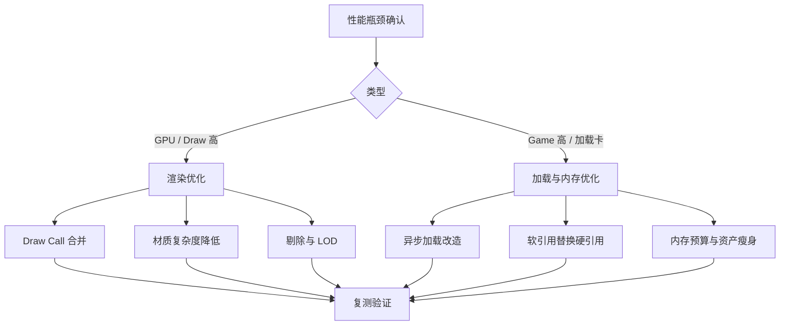
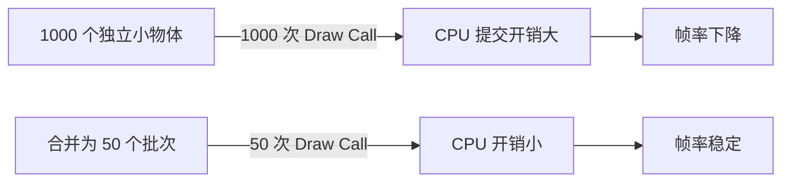
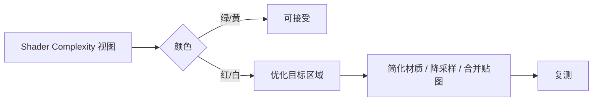
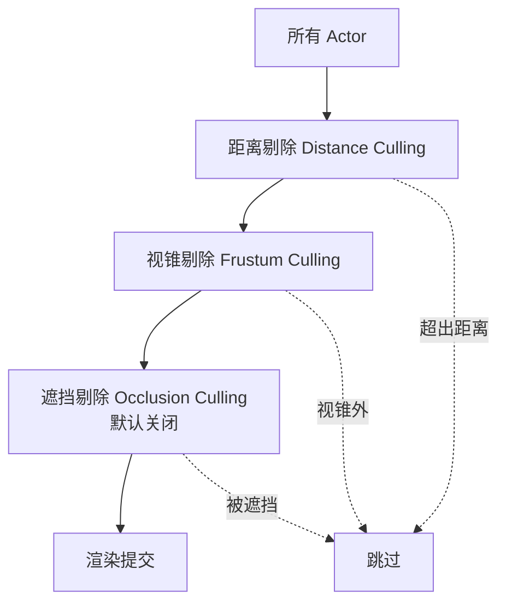
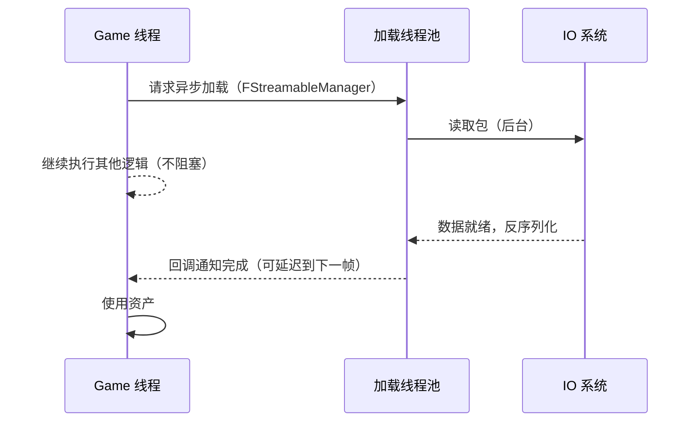
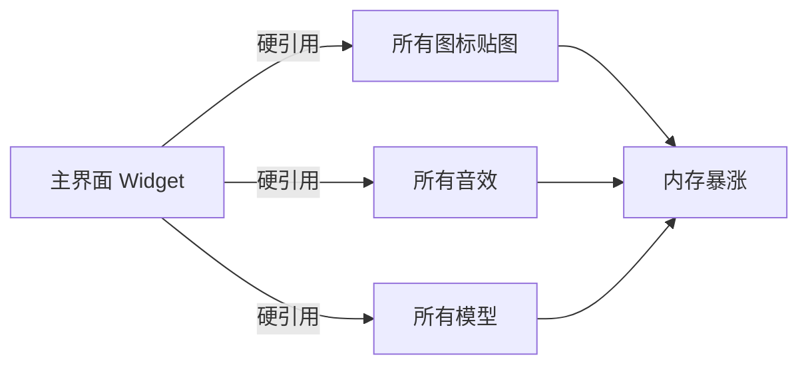
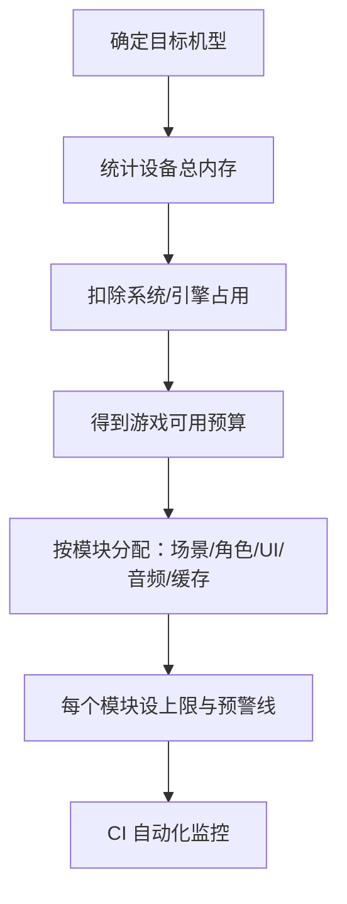
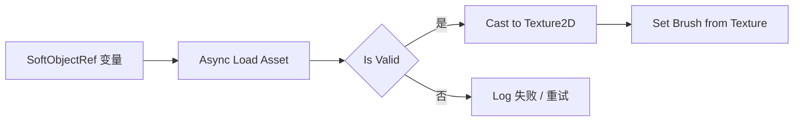
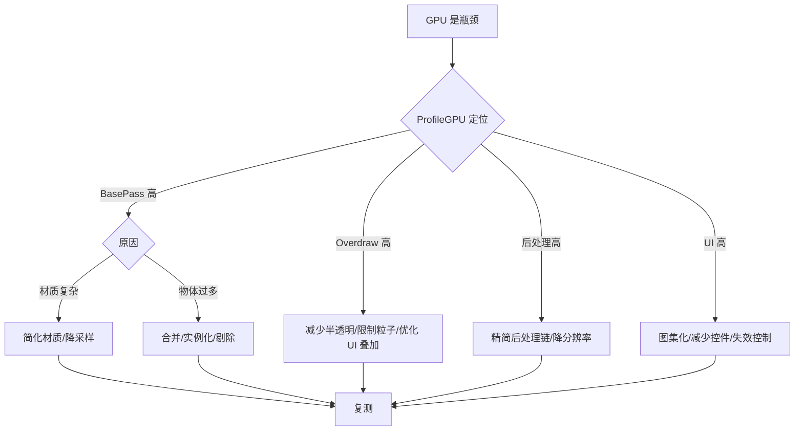

# 04 · 渲染与加载性能优化
> 版本基准：UE 5.8.0（本机 `Engine/Build/Build.version`：CL 55116800，分支 `++UE5+Release-5.8`）。
> 兼容性边界：适用于 UE5.8 编辑器/运行时，UE4.27 与早期 UE5 仅作迁移背景，具体模块以正文为准。
> 最后更新：2026-08-06（本轮元数据维护）。

## 1. 概述

性能优化的终点是"把预算花在刀刃上"。本章基于第 3 篇的分析方法，落地到两类最常遇到的优化场景：

1. **渲染优化**：Draw Call 合并、材质复杂度控制、可见性剔除（Culling）、UI 绘制优化；
2. **加载与内存优化**：异步加载（Async Loading）、软引用 vs 硬引用、内存预算管理、移动端限制适配。



核心思想：

- **渲染**：减少"提交给 GPU 的工作"（批次、像素、着色复杂度）；
- **加载**：减少"必须同步等待的工作"（加载、解压、反序列化）；
- **内存**：让"该在的资产在，不该在的不在"（生命周期、预算、引用策略）。

---

## 2. 核心概念（表格）

| 概念 | 英文 | 说明 |
| --- | --- | --- |
| 绘制调用 | Draw Call | CPU 向 GPU 提交的一次绘制命令 |
| 合批 | Batching | 合并多个物体为一次 Draw Call |
| 实例化 | Instancing | 同一网格多实例一次提交（如植被、建筑） |
| 材质复杂度 | Material Complexity | 材质指令数、纹理采样数、节点复杂度 |
| 过度绘制 | Overdraw | 同一像素被多次绘制（半透明叠加） |
| 剔除 | Culling | 不绘制不可见物体（视锥/遮挡/距离） |
| 视锥剔除 | Frustum Culling | 剔除视锥外的物体 |
| 遮挡剔除 | Occlusion Culling | 剔除被遮挡的物体 |
| 距离剔除 | Distance Culling | 剔除超出距离的物体 |
| 同步加载 | Synchronous Load | 阻塞调用线程的加载（`LoadObject`） |
| 异步加载 | Async Loading | 后台线程加载，不阻塞主线程 |
| 硬引用 | Hard Reference | 强引用，资产必然被加载/常驻 |
| 软引用 | Soft Reference | 弱引用（路径字符串），按需加载 |
| 主资产 | Primary Asset | 可被引用/加载的资产单元（PrimaryAssetId） |
| 资产注册表 | Asset Registry | 资产元数据数据库（路径、类型、依赖） |
| 内存预算 | Memory Budget | 各平台允许的内存上限分配计划 |
| 图集 | Texture Atlas | 多张小图合成一张大图，减少切换 |
| 纹理流送 | Texture Streaming | 按需加载不同 mip 级别纹理 |
| GC | Garbage Collection | UE 的 UObject 垃圾回收机制 |
| 包 | Package | UE 资产加载/存储的单元（.uasset） |

---

## 3. 原理详解

### 3.1 Draw Call 与合批

#### 为什么 Draw Call 昂贵

每次 Draw Call 需要 CPU 准备状态切换（绑定 PSO、纹理、顶点缓冲）并提交命令，GPU 等待命令到达。CPU 侧每次提交有固定开销，**大量小 Draw Call 会让 CPU 成为瓶颈**：



#### 合并手段

| 手段 | 原理 | 适用 |
| --- | --- | --- |
| 静态网格合并（Merge Actor） | 合并网格体为一个 Actor | 静态场景 |
| 实例化静态网格（ISM） | 同网格多实例一次提交 | 大量重复物体 |
| HISM（分层实例化） | ISM + LOD 与剔除层级 | 植被、大量装饰 |
| 纹理图集（Atlas） | 减少材质/纹理切换 | UI 与角色部件 |
| 材质实例合并 | 共享材质参数，避免切换 | 同材质不同参数 |
| 前向渲染合并 | 减少光照 Pass | 移动端 |
| Slate 合批 | UI 元素自动合批 | UI |

#### UI 的 Draw Call 特性

Slate 会把同一材质、同一图集的相邻绘制元素自动合批，但以下情况会**打断合批**：

- 纹理切换（每张贴图一个批次）；
- 透明度/颜色不同的元素间排序变化；
- 使用自定义材质（不透明材质仍可合批，带特殊混合的会打断）；
- 裁剪（Clipping）切换；
- 字体（同一字体图集内可合批，多种字体多个批次）。

### 3.2 材质复杂度

材质复杂度直接影响 GPU 像素着色成本与指令数：

#### 复杂度来源

- 采样节点数量（Texture Sample 越多越贵）；
- 复杂数学节点（Noise、Lerp 链、多次乘法）；
- 多层混合（多层贴图叠加、细节贴图）；
- 透明材质（开启混合，无法深度测试优化）；
- 高分辨率 + 高 Overdraw 区域的复杂材质（后果放大）。

#### 评估工具

- **材质编辑器**：Stats 面板显示指令数（Instruction Count）、纹理采样数；
- **视图模式**：`Lit` → `Shader Complexity`（着色复杂度可视化：绿=便宜，红=贵）；
- **Quad Overdraw 视图**：查看 Overdraw 区域；
- `ProfileGPU`：量化 BasePass 耗时。



#### 移动端材质红线

- 指令数：移动端（GLES/ES3.1 或 Vulkan）建议 < 128 指令/Pass；
- 纹理采样：每材质建议 ≤ 4~6 个采样；
- 避免：全屏半透明、复杂法线、动态阴影参与 UI、多 Pass 材质；
- 使用移动端专用材质质量开关（`Quality Switch` 节点 / Feature Level Switch）。

### 3.3 剔除（Culling）

UE 渲染默认启用多级剔除：



#### 各级剔除配置

| 剔除 | 开启方式 | 说明 |
| --- | --- | --- |
| 距离剔除 | `Cull Distance Volume` | 按距离剔除小物体 |
| 视锥剔除 | 默认开启 | 相机视锥外不绘制 |
| 遮挡剔除 | 项目设置 → 渲染 → `Occlusion Culling` | 需要遮挡查询/预计算（移动端慎用） |
| 预计算可见性 | Precomputed Visibility | 静态场景预计算可见性（移动端推荐） |
| 动态场景剔除 | 手动分区 / HISM | 动态物体分区管理 |

> UI 侧的"剔除"：超出屏幕的控件应 `Collapsed` 或移出树，`Visible` 状态仍会参与布局与绘制。

### 3.4 异步加载（Async Loading）

#### 为什么需要异步加载

`LoadObject` / `StaticLoadObject` / 蓝图 `Load Object`（同步）会阻塞 Game 线程直到加载完成，表现就是**顿卡**。异步加载把加载放到后台线程，主线程继续运行：



#### UE 异步加载方案对比

| 方案 | 接口 | 特点 |
| --- | --- | --- |
| `LoadPackageAsync` | 引擎级 API | 底层、灵活，回调基于包 |
| `FStreamableManager` | 推荐方案 | 支持软对象引用、计数、合并请求 |
| `UAssetManager` | 高层方案 | 基于 Primary Asset 的加载/预加载/引用计数 |
| 蓝图 `Async Load Asset` | 蓝图节点 | 蓝图侧友好，有回调 |
| `FSoftObjectPath` + `LoadSynchronous` | 混合 | 兜底同步加载（不推荐频繁用） |

### 3.5 软引用 vs 硬引用

#### 引用类型对比

| 维度 | 硬引用（Hard） | 软引用（Soft） |
| --- | --- | --- |
| 存储 | 对象指针（`UObject*`） | 路径字符串（`FSoftObjectPath`） |
| 加载时机 | 引用它的资产加载时**强制加载** | 不加载，按需手动加载 |
| 内存影响 | 被引用资产常驻（可能连锁） | 资产可被卸载/流送 |
| 使用便利性 | 直接使用 | 需要异步加载后使用 |
| 风险 | 引用链爆炸、加载风暴 | 使用前必须确保已加载 |
| 蓝图节点 | 直接拖引用 | `Soft Object Reference` 变量 |

#### 引用链问题

硬引用会形成**依赖链**：A 硬引用 B，B 硬引用 C，加载 A 时 B、C 全部同步加载。大型项目中这会导致：

- 启动加载风暴（所有资产一起进内存）；
- 包加载时间不可控；
- 内存无法释放（GC 也无法回收被强引用的资产）。



正确做法：主界面只软引用图标/音效/模型，按需异步加载。

### 3.6 内存预算与移动端限制

#### 移动端内存现实

- iOS：App 可用内存约 1.2~2GB（不同机型差异大，且无虚拟内存兜底，超限即被杀）；
- Android：受系统限制，中端机可用约 1.5~3GB；
- 移动 GPU 带宽与显存共享系统内存，纹理占用直接挤压运行内存。

#### 预算制定流程



#### 移动端常见限制与对策

| 限制 | 对策 |
| --- | --- |
| 内存小 | 纹理压缩（ASTC/ETC2）、mip 限制、图集化 |
| 无虚拟内存 | 严格生命周期管理，禁用长驻缓存 |
| GPU 带宽低 | 降低分辨率/后处理、限制 Overdraw |
| 发热降频 | 帧率上限（30/60 自适应）、温控降画质 |
| 存储小 | 首包瘦身、DLC/分包下载 |
| 加载慢 | 异步加载 + 转场掩盖 + 预加载 |

---

## 4. 代码 / 蓝图示例

### 4.1 C++：FStreamableManager 异步加载

```cpp
#include "Engine/AssetManager.h"
#include "Engine/StreamableManager.h"

void UMyUIManager::LoadIconAsync(const FSoftObjectPath& IconPath)
{
    // 从 AssetManager 获取流送管理器
    FStreamableManager& Streamable = UAssetManager::GetStreamableManager();

    // 请求异步加载，完成时回调（C++ 侧）
    Streamable.RequestAsyncLoad(IconPath,
        FStreamableDelegate::CreateUObject(this, &UMyUIManager::OnIconLoaded, IconPath));
}

void UMyUIManager::OnIconLoaded(FSoftObjectPath LoadedPath)
{
    if (UObject* Asset = LoadedPath.ResolveObject())
    {
        // 资产已加载，赋值给 UI
    }
}
```

### 4.2 C++：TSoftObjectPtr 软引用 + 异步加载

```cpp
// 头文件：软引用声明
UPROPERTY(EditAnywhere)
TSoftObjectPtr<UTexture2D> IconTexture;

// 使用：异步加载
void UMyWidget::LoadIcon()
{
    if (IconTexture.IsNull())
    {
        return;
    }
    // 已加载则直接使用
    if (UTexture2D* Tex = IconTexture.LoadSynchronous()) // 同步兜底（慎用）
    {
        SetIcon(Tex);
        return;
    }
    // 异步加载
    FStreamableManager& Streamable = UAssetManager::GetStreamableManager();
    Streamable.RequestAsyncLoad(IconTexture.ToSoftObjectPath(),
        FStreamableDelegate::CreateUObject(this, &UMyWidget::OnIconReady));
}

void UMyWidget::OnIconReady()
{
    if (UTexture2D* Tex = IconTexture.Get())
    {
        SetIcon(Tex);
    }
}
```

### 4.3 蓝图：Async Load Asset 节点

1. 变量类型选 `Soft Object Reference`（如 `Texture2D`）；
2. 调用 `Async Load Asset`，输出 `Loaded Asset`；
3. `Cast to Texture2D` → 赋给 Image 控件；
4. 可绑定 `On Asset Loaded` 完成事件。



### 4.4 蓝图：UAssetManager 预加载（Primary Asset）

1. 项目设置 → Asset Manager → 注册资产类型（如 `ItemData`）与目录；
2. 启动时调用 `ChangeBundleState` / `LoadPrimaryAssetsWithType` 预加载核心资产；
3. 战斗中按需加载其余资产。

```cpp
// C++ 预加载示例
void UMyGameInstance::PreloadCoreAssets()
{
    UAssetManager& AM = UAssetManager::Get();
    TArray<FPrimaryAssetType> Types = { TEXT("ItemData"), TEXT("HeroData") };
    AM.LoadPrimaryAssetsWithType(Types, TArray<FName>());
}
```

### 4.5 C++：UI 打开流程的异步改造（模式）

```cpp
void UMyUIManager::OpenShopPanel()
{
    // 1. 先显示加载遮罩（轻量控件，无资产依赖）
    ShowLoadingOverlay();

    // 2. 异步加载商店面板与商品图标
    TArray<FSoftObjectPath> Paths = { ShopWidgetPath, IconSetPath };
    FStreamableManager& Streamable = UAssetManager::GetStreamableManager();
    Streamable.RequestAsyncLoad(Paths,
        FStreamableDelegate::CreateUObject(this, &UMyUIManager::OnShopAssetsReady));
}

void UMyUIManager::OnShopAssetsReady()
{
    // 3. 资产就绪后创建面板并隐藏遮罩
    HideLoadingOverlay();
    CreateAndShowShopPanel();
}
```

### 4.6 Draw Call 优化示例：实例化与图集

- **静态场景**：选中多个静态网格 → 编辑器菜单 `Merge Actors` 合并；
- **大量重复**：使用 `Instanced Static Mesh Component`，运行时 `AddInstance`；
- **UI 图标**：把 100 张小图标合成 1 张 2048 图集（如 TexturePacker），配合 `Image` 的 `Draw As = Image` 与 UV 偏移；
- **字体**：限制字体数量，使用字体子集化（Composite Font / 动态字体子集）。

### 4.7 内存监控示例：定时内存报告

```cpp
// 每 5 分钟输出一次内存概览（开发/QA 构建）
void AMyGameMode::StartMemoryWatch()
{
    GetWorldTimerManager().SetTimer(
        MemoryTimer, this, &AMyGameMode::DumpMemoryReport, 300.0f, true);
}

void AMyGameMode::DumpMemoryReport()
{
    const FString Cmd = TEXT("memreport -full");
    GEngine->Exec(GetWorld(), *Cmd);
}
```

### 4.8 优化相关命令清单表

| 命令 / CVar | 作用 | 场景 |
| --- | --- | --- |
| `stat unit` | 帧时间总览 | 常规 |
| `stat scenerendering` | 渲染细分（含 Draw 数） | Draw Call 排查 |
| `stat rhi` | RHI 统计（DrawPrimitive 数） | Draw Call 确认 |
| `ProfileGPU` | GPU Pass 明细 | GPU 瓶颈 |
| `stat streaming` | 流送状态 | 加载排查 |
| `stat memory` / `memreport` | 内存报告 | 内存排查 |
| `r.Streaming.PoolSize` | 纹理流送池大小 | 纹理内存调整 |
| `r.MeshDrawCommands.DynamicInstancing` | 动态合批开关 | 实验性对比 |
| `r.AllowOcclusionQueries` | 遮挡查询开关 | 遮挡剔除调试 |
| `r.VisualizeOccludedPrimitives` | 可视化被遮挡物体 | 剔除验证 |
| `FreezeRendering` | 冻结渲染（排查动态内容） | 定位"什么在动" |
| `stat startfile` / `trace.start` | 录制分析数据 | 深度分析 |
| `obj list class=Texture2D` | 贴图实例清单 | 贴图重复加载排查 |
| `GC` | 手动触发垃圾回收 | 内存回收验证 |

---

## 5. 最佳实践

### 5.1 渲染优化决策流程



### 5.2 加载优化原则

- **启动**：只加载必须资产，其余延后到分帧/分场景；
- **转场**：加载放转场动画期间（Loading Screen + 异步加载）；
- **预加载**：对"即将用到"的资产提前异步加载（进入地图前预加载核心 UI）；
- **缓存策略**：高频复用的资产做 LRU 缓存，设置上限；
- **打包策略**：按需分包（Chunk），首包只含核心内容；
- **避免同步加载**：代码审查禁止 `LoadObject`/`LoadSynchronous` 出现在热路径。

### 5.3 引用管理规范

- 默认用软引用，只有"必须常驻"的资产用硬引用；
- 用 `Primary Asset` 体系管理资产依赖与预加载；
- 定期用 `Reference Viewer` 检查引用链，清理"僵尸依赖"；
- UI 图标、音效、小模型一律软引用 + 异步加载；
- 代码中持有资产引用时考虑 `TWeakObjectPtr` / 软引用，让 GC 可回收。

### 5.4 移动端专项清单

- 确认纹理格式：iOS 用 ASTC，Android 用 ASTC/ETC2（禁止未压缩 RGBA 大图）；
- 图集尺寸 ≤ 2048，避免超大图集占显存；
- 材质使用移动端 Feature Level 分支（`Mobile` 分支简化）；
- 帧率：中端机 30FPS 上限，开启自适应分辨率（`r.ScreenPercentage` 动态调节）；
- 内存：常驻内存红线（如 1.5GB），超过触发降级（降贴图质量、清缓存）；
- 温控：检测设备发热（iOS 电池状态/Android 温度 API），自动降画质。

### 5.5 UI 性能优化清单（结合前文）

| 问题 | 手段 |
| --- | --- |
| Draw Call 高 | 图集化、减少自定义材质、减少裁剪切换 |
| Overdraw 高 | 减少全屏半透明层、动画用 Opacity 而非叠加层 |
| 重绘频繁 | 动画用 Render Transform；控件分组失效 |
| 列表卡顿 | ListView 虚拟化 + 条目池化 |
| 打开界面卡 | 异步加载资源 + 预加载 + 池化实例 |
| 内存增长 | 软引用、及时销毁、清理缓存、字体子集化 |

### 5.6 建立性能预算表

| 项目 | PC | 移动端（示例） |
| --- | --- | --- |
| Draw Call / 帧 | < 3000 | < 500 |
| UI Draw Call / 帧 | < 500 | < 100 |
| 三角形数 / 帧 | < 300 万 | < 50 万 |
| 常驻内存 | < 6GB | < 2GB |
| 加载时间（进入战斗） | < 5s | < 8s |
| 帧率目标 | 60+ | 30 |

> 预算表应写入项目文档并与 CI 联动：任何提交导致预算超标即告警。

---

## 6. 常见问题 FAQ

### Q1：Draw Call 数怎么确认？

**方法**：`stat rhi` 看 `DrawPrimitive` 数量；`stat scenerendering` 看渲染细分；`ProfileGPU` 中查看各 Pass 的 Draw 数；RenderDoc 可逐条查看 Draw Call 与状态切换。

### Q2：合批后画面变花 / 材质变了？

**原因**：合并改变了 UV、材质参数或光照贴图。
**解决**：合并前检查材质是否兼容（同一材质、同一参数集）；静态合并保留光照贴图烘焙；实例化方案确保网格完全一致。

### Q3：异步加载后图标"闪一下"才出现？

**原因**：异步回调前控件已显示空白占位。
**解决**：加载期间显示占位图（同尺寸灰色块）；或使用 `UAssetManager` 预加载保证核心图标已在内存。

### Q4：软引用加载完成后对象被 GC 回收了？

**原因**：加载完成后没有持有强引用，下一轮 GC 即回收。
**解决**：加载完成后把资产赋给 `UPROPERTY` 强引用字段；或使用 `FStreamableManager` 的句柄（Handle）保持引用直到不再需要。

### Q5：内存一直涨，但 `obj list` 没发现明显泄漏？

**方向**：检查纹理流送池（`r.Streaming.PoolSize` 是否过小导致反复加载）；检查渲染缓冲（分辨率切换后缓冲重建）；检查音频、动画、导航数据缓存；用 LLM 按分类观察增长。

### Q6：移动端纹理压缩后质量差？

**解决**：ASTC 提供多种压缩率（4x4 到 12x12），UI 重要贴图用高比特率（4x4/6x6），普通场景用低比特率；关键 UI 可保留部分 8-bit 图集。

### Q7：`RequestAsyncLoad` 回调里能直接操作 UI 吗？

**可以但要注意**：回调默认在 Game 线程执行（`FStreamableManager` 回调在请求线程），若在非 Game 线程（如 IO 线程）回调，需 `AsyncTask(ENamedThreads::GameThread, ...)` 切回 Game 线程再操作 UI。

### Q8：如何防止"开图鉴/商城"类大界面瞬间卡死？

**方案**：分帧加载（每帧只加载 N 个资产，配合 `FTimer`）；先显示框架与已加载部分；资产按类别软引用 + 分页加载；结合 Loading Screen 与转场动画掩盖。

---

## 7. 关联阅读

- [UE 5.8 官方文档：性能分析与配置](https://dev.epicgames.com/documentation/en-us/unreal-engine/introduction-to-performance-profiling-and-configuration-in-unreal-engine)（Draw Call、剔除、性能预算）
- [UE 5.8 官方文档：异步资产加载](https://dev.epicgames.com/documentation/en-us/unreal-engine/asynchronous-asset-loading-in-unreal-engine)（FSoftObjectPath、FStreamableManager、Asset Manager）
- [UE 5.8 官方文档：移动端性能指南](https://dev.epicgames.com/documentation/en-us/unreal-engine/performance-guidelines-for-mobile-devices-in-unreal-engine)（纹理格式、渲染档位、内存预算）
- [UE 5.8 官方文档：内存与 CPU 性能注意事项](https://dev.epicgames.com/documentation/en-us/unreal-engine/common-memory-and-cpu-performance-considerations-in-unreal-engine)（GC、引用和常见性能陷阱）
- 本知识库：`01-UMG框架与控件系统.md`（UI 机制与控件开销）
- 本知识库：`03-性能分析工具与Profiling.md`（测量方法与本篇的配套）
- 本知识库：`06-资产与资源管理`（资产管理体系）
- 本知识库：`08-移动端与多平台发布`（平台适配与打包）

---

*本分类完 —— 从框架、数据、分析到优化，构建完整的 UE UI 性能知识闭环。*
