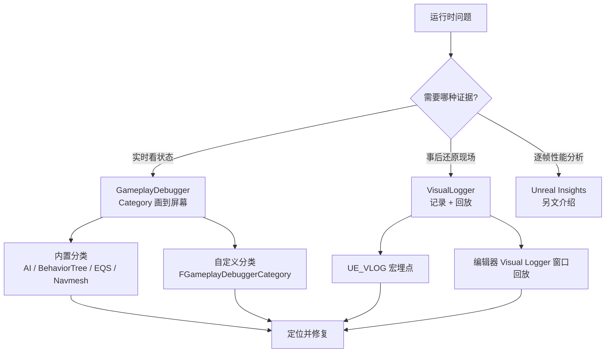
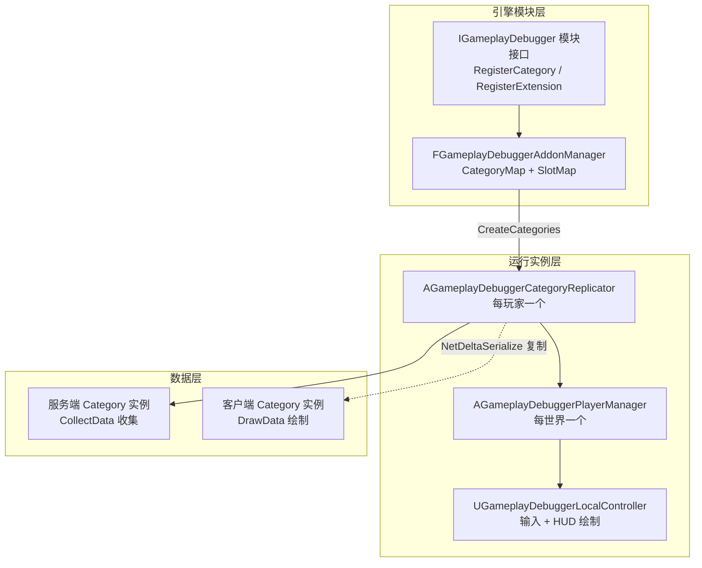
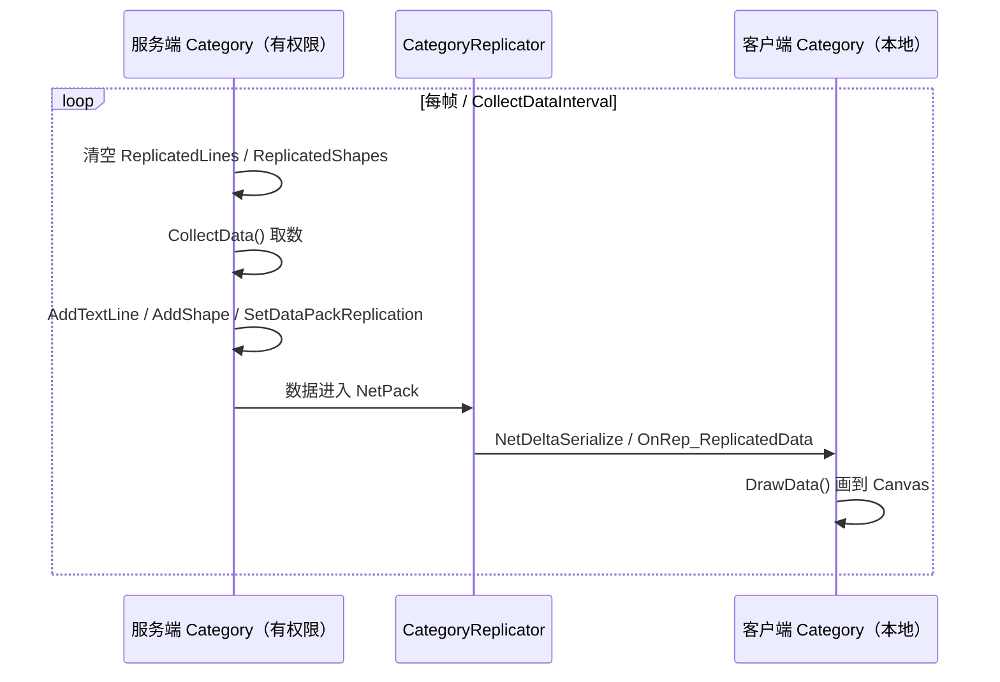
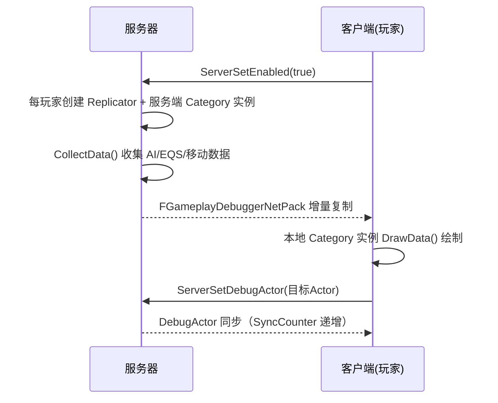
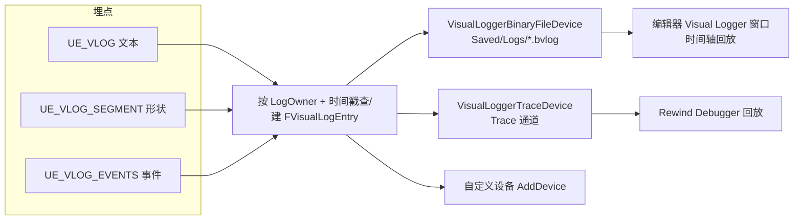

# 05 · GameplayDebugger 与运行时调试
> 版本基准：UE 5.8.0（本机 `Engine/Build/Build.version`：CL 55116800，分支 `++UE5+Release-5.8`）。
> 兼容性边界：适用于 UE5.8 编辑器/运行时，UE4.27 与早期 UE5 仅作迁移背景，具体模块以正文为准。
> 最后更新：2026-08-06（本轮元数据维护）。

> 适用版本：UE 5.x（关键 API 已对照本机 UE 5.8 源码验证：`Engine/Source/Runtime/GameplayDebugger/Public/` 与 `Engine/Source/Runtime/Engine/Public/VisualLogger/`；涉及 5.8 行为变化会单独标注）

## 1. 概述

玩法逻辑越复杂，"看不见的状态"越多：AI 当前在跑哪棵行为树、EQS 查询算出了什么、移动组件为什么往这个方向飘、某个属性何时被谁改掉。**GameplayDebugger（引擎内简称 GDT，Gameplay Debugger Tool）** 与 **VisualLogger（可视日志）** 是 UE 运行时调试的两大主力：前者把数据实时画到屏幕上，后者把数据按时间轴记录下来供事后回放。



两条工具链的分工可以概括为：**GDT 回答"现在是什么"**（单帧快照、可交互、可复制到客户端），**VisualLogger 回答"刚才发生了什么"**（持续记录、按时间轴回放、适合复现 AI/移动类疑难杂症）。两者都服务于同一个目标——把"看不见的运行时状态"变成"看得见的证据"。

---

## 2. 核心概念（表格）

| 概念 | 英文 | 说明 | 关键点 |
| --- | --- | --- | --- |
| 游戏调试器 | GameplayDebugger / GDT | 引擎内置的运行时调试工具，按分类（Category）把数据绘制到屏幕 | 默认 ` 键（Apostrophe）激活 |
| 分类 | Category | 一个数据展示单元（如 AI、BehaviorTree、EQS） | 服务端收集、客户端绘制 |
| 扩展 | Extension | 无状态、不绘制的附加功能（如选中 DebugActor、观察者视角） | 不复制数据 |
| 插件管理器 | AddonManager | 管理所有已注册分类与扩展的注册表 | 模块启动/关闭时注册/注销 |
| 分类复制器 | CategoryReplicator | 负责把服务端分类数据复制到客户端的一类 Actor | 每玩家一个 |
| 数据包 | DataPack | 大数据块（数组/结构体）的分块复制机制 | CRC 检测变化 |
| 调试目标 | DebugActor | 当前被调试选中的 Actor | 全局唯一 |
| 槽位 | Slot | 屏幕上的分类显示列，最多 10 个（0~9） | 快捷键直接切换 |
| 收集数据 | CollectData | 服务端（有权限端）每帧/间隔调用的取数函数 | 源码 `[AUTH]` 标记 |
| 绘制数据 | DrawData | 客户端每帧把数据画到 Canvas | 源码 `[LOCAL]` 标记 |
| 可视日志 | VisualLogger | 按时间轴记录文本、形状、事件到条目（Entry）的系统 | 事后回放 |
| 日志条目 | FVisualLogEntry | 某个对象某个时刻的全部记录（文本行 + 形状 + 事件） | 按时间戳组织 |
| 记录设备 | FVisualLogDevice | 条目的输出目标（二进制文件、Trace 等） | 可自定义设备 |
| 重定向 | Redirect | 把 A 对象的日志合并记到 B 对象名下 | 如 AI 控制器 → 角色 |
| 事件 | VLog Event | 可计数、可在回放界面查看的事件（如"切换状态"） | DECLARE_VLOG_EVENT |
| 回放 | Replay | 在编辑器 Visual Logger 窗口中按时间轴回看记录 | 支持过滤与跳转 |
| Rewind Debugger | Rewind Debugger | 基于 Trace 的记录/回放调试器（UE5.2+） | 与 VLog Trace 设备打通 |

---

## 3. 原理详解

### 3.1 GameplayDebugger 整体架构

GameplayDebugger 由四个核心部分协作（源码见 `Runtime/GameplayDebugger/`）：



关键流程：

1. 各模块（AIModule、GameplayDebugger 自身等）在 `StartupModule` 中通过 `IGameplayDebugger::Get().RegisterCategory(...)` 注册分类，注册信息进入 `FGameplayDebuggerAddonManager`（源码 `GameplayDebuggerAddonManager.h`）；
2. 世界初始化后，`AGameplayDebuggerPlayerManager`（一个 `AActor` + `FTickableGameObject`）为每个本地玩家创建 `AGameplayDebuggerCategoryReplicator`；
3. 复制器按注册表为每个分类创建一对实例：**服务端实例负责 CollectData，客户端实例负责 DrawData**（单机时两个角色由同一实例承担）；
4. 玩家按 ` 键激活调试器后，`UGameplayDebuggerLocalController` 负责输入分发与 HUD 绘制。

分类类必须放在 `#if WITH_GAMEPLAY_DEBUGGER` 保护块内编译（仅使用核心部分时用 `WITH_GAMEPLAY_DEBUGGER_CORE`）。Target.cs 中可用 `bUseGameplayDebugger` / `bUseGameplayDebuggerCore` 控制编译开关，`SetupGameplayDebuggerSupport(Target)` 是给项目 Build.cs 使用的辅助函数——这些都是 `GameplayDebugger.h` 头部注释明确给出的约定。

### 3.2 分类的注册与状态

注册接口（`GameplayDebugger.h`）：

```cpp
virtual void RegisterCategory(
    FName CategoryName,
    FOnGetCategory MakeInstanceDelegate,                    // 工厂委托，返回 TSharedRef<FGameplayDebuggerCategory>
    EGameplayDebuggerCategoryState CategoryState = EGameplayDebuggerCategoryState::Disabled,
    int32 SlotIdx = INDEX_NONE) = 0;
```

`EGameplayDebuggerCategoryState` 有五个取值：`EnabledInGameAndSimulate`、`EnabledInGame`、`EnabledInSimulate`、`Disabled`、`Hidden`（隐藏 = 注册但不显示，如 NavGrid 默认 Hidden）。`SlotIdx` 决定显示在第几个槽位（0~9）。注册状态可被 `UGameplayDebuggerConfig`（项目设置 → Engine → GameplayDebugger）覆盖，配置存于 `DefaultEngine.ini` 的 `[/Script/GameplayDebugger.GameplayDebuggerConfig]` 段。

### 3.3 FGameplayDebuggerCategory：服务端收集、客户端绘制

`FGameplayDebuggerCategory`（源码 `GameplayDebuggerCategory.h`）是自定义分类的基类，其头部注释直接定义了双端职责分工：



服务端侧 API（源码中标注 `[AUTH]`）：

| API | 作用 |
| --- | --- |
| `CollectData(OwnerPC, DebugActor)` | 收集数据的主函数，默认空实现 |
| `AddTextLine(const FString&)` | 追加一行文本，支持 `{color}` 颜色标签 |
| `AddShape(const FGameplayDebuggerShape&)` | 追加一个 3D 形状（线段/盒体/球等） |
| `SetDataPackReplication(T* DataPackAddr, EGameplayDebuggerDataPack Flags)` | 把结构体成员注册为数据包，模板要求 T 实现 `Serialize(FArchive&)` |
| `MarkDataPackDirty(DataPackId)` | 强制数据包重新复制（CRC 检测可能漏报变化） |
| `ForceImmediateCollect()` | 下一帧立即重新取数 |
| `CollectDataInterval` | 取数间隔，0 = 每帧（默认） |

客户端侧 API（`[LOCAL]`）：`DrawData(OwnerPC, CanvasContext)`、`CreateDebugSceneProxy`（自定义场景代理）、`OnDataPackReplicated(DataPackId)`（收到新数据包回调）、`MarkRenderStateDirty()`（请求重建场景代理）。

公共控制位：`bShowCategoryName`（显示标题）、`bShowOnlyWithDebugActor`（仅在有 DebugActor 时显示）、`bShowDataPackReplication`（显示数据包复制进度）、`bShowUpdateTimer`（显示下次取数倒计时）、`bAllowLocalDataCollection`（客户端也执行收集，5.x 新增，默认 false）。

**数据包（DataPack）复制机制**：当分类要传递大块数据（如 EQS 的全部查询结果、行为树节点状态数组）时，用 `SetDataPackReplication` 注册结构体成员。复制器按 `FGameplayDebuggerDataPackHeader`（DataVersion / SyncCounter / DataSize / DataOffset / bIsCompressed）做**分块传输 + CRC 比对**：数据没变就不重发，变了按块推进直到传完；`EGameplayDebuggerDataPack` 枚举控制数据包生命周期：`Persistent`（常驻）、`ResetOnActorChange`（切换 DebugActor 时重置）、`ResetOnTick`（每帧重置，默认）。

### 3.4 CategoryReplicator：网络调试的骨架

`AGameplayDebuggerCategoryReplicator`（源码 `GameplayDebuggerCategoryReplicator.h`）是一个 `AActor`，核心复制结构是 `FGameplayDebuggerNetPack`：

```cpp
USTRUCT()
struct FGameplayDebuggerNetPack
{
    TArray<FGameplayDebuggerCategoryData> SavedData;   // 每分类: TextLines + Shapes + DataPacks + bIsEnabled
    bool NetDeltaSerialize(FNetDeltaSerializeInfo& DeltaParms);
    void PopulateFromOwner();   // Iris 兼容：序列化前从 Owner 取状态
    void ApplyToOwner();        // Iris 兼容：序列化后写回 Owner
};
// 通过 TStructOpsTypeTraits<FGameplayDebuggerNetPack>::WithNetDeltaSerializer = true 启用 NetDeltaSerialize
```

复制器通过 `UPROPERTY(Replicated)` 复制 `OwnerPC`、`bIsEnabled`、`DebugActor`（弱引用 + ActorName + SyncCounter）、`VisLogSync`，以及 `ReplicatedUsing=OnRep_ReplicatedData` 的 `ReplicatedData`。所有修改都由**带校验的 Server RPC** 完成：`ServerSetEnabled`、`ServerSetDebugActor`、`ServerSetCategoryNameEnabled`、`ServerSendCategoryNameInputEvent` 等。

> **UE 5.8 变化**：按 CategoryId 的 `ServerSetCategoryEnabled` / `ServerSendCategoryInputEvent` 已标记弃用（`UE_DEPRECATED(5.8, ...)`），原因见弃用注释："server/client mismatch indices"——服务器与客户端注册的分类顺序可能不一致，因此 5.8 起改用**按名字**的 `ServerSetCategoryNameEnabled` / `ServerSendCategoryNameInputEvent`。同时新增 `FGameplayDebuggerDataPackRPCParams` 与 `bSendDataPacksUsingRPC`：数据包既可用 NetDeltaSerialize 传输，也可改为普通 RPC（`ClientDataPackPacket`）发送，后者对 Iris 复制更友好。

网络调试的读取侧还有 5.x 新增的 `SetViewPoint/GetViewPoint/ResetViewPoint`（可脱离玩家控制器视角做剔除与拾取）以及 `IsLocationInViewCone`（视锥剔除，参数来自 `UGameplayDebuggerUserSettings` 的 `MaxViewDistance=25000`、`MaxViewAngle=45°`）。

### 3.5 本地控制器、按键与 gdt.* 控制台命令

`UGameplayDebuggerConfig` 定义了全部默认按键（`config = Engine`，可在项目设置中改）：

| 配置项 | 默认值 | 作用 |
| --- | --- | --- |
| `ActivationKey` | `（Apostrophe）` | 激活/关闭调试器 |
| `CategoryRowNextKey` / `CategoryRowPrevKey` | 无（自行绑定） | 切换分类行 |
| `CategorySlot0` ~ `CategorySlot9` | 数字键 0~9 | 直接切换到对应槽位分类 |
| `DebugCanvasPadding*` / `bDebugCanvasEnableTextShadow` | 0 / true | HUD 排版 |

内置控制台命令（源码 `GameplayDebuggerLocalController.cpp`）：

| 命令 | 作用 |
| --- | --- |
| `gdt.Enable` | 启用调试器（旧命令 `EnableGDT` 仍可用） |
| `gdt.Toggle` | 切换调试器开关 |
| `gdt.SelectLocalPlayer` | 选择本地玩家 |
| `gdt.SelectPreviousRow` / `gdt.SelectNextRow` | 切换分类行 |
| `gdt.ToggleCategory <索引>` | 切换指定分类 |
| `gdt.EnableCategoryName <名字片段> [1/0]` | 按名字模糊匹配启用/禁用分类 |
| `gdt.fontsize <字号>` | 调整 HUD 字号（默认 10） |

另有 CVar `GameplayDebugger.AutoCreateGameplayDebuggerManager`（默认 1）控制是否自动生成调试管理器。

### 3.6 GDT 远程调试（客户端看服务器状态）

这是 GameplayDebugger 区别于"本地 DrawDebug"的核心能力：**在客户端按下 ` 键，看到的是服务器的状态**。



使用要点：

- 联机（PIE 多客户端 / 真机 + 服务器）时，客户端按下 ` 键即可打开；分类数据、DebugActor、按键事件全部走复制链路；
- **DebugActor 用于把调试聚焦到单个 Actor**：按 Alt+鼠标左键（默认）拾取，复制器把目标同步给服务器，分类针对该 Actor 输出详情（行为树、EQS、移动）——源码中 `FGameplayDebuggerDebugActor` 用弱引用 + `ActorName` + `SyncCounter` 保证跨端一致；
- `FGameplayDebuggerVisLogSync`（`VisLogSync` 复制字段）携带 `DeviceIDs`，用于把 GDT 与 VisualLogger 绑定到同一台记录设备上做"画中画"联调；
- 编辑器模式：`UGameplayDebuggerUserSettings`（EditorPerProjectUserSettings）中 `bEnableGameplayDebuggerInEditor` 允许在纯编辑器视口使用（需要重载地图生效），`EnabledCategories` 把启用状态按名字持久化到编辑器会话之间。

### 3.7 常用内置调试类别

引擎已注册的分类（源码 `AIModule/Private/AIModule.cpp`、`GameplayDebuggerModule.cpp`）：

| 分类名 | 注册模块 | 默认状态 / 槽位 | 展示内容 |
| --- | --- | --- | --- |
| `AI` | AIModule | EnabledInGameAndSimulate / 槽 1 | AI 控制器状态、黑板键值、感知摘要 |
| `BehaviorTree` | AIModule | EnabledInGame / 槽 2 | 行为树节点执行状态、Active 节点路径 |
| `EQS` | AIModule | Disabled | EQS 查询结果、得分、Item 分布 |
| `Navmesh` | AIModule | Disabled / 槽 0 | NavMesh 多边形、寻路路径 |
| `Perception` | AIModule | Disabled | 感知组件看到的目标与刺激 |
| `PerceptionSystem` | AIModule | Disabled | AI 感知系统全局状态 |
| `NavGrid` | AIModule | Hidden | 局部导航网格（默认隐藏） |
| `GameHUD` | GameplayDebugger | 扩展 | HUD 显隐切换扩展 |
| `Spectator` | GameplayDebugger | 扩展 | 观察者视角扩展 |

运行中可用 `gdt.EnableCategoryName AI 1` 之类的命令按需开关，或在项目设置中调整默认状态。

### 3.8 VisualLogger 架构

`FVisualLogger`（源码 `Runtime/Engine/Public/VisualLogger/VisualLogger.h`）是一个全局单例 `FOutputDevice`，核心模型是**"对象 × 时间戳 → FVisualLogEntry"**：



关键机制：

- **条目按时间戳聚合**：同一帧内同一个 LogOwner 的多次调用写入同一条 Entry（`LogLines` + `ElementsToDraw` + 事件），由 `GetTimeStampForObject` 决定时间戳（可用 `SetGetTimeStampFunc` 换成网络同步时钟）；
- **记录开关**：`SetIsRecording()` 全局开关，`SetIsRecordingToFile()` 落盘开关，`SetIsRecordingToTrace()` 输出 Trace（供 Rewind Debugger 回放）；`IsRecording()` 是宏内部判断，关闭时所有 `UE_VLOG` 宏**零开销**（`#if UE_DEBUG_RECORDING_ENABLED` 为假时宏展开为空）；
- **过滤**：`bUseVerbosityFilterWhenRecording` + `IsFilteredOut`（超出 LogCategory 编译期 Verbosity 或运行时被 Suppress 的条目不记录），对应控制台命令 `vislog.ActivateVerbosityFilterWhenRecording` / `vislog.DeactivateVerbosityFilterWhenRecording`；另有 `BlockAllCategories` + `CategoryAllowList`、`AddClassToAllowList` / `AddObjectToAllowList` 白名单；
- **重定向**：`REDIRECT_TO_VLOG(Dest)` / `REDIRECT_OBJECT_TO_VLOG(Src, Dest)` 把对象日志合并到目标对象（5.8 中 `CONNECT_WITH_VLOG` 系列已弃用）；
- **设备**：`AddDevice(FVisualLogDevice*)` 注册输出端，引擎自带二进制文件设备（文件扩展名 `bvlog`，保存到 `Saved/Logs/`）与 Trace 设备；
- **文件名自定义**：`SetLogFileNameGetter(FVisualLogFilenameGetterDelegate)` 可定制落盘文件名。

### 3.9 UE_VLOG 宏族

所有宏都要求第一个参数是 **LogOwner（UObject\*，通常传 this）**，第二个是 LogCategory（如 `LogTemp` 或自定义 `DECLARE_LOG_CATEGORY_EXTERN(LogMyGame, ...)`），第三个是 Verbosity：

| 宏 | 记录内容 |
| --- | --- |
| `UE_VLOG` | 普通文本行 |
| `UE_CVLOG(Cond, ...)` | 带条件文本 |
| `UE_VLOG_UELOG` / `UE_CVLOG_UELOG` | 同时写 VLog 与 UE_LOG |
| `UE_VLOG_SEGMENT` / `_THICK` | 线段（可带粗细） |
| `UE_VLOG_LOCATION` | 位置点 |
| `UE_VLOG_SPHERE` / `UE_VLOG_WIRESPHERE` | 球体 / 线框球 |
| `UE_VLOG_BOX` / `UE_VLOG_WIREBOX` / `UE_VLOG_OBOX` / `UE_VLOG_WIREOBOX` | AABB / 线框 / 有向盒 |
| `UE_VLOG_CONE` / `UE_VLOG_WIRECONE` | 锥体 |
| `UE_VLOG_CYLINDER` / `UE_VLOG_WIRECYLINDER` | 圆柱 |
| `UE_VLOG_CAPSULE` / `UE_VLOG_WIRECAPSULE` | 胶囊体（半高 + 半径 + 旋转） |
| `UE_VLOG_ARROW` / `UE_VLOG_ARROW_MAG` | 带箭头线段 |
| `UE_VLOG_CIRCLE` / `UE_VLOG_CIRCLE_THICK` / `UE_VLOG_WIRECIRCLE(_THICK)` | 圆盘 |
| `UE_VLOG_HISTOGRAM` | 二维折线图数据点（GraphName + DataName） |
| `UE_VLOG_PULLEDCONVEX` | 纵向拉伸凸多边形（导航面） |
| `UE_VLOG_MESH` | 三角网格（顶点 + 索引） |
| `UE_VLOG_CONVEXPOLY` | 平面凸多边形 |
| `UE_VLOG_COORDINATESYSTEM` | 坐标系（位置 + 旋转 + 缩放） |
| `DECLARE_VLOG_EVENT` / `DEFINE_VLOG_EVENT` + `UE_VLOG_EVENTS` | 事件记录（带计数与友好描述） |
| `UE_IFVLOG(代码块)` | 仅在记录时执行代码块 |

每个形状宏都带 `UE_CVLOG_*` 条件版本；形状宏末尾的 `Format, ...` 参数是该形状的**描述文本**（回放时显示在形状旁）。所有宏在 `UE_DEBUG_RECORDING_ENABLED` 关闭时展开为空（`UE_VLOG_UELOG` 例外，仍执行 UE_LOG，保证关掉可视日志后关键日志不丢）。

### 3.10 可视日志的记录与回放

记录方式：编辑器菜单 Tools → Visual Logger 打开面板，点 Record 开始（内部调用 `SetIsRecording(true)` + `SetIsRecordingToFile(true)`）；运行期也可用 C++ 或控制台触发。结束后生成 `Saved/Logs/<会话ID>_<时间>_*.bvlog` 二进制文件。

回放：Visual Logger 窗口按对象（Row）组织时间轴，可拖动时间滑块逐帧查看文本、形状与事件；支持按分类过滤、按对象过滤、导出截图。配合 `UE_VLOG_EVENTS` 的事件，可以在时间轴上快速定位"状态切换/攻击判定"等关键时刻。若要跨机器复现，把 `.bvlog` 文件与对应版本的程序一起交付即可。

---

## 4. C++ / 蓝图示例

### 4.1 自定义 GameplayDebugger 分类（头文件）

```cpp
// MyGameDebuggerCategory.h
#pragma once

#if WITH_GAMEPLAY_DEBUGGER

#include "GameplayDebuggerCategory.h"

// 演示用大块数据：必须实现 Serialize(FArchive&) 才能作为 DataPack
struct FMyDebugSnapshot
{
    TArray<FVector> PathPoints;
    int32 ActionId = 0;
    float Health = 0.f;

    void Serialize(FArchive& Ar)
    {
        Ar << PathPoints;
        Ar << ActionId;
        Ar << Health;
    }
};

class FGameplayDebuggerCategory_MyGame : public FGameplayDebuggerCategory
{
public:
    FGameplayDebuggerCategory_MyGame();
    virtual void CollectData(APlayerController* OwnerPC, AActor* DebugActor) override;
    virtual void DrawData(APlayerController* OwnerPC, FGameplayDebuggerCanvasContext& CanvasContext) override;
    virtual void OnDataPackReplicated(int32 DataPackId) override;

    static TSharedRef<FGameplayDebuggerCategory> MakeInstance()
    {
        return MakeShareable(new FGameplayDebuggerCategory_MyGame());
    }

private:
    void OnToggleDetail();               // 分类内按键回调
    FMyDebugSnapshot Snapshot;           // 待复制数据
    int32 SnapshotPackId;                // SetDataPackReplication 返回的包 ID
    bool bShowDetail = false;
};

#endif // WITH_GAMEPLAY_DEBUGGER
```

### 4.2 分类实现与模块注册

```cpp
// MyGameDebuggerCategory.cpp
#if WITH_GAMEPLAY_DEBUGGER

#include "MyGameDebuggerCategory.h"

FGameplayDebuggerCategory_MyGame::FGameplayDebuggerCategory_MyGame()
{
    // 显示标题、每 0.5 秒收集一次数据
    bShowCategoryName = true;
    CollectDataInterval = 0.5f;

    // 注册大块数据包：每帧重置（默认 ResetOnTick）
    SnapshotPackId = SetDataPackReplication(&Snapshot);

    // 自定义按键：本地模式，按下 2 键切换细节显示
    BindKeyPress(TEXT("Two"), this, &FGameplayDebuggerCategory_MyGame::OnToggleDetail);
}

void FGameplayDebuggerCategory_MyGame::CollectData(APlayerController* OwnerPC, AActor* DebugActor)
{
    // 只在有 DebugActor 时输出详情
    if (DebugActor)
    {
        AddTextLine(FString::Printf(TEXT("Target: {yellow}%s"), *DebugActor->GetName()));
    }
    AddTextLine(FString::Printf(TEXT("Health: {green}%.1f"), Snapshot.Health));

    // 收集路径点并标记数据包需要复制
    Snapshot.PathPoints.Reset();
    // ... 从玩法系统填充 Snapshot ...
    MarkDataPackDirty(SnapshotPackId);

    // 画一个调试线段（服务端收集，客户端显示）
    AddShape(FGameplayDebuggerShape::MakeSegment(Start, End, FColor::Cyan));
}

void FGameplayDebuggerCategory_MyGame::DrawData(APlayerController* OwnerPC,
    FGameplayDebuggerCanvasContext& CanvasContext)
{
    // CollectData 里 AddTextLine 的内容会自动先绘制，
    // 这里补充仅客户端可见的本地信息。
    if (bShowDetail)
    {
        CanvasContext.Printf(TEXT("Detail mode ON, PathPoints=%d"), Snapshot.PathPoints.Num());
    }
}

void FGameplayDebuggerCategory_MyGame::OnDataPackReplicated(int32 DataPackId)
{
    if (DataPackId == SnapshotPackId)
    {
        // 大块数据到达，刷新本地缓存
        MarkRenderStateDirty();   // 若用场景代理绘制则请求重建
    }
}

void FGameplayDebuggerCategory_MyGame::OnToggleDetail()
{
    bShowDetail = !bShowDetail;
}

#endif // WITH_GAMEPLAY_DEBUGGER
```

注册（放在拥有该分类的模块中，仿照 `AIModule.cpp`）：

```cpp
void FMyGameModule::StartupModule()
{
#if WITH_GAMEPLAY_DEBUGGER
    if (IGameplayDebugger::IsAvailable())
    {
        IGameplayDebugger& GDT = IGameplayDebugger::Get();
        GDT.RegisterCategory("MyGame",
            IGameplayDebugger::FOnGetCategory::CreateStatic(
                &FGameplayDebuggerCategory_MyGame::MakeInstance),
            EGameplayDebuggerCategoryState::Disabled,
            3 /* SlotIdx */);
    }
#endif
}

void FMyGameModule::ShutdownModule()
{
#if WITH_GAMEPLAY_DEBUGGER
    if (IGameplayDebugger::IsAvailable())
    {
        IGameplayDebugger::Get().UnregisterCategory("MyGame");
    }
#endif
}
```

### 4.3 VisualLogger 埋点（AI / 移动调试场景）

```cpp
// 声明日志类别（头文件）
DECLARE_LOG_CATEGORY_EXTERN(LogMyAI, Log, All);

// 定义 + 声明可视日志事件（头文件）
DECLARE_VLOG_EVENT(Event_StateChange);
DECLARE_VLOG_EVENT(Event_Attack);

// 实现文件
DEFINE_LOG_CATEGORY(LogMyAI);
DEFINE_VLOG_EVENT(Event_StateChange, Log, "AI 状态切换");
DEFINE_VLOG_EVENT(Event_Attack, Log, "发起攻击");

void AMyAIController::Tick(float DeltaSeconds)
{
    Super::Tick(DeltaSeconds);

    // 文本：记录黑板关键值（带颜色标签）
    UE_VLOG(this, LogMyAI, Log, TEXT("State=%s Speed=%.1f Target=%s"),
        *GetStateName(), MoveSpeed, *GetTargetName());

    // 线段：画出当前移动方向
    UE_VLOG_SEGMENT_THICK(this, LogMyAI, Log,
        GetPawn()->GetActorLocation(),
        GetPawn()->GetActorLocation() + Fwd * 200.f,
        FColor::Green, 3.f, TEXT("move dir"));

    // 条件形状：警戒范围
    UE_CVLOG_SPHERE(bAlerted, this, LogMyAI, Log,
        GetPawn()->GetActorLocation(), AlertRadius, FColor::Red,
        TEXT("alert range"));

    // 事件：状态切换（时间轴上的里程碑）
    if (State != OldState)
    {
        UE_VLOG_EVENTS(this, TEXT("AI"), Event_StateChange);
        OldState = State;
    }
}

void AMyAIController::BeginPlay()
{
    Super::BeginPlay();
    // 把控制器的日志重定向到 Pawn，回放时统一按角色查看
    REDIRECT_OBJECT_TO_VLOG(this, GetPawn());
}
```

### 4.4 蓝图侧用法

GameplayDebugger 与 VisualLogger **没有蓝图节点**（设计上就是 C++ 调试工具），但蓝图可以通过两条路参与：

1. **控制台命令节点**：蓝图里调用 `Execute Console Command`（节点名 `Execute Console Command`，目标为玩家控制器），执行 `gdt.Enable`、`gdt.EnableCategoryName AI 1` 等；
2. **DrawDebug 兜底**：蓝图侧临时验证逻辑时可先用 `Draw Debug Line` / `Draw Debug Sphere` 家族（仅本地可见），确认问题后再用 C++ 埋点转正为可回放的可视日志。

---

## 5. 最佳实践

### 5.1 工具选型

| 需求 | 首选 | 说明 |
| --- | --- | --- |
| 实时查看状态/交互式调试 | GameplayDebugger | 可点选 Actor、切分类、按键交互 |
| 事后复现"刚才发生了什么" | VisualLogger | 时间轴回放，适合 AI/移动 Bug |
| 网络问题（客户端/服务器状态不一致） | GDT 远程调试 | 客户端按 ` 键看服务器数据 |
| 逐帧时序/性能 | Unreal Insights | 与 VLog Trace 设备可配合 |
| 一次性本地验证 | DrawDebugHelpers | 无记录能力，仅开发期 |

### 5.2 自定义分类设计规范

- **收集最小集**：`CollectData` 只收集要展示的数据，大块数据一律走 DataPack，避免每帧复制整个数组；
- **控制收集频率**：非关键分类设置 `CollectDataInterval`（如 0.2~0.5s），纯文本展示不需要每帧刷新；
- **善用 DebugActor**：面向单个 Actor 的详情放在"有 DebugActor 才显示"（`bShowOnlyWithDebugActor`），避免多角色场景刷屏；
- **颜色约定**：`{green}` 正常、`{yellow}` 警告、`{red}` 异常，与 UE 日志习惯保持一致；
- **按键绑定**：`BindKeyPress` 的输入配置名要稳定（`FGameplayDebuggerInputHandlerConfig`），这样玩家可在项目设置里改键，配置会持久化；
- **模块化注册**：分类注册/注销放在所属模块的 Startup/Shutdown，与模块生命周期绑定，避免重复注册；
- **5.8 起用名字不用索引**：所有跨端 API 优先使用 `*NameEnabled` / `*NameInputEvent` 版本，规避服务端/客户端索引不一致。

### 5.3 VisualLogger 埋点规范

- **每个对象一个 Category**：用项目自定义 LogCategory（如 `LogMyAI`），不要全用 `LogTemp`，否则回放无法过滤；
- **Verbosity 分级**：高频数据用 `Verbose`，里程碑事件用 `Log`，仅异常用 `Warning/Error`——配合 `vislog.ActivateVerbosityFilterWhenRecording` 可以只录需要的级别；
- **形状永远带描述**：形状宏最后一个参数写清含义，回放时才看得懂；
- **合理重定向**：AI 控制器与 Pawn 之间的日志用 `REDIRECT_OBJECT_TO_VLOG` 合并，回放时按"角色"聚合而非按"组件"散落；
- **事件优于文本**：状态切换、判定命中用 `UE_VLOG_EVENTS`，时间轴上可快速跳转；
- **控制录量**：只在需要时开记录（`SetIsRecording`），大世界全量录制会显著掉帧并产生巨大 `.bvlog` 文件；
- **发布版裁剪**：`UE_DEBUG_RECORDING_ENABLED` 在 Shipping 默认关闭，宏零开销；若需保留关键日志，用 `UE_VLOG_UELOG` 保证 UE_LOG 通道仍输出。

### 5.4 联机调试 Checklist

1. 确认双方版本一致（分类注册表、源码版本），5.8+ 用按名字 API 规避索引漂移；
2. 客户端按 ` 打开 GDT，检查左下角是否出现"连接服务器"状态；
3. `gdt.EnableCategoryName BehaviorTree 1` 逐个打开分类验证复制链路；
4. Alt+点击目标 Actor 设置 DebugActor，确认服务端 CollectData 有输出；
5. 涉及可视日志的跨端问题，检查 `VisLogSync.DeviceIDs` 是否指向同一台记录设备；
6. 服务器无输出时优先查 `GameplayDebugger.AutoCreateGameplayDebuggerManager` 是否为 1、复制权限（`bHasAuthority`）是否正常。

---

## 6. 常见问题 FAQ

### Q1：按 ` 键没反应？

**检查**：① 确认 `UGameplayDebuggerConfig::ActivationKey` 未被改绑；② 确认目标平台编译包含 GDT（Shipping 默认不含，Target.cs 需 `bUseGameplayDebugger=1`）；③ 编辑器模式需 `UGameplayDebuggerUserSettings.bEnableGameplayDebuggerInEditor` 且重载地图；④ 确认没有其他输入系统拦截按键。

### Q2：客户端打开 GDT 看不到服务器数据？

**原因**：复制器未创建或权限不对。**排查**：`GameplayDebugger.AutoCreateGameplayDebuggerManager` 是否为 1；`AGameplayDebuggerCategoryReplicator` 的 `GetNetConnection` / `IsNetRelevantFor` 是否因自定义 PlayerController 实现而失效；确认分类注册发生在服务器与客户端两侧（模块依赖一致）。

### Q3：自定义分类在客户端崩溃/数据错乱？

**原因**：DataPack 的 `Serialize` 与结构体成员不同步（版本漂移）。**解决**：DataPack 结构体增加版本字段（`FGameplayDebuggerDataPackHeader.DataVersion` 由框架维护，自增即可）；两端代码保持同版本；必要时用 `MarkDataPackDirty` 强制刷新而不是依赖 CRC。

### Q4：EQS / BehaviorTree 分类数据量太大，网络开销高？

**解决**：这些分类默认用 DataPack 分块复制，且只在启用时复制；调大 `CollectDataInterval` 或只在需要时 `gdt.EnableCategoryName` 打开；正式环境保持默认 Disabled。

### Q5：UE_VLOG 什么都没记录？

**检查**：① Visual Logger 面板是否点了 Record（`SetIsRecording`）；② LogCategory 的 Verbosity 是否低于宏里的级别（启用 `vislog.ActivateVerbosityFilterWhenRecording` 时会被过滤）；③ 是否被 `BlockAllCategories` 或白名单排除；④ 编译开关 `UE_DEBUG_RECORDING_ENABLED` 是否被关闭（宏会空转）。

### Q6：.bvlog 文件在哪？怎么给别人复现？

**路径**：`Saved/Logs/`（`FPaths::ProjectLogDir()`），文件名含会话 ID 与时间戳。交付时连同相同引擎/插件版本的包一起提供；在 Visual Logger 窗口中可指定加载外部 `.bvlog` 文件。

### Q7：回放时形状不显示？

**原因**：形状按"类别 + 时间戳"存储，若 LogOwner 在回放世界不存在（Actor 已销毁/改名），条目会挂在未知对象下。**解决**：用 `REDIRECT_OBJECT_TO_VLOG` 重定向到稳定对象（如 Pawn）；回放时勾选"显示所有对象"。

### Q8：VisualLogger 与 Rewind Debugger 什么关系？

Rewind Debugger（UE5.2+）基于 Trace 系统回放整个游戏状态；`FVisualLogger::SetIsRecordingToTrace()` 把可视日志写入 Trace 通道，两者可在同一时间轴上叠加查看——"状态回放 + 日志注释"组合排查疑难帧。

---

## 7. 关联阅读

- 本知识库：`07-UI与性能优化/03-性能分析工具与Profiling.md`（Unreal Insights、stat 命令，与运行时调试互补）
- 本知识库：`05-AI系统/01-行为树详解.md`、`05-AI系统/02-感知系统与EQS.md`（GDT 的 AI 分类背后是这些系统）
- 本知识库：`06-网络同步/02-RPC与属性同步.md`（CategoryReplicator 的复制链路原理）
- 本知识库：`12-引擎源码分析/`（GDT 相关源码走读可参考其分析方法）
- [UE 官方文档：Gameplay Debugger](https://dev.epicgames.com/documentation/zh-cn/unreal-engine/gameplay-debugger-in-unreal-engine)
- [UE 官方文档：Visual Logger](https://dev.epicgames.com/documentation/zh-cn/unreal-engine/visual-logger-in-unreal-engine)
- [UE 官方文档：Rewind Debugger](https://dev.epicgames.com/documentation/en-us/unreal-engine/rewind-debugger-in-unreal-engine)
