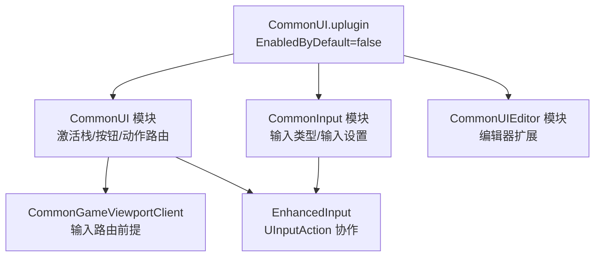
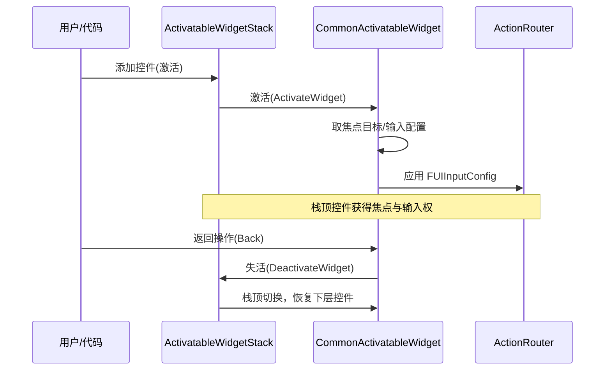
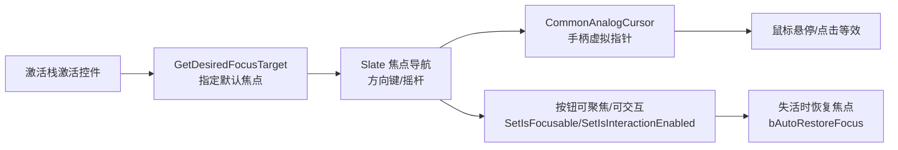

# 07 · CommonUI 输入路由与焦点管理（CommonUI Input Routing & Focus Management）

> 版本基准：UE 5.8.0（本机 `Engine/Build/Build.version`：CL 55116800，分支 `++UE5+Release-5.8`）。
> 适用范围：CommonUI 插件的使用层：插件启用、激活栈（Activatable Widget Stack）、输入路由（Input Routing）、焦点与手柄导航、与 EnhancedInput 的协作、调试命令；源码层细节见 `../12-引擎源码分析/26-CommonUI源码.md`。
> 事实边界：文中类名、方法、CVar、命令均先经本机 UE5.8 源码只读核对（标注文件:行号），无法核对项如实标注"待核对"，不虚构 API。
> 官方参考：[Unreal Engine UE5.8 官方文档总页](https://dev.epicgames.com/documentation/en-us/unreal-engine)。
> 最后更新：2026-08-07。

## 概述

CommonUI（Common UI Plugin）是 UE 官方的跨平台 UI 框架插件（Lyra 等官方示例项目的默认选择），其核心价值不在"画控件"，而在解决多平台 UI 的三类系统性问题：

- **输入统一**：键鼠、手柄、触控三种输入类型在 UI 层统一抽象（`ECommonInputType`），按钮提示、焦点行为随输入类型自动切换；
- **UI 层级管理**：激活栈（Activatable Widget Stack）管理"菜单/暂停/对话框"等层级 UI 的激活与失活、焦点转移与输入配置；
- **输入路由**：UI 输入配置（`FUIInputConfig`）、UI 动作绑定（`FUIActionBinding`）与输入动作域（Action Domain）把"谁接收输入、如何接收"系统化。

本篇是**使用层**文档：讲清楚这些机制怎么用、命令是什么、常见坑在哪；底层实现（`FActivatableTreeNode` 树、输入预处理器等）见 `../12-引擎源码分析/26-CommonUI源码.md`。

## 核心概念（表格）

| 概念 | 英文 | 说明 |
| --- | --- | --- |
| CommonUI 插件 | CommonUI | 核心 UI 框架插件（`CommonUI.uplugin`，本机 `EnabledByDefault:false`） |
| CommonInput 模块 | CommonInput | 输入类型管理模块（`Source/CommonInput`），提供 `UCommonInputSubsystem` |
| 游戏视口客户端 | CommonGameViewportClient | 输入路由工作的前提，未设置时路由不生效（见调试警告） |
| 可激活控件 | UCommonActivatableWidget | 可被激活/失活的控件基类，激活栈的组成单元 |
| 激活栈 | Activatable Widget Stack | `UCommonActivatableWidgetStack` 等容器管理 UI 层级与激活顺序 |
| 按钮基类 | UCommonButtonBase | 带选中态、可交互、可聚焦的按钮基类 |
| 输入子系统 | UCommonInputSubsystem | 输入类型（键鼠/手柄/触控）的查询与切换（`GetCurrentInputType` 等） |
| 输入配置 | FUIInputConfig | 激活时的输入模式/鼠标捕获/移动视角忽略配置（`UIActionBindingHandle.h:94`） |
| 输入路由中枢 | UCommonUIActionRouterBase | 应用输入配置、维护激活树、分发 UI 动作（`Input/CommonUIActionRouterBase.h`） |
| UI 动作绑定 | FUIActionBinding / FBindUIActionArgs | 把控件与 UI 动作（如"返回"）绑定的数据结构 |
| 输入动作域 | UCommonInputActionDomain / Table | 输入事件在 UI 层级间的流转行为（`BlockIfActive` 等） |
| 虚拟指针 | CommonAnalogCursor | 手柄模拟鼠标的虚拟光标（`Input/CommonAnalogCursor.h`） |
| 输入动作 | FUIInputAction | `CommonUIInputSettings` 中定义的动作（ActionTag + 按键映射） |

## 原理详解

### 1. 插件结构与启用前提



图释：CommonUI 插件默认不启用（本机 `CommonUI.uplugin`：FriendlyName "Common UI Plugin"、VersionName "1.0"、`EnabledByDefault: false`），需在项目 `.uproject` 或模块 `Build.cs` 中显式启用；运行时核心是两个模块——CommonUI（控件与路由）与 CommonInput（输入类型）。

**启用前提（易踩坑）**：输入路由依赖 `CommonGameViewportClient`。本机 `CommonUIActionRouterBase.cpp:336` 在未使用 CommonGameViewportClient 派生视口客户端时输出警告："CommonUI Input routing will not function correctly"，并提示可用 `CommonUI.Debug.CheckGameViewportClientValid=0` 关闭该警告。正确做法：项目设置中把 Game Viewport Client Class 指到 CommonGameViewportClient（或其派生类）。

### 2. 激活栈：Activatable Widget Stack

容器基类为 `UCommonActivatableWidgetContainerBase : UWidget`（`CommonActivatableWidgetContainer.h:24`），常用子类 `UCommonActivatableWidgetStack`（`:202`）。容器提供 BlueprintCallable 的 Push/切换接口（`:79-84`），并暴露 `FOnDisplayedWidgetChanged`（当前显示控件变化）与 `FTransitioningChanged`（转场中）事件（`:87-90`）。



图释：激活栈的"入栈"即激活控件并应用其输入配置，"出栈"即失活并恢复下层；栈顶控件的输入配置（鼠标捕获、输入模式）通过 `UCommonUIActionRouterBase` 生效。

### 3. UCommonActivatableWidget 关键机制

`UCommonActivatableWidget : UCommonUserWidget`（`CommonActivatableWidget.h`，本机核对）：

- **激活/失活**：`ActivateWidget()` / `DeactivateWidget()`（UE_API）；蓝图事件 `BP_OnActivated` / `BP_OnDeactivated`，C++ 侧 `NativeOnActivated` / `NativeOnDeactivated`；
- **自动激活**：`bAutoActivate`（默认 false），加入容器时自动激活；
- **焦点目标**：`GetDesiredFocusTarget()`（蓝图实现事件 "Get Desired Focus Target"），激活后把焦点给到指定控件（如默认按钮）；
- **输入配置**：`GetDesiredInputConfig()` 返回 `TOptional<FUIInputConfig>`（蓝图事件 "Get Desired Input Config"），决定该 UI 激活时输入如何路由；
- **返回处理**：`bIsBackHandler`（默认 false）声明"我处理返回"；蓝图事件 `BP_OnHandleBackAction` 返回 true 表示消费返回事件；
- **焦点相关开关**：`bSupportsActivationFocus`（默认 true）、`bAutoRestoreFocus`（失活时把焦点还给之前的控件）、`bSetVisibilityOnActivated/Deactivated`（随激活改可见性）；
- **绑定可见性**：`SetBindVisibilities(OnActivatedVisibility, OnDeactivatedVisibility, bAllActive)` 让其他控件跟随本控件激活状态切换可见性；
- **激活事件**：`BP_OnWidgetActivated`（`FOnWidgetActivationChanged`）供外部监听。

### 4. UCommonButtonBase：按钮与选中态

`UCommonButtonBase`（`CommonButtonBase.h`，本机核对）是 CommonUI 按钮体系的基类，关键接口：

| 接口 | 作用 |
| --- | --- |
| `SetIsSelected(bool, bGiveClickFeedback=true)` / `GetSelected()` | 选中态（如 Tab 页、列表高亮） |
| `SetIsInteractionEnabled(bool)` | 是否可交互（置 false 时忽略点击/导航） |
| `SetIsFocusable(bool)` | 是否可被聚焦（手柄导航可达） |
| `SetClickMethod(EButtonClickMethod::Type)` | 点击触发方式（按下/释放等） |
| `SetHoveredSoundOverride` 等 | 声音覆盖（悬停/按下/选中） |
| `OnSelectedChangedBase`（`FCommonSelectedStateChangedBase`：Button, Selected） | 选中状态变化动态多播 |
| `OnIsSelectedChanged()`（C++ 事件） | 选中变化 C++ 事件 |
| `OnClickedBase` / `OnDoubleClicked`（`FCommonButtonBaseClicked`） | 点击/双击事件 |

使用要点：手柄导航时，**可聚焦 + 可交互**是按钮能被选中的前提；"默认焦点按钮"（进菜单默认高亮的按钮）通过激活栈的 `GetDesiredFocusTarget` 指定。

### 5. UCommonInputSubsystem：输入类型管理

`UCommonInputSubsystem : ULocalPlayerSubsystem`（`Source/CommonInput/Public/CommonInputSubsystem.h`，本机核对）：

- **输入类型枚举**：`ECommonInputType : uint8`（`CommonInputTypeEnum.h:9`）= `MouseAndKeyboard`、`Gamepad`、`Touch`、`Count`；
- **查询/切换**：`GetCurrentInputType()`、`SetCurrentInputType(ECommonInputType)`、`GetDefaultInputType()`（平台默认，如主机默认手柄）；
- **活跃判断**：`IsInputMethodActive(ECommonInputType)`、`GetInputTypeFilter(ECommonInputType)`；
- **按键提示**：`ShouldShowInputKeys()`（是否显示按键图标，如触屏隐藏）；
- **切换事件**：`OnInputMethodChanged`（`FInputMethodChangedDelegate`，参数 `ECommonInputType`），UI 可监听它刷新按钮提示与焦点行为；
- **越界输入**：`UCommonInputSettings::bAllowOutOfFocusDeviceInput`（默认 false）控制窗口失焦时是否仍接收输入（本机 `CommonInputSettings.h` 核对）。

输入类型切换的"抖动抑制"（Thrashing）由 `UCommonInputSettings` 的 "Thrashing Settings" 配置（本机核对存在该类目），避免键鼠/手柄频繁切换导致 UI 抖动。

### 6. 输入路由：FUIInputConfig 与 Action Domain

`FUIInputConfig`（`Input/UIActionBindingHandle.h:94`，USTRUCT BlueprintType）字段：

| 字段 | 含义 |
| --- | --- |
| `InputMode`（`ECommonInputMode`） | `Menu`（仅 UI 收输入）/ `Game`（仅游戏）/ `All`（两者都收）（`CommonInputModeTypes.h:20`） |
| `MouseCaptureMode` / `MouseLockMode` | 鼠标捕获与锁定方式 |
| `bHideCursorDuringViewportCapture` | 捕获期间隐藏光标（默认 true） |
| `bIgnoreMoveInput` / `bIgnoreLookInput` | 是否忽略移动/视角输入 |

`UCommonUIActionRouterBase : ULocalPlayerSubsystem`（`Input/CommonUIActionRouterBase.h`，本机核对）是输入路由中枢：

- `SetActiveUIInputConfig(const FUIInputConfig&, const UObject* InConfigSource)`：应用输入配置；
- `RefreshUIInputConfig()` / `ApplyUIInputConfig(const FUIInputConfig&, bool bForceRefresh)`：刷新/强制应用；
- `GetActiveRoot()`：获取激活树根（`TWeakPtr<FActivatableTreeRoot>`）；
- `OnActiveInputConfigChanged`：输入配置变化事件；
- `ShouldAlwaysShowCursor()`：是否总是显示光标。

**Action Domain（输入动作域）**：`UCommonInputActionDomain : UDataAsset` 与 `UCommonInputActionDomainTable : UDataAsset`（`CommonInputActionDomain.h` 本机核对）定义输入事件在 UI 间的流转：`Behavior`（域间流转，默认 `ECommonInputEventFlowBehavior::BlockIfActive`）与域内 `InnerBehavior`（同域内 ZOrder 更低的活跃控件是否还能收到事件）。项目通过派生 `UCommonInputActionDomainTable` 资产组织域顺序（`UCommonInputSettings::ActionDomainTable`，本机核对）。

**UI 动作绑定**：`FUIActionBinding`（`Input/UIActionBinding.h`）通过 `FUIActionBindingHandle FUIActionBinding::TryCreate(const UWidget&, const FBindUIActionArgs&)` 创建（本机核对），把控件与 UI 动作（如"返回/确认"）绑定，并支持 Hold 动作（`BeginRollback` 等）。

### 7. 焦点管理与手柄导航



图释：手柄导航走"焦点"（Slate 键盘焦点导航），键鼠走"指针"（含 CommonAnalogCursor 虚拟指针）；两者由 `CommonUIInputSettings` 的 `bLinkCursorToGamepadFocus`（默认 true，本机核对）联动——手柄焦点移动时虚拟指针跟随。

要点：

- 手柄下"选中"= 焦点所在控件，配合按钮高亮样式（Hovered/Selected）提供反馈；
- 激活栈切换时用 `GetDesiredFocusTarget` 明确焦点落点，否则焦点可能回到 Root 或丢失；
- `bAutoRestoreFocus` 让子菜单关闭后焦点回到打开它的按钮；
- 虚拟指针参数（加速度 `bEnableCursorAcceleration` 等）在 `UCommonUIInputSettings::FCommonAnalogCursorSettings` 配置（本机 `CommonUIInputSettings.h` 核对）。

### 8. 与 EnhancedInput 的协作

CommonUI 5.8 与 Enhanced Input 深度集成（本机核对）：

- `UCommonInputSettings`（`Source/CommonInput/Public/CommonInputSettings.h`，`UDeveloperSettings`，config=Game）提供 `GetDefaultClickAction()` / `GetDefaultBackAction()`（`FDataTableRowHandle`）与 **`GetEnhancedInputClickAction()` / `GetEnhancedInputBackAction()`（返回 `UInputAction*`）**——UI 的"确认/返回"可直接映射到 Enhanced Input 动作资产；
- `UCommonUIInputSettings`（config=Input）的 `FUIInputAction` 包含 `ActionTag`（`FUIActionTag`，动作唯一标识）、`DefaultDisplayName`、`KeyMappings`（`FUIActionKeyMapping`：Key + HoldTime + HoldRollbackTime），支持按住触发与回滚（本机 `CommonUIInputSettings.h` 核对）；
- `UCommonActivatableWidget` 头文件引用 `UInputMappingContext`（本机核对），激活栈控件可与输入映射上下文配合，实现"菜单打开时切换映射上下文"。

实践口径：**游戏逻辑输入用 Enhanced Input 的 IMC/IA，UI 层输入用 CommonUI 的 UI 动作**（Click/Back 等），两者在 `UCommonInputSettings` 的默认动作处交汇；避免在 UI 里直接监听原始按键。

### 9. 调试命令与 CVar

控制台命令（本机 `CommonUIActionRouterBase.cpp` 核对）：

| 命令/CVar | 作用 |
| --- | --- |
| `CommonUI.DumpActivatableTree` | 打印激活树（`:2174`） |
| `CommonUI.DumpInputConfig` | 打印当前输入配置 |
| `CommonUI.AlwaysShowCursor` | 总是显示光标（`:35`） |
| `CommonUI.AutoFlushPressedKeys` | 自动清空按下键状态（`:41`） |
| `CommonUI.ResetUIInputConfigOnActivatableTreeDeactivation` | 激活树全失活时重置输入配置（`:47`） |
| `CommonUI.SupportMultiUserInput` | 多用户输入支持（`:53`） |
| `CommonUI.Debug.TraceConfigChanges` | 追踪输入配置变更（`:61`） |
| `CommonUI.Debug.TraceConfigOnScreen` | 配置变更屏幕显示（需开 TraceConfigChanges，`:67-69`） |
| `CommonUI.Debug.TraceInputConfigNum` | 追踪的配置数量（`:73`） |
| `CommonUI.Debug.WarnAllWidgetsDeactivated` | 全部控件失活时告警（`:80`） |
| `CommonUI.Debug.CheckGameViewportClientValid` | 检查视口客户端合法性（默认 1，`:86`） |
| `CommonUI.EnableVirtualPointer` | 启用虚拟指针（`CommonAnalogCursor.cpp:30`） |
| `CommonUI.ShouldVirtualAcceptSimulateMouseButton` | 虚拟指针是否接受模拟鼠标键（`:37`） |
| `CommonUI.ShouldRouteOffscreenMouseButton` | 屏幕外鼠标键是否路由（`:42`） |

### 10. 常见坑（使用层）

- **输入路由不生效**：未使用 CommonGameViewportClient（看 `CommonUI.Debug.CheckGameViewportClientValid` 警告）；
- **焦点丢失**：激活的控件没实现 `GetDesiredFocusTarget`，或目标控件 `SetIsFocusable(false)`；
- **双输入**：手柄与键鼠同时响应——检查输入配置的 `InputMode` 与 Action Domain 的 `Behavior`；
- **返回键被吞**：多个控件都设置了 `bIsBackHandler=true`，栈内重复消费；
- **UI 里游戏还在动**：`FUIInputConfig::InputMode` 未设为 `Menu`，或 `bIgnoreMoveInput/bIgnoreLookInput` 未置 true。

## 代码 / 示例

### 1. 启用插件（Build.cs / 项目设置）

```cpp
// 项目模块 Build.cs（示意）
PublicDependencyModuleNames.AddRange(new string[] {
    "Core", "CoreUObject", "Engine", "InputCore",
    "UMG", "CommonUI", "CommonInput", "EnhancedInput",
    "GameplayTags" // CommonUI 依赖 GameplayTags
});
```

> 示意：模块依赖名以实际构建输出为准；同时需在项目设置启用 CommonUI 插件，并把 Game Viewport Client Class 设为 CommonGameViewportClient。

### 2. C++ 激活与输入配置（示意）

```cpp
// 示意：在 C++ 中向激活栈添加并激活控件
// 容器：UCommonActivatableWidgetStack（或蓝图中的 Stack 控件）
// 控件：UCommonActivatableWidget 派生类

UCommonActivatableWidget* Widget = CreateWidget<UCommonActivatableWidget>(this, MyWidgetClass);
Stack->AddWidget(Widget);      // 加入容器并激活（依据 bAutoActivate / 容器策略）

// 控件内部实现"激活后焦点给到默认按钮"：
// 蓝图实现事件 Get Desired Focus Target -> 返回默认按钮
// 蓝图实现事件 Get Desired Input Config -> 返回 (InputMode=Menu, 捕获模式, 隐藏光标)
```

> 示意：`AddWidget` 等容器接口见 `CommonActivatableWidgetContainer.h:79-84`（BlueprintCallable）；具体签名以头文件为准。

### 3. 绑定 UI 动作（示意）

```cpp
// 示意：把"返回"UI 动作绑定到控件（C++ 侧）
#include "Input/UIActionBinding.h"

FBindUIActionArgs Args(UI_ACTION_TAG("UI.Action.Back"), FSimpleDelegate::CreateUObject(this, &MyWidget::HandleBack));
Args.bDisplayInActionBar = true; // 在 CommonBoundActionBar 显示提示
FUIActionBindingHandle Handle = FUIActionBinding::TryCreate(*this, Args);
```

> 示意：`FBindUIActionArgs` 字段与 `TryCreate` 签名见 `Input/UIActionBinding.h`（本机核对存在 `TryCreate(const UWidget&, const FBindUIActionArgs&)`）。

### 4. 调试命令速查

```text
# 结构检查
CommonUI.DumpActivatableTree
CommonUI.DumpInputConfig

# 输入配置追踪
CommonUI.Debug.TraceConfigChanges 1
CommonUI.Debug.TraceConfigOnScreen 1
CommonUI.Debug.TraceInputConfigNum 8

# 常见开关
CommonUI.AlwaysShowCursor 1
CommonUI.EnableVirtualPointer 1
CommonUI.Debug.WarnAllWidgetsDeactivated 1
```

## 最佳实践

- **分层职责**：UI 层输入统一走 CommonUI（激活栈 + UI 动作），游戏玩法输入走 Enhanced Input（IMC/IA），在 `UCommonInputSettings` 的默认 Click/Back 动作处衔接；
- **每个激活控件都实现 Get Desired Focus Target 与 Get Desired Input Config**，这是焦点与输入不出问题的前提；
- **返回链唯一**：同一时刻只让栈顶一个控件 `bIsBackHandler=true`；
- **输入模式随 UI 类型固定**：全屏菜单用 `Menu` 模式并忽略移动/视角，HUD 用 `Game` 模式，混合层用 `All` 并谨慎；
- **Action Domain 用于复杂 UI**：多层级同时可见（HUD+菜单+对话框）时用派生 ActionDomainTable 定义事件流转，避免全部 `BlockIfActive` 一刀切；
- **监听输入类型切换**：`OnInputMethodChanged` 里刷新按键提示与默认焦点行为（如触屏不显示按键图标）；
- **调试命令进手册**：`DumpActivatableTree` / `DumpInputConfig` 是定位"输入被谁吃了"的第一工具。

## 常见问题 FAQ

**Q1：CommonUI 启用了，但手柄按方向键 UI 没反应？**
检查三点：视口客户端是否为 CommonGameViewportClient；当前激活控件是否可聚焦（`SetIsFocusable(true)`）；是否有控件获得焦点（`GetDesiredFocusTarget` 是否返回目标）。

**Q2：鼠标点击正常，但手柄无法选中按钮？**
按钮需要 `SetIsFocusable(true)` 且 `SetIsInteractionEnabled(true)`；手柄导航走焦点而非指针命中。

**Q3：打开菜单后游戏角色还在移动？**
激活控件的 `GetDesiredInputConfig` 应返回 `InputMode=Menu` 并设置 `bIgnoreMoveInput/bIgnoreLookInput=true`；确认 ActionRouter 已应用该配置（`CommonUI.DumpInputConfig` 查看）。

**Q4：返回键（B/ESC）没反应？**
确认栈顶控件 `bIsBackHandler=true` 且 `BP_OnHandleBackAction` 返回 true；多个 handler 并存时事件可能被上层消费。

**Q5：手柄和鼠标同时操作导致 UI 抖动/双响应？**
检查输入类型切换节流（`UCommonInputSettings` Thrashing Settings）与 Action Domain 的 `Behavior`；必要时 `SetCurrentInputType` 显式锁定。

**Q6：子菜单关闭后焦点不回到原按钮？**
开启 `bAutoRestoreFocus`（在 `bSupportsActivationFocus` 下生效，本机 `CommonActivatableWidget.h` 核对）。

**Q7：按钮提示不显示手柄按键图标？**
确认 `ShouldShowInputKeys()` 为 true（触屏等平台默认隐藏）；检查 `UCommonInputSettings` 中 Gamepad 图标映射。

**Q8：`CommonUI.DumpActivatableTree` 提示 No World / No GameInstance？**
该命令需要有效的 World 与 GameInstance（`CommonUIActionRouterBase.cpp:2066/2078` 本机核对），在游戏运行中（PIE/游戏内控制台）执行。

**Q9：UI 里按下键后游戏也收到了输入（双消费）？**
`InputMode` 用 `Menu`（仅 UI）而非 `All`；若需共存，检查 `bIgnoreMoveInput/bIgnoreLookInput` 与 Action Domain 流转。

**Q10：CommonUI 输入路由完全不工作且无报错？**
查看 `CommonUI.Debug.CheckGameViewportClientValid` 警告（默认开）：未设置 CommonGameViewportClient 时路由不生效（`CommonUIActionRouterBase.cpp:336` 本机核对）。

## 关联阅读

- 本知识库：[01-UMG框架与控件系统.md](01-UMG框架与控件系统.md)（UMG 控件体系基础）
- 本知识库：[02-UI数据绑定与MVVM.md](02-UI数据绑定与MVVM.md)（UI 数据驱动，与激活栈配合）
- 本知识库：[06-UI状态与可观测性闭环.md](06-UI状态与可观测性闭环.md)（UI 状态管理与 Trace 可观测性）
- 本知识库：[26-CommonUI源码.md](../12-引擎源码分析/26-CommonUI源码.md)（激活树、输入预处理器等源码层）
- 本知识库：[03-游戏玩法编程/02-EnhancedInput增强输入.md](../03-游戏玩法编程/02-EnhancedInput增强输入.md)（Enhanced Input 使用层）
- [UE 官方文档：Common UI](https://dev.epicgames.com/documentation/en-us/unreal-engine/common-ui-plugin-for-advanced-user-interfaces-in-unreal-engine)
- [UE 官方文档：Enhanced Input](https://dev.epicgames.com/documentation/en-us/unreal-engine/enhanced-input-in-unreal-engine)

## 更新日志

- 2026-08-07：创建。类/接口/CVar/命令均经本机 UE5.8（CL 55116800）源码核对；无法核对项（如蓝图容器具体策略）标注"待核对/示意"。
