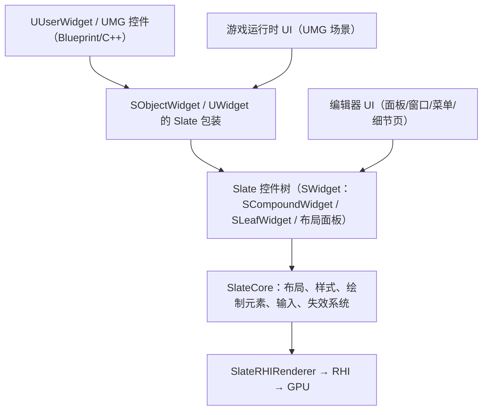
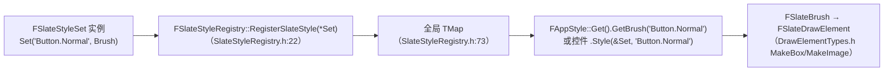

# 08 Slate 自定义控件与样式系统

> **元数据**
>
> | 项 | 内容 |
> |---|---|
> | 版本基线 | UE 5.8.0 / CL 55116800 / `++UE5+Release-5.8` |
> | 适用范围 | 客户端 UI 开发、编辑器工具开发：需要脱离 UMG 直接编写 Slate 控件、扩展样式系统、接入编辑器面板的团队 |
> | 事实边界 | 本文所有类名/函数名/CVar 均先经本机引擎 `C:\Program Files\Epic Games\UE_5.8\Engine` 只读核对（源码路径与行号随文标注）；无法核对项一律标注「待核对」 |
> | 官方参考 | [Unreal Engine Documentation](https://dev.epicgames.com/documentation/en-us/unreal-engine)；Slate 相关章节 |
> | 最后更新 | 2026-08-07 |

## 概述

Slate 是虚幻引擎的**声明式即时模式 UI 框架**：UMG 的全部控件（`UWidget` 的 Slate 包装）、编辑器的全部界面（内容浏览器、细节面板、关卡编辑器、工具栏菜单）都由 Slate 构建。学习 Slate 自定义控件的价值在于：

- **运行时**：UMG 满足 90% 需求，但自绘组件（技能冷却环、地图标记、性能 HUD、特殊布局）需要直接编写 Slate；
- **编辑器**：插件面板、`IDetailCustomization` 自定义细节面板、`FToolBarBuilder` 工具栏、`SWindow` 浮动窗口全部使用 Slate；
- **原理**：理解 Slate 才能理解 UMG 的构建/失效/绘制/命中测试链路（与源码篇 12-14 互补）。

本文是**使用层**文档：聚焦「怎么写一个自定义 Slate 控件、怎么用样式系统、怎么和 UMG/编辑器协作、怎么排查性能」，不重复源码篇的逐行剖析。

> **重要（本机 5.8 核对结论）**：UE 5.8 中 Slate 基础类型发生**模块迁移**——`SWidget` / `SCompoundWidget` / `SLeafWidget` / `SBoxPanel` / `DeclarativeSyntaxSupport.h` 等从旧的 `Slate\Public\Widgets\` 迁入 **`SlateCore\Public\Widgets\`**；`FAppStyle` 位于 `SlateCore\Public\Styling\AppStyle.h`；`FSlateDrawElement` 迁入 `Rendering\DrawElementTypes.h`（`DrawElements.h:22` 注释原文："FSlateDrawElement has been moved to DrawElementTypes.h"）。**源码里 `#include "Widgets/SCompoundWidget.h"` 的写法在新版本依然可用（SlateCore 在 include 路径中），但物理文件位置已变化**，本文引用一律以 5.8 实际路径为准。

## 核心概念表

| 概念 | 类型 | 5.8 位置（本机核对） | 一句话说明 |
|---|---|---|---|
| `SWidget` | 抽象基类 | `SlateCore\Public\Widgets\SWidget.h:163` | 所有 Slate 控件的基类；定义生命周期、布局、绘制、输入、失效接口 |
| `SCompoundWidget` | 组合控件基类 | `SlateCore\Public\Widgets\SCompoundWidget.h:21` | 含 `ChildSlot`（单子节点），绝大多数自定义控件继承它 |
| `SLeafWidget` | 叶子控件基类 | `SlateCore\Public\Widgets\SLeafWidget.h:27` | 无子节点、自绘内容（进度条、图片、自绘图表） |
| `FArguments` | 参数结构体 | 随各控件声明（`SLATE_BEGIN_ARGS` 生成） | 声明式构造的参数容器，`SNew` 的 `.ArgName(...)` 由此而来 |
| `SNew` / `SAssignNew` | 宏 | `SlateCore\Public\Widgets\DeclarativeSyntaxSupport.h:37/41` | 声明式构造/赋值构造入口 |
| `SLATE_BEGIN_ARGS` / `SLATE_END_ARGS` | 宏 | 同文件 `:63/:116` | 声明控件 `FArguments` 与槽位宏 |
| `SLATE_ATTRIBUTE` | 宏 | 同文件 `:194` | 声明 `TAttribute<T>` 参数（支持值或绑定） |
| `TAttribute<T>` | 属性绑定模板 | 5.8 头文件重构（见 3.2 节，`Types\SlateAttribute.h:239` 兼容层） | 值或委托（延迟求值），驱动动态属性 |
| `FSlateBrush` | 绘制资源 | `SlateCore\Public\Styling\SlateBrush.h:235` | 定义贴图/边框/圆角等绘制方式（`DrawAs`、`TintColor`、`ImageSize`） |
| `FSlateStyleSet` | 样式集 | `SlateCore\Public\Styling\SlateStyle.h:27` | 命名空间化样式注册表：`FName → Brush/Color/Font/WidgetStyle` |
| `ISlateStyle` | 样式接口 | `SlateCore\Public\Styling\ISlateStyle.h:17` | 样式查询抽象（`GetBrush`/`GetColor`/`GetWidgetStyle<T>`） |
| `FSlateStyleRegistry` | 全局注册表 | `SlateCore\Public\Styling\SlateStyleRegistry.h:13` | 保存所有已注册样式集，支持按名查找 |
| `FAppStyle` | 编辑器样式门面 | `SlateCore\Public\Styling\AppStyle.h:28` | 编辑器全局样式（5.8 位于 SlateCore），替代旧 `FEditorStyle` |
| `FSlateDrawElement` | 绘制元素 | `SlateCore\Public\Rendering\DrawElementTypes.h` | `MakeBox/MakeText/MakeLines/MakeGradient` 等静态绘制命令 |
| `SObjectWidget` | UMG↔Slate 桥 | `UMG\Public\Slate\SObjectWidget.h:30` | 包装 `UUserWidget` 的 Slate 控件，同时继承 `FGCObject` 防止 GC |
| `NativeWidgetHost` | UMG 容器 | `UMG\Public\Components\NativeWidgetHost.h` | 在 UMG 树中挂载原生 Slate 控件的组件 |

## 原理详解

### 1. Slate 定位：UMG 的底层、编辑器的全部



**图释**：UMG 是 Slate 之上的对象化/序列化层（可蓝图、可打包、可保存进资产）；Slate 是真正的绘制与交互层。编辑器界面不经过 UMG，直接构建 Slate 控件树。因此「写一个编辑器工具面板」与「写一个运行时自绘 HUD」最终都落到同一套 Slate 能力上。

### 2. SWidget 体系与 5.8 模块迁移

`SWidget`（`SlateCore\Public\Widgets\SWidget.h:163`）是所有控件的基类，其公开接口决定了自定义控件需要实现/覆盖什么：

| 接口（本机 5.8 行号） | 说明 |
|---|---|
| `virtual int32 OnPaint(...)`（`:1771`，纯虚） | 绘制自身；叶子控件必须实现 |
| `virtual FVector2D ComputeDesiredSize(float LayoutScaleMultiplier) const`（`:774`，纯虚） | 计算期望尺寸，布局系统据此分配空间 |
| `virtual void Tick(const FGeometry&, double InCurrentTime, float InDeltaTime)`（`:303`） | 可选逐帧更新；用 `SetCanTick(true)`（`:677`）开启 |
| `void Invalidate(EInvalidateWidgetReason)`（`:1163`） | 主动失效，触发局部重绘/重布局（性能关键） |
| `SetVisibility / SetEnabled / SetCursor ...` | 通用状态接口 |

继承选择：

- **`SCompoundWidget`**（`:21`）：带 `ChildSlot`（`:113`，类型 `FCompoundWidgetOneChildSlot`，`:106`）的复合控件。**绝大多数自定义控件选它**：外部定义 `FArguments`，`Construct` 里用 `ChildSlot[...]` 组装子控件（或空槽 + 自绘）。
- **`SLeafWidget`**（`:27`）：没有子节点，直接 `OnPaint` 绘制内容。适合图形型控件（迷你地图、波形、自绘进度环）。

> 5.8 注意：`SBoxPanel.h`（`SVerticalBox`/`SHorizontalBox` 的基类）同样位于 `SlateCore\Public\Widgets\SBoxPanel.h`（本机确认存在），旧资料中的 `Slate\Public\Widgets\SBoxPanel.h` 路径已失效。

### 3. 声明式语法：SNew、FArguments 与 SLATE_* 宏

Slate 控件通过「参数结构体 + 构造宏」实现声明式构建。宏定义均在本机核对：

- `SNew(WidgetType, ...)`（`DeclarativeSyntaxSupport.h:37`）——构造并返回 `TSharedRef<WidgetType>`；
- `SAssignNew(ExposeAs, WidgetType, ...)`（`:41`）——构造并赋值给外部变量（常用于成员 `TSharedPtr`）；
- `SLATE_BEGIN_ARGS(WidgetType)` / `SLATE_END_ARGS()`（`:63/:116`）——在控件类内部声明 `FArguments` 结构体；
- `SLATE_ATTRIBUTE(AttrType, AttrName)`（`:194`）——声明 `TAttribute<AttrType>` 参数，可传值也可传 `Lambda`/`CreateRaw` 绑定。

典型用法：

```cpp
// 节选：构造自定义控件（示意）
SNew(SMyWidget)
    .MyText(TEXT("Hello"))                    // SLATE_ARGUMENT 生成
    .MyColor_Lambda([] { return FLinearColor::Red; }) // SLATE_ATTRIBUTE 支持绑定
    .Visibility(EVisibility::SelfHitTestInvisible)
```

### 4. 构建自定义控件：FArguments + Construct + ChildSlot

自定义控件三步走（以 `SCompoundWidget` 为例）：

1. **声明 `FArguments`**：用 `SLATE_BEGIN_ARGS` 包裹 `SLATE_ARGUMENT` / `SLATE_ATTRIBUTE` / `SLATE_EVENT` / `SLATE_STYLE_ARGUMENT` 宏；
2. **实现 `Construct(const FArguments& InArgs)`**：保存参数、组装 `ChildSlot`；
3. **覆盖布局/绘制/输入**：需要自绘时实现 `OnPaint`，需要交互时实现 `OnMouseButtonDown` 等输入回调。

```cpp
// 节选：自定义复合控件骨架（示意）
class SMyPanel : public SCompoundWidget
{
public:
    SLATE_BEGIN_ARGS(SMyPanel)
        : _Title(TEXT(""))
    {}
        SLATE_ARGUMENT(FText, Title)                 // 静态参数
        SLATE_ATTRIBUTE(FLinearColor, TintColor)     // 可绑定参数
        SLATE_EVENT(FOnClicked, OnClicked)           // 事件
    SLATE_END_ARGS()

    void Construct(const FArguments& InArgs)
    {
        Title = InArgs._Title;
        OnClicked = InArgs._OnClicked;
        ChildSlot
        [
            SNew(SButton)
                .OnClicked(OnClicked)
                .Content()
                [
                    SNew(STextBlock).Text(Title)
                ]
        ];
    }

private:
    FText Title;
    FOnClicked OnClicked;
};
```

**生命周期要点**：Slate 控件由 `TSharedRef/TSharedPtr` 管理（**不是 UObject，不受 GC 管**）；控件树持有引用即存活；`Construct` 只在首次构建时调用一次，后续更新用「绑定属性」或主动 `Invalidate`。

### 5. 样式系统：FSlateBrush → FSlateStyleSet → FSlateStyleRegistry

#### 5.1 FSlateBrush（绘制资源）

`FSlateBrush`（`SlateBrush.h:235`）描述「怎么画一个图形」：

- `DrawAs`（`:251`，`ESlateBrushDrawType`，枚举定义 `:18`）：`NoDrawType / Box（九宫格拉伸）/ Border（边框平铺）/ Image（整图拉伸）/ RoundedBox（圆角矩形）`——本机 5.8 枚举共 5 值，无旧版 `Custom`；
- `TintColor`（`:247`，`FSlateColor`）：着色（支持随 `FSlateStyleSet` 的色调覆盖）；
- `ImageSize`、`Margin`（九宫格边距）、`FSlateBrushOutlineSettings`（`:130`，圆角描边设置，配合 `RoundedBox`）；
- `SetResourceObject(UObject*)`（`:331`）：设置 `UTexture2D`/`UMaterialInterface` 等资源对象。

#### 5.2 FSlateStyleSet（样式集）

`FSlateStyleSet`（`SlateStyle.h:27`）以 `FName` 为键、以任意类型为值注册样式：`Set<FSlateBrush>(Name, Brush)`、`Set<FSlateColor>`、`Set<FSlateFontInfo>`、`Set<FMargin>`、`Set<FVector2D>`、`Set<TWidgetStyle<T>>`（`Set` 模板族自 `:85` 起，本机核对含 float/FVector2D/FLinearColor/FSlateColor/FMargin 等重载）。关键方法：

- 构造函数 `FSlateStyleSet(const FName& InStyleSetName)`（`:34`）；
- `SetContentRoot(FString)`（`:44`）/ `SetCoreContentRoot`（`:53`）：设置资源相对根目录，之后 `FSlateBrush` 可用**路径字符串**（如 `"Textures/Icon"`）懒加载；
- `GetBrush(FName, Specifier)`（`:68`）：按名取 Brush（`Specifier` 支持 `"Hovered"`/`"Pressed"` 等变体）。

#### 5.3 注册与查询



**图释**：样式集注册进全局注册表后，任何控件都能按 `FName` 取到样式；`FAppStyle`（`AppStyle.h:28` 的 `Get()`）是编辑器全局样式门面，游戏运行时用 `FCoreStyle`/`FUMGCoreStyle`（`SlateCore\Public\Styling\`）或自建样式集。

> **5.8 注意**：`FSlateStyleRegistry` 的方法名是本机核对后的 **`RegisterSlateStyle` / `UnRegisterSlateStyle` / `FindSlateStyle`**（`SlateStyleRegistry.h:22/29/44`），与部分旧资料中的 `RegisterStyle` 不同；另外官方存在拼写瑕疵 `GetSylesUsingBrush`（`:68`，原文如此），引用时注意。

### 6. 自定义绘制：OnPaint 与 FSlateDrawElement

`SLeafWidget` 或需要自绘的复合控件覆盖 `OnPaint`。本机 5.8 完整签名（`SWidget.h:1771`）：

```cpp
// 节选：OnPaint 签名（本机 5.8 原文）
virtual int32 OnPaint(const FPaintArgs& Args,
                      const FGeometry& AllottedGeometry,
                      const FSlateRect& MyCullingRect,
                      FSlateWindowElementList& OutDrawElements,
                      int32 LayerId,
                      const FWidgetStyle& InWidgetStyle,
                      bool bParentEnabled) const = 0;
```

绘制基本模式：

```cpp
// 节选：OnPaint 自绘（示意，基于 DrawElementTypes.h 的 Make* 系列）
virtual int32 OnPaint(const FPaintArgs& Args, const FGeometry& AllottedGeometry,
    const FSlateRect& MyCullingRect, FSlateWindowElementList& OutDrawElements,
    int32 LayerId, const FWidgetStyle& InWidgetStyle, bool bParentEnabled) const override
{
    const FSlateBrush* Brush = FAppStyle::GetBrush(TEXT("WhiteBrush")); // 纯白 Brush 配合着色
    FSlateDrawElement::MakeBox(OutDrawElements, LayerId,
        AllottedGeometry.ToPaintGeometry(), Brush, ESlateDrawEffect::None,
        TintColor.Get());                                              // 本机核对：MakeBox(DrawElementTypes.h:102)
    return LayerId;
}
```

`FSlateDrawElement`（已迁至 `DrawElementTypes.h`）本机核对的常用静态方法：`MakeBox`（`:102`）、`MakeText`（`:134` 起多重重载）、`MakeGradient`（`:180`）、`MakeSpline`（`:195`）、`MakeLines`（`:228` 起）、`MakeCustom`（`:303`，自定义顶点）。返回值 `LayerId` 用于控制遮挡顺序（子控件在其上叠加）。

**输入与命中**：覆盖 `OnMouseButtonDown` / `OnMouseButtonUp` / `OnMouseMove` / `OnMouseWheel`（`FReply` 返回值），配合 `SetCursor`、`SetToolTip`；命中测试由 `SWidget` 的可见性与几何信息驱动，无需手动计算。

### 7. 与 UMG 集成：SObjectWidget 与 NativeWidgetHost

- **UMG → Slate**：每个 `UUserWidget` 通过 `RebuildWidget()`（`UserWidget.h:1576`）生成 `TSharedRef<SWidget>`；实际包装类是 **`SObjectWidget`**（`UMG\Public\Slate\SObjectWidget.h:30`），它继承 `SCompoundWidget` **并继承 `FGCObject`**（`AddReferencedObjects` 保证包装的 `UUserWidget` 不被 GC），`GetWidgetObject()`（`:53`）可反向取回 UObject。
- **在 UMG 中嵌入原生 Slate**：使用 `NativeWidgetHost` 组件（`UMG\Public\Components\NativeWidgetHost.h`），在 `UserWidget` 构建阶段把 `SNew(...)` 的 `TSharedRef<SWidget>` 赋给 `NativeWidgetHost->SetContent(...)`。
- **在 Slate 中嵌入 UMG**：`SObjectWidget` 本身就是一个 Slate 控件，可直接放进 Slate 树；编辑器面板中常用此方式复用 UMG 资产。
- **释放**：`ReleaseSlateResources(bool bReleaseChildren)`（`UserWidget.h:322`）在 `UUserWidget` 销毁时释放 Slate 资源，自定义 Slate 成员若持 `TSharedRef` 需在此清理，避免循环引用。

### 8. 编辑器扩展场景

编辑器工具（插件开发细节见 08-03 篇）中 Slate 的三个高频场景：

1. **浮动窗口/标签页**：`FGlobalTabmanager::Get()->RegisterNomadTabSpawner(...)` 返回 `SNew(SMyPanel)`；或 `SWindow` + `SNew` 弹窗；
2. **细节面板自定义**：`IDetailCustomization::CustomizeDetails` 中 `DetailBuilder.AddCustomRow(...)` 填入 `SNew(...)` 控件；
3. **工具栏/菜单**：`FToolBarBuilder::AddWidget(SNew(...))`（与 08-03 的 ToolMenus 互补）。

编辑器代码依赖 `UnrealEd`/`Slate` 模块，**游戏运行时不要引用编辑器 Slate**（模块依赖会污染目标平台构建）。

### 9. 性能与调试

- **失效驱动**：不要每帧重建控件或改属性；用 `TAttribute` 绑定 + `Invalidate(EInvalidateWidgetReason::Layout/Paint)` 局部更新。`SInvalidationPanel` 可缓存子树绘制结果（`Slate\Public\Widgets\SInvalidationPanel.h`，本机存在）。
- **Tick 成本**：`SetCanTick` 默认关闭；仅当确实需要逐帧逻辑时开启，且优先用 `Tick` 里改 `TAttribute` 而非重建。
- **绘制预算**：`MakeText` 会创建文本布局，高频场景缓存 `FSlateTextLayout` 或使用 `SInvalidationPanel`；`MakeBox` 每帧大量调用时注意合批（同一 Brush/颜色尽量连续）。
- **调试手段**：编辑器「Visualize」→ Widget Reflector（控件树/命中/聚焦调试）；`stat slate`（若存在；本机未逐一核对，标「待核对」）；`SlateDebugger` 相关命令与 5.8 具体命令名待核对；UI 性能看 `stat SceneRendering` 的 Slate 相关条目。
- **内存**：Slate 控件是 `TSharedRef` 管理，**循环引用 = 内存泄漏**；避免「控件持有父控件、父控件持有子控件」的双向引用（用 `TWeakPtr` 破环）。

## 代码 / 示例

### 示例 1：叶子控件自绘圆形进度（示意，基于已核对 API）

```cpp
// 节选：SLeafWidget 自绘（示意；EInvalidateWidgetReason 取值以 5.8 SWidget.h 为准）
class SCircleProgress : public SLeafWidget
{
public:
    SLATE_BEGIN_ARGS(SCircleProgress) : _Progress(0.f) {}
        SLATE_ATTRIBUTE(float, Progress)
    SLATE_END_ARGS()

    void Construct(const FArguments& InArgs) { Progress = InArgs._Progress; }

    virtual FVector2D ComputeDesiredSize(float) const override
    { return FVector2D(64.f, 64.f); }

    virtual int32 OnPaint(const FPaintArgs&, const FGeometry& Geo, const FSlateRect&,
        FSlateWindowElementList& OutDrawElements, int32 LayerId,
        const FWidgetStyle&, bool) const override
    {
        const float P = FMath::Clamp(Progress.Get(), 0.f, 1.f);
        const FVector2D Center = Geo.GetLocalSize() * 0.5f;
        const float Radius = FMath::Min(Center.X, Center.Y);
        // 圆弧用 MakeLines 近似（节选）；填充圆用 MakeBox + 圆角 Brush
        FSlateDrawElement::MakeLines(OutDrawElements, LayerId,
            Geo.ToPaintGeometry(), MakeArcPoints(Center, Radius, 0.f, P * PI * 2.f));
        return LayerId;
    }
};
```

### 示例 2：自定义样式集（节选，基于 FSlateStyleSet 已核对 API）

```cpp
// 节选：注册自定义样式集（示意）
class FMyStyle
{
public:
    static void Initialize()
    {
        StyleSet = MakeShareable(new FSlateStyleSet(TEXT("MyStyle")));
        StyleSet->SetContentRoot(FPaths::ProjectContentDir() / TEXT("UI/Slate"));
        StyleSet->Set(TEXT("Button.Normal"), new FSlateBrush(
            ESlateBrushDrawType::Image, TEXT("Textures/BtnNormal"))); // 懒加载路径
        FSlateStyleRegistry::RegisterSlateStyle(*StyleSet);           // 5.8 方法名（本机核对）
    }
    static const ISlateStyle& Get() { return *StyleSet; }
private:
    static TSharedPtr<FSlateStyleSet> StyleSet;
};
```

### 示例 3：NativeWidgetHost 挂载原生控件（示意）

```cpp
// 节选：在 UUserWidget::RebuildWidget 或构建阶段嵌入 Slate（示意）
TSharedRef<SWidget> UMyWidget::RebuildWidget() override
{
    // 基类构建 NativeWidgetHost 后：
    MyNativeHost->SetContent(SNew(SCircleProgress).Progress_Lambda(
        [this]() { return GetProgress(); }));
    return Super::RebuildWidget();
}
```

### 示例 4：编辑器细节面板自定义（示意）

```cpp
// 节选：IDetailCustomization 使用 Slate 控件（示意；编辑器模块）
void FMyActorCustomization::CustomizeDetails(IDetailLayoutBuilder& DetailBuilder)
{
    IDetailCategoryBuilder& Cat = DetailBuilder.EditCategory(TEXT("MyCategory"));
    Cat.AddCustomRow(FText::FromString(TEXT("Preview")))
        .NameContent()[ SNew(STextBlock).Text(LOCTEXT("Preview", "预览")) ]
        .ValueContent()[ SNew(SMyPanel).OnClicked(this, &FMyActorCustomization::OnClicked) ];
}
```

## 最佳实践

1. **默认继承 `SCompoundWidget`**：除非是纯自绘图形，否则用 `ChildSlot` 组合标准控件，减少自绘复杂度。
2. **`FArguments` 用 `SLATE_ARGUMENT/SLATE_ATTRIBUTE/SLATE_EVENT` 分类声明**：静态值、可绑定值、事件分开，语义清晰。
3. **动态属性一律 `TAttribute`**：不要在 `Tick` 里反复 `Set` 重建；绑定失败会静默，注意 `TAttribute` 的 `IsBound` 检查（调试期）。
4. **样式集中管理**：所有 Brush/Color 进 `FSlateStyleSet`，用 `FName` 引用，禁止散落魔法字符串；命名遵循 `"模块.部件.状态"`（如 `"Button.Normal"`）。
5. **注册表生命周期**：`FSlateStyleRegistry::UnRegisterSlateStyle` 在模块 Shutdown 时注销（防止悬垂指针）；编辑器插件在 `StartupModule/ShutdownModule` 中成对注册。
6. **资源懒加载**：`SetContentRoot` + 路径字符串构造 Brush，避免启动期加载全部贴图。
7. **自绘用 `DrawAs` 语义**：圆角用 `RoundedBox`（5.8 原生支持，`SlateBrush.h:130` 的 `FSlateBrushOutlineSettings`），不要自己拼多边形。
8. **失效粒度**：只改颜色的用 `EInvalidateWidgetReason::Paint`，改尺寸的用 `Layout`；过度失效 = 全树重绘。
9. **编辑器与运行时分离**：游戏模块不要 include 编辑器 Slate；共享样式放运行时模块。
10. **破循环引用**：控件间回指用 `TWeakPtr`/原始指针（配合 `IsValid` 检查），避免 Slate 树内存泄漏。

## FAQ

1. **Q：UMG 和 Slate 什么时候用哪个？** 运行时 UI 默认 UMG（可蓝图、可序列化、生命周期由 UObject 管理）；UMG 表达不了的自绘/复杂布局、编辑器工具、高性能 HUD 用 Slate。
2. **Q：5.8 里 `SCompoundWidget.h` 在哪？** 已迁入 `SlateCore\Public\Widgets\SCompoundWidget.h`（本机核对）；`#include "Widgets/SCompoundWidget.h"` 因 SlateCore 的 include 路径依然有效。
3. **Q：`TAttribute` 头文件怎么没了？** 5.8 中传统 `TAttribute.h` 物理文件已不存在，属性体系重构进 `SlateCore\Public\Types\SlateAttribute.h`（`:239` 兼容层 `TSlateDeprecatedTAttribute`）与 `SlateNestedAttribute.h`；`SLATE_ATTRIBUTE` 宏与 `TAttribute<T>` 用法保持兼容，新属性系统细节标「待核对」。
4. **Q：`FEditorStyle` 还能用吗？** 已废弃多年，5.8 使用 `FAppStyle`（`SlateCore\Public\Styling\AppStyle.h:28`）；游戏侧用 `FCoreStyle`/`FUMGCoreStyle`。
5. **Q：自定义控件怎么响应点击？** 覆盖 `OnMouseButtonDown` 等输入回调并返回 `FReply::Handled()`/`CaptureMouse`；注意 `SetVisibility` 的命中模式（`SelfHitTestInvisible` 不参与命中）。
6. **Q：控件卡顿/每帧全量重绘怎么办？** 检查是否每帧改 `ChildSlot` 内容或调用 `Invalidate` 全量原因；用 `SInvalidationPanel` 缓存静态子树，动态部分抽成 `TAttribute`。
7. **Q：Slate 控件会被 GC 吗？** 不会；Slate 由 `TSharedRef` 引用计数管理。与 UObject 互持时必须走 `FGCObject`（如 `SObjectWidget`）或 `AddReferencedObjects`。
8. **Q：怎么在 UMG 里放自定义 Slate 控件？** 用 `NativeWidgetHost` 组件 `SetContent(TSharedRef<SWidget>)`；反向把 UMG 放进 Slate 直接用 `SObjectWidget`。
9. **Q：`FSlateBrush` 的九宫格怎么配？** `DrawAs = Box` + `Margin`（边距）+ `ImageSize`；5.8 圆角矩形用 `RoundedBox` + `FSlateBrushOutlineSettings`（`SlateBrush.h:130`）。
10. **Q：编辑器插件里弹自定义窗口？** `SNew(SWindow)` + `FGlobalTabmanager` 的 NomadTabSpawner，或 `FSlateApplication::Get().AddWindow(...)`（细节见 08-03 插件篇）。

## 关联阅读

- [01-UMG框架与控件系统.md](01-UMG框架与控件系统.md) —— UMG 使用层（本文为其 Slate 底层）
- [07-CommonUI输入路由与焦点管理.md](07-CommonUI输入路由与焦点管理.md) —— 输入路由与焦点（Slate 输入系统之上的 CommonUI 层）
- [14-UMG与Slate源码.md](../12-引擎源码分析/14-UMG与Slate源码.md) —— 源码深读（本文为使用层互补）
- [03-插件开发与编辑器扩展.md](../08-工具链与打包发布/03-插件开发与编辑器扩展.md) —— 编辑器扩展场景（ToolMenus/细节面板）

## 更新日志

- 2026-08-07：新建。全文符号经本机 UE5.8（CL 55116800）只读核对；记录 5.8 模块迁移（SWidget 族 → SlateCore、FAppStyle → SlateCore\Styling、FSlateDrawElement → DrawElementTypes、TAttribute 头文件重构、FSlateStyleRegistry 方法名 RegisterSlateStyle）。
