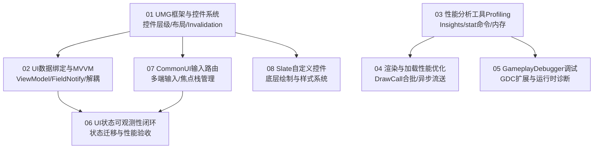

# 07 UI与性能优化

> 知识成熟度：L2（子域工程手册，已按 8 篇核心专题与 UE5.8 源码基线全面标准化）。
>
> 领域权威导航：[游戏知识 Domain MOC](../../00_Index/domains/游戏知识.md) ｜ [游戏知识总目录](../README.md)。

---

## 1. 核心定位与设计思想

「07-UI与性能优化」涵盖客户端两大相互制约的核心工程领域：用户界面表现（UI）与全平台运行帧率（性能）。在复杂大型游戏中，UI 往往是引起主线程卡顿（GameThread Hitch）与 DrawCall 暴增的隐形元凶：
- **双层 UI 架构与渲染合批**：基于底层 C++ Slate 声明式渲染树与上层 UMG 可视化包装，通过 InvalidationBox（局部失效缓存）与 RetainerBox 离屏渲染削减每帧 Slate 递归 Paint 开销；
- **现代数据驱动与视图解耦**：彻底摒弃高开销的 Tick 轮询属性绑定（Property Binding），推行 UE5.3+ 原生 MVVM 架构（FieldNotify 属性变更监听）与 ListView 虚拟化列表渲染；
- **多端输入路由与可激活视图栈**：依托 CommonUI 框架统一手柄、触控与键鼠的输入路由（Action Router），以可激活控件栈（ActivatableWidgetStack）解决复杂全屏界面的返回后退与焦点逃逸；
- **全链路性能分析与诊断闭环**：以 Unreal Insights（CPU/GPU/内存 Trace 捕获）、LLM（低级内存追踪）与 GameplayDebugger 为武器，实现从定位热点到精准治理的工程闭环。

---

## 2. 专题矩阵与知识状态

| 专题文件（Canonical 路径） | 知识类型 | 成熟度 | 核心工程关注点与落地场景 |
| :--- | :---: | :---: | :--- |
| [01-UMG框架与控件系统.md](01-UMG框架与控件系统.md) | Concept | L2 | Slate 与 UMG 层次模型、Slot 布局规则、InvalidationBox 失效缓存原理、RetainerBox 动态合批优化 |
| [02-UI数据绑定与MVVM.md](02-UI数据绑定与MVVM.md) | Concept | L2 | 传统 Tick 绑定弊端、UE5.3+ MVVM 架构：ViewModel 属性通知（FieldNotify）、转换函数与 ListView 列表虚拟化 |
| [03-性能分析工具与Profiling.md](03-性能分析工具与Profiling.md) | Concept | L2 | Unreal Insights 帧分析/Timing 视图、stat unit/stat gpu 判读、ProfileGPU 渲染耗时展开与 LLM 内存分析 |
| [04-渲染与加载性能优化.md](04-渲染与加载性能优化.md) | Concept | L2 | DrawCall 合批合并、UI 纹理图集打包、软引用与 StreamableManager 异步加载、移动端内存预算控制 |
| [05-GameplayDebugger与运行时调试.md](05-GameplayDebugger与运行时调试.md) | Concept | L2 | GameplayDebuggerCategory 自定义扩展、GDC 网络同步与 HUD 视口绘制、VisualLogger 可视化日志排障 |
| [06-UI状态与可观测性闭环.md](06-UI状态与可观测性闭环.md) | Concept | L2 | 打通 CommonUI、MVVM、Enhanced Input 与 Unreal Insights 的 UI 状态迁移、输入响应与性能验收闭环 |
| [07-CommonUI输入路由与焦点管理.md](07-CommonUI输入路由与焦点管理.md) | Concept | L2 | CommonUI 架构：CommonActivatableWidget 激活栈、CommonInputSubsystem 多端输入感知、手柄焦点导航与动作绑定 |
| [08-Slate自定义控件与样式系统.md](08-Slate自定义控件与样式系统.md) | Concept | L2 | SCompoundWidget/SLeafWidget 声明式宏语法、FSlateStyleSet 样式集合、OnPaint 绘制元素与 UMG 封装 |

---

## 3. 逻辑学习顺序建议

1. **第一阶段（UI 基础与数据解耦）**：精读 `01-UMG框架与控件系统` 与 `02-UI数据绑定与MVVM`，牢固掌握布局机制，坚决使用事件驱动与 MVVM 替代蓝图 Tick 轮询。
2. **第二阶段（工业级 CommonUI 架构）**：研读 `07-CommonUI输入路由与焦点管理`，掌握跨平台主机手柄焦点转移与层叠弹窗生命周期管理。
3. **第三阶段（性能分析与专项治理）**：深入 `03-性能分析工具与Profiling` 与 `04-渲染与加载性能优化`，利用 Unreal Insights 排查主线程卡顿与 UI 贴图显存占用。
4. **第四阶段（底层扩展与可观测闭环）**：研读 `05-GameplayDebugger`、`06-UI状态与可观测性闭环` 与 `08-Slate自定义控件`，打造高可靠的工程调试体系与高定控件。

---

## 4. 游戏与引擎工程落地场景

- **千人背包滚动卡顿优化**：使用 ListView 替代 ScrollBox，利用 Widget 复用池机制只渲染视口内可见的 20 个格子，结合 InvalidationBox 消除非激活界面的每帧重排；
- **跨平台多端交互统一**：利用 CommonUI 的 Action Router，在手柄按下 B 键、手机点击返回箭头、PC 按下 ESC 时统一触发顶级弹窗的关闭与焦点回收；
- **线上突发掉帧排查**：使用 Unreal Insights 录制 Trace 文件，在 Timing 视图中精确抓取某帧 `Slate::TickWidgets` 超过 8ms 的具体控件路径与脏区域更新原因。

---

## 5. 跨域技术依赖与前后置导航

- **向下扎根（计算机底座）**：
  - 工程调试与崩溃排障：[00-11 工程调试与性能分析](../../00-计算机与工程基础/11-工程调试与性能分析/README.md)
  - 处理器存储层次与 Cache：[00-08 计算机体系结构与性能](../../00-计算机与工程基础/08-计算机体系结构与性能/README.md)
- **向上驱动（引擎源码剖析）**：
  - UMG 与 Slate 源码：[12-14 UMG与Slate源码](../12-引擎源码分析/14-UMG与Slate源码.md)
  - MVVM 底层源码：[12-27 UMGMVVM源码](../12-引擎源码分析/27-UMGMVVM源码.md)
  - CommonUI 源码：[12-26 CommonUI源码](../12-引擎源码分析/26-CommonUI源码.md)
  - Unreal Insights 源码：[12-28 UnrealInsights与Trace源码](../12-引擎源码分析/28-UnrealInsights与Trace源码.md)
- **横向协同（玩法与音频）**：
  - 委托通信与数据驱动：[03-游戏玩法编程](../03-游戏玩法编程/README.md)
