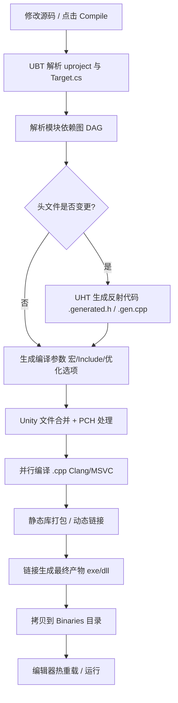
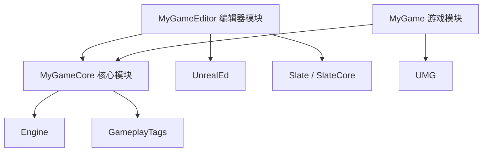

# 01 UBT 构建系统与编译配置

## 一、概述

UE（Unreal Engine）不是用现成的 CMake / MSBuild 工程组织源码的，而是使用自研的 **UBT（UnrealBuildTool）** 作为构建系统的核心。UBT 负责：

- 解析 `.uproject` / `.uplugin` / `Target.cs` / `Build.cs` 等描述文件，构建出完整的**模块依赖图**；
- 根据目标平台与配置（Development、Shipping 等）生成对应的编译参数；
- 调用平台编译器（MSVC / Clang / GCC）并组织**并行编译**与**增量编译**；
- 驱动 **UHT（UnrealHeaderTool）** 生成反射（Reflection）代码，供蓝图、序列化、GC 使用；
- 生成 IDE 工程文件（Visual Studio / Rider / Xcode / CLion / CMake）。

理解 UBT，是理解 UE 一切工程化能力（打包、插件、热更、CI）的前提。本文从核心概念讲起，逐步深入到原理、配置示例与常见问题。

### 1.1 UE 构建体系三件套

| 工具 | 全称 | 职责 | 源码位置（UE5） |
| --- | --- | --- | --- |
| UBT | UnrealBuildTool | 构建编排、依赖解析、编译驱动 | `Engine/Source/Programs/UnrealBuildTool` |
| UHT | UnrealHeaderTool | 解析 C++ 头文件中的 UE 宏，生成反射代码 | `Engine/Source/Programs/UnrealHeaderTool` |
| UAT | UnrealAutomationTool | 自动化任务：Cook、打包、测试 | `Engine/Source/Programs/AutomationTool`（详见 02 篇） |

### 1.2 UE5 时代的变化

- UBT 改为基于 **.NET（UE5.0 起随引擎提供 dotnet 运行时，UE5.3 后提供自包含的可执行文件）**，不再依赖系统全局安装的 .NET Framework；
- **UHT 已用 C++ 重写**（UE5 起，早期为 C# 实现），解析速度大幅提升；
- 默认启用 **IWYU（Include What You Use）** 包含模式（UE5.3 起新建工程默认，对应 `BuildSettingsVersion.V5`），`#include` 必须显式书写；
- 引入 **Unified Build（统一构建）**：把大量引擎模块合并为更少的 Unity 文件，显著加速从零开始的完整构建；
- 引入 **IncludeOrderVersion**，严格管控头文件包含顺序，保证跨引擎版本的可移植性。

## 二、核心概念（表格速览）

| 概念 | 是什么 | 关键文件 / 命令 |
| --- | --- | --- |
| Target（目标） | 一次构建的产物定义：游戏、编辑器、服务器、程序 | `*.Target.cs` |
| Module（模块） | 代码组织单元，编译与依赖的最小单位 | `*.Build.cs` |
| 项目（Project） | 顶层工程描述，包含模块与插件列表 | `*.uproject` |
| 插件（Plugin） | 可复用模块+资源包 | `*.uplugin`（详见 03 篇） |
| UBT | 构建系统本体（C# 程序） | `Build.bat` → `UnrealBuildTool.dll` |
| UHT | 头文件工具，生成 `.generated.h` / `.gen.cpp` | 由 UBT 自动调用 |
| 配置类型 | 编译与运行形态：Debug / DebugGame / Development / Test / Shipping | `-configuration=` 参数 |
| 平台 | 目标运行平台：Win64、Linux、Android、iOS、Mac、PS5、XSX 等 | `-platform=` 参数 |
| 构建模式 | 按 TargetType 区分：Game / Client / Server / Editor / Program | `Target.cs` 中 `Type` |
| Unity Build | 把多个 .cpp 合并成一个"Unity 文件"编译，减少编译开销 | `bUseUnityBuild`、`-DisableUnity` |
| PCH | 预编译头，加速编译 | `PCHUsage`、`SharedPCHs` |
| IWYU | 显式包含头文件的代码规范 | `IWYUSupport`、`IncludeOrderVersion` |
| DDC | Derived Data Cache，烘焙/着色器编译缓存 | 见 02/04 篇 |
| 编译产物 | 可执行文件与 DLL：`Binaries/Win64/MyGame.exe` 等 | `Engine/Binaries/...` |

## 三、原理详解

### 3.1 UBT 的启动链路

以 Windows 为例，构建入口是 `Engine\Build\BatchFiles\Build.bat`，其核心调用链为：

```text
Build.bat
  └─> UnrealBuildTool（dotnet 运行，UE5）
        ├─ 读取 .uproject → 找到 Target 源文件
        ├─ 解析 Target.cs → 确定配置、平台、模块集合
        ├─ 递归解析 Build.cs → 构建模块依赖图
        ├─ 调用 UHT 生成反射代码（必要时）
        ├─ 生成编译参数（include 路径、宏、优化选项）
        └─ 调用 MSBuild/Clang 并行编译 → 链接 → 产物
```

UBT 本身位于 `Engine\Source\Programs\UnrealBuildTool`，编译后的程序位于 `Engine\Binaries\DotNET\UnrealBuildTool\`。日常使用无需直接调用，通过 `Build.bat` 或编辑器"编译"按钮即可。

### 3.2 Target：一次构建的"产品定义"

每个可执行目标对应一个 `Target.cs` 文件，位于项目的 `Source/` 目录下。常见 Target 包括：

| Target 文件 | TargetType | 产物 | 说明 |
| --- | --- | --- | --- |
| `MyGame.Target.cs` | Game | `MyGame.exe`（客户端） | 游戏本体 |
| `MyGameEditor.Target.cs` | Editor | `UnrealEditor.exe` + 项目 DLL | 编辑器开发目标 |
| `MyGameServer.Target.cs` | Server | `MyGameServer.exe` | 专用服务器 |
| `MyGameClient.Target.cs` | Client | 纯客户端（不含服务器逻辑） | 联网游戏拆分用 |
| `MyTool.Target.cs` | Program | 独立命令行程序 | 自定义工具 |

Target 决定：**编译哪些模块**（`ExtraModuleNames`）、**使用什么配置/平台**、**是否编译编辑器**（`bBuildEditor`）、**链接方式**等。

### 3.3 Module：编译与依赖的最小单位

一个模块 = 一个目录 + 一个 `Build.cs`。模块目录内通常分为：

```text
Source/MyGameCore/
  MyGameCore.Build.cs        # 模块描述
  Public/                    # 公开头文件（可被其他模块 include）
  Private/                   # 私有实现
  Classes/                   # 旧版约定，UE5 已不再推荐
```

模块间通过 `Build.cs` 声明依赖，UBT 据此构建**有向无环图（DAG）**。若出现循环依赖（A 依赖 B，B 又依赖 A），UBT 会直接报错。

### 3.4 UHT 与反射代码生成

UHT 扫描模块中所有头文件，识别 `UCLASS` / `USTRUCT` / `UFUNCTION` / `UPROPERTY` 等 UE 宏，生成：

- `*.generated.h`：反射元数据声明；
- `*.gen.cpp`：反射实现（属性表、函数表、`StaticClass()` 等）。

生成的代码位于 `Intermediate/Build/<Platform>/<Config>/<Module>/` 下。**UHT 生成是编译的前置步骤**：只有 UHT 成功，才会进入真正的 C++ 编译。

> UE5 的 UHT 已用 C++ 重写（早期为 C#），并支持**增量生成**：只有头文件变更时才重新生成，显著缩短迭代时间。

### 3.5 完整编译管线（Mermaid）



### 3.6 配置类型（Configuration）详解

UBT 提供五种内置配置，通过 `-configuration=` 指定：

| 配置 | 优化 | 断言 | 日志 | 典型用途 | 关键宏 |
| --- | --- | --- | --- | --- | --- |
| Debug | 无 | 开启 | 全量 | 断点调试引擎/游戏逻辑 | `UE_BUILD_DEBUG` |
| DebugGame | 引擎优化、游戏代码不优化 | 开启 | 全量 | 日常调试游戏逻辑 | `UE_BUILD_DEBUGGAME` |
| Development | 优化但可调试 | 开启 | 全量 | 日常开发（编辑器默认） | `UE_BUILD_DEVELOPMENT` |
| Test | 优化 | 部分 | 精简 | 性能/压力测试 | `UE_BUILD_TEST` |
| Shipping | 全优化 | 关闭 | 极简 | 发布给玩家 | `UE_BUILD_SHIPPING` |

**重点理解 Development 与 Shipping：**

- Development 是**开发默认**：带调试信息、带 `check()`/`ensure()` 断言、日志完整，适合编辑器与日常构建；
- Shipping 是**发布形态**：`WITH_EDITOR=0`、`UE_BUILD_SHIPPING` 开启，断言被移除，日志按 `LogXXX` 的编译期裁剪（部分日志在 Shipping 下直接不编译），体积与性能最优；
- 很多"打包后功能消失"的问题，本质是代码写在 `#if WITH_EDITOR` 或依赖 Editor 模块导致。

代码中常用的条件宏：

```cpp
#if UE_BUILD_SHIPPING
    // 发布版才包含
#endif

#if WITH_EDITOR
    // 仅编辑器构建包含（注意：Development 游戏构建也包含 WITH_EDITOR? 否，WITH_EDITOR 仅编辑器目标为 1）
#endif

#if !UE_BUILD_SHIPPING
    // 非发布版（调试用代码）
#endif
```

> `WITH_EDITOR` 仅在 Editor Target 中为 1；Development 配置下的 Game Target 其 `WITH_EDITOR` 为 0。区分「配置（Configuration）」与「目标类型（TargetType）」两个维度非常重要。

### 3.7 Unity Build、PCH 与 IWYU

**Unity Build（统一编译）**：UBT 默认将同一模块中多个 `.cpp` 合并成一个大 `.cpp`（Unity 文件）再编译，减少头文件重复解析的开销。代价是：单文件改动会触发所属 Unity 文件整体重编、编译器报错行号难定位。UE5.3 起进一步引入 Unified Build，把引擎模块也合并，全量编译速度可提升数倍。

**PCH（预编译头）**：`PCHUsage` 有三种模式：

| 模式 | 说明 |
| --- | --- |
| `UseExplicitOrSharedPCHs` | 推荐。使用共享 PCH 或显式 PCH |
| `NoSharedPCHs` | 每个模块用自己的 PCH |
| `NoPCHs` | 完全禁用 PCH |

**IWYU（Include What You Use）**：要求每个 `.cpp`/`.h` 显式包含自己用到的所有头文件，禁止依赖"间接包含"。UE5.3+ 新工程默认开启（`BuildSettingsVersion.V5`），旧工程可通过 Target.cs 的 `DefaultBuildSettings` 控制。好处是增量编译更快、改动影响面更小，代价是写代码时要多写 include。

### 3.8 增量编译与缓存

UBT 通过 `Intermediate/` 目录保存编译中间产物：

```text
Intermediate/
  Build/          # 各平台各配置的编译产物
  ProjectFiles/   # 生成的 IDE 工程
  ...
```

增量编译的核心：

- 仅重编**头文件影响到的模块**（头文件依赖跟踪）；
- 未变化的 Unity 文件直接复用；
- UHT 仅在头文件变更时重新生成；
- `Build.bat` 支持 `-Clean` 全量清理，CI 中建议保留 `Intermediate` 缓存以加速构建。

## 四、代码 / 配置示例

### 4.1 项目文件 `MyGame.uproject`

```json
{
	"FileVersion": 3,
	"EngineAssociation": "5.4",
	"Category": "",
	"Description": "示例项目",
	"Modules": [
		{
			"Name": "MyGame",
			"Type": "Runtime",
			"LoadingPhase": "Default",
			"AdditionalDependencies": ["Engine"]
		},
		{
			"Name": "MyGameEditor",
			"Type": "Editor",
			"LoadingPhase": "PostEngineInit"
		}
	],
	"Plugins": [
		{ "Name": "MyCompanyToolPlugin", "Enabled": true }
	]
}
```

### 4.2 `MyGame.Target.cs`（游戏目标）

```csharp
using UnrealBuildTool;
using System.Collections.Generic;

public class MyGameTarget : TargetRules
{
	public MyGameTarget(TargetInfo Target) : base(Target)
	{
		Type = TargetType.Game;

		// 要编译进本目标的模块（不写 Editor 模块！）
		ExtraModuleNames.AddRange(new string[] { "MyGame", "MyGameCore" });

		// UE5 推荐：使用与引擎一致的构建设置与包含顺序
		DefaultBuildSettings = BuildSettingsVersion.V5;
		IncludeOrderVersion = EngineIncludeOrderVersion.Latest;

		// 关闭 Unity 构建（调试依赖图问题时用，平时保持默认 true）
		bUseUnityBuild = true;
		bUsePCHFiles = true;
		bUseSharedPCHFiles = true;

		// 链接选项示例
		WindowsPlatform.TargetWindowsVersion = TargetWindowsVersion.Win10;
	}
}
```

### 4.3 `MyGameEditor.Target.cs`（编辑器目标）

```csharp
using UnrealBuildTool;
using System.Collections.Generic;

public class MyGameEditorTarget : TargetRules
{
	public MyGameEditorTarget(TargetInfo Target) : base(Target)
	{
		Type = TargetType.Editor;
		DefaultBuildSettings = BuildSettingsVersion.V5;
		IncludeOrderVersion = EngineIncludeOrderVersion.Latest;

		ExtraModuleNames.AddRange(new string[] { "MyGame", "MyGameCore", "MyGameEditor" });

		// 编辑器目标必须链接引擎编辑器相关库
		bBuildEditor = true;
		bBuildDeveloperTools = true;
	}
}
```

### 4.4 模块 `MyGameCore.Build.cs`

```csharp
using UnrealBuildTool;

public class MyGameCore : ModuleRules
{
	public MyGameCore(ReadOnlyTargetRules Target) : base(Target)
	{
		// UE5 推荐：显式 PCH + IWYU
		PCHUsage = PCHUsageMode.UseExplicitOrSharedPCHs;
		IWYUSupport = IWYUSupport.Full;

		// 公开依赖：被其他模块 include 头文件时，对方也必须能链接这些模块
		PublicDependencyModuleNames.AddRange(new string[]
		{
			"Core",
			"CoreUObject",
			"Engine",
			"GameplayTags",
			"DeveloperSettings"
		});

		// 私有依赖：仅本模块内部使用
		PrivateDependencyModuleNames.AddRange(new string[]
		{
			"Slate",
			"SlateCore",
			"UMG",
			"RenderCore"
		});

		// 仅编辑器构建才引用的模块
		if (Target.bBuildEditor)
		{
			PrivateDependencyModuleNames.Add("UnrealEd");
		}

		// 平台分支示例
		if (Target.Platform == UnrealTargetPlatform.Android)
		{
			PrivateDependencyModuleNames.Add("Launch");
		}

		// 代码优化策略：Shipping 才优化，其余保持可调试
		OptimizeCode = CodeOptimization.InShippingBuildsOnly;

		// 异常开关（默认关闭，需要 try/catch 解析用户数据时打开）
		bEnableExceptions = true;

		// 编译选项示例
		CppStandard = CppStandardVersion.Cpp20;
		bWarningsAsErrors = false;
	}
}
```

### 4.5 命令行构建

```bat
rem ===== 开发构建（编辑器相关） =====
Engine\Build\BatchFiles\Build.bat MyGameEditor Win64 Development ^
    -project="C:\MyGame\MyGame.uproject" -WaitMutex

rem ===== 发布构建（游戏本体） =====
Engine\Build\BatchFiles\Build.bat MyGame Win64 Shipping ^
    -project="C:\MyGame\MyGame.uproject"

rem ===== 常用附加参数 =====
rem -Clean                全量重建
rem -NoPCH                禁用预编译头
rem -DisableUnity         禁用 Unity 合并（定位编译错误）
rem -WarningsAsErrors     警告当错误
rem -ModuleWithSuffix=ModuleName,AAAA  带后缀编译（调试用）
rem -XGE / -IncrediBuild  分布式编译（IncrediBuild）
rem -FASTBuild            使用 FASTBuild 分布式编译
```

生成 IDE 工程文件：

```bat
Engine\Build\BatchFiles\GenerateProjectFiles.bat -2022 -project="C:\MyGame\MyGame.uproject"
```

### 4.6 模块依赖关系示例（Mermaid）



### 4.7 全局构建配置 `BuildConfiguration.xml`

位于 `Engine\Saved\UnrealBuildTool\BuildConfiguration.xml`（或用户级目录），可调整 Unity、并行度等：

```xml
<?xml version="1.0" encoding="utf-8"?>
<Configuration xmlns="https://www.unrealengine.com/BuildConfiguration">
	<BuildConfiguration>
		<MaxParallelActions>16</MaxParallelActions>
		<bAllowHotReloadFromIDE>true</bAllowHotReloadFromIDE>
	</BuildConfiguration>
	<UEBuildConfiguration>
		<MinSourceFilesForUnityBuild>2</MinSourceFilesForUnityBuild>
		<bUseUnityBuild>true</bUseUnityBuild>
	</UEBuildConfiguration>
</Configuration>
```

## 五、最佳实践

1. **模块划分粒度适中**：一个功能域一个 Runtime 模块（如 `MyGameInventory`），不要把所有代码塞进一个模块；也不要拆分过细导致依赖图混乱。
2. **依赖最小化**：`PrivateDependencyModuleNames` 能放私有的就不放公开；公开依赖会被下游模块传递继承，放多了会拖慢编译。
3. **禁止循环依赖**：UBT 会报错；遇到时通过提取公共模块或使用接口（`UINTERFACE`）解耦。
4. **Editor 代码与 Runtime 严格分离**：编辑器工具模块（`*Editor`）只依赖 `UnrealEd`，且**永远不要**被 Game Target 引用。
5. **保持 IWYU 纪律**：新工程保持默认；写头文件时只 include 自己需要的，能用前置声明就用前置声明。
6. **合理使用软引用**：模块间避免头文件互相包含，必要时用接口 + 动态绑定。
7. **CI 中保留缓存**：`Intermediate/` 缓存不提交到版本库，但 CI 机器之间可共享（或使用分布式编译缓存），否则每次全量编译耗时极长。
8. **用 `-DisableUnity` 定位编译错误**：Unity 合并后的行号会偏移，报错难定位时先关闭 Unity 重编。
9. **统一 `DefaultBuildSettings`**：团队所有 Target 使用同一版本（如 V5），避免新旧 include 顺序混用导致的"换个机器编译不过"。
10. **定期全量构建**：增量构建会掩盖头文件漏 include 问题（IWYU 违规），CI 中安排每日全量构建兜底。

## 六、常见问题 FAQ

**Q1：编译报错 "Unable to find module 'XXX'"?**
检查该模块是否被加入 `ExtraModuleNames`、模块目录是否在 `Source/` 下、`.Build.cs` 类名与文件名是否一致（必须同名同路径）。

**Q2：LNK 链接错误（无法解析的外部符号）？**
多为模块依赖缺失：使用某模块的 API 却没在 `Build.cs` 中声明依赖；或函数声明了但未实现；或 Editor-only 函数在非编辑器构建被调用。

**Q3：编译很慢，怎么优化？**
按顺序排查：Unity Build 是否开启 → PCH 是否生效 → 是否全量重编（头文件改动波及面大）→ 是否缺少 IWYU → 是否可上分布式编译（IncrediBuild / FASTBuild / SN-DBS）。

**Q4：修改了 `Build.cs` 或新增了模块，但编辑器不识别？**
需要**重新生成工程文件**并重启编辑器：右键 `.uproject` → "Generate Visual Studio project files"，或运行 `GenerateProjectFiles.bat`。

**Q5：UHT 报错 "Unrecognized type" 或反射生成失败？**
检查头文件是否 `#include "X.generated.h"` 且位于文件末尾、类是否缺少 `UCLASS`/`USTRUCT` 宏、`UPROPERTY` 是否使用了 UHT 支持的类型。UHT 错误几乎总是头文件语法或宏使用问题。

**Q6：Debug 与 Development 下行为不一致？**
正常现象：`check()` 在 Development 保留但在 Shipping 移除；优化级别不同。排查逻辑问题用 Development，排查发布问题用 Shipping 构建 + 远程日志。

**Q7：什么是 Hot Reload / Live Coding，与 UBT 什么关系？**
两者都通过 UBT 编译变更的模块并动态加载新 DLL。Live Coding（UE4.22+）比 Hot Reload 更稳定，支持更多场景；但**改头文件/宏/反射结构后仍建议重启编辑器**。

**Q8：怎么构建专用服务器？**
`Build.bat MyGameServer Linux Shipping -project=...`（服务器常用 Linux 平台），并在 Target.cs 中保证 Server 目标不引用渲染/客户端模块。

**Q9：`bWarningsAsErrors` 开启后大量警告怎么办？**
先修复存量警告再开启；或在个别模块用 `bWarningsAsErrors = false` 豁免，但应记录豁免原因并定期清理。

**Q10：能否给 UBT 加自定义逻辑（自定义参数/自定义打包步骤）？**
可以：创建 `Program` 类型 Target 或通过 UAT 扩展（见 02 篇）；也可以在 `Build.cs` 中通过 `Target` 对象读取自定义命令行参数（`Target.Options`）。

## 七、关联阅读

- 本分类 [02-UAT与自动化打包.md](02-UAT与自动化打包.md)：UBT 构建出的产物如何进入打包流水线
- 本分类 [03-插件开发与编辑器扩展.md](03-插件开发与编辑器扩展.md)：插件的 Build.cs 与模块类型
- 本分类 [04-资源管理与热更新.md](04-资源管理与热更新.md)：编译宏与资源打包的协作
- 官方文档：Unreal Build Tool（https://dev.epicgames.com/documentation/en-us/unreal-engine/unreal-build-tool-in-unreal-engine）
- 官方文档：Build Configuration（https://dev.epicgames.com/documentation/en-us/unreal-engine/build-configuration-in-unreal-engine）
- 官方文档：Unreal Header Tool（https://dev.epicgames.com/documentation/en-us/unreal-engine/unreal-header-tool-in-unreal-engine）
- 官方文档：Target 与配置（https://dev.epicgames.com/documentation/en-us/unreal-engine/build-configuration-for-targets-in-unreal-engine）
- 官方文档：IWYU / 模块（https://dev.epicgames.com/documentation/en-us/unreal-engine/modules-in-unreal-engine）
