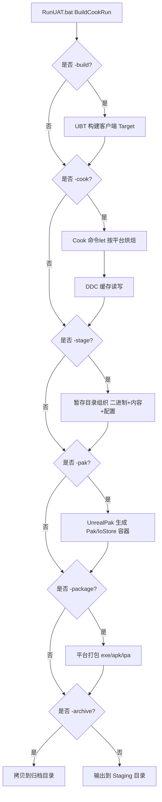

# 02 UAT 与自动化打包
> 版本基准：UE 5.8.0（本机 `Engine/Build/Build.version`：CL 55116800，分支 `++UE5+Release-5.8`）。
> 兼容性边界：适用于 UE5.8 编辑器/运行时，UE4.27 与早期 UE5 仅作迁移背景，具体模块以正文为准。
> 最后更新：2026-08-06（本轮元数据维护）。

## 一、概述

**UAT（UnrealAutomationTool）** 是 UE 的自动化任务执行框架，本质是一个 C# 程序集合。它把 UE 发布流程中的琐碎步骤（编译、烘焙、暂存、打包、归档、测试）封装为一条条可组合的命令，其中最核心的是 **BuildCookRun**。

一个典型的上线包生成流程：

```text
编译（Build）→ 烘焙（Cook）→ 暂存（Stage）→ 打包（Package）→ 归档（Archive）
```

UAT 的价值在于：

- **一条命令出包**：从源码到可分发安装包全部自动化；
- **跨平台**：Windows / Android / iOS / Linux / macOS / 主机平台；
- **可编排**：参数化组合，天然适配 CI（Jenkins、GitLab CI、GitHub Actions、DevOps）；
- **可扩展**：用 C# 编写自定义 Automation 任务（`[Help]` + `[Param]` 特性），与官方命令同等待遇；
- **自动化测试**：内置 Automation 测试框架，可命令行批量执行功能/压力测试。

本文以 Windows 环境为主讲解（其他平台脚本为 `RunUAT.sh`，参数一致），先建立全局概念，再给命令示例。

## 二、核心概念（表格速览）

| 概念 | 说明 | 关键参数 / 文件 |
| --- | --- | --- |
| RunUAT | UAT 启动脚本 | `Engine\Build\BatchFiles\RunUAT.bat` / `RunUAT.sh` |
| AutomationTool | UAT 本体（C#） | `Engine\Source\Programs\AutomationTool` |
| BuildCookRun | 最常用的组合命令 | `-build -cook -stage -package -archive` |
| Build | 调用 UBT 编译目标 | `-build`、`-clientconfig` |
| Cook（烘焙） | 把 uasset 转换为目标平台运行时格式 | `-cook`、`-CookCultures`、`-CookAll` |
| Stage（暂存） | 把产物按目录结构拷贝到暂存区 | `-stage`、`-StagingDirectory` |
| Package（打包） | 生成平台安装包（apk/ipa/exe 等） | `-package`、`-distribution` |
| Archive（归档） | 拷贝产物到指定目录 | `-archive`、`-archivedirectory` |
| Pak | 把 Cook 内容打包为 pak/io 容器 | `-pak`、`-compressed` |
| DDC | 烘焙缓存（Derived Data Cache） | `-ddc=...`、`-SharedCookedBuild` |
| 目标平台 | 产物运行的平台 | `-platform=Win64/Android/iOS/...` |
| 配置 | 客户端/服务器构建配置 | `-clientconfig=Shipping`、`-serverconfig` |
| 自动化测试 | Automation 测试框架 | `-ExecCmds="Automation RunTests ..."` |
| 迭代 | 复用上次结果加速重复出包 | `-iterate`、`-SkipCook` 等 |

## 三、原理详解

### 3.1 UAT 的架构

UAT 位于 `Engine\Source\Programs\AutomationTool`，由若干 **Command（命令类）** 组成。每个命令类用 C# 特性声明参数：

```csharp
[Help("打包命令示例")]
[Param("Platform", "目标平台")]
public class BuildCookRun : BuildCommand
{
	public override void ExecuteBuild()
	{
		// 读取参数并编排子步骤
	}
}
```

`BuildCookRun` 内部按顺序调用：

1. **Build**：调用 UBT 构建指定 Target（客户端 + 可选服务器）；
2. **Cook**：调用 `Cook` 命令let（`UnrealEditor-Cmd.exe -run=Cook`）烘焙资源；
3. **Stage**：把二进制、Cook 产物、配置文件按发布目录结构组织；
4. **Package**：调用平台工具生成安装包；
5. **Archive**：把最终产物拷贝到归档目录。

### 3.2 完整打包流水线（Mermaid）



### 3.3 Cook（烘焙）原理

Cook 把编辑器态资源（`.uasset`）转换为目标平台运行态资源（`.uasset` 的 Cooked 版本 + 着色器缓存 + 平台专用格式），存放于 `Saved/Cooked/<Platform>/<Project>/Content/`。

关键点：

- **按引用烘焙**：从 Map 出发遍历资源引用图，只烘焙被引用的资源（配合 Primary Asset 可扩大范围）；
- **平台相关**：纹理格式（ASTC/ETC2/BC）、音频格式、着色器各不相同，必须按平台分别 Cook；
- **DDC 缓存**：Cook 结果缓存在 Derived Data Cache，未变化的资源无需重烘焙，这是 CI 加速的关键；
- **增量 Cook**：`-iterate` 或 `-SkipCook` 复用上次 Cook 结果，本地反复出包时显著提速；
- **版本化**：`-unversionedcookedcontent` 可去掉资源版本号（减小体积，牺牲兼容性，通常与 `-pak` 搭配）。

### 3.4 Stage / Package / Archive 的区别

初学者最容易混淆的三个概念：

| 阶段 | 做什么 | 产物形态 |
| --- | --- | --- |
| Stage | 把"应该进入发布包的东西"按目录摆好（二进制、Cook 内容、ini、启动脚本） | `Saved/StagedBuilds/<Platform>/` |
| Package | 把 Staged 产物封装为平台安装包 | `.exe`、`.apk`、`.ipa`、`.pkg` |
| Archive | 把 Package 产物再拷贝一份到团队约定的目录 | 任意目录，通常带版本号 |

### 3.5 自动化测试框架

UE 内置 **Automation（自动化测试）** 框架，测试用 C++（`IMPLEMENT_SIMPLE_AUTOMATION_TEST`）或蓝图（Automation 蓝图）编写，可在编辑器内（Session Frontend）或命令行执行。

```cpp
IMPLEMENT_SIMPLE_AUTOMATION_TEST(FMyTest, "MyGame.Core.MyTest",
	EAutomationTestFlags::ApplicationContextMask | EAutomationTestFlags::ProductFilter)

bool FMyTest::RunTest(const FString& Parameters)
{
	TestTrue("值应为真", MyFunction() == Expected);
	return true;
}
```

命令行执行（无需打开编辑器窗口）：

```bat
Engine\Binaries\Win64\UnrealEditor-Cmd.exe MyGame -unattended -nullrhi -nop4 ^
    -ExecCmds="Automation RunTests MyGame.Core; Quit" ^
    -TestExit="Automation Test Queue Empty" -ReportOutputPath="C:\Reports"
```

## 四、打包命令示例

### 4.1 Windows 完整出包（最常见）

```bat
Engine\Build\BatchFiles\RunUAT.bat BuildCookRun ^
    -project="C:\MyGame\MyGame.uproject" ^
    -noP4 -platform=Win64 ^
    -clientconfig=Shipping ^
    -build -cook -stage -package -archive ^
    -archivedirectory="C:\BuildOutput\MyGame_1.0.0" ^
    -pak -prereqs ^
    -log="C:\Logs\MyGame_package.log"
```

参数含义：

| 参数 | 含义 |
| --- | --- |
| `-project` | 项目 uproject 路径 |
| `-noP4` | 不连接 Perforce（版本库用户必须加） |
| `-platform=Win64` | 目标平台 |
| `-clientconfig=Shipping` | 客户端构建配置 |
| `-build -cook -stage -package -archive` | 执行完整流水线 |
| `-pak` | 内容打包为 Pak（UE5 默认同时生成 IoStore 容器） |
| `-prereqs` | 附带 VC++ 运行库等前置安装程序 |
| `-archivedirectory` | 归档输出目录 |
| `-log` | 日志输出路径（默认在 `Saved/Logs`） |

### 4.2 开发迭代包（快速出包）

```bat
RunUAT.bat BuildCookRun -project="C:\MyGame\MyGame.uproject" ^
    -noP4 -platform=Win64 -clientconfig=Development ^
    -build -cook -stage -package ^
    -pak -iterates -iteratedirectory="C:\MyGame\Saved\Iterative"
```

> `-iterates` 配合 `-iteratedirectory` 可复用上次的 Cook 与 Staging 结果；仅资源/代码小幅改动时出包时间可从数十分钟降到几分钟。

### 4.3 Android 打包

```bat
RunUAT.bat BuildCookRun -project="C:\MyGame\MyGame.uproject" ^
    -noP4 -platform=Android -clientconfig=Shipping ^
    -build -cook -stage -package ^
    -pak -distribution ^
    -keystore="C:\MyGame\Build\mygame.keystore" ^
    -storepass=****** -keyalias=mygame -keypass=****** ^
    -sdkapi=34 -ndk=26.1.10909125
```

前置条件：

- 安装 Android Studio + SDK/NDK，并在引擎中配置路径（Edit → Project Settings → Platforms → Android SDK）；
- `-distribution` 生成可上架商店的发布包（含签名）；调试包用 `-debug` 或默认；
- AAB 上架 Google Play 需 `-aab` 参数（UE5 支持）；
- 多 ABI（arm64-v8a / armv7 / x86_64）可用 `-Architecture=-arm64` 等控制，减小包体。

### 4.4 iOS / macOS 打包

```sh
# 必须在 macOS 上执行（iOS 打包需要 Xcode）
Engine/Build/BatchFiles/RunUAT.sh BuildCookRun \
    -project="/path/MyGame.uproject" \
    -noP4 -platform=iOS -clientconfig=Shipping \
    -build -cook -stage -package \
    -distribution -notarize \
    -ProvisioningProfile="xxxx-xxxx-xxxx" \
    -SignIdentity="Apple Distribution: XXX (XXXX)"
```

要点：

- 需要开发者证书、Provisioning Profile，并在引擎设置中配置；
- `-notarize`（公证）用于规避 macOS Gatekeeper / iOS 安装限制；
- 真机调试需签名；模拟器包用 `-simulator`。

### 4.5 Linux 专用服务器

```bat
RunUAT.bat BuildCookRun -project="C:\MyGame\MyGame.uproject" ^
    -noP4 -platform=Linux -clientconfig=Shipping ^
    -server -serverplatform=Linux -serverconfig=Shipping ^
    -build -cook -stage -package ^
    -pak -noclient
```

> `-noclient` 只产出服务器；`-server` 显式构建专用服务器（Dedicated Server）。

### 4.6 主机平台（PS5 / Xbox Series X|S / Switch）

主机平台需要 Epic / 平台厂商授权的**平台扩展（Platform Extension）**与专用 SDK：

```bat
RunUAT.bat BuildCookRun -project="C:\MyGame\MyGame.uproject" ^
    -noP4 -platform=PS5 -clientconfig=Shipping ^
    -build -cook -stage -package -pak
```

常见注意事项：

- 主机 SDK 安装路径需在引擎 `Platforms/<Name>/` 下配置；
- 分盘（Disc Layout）与多 Chunk 需求强烈建议配合 04 篇的 Chunk 方案；
- 主机平台的 CrashReporter、账号、成就等需对接平台 SDK 插件。

### 4.7 自动化测试执行

```bat
rem 方式一：通过 BuildCookRun 打包后运行测试
RunUAT.bat BuildCookRun -project="C:\MyGame\MyGame.uproject" ^
    -noP4 -platform=Win64 -clientconfig=Development ^
    -build -cook -stage -package -pak ^
    -RunAutomationTests ^
    -AutomationTestFilter="MyGame.Core" ^
    -ReportOutputPath="C:\Reports\Automation"

rem 方式二：编辑器命令行直接跑
Engine\Binaries\Win64\UnrealEditor-Cmd.exe "C:\MyGame\MyGame.uproject" ^
    -unattended -nullrhi -nosplash -nop4 ^
    -ExecCmds="Automation RunTests MyGame.Core; Quit" ^
    -TestExit="Automation Test Queue Empty"
```

### 4.8 其他常用 UAT 命令

| 命令 | 用途 |
| --- | --- |
| `BuildPlugin` | 打包插件分发（详见 03 篇） |
| `Cook` | 仅执行烘焙 |
| `UnrealPak` | 手动打 Pak / 生成补丁（详见 04 篇） |
| `GeneratePatch` | 基于旧 Pak 生成差量补丁 |
| `DLC` | 生成 DLC 包 |
| `BuildCookRun -help` | 打印全部参数说明 |

## 五、最佳实践

1. **CI 用专用打包机**：配置干净的构建环境（引擎版本固定、SDK 固定、磁盘余量充足），禁止开发机兼任。
2. **共享 DDC**：CI 之间、开发机与 CI 之间共享 DDC（自建 DDC 服务器或用共享目录），打包时间可缩短 50% 以上。
3. **固定引擎版本**：`EngineAssociation` 用版本号或源码哈希锁定，避免"昨天还能打包今天不行"。
4. **版本号注入**：通过 `-archivedirectory` 带版本号归档，并生成版本 manifest（JSON）供运维/QA 使用。
5. **日志全保留**：每次构建的完整日志按日期归档，`-log` 指定路径；配合 `-utf8output` 避免中文乱码。
6. **分步执行便于排错**：CI 中把 Build / Cook / Stage / Package 拆成多步，失败时快速定位阶段。
7. **迭代包与发布包分离**：日常验证用 `-iterate` 快速包；发版/提测用全量干净包。
8. **Cook 白名单化**：用 Primary Asset / 资源扫描规则控制烘焙范围，避免"编辑器能跑，打包缺资源"。
9. **自动化测试进 CI**：冒烟测试（启动进主菜单）+ 核心功能测试在每个提测包上执行。
10. **磁盘与并发管理**：同一台机器避免并发打包；及时清理 `Saved/` 与归档目录，防止磁盘写满导致诡异失败。

## 六、常见问题 FAQ

**Q1：打包报错 "Cook failed" / 某资源 Cook 崩溃？**
查看 Cook 日志定位资源；常见原因：资源引用缺失、着色器编译内存不足、平台不支持格式。可用 `-SkipCook` + 编辑器内打开资源复现。批量定位可用 `-CookAll` 或按 Map 缩小范围。

**Q2：打包出来的游戏没有音效/贴图/关卡？**
多半是资源未被烘焙：检查引用是否为软引用且未纳入 Primary Asset 扫描，或内容被判定为 Editor-only。把资源加入 `AssetManager` 扫描规则或用硬引用测试。

**Q3：Android 打包失败：找不到 SDK/NDK？**
在引擎里配置 SDK 路径，或命令行显式传 `-sdkapi` / `-ndk`；注意 UE5 各小版本对 NDK 版本有要求，需与引擎文档匹配。

**Q4：iOS 打包必须在 Mac 上吗？**
是。Windows 上只能做部分准备工作（资源、配置），最终 IPA 生成需要 macOS + Xcode + 证书。也可用远程 Mac 打包机。

**Q5：`-pak` 与 `-compressed` 什么关系？**
`-pak` 生成容器；`-compressed` 是 UE4 时代的整体压缩开关，UE5 默认使用 Oodle 按块压缩，无需再传 `-compressed`（详见 04 篇）。

**Q6：自动化测试在 CI 上跑不起来 / 卡住？**
检查是否加了 `-unattended -nullrhi`；测试需显式退出（`Quit` 或 `-TestExit`）；崩溃时生成 `Saved/Crashes` 分析；注意 `-ReportOutputPath` 需要有写权限。

**Q7：打包时间太长，如何加速？**
① 共享 DDC；② 增量 Cook（`-iterate`）；③ 分布式编译（IncrediBuild/FASTBuild）；④ 关闭不必要的 Cook 文化/语言（`-CookCultures=zh-Hans`）；⑤ 减少平台数（一次打一个平台）。

**Q8：`-prereqs` 是必须的吗？**
Windows 包建议加：它会附带 VC++ 运行库与 DX 组件安装器；如果目标机器已统一预装，可不加以减小体积。

**Q9：打包后日志里大量 "LogPakFile: Warning: ..."？**
多为 Pak 挂载/缺失告警，检查 `-pak` 是否生效、是否有内容没进 Pak（如 `Saved/` 下的临时资源）。

**Q10：能否在 UAT 里加自定义命令？**
可以：在 `Engine\Source\Programs\AutomationTool` 下（或通过源码引擎的 `AutomationTool` 扩展点）编写继承 `BuildCommand` 的 C# 类，用 `[Param]` 声明参数，即可用 `RunUAT.bat 你的命令名` 调用。

## 七、关联阅读

- 本分类 [01-UBT构建系统与编译配置.md](01-UBT构建系统与编译配置.md)：打包前置的编译与配置概念
- 本分类 [03-插件开发与编辑器扩展.md](03-插件开发与编辑器扩展.md)：插件打包分发（BuildPlugin）
- 本分类 [04-资源管理与热更新.md](04-资源管理与热更新.md)：Pak/Chunk、差量补丁与版本管理
- 官方文档：Automation Tool / RunUAT（https://dev.epicgames.com/documentation/en-us/unreal-engine/automation-tool-in-unreal-engine）
- 官方文档：打包游戏（https://dev.epicgames.com/documentation/en-us/unreal-engine/packaging-unreal-engine-projects）
- 官方文档：Automation 测试框架（https://dev.epicgames.com/documentation/en-us/unreal-engine/automation-in-unreal-engine）
- 官方文档：DDC（https://dev.epicgames.com/documentation/en-us/unreal-engine/derived-data-cache-in-unreal-engine）
