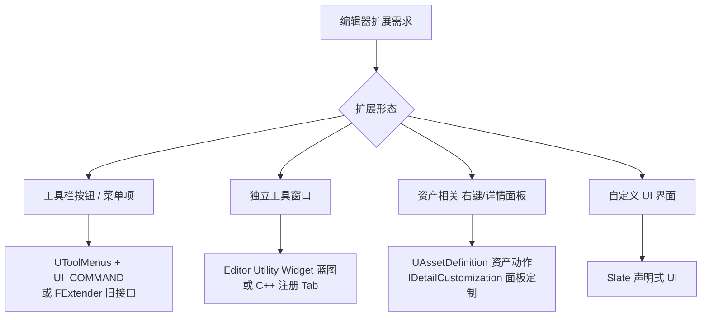
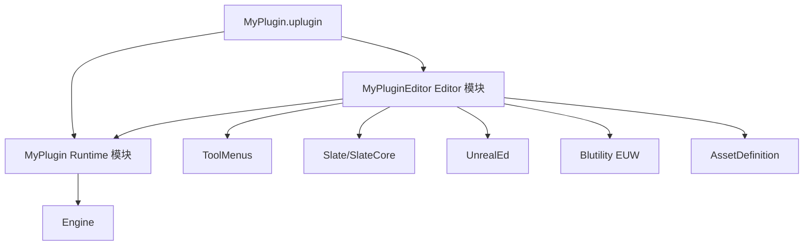

# 03 插件开发与编辑器扩展
> 版本基准：UE 5.8.0（本机 `Engine/Build/Build.version`：CL 55116800，分支 `++UE5+Release-5.8`）。
> 兼容性边界：适用于 UE5.8 编辑器/运行时，UE4.27 与早期 UE5 仅作迁移背景，具体模块以正文为准。
> 最后更新：2026-08-06（本轮元数据维护）。

## 一、概述

**插件（Plugin）** 是 UE 中代码与资源最高级别的复用单元：一个插件可以包含多个模块（C++）、蓝图、资产、ini 配置，甚至完整的编辑器工具。引擎本身的大部分功能（Niagara、EnhancedInput、GameplayAbilitySystem 等）都是以插件形式存在的。

编辑器扩展则是 UE 工作流效率的核心：团队自建编辑器工具（批量处理、数据检查、自动化流水线）几乎全部以插件形式落地。

本篇文章覆盖：

- 插件结构：`.uplugin` 清单、目录布局、模块类型；
- 插件生命周期：加载阶段、模块启动/关闭；
- 编辑器扩展：工具栏按钮、菜单、编辑器工具窗口（Editor Utility Widget）、Slate UI；
- 插件分发：打包、团队共享、Marketplace 注意事项。

## 二、核心概念（表格速览）

| 概念 | 说明 | 关键文件 / API |
| --- | --- | --- |
| 插件 | 模块 + 资产 + 配置的打包单元 | `*.uplugin` |
| 模块 | 插件内的编译单元 | `*.Build.cs` + `Public/Private/` |
| 模块类型 | Runtime / Editor / Developer / Client / Server 等 | `.uplugin` 的 `Type` 字段 |
| 加载阶段 | 模块何时被加载 | `LoadingPhase`（Default / PostEngineInit 等） |
| 插件类型 | ContentOnly / Editor / Runtime | `.uplugin` 的 `Type` 字段 |
| 模块接口 | 插件模块的入口 | `IModuleInterface` + `IMPLEMENT_MODULE` |
| ToolMenus | UE5 推荐的菜单/工具栏注册框架 | `UToolMenus` |
| 命令系统 | 编辑器命令（可绑定快捷键/图标） | `UI_COMMAND` + `FUICommandList` |
| Slate | UE 原生 UI 框架（编辑器 UI 的基础） | `SWidget`、`SNew`、`SAssignNew` |
| EUW | 编辑器工具控件（蓝图可视化写工具） | `UEditorUtilityWidget` |
| Details 定制 | 属性面板自定义 | `IDetailCustomization` |
| 资产动作 | 内容浏览器右键菜单扩展 | `UAssetDefinition`（UE5.1+） |
| 热重载 | 编译后不重启编辑器 | Live Coding / Hot Reload |

## 三、原理详解

### 3.1 插件目录结构

```text
MyPlugin/
  MyPlugin.uplugin           # 插件清单（JSON）
  Source/                    # C++ 模块
    MyPlugin/                # Runtime 模块
      MyPlugin.Build.cs
      Public/
      Private/
    MyPluginEditor/          # Editor 模块
      MyPluginEditor.Build.cs
      Public/
      Private/
  Content/                   # 蓝图/资产（CanContainContent=true 时）
  Resources/                 # 图标等资源
  Config/                    # 插件 ini 配置
  Shaders/                   # 自定义着色器（可选）
```

### 3.2 `.uplugin` 清单详解

```json
{
	"FileVersion": 3,
	"Version": 1,
	"VersionName": "1.0.0",
	"FriendlyName": "MyPlugin",
	"Description": "团队通用工具插件",
	"Category": "Tools",
	"CreatedBy": "MyCompany",
	"CreatedByURL": "https://example.com",
	"DocsURL": "https://example.com/docs",
	"MarketplaceURL": "",
	"SupportURL": "",
	"CanContainContent": true,
	"IsBetaVersion": false,
	"IsExperimental": false,
	"Installed": false,
	"Modules": [
		{
			"Name": "MyPlugin",
			"Type": "Runtime",
			"LoadingPhase": "Default"
		},
		{
			"Name": "MyPluginEditor",
			"Type": "Editor",
			"LoadingPhase": "PostEngineInit",
			"PlatformAllowList": ["Win64", "Linux", "Mac"]
		}
	],
	"Plugins": [
		{ "Name": "EnhancedInput", "Enabled": true }
	]
}
```

关键字段：

| 字段 | 说明 |
| --- | --- |
| `Modules[].Type` | 模块类型，决定能否进游戏包（见 3.3） |
| `Modules[].LoadingPhase` | 加载时机：`Default`（引擎初始化后）`PostConfigInit`（配置读取后）`PostEngineInit`（引擎就绪后）`PreLoadingScreen`（启动屏前）等 |
| `CanContainContent` | 是否有 Content 目录 |
| `Installed` | 是否标记为已安装插件（引擎目录插件通常为 true） |
| `Plugins` | 本插件依赖的其他插件 |
| `PlatformAllowList` / `PlatformDenyList` | 平台白/黑名单 |

### 3.3 模块类型（Module Type）详解

| 模块类型 | 加载范围 | 典型用途 |
| --- | --- | --- |
| `Runtime` | 游戏与编辑器都加载 | 游戏核心逻辑、网络、数据层 |
| `RuntimeNoCommandlet` | 游戏与编辑器，但不进 Commandlet | 与 Cook 无关的运行时逻辑 |
| `Developer` | 开发构建（含编辑器） | 调试辅助，不进 Shipping |
| `DeveloperTool` | 仅开发工具 | 独立工具模块 |
| `Editor` | 仅编辑器 | 工具栏、菜单、编辑器窗口、资产动作 |
| `EditorNoCommandlet` | 仅编辑器，不进 Commandlet | 纯 UI 扩展 |
| `ClientOnly` | 仅客户端构建 | 客户端专属逻辑 |
| `ServerOnly` | 仅服务器构建 | 服务器专属逻辑 |
| `Program` | 独立程序目标 | 命令行工具 |
| `UncookedOnly` | 仅在未 Cook 环境加载 | 编辑器数据准备工具 |

> **核心原则**：凡是会被打进游戏包的模块必须是 Runtime 类型；Editor 模块只在编辑器存在，`#if WITH_EDITOR` 包裹的代码同理。

### 3.4 模块生命周期

每个模块实现 `IModuleInterface`，在加载/卸载时被调用：

```cpp
class FMyPluginModule : public IModuleInterface
{
public:
	virtual void StartupModule() override
	{
		// 注册命令、菜单、资产动作……
	}

	virtual void ShutdownModule() override
	{
		// 反注册，防止悬空指针
	}
};

IMPLEMENT_MODULE(FMyPluginModule, MyPlugin)
```

`IMPLEMENT_MODULE` 宏把模块与 `.uplugin` 中的名字绑定，同时负责生成模块注册表信息。

### 3.5 编辑器扩展的四种主流方式



### 3.6 Slate 简述

Slate 是 UE 的原生 UI 框架，UMG（蓝图 UI）在底层也是 Slate。编辑器界面（工具栏、属性面板、视口）全部由 Slate 构建。

核心概念：

| 概念 | 说明 |
| --- | --- |
| `SWidget` | 所有控件的基类 |
| `SNew<T>()` | 声明式创建控件（`SNew(SButton).Text(...)`） |
| `SAssignNew(Var, T)` | 创建并保存到共享指针 |
| 布局控件 | `SVerticalBox` / `SHorizontalBox` / `SOverlay` / `SBox` / `SSplitter` |
| 内容控件 | `SButton` / `SEditableTextBox` / `SListView` / `STreeView` / `SComboBox` |
| 样式 | `FSlateStyleSet`（图标、颜色、字体），注册进 `FSlateStyleRegistry` |
| 委托 | `OnClicked` 等 `FOnClicked` / `FOnTextChanged` 委托绑定 |

Slate 基本写法：

```cpp
SNew(SVerticalBox)
+ SVerticalBox::Slot()
  .Padding(4.f)
  [
      SNew(SButton)
      .OnClicked(this, &FMyToolWidget::OnClick)
      .Content()
      [
          SNew(STextBlock).Text(LOCTEXT("Btn", "执行"))
      ]
  ]
+ SVerticalBox::Slot()
  .FillHeight(1.f)
  [
      SNew(SListView<TSharedPtr<FMyItem>>) /* ... */
  ]
```

### 3.7 工具栏按钮与菜单（ToolMenus）

UE5 推荐用 `UToolMenus` 注册菜单与工具栏；旧接口（`FExtender` + `FMenuBarBuilder`）仍可用但已不推荐。

**第一步：定义命令（UI_COMMAND）**

```cpp
// MyPluginEditorCommands.h
class FMyPluginEditorCommands : public TCommands<FMyPluginEditorCommands>
{
public:
	FMyPluginEditorCommands()
		: TCommands<FMyPluginEditorCommands>(
			TEXT("MyPluginEditor"),
			NSLOCTEXT("MyPlugin", "MyPluginEditor", "MyPlugin"),
			NAME_None,
			FAppStyle::GetAppStyleSetName())
	{}

	virtual void RegisterCommands() override
	{
		UI_COMMAND(OpenToolCommand, "打开工具", "打开我的编辑器工具",
			EUserInterfaceActionType::Button,
			FInputChord(EModifierKey::Control | EModifierKey::Shift, EKeys::M));
	}

	TSharedPtr<FUICommandInfo> OpenToolCommand;
};
```

**第二步：在 StartupModule 注册到工具栏**

```cpp
void FMyPluginEditorModule::StartupModule()
{
	FMyPluginEditorCommands::Register();

	UToolMenus::RegisterStartupCallback(
		FSimpleMulticastDelegate::FDelegate::CreateRaw(this, &FMyPluginEditorModule::RegisterMenus));
}

void FMyPluginEditorModule::RegisterMenus()
{
	UToolMenu* Menu = UToolMenus::Get()->ExtendMenu("LevelEditor.MainMenu.Tools");
	FToolMenuSection& Section = Menu->FindOrAddSection("MyPluginSection",
		NSLOCTEXT("MyPlugin", "MyPluginSection", "我的工具"));
	Section.AddMenuEntryWithCommandList(FMyPluginEditorCommands::Get().OpenToolCommand,
		GetToolkitCommands());

	// 工具栏（编辑器主工具栏）
	UToolMenu* ToolBar = UToolMenus::Get()->ExtendMenu("LevelEditor.LevelEditorToolBar");
	FToolMenuSection& ToolBarSection = ToolBar->FindOrAddSection("MyPluginToolbar");
	FToolMenuEntry Entry = FToolMenuEntry::InitToolBarButton(
		FMyPluginEditorCommands::Get().OpenToolCommand);
	Entry.SetCommandList(GetToolkitCommands());
	ToolBarSection.AddEntry(Entry);
}
```

**第三步：命令执行**

```cpp
void FMyPluginEditorModule::MapCommands()
{
	GetToolkitCommands()->MapAction(
		FMyPluginEditorCommands::Get().OpenToolCommand,
		FExecuteAction::CreateRaw(this, &FMyPluginEditorModule::OpenTool),
		FCanExecuteAction());
}
```

### 3.8 编辑器工具窗口：Editor Utility Widget（EUW）

**Editor Utility Widget** 允许用蓝图（或 C++）快速编写编辑器工具窗口，无需深入 Slate：

- 创建：内容浏览器右键 → **Editor Utilities → Editor Utility Widget**；
- 编辑：像 UMG 一样拖控件，可访问选中资产、运行编辑器命令；
- 打开方式：插件工具栏按钮 → `GetDefault<UEditorUtilitySubsystem>()->SpawnAndRegisterTab(...)` 或右键资产运行；
- 适合：批量重命名、数据检查、配置生成、一键出表等团队工具。

C++ 侧注册打开：

```cpp
void OpenEditorTool()
{
	UEditorUtilitySubsystem* Subsystem = GEditor->GetEditorSubsystem<UEditorUtilitySubsystem>();
	UEditorUtilityWidgetBlueprint* Blueprint = LoadObject<UEditorUtilityWidgetBlueprint>(
		nullptr, TEXT("/MyPlugin/Editor/MyToolWidget.MyToolWidget"));
	if (Blueprint)
	{
		Subsystem->SpawnAndRegisterTab(Blueprint);
	}
}
```

### 3.9 资产动作与详情面板定制

**资产动作（右键菜单）**：UE5.1+ 使用 `UAssetDefinition`：

```cpp
UCLASS()
class UAssetDefinition_MyData : public UAssetDefinitionDefault
{
	GENERATED_BODY()
public:
	virtual FText GetAssetDisplayName() const override;
	virtual TSoftClassPtr<UObject> GetAssetClass() const override;
	virtual TConstArrayView<FAssetCategoryPath> GetAssetCategories() const override;
	virtual EAssetCommandResult PerformAssetAction(const FAssetData& AssetData) const override;
};
```

**详情面板定制（IDetailCustomization）**：定制资产/组件的属性面板：

```cpp
class FMyActorCustomization : public IDetailCustomization
{
public:
	static TSharedRef<IDetailCustomization> MakeInstance()
	{
		return MakeShareable(new FMyActorCustomization());
	}

	virtual void CustomizeDetails(IDetailLayoutBuilder& DetailBuilder) override
	{
		IDetailCategoryBuilder& Category = DetailBuilder.EditCategory("MyCategory");
		Category.AddCustomRow(NSLOCTEXT("MyPlugin", "Row", "自定义行"))
			.NameContent()[ SNew(STextBlock).Text(NSLOCTEXT("MyPlugin", "Name", "按钮")) ]
			.ValueContent()[ SNew(SButton).Text(NSLOCTEXT("MyPlugin", "Go", "执行")) ];
	}
};

// 注册（模块启动时）
FPropertyEditorModule& PropertyModule =
	FModuleManager::LoadModuleChecked<FPropertyEditorModule>("PropertyEditor");
PropertyModule.RegisterCustomClassLayout(
	AMyActor::StaticClass()->GetFName(),
	FOnGetDetailCustomizationInstance::CreateStatic(&FMyActorCustomization::MakeInstance));
```

### 3.10 插件的打包与分发

```bat
rem 把插件打包为可分发的 zip（含二进制与内容）
RunUAT.bat BuildPlugin -plugin="C:\MyPlugin\MyPlugin.uplugin" ^
    -package="C:\Output\MyPlugin" -CreateSubFolder
```

分发形态：

| 形态 | 说明 |
| --- | --- |
| 项目内插件 | 放 `项目/Plugins/`，随项目构建，最常用 |
| 引擎级插件 | 放 `引擎/Plugins/`，全项目可用（源码引擎） |
| 打包分发（zip） | 团队共享，解压到目标项目/引擎 Plugins 目录 |
| Marketplace 发布 | 需满足 Epic 审核规范（版本号、描述、图标、代码规范） |

## 四、完整示例：一个带工具栏按钮的插件

### 4.1 目录与清单

```text
MyPlugin/
  MyPlugin.uplugin
  Source/
    MyPlugin/        # Runtime 空壳（可选）
    MyPluginEditor/  # 编辑器模块
      MyPluginEditor.Build.cs
      Public/MyPluginEditor.h
      Private/
        MyPluginEditorModule.cpp
        MyPluginEditorCommands.cpp
        MyToolWidget.h / .cpp
```

### 4.2 模块 Build.cs

```csharp
using UnrealBuildTool;

public class MyPluginEditor : ModuleRules
{
	public MyPluginEditor(ReadOnlyTargetRules Target) : base(Target)
	{
		PCHUsage = PCHUsageMode.UseExplicitOrSharedPCHs;

		PublicDependencyModuleNames.AddRange(new string[]
		{
			"Core",
			"CoreUObject",
			"Engine",
			"Slate",
			"SlateCore",
			"UnrealEd",
			"ToolMenus",
			"Blutility",
			"UMG",
			"AssetDefinition",
			"PropertyEditor"
		});

		PrivateDependencyModuleNames.AddRange(new string[]
		{
			"EditorStyle",
			"WorkspaceMenuStructure",
			"InputCore"
		});
	}
}
```

### 4.3 插件依赖关系（Mermaid）



## 五、最佳实践

1. **Runtime 与 Editor 分离**：游戏逻辑放 Runtime 模块，编辑器工具放 `*Editor` 模块；Editor 模块永远不进游戏包。
2. **命名规范**：插件名与模块名带团队/公司前缀（如 `MyCompanyTool`），避免与 Marketplace 插件冲突。
3. **按需加载**：冷门工具用 `LoadingPhase` 延后加载或手动加载，减小编辑器启动时间。
4. **用 EUW 快速落地、用 Slate 打磨**：内部工具优先 Editor Utility Widget（迭代快），对外/复杂交互再用 C++ Slate。
5. **反注册**：`ShutdownModule` 里注销命令、菜单、委托，防止热重载/卸载后崩溃。
6. **版本兼容**：UE5.0→5.5 间 API 变动大（如 `FAssetTypeActions` 迁移到 `UAssetDefinition`、`FEditorStyle` 迁移到 `FAppStyle`），写明插件支持的最低引擎版本。
7. **插件测试**：工具插件也要写 Automation 测试（编辑器批处理逻辑可测性强）。
8. **文档与示例**：插件内置 `Docs` 链接与示例资产，团队工具可维护性取决于此。
9. **避免阻塞主线程**：大批量资产处理用 `FScopedSlowTask` 显示进度，或丢到异步线程 + 主线程回调。
10. **统一入口**：所有工具通过一个工具菜单聚合（"工具 → 我的公司 → 功能名"），避免散落各处。

## 六、常见问题 FAQ

**Q1：插件在编辑器里不显示 / 加载失败？**
检查 `.uplugin` JSON 是否合法（无注释、无尾逗号）、模块名与 `IMPLEMENT_MODULE` 一致、是否被禁用（Edit → Plugins 勾选）。日志搜 `LogModuleManager`。

**Q2：写了 Editor 模块但打包后功能没了？**
正常：Editor 模块不进游戏包。把需要运行时的代码移到 Runtime 模块，并用配置或数据驱动。

**Q3：热重载后编辑器崩溃？**
热重载对新增/删除 UCLASS、改反射结构支持有限。规范做法：结构性改动后重启编辑器；`ShutdownModule` 完整反注册。

**Q4：`UToolMenus` 注册的菜单重复出现？**
`RegisterStartupCallback` 会随热重载重复注册；用 `Menu->AddMenuEntry` 前先 `RemoveSection`/`FindOrAddSection`，并做好幂等。

**Q5：Slate 控件不显示 / 布局错乱？**
检查是否 `SNew` 后未放入 Slot、`Visibility` 是否为 `Collapsed`、样式是否加载（`FAppStyle::Get()` 在插件加载早期可能不可用，延后到 `PostEngineInit`）。

**Q6：BuildPlugin 打包报错？**
确认插件没有依赖项目专属模块；`-package` 目录不要放在插件源码目录内；插件需能独立编译。

**Q7：如何让插件只对特定项目启用？**
项目 `.uproject` 的 `Plugins` 数组控制启用/禁用；引擎级插件在 `.uproject` 里可被项目覆盖。

**Q8：EUW 与普通 UMG 有什么区别？**
EUW 运行在编辑器环境（`Blutility` 模块），可访问编辑器 API（选中资产、命令行），但不能进游戏包；UMG 面向运行时 UI。

**Q9：插件可以包含蓝图资产吗？**
可以：`CanContainContent=true`，Content 目录放蓝图/数据资产；蓝图资产依赖插件模块的 C++ 类型时，模块必须先加载（`LoadingPhase` 注意顺序）。

**Q10：跨引擎版本维护插件怎么做？**
用分支按引擎大版本维护（如 `ue5.3`、`ue5.4` 分支），用 `BuildSettingsVersion` 与 `IncludeOrderVersion` 固定行为，CI 对每个引擎版本跑编译。

## 七、关联阅读

- 本分类 [01-UBT构建系统与编译配置.md](01-UBT构建系统与编译配置.md)：模块 Build.cs、Target 与配置的底层原理
- 本分类 [02-UAT与自动化打包.md](02-UAT与自动化打包.md)：BuildPlugin 打包与自动化测试
- 本分类 [04-资源管理与热更新.md](04-资源管理与热更新.md)：插件内容如何进入 Pak/Chunk
- 官方文档：插件（https://dev.epicgames.com/documentation/en-us/unreal-engine/plugins-in-unreal-engine）
- 官方文档：模块（https://dev.epicgames.com/documentation/en-us/unreal-engine/modules-in-unreal-engine）
- 官方文档：编辑器工具控件（https://dev.epicgames.com/documentation/en-us/unreal-engine/editor-utility-widgets-in-unreal-engine）
- 官方文档：Slate（https://dev.epicgames.com/documentation/en-us/unreal-engine/slate-user-interface-programming-framework-for-unreal-engine）
- 官方文档：ToolMenus（https://dev.epicgames.com/documentation/en-us/unreal-engine/tool-menus-in-unreal-engine）
