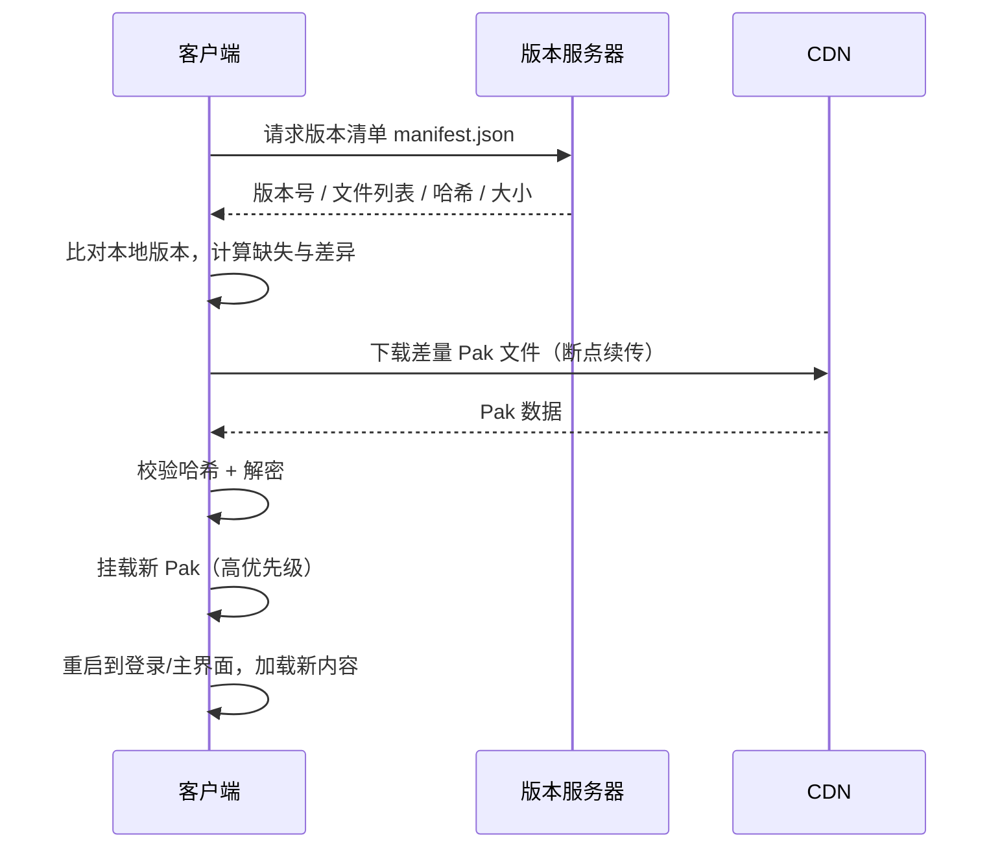
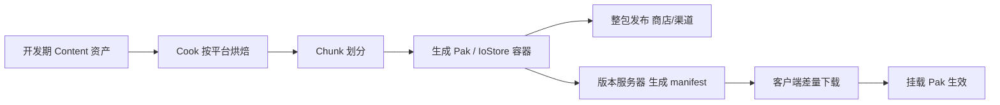

# 04 资源管理与热更新
> 版本基准：UE 5.8.0（本机 `Engine/Build/Build.version`：CL 55116800，分支 `++UE5+Release-5.8`）。
> 兼容性边界：适用于 UE5.8 编辑器/运行时，UE4.27 与早期 UE5 仅作迁移背景，具体模块以正文为准。
> 最后更新：2026-08-06（本轮元数据维护）。

## 一、概述

UE 项目的**内容（Content）**以 `.uasset`（+ `.umap`）形式存放在 `Content/` 目录，最终通过 **Cook + Pak/Chunk** 进入发布包。上线之后，客户端还需要**热更新**能力来持续修复与迭代。本篇围绕三条主线：

1. **资产组织规范**：目录、命名、引用关系——决定项目可维护性与打包质量；
2. **Pak / Chunk 打包**：内容如何被切分、压缩、加密并挂载——决定包体结构与加载性能；
3. **热更新与版本管理**：如何安全地把新内容推给玩家，以及引擎升级/版本迁移时的注意事项。

## 二、核心概念（表格速览）

| 概念 | 说明 | 关键文件 / API |
| --- | --- | --- |
| `.uasset` / `.umap` | 资产与关卡文件（二进制） | `Content/` 目录 |
| Asset Registry | 资产注册表（索引资产与依赖） | `UAssetRegistry` |
| 硬引用 | A 直接持有 B 的 UObject 指针 | `UPROPERTY` 对象属性 |
| 软引用 | 以路径字符串引用，按需加载 | `TSoftObjectPtr` / `FSoftObjectPath` |
| Primary Asset | 资产管理器扫描的根资产 | `UAssetManager` |
| Pak | 内容容器文件（可挂载/加密/压缩） | `UnrealPak` 工具 |
| Chunk | 把内容按更新/平台粒度分组 | Chunk ID + `-manifests` |
| IoStore | UE5 的新容器格式 | `.utoc` + `.ucas` |
| Mount Point | Pak 挂载路径（对应 `/Game/` 等） | `FPakPlatformFile` |
| DDC | 烘焙/派生数据缓存 | 见 02 篇 |
| 热更新 | 运行时下载并加载新内容 | 版本清单 + Pak 下载挂载 |
| 版本管理 | 资产/引擎/自定义版本号 | `FPackageFileVersion`、`FCustomVersion` |
| 迁移 | 资产跨项目/跨引擎转移 | 内容浏览器 Migrate、ResavePackages |

## 三、原理详解

### 3.1 资产组织规范

#### 3.1.1 目录结构约定

```text
Content/
  Maps/                 # 关卡
  Characters/           # 角色
    Hero/               # 每个角色一个子目录
      Meshes/  Textures/  Animations/  Blueprints/  Materials/
  Environments/         # 场景
    Level01/  Level02/
  UI/                   # 界面
    Icons/  Widgets/  Fonts/
  Audio/                # 音频
  Data/                 # 数据资产 DataAsset / DataTable
  FX/                   # 特效（Niagara / Cascade）
  VFX/  Props/  Vehicles/ ...
```

**功能（Feature）优先 vs 类型优先**：中小项目按类型分（上图），大型项目推荐按功能域分（`Features/Battle/`、`Features/Shop/`），与插件化、Chunk 化天然对齐。

#### 3.1.2 命名规范（前缀约定）

| 前缀 | 资产类型 | 前缀 | 资产类型 |
| --- | --- | --- | --- |
| `SM_` | Static Mesh | `SK_` | Skeletal Mesh |
| `M_` | Material | `MI_` | Material Instance |
| `T_` | Texture | `UI_` / `B_` | UI 贴图 / 图标 |
| `BP_` | Blueprint | `W_` / `WB_` | Widget Blueprint |
| `A_` | Anim Sequence | `ABP_` | Anim Blueprint |
| `PS_` | Particle System | `NI_` | Niagara 系统 |
| `S_` | Sound | `DT_` | DataTable |
| `DA_` | DataAsset | `GM_` | GameMode |
| `PC_` / `AC_` | 玩家/角色控制器 | `C_` | Curve |

#### 3.1.3 引用关系管理

- **硬引用**：对象属性直接指向目标，加载本资产会连带加载目标——加载快但容易"牵一发动全身"；
- **软引用**：`TSoftObjectPtr<T>` / `FSoftObjectPath` 只存路径，配合 `FStreamableManager` 异步加载，适合大资源、按需内容；
- **Primary Asset**：在 `AssetManager` 中登记的资源类型（如装备、角色、关卡列表），用于扫描、预加载、Chunk 划分。

```cpp
// 软引用声明
UPROPERTY(EditAnywhere)
TSoftObjectPtr<UStaticMesh> OptionalMesh;

// 异步加载
FStreamableManager& Streamable = UAssetManager::GetStreamableManager();
TSharedPtr<FStreamableHandle> Handle = Streamable.RequestAsyncLoad(
	OptionalMesh.ToSoftObjectPath(),
	FStreamableDelegate::CreateLambda([this]()
	{
		if (UStaticMesh* Mesh = OptionalMesh.LoadSynchronous())
		{
			// 使用资源
		}
	}));
```

### 3.2 Pak / Chunk 打包原理

#### 3.2.1 Pak 文件结构

Pak 是 UE 的内容容器：内部包含资源文件条目（路径 + 偏移 + 大小 + 校验 + 压缩信息），外层有文件头与索引。Pak 通过 **Mount Point** 挂载，把 Pak 内的逻辑路径映射到 `/Game/` 等根目录：

```text
../../../MyGame/Content/  →  /Game/
```

打包时（`-pak`）生成：

```text
MyGame/
  Content/Paks/
    MyGame-Windows.pak        # 内容容器
    MyGame-Windows.utoc       # UE5 IoStore 目录（可选）
    MyGame-Windows.ucas       # UE5 IoStore 容器数据
```

#### 3.2.2 UE5 的 IoStore

UE5 引入 **IoStore 容器**（`.utoc` 目录 + `.ucas` 数据）：

- **随机读取性能大幅提升**（对齐块、预取友好）；
- **打补丁友好**：块级（Block）粒度，差量更新更小；
- **加密更安全**：容器级加密；
- UE5 默认打包流程（`-pak`）会同时产出 IoStore 容器，旧式 Pak 索引仍保留用于兼容。

#### 3.2.3 Chunk：按需切分内容

Chunk 把内容划分为独立可更新的逻辑组，常用于：

- 新手包（首包）：只含主菜单 + 新手关卡；
- 玩法包：按功能/地图分块，进对应玩法时下载；
- 平台包：通用内容 + 平台专属内容分离；
- DLC。

划分方式：

1. **Asset Manager**：在 `DefaultGame.ini` 配置 `PrimaryAssetTypesToScan`，给资源类型分配 Chunk ID；
2. **编辑器手动指定**：选中资产 → 右键 → Asset Actions → **Assign to Chunk**；
3. **打包参数**：`-manifests -createchunkinstall -chunkinstalldirectory=... -chunkinstallversion=...` 生成分块安装包。

### 3.3 热更新方案

#### 3.3.1 热更新的本质

UE 客户端热更新通常指**内容（资源）热更**：C++ 代码无法在运行时热替换（Android 上可以通过修改 APK 里的 .so 做整包更新，iOS 则禁止动态下发代码），因此主流方案是：

```text
服务端版本清单（manifest）→ 客户端比对版本 → 下载差量 Pak → 校验 → 挂载 → 重启/切换
```

#### 3.3.2 常见方案对比

| 方案 | 粒度 | 优点 | 缺点 | 适用 |
| --- | --- | --- | --- | --- |
| 整包更新 | 整个应用 | 简单可靠 | 包大、渠道审核慢 | 少量热更、渠道包 |
| Pak 差量补丁 | 资源块 | 包小、快 | 需要版本管理基建 | 主流手游 |
| Chunk 按需下载 | 玩法/功能组 | 首包极小 | 下载逻辑复杂 | 大型多玩法游戏 |
| 脚本热更（Lua/蓝图） | 逻辑 | 逻辑可热更 | 双栈成本、性能损耗 | 逻辑频繁迭代的项目 |

#### 3.3.3 热更新流程（Mermaid）



#### 3.3.4 挂载 Pak 的代码骨架

```cpp
// 启动早期（引擎初始化前）挂载热更 Pak
#include "IPlatformFilePak.h"

void MountPatchPak(const FString& PakPath)
{
	FPakPlatformFile* PakPlatformFile = new FPakPlatformFile();
	PakPlatformFile->Initialize(&FPlatformFileManager::Get().GetPlatformFile(), TEXT(""));
	FPlatformFileManager::Get().SetPlatformFile(*PakPlatformFile);

	// 挂载到游戏 Content 根；bIsPrimary 表示优先于基础 Pak 的查找顺序
	if (!PakPlatformFile->Mount(PakPath, 0, nullptr))
	{
		// 挂载失败处理（删除坏 Pak、回退）
	}
}
```

> 挂载时机必须在引擎访问 `Content/` 之前；通常放在 `Launch` 模块的 `PreInit` 阶段或自定义 `FEngineLoop` 扩展中。多 Pak 时注意**挂载顺序**：后挂载的 Pak 优先级更高（可覆盖旧资源）。

### 3.4 版本管理与迁移

#### 3.4.1 资产版本号体系

UE 资产内部携带版本信息，用于序列化兼容：

| 版本机制 | 说明 |
| --- | --- |
| `FPackageFileVersion` | 引擎级资产版本（UE5 起替代旧的 `FObjectVersion`，拆分为 UE 版本 + Licensee 版本） |
| `FCustomVersion` | 自定义版本：插件/团队自行注册的版本 GUID，用于自己的数据结构升级 |
| `FArchive` 版本判断 | 序列化时按版本分支读写 |

自定义版本示例：

```cpp
// MyCustomVersion.h
struct FMyCustomVersion
{
	enum Type
	{
		BeforeCustomVersionWasAdded = 0,
		AddedNewField,          // 某个版本新增了字段
		VersionPlusOne,
		LatestVersion = VersionPlusOne - 1
	};
	const static FGuid GUID;
};

// MyCustomVersion.cpp
const FGuid FMyCustomVersion::GUID(0x12345678, 0x9ABCDEF0, 0x12345678, 0x9ABCDEF0);
FCustomVersionRegistration GRegisterMyCustomVersion(
	FMyCustomVersion::GUID, FMyCustomVersion::LatestVersion, TEXT("MyCustomVersion"));

// 序列化中使用
void FMyData::Serialize(FArchive& Ar)
{
	Super::Serialize(Ar);
	if (Ar.CustomVer(FMyCustomVersion::GUID) >= FMyCustomVersion::AddedNewField)
	{
		Ar << NewField;
	}
}
```

#### 3.4.2 引擎升级与资产重存

打开旧版本引擎保存的资产时，UE 会按版本号**自动升级**并重新序列化。升级链注意事项：

- 升级是**单向**的：高版本引擎打开过的资产无法回到低版本引擎（团队需锁定引擎版本）；
- 大规模升级前先备份/分支，用**无头模式批量重存**：

```bat
Engine\Binaries\Win64\UnrealEditor-Cmd.exe "C:\MyGame\MyGame.uproject" ^
    -run=ResavePackages -resaveall -unattended -nop4
```

- 升级后检查 `check()`/日志中的版本警告，配合自动化测试回归；
- 自定义版本号要在升级代码发布前注册，避免线上旧资产读取失败。

#### 3.4.3 资产迁移（Migrate）

跨项目/跨分支复制资产：

- **内容浏览器 Migrate**：右键资产 → Asset Actions → Migrate，自动携带全部依赖（推荐）；
- **手动拷贝**：容易漏依赖，`Content/` 下的引用路径会断，不推荐；
- **数据迁移工具**：UE5 提供 Data Migration 相关能力（配合 Asset Registry 扫描与批量重定向），大规模迁移用 `-run=...` 命令let + 重定向映射表。

#### 3.4.4 版本控制

- 二进制资产必须用 **Perforce**（官方推荐，支持独占检出）或 **Git LFS**；
- `.uasset` 是二进制，合并冲突不可自动解决：约定**一人一资产**、检出即锁定；
- `Config/` 下的 ini 是文本，可正常 diff；
- 提交规范：蓝图/资产提交时附带说明，CI 对 `Content/` 变更触发 Cook 冒烟。

## 四、配置与命令示例

### 4.1 Asset Manager 配置（DefaultGame.ini）

```ini
[/Script/Engine.AssetManagerSettings]
PrimaryAssetTypesToScan=(PrimaryAssetType="MyGameItemDef",AssetBaseClass=/Script/MyGame.MyItemDef,HasBlueprintClasses=False,bIsEditorOnly=False,Directories=((Path="/Game/Data/Items")),SpecificAssets=,Rules=(Priority=-1,ChunkId=2,CookRule=Unknown))
PrimaryAssetTypesToScan=(PrimaryAssetType="MyGameLevel",AssetBaseClass=/Script/Engine.World,HasBlueprintClasses=False,bIsEditorOnly=False,Directories=((Path="/Game/Maps")),SpecificAssets=,Rules=(Priority=-1,ChunkId=3,CookRule=Unknown))
```

### 4.2 分 Chunk 打包命令

```bat
RunUAT.bat BuildCookRun -project="C:\MyGame\MyGame.uproject" ^
    -noP4 -platform=Win64 -clientconfig=Shipping ^
    -build -cook -stage -package -pak ^
    -manifests -createchunkinstall ^
    -chunkinstalldirectory="C:\Output\Chunks" ^
    -chunkinstallversion=1.0.0
```

### 4.3 生成差量补丁（基于旧 Pak）

```bat
rem 方式一：UnrealPak 基于基础 Pak 生成补丁
Engine\Binaries\Win64\UnrealPak.exe "C:\Patch\patch_1.0.1.pak" ^
    -Create="C:\Patch\NewFileList.txt" ^
    -GeneratePatch="C:\Base\MyGame-Windows.pak" ^
    -platform=Win64

rem 方式二：UAT 里直接出补丁（需要先保留上一版 Cook 产物）
RunUAT.bat BuildCookRun -project="C:\MyGame\MyGame.uproject" ^
    -noP4 -platform=Win64 -clientconfig=Shipping ^
    -cook -stage -pak -GeneratePatch ^
    -BasedOnReleaseVersion=1.0.0
```

### 4.4 版本清单示例（manifest.json）

```json
{
	"version": "1.0.1",
	"baseVersion": "1.0.0",
	"platform": "Win64",
	"files": [
		{
			"name": "patch_1.0.1.pak",
			"size": 15230464,
			"md5": "9e107d9d372bb6826bd81d3542a419d6",
			"url": "https://cdn.example.com/MyGame/1.0.1/patch_1.0.1.pak"
		}
	],
	"mustRestart": true
}
```

### 4.5 热更新检查流程伪代码

```cpp
// 1. 拉取清单
FVersionManifest Manifest = DownloadJson(ServerVersionUrl);

// 2. 对比本地版本
if (Manifest.Version == LocalVersion) return; // 已最新

// 3. 下载差量 Pak（断点续传 + 校验）
TArray<FFileEntry> NeedFiles = FilterDiff(Manifest.Files, LocalManifest);
for (const FFileEntry& Entry : NeedFiles)
{
	DownloadFile(Entry.Url, LocalPakPath, Entry.Md5);
}

// 4. 挂载并记录新版本
MountPatchPak(LocalPakPath);
SaveLocalVersion(Manifest.Version);

// 5. 若需要重启，弹出提示并重启到主界面
```

### 4.6 打包与热更的关系（Mermaid）



## 五、最佳实践

1. **立项即定规范**：目录/命名/引用规范写入团队文档并在 Review 中检查，迁移成本随时间指数上升。
2. **引用越少越短越好**：避免"上帝资产"（被全项目引用）；能用软引用就用软引用；数据驱动优先于蓝图直连。
3. **Chunk 划分按用户旅程**：首包 = 登录 + 主城 + 新手关；功能包按"进入该玩法前一刻"预下载。
4. **热更包要小**：差量 + 压缩（Oodle）+ 只更新变化的 Chunk；每次热更前用工具对比增量大小。
5. **校验与回滚**：下载必须校验（MD5/SHA1）；坏 Pak 自动删除并回退到上一版本；服务端保留最近 N 个版本。
6. **加密与安全**：资源加密（AES）防直接解包；敏感数值（掉落、价格）放服务端，不要在客户端下结论。
7. **版本纪律**：引擎版本锁定；`FCustomVersion` 只增不改；升级流程 = 备份 → 无头重存 → 全量回归 → 灰度。
8. **自动化**：CI 中自动切 Chunk、自动生成 manifest、自动统计包体与热更包大小，超阈值报警。
9. **首包瘦身**：音频转码、纹理压缩、剔除 Editor-only 内容、不打包不需要的语言。
10. **监控**：线上统计热更成功率、下载失败率、Pak 挂载失败率，建立告警。

## 六、常见问题 FAQ

**Q1：热更后出现"花屏/白模/缺声音"？**
典型的资源不完整：差量 Pak 遗漏了依赖资源（软引用/动态加载的资源未进 Chunk）。对策：Cook 全量对比、Asset Manager 扫描规则覆盖动态加载路径、热更包内附依赖清单校验。

**Q2：Pak 挂载失败 / 找不到 Pak？**
检查挂载时机（必须在内容访问前）、路径与 Mount Point 是否匹配、Pak 是否损坏（校验）、是否被加密（需要密钥一致）。

**Q3：客户端与服务器资源版本不一致？**
版本协议必须包含资源版本 + 逻辑版本双维度；登录时校验，不一致则拒绝进入或触发补包。

**Q4：iOS 上能不能热更代码？**
不能动态下发可执行代码（App Store 审核要求）。iOS 只能热更资源（Pak）；逻辑热更需用脚本方案（Lua/JS）或整包更新。

**Q5：引擎升级后大量资产报版本错误？**
先升级引擎再批量 `ResavePackages`；确认自定义版本已注册；升级后跑自动化测试 + Cook 全量冒烟。不要边开发边升级。

**Q6：迁移（Migrate）后引用断了？**
Migrate 会带依赖但路径以目标位置为准；迁移后检查重定向（Redirectors），必要时用 `FixupRedirects` 命令let 修复。

**Q7：IoStore 与旧版 Pak 工具不兼容？**
UE5 的 `.utoc/.ucas` 需要 UE5 的打包/挂载链路；跨引擎版本工具链不要混用。低版本引擎项目保持传统 Pak 即可。

**Q8：如何控制热更包大小？**
差量（GeneratePatch / 块级补丁）+ Oodle 压缩 + Chunk 拆分 + 资源瘦身（贴图尺寸、音频码率）；建立每日增量报告。

**Q9：热更失败怎么回滚？**
客户端保留上一版本清单与 Pak；新 Pak 校验失败时回退并提示"稍后再试"；服务端支持按版本灰度与紧急回滚。

**Q10：多人同时改一个蓝图/资产冲突怎么办？**
Perforce 独占检出 + 提交前 review；Git 场景必须上 LFS 并约定"同一资产同一时间仅一人修改"；关键资产（关卡）拆分多子关卡降低冲突面。

## 七、关联阅读

- 本分类 [01-UBT构建系统与编译配置.md](01-UBT构建系统与编译配置.md)：编译宏与模块边界影响资源打包范围
- 本分类 [02-UAT与自动化打包.md](02-UAT与自动化打包.md)：Cook/Stage/Package 与 Pak 生成的具体命令
- 本分类 [03-插件开发与编辑器扩展.md](03-插件开发与编辑器扩展.md)：插件内容如何进入 Pak/Chunk
- 官方文档：Pak 与打包（https://dev.epicgames.com/documentation/en-us/unreal-engine/pak-files-in-unreal-engine）
- 官方文档：Chunk 划分（https://dev.epicgames.com/documentation/en-us/unreal-engine/chunking-in-unreal-engine）
- 官方文档：IoStore（https://dev.epicgames.com/documentation/en-us/unreal-engine/iostore-in-unreal-engine）
- 官方文档：Asset Manager（https://dev.epicgames.com/documentation/en-us/unreal-engine/asset-manager-in-unreal-engine）
- 官方文档：自定义版本（https://dev.epicgames.com/documentation/en-us/unreal-engine/versioning-in-unreal-engine）
