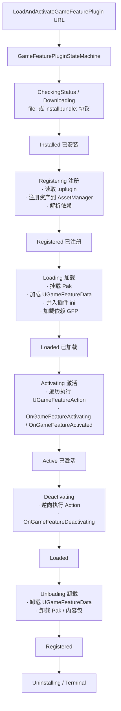
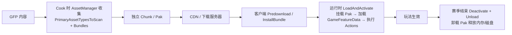

# 05 GameFeatures 特性插件
> 版本基准：UE 5.8.0（本机 `Engine/Build/Build.version`：CL 55116800，分支 `++UE5+Release-5.8`）。
> 兼容性边界：适用于 UE5.8 编辑器/运行时，UE4.27 与早期 UE5 仅作迁移背景，具体模块以正文为准。
> 最后更新：2026-08-06（本轮元数据维护）。

> 本文基于 UE 5.8 源码验证：`Engine/Plugins/Runtime/GameFeatures/Source/GameFeatures/Public/GameFeaturesSubsystem.h`、`GameFeatureAction.h`、`GameFeatureData.h`、`GameFeatureTypes.h`。

## 一、概述

**GameFeatures（游戏特性插件，Game Feature Plugin，简称 GFP）** 是 UE 面向"玩法内容模块化"提供的框架：把一套玩法（例如一个副本、一个赛季玩法、一套新英雄、一张新地图）打包成一个可独立下载、可运行时动态加载/激活/停用/卸载的**插件单元**。

它与普通插件最大的区别在于**生命周期**：

- 普通插件在进程启动时由 `FPluginManager` 静态加载，一旦加载常驻内存，无法在运行中卸载；
- GFP 由 `UGameFeaturesSubsystem`（引擎子系统）在**运行时**按需驱动，每个 GFP 内部有一个**状态机**（GameFeaturePluginStateMachine），可以在"未安装 → 已注册 → 已加载 → 已激活"之间来回切换，配合 Pak/Chunk 与 InstallBundle 下载体系，天然适合 **DLC、赛季内容、F2P 在线运营、A/B 测试** 等场景。

GFP 的核心三件套：

| 组成 | 角色 |
| --- | --- |
| `.uplugin` 插件清单 | 描述模块、依赖、附加元数据，决定插件"长什么样" |
| `UGameFeatureData` 数据资产 | 玩法内容的"说明书"，声明激活时要执行哪些 Action |
| `UGameFeatureAction` 动作 | 激活/停用时真正干活的对象（加组件、注入世界分区内容、注册数据等） |

本文覆盖：

- GFP 目录结构与 `.uplugin` 写法；
- `UGameFeatureData` / `UGameFeatureAction` 的职责与类型；
- `UGameFeaturesSubsystem` 加载流程（加载/激活/停用/卸载）与状态机；
- 与普通插件的对比；
- 热更新玩法模块（DLC / 赛季内容）实践；
- 自定义 Action 与项目策略。

## 二、核心概念（表格速览）

| 概念 | 说明 | 关键文件 / API |
| --- | --- | --- |
| GameFeaturePlugin | 玩法功能的打包单元（特殊插件） | `*.uplugin` + `Content/` + `Source/` |
| GFP 目录约定 | 项目 `Plugins/GameFeatures/` 目录下的插件才会被识别为 GFP | `UGameFeaturesSubsystemSettings::IsValidGameFeaturePlugin()` |
| `.uplugin` | 插件清单（JSON），GFP 与普通插件同构，可带附加元数据 | `GameFeaturesSubsystemSettings::AdditionalPluginMetadataKeys` |
| `UGameFeatureData` | GFP 的核心数据资产（UPrimaryDataAsset），持有 Actions 与资产管理配置 | `GameFeatureData.h` |
| `UGameFeatureAction` | 激活/停用时执行的动作，编辑器内联实例（Instanced） | `GameFeatureAction.h` |
| `UGameFeaturesSubsystem` | 管理所有 GFP 的引擎子系统（UEngineSubsystem） | `GameFeaturesSubsystem.h` |
| 目标状态 | `EGameFeatureTargetState`：Installed / Registered / Loaded / Active | `GameFeatureTypes.h` |
| 状态机 | 每个 GFP 一个状态机，内部状态约 36 个 | `GameFeatureTypes.h` 的 `XSTATE` 列表 |
| Plugin URL | 定位 GFP 的 URL，协议：`file:` / `installbundle:` | `EGameFeaturePluginProtocol` |
| 激活上下文 | 区分客户端/服务器/编辑器等场景 | `FGameFeatureActivatingContext` |
| Bundle | 安装包/加载单元（InstallBundle 集成） | `UGameFeatureData::GetInstallBundleName()` |
| 项目策略 | 项目自定义的 GFP 加载策略（默认 `UDefaultGameFeaturesProjectPolicies`） | `GameFeaturesProjectPolicies.h` |
| 依赖 | GFP 可声明依赖其他 GFP，状态机自动处理依赖顺序 | `FGameFeaturePluginDetails::PluginDependencies` |
| 内置自动状态 | 内置 GFP 可配置自动达到的状态（`EBuiltInAutoState`） | `FBuiltInGameFeaturePluginBehaviorOptions` |

## 三、原理详解

### 3.1 GFP 目录与识别方式

UE 5.8 中，`UGameFeaturesSubsystemSettings::IsValidGameFeaturePlugin()` 通过**路径**判断一个 `.uplugin` 是否是 GFP：

```text
<Project>/Plugins/GameFeatures/<GFPName>/<GFPName>.uplugin
```

同时支持：

- `Plugins/GameFeatures` 的 Restricted（受限）目录变体；
- 项目 `.uproject` 中附加插件目录（`AdditionalPluginDirectories`）下的 `GameFeatures` 子目录。

一个典型 GFP 目录结构：

```text
GameFeature_Season1/
  GameFeature_Season1.uplugin      # 插件清单
  Source/
    GameFeature_Season1/           # Runtime 模块（可选）
      GameFeature_Season1.Build.cs
      Public/
      Private/
    GameFeature_Season1Editor/     # Editor 模块（可选）
  Content/
    Data/GameFeatureData.uasset    # 核心数据资产（可改名，需在插件中引用）
    Maps/                          # 玩法资产
    Blueprints/
    Meshes/ Textures/ Audio/
  Config/
    DefaultGameFeature.ini         # 插件 ini（激活时并入项目配置层级）
  Shaders/                         # 可选自定义着色器
```

> **注意**：放在 `Plugins/GameFeatures` 之外（如普通 `Plugins/` 目录）的插件不会被视为 GFP，也不会被 GameFeatures 体系管理——它仍然是一个普通插件。

### 3.2 `.uplugin` 清单

GFP 的 `.uplugin` 与普通插件字段一致（`FileVersion`、`Modules`、`Plugins` 依赖等），额外能力：

- 可通过 `UGameFeaturesSubsystemSettings::AdditionalPluginMetadataKeys` 声明要从 `.uplugin` 解析哪些附加键，解析结果挂在 `FGameFeaturePluginDetails::AdditionalMetadata`；
- `FGameFeaturePluginDetails` 还包含 `PluginDependencies`（GFP 依赖）、`bHotfixable`（是否可热修复）、`BuiltInAutoState`（内置 GFP 的自动目标状态）。

### 3.3 `UGameFeatureData`：GFP 的"说明书"

`UGameFeatureData` 继承 `UPrimaryDataAsset`（因此天然接入 Asset Manager / 资产包体系），关键属性（UE 5.8 源码）：

| 属性 | 类型 | 作用 |
| --- | --- | --- |
| `Actions` | `TArray<TObjectPtr<UGameFeatureAction>>`（Instanced、EditDefaultsOnly） | 激活/停用时按序执行的动作列表 |
| `PrimaryAssetTypesToScan` | `TArray<FPrimaryAssetTypeInfo>` | 注册到 Asset Manager 扫描的资产类型 |

它还提供一批静态工具：

- `GetPluginName()`：取 GFP 插件名；
- `GetInstallBundleName()` / `GetOptionalInstallBundleName()`：取安装包名（热更新下载用）；
- `InitializeBasePluginIniFile()` / `InitializeHierarchicalPluginIniFiles()`：加载/激活时把插件 `Config/` 下的 ini 并入配置层级（这也是 GFP 能"注入配置"的原理）；
- `IsGameFeaturePluginRegistered()` / `IsGameFeaturePluginActive()`：查询状态；
- 编辑器下还重写了 `IsDataValid()`，GFP 本身也参与 DataValidation 校验（见 06 篇）。

### 3.4 状态机：GFP 的灵魂

每个 GFP 在 `UGameFeaturesSubsystem` 内部对应一个状态机实例。UE 5.8 `GameFeatureTypes.h` 中通过 `XSTATE` 宏定义了完整状态列表（按定义顺序）：

| 分组 | 状态 |
| --- | --- |
| 初始化 | `Uninitialized`、`Terminal` |
| 状态查询 | `UnknownStatus`、`CheckingStatus`、`ErrorCheckingStatus`、`ErrorUnavailable`、`StatusKnown` |
| 安装/下载 | `Uninstalled`、`Uninstalling`、`ErrorUninstalling`、`Downloading`、`ErrorManagingData`、`Releasing`、`Installed` |
| 注册 | `WaitingForDependencies`、`ErrorWaitingForDependencies`、`Registering`、`ErrorRegistering`、`AssetDependencyStreamOut`、`AssetDependencyStreaming`、`ErrorAssetDependencyStreaming`、`Registered` |
| 加载 | `Mounting`、`ErrorMounting`、`Unmounting`、`Unloading`、`ErrorLoading`、`Loading`、`Loaded` |
| 激活 | `ActivatingDependencies`、`ErrorActivatingDependencies`、`Activating`、`ErrorDeactivatingDependencies`、`DeactivatingDependencies`、`Deactivating`、`Active` |

对外暴露的"目标状态"则简化为 4 个（`EGameFeatureTargetState`）：

```cpp
enum class EGameFeatureTargetState
{
    Installed,   // 已安装（内容可下载/已存在）
    Registered,  // 已注册（subsystem 知道它，资产已入 AssetManager）
    Loaded,      // 已加载（Pak 挂载、GameFeatureData 已加载、ini 已并入）
    Active,      // 已激活（所有 Action 已执行，玩法生效）
    Count
};
```

> 用户代码只需要声明"我想让它到哪个目标状态"，状态机自动完成中间过渡；中间状态名（Mounting/Registering/Loading/Activating...）用于日志与调试。

### 3.5 加载 / 激活 / 停用 / 卸载流程



核心 API（UE 5.8 `UGameFeaturesSubsystem`，均为异步、带完成回调）：

| API | 作用 |
| --- | --- |
| `RegisterGameFeaturePlugin(URL)` | 只注册，不加载（到 Registered） |
| `LoadGameFeaturePlugin(URL)` | 注册并加载（到 Loaded） |
| `LoadAndActivateGameFeaturePlugin(URL)` | 一步到位到 Active（内部先注册→加载→激活） |
| `ChangeGameFeatureTargetState(URL, TargetState)` | 指定任意目标状态（最常用） |
| `DeactivateGameFeaturePlugin(URL)` | 停用（回到 Loaded/Registered） |
| `UnloadGameFeaturePlugin(URL, bKeepRegistered)` | 卸载（回到 Registered 或彻底注销） |
| `GetGameFeaturePluginInstallPercent()` | 查询下载/安装进度 |
| `PredownloadGameFeaturePlugins(URLs)` | 预下载（不激活） |
| `GetGameFeatureDataForActivePlugins()` | 查询当前激活的 GFP 数据 |

`UGameFeaturesSubsystem::Get()` 为全局访问入口（`GEngine->GetEngineSubsystem<UGameFeaturesSubsystem>()`）。

### 3.6 GameFeatureAction 类型一览

UE 5.8 引擎自带（`GameFeatures` 插件 Public 目录）与相关插件的 Action：

| Action 类 | 作用 | 关键属性 |
| --- | --- | --- |
| `UGameFeatureAction_AddComponents` | 给指定 Actor 类添加组件（玩法组件注入，替代修改原生 Actor） | `ComponentList`（`FGameFeatureComponentEntry`：`ActorClass` / `ComponentClass` / `bClientComponent` / `bServerComponent` / `AdditionFlags`） |
| `UGameFeatureAction_AddWorldPartitionContent` | 把世界分区（World Partition）内容（DataLayer 等）注入已加载关卡 | 数据图层/内容包引用 |
| `UGameFeatureAction_AddWPContent` | 以内容包（Content Bundle）方式挂接世界分区内容 | ContentBundle 相关 |
| `UGameFeatureAction_AddActorFactory` | 注册 Actor 工厂（编辑器/工具链用） | 工厂类 |
| `UGameFeatureAction_AddCheats` | 注册作弊命令类（`CheatManager` 扩展，测试用） | `CheatManager` 类 |
| `UGameFeatureAction_AddChunkOverride` | 覆盖打包 Chunk 归属（Cook 阶段生效） | Chunk 覆盖配置 |
| `UGameFeatureAction_DataRegistry` | 激活时注册 DataRegistry | 注册表引用 |
| `UGameFeatureAction_DataRegistrySource` | 激活时挂接 DataRegistry 数据源 | 数据源资产 |
| `UGameFeatureAction_AudioActionBase` | 音频相关动作基类 | — |
| `UGameFeatureAction_IrisFilterGameFeatureAction` | Iris 网络复制过滤规则（UE5 网络框架） | 过滤配置 |
| `UGameFeatureAction_ConfigureInstancedActors`（InstancedActors 插件） | 配置 Instanced Actors 内容 | ISM 相关 |
| `UGameFeatureAction_AddAttributeDefaults`（实验插件 AbilitySystemGameFeatureActions） | GAS 属性默认值注入 | Attribute 默认值 |

自定义 Action 继承 `UGameFeatureAction`（`UCLASS(MinimalAPI, DefaultToInstanced, EditInlineNew, Abstract)`），重写：

- `OnGameFeatureRegistering` / `OnGameFeatureUnregistering`（注册阶段）；
- `OnGameFeatureLoading` / `OnGameFeatureUnloading`（加载阶段）；
- `OnGameFeatureActivating` / `OnGameFeatureActivated` / `OnGameFeatureDeactivating` / `OnGameFeatureDeactivated`（激活阶段）。

### 3.7 热更新玩法模块（DLC / 赛季内容）

GFP 与打包/热更新体系的关系：



- 每个 GFP 的内容可以拆进**独立的 Pak/Chunk**，通过 `installbundle:` 协议与引擎的 InstallBundleManager 集成，支持按需下载、后台预下载；
- `UGameFeatureData::GetInstallBundleName()` 返回该 GFP 对应的安装包名；
- 加载时引擎会把 GFP 的 Pak 挂载进 VFS（虚拟文件系统），再把 `UGameFeatureData` 加载进内存；
- 停用/卸载后，Pak 与资产引用可被释放，实现"玩法进出不重启"。

### 3.8 与普通插件对比

| 维度 | 普通插件（Plugin） | GameFeature 插件（GFP） |
| --- | --- | --- |
| 加载时机 | 进程启动时静态加载 | 运行时按需动态加载 |
| 加载方式 | `FPluginManager` | `UGameFeaturesSubsystem` + 状态机 |
| 能否卸载 | 不能（常驻） | 可以（Unload，甚至 Uninstall） |
| 内容形态 | 常驻包内 | 独立 Pak/Chunk，可下载/可删除 |
| 玩法开关 | 需要代码/配置控制 | `UGameFeatureData` + Actions 数据驱动 |
| 依赖管理 | 启动时静态解析 | 运行时按依赖链自动推进状态 |
| 适用场景 | 引擎功能、通用模块 | DLC、赛季内容、可插拔玩法 |
| 位置约定 | `Plugins/` 任意子目录 | 必须位于 `Plugins/GameFeatures/` 下 |
| 配置注入 | 启动时并入 | 激活时动态并入插件 ini |

## 四、配置 / 代码示例

### 4.1 创建 GFP（编辑器流程）

1. 在项目根目录 `Plugins/GameFeatures/` 下新建插件目录（如 `GameFeature_Season1`）；
2. 可在编辑器中通过"New Plugin → Game Feature Plugin"模板生成骨架（含 `GameFeatureData`）；
3. 创建 `UGameFeatureData` 数据资产，命名建议 `Data/GameFeatureData`；
4. 在 `GameFeatureData` 中添加需要的 Actions，并配置每个 Action 的参数；
5. 打包时把 GFP 归入独立 Chunk，配置下载渠道。

### 4.2 `.uplugin` 示例

```json
{
    "FileVersion": 3,
    "Version": 1,
    "VersionName": "1.0.0",
    "FriendlyName": "GameFeature_Season1",
    "Description": "第一赛季玩法内容（DLC）",
    "Category": "GameFeatures",
    "CreatedBy": "MyCompany",
    "CanContainContent": true,
    "Modules": [
        {
            "Name": "GameFeature_Season1",
            "Type": "Runtime",
            "LoadingPhase": "Default"
        }
    ],
    "Plugins": [
        { "Name": "GameFeatures", "Enabled": true }
    ]
}
```

> 附加元数据键（如 `"InstallBundle": "S1"`）需先在 `UGameFeaturesSubsystemSettings::AdditionalPluginMetadataKeys` 中声明，解析结果位于 `FGameFeaturePluginDetails::AdditionalMetadata`。

### 4.3 C++ 加载与激活

```cpp
#include "GameFeaturesSubsystem.h"

void UMyGameSubsystem::StartSeason(const FString& PluginURL)
{
    UGameFeaturesSubsystem& Subsystem = UGameFeaturesSubsystem::Get();

    // 一步到位：注册 → 加载 → 激活（异步，带完成回调）
    Subsystem.LoadAndActivateGameFeaturePlugin(
        PluginURL,
        FGameFeaturePluginLoadComplete::CreateUObject(this, &UMyGameSubsystem::OnSeasonReady)
    );
}

void UMyGameSubsystem::OnSeasonReady(const FString& PluginURL, const FGameFeaturePluginOperationResult& Result)
{
    if (Result.WasSuccessful())
    {
        // 玩法已激活，可以下发进入赛季 UI
    }
    else
    {
        // 处理失败：错误码在 Result.GetErrorCode()
    }
}

void UMyGameSubsystem::EndSeason(const FString& PluginURL)
{
    UGameFeaturesSubsystem::Get().DeactivateGameFeaturePlugin(PluginURL);
    UGameFeaturesSubsystem::Get().UnloadGameFeaturePlugin(PluginURL);
}
```

PluginURL 示例：

```text
file:C:/MyGame/Plugins/GameFeatures/GameFeature_Season1/GameFeature_Season1.uplugin
installbundle:GameFeature_Season1
```

### 4.4 自定义 GameFeatureAction

```cpp
// MyGameFeatureAction_EnableEffect.h
UCLASS(MinimalAPI, DefaultToInstanced, EditInlineNew)
class UMyGameFeatureAction_EnableEffect final : public UGameFeatureAction
{
    GENERATED_BODY()
public:
    UPROPERTY(EditAnywhere, Category = "Effect")
    TSoftObjectPtr<UMyEffectDataAsset> EffectData;

    virtual void OnGameFeatureActivating(
        FGameFeatureActivatingContext& Context) override;
    virtual void OnGameFeatureDeactivating(
        FGameFeatureDeactivatingContext& Context) override;
};

// MyGameFeatureAction_EnableEffect.cpp
void UMyGameFeatureAction_EnableEffect::OnGameFeatureActivating(
    FGameFeatureActivatingContext& Context)
{
    if (UMyEffectManager* Mgr = UMyEffectManager::Get())
    {
        Mgr->RegisterEffect(EffectData.LoadSynchronous());
    }
}

void UMyGameFeatureAction_EnableEffect::OnGameFeatureDeactivating(
    FGameFeatureDeactivatingContext& Context)
{
    if (UMyEffectManager* Mgr = UMyEffectManager::Get())
    {
        Mgr->UnregisterEffect(EffectData.Get());
    }
}
```

> 注意：激活/停用回调可能发生在非游戏线程上下文，访问全局对象时注意线程与时机（用 `FGameFeatureActivatingContext` 区分客户端/服务器/编辑器）。

### 4.5 自定义项目策略（Project Policies）

```cpp
UCLASS()
class UMyGameFeaturesProjectPolicies final : public UGameFeaturesProjectPolicies
{
    GENERATED_BODY()
public:
    virtual void InitGameFeatureManager() override;
    virtual void ShutdownGameFeatureManager() override;
    virtual TArray<FPrimaryAssetTypeInfo> GetPrimaryAssetTypesForPlugin(
        const UGameFeatureData& GameFeatureToRegister) const override;
    virtual bool IsPluginAllowed(const FString& PluginURL) const override;
};
```

在 `DefaultGame.ini` 指定策略类：

```ini
[/Script/GameFeatures.GameFeaturesSubsystemSettings]
GameFeaturesManagerClassName=/Script/MyGame.MyGameFeaturesProjectPolicies
```

### 4.6 监听 GFP 状态广播

`UGameFeaturesSubsystem` 提供多个广播（`OnGameFeatureRegistering`、`OnGameFeatureActivating`、`OnGameFeatureDeactivating` 等），可用于统计、UI 提示、依赖联动。

## 五、最佳实践

1. **目录纪律**：GFP 必须放在 `Plugins/GameFeatures/` 下，一个目录一个玩法，命名 `GameFeature_Xxx`。
2. **数据驱动**：玩法开关全部走 `UGameFeatureData` + Actions，不要散落 `if (bSeason1)` 判断。
3. **小步拆分**：一个 GFP 只装一个内聚玩法（一个副本/一个赛季功能），避免"巨型 GFP"。
4. **Action 幂等**：激活/停用可能因失败重试，Action 的注册/反注册必须幂等、可重入。
5. **依赖显式声明**：GFP 间依赖写在 `.uplugin` 的 `Plugins` 或依赖元数据中，让状态机自动排序，不要手动 sleep 等待。
6. **客户端/服务器分离**：用 `bClientComponent` / `bServerComponent` 或激活上下文区分端侧逻辑，避免两端行为不一致。
7. **下载与激活分离**：先 `PredownloadGameFeaturePlugins` 预热，再在合适时机激活，避免进玩法卡顿。
8. **卸载要彻底**：停用时取消 Action 注册的委托/组件/数据，验证"激活→停用→再激活"无残留。
9. **包体控制**：GFP 内容独立 Chunk，公共资源放主包；用 Asset Manager 扫描范围控制收集粒度。
10. **CI 校验**：GFP 的 `UGameFeatureData` 参与 DataValidation（`IsDataValid`），CI 上跑 DataValidation 命令let 拦截坏 Action 配置。

## 六、常见问题 FAQ

**Q1：我的插件放在 `Plugins/GameFeatures/` 下但状态机不认它？**
检查 `.uplugin` 路径是否符合约定、`.uplugin` JSON 是否合法；确认是通过 `UGameFeaturesSubsystem` API（而非 `FPluginManager`）加载。日志搜 `LogGameFeatures`。

**Q2：`LoadAndActivateGameFeaturePlugin` 一直卡在 Downloading？**
`installbundle:` 协议需要 InstallBundle 服务端/清单配合；本地调试请用 `file:` 协议直接指向 `.uplugin` 路径。

**Q3：激活后玩法资产加载不到？**
确认 `UGameFeatureData` 的 `PrimaryAssetTypesToScan` 覆盖了动态加载的资产类型；Pak 是否已挂载（Loading 阶段完成）；软引用路径是否正确。

**Q4：停用后内存没释放？**
检查是否有外部强引用（全局 TObjectPtr、单例缓存、未取消的委托）；资产引用需要走软引用/Asset Manager 才能被卸载。

**Q5：Action 在服务器/客户端执行不一致？**
用激活上下文区分；AddComponents 用 `bClientComponent` / `bServerComponent` 控制；服务器不要执行纯客户端逻辑。

**Q6：GFP 能改已有 Actor 的组件吗？**
可以：`UGameFeatureAction_AddComponents` 在激活时把组件动态挂到匹配 `ActorClass` 的 Actor 上；但不要依赖 `GetComponentsByClass` 在激活前能查到。

**Q7：GFP 可以包含 C++ 吗？**
可以：`.uplugin` 的 `Modules` 支持 Runtime/Editor 模块；但 C++ 模块随启动加载，**热更只能热更内容（资产/Pak），不能热更 C++ 逻辑**。

**Q8：赛季结束如何回收磁盘？**
`Deactivate` → `Unload` 后调用卸载安装包接口（InstallBundleManager），彻底删除本地 Pak；iOS/主机平台受系统限制需整包管理的另行处理。

**Q9：多个 GFP 有公共依赖怎么处理？**
公共部分做成独立的底层 GFP（或普通插件），上层 GFP 声明依赖；状态机保证依赖先激活、后停用。

**Q10：GFP 与普通插件混用注意什么？**
GFP 不能依赖启动时才注册的普通插件（时序问题）；GFP 之间互相引用资产时，被引用方必须已加载（依赖声明或延迟加载）。

## 七、关联阅读

- 本分类 [01-UBT构建系统与编译配置.md](01-UBT构建系统与编译配置.md)：GFP 内 C++ 模块的 Build.cs 与模块加载
- 本分类 [03-插件开发与编辑器扩展.md](03-插件开发与编辑器扩展.md)：普通插件结构与 `.uplugin` 字段详解（GFP 同构）
- 本分类 [04-资源管理与热更新.md](04-资源管理与热更新.md)：Pak/Chunk 与热更新机制（GFP 依赖的基础设施）
- 本分类 [06-Interchange与DataValidation.md](06-Interchange与DataValidation.md)：`UGameFeatureData::IsDataValid` 与资产质量门禁
- 官方文档：Game Features（https://dev.epicgames.com/documentation/en-us/unreal-engine/game-features-and-modular-gameplay-in-unreal-engine）
- 官方文档：Modular Gameplay（https://dev.epicgames.com/documentation/en-us/unreal-engine/modular-gameplay-in-unreal-engine）
- 官方示例：Lyra 中的 GameFeatures 用法（https://dev.epicgames.com/documentation/en-us/unreal-engine/lyra-sample-game-in-unreal-engine）
