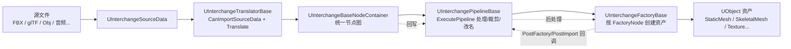
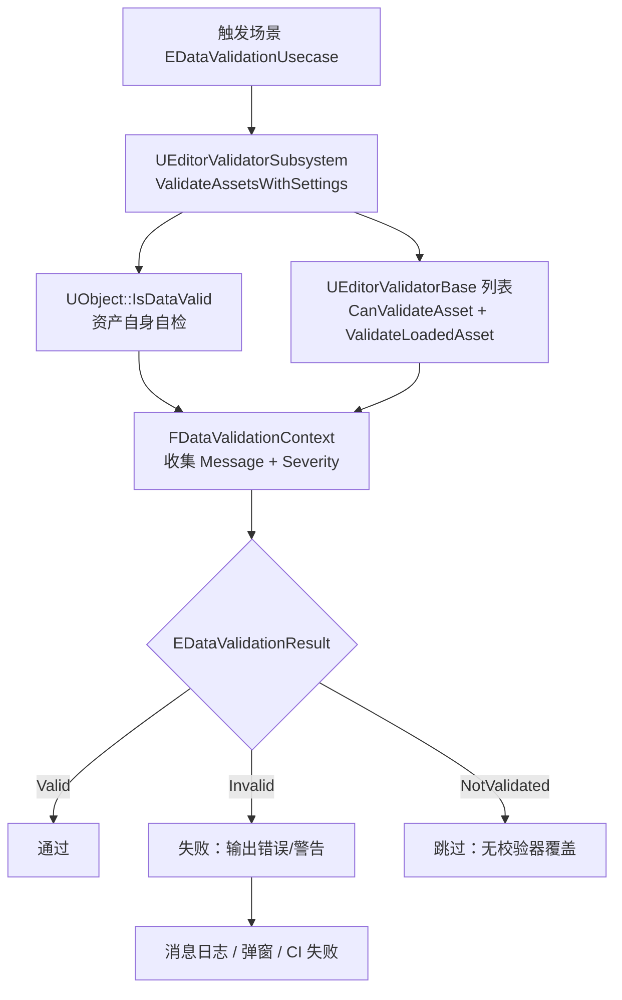

# 06 Interchange 与 DataValidation

> 本文基于 UE 5.8 源码验证：`Engine/Source/Runtime/Interchange/Core/Public/InterchangeSourceData.h`、`InterchangePipelineBase.h`、`InterchangeTranslatorBase.h`、`InterchangeFactoryBase.h`、`Engine/Source/Runtime/Interchange/Engine/Public/InterchangeManager.h`，以及 `Engine/Plugins/Editor/DataValidation/Source/DataValidation/Public/DataValidationModule.h` 等。

## 一、概述

**Interchange** 是 UE5 引入的新一代**资产导入框架**：以"源数据 → 翻译器（Translator）→ 节点图（Node Container）→ 管线（Pipeline）→ 工厂（Factory）→ 资产"的统一流水线取代旧的各格式专用导入器（FBX、静态网格、动画等）。它的核心价值：

- **统一抽象**：所有格式走同一套节点图与管线体系，新增格式只需写 Translator + Factory；
- **可编程**：管线（Pipeline）支持 C++、蓝图、Python 三种形态，导入流程可定制、可复用、可版本化；
- **异步化**：翻译、管线处理、工厂创建均可在后台线程执行，大资源导入不阻塞编辑器；
- **可重入**：重导入（Reimport）与首次导入走同一条管线，行为一致。

**DataValidation** 是 UE 的**资产质量校验体系**：任何 `UObject`（资产）都可以实现 `IsDataValid()` 自检，编辑器保存时、提交前、CI 命令let 中统一执行校验，把"资产坏了上线才发现"提前到"改完就能知道"。Interchange 导入的资产同样纳入该体系。

本文覆盖：

- Interchange 管线架构（SourceData → Translator → Factory、Pipeline 各阶段）；
- 自定义导入扩展（自定义 Translator / Pipeline / Factory）；
- 取代旧 FBX / 静态网格导入器的迁移要点；
- DataValidation（`IsDataValid`、`ValidateAssets`、编辑器与 CI 资产质量门禁）。

## 二、核心概念（表格速览）

| 概念 | 说明 | 关键文件 / API |
| --- | --- | --- |
| `UInterchangeSourceData` | 源数据封装（文件路径、内容哈希），导入的输入 | `InterchangeSourceData.h`（`GetFilename()` / `SetFilename()` / `GetFileContentHash()`） |
| Translator 翻译器 | 把源数据翻译成统一节点图 | `UInterchangeTranslatorBase`（`CanImportSourceData()` / `Translate()`） |
| `UInterchangeBaseNodeContainer` | 节点图容器，导入过程的"中间语言" | Interchange Core `Nodes/` |
| Factory 工厂 | 把节点图节点转成真实 UObject 资产 | `UInterchangeFactoryBase`（`ImportAssetObject_GameThread` / `ImportAssetObject_Async`） |
| Pipeline 管线 | 翻译后、建资产前后的可编程处理环节 | `UInterchangePipelineBase` |
| `UInterchangeManager` | 导入总入口（调度 Translator/Pipeline/Factory） | `InterchangeManager.h`（`ImportAsset()` / `ReimportAsset()`） |
| `FImportAssetParameters` | 一次导入的上下文（重导入对象、覆盖管线、回调） | `InterchangeManager.h` |
| `EInterchangePipelineContext` | 管线运行场景（AssetImport / SceneImport / Reimport 等） | `InterchangePipelineBase.h` |
| 旧导入器 | FBX / 静态网格等旧导入路径（已被 Interchange 取代） | 迁移到 Interchange 默认管线 |
| `IsDataValid` | 对象自检入口（虚拟函数，返回三态结果） | `UObject`（`Object.h`），`FDataValidationContext` |
| `EDataValidationResult` | 校验结果：Invalid / Valid / NotValidated | `UObjectGlobals.h` |
| `EDataValidationUsecase` | 校验触发场景：Manual / Commandlet / Save / PreSubmit / Script | `Misc/DataValidation.h` |
| `UEditorValidatorSubsystem` | 编辑器校验调度器（聚合所有 Validator） | `EditorValidatorSubsystem.h` |
| `UEditorValidatorBase` | 自定义校验器基类（可蓝图化） | `EditorValidatorBase.h` |
| `IDataValidationModule` | DataValidation 模块接口 | `DataValidationModule.h`（`ValidateAssets()`） |
| `UDataValidationCommandlet` | 命令行/CI 批量校验 | `DataValidationCommandlet.h` |
| `UDataValidationSettings` | 校验开关（如保存时校验） | `DataValidationSettings.h` |

## 三、原理详解

### 3.1 Interchange 整体管线



一次导入的完整调用链（UE 5.8 实现要点）：

1. **入口**：编辑器导入对话框或 `UInterchangeManager::ImportAsset(ContentPath, SourceData, Params)`；
2. **选翻译器**：遍历已注册的 `UInterchangeTranslatorBase` 子类，调用 `CanImportSourceData()` 找到能处理该格式的翻译器；
3. **翻译**：`Translate(BaseNodeContainer)` 把源文件解析成**平台无关的节点图**（网格、材质、动画轨道、变换层级等都以节点表达，不直接产生 UE 资产）；
4. **管线处理**：按项目配置的 Pipeline 栈依次执行（先翻译后处理 `PostTranslator`，再生成工厂节点）；
5. **工厂创建**：`UInterchangeFactoryBase` 读取工厂节点（Factory Node），调用 `ImportAssetObject_GameThread` / `ImportAssetObject_Async` 创建真实资产；
6. **后处理**：`PostFactory`（资产创建后、PostEditChange 前）、`PostImport`（PostEditChange 后）、`PostBroadcast`（广播后）多级回调，供管线做跨资产联动；
7. **结果**：导入的对象列表返回调用方，编辑器刷新内容浏览器。

### 3.2 管线（Pipeline）执行阶段

`UInterchangePipelineBase`（`UCLASS(... BlueprintType, editinlinenew)`，可被 C++ / 蓝图 / Python 继承）在 UE 5.8 中的执行阶段：

| 阶段 | 回调 | 时机 | 典型用途 |
| --- | --- | --- | --- |
| 翻译后 | `ExecutePipeline`（蓝图侧 `ScriptedExecutePipeline`） | 翻译完成、建资产之前 | 清理节点、合并网格、设置 LOD 分组、改导入名 |
| 工厂后 | `ExecutePostFactoryPipeline` | 工厂创建资产后、`PostEditChange` 前 | 设置资产属性、改默认参数 |
| 导入后 | `ExecutePostImportPipeline` | `PostEditChange` 之后 | 需要完整构建数据后才能做的事（如物理资产依赖网格渲染数据） |
| 广播后 | `ExecutePostBroadcastPipeline` | 导入广播完成之后 | 卸载/清理、关卡引用后处理 |
| 导出 | `ExecuteExportPipeline` | 导出流程 | 导出前处理 |

任务类型枚举 `EInterchangePipelineTask`：`PostTranslator` / `PostFactory` / `PostImport` / `Export`。

`CanExecuteOnAnyThread(PipelineTask)` 决定该阶段是否可在后台线程执行（返回 false 则回主线程），自定义管线要注意线程安全与 `PostEditChange` 等主线程约束。

`AdjustSettingsForContext(FInterchangePipelineContextParams)` 让管线能根据上下文（`EInterchangePipelineContext`：AssetImport / AssetReimport / SceneImport / SceneReimport / 自定义 LOD / 蒙皮替代 / MorphTarget 等）自动调整参数。

### 3.3 与旧 FBX / 静态网格导入器对比

| 维度 | 旧导入（FBX 导入器 / 静态网格导入器） | Interchange |
| --- | --- | --- |
| 架构 | 每种格式一套独立导入代码，逻辑重复 | 统一节点图 + 可插拔 Translator/Factory |
| 定制 | 只能改参数或在导入后处理 | Pipeline 在导入流程**中间**介入（C++/蓝图/Python） |
| 重导入 | 各格式实现各异 | 统一 `ReimportAsset` 走同一管线 |
| 异步 | 主线程为主 | 翻译/管线/工厂可后台并行 |
| 新格式 | 需要整套新导入器 | 只需 Translator + Factory |
| LOD / 蒙皮 / MorphTarget | 散落在各导入器选项 | 统一的工厂节点属性与管线阶段 |
| 版本化 | 参数难追踪 | Pipeline 资产可版本化、可复用 |

> 迁移提示：UE 5.1+ 起编辑器默认导入走 Interchange；旧导入器仍保留（兼容旧资产与旧管线），新项目与存量项目都建议逐步切到 Interchange，并把团队自定义导入逻辑迁移为自定义 Pipeline。

### 3.4 DataValidation 架构



触发场景（`EDataValidationUsecase`）：

| Usecase | 触发时机 |
| --- | --- |
| `Manual` | 用户手动运行（内容浏览器右键 Validate Assets） |
| `Commandlet` | `DataValidationCommandlet`（CI/批处理） |
| `Save` | 保存资产包时（`bValidateOnSave` 开关） |
| `PreSubmit` | 版本控制提交对话框前 |
| `Script` | 蓝图或 C++ 主动调用 |

### 3.5 三态结果与消息上下文

`EDataValidationResult`（UE 5.8 `UObjectGlobals.h`）：

| 值 | 含义 |
| --- | --- |
| `Invalid` | 校验失败（有 Error 级问题），必须拦截 |
| `Valid` | 校验通过 |
| `NotValidated` | 未校验（该资产没有实现校验逻辑，不算失败） |

`FDataValidationContext` 承载校验过程中的消息（`FIssue`：文本 + `EMessageSeverity`）与关联对象，校验器通过 `Context.AddError()` / `AddWarning()` 等接口上报。

### 3.6 编辑器与 CI 门禁

- **编辑器**：`IDataValidationModule::ValidateAssets(TArray<FAssetData>, bValidateDependencies, EDataValidationUsecase)` 校验选中资产并弹窗报告；`UEditorValidatorSubsystem::ValidateAssetsWithSettings(FValidateAssetsSettings, FValidateAssetsResults)` 是底层批量入口，可收集每个资产的明细；
- **CI**：`UnrealEditor-Cmd <Project> -run=DataValidation [-unattended] [-nullrhi]` 跑全量/增量校验，非零结果即 CI 失败；
- **保存钩子**：`DataValidationSettings.bValidateOnSave`（默认开）让保存动作触发校验，问题资产直接弹错。

## 四、配置 / 代码示例

### 4.1 自定义 Pipeline（C++）

```cpp
// MyInterchangePipeline.h
UCLASS(BlueprintType, editinlinenew)
class UMyInterchangePipeline final : public UInterchangePipelineBase
{
    GENERATED_BODY()
public:
    UPROPERTY(EditAnywhere, Category = "MyPipeline")
    bool bMergeMeshes = true;

    virtual void ExecutePipeline(
        UInterchangeBaseNodeContainer* BaseNodeContainer,
        const TArray<UInterchangeSourceData*>& SourceDatas,
        const FString& ContentBasePath) override;

    virtual void ExecutePostImportPipeline(
        const UInterchangeBaseNodeContainer* BaseNodeContainer,
        const FString& FactoryNodeKey,
        UObject* CreatedAsset,
        bool bIsAReimport) override;
};

// MyInterchangePipeline.cpp
void UMyInterchangePipeline::ExecutePipeline(
    UInterchangeBaseNodeContainer* BaseNodeContainer,
    const TArray<UInterchangeSourceData*>& SourceDatas,
    const FString& ContentBasePath)
{
    // 遍历节点图，删除不需要的节点、合并网格、统一命名
    BaseNodeContainer->IterateNodes(
        [this](const FString& NodeUID, UInterchangeBaseNode* Node)
        {
            if (UInterchangeMeshNode* MeshNode = Cast<UInterchangeMeshNode>(Node))
            {
                // 按规则清理/改名
            }
            return true;
        });
}

void UMyInterchangePipeline::ExecutePostImportPipeline(
    const UInterchangeBaseNodeContainer* BaseNodeContainer,
    const FString& FactoryNodeKey,
    UObject* CreatedAsset,
    bool bIsAReimport)
{
    if (UStaticMesh* Mesh = Cast<UStaticMesh>(CreatedAsset))
    {
        // 设置导入后默认属性（如碰撞、LOD 设置）
    }
}
```

### 4.2 自定义 Translator

```cpp
UCLASS()
class UMyInterchangeTranslator final : public UInterchangeTranslatorBase
{
    GENERATED_BODY()
public:
    virtual bool CanImportSourceData(
        const UInterchangeSourceData* InSourceData) const override
    {
        const FString Ext = FPaths::GetExtension(InSourceData->GetFilename());
        return Ext == TEXT("myfmt");
    }

    virtual bool Translate(
        UInterchangeBaseNodeContainer& BaseNodeContainer) const override
    {
        // 解析 myfmt 文件，向 BaseNodeContainer 添加节点
        // （网格节点 / 变换节点 / 材质节点等）
        return true;
    }
};
```

### 4.3 自定义 Factory（创建资产）

```cpp
UCLASS()
class UMyInterchangeFactory final : public UInterchangeFactoryBase
{
    GENERATED_BODY()
public:
    virtual UObject* ImportAssetObject_GameThread(
        const FImportAssetObjectParams& Arguments) override
    {
        // 从 Arguments.SourceNode 读取数据，NewObject 创建资产
        // 设置属性、保存包，返回资产指针
    }
};
```

### 4.4 代码调用导入

```cpp
#include "InterchangeManager.h"

void UMyTool::ImportWithInterchange(const FString& SourceFile, const FString& DestPath)
{
    UInterchangeSourceData* SourceData = NewObject<UInterchangeSourceData>();
    SourceData->SetFilename(SourceFile);

    FImportAssetParameters Params;
    Params.bIsAutomated = true; // 不弹对话框

    TArray<UObject*> OutObjects;
    UInterchangeManager::GetInterchangeManager().ImportAsset(
        DestPath, SourceData, Params, OutObjects);
}
```

### 4.5 资产自检：重写 `IsDataValid`

UE 5.8 中 `UObject` 提供虚函数入口（`CoreUObject` 的 `Object.h`）：

```cpp
// 头文件
UCLASS()
class UMyDataAsset : public UPrimaryDataAsset
{
    GENERATED_BODY()
public:
    UPROPERTY(EditAnywhere)
    int32 Level = 1;

    UPROPERTY(EditAnywhere)
    TSoftObjectPtr<UStaticMesh> Mesh;

    virtual EDataValidationResult IsDataValid(
        FDataValidationContext& Context) const override;
};

// 实现
EDataValidationResult UMyDataAsset::IsDataValid(
    FDataValidationContext& Context) const
{
    EDataValidationResult Result = Super::IsDataValid(Context);

    if (Level <= 0)
    {
        Context.AddError(FText::FromString(TEXT("Level 必须大于 0")));
        Result = EDataValidationResult::Invalid;
    }
    if (Mesh.IsNull())
    {
        Context.AddWarning(FText::FromString(TEXT("未指定网格")));
        // 警告不置 Invalid
    }
    return Result;
}
```

### 4.6 自定义校验器（Validator）

```cpp
// MyAssetValidator.h
UCLASS()
class UMyAssetValidator final : public UEditorValidatorBase
{
    GENERATED_BODY()
public:
    virtual bool CanValidateAsset_Implementation(
        const FAssetData& InAssetData,
        UObject* InObject,
        FDataValidationContext& InContext) const override
    {
        return InObject && InObject->IsA<UMyDataAsset>();
    }

    virtual EDataValidationResult ValidateLoadedAsset_Implementation(
        const FAssetData& InAssetData,
        UObject* InObject,
        FDataValidationContext& InContext) override;
};

// MyAssetValidator.cpp
EDataValidationResult UMyAssetValidator::ValidateLoadedAsset_Implementation(
    const FAssetData& InAssetData,
    UObject* InObject,
    FDataValidationContext& InContext)
{
    const UMyDataAsset* Data = CastChecked<UMyDataAsset>(InObject);
    if (Data->Mesh.IsNull())
    {
        InContext.AddError(FText::FromString(TEXT("数据资产缺少 Mesh")));
        return EDataValidationResult::Invalid;
    }
    return EDataValidationResult::Valid;
}
```

### 4.7 CI 命令行校验

```bat
UnrealEditor-Cmd.exe MyGame.uproject -run=DataValidation ^
  -unattended -nop4 -nullrhi -NoLogTimes -unversioned
```

在 CI 中把退出码作为门禁：出现 `Invalid` 即失败，同时输出消息日志（`LogDataValidation`），配合 `-TestExit` 让命令let 完成后自动退出进程。

### 4.8 配置：保存时校验

```ini
[/Script/DataValidation.DataValidationSettings]
bValidateOnSave=true
```

## 五、最佳实践

1. **新格式优先 Translator + Factory**：不要复制旧导入器代码，按 Interchange 三段式实现，自动获得重导入与异步能力。
2. **Pipeline 只做"流程"，Factory 只做"创建"**：职责分离，管线里不要直接 NewObject 资产。
3. **管线可复用**：把团队导入规范（命名、合并、LOD、碰撞）做成默认 Pipeline 资产，随项目版本管理。
4. **善用 PostImport**：需要完整构建数据（物理、渲染）的联动逻辑放 `ExecutePostImportPipeline`，不要提前执行。
5. **异步注意线程**：`CanExecuteOnAnyThread` 返回 true 时不要在管线里碰 GameThread 专属对象；UI 操作回主线程。
6. **IsDataValid 幂等轻量**：自检逻辑要快、可重复执行，重活放 Validator 或命令let。
7. **三态语义别滥用**：`NotValidated` 不等于通过；CI 门禁默认按 `Invalid` 拦截，如需强制覆盖要显式配置。
8. **分场景校验**：用 `EDataValidationUsecase` 区分"保存时快速检查"与"提交前深度检查"，避免保存卡顿。
9. **CI 全量 + 增量结合**：每天全量 DataValidation，PR/提交时增量校验改动资产，兼顾覆盖率与速度。
10. **校验消息可操作**：`AddError` 消息写清"哪个资产、什么问题、怎么修"，配合消息日志链接定位。

## 六、常见问题 FAQ

**Q1：Interchange 导入后资产和旧导入器结果不一样？**
默认参数与旧导入器存在差异（如坐标系、单位、命名规则、材质生成方式）。逐项对比默认管线参数，必要时用自定义 Pipeline 复刻旧行为。

**Q2：自定义 Pipeline 在导入对话框里不出现？**
确认类用 `UInterchangePipelineBase` 派生、UCLASS 标记 `editinlinenew`；蓝图管线需是 `Interchange Blueprint Pipeline` 类型资产；检查项目默认管线栈配置。

**Q3：导入大文件卡编辑器？**
检查管线是否在 `CanExecuteOnAnyThread` 返回 false 的环节做了重活；确认用的是 Interchange 异步导入路径而非旧导入器。

**Q4：重导入后我的自定义设置丢了？**
重导入会重建资产，自定义属性应写入 Pipeline（PostFactory 阶段设置），并处理 `bIsAReimport` 分支保留已有数据。

**Q5：`IsDataValid` 没被调用？**
确认触发场景正确（如 `bValidateOnSave` 是否开启、命令let 是否传入资产过滤器）；自定义 Validator 确认 `CanValidateAsset` 返回 true。

**Q6：校验失败但 CI 返回成功？**
检查命令let 退出码处理与 `-unattended` 参数；确认没有把 `NotValidated` 当成功、以及消息日志级别是否被吞掉。

**Q7：保存资产很慢？**
`bValidateOnSave` 开启后每次保存全量校验。为重型资产做分场景裁剪（Save 场景只做轻量检查），或关闭保存校验改提交前校验。

**Q8：蓝图资产怎么参与校验？**
实现 `IsDataValid`（蓝图可重写）或在 Validator 中按类型处理；`UEditorValidatorBase` 本身 `Blueprintable`，也可直接写蓝图校验器。

**Q9：Interchange 支持哪些格式？**
引擎自带 FBX、glTF、Obj、音频、材质（MaterialX）等 Translator；自定义格式通过自定义 Translator 扩展，`CanImportSourceData` 决定格式匹配。

**Q10：旧项目要不要迁移到 Interchange？**
建议迁移：Interchange 是 UE5 默认与长期方向，旧导入器停止演进。迁移时保留旧导入器做灰度对比，用自动化导入测试（Import + DataValidation）保证结果一致。

## 七、关联阅读

- 本分类 [03-插件开发与编辑器扩展.md](03-插件开发与编辑器扩展.md)：把自定义 Interchange 管线/工具做成编辑器插件
- 本分类 [05-GameFeatures特性插件.md](05-GameFeatures特性插件.md)：`UGameFeatureData::IsDataValid` 与 GFP 资产校验
- 本分类 [02-UAT与自动化打包.md](02-UAT与自动化打包.md)：CI 中组合 DataValidation 命令let 与打包流水线
- 官方文档：Interchange（https://dev.epicgames.com/documentation/en-us/unreal-engine/interchange-framework-in-unreal-engine）
- 官方文档：Data Validation（https://dev.epicgames.com/documentation/en-us/unreal-engine/data-validation-in-unreal-engine）
- 官方文档：资产导入（https://dev.epicgames.com/documentation/en-us/unreal-engine/importing-assets-in-unreal-engine）
