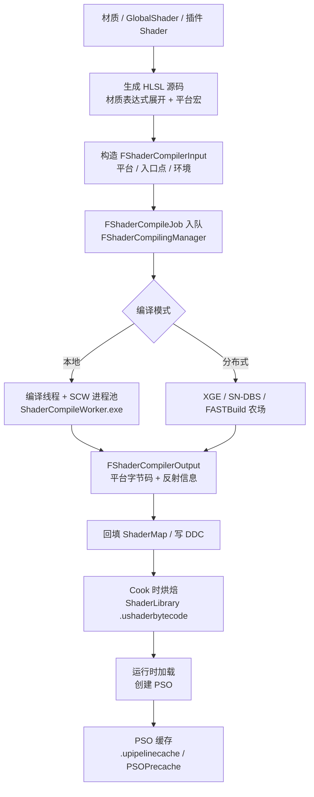
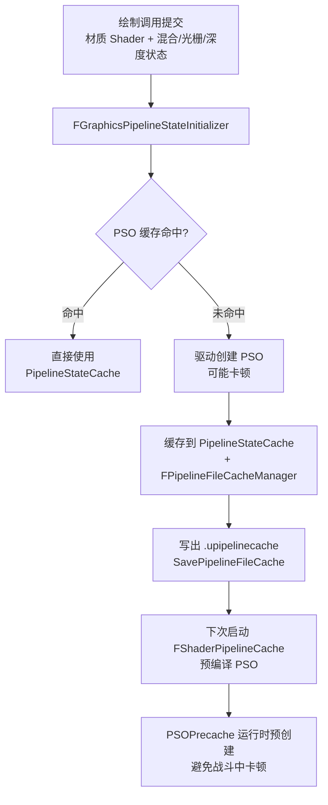

# 07 Shader 编译管线与 PSO

> 本文基于 UE 5.8 源码验证：`Engine/Source/Runtime/RenderCore/Public/ShaderCompilerCore.h`、`ShaderCore.h`、`ShaderCompilerJobTypes.h`、`ShaderPipelineCache.h`，`Engine/Source/Runtime/Engine/Private/ShaderCompiler/`（UE 5.8 起主编译逻辑位于 Engine 模块：`ShaderCompiler.cpp`、`ShaderCompilerThreadRunnable.cpp`、`ShaderCompilerDistributed.cpp`、`ShaderCompilerJobCache.cpp` 等），以及 `Engine/Source/Runtime/RHI/Public/PipelineFileCache.h`。

## 一、概述

UE 的**着色器（Shader）编译管线**负责把材质（Material）与全局 Shader 源码，编译成各渲染平台（D3D12 / Vulkan / Metal / OpenGL...）可用的**平台字节码**，并解决"编译慢、加载卡、首次运行卡顿"三大工程问题。

它的关键组成：

- **编译基础设施**：`RenderCore` 的 `ShaderCompilerCore` 定义编译任务（`FShaderCompilerInput` / `FShaderCompileJob` / `FShaderCompilerOutput`），`FShaderCompilingManager` 调度；
- **SCW（ShaderCompileWorker）**：独立编译工作进程，与编辑器/游戏进程隔离，支持多进程并行与崩溃隔离（`Engine/Binaries/Win64/ShaderCompileWorker.exe`）；
- **材质编译**：`FMaterial::BeginCompileShaderMap` 把材质表达式展开成 HLSL，按平台与特性生成 ShaderMap；
- **缓存**：DDC（派生数据缓存）缓存编译结果，避免重复编译；
- **PSO（Pipeline State Object）**：GPU 绘制管线的完整描述（着色器 + 混合/光栅/深度状态），其创建与预缓存直接决定运行时的卡顿与否。

本文覆盖：

- 编译基础设施与任务流转（RenderCore / SCW / 分布式编译）；
- 材质编译与 ShaderLibrary；
- DDC 缓存与打包时着色器处理；
- PSO 生命周期、PSO 缓存与预缓存（`r.ShaderPipelineCache` / PSOPrecache）；
- 编译性能优化实践。

## 二、核心概念（表格速览）

| 概念 | 说明 | 关键文件 / API |
| --- | --- | --- |
| `FShader` | 单个着色器（平台字节码 + 参数元数据） | `RenderCore/Public/Shader.h` |
| ShaderMap | 一组关联 Shader 的集合（材质视角的编译单元） | `ShaderMap.cpp`（RenderCore） |
| `FShaderCompilerInput` | 单个编译任务的输入（平台、入口点、源码、环境） | `ShaderCompilerCore.h` |
| `FShaderCompilerEnvironment` | 编译环境（include 虚拟路径内容、宏定义、UniformBuffer 表） | `ShaderCore.h` |
| `FShaderCompileJob` | 编译任务单元（继承 `FShaderCommonCompileJob`） | `ShaderCompilerJobTypes.h` |
| `FShaderCompilingManager` | 编译调度器（全局 `GShaderCompilingManager`） | `Engine/Private/ShaderCompiler/ShaderCompiler.cpp` |
| SCW | ShaderCompileWorker 独立编译进程 | `Engine/Binaries/Win64/ShaderCompileWorker.exe` |
| 分布式编译 | 把编译任务分发到构建农场（XGE / SN-DBS / FASTBuild） | `ShaderCompilerDistributed.cpp`，`r.ShaderCompiler.AllowDistributedCompilation` |
| DDC | 派生数据缓存，缓存编译产物 | `r.ShaderCompiler.DumpDDCKeys`，`UE_SHADER_CACHE_VERSION` |
| 材质编译 | 材质表达式 → HLSL → 平台字节码 | `FMaterial::BeginCompileShaderMap`（`MaterialShared.h`） |
| ShaderLibrary | 烘焙后的着色器库（`.ushaderbytecode`） | Cook 产物 |
| PSO | Pipeline State Object（渲染管线完整状态） | `FGraphicsPipelineStateInitializer`（RHI） |
| `FShaderPipelineCache` | 渲染线程驱动的 PSO 预编译器 | `ShaderPipelineCache.h`，`r.ShaderPipelineCache.Enabled` |
| `FPipelineFileCacheManager` | PSO 磁盘缓存管理（`.upipelinecache`） | `RHI/Public/PipelineFileCache.h` |
| PSOPrecache | 运行时主动预创建 PSO（5.0+，默认开启） | `r.PSOPrecache.*` |

## 三、原理详解

### 3.1 编译管线总览



### 3.2 编译任务的数据结构

UE 5.8 中一次编译的核心数据结构（`ShaderCompilerCore.h` / `ShaderCore.h`）：

`FShaderCompilerInput`（编译输入，`Hash` 为 Blake3 哈希，用作任务缓存键）：

| 字段 | 含义 |
| --- | --- |
| `Target` | `FShaderTarget`（频率：VS/PS/GS/HS/DS/CS + 平台） |
| `ShaderFormat` / `ShaderPlatformName` | 平台格式（如 `SF_SM6`、`PCD3D_SM6`） |
| `VirtualSourceFilePath` / `EntryPointName` / `ShaderName` | 虚拟路径、入口函数名、Shader 名 |
| `DumpDebugInfoRootPath` / `DumpDebugInfoPath` | `r.DumpShaderDebugInfo` 开启时的调试输出路径 |
| `DebugGroupName` | 调试分组名（材质名或 "Global"） |
| `Hash` | 输入哈希（Blake3），任务缓存/去重键 |
| `Environment` / `SharedEnvironment` | 编译环境与共享环境 |
| `ExtraSettings` | 额外编译设置（`FMaterial::SetupExtraCompilationSettings` 填充） |

`FShaderCompilerEnvironment`（编译环境，`ShaderCore.h`）：

- `IncludeVirtualPathToContentsMap`：虚拟 include 路径 → 文件内容映射（USF 通过 `#include "<虚拟路径>"` 引用）；
- `CompilerFlags`（`FShaderCompilerFlags`）：编译标志位；
- `UniformBufferMap` / `ResourceTableMap`：UniformBuffer 与资源表布局；
- `SetDefine()` / `SET_SHADER_DEFINE`：注入宏定义（同一材质不同宏 = 不同变体）。

`FShaderCompilerOutput`（编译输出）：平台字节码、反射参数、错误/警告（`FShaderCompilerError`）、`ValidateInputHash` 等。

### 3.3 SCW 与编译调度

`FShaderCompilingManager`（全局 `GShaderCompilingManager`）负责：

1. 把 `FShaderCompileJob` 按平台/批次打包；
2. 派发给本地编译线程（`FShaderCompileThreadRunnable`）或 **SCW 进程池**；
3. 收集 `FShaderCompilerOutput`，回填 ShaderMap；
4. 处理编译错误（`r.AreShaderErrorsFatal` 决定错误是否致命）。

SCW 的要点（`ShaderCompiler.cpp`）：

- 独立 exe（Windows 下 `ShaderCompileWorker.exe` / `ShaderCompileWorkerarm64.exe`），通过命令行 + 管道与主进程通信，协议带版本号（`ShaderCompileWorkerInputVersion = 33`、`ShaderCompileWorkerOutputVersion = 31`）；
- 崩溃隔离：SCW 崩溃不会拖垮编辑器，任务可重新分发；`r.ShaderCompiler.DebugDumpWorkerCrashLog` 可把崩溃日志 dump 到 Saved 目录；
- 内存管理：`ShaderCompilerMemoryLimit` 控制编译进程内存，防止并行编译吃爆内存；
- 慢任务观测：`r.ShaderCompiler.LogSlowJobThreshold` 记录超时编译任务，`r.ShaderCompiler.ShadermapCompilationTimeout` / `CrashOnHungShaderMaps` 处理挂死。

### 3.4 分布式编译

`ShaderCompilerDistributed.cpp` 实现把编译任务分发到构建农场：

- 开关：`r.ShaderCompiler.AllowDistributedCompilation`；
- 后端：XGE（IncrediBuild）、SN-DBS（Sony）、FASTBuild（含 `Distributed-shaders-compilation-FASTBuild.tps` 描述文件）；
- 原理：主进程把任务打包上传，农场节点编译后回传结果，与本地路径完全一致（输出仍走 DDC/ShaderMap）；
- 适合：CI 全量 cook、大规模材质变更；本地小改动无需开。

### 3.5 DDC 缓存

Shader 编译结果缓存于 DDC（Derived Data Cache）：

- 缓存键由输入哈希（`FShaderCompilerInput::Hash`）+ 编译环境 + `UE_SHADER_CACHE_VERSION`（全局版本，变更即全局失效）等组成；
- `r.ShaderCompiler.DumpDDCKeys` 可输出每个任务的 DDC 键用于排查缓存未命中；
- 团队共享 DDC（网络/共享盘）可让"别人编译过的 Shader"直接命中，显著加速本地 cook；
- 版本纪律：引擎升级、平台 SDK 升级会自然导致 DDC 大面积失效，规划好首次全量编译时间。

### 3.6 材质编译与 ShaderLibrary

材质编译流程：


- **变体（Permutation）**：同一材质在"移动端/桌面端、质量等级、特性开关"下产生多个变体，每个变体是独立编译任务；材质越复杂、特性越多，编译量与 ShaderLibrary 体积越大；
- **ShaderLibrary**：Cook 阶段把各 ShaderMap 打包为平台着色器库（`.ushaderbytecode`），运行时按需加载；
- **GlobalShader**：引擎级共享 Shader（不依赖材质），如后处理、全屏效果，属于所有项目共享的编译量（`GlobalShader.cpp`）。

### 3.7 PSO 生命周期与缓存



关键机制：

| 机制 | 说明 | 关键项 |
| --- | --- | --- |
| `PipelineStateCache` | 运行时 PSO 内存缓存（进程内） | RHI 层 |
| `FPipelineFileCacheManager` | PSO 磁盘缓存管理（`.upipelinecache`） | `OpenPipelineFileCache` / `SavePipelineFileCache(SaveMode)` / `SavePipelineFileCacheFrom(GameVersion, Platform, ...)` |
| `FShaderPipelineCache` | 渲染线程驱动的启动期 PSO 预编译（`FTickableObjectRenderThread`） | `r.ShaderPipelineCache.Enabled`、批量/预编译 CVars（`r.ShaderPipelineCache.BatchSize`、`PrecompileBatchSize`、`SaveAfterPSOsLogged`、`AutoSaveTime`、`PreCompileMask`） |
| PSOPrecache | 运行时主动预创建 PSO（渲染资源可用即预编译） | `r.PSOPrecache.*`（如 `r.PSOPrecache.UnhealthyCacheHitchThresholdMs`、`r.PSOPrecache.D3D12.DriverCacheAware`） |
| 驱动缓存 | D3D12/Vulkan/Metal 各有驱动级缓存 | 与引擎缓存配合 |

PSO 卡顿的本质：**首次使用某组合时，驱动才编译/优化管线**。UE 通过"记录运行时使用的 PSO → 写盘 → 下次启动预编译"来消除首次卡顿；打包发布前通常会在代表性设备上跑一遍收集流程，把 `.upipelinecache` 打进包。

### 3.8 编译性能优化清单

| 手段 | 原理 | 配置/入口 |
| --- | --- | --- |
| 并行度 | 更多 SCW 进程同时编译 | ini `[DevOptions.Shaders]` 的 `NumUnusedShaderCompilingThreads` 等（见 4.1） |
| 共享 DDC | 复用他人编译结果 | `DefaultEngine.ini` 的 DDC 路径配置 |
| 分布式编译 | 农场并行 | `r.ShaderCompiler.AllowDistributedCompilation=1` + 后端 |
| 控制变体 | 减少排列组合 | 材质质量开关、平台特性裁剪、`bUsedWith*` 开关 |
| 增量编译 | 只编译变更 | 保持 DDC 有效、避免全量失效（版本纪律） |
| 静态分析 | 提前发现慢/错 Shader | `r.Shaders.CheckLevel`、编译日志 |

## 四、配置 / 代码示例

### 4.1 常用 CVar 配置

```ini
; 编译调度与调试（Engine/Private/ShaderCompiler/ShaderCompiler.cpp 验证）
r.ShaderCompiler.RecompileShadersOnSave=0        ; 保存材质时自动重编译（开发期可开）
r.ShaderCompiler.AllowDistributedCompilation=1   ; 允许分布式编译
r.ShaderCompiler.LogSlowJobThreshold=60          ; 记录超过 60s 的编译任务
r.ShaderCompiler.DumpDDCKeys=0                   ; 输出 DDC 键（排查缓存命中）
r.AreShaderErrorsFatal=1                         ; Shader 编译错误是否致命
r.DumpShaderDebugInfo=0                          ; dump 编译中间产物（调试用）
r.Shaders.CheckLevel=0                           ; Shader 检查级别
r.ForceAllCoresForShaderCompiling=0              ; 1=忽略 ini，按 CPU 核数起满 SCW

; SCW 进程池规模（Engine/Private/ShaderCompiler/ShaderCompiler.cpp 读取的 ini 键）
[DevOptions.Shaders]
MaxShaderJobBatchSize=2                          ; 每批任务数
MinSCWsToSpawnBeforeWarning=5                    ; 起多少个 SCW 前不告警
NumUnusedShaderCompilingThreads=1                ; 为编辑器保留的空闲线程数（越小 SCW 越多）
NumUnusedShaderCompilingThreadsDuringGame=2      ; 游戏运行期间的保留线程数
ShaderCompilerCoreCountThreshold=6               ; 低于该核数时缩减 SCW 数量
WorkerProcessPriority=0                          ; SCW 进程优先级
```

```ini
; PSO 缓存（RenderCore/Private/ShaderPipelineCache.cpp、RHI/PipelineFileCache.cpp 验证）
r.ShaderPipelineCache.Enabled=1                  ; 启动期 PSO 预编译
r.ShaderPipelineCache.BatchSize=50               ; 每帧预编译批大小
r.ShaderPipelineCache.PrecompileBatchSize=50
r.ShaderPipelineCache.SaveAfterPSOsLogged=10
r.ShaderPipelineCache.AutoSaveTime=30            ; 自动保存间隔（秒）
r.PSOPrecache.Components=1                       ; 运行时 PSO 预创建（5.8 真实 CVar 名称）
```

### 4.2 共享 DDC 配置

```ini
[/Script/Engine.DerivedDataCache]
; 共享网络 DDC（团队共用一个缓存服务器/共享目录）
SharedDataCachePath=X:\DDC\MyGame
```

### 4.3 自定义全局 Shader（RenderCore 示例模式）

```cpp
// 声明一个全局 shader 类型（.usf 中实现 MainCS）
class FMyExampleCS : public FGlobalShader
{
    DECLARE_GLOBAL_SHADER(FMyExampleCS);
    SHADER_USE_PARAMETER_STRUCT(FMyExampleCS, FGlobalShader);

    BEGIN_SHADER_PARAMETER_STRUCT(FParameters, )
        SHADER_PARAMETER(FVector4f, MyColor)
        SHADER_PARAMETER_RDG_TEXTURE_UAV(RWTexture2D<float4>, OutputTexture)
    END_SHADER_PARAMETER_STRUCT()
};

// 实现：绑定入口点与 .usf 虚拟路径
IMPLEMENT_GLOBAL_SHADER(FMyExampleCS, "/MyPlugin/Private/MyExample.usf", "MainCS", SF_Compute);
```

> 全局 Shader 的编译同样走 `FShaderCompileJob` 管线；插件 Shader 目录需在 `.uplugin` 中声明（`Shaders/` 目录 + `Plugins` 模块的 `ShaderDirectory` 注册）。

### 4.4 PSO 缓存文件操作（示意）

```cpp
#include "PipelineFileCache.h"

// 打开/创建平台的 PSO 缓存文件
FPipelineFileCacheManager::OpenPipelineFileCache(
    TEXT("MyGame"),
    TEXT("Default"),
    GMaxRHIShaderPlatform);

// 运行一段时间收集 PSO 后，增量写盘
FPipelineFileCacheManager::SavePipelineFileCache(
    FPipelineFileCacheManager::SaveMode::Incremental);
```

> 实际工程中，收集流程一般由自动化测试/专用关卡触发（覆盖尽可能多的材质与效果），再由构建脚本把 `.upipelinecache` 打入发布包；启动期预编译由 `FShaderPipelineCache` 自动执行。

### 4.5 打包时着色器处理

- Cook 阶段自动完成：材质 ShaderMap 编译（若 DDC 未命中）→ ShaderLibrary 烘焙 → 平台字节码打包；
- 因此**打包耗时与材质变体数量强相关**：首次全量 cook 会编译全部变体，共享 DDC + 分布式编译可把时间从小时级降到分钟级；
- 发布包内的 ShaderLibrary 与 `.upipelinecache` 共同决定玩家首局卡顿程度。

## 五、最佳实践

1. **共享 DDC 是团队第一优先级**：没有共享 DDC，每个成员都要全量编译一遍着色器。
2. **分布式编译只在 CI/大变更时开**：本地小改动开分布式反而增加调度开销。
3. **控制变体数量**：材质里少用 `bUsedWith` 全开、少堆特性开关；移动端用专用材质质量层级。
4. **PSO 缓存要"养"**：发布前在真机/代表性配置上跑收集关卡，把 `.upipelinecache` 打进包；没有它首局必卡。
5. **PSOPrecache 保持默认开启**：对可预见的绘制（如开场、主城）主动预创建，卡顿从"战斗中"挪到"加载时"。
6. **编译错误零容忍**：`r.AreShaderErrorsFatal=1` + CI 检查编译日志，坏 Shader 会在 cook 早期暴露。
7. **慢 Shader 有预算**：用编译日志/`LogSlowJobThreshold` 找出超长编译的材质，优先优化（复杂节点、循环、动态分支）。
8. **引擎/SDK 升级规划 DDC 失效窗口**：升级后安排一次夜间全量 cook 预热共享 DDC，别让开发高峰撞上。
9. **平台分开看**：移动端与桌面端变体数量差异巨大，按目标平台裁剪 `ShaderFormat` 与特性。
10. **调试信息按需开**：`r.DumpShaderDebugInfo` 只在排查问题时开启，日常关闭以免拖慢编译与包体。

## 六、常见问题 FAQ

**Q1：编译卡在 "Compiling Shaders..." 很久？**
大概率 DDC 未命中 + 变体过多。先确认共享 DDC 生效（`r.ShaderCompiler.DumpDDCKeys` 对比键），再检查材质变体数量。

**Q2：SCW 崩溃导致编译中断？**
SCW 有崩溃隔离与重试；`r.ShaderCompiler.DebugDumpWorkerCrashLog` 打开后查 Saved 目录崩溃日志，常见诱因是平台 SDK 版本不匹配或显存/内存不足。

**Q3：为什么我的插件 Shader 编译报 "无法找到文件"？**
虚拟路径未注册：插件需有 `Shaders/` 目录并在模块初始化时调用 `RegisterShaderDirectory`，或确认 `.uplugin` 配置正确。

**Q4：首局游戏卡顿明显，之后不卡？**
典型 PSO 缺失：包内 `.upipelinecache` 不全或未启用 `r.ShaderPipelineCache.Enabled`；重新收集并打入发布包。

**Q5：PSO 缓存文件为什么没生成？**
检查 `r.ShaderPipelineCache.Enabled`、是否在支持平台运行、`SavePipelineFileCache` 时机；PSO 记录需要真实绘制（自动测试必须真正跑渲染）。

**Q6：同一个材质为什么编译出这么多变体？**
每个平台 × 质量等级 × 特性宏 × 顶点工厂（静态网格/骨骼网格/地形）组合都是独立任务；用材质质量开关裁剪不需要的组合。

**Q7：分布式编译开启后反而更慢？**
任务太小或农场不可达时调度开销大于收益；检查后端配置与任务粒度，小工程直接本地编译。

**Q8：升级引擎后 Shader 全量重编？**
正常：`UE_SHADER_CACHE_VERSION` 与 Shader 代码变更会全局失效。规划升级窗口，用夜间全量 cook 预热 DDC。

**Q9：移动端编译不过 / 报精度错误？**
移动端用 FP16 与更严格精度，`FullPrecisionInPS` 等环境开关影响结果；按移动端 `ShaderFormat` 单独验证材质。

**Q10：如何衡量编译性能？**
看三件事：全量 cook 编译时长、DDC 命中率、发布包 ShaderLibrary + `.upipelinecache` 大小；建立每日/每次提交的基准并告警。

## 七、关联阅读

- 本分类 [01-UBT构建系统与编译配置.md](01-UBT构建系统与编译配置.md)：模块与平台宏如何影响 Shader 编译环境
- 本分类 [02-UAT与自动化打包.md](02-UAT与自动化打包.md)：BuildCookRun 中 Cook 阶段与 Shader 烘焙的关系
- 本分类 [04-资源管理与热更新.md](04-资源管理与热更新.md)：ShaderLibrary 与 `.upipelinecache` 在 Pak/Chunk 中的组织
- 知识库 02-渲染与图形 分类：材质系统、渲染管线与 RHI 层知识
- 官方文档：Shader 开发（https://dev.epicgames.com/documentation/en-us/unreal-engine/unreal-engine-shader-development）
- 官方文档：PSO 缓存（https://dev.epicgames.com/documentation/en-us/unreal-engine/shader-pipeline-cache-in-unreal-engine）
- 官方文档：派生数据缓存 DDC（https://dev.epicgames.com/documentation/en-us/unreal-engine/derived-data-cache-in-unreal-engine）
- 官方文档：材质质量与性能（https://dev.epicgames.com/documentation/en-us/unreal-engine/material-quality-levels-in-unreal-engine）
