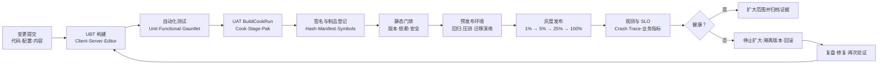
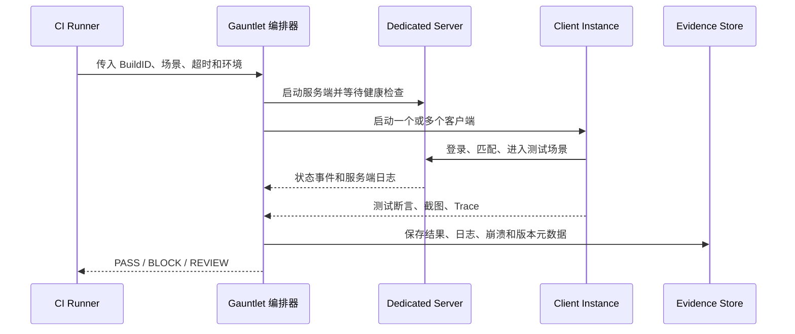
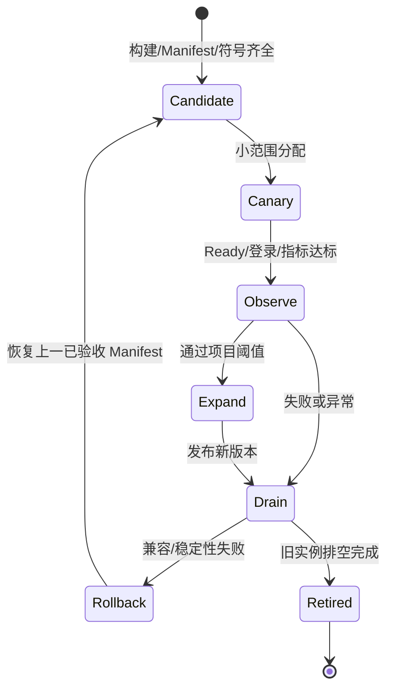
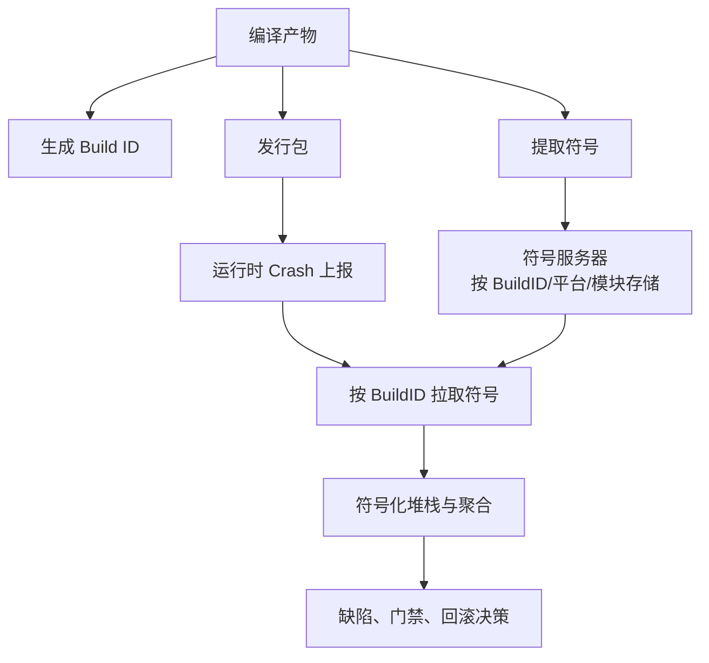
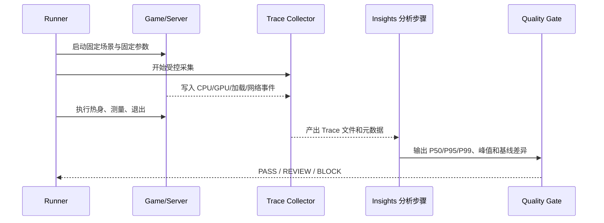
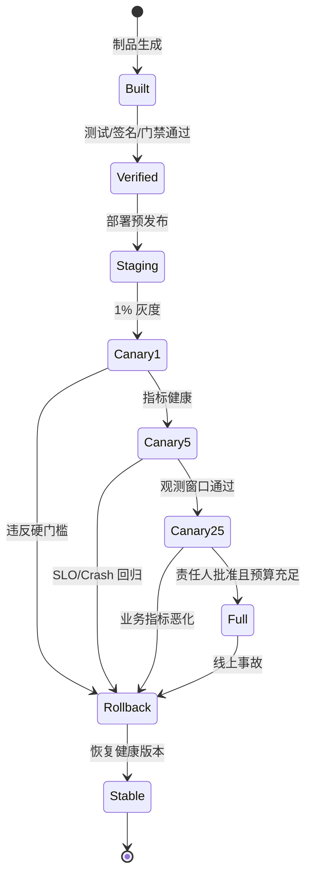

# 08 全栈质量门禁与灰度回滚
> 版本基准：UE5.8.0 / CL55116800 / `++UE5+Release-5.8`。
> 适用范围：以 Windows 客户端、Linux 或容器化服务端为主的 UE 游戏，从提交、构建、测试、打包、签名到灰度发布、观测和回滚的全栈交付。
> 兼容性边界：本文只把 UE5.8 基准下可验证的工具链概念作为前提；具体平台 SDK、发行商证书、CI 产品、崩溃平台、服务发现、限流组件和发布平台没有统一实现，示例均为方案或伪代码，不能冒充 UE5.8 源码事实。
> 官方参考：[Unreal Engine 官方文档](https://dev.epicgames.com/documentation/en-us/unreal-engine)。
> 最后更新：2026-08-06。

## 一、概述

上线质量不是“打出一个 Shipping 包”这一件事，而是一次可追溯、可观测、可恢复的交付闭环。

本文把质量门禁（Quality Gate）定义为：在变更进入下一阶段以前，依据明确输入、可复现规则和机器可读证据，决定继续、暂停、人工批准或回滚。

灰度回滚（Canary Rollback）定义为：先让有限比例的真实流量或玩家接触版本，在观测窗口内验证指标；若违反阈值，停止扩大范围，把客户端、服务端配置或服务端版本恢复到最后一个健康状态。

本文的目标不是给某个 CI 产品抄一份脚本，而是建立一份跨团队交付契约：

- 客户端知道自己要产出什么二进制、内容容器、符号和测试证据；
- 服务端知道协议、鉴权、幂等、迁移和灾备必须怎样配合客户端版本；
- 平台团队知道 SDK、证书、商店包和设备矩阵在哪里验收；
- 运营团队知道灰度人群、观测指标、SLO（Service Level Objective，服务等级目标）和回滚按钮由谁负责。

本文中的阈值是可落地的初始基线，不是任何项目的强制标准。
上线前应把阈值写进项目的版本清单和发布审批单，避免在事故中临时争论。

## 二、闭环总览

一次完整交付可以抽象为下面的证据流：



每一条箭头都应有输入和输出。
没有输入版本、输出制品或可定位的日志，就不能把某个阶段称为“通过”。

### 2.1 最小交付证据

一个可进入灰度的候选版本至少需要以下证据：

1. Git 提交 SHA、构建时间、构建机标识和引擎版本；
2. 客户端、专用服务端和工具程序的产物清单；
3. Cook/Stage/Package 的日志、警告摘要和内容清单；
4. 自动化测试、Gauntlet 场景和服务端接口测试结果；
5. 包体哈希、签名结果、密钥版本引用和符号上传状态；
6. Crash、Trace/Insights 性能门禁结果；
7. 配置、数据库迁移、回滚策略和人工批准记录；
8. 灰度人群、观测窗口、SLO、触发条件和责任人。

### 2.2 通过、阻断和人工批准

建议把门禁结果分为三种，而不是只输出一个布尔值：

| 结果 | 含义 | 自动动作 | 典型例子 |
| --- | --- | --- | --- |
| PASS | 规则满足且证据齐全 | 进入下一阶段 | 编译、测试、签名和指标均在阈值内 |
| BLOCK | 明确违反硬门槛 | 停止流水线，不允许发布 | 包签名失败、严重 Crash、迁移不可逆 |
| REVIEW | 规则可解释但需责任人判断 | 暂停并请求人工批准 | 新平台首次接入、性能小幅回归、已知隔离缺陷 |

“没有数据”不能等同于 PASS。
例如 Crash 上报服务不可用时，应输出 REVIEW 或 BLOCK，而不是把零上报当作零崩溃。

## 三、角色边界与核心概念

### 3.1 客户端、服务端、平台、运营边界

| 角色 | 负责范围 | 必须提供的输入 | 必须交付的输出 | 不应越权承担 |
| --- | --- | --- | --- | --- |
| 客户端团队 | UBT 编译、UAT 打包、内容 Cook、客户端测试、Trace 和 Crash 归因 | 源码、内容、目标平台、配置模板 | 客户端包、Pak/容器、符号、Manifest、测试报告 | 不直接持有生产数据库密钥，不绕过平台证书流程 |
| 服务端团队 | API、房间、限流、鉴权、迁移、回滚、容量和灾备 | 协议版本、配置、镜像、迁移脚本、容量模型 | 服务端镜像/包、健康检查、迁移报告、回滚 Runbook | 不把客户端包内秘密当作服务端鉴权，不单独修改客户端协议契约 |
| 平台团队 | SDK、证书、商店包、设备矩阵、分发通道、平台合规 | 已签名或待签名制品、版本元数据、证书引用 | 平台验收结果、分发状态、设备兼容报告 | 不替业务团队决定业务 SLO，不把私钥放进普通构建日志 |
| 运营/SRE 团队 | 灰度人群、开关、监控、SLO、事故响应、回滚执行 | 发布计划、指标面板、告警规则、责任人 | 灰度记录、观测结论、回滚或放量记录、复盘 | 不在没有版本兼容检查时强开全量，不用数据回滚替代代码回滚 |

边界的目的不是切割责任，而是让每个失败点都有唯一的第一响应人和明确的升级路径。

### 3.2 核心概念速查

| 概念 | 中文解释 | 交付时的判定问题 |
| --- | --- | --- |
| Build ID | 一次构建的不可变身份 | 能否从任意包反查 Git、引擎、配置和构建机？ |
| Artifact | 制品，包含包、镜像、符号和报告 | 是否不可变、可下载、可校验、可过期清理？ |
| Manifest | 内容和版本清单 | 客户端、服务端、CDN 是否使用同一版本契约？ |
| Quality Gate | 质量门禁 | 规则是否自动执行并保留证据？ |
| Canary | 灰度版本或灰度人群 | 是否可限定比例、地区、平台和账号标签？ |
| SLI | 服务等级指标 | 是否能从日志、指标或 Trace 直接计算？ |
| SLO | 指标目标 | 是否有时间窗口、分母、阈值和例外？ |
| Error Budget | 错误预算 | 预算耗尽时是否自动停止放量？ |
| Rollback | 回滚 | 能回到哪一个已验证健康版本，耗时多久？ |
| Forward Fix | 前向修复 | 数据已升级时，是否用兼容修复代替危险的数据回退？ |

### 3.3 输入与输出契约表

| 阶段 | 输入 | 机器校验 | 输出 | 保存期限建议 |
| --- | --- | --- | --- | --- |
| 提交 | Git SHA、分支、变更说明 | SHA 可访问，工作区无未提交文件 | Change Record | 至少覆盖一个版本周期 |
| UBT | `.uproject`、Target、模块、平台和配置 | 依赖解析、编译、链接、警告门禁 | Client/Server/Editor 二进制 | 与制品同周期 |
| 自动化测试 | 二进制、测试数据、环境变量 | 测试退出码、失败用例、日志完整 | JUnit/JSON/截图/Trace | 至少保留失败证据 |
| Cook | 资产、平台、文化、烘焙配置、DDC | Cook 错误、缺失引用、重复资产 | Cook 输出与摘要 | 与包体同周期 |
| Stage/Package | Cook 目录、启动参数、平台工具 | 文件存在、包体结构、安装/启动自检 | Staged 目录、安装包、容器 | 与分发策略一致 |
| 签名 | 待签名制品、证书引用、密钥服务授权 | 哈希、签名、证书链、时间戳 | 已签名制品和签名报告 | 合规要求优先 |
| 发布 | 版本清单、灰度规则、回滚版本 | 兼容性、审批、健康版本存在 | 灰度部署记录 | 审计周期内 |
| 观测 | Crash、日志、指标、Trace、业务事件 | 时间窗口、分母、采样率、脱敏 | SLO 结论与放量决定 | 至少覆盖灰度窗口 |

### 3.4 版本身份

版本身份应由不可变字段组成，而不是只用一个人工填写的版本号：

```text
BuildID = ProductVersion
        + GitSHA
        + EngineCL(55116800)
        + EngineBranch(++UE5+Release-5.8)
        + TargetPlatform
        + Configuration
        + ContentManifestHash
        + SchemaVersion
```

人工展示版本可以短一些，但制品元数据必须保留完整字段。
同一个 Build ID 不应被重新上传不同内容，否则 Crash 符号、Pak 清单和回滚判断都会失真。

## 四、UBT 与 UAT：从构建到可发布制品

### 4.1 UBT 门禁边界

UBT（UnrealBuildTool）负责按 Target、Module、平台和配置组织编译。
本文只要求流水线验证 UBT 的输入输出，不把项目自定义 Target 的字段冒充为统一的 UE5.8 实现。

最小 UBT 门禁包括：

- Client、Server、Editor 或项目实际声明的目标均能解析；
- Development 与 Shipping 至少各有一个代表性构建；
- 目标平台 SDK、编译器和工具链版本被记录；
- 依赖模块没有从 Runtime 目标偷偷引用 Editor-only 模块；
- 编译警告按项目规则分级，禁止把关键告警静默吞掉；
- 产物中的 Build ID 与提交元数据一致；
- 构建目录不含上一次分支遗留的二进制或配置。

### 4.2 UAT 门禁边界

UAT（Unreal Automation Tool）通常负责把编译、Cook、Stage、Package、Archive 和测试串成任务。
`BuildCookRun` 命令及参数应以本机 UE5.8 工具帮助和项目脚本为准，以下命令是示意。

```powershell
param(
    [string]$EngineRoot = 'C:\UE\UE_5.8',
    [string]$ProjectFile = 'C:\Build\MyGame\MyGame.uproject',
    [ValidateSet('Win64','Linux')][string]$Platform = 'Win64',
    [ValidateSet('Development','Shipping')][string]$Configuration = 'Shipping',
    [string]$ArchiveDir = 'C:\Artifacts\MyGame'
)

$ErrorActionPreference = 'Stop'
$uat = Join-Path $EngineRoot 'Engine\Build\BatchFiles\RunUAT.bat'
if (-not (Test-Path -LiteralPath $uat -PathType Leaf)) {
    throw "UAT 不存在：$uat"
}

$args = @(
    'BuildCookRun',
    "-project=$ProjectFile",
    "-platform=$Platform",
    "-clientconfig=$Configuration",
    '-build',
    '-cook',
    '-stage',
    '-pak',
    '-archive',
    "-archivedirectory=$ArchiveDir",
    '-utf8output'
)

& $uat @args
if ($LASTEXITCODE -ne 0) {
    throw "UAT 失败，退出码：$LASTEXITCODE"
}
```

这个例子没有把密钥、服务端令牌或生产端点放进命令行。
真实流水线应将敏感值通过受控凭据注入，并在启动前检查日志脱敏。

### 4.3 CI/CD 构建矩阵

构建矩阵（Build Matrix）是把平台、目标、配置、内容策略、测试层级组合成可审计的集合。
不要用一个“万能构建”覆盖所有目标，因为客户端、专用服务端和测试包的依赖与启动方式不同。

| 维度 | 示例值 | 影响 | 最低门禁 |
| --- | --- | --- | --- |
| Target | Client / Server / Editor | 模块依赖与启动入口 | UBT 成功、产物可识别 |
| Platform | Win64 / Linux / Android / iOS | SDK、编译器、签名和设备 | 目标工具链可用 |
| Configuration | Development / Test / Shipping | 日志、断言、优化、符号 | 配置与包名一致 |
| Content | Full / Smoke / Patch | Cook 范围、包体和清单 | 资产闭包无缺失 |
| Test tier | Unit / Functional / Gauntlet / Soak | 运行时间和环境规模 | 阻断级用例全绿 |
| Environment | CI / Staging / Canary / Prod | 端点、密钥、特性开关 | 配置来源正确 |
| Architecture | x64 / ARM64 等 | 二进制与平台兼容 | 设备或运行时自检 |

建议最少保留以下矩阵单元：

| 单元 | 目的 | 是否发布候选 |
| --- | --- | --- |
| Win64 Client Development + Smoke | 快速反馈编译和启动回归 | 否 |
| Win64 Client Shipping + Full Cook | 验证发行包、内容和签名前输入 | 是 |
| Linux Dedicated Server Shipping | 验证服务端产物和启动参数 | 是 |
| Editor Development + Automation | 验证编辑器工具和数据验证 | 否 |
| Headless Client/Server + Gauntlet | 验证联机流程和确定性 | 否，除非通过预发布 |
| 目标平台包 + 真机冒烟 | 验证 SDK、证书、安装和启动 | 是 |

### 4.4 示意 CI YAML

下面的 YAML 是平台无关的示意格式，字段名可能需要映射到实际 CI 产品。
它表达的是门禁顺序和制品依赖，不声称任何特定 CI 服务的原生 schema。

```yaml
name: fullstack-release-gate

variables:
  engine_cl: "55116800"
  engine_branch: "++UE5+Release-5.8"
  gate_policy: "configs/quality-gates/shipping.yml"

matrix:
  include:
    - name: win64-client-smoke
      target: Client
      platform: Win64
      configuration: Development
      tests: smoke
    - name: win64-client-shipping
      target: Client
      platform: Win64
      configuration: Shipping
      tests: full
    - name: linux-dedicated-server
      target: Server
      platform: Linux
      configuration: Shipping
      tests: api-and-soak

stages:
  - name: compile
    run: ./ci/build.ps1 -Target ${{ matrix.target }} -Platform ${{ matrix.platform }}
  - name: test
    needs: [compile]
    run: ./ci/test.ps1 -Suite ${{ matrix.tests }}
  - name: package
    needs: [test]
    run: ./ci/package.ps1 -Platform ${{ matrix.platform }} -Configuration ${{ matrix.configuration }}
  - name: sign-and-register
    needs: [package]
    run: ./ci/sign.ps1 -ArtifactDirectory artifacts/${{ matrix.name }}
  - name: quality-gate
    needs: [sign-and-register]
    run: ./ci/evaluate-gates.ps1 -Policy ${{ variables.gate_policy }}
```

矩阵中的每个单元都应有独立的日志前缀和制品目录。
如果某个平台暂时无法运行真机测试，应显式标记为 REVIEW，而不是删除该矩阵单元。

### 4.5 构建失败路径

| 失败点 | 检测信号 | 立即动作 | 责任边界 |
| --- | --- | --- | --- |
| 工具链缺失 | 编译器/SDK 探测失败 | 标记环境故障，禁止重试污染制品 | 平台/CI |
| UBT 依赖错误 | 模块解析或链接失败 | 保留完整日志，回退最近变更 | 客户端 |
| 构建缓存污染 | 同 SHA 产物哈希不一致 | 清理隔离工作区，重跑一次并比对 | CI/客户端 |
| UAT 参数不兼容 | 命令返回非零或阶段缺失 | 使用本机帮助确认参数，禁止盲改生产脚本 | 客户端/CI |
| Cook 失败 | 资产、材质或引用错误 | 阻断打包，定位首个错误而非最后一条 | 客户端/内容 |
| Stage 缺文件 | 启动自检或 Manifest 缺项 | 不进入签名，修复内容闭包 | 客户端 |
| Package 安装失败 | 平台安装器/设备返回错误 | 保留安装日志，转平台验收 | 平台 |

## 五、自动化测试与 Gauntlet

### 5.1 测试分层

测试分层（Test Pyramid）要同时覆盖客户端和服务端，但不要求所有层都运行同一套用例。

| 层级 | 客户端示例 | 服务端示例 | 反馈速度 | 发布门禁 |
| --- | --- | --- | --- | --- |
| Unit | 纯 C++ 规则、序列化、数值函数 | 计费、背包、状态机、权限 | 秒级 | 必须通过 |
| Module/Integration | Gameplay 模块、资源加载 | API、数据库、缓存适配 | 分钟级 | 必须通过 |
| Functional | 地图、交互、UI 流程 | 房间、匹配、断线重连 | 分钟到十分钟 | 阻断用例必须通过 |
| Gauntlet | 多进程启动、联机、长流程 | 客户端-服务端编排 | 十分钟级 | 候选版本必须通过 |
| Soak | 长时间运行、内存、句柄 | 并发、连接、队列、泄漏 | 小时级 | 预发布必须通过 |
| E2E | 真机、商店包、登录支付 | 真实依赖的完整链路 | 慢且昂贵 | 灰度前抽样 |

自动化测试的结果应包含：用例 ID、版本身份、环境、开始结束时间、日志、截图或 Trace、失败原因和重试次数。

### 5.2 Gauntlet 编排思路

Gauntlet 可作为 UE 自动化场景的编排层，用于启动客户端/服务端、分配端口、发送控制命令和收集结果。
不同项目的测试控制器、参数和命令注册方式可能不同，本文只描述应达到的行为。



### 5.3 场景设计

每个高价值场景应先写成功路径，再写故障路径：

1. 客户端启动并校验版本清单；
2. 获取环境配置，不允许读取生产密钥；
3. 完成鉴权并建立会话；
4. 进行一次业务动作并记录幂等键；
5. 模拟超时、重试、断线或重复请求；
6. 校验服务端最终状态和客户端展示；
7. 关闭进程，确认日志、Trace 和退出码齐全。

```text
伪代码：联机发布冒烟
given 版本 BuildID 与 staging 环境
when 启动 server，等待 /healthz 返回 ready
and 启动两个 client，使用测试账号登录
and client A 创建房间，client B 加入房间
and client A 重复提交同一个幂等键
and 强制 client B 断线后重连
then 服务端只产生一笔业务结果
and 两个客户端显示同一最终状态
and 所有进程退出码为 0
and 证据包含日志、版本清单和 Trace
```

### 5.4 Flaky 测试与重试

重试不是修复测试的替代品。
建议把测试结果记录为 `passed`、`failed`、`flaky`、`infra_failed` 四种状态。

- 阻断级用例首次失败即保留失败证据；
- 只允许基础设施故障进行有限重试；
- 业务断言失败重试后通过，仍应标记 flaky 并创建跟踪项；
- flaky 比例超过阈值时，门禁结果为 REVIEW 或 BLOCK；
- 不允许在流水线中无限重跑直到绿灯。

### 5.5 自动化测试失败路径

| 失败类型 | 误判风险 | 处理方式 |
| --- | --- | --- |
| 测试断言失败 | 真实回归被掩盖 | 阻断并关联变更 |
| 客户端崩溃 | 只看到测试超时 | 上传 Crash、符号和最近 Trace |
| 服务端无响应 | 可能是容量或环境故障 | 区分业务 5xx、网络失败和基础设施故障 |
| 端口冲突 | 误报场景失败 | 由编排器动态分配并记录端口 |
| 测试数据残留 | 后续用例受污染 | 每个场景使用命名空间和清理步骤 |
| 设备离线 | 真机覆盖被误删 | 标记 REVIEW，补跑或换备用设备 |

### 5.6 UE Dedicated Server 专项验收门禁

本节定义 Dedicated Server（DS）交付单元的专项门禁。它是项目流水线的验收契约，不代表当前仓库已经部署了某个云平台，也不把示意脚本、占位命令或正文锚点当作实际运行结果。**概念覆盖不等于执行验证**；每个 PASS 都必须能回指到本次构建的真实制品、命令、日志和报告。

#### 5.6.1 交付单元与事实边界

| 交付单元 | 必须确认的内容 | 证据要求 |
| --- | --- | --- |
| Server Target | 项目自己的 `Server.Target.cs`、`TargetType.Server`、目标平台和配置 | Target 名称来自项目实际文件，不在门禁中编造目标名 |
| Win64 Shipping | 目标为 Win64 的 Shipping Dedicated Server 可启动 | 干净 Stage/Archive、启动日志、退出码和 BuildId |
| Linux Shipping | 目标为 Linux 的 Shipping Dedicated Server 可启动 | 干净 Stage/Archive、启动日志、退出码和 BuildId |
| Cook 内容 | ServerDefaultMap 及其引用闭包已烘焙 | Cook 日志、错误摘要、地图存在性检查 |
| Stage 内容 | 二进制、插件、配置、Cooked 内容组成可运行目录 | Stage 清单、文件哈希和启动命令 |
| Archive 制品 | 可分发的归档与 Manifest 可复现 | Archive 路径、Manifest、制品哈希和保留策略 |
| 联机验收 | Server 与多 Client 完成登录、复制和退出 | Gauntlet 或等价 E2E 报告、端口、日志和 Crash 证据 |

UE5.8 版本敏感事实以仓库已有源码专题和 Epic 官方资料为准：

- 版本基线：`UE5.8.0 / CL55116800 / ++UE5+Release-5.8`；
- 本节只约束交付和验收流程，不声称项目已经启用某个供应商的托管服务；
- `TargetType.Server`、AutomationTool 参数和 Dedicated Server 行为应以本机核对的 UE5.8 源码为事实来源；
- 项目 Target 名、地图名、端口策略、凭据系统、编排器和阈值均使用项目实际配置或占位符；
- 任何 `YOUR_*`、`<PROJECT_* >`、`<PORT>` 和 `Example-*` 都是方案示意，不能作为本次执行结果。

#### 5.6.2 构建到可运行制品

门禁按 `Build → Cook → Stage → Archive` 分层记录，不允许仅凭编译成功判定 DS 可交付。

| 阶段 | DS 专项检查 | 失败时保留 |
| --- | --- | --- |
| Target | Server Target 存在，目标平台和 `Shipping` 配置明确 | UBT 输出、Target 文件路径、BuildId |
| Build | Server 二进制、依赖模块和插件完成编译 | 编译日志、警告摘要、符号索引 |
| Cook | `ServerDefaultMap` 可解析，地图和服务器运行时依赖进入 Cook | Cook 日志、错误、资产清单 |
| Stage | Stage 目录可在干净环境启动，配置不依赖开发机绝对路径 | Stage 清单、环境变量、启动日志 |
| Archive | Archive 与 Manifest 具有稳定哈希，可被下载或复制到验收机 | Archive 路径、哈希、Manifest |

以下是**方案示意**，其中 `<PROJECT>`、`<TARGET>`、`<PROJECT_FILE>`、`<OUT>` 和 `<MAP>` 必须替换为项目真实值；运行前先核对项目实际 Target，不得把示例输出当作事实：

```powershell
# 方案示意：仅展示参数形状，不表示本机已经执行或通过。
& "<UE_ROOT>\Engine\Build\BatchFiles\RunUAT.bat" `
  BuildCookRun `
  -project="<PROJECT_FILE>" `
  -server `
  -serverconfig=Shipping `
  -serverplatform=Win64 `
  -target="<TARGET>Server" `
  -build -cook -stage -archive `
  -archivedirectory="<OUT>\Win64"
```

Linux 也必须使用项目实际目标与实际构建环境；下列命令同样是**方案示意**：

```bash
# 方案示意：不是项目已有脚本，也不是本次执行结果。
"<UE_ROOT>/Engine/Build/BatchFiles/RunUAT.sh" BuildCookRun \
  -project="<PROJECT_FILE>" -server -serverconfig=Shipping \
  -serverplatform=Linux -target="<TARGET>Server" \
  -build -cook -stage -archive -archivedirectory="<OUT>/Linux"
```

门禁至少检查以下事实链：

1. `TargetType.Server` 被项目 Server Target 使用，且没有把 Editor Target 当作 Dedicated Server；
2. Win64 与 Linux 的 Shipping 产物分别记录平台、配置、Target、BuildId 和引擎版本基线；
3. `BuildCookRun` 的 `Build`、`Cook`、`Stage`、`Archive` 阶段均有可定位日志；
4. Cook 产物包含实际配置指向的 `ServerDefaultMap`，而不是只检查文件名存在；
5. Stage 中不存在开发机绝对路径、未签入的临时文件或未声明的 Secret；
6. Archive 旁边存在 Manifest，Manifest 能列出二进制、插件、配置和 Cook 内容；
7. 符号与 Shipping 制品按同一 BuildId 归档，且符号服务器上传结果可查询；
8. 任何阶段失败都保留失败日志，不以重试覆盖第一份失败证据。

#### 5.6.3 启动、Ready、Reservation 与 Draining

进程成功创建不等于游戏实例可分配。专项验收把 Ready 分成可观察的阶段：

| 阶段 | 判定含义 | 不应混淆的状态 |
| --- | --- | --- |
| Process started | 进程存在并开始输出日志 | 不等于端口监听 |
| Listening | 目标端口已绑定且可建立 TCP/UDP 通路 | 不等于登录成功 |
| Ready | ServerDefaultMap 加载完成，玩法层可接受合法登录 | 不等于已分配给匹配 |
| Reservation accepted | 分配器持有 Reservation，实例与票据绑定 | 不等于玩家已进入地图 |
| In game | 通过 GameMode/登录和复制验收 | 不等于可以继续接收新分配 |
| Draining | 拒绝新 Reservation，通知并排空已有会话 | 不等于立即杀进程 |
| Terminated | 进程退出并完成证据收集 | 不等于崩溃；需区分退出码 |

Ready 门禁必须同时覆盖进程、网络、玩法和依赖四层：

- 进程层：启动日志出现可识别的启动完成标记，且没有致命错误；
- 网络层：监听地址和端口可从验收环境访问，端口与本次实例唯一；
- 玩法层：加载 `ServerDefaultMap`，执行一次登录冒烟，GameMode 的 `PreLogin`、`PostLogin` 路径可完成；
- 依赖层：票据验证、匹配/Reservation 查询、必要配置读取均有明确超时和失败分类；
- 报告层：记录 `instanceId`、`BuildId`、端口、地图、区域、协议版本和时间戳。

项目若提供 readiness adapter，可用以下**方案示意**描述其契约；UE Dedicated Server 本身不因本节而获得一个假定存在的内置 health endpoint：

```text
方案示意：readiness adapter --instance <INSTANCE_ID> --check startup,listen,gameplay,dependency
返回：ready=true/false、reason=<REASON>、buildId=<BUILD_ID>、port=<PORT>
```

分配器必须在 Reservation 有效期内确认实例仍为 Ready；Reservation 过期、票据不匹配、BuildId 不兼容或端口检查失败时，应幂等释放并重新分配。重试必须携带同一个 `requestId` 或幂等键，并区分“未创建实例”和“实例已创建但连接失败”。

进入 Draining 后的门禁如下：

1. 调度器停止向该实例发放新的 Reservation；
2. Server 拒绝新的分配请求，并返回可重试的 drain 原因；
3. 对已有玩家发送业务层通知，给出项目占位符 `<RECONNECT_WINDOW>`；
4. 结算和持久化完成后再关闭连接；
5. 到达超时则记录仍存活连接、未完成事务和强制退出原因；
6. 退出码、Crash、日志、Trace、Manifest 和最终状态被写入同一证据目录。

#### 5.6.4 Gauntlet 与端到端联机门禁

Gauntlet 的职责是启动和编排测试会话、角色、日志与结果收集；它不负责创建 Build。交付流水线必须先产生可验收的 Server/Client 制品，再使用 Epic AutomationTool 的 `RunUAT RunUnreal` 或项目已核对的等价入口运行测试。`Server + 多 Client` 是联机场景的最低模型，Client 数量使用项目占位符 `<CLIENT_COUNT>`。

```text
方案示意：RunUAT RunUnreal -project=<PROJECT_FILE> -test=<TEST_NAME>
                 -server=<SERVER_STAGE> -clients=<CLIENT_COUNT>
说明：参数名、测试名和脚本路径须以本机 UE5.8/项目实现核对；不表示已执行。
```

E2E 最小场景必须形成一条闭环：


至少覆盖以下场景，而不是只验证进程能启动：

- 正常启动、Ready、Reservation、登录、进入地图、复制、业务动作、结算和退出；
- Join In Progress（JIP）加入后，已有状态能按项目协议复制到新 Client；
- ServerTravel 或 Seamless Travel（如项目使用）后，连接、玩家状态和版本证据一致；
- Client 断线后在 `<RECONNECT_WINDOW>` 内重连，过期票据被拒绝且不会创建重复会话；
- Draining 实例拒绝新 Reservation，已有玩家获得通知并完成结算或明确超时；
- Server、Client 任一角色崩溃时，测试能收集 Saved、Crash、日志、符号和退出码；
- 两个并发场景使用不同端口和临时目录，不能因共享端口造成假失败。

Gauntlet 报告至少应保留：测试名、命令行、角色列表、Server/Client 进程号、端口、BuildId、engine baseline、protocol version、开始/结束时间、退出码、日志目录、Crash 目录和报告 JSON。真实报告字段以本机测试实现为准，示例字段仅为方案占位。

#### 5.6.5 弱网、长稳、Crash、符号与 Trace

网络回归不是“加一个延迟参数”就完成。必须先核对本机 UE5.8 和项目可用的 Network Emulation 入口；未核对的控制台参数只能写成方案示意，不能写成执行结果。

| 故障维度 | 最小场景 | 证据 |
| --- | --- | --- |
| 延迟 | `<LATENCY_MS>` 的往返延迟 | 配置、实际观测、复制/RPC 断言 |
| 丢包 | `<LOSS_PERCENT>` 的上下行丢包 | 网络仿真记录、重试、最终状态 |
| 带宽 | `<BANDWIDTH_KBPS>` 限制 | 吞吐、排队、Tick 和玩家体验指标 |
| 抖动 | `<JITTER_MS>` 范围内变化 | 时间序列和异常窗口 |
| 断网恢复 | 断开 `<OUTAGE_SECONDS>` 后恢复 | 重连、票据、会话幂等证据 |
| 长稳 Soak | `<SOAK_DURATION>` 连续运行 | 资源曲线、连接数、Tick、崩溃 |

预测、复制、RPC、Iris 和 ReplicationGraph 的选型回归应有场景矩阵：

- 预测输入在丢包和回滚后不产生重复业务结果；
- 复制状态在 JIP、地图切换和低带宽下最终收敛；
- RPC 明确可靠性、顺序、拥有者和幂等语义；
- Iris 或 ReplicationGraph 只在项目实际启用时列为执行项，未启用项标记 N/A，不假定自动生效；
- 每个回归项绑定 BuildId、协议版本、地图、角色数和网络条件。

Crash 与性能证据必须相互关联：

1. Crash 报告记录退出码、崩溃时间、BuildId 和符号版本；
2. 符号服务器只接收与制品匹配的符号，并记录上传结果；
3. Trace/Insights 采集窗口包含 Ready、登录、复制、弱网和 Draining 事件；
4. 日志按 Server、每个 Client、分配器适配层分目录保存；
5. 若使用 NetProfiler，报告中注明采集方式和适用版本，不把“若适用”写成必然存在；
6. 证据目录写入 Manifest，避免日志与错误 BuildId 混用。

#### 5.6.6 观测指标与门禁判定

指标名称可以由项目监控系统映射，但原始报告至少需要这些维度：

| 类别 | 指标 | 维度 |
| --- | --- | --- |
| 启动 | startup、listen、readiness、分配耗时 | BuildId、平台、区域、地图 |
| 会话 | CCU、连接数、登录成功率、JIP 成功率 | instanceId、sessionId、matchId |
| 模拟 | Tick 时间、帧率、复制量、RPC 失败 | Server、地图、网络条件 |
| 稳定性 | Crash、重启、退出码、Drain 超时 | buildId、实例状态、原因 |
| 资源 | CPU、内存、磁盘、网络水位 | 平台、实例、时间窗口 |
| 发布 | 灰度比例、回滚耗时、失败率 | Release、区域、协议 |

阈值不从本节虚构。项目应把 `<P95_READY_SECONDS>`、`<P99_LOGIN_SECONDS>`、`<MAX_TICK_MS>`、`<MAX_MEMORY_MB>`、`<MAX_CRASH_RATE>`、`<SLO_WINDOW>` 等占位符替换为经过压测和业务批准的值；在替换前，门禁结果应为 REVIEW 或“必须有实测证据”，而不是 PASS。

门禁输出至少分为 `PASS`、`FAIL`、`REVIEW`、`N/A`：

- `PASS`：有真实命令、制品、日志和断言，且满足批准阈值；
- `FAIL`：启动、联机、证据完整性或兼容性断言失败；
- `REVIEW`：指标有实测证据但超过暂定阈值，或只发生基础设施重试；
- `N/A`：项目明确未启用该能力，并记录责任人和重新启用条件。

#### 5.6.7 版本、证据与兼容矩阵

每次 DS 验收都要生成一条不可歧义的版本身份：

```yaml
# 方案示意：字段需由项目流水线真实填充，不能直接作为验收结果。
buildId: <BUILD_ID>
engineBaseline: UE5.8.0 / CL55116800 / ++UE5+Release-5.8
protocolVersion: <PROTOCOL_VERSION>
targetPlatform: <Win64|Linux>
configuration: Shipping
serverTarget: <PROJECT_SERVER_TARGET>
serverDefaultMap: <PROJECT_SERVER_DEFAULT_MAP>
manifest: <MANIFEST_PATH>
symbols: <SYMBOL_ARTIFACT_OR_NA>
```

兼容矩阵至少列客户端版本、Server 版本、协议版本、配置数据版本和迁移策略：

| Client | Server | Protocol | 配置/数据 | 结论 |
| --- | --- | --- | --- | --- |
| `<CLIENT_CURRENT>` | `<SERVER_CURRENT>` | `<PROTOCOL_CURRENT>` | `<DATA_CURRENT>` | 必须有实测证据 |
| `<CLIENT_PREVIOUS>` | `<SERVER_CURRENT>` | `<PROTOCOL_COMPAT>` | `<DATA_FORWARD>` | 只有经验证才允许灰度 |
| `<CLIENT_CURRENT>` | `<SERVER_PREVIOUS>` | `<PROTOCOL_COMPAT>` | `<DATA_BACKWARD>` | 默认拒绝，除非有证据 |
| 其他组合 | 任意 | 不匹配 | 不匹配 | 明确拒绝并记录原因 |

Manifest 应能追溯到源提交、构建流水线、Target、平台、配置、Cook 规则、插件版本、制品哈希、符号位置、测试报告和审批记录。不能只上传一个压缩包而丢失这些关联。

#### 5.6.8 灰度、排空与回滚

发布门禁的顺序是“先验证制品，再小范围分配，再排空旧实例，最后扩大范围”。灰度比例、持续时间和停止条件均使用项目批准的占位符，不能声称某平台已经运行。



灰度前必须确认：

1. 新旧 BuildId、engine baseline 和 protocol version 可在日志中区分；
2. 分配器只把匹配兼容矩阵的请求发给新版本；
3. 新版本 Ready、Reservation、登录和业务闭环有真实 E2E 证据；
4. 旧版本可以停止接收新分配，并按 Draining 策略完成会话；
5. 回滚使用上一份已验证的 Archive/Manifest，不现场重新构建未知制品；
6. 回滚后再次执行启动、登录和关键业务冒烟，并保留回滚前后的指标；
7. 发现数据格式不兼容时先停止扩大灰度，执行数据向前兼容或人工处置；
8. 平台适配器的分配失败、端口释放和重试均能单独分类。

#### 5.6.9 专项验收证据清单

一次可签署的 DS 交付至少包含以下文件或系统引用：

- Win64 Shipping Server Target 的构建日志；
- Linux Shipping Server Target 的构建日志；
- 两个平台的 Cook、Stage、Archive 日志和 Manifest；
- ServerDefaultMap 解析与加载证据；
- Server 启动命令、端口、环境摘要和退出码；
- Server + 多 Client 的 Gauntlet 或等价报告 JSON；
- 登录、PreLogin/PostLogin、复制、JIP、重连和 Draining 日志；
- 弱网、丢包、Soak、Crash、符号和 Trace/Insights 证据；
- BuildId、engine baseline、protocol version、instance/session/match 标识；
- 失败分类、重试次数、flaky/infra 边界和审批结论；
- 灰度、排空、回滚和数据兼容记录。

以下四篇专题用于追溯实现细节与执行入口：

- [UE Dedicated Server 启动与监听源码](../12-引擎源码分析/32-UE%20Dedicated%20Server启动与监听源码.md)
- [UE Dedicated Server 构建、烘焙与运行](./09-UE%20Dedicated%20Server构建烘焙与运行.md)
- [UE Dedicated Server 实例生命周期与平台化](../../游戏服务端/05-UE%20Dedicated%20Server平台化/01-UE%20Dedicated%20Server实例生命周期与平台化.md)
- [UE Dedicated Server 联机验收与 Gauntlet](../../游戏测试与质量/06-UE%20Dedicated%20Server联机验收与Gauntlet.md)

关联专题只提供知识和路径索引，不能替代本次制品的实测报告。提交门禁前应运行仓库脚本、目标平台测试和项目适配器验证，并把命令与结果写入报告。

## 六、Cook、Stage、Pak、容器与签名

### 6.1 四阶段职责

| 阶段 | 作用 | 核心输入 | 核心输出 | 质量门禁 |
| --- | --- | --- | --- | --- |
| Cook | 将源资产处理为目标平台运行时内容 | uasset、地图、配置、平台、文化 | Cooked 内容、日志、依赖信息 | 无致命错误、引用闭包完整 |
| Stage | 按运行目录组织可运行文件 | 二进制、Cooked 内容、配置、插件 | Staged 目录 | 启动依赖、配置和文件权限正确 |
| Pak/Container | 形成可分发内容容器 | Staged/Cooked 文件、分块规则 | Pak 或项目启用的容器制品 | 清单、哈希、块边界和版本一致 |
| Package/Archive | 形成平台安装包和归档 | 容器、平台资源、签名输入 | 安装包、归档、Manifest | 可安装、可启动、可回滚 |

不要把“Stage 目录存在”当作“包体可运行”。
必须在干净设备或干净运行环境执行至少一次安装、启动、登录、加载首个地图和退出自检。

### 6.2 内容闭包与版本清单

内容闭包（Content Closure）是启动路径、首个场景、测试场景和必要配置所需的全部文件集合。
门禁至少应检查：

- 必需资产是否被 Cook；
- 软引用、Primary Asset、插件内容和文化包是否有清单；
- 客户端 Manifest 的内容哈希是否和容器一致；
- Patch 或热更包是否声明基线版本；
- 不同平台的资源格式是否被错误混装；
- Editor-only 资源是否意外进入发行包；
- 包体大小、单文件大小和分块变化是否在预算内。

### 6.3 签名与密钥安全

签名（Signing）应分为制品完整性签名、平台发行签名和服务端配置/令牌签名三个概念。
它们的密钥生命周期不同，不能因为“都是密钥”就共用。

| 密钥类别 | 用途 | 存放位置 | 构建机是否可见明文 | 轮换策略 |
| --- | --- | --- | --- | --- |
| 制品签名私钥 | 证明包或 Manifest 未被篡改 | KMS/HSM 或受控签名服务 | 否，最多获得一次性授权 | 按版本或安全策略 |
| 平台证书/Provision | 商店或平台验收 | 平台凭据库 | 只在隔离签名步骤短暂使用 | 按平台要求 |
| 服务端密钥 | 服务间鉴权、配置加密 | Secret Manager | 否 | 定期、泄露即刻 |
| 测试密钥 | Staging 模拟服务 | 独立测试凭据库 | 可受控使用 | 随环境重建 |
| 客户端公开配置 | Endpoint、Product ID 等 | 包内配置或远端配置 | 可以 | 按兼容策略 |

禁止事项：

- 不把私钥、刷新令牌、生产数据库密码写入 YAML、`.uproject`、日志或命令行历史；
- 不用生产签名密钥给开发包签名；
- 不把“混淆后的字符串”当作密钥保护；
- 不把客户端包中的 EOS/OSS Product ID、公开证书或服务地址误认为秘密；
- 不允许测试人员从制品目录复制生产凭据；
- 轮换密钥时保留可验证的旧版本读取能力，但不恢复旧私钥的广泛权限。

### 6.4 签名示意 PowerShell

下面只表达“哈希 → 受控签名 → 验签 → 登记”的流程。
`Sign-Artifact` 和 `Verify-Artifact` 是占位命令，真实实现应接入组织批准的 KMS/HSM 或签名服务。

```powershell
param(
    [Parameter(Mandatory)][string]$Artifact,
    [Parameter(Mandatory)][string]$BuildId
)

$ErrorActionPreference = 'Stop'
if (-not (Test-Path -LiteralPath $Artifact -PathType Leaf)) {
    throw "制品不存在：$Artifact"
}

$hash = (Get-FileHash -LiteralPath $Artifact -Algorithm SHA256).Hash.ToLowerInvariant()
$request = [ordered]@{
    build_id = $BuildId
    artifact = [System.IO.Path]::GetFileName($Artifact)
    sha256 = $hash
    purpose = 'release-artifact'
}

# 示意：签名服务只返回签名和 key_version，不返回私钥。
$signature = Sign-Artifact -Request $request
if (-not (Verify-Artifact -Request $request -Signature $signature.signature -KeyVersion $signature.key_version)) {
    throw '签名验签失败，阻断发布'
}

$request | ConvertTo-Json -Depth 4 | Set-Content -LiteralPath "$Artifact.manifest.json" -Encoding UTF8
```

若平台签名工具要求临时文件，临时目录应在流水线结束时清理，并在清理失败时生成安全告警。

## 七、符号服务器与 Crash 闭环

### 7.1 符号为什么是发布门禁

符号（Symbols）把二进制地址映射到函数、模块和源代码位置。
没有与 Build ID 精确匹配的符号，Crash 只能显示地址，无法可靠归因。

符号处理必须和制品绑定：



### 7.2 符号服务器方案

符号服务器是组织能力，不预设供应商。
可以是带权限的对象存储、专用符号服务或内部制品系统，但必须提供不可变版本、访问审计和过期策略。

| 设计项 | 最低要求 |
| --- | --- |
| 索引键 | Build ID、平台、模块名、架构和符号格式 |
| 上传时机 | 编译成功后、灰度前；不能等线上 Crash 才上传 |
| 权限 | 研发可读，写入由 CI 身份完成，外部上报服务最小读权限 |
| 保留 | 覆盖当前线上版本、回滚候选和法务/合规要求周期 |
| 校验 | 上传前后哈希一致，下载后符号化结果可抽样验证 |
| 隔离 | 开发、预发布、生产索引与访问凭据分离 |
| 隐私 | 堆栈、路径和用户字段脱敏，源代码不随符号公开 |

### 7.3 Crash 上报数据

Crash（崩溃）上报应尽量携带定位所需的最小字段：

- Build ID、产品版本、平台、架构和语言/文化；
- 模块、线程、异常类型、堆栈地址和符号化状态；
- 最近一次关卡、特性开关摘要和网络连接状态；
- 设备类别、驱动或 SDK 版本的合规摘要；
- 会话 ID 的不可逆关联值，而不是账号明文；
- 上报时间、采样率、是否为启动崩溃和是否发生在灰度人群。

不应上传密码、访问令牌、完整聊天内容、支付信息、原始身份证明或不必要的用户输入。

### 7.4 Crash 门禁

Crash 指标必须明确分母。
“崩溃数”适合调查，“崩溃会话率”或“每千次启动崩溃数”才适合跨版本比较。

| 指标 | 公式示意 | 初始门禁示例 |
| --- | --- | --- |
| Crash-free session rate | 无崩溃会话 / 总会话 | 不低于健康基线减项目容差 |
| 启动崩溃率 | 启动崩溃次数 / 启动次数 | 关键平台不得显著高于基线 |
| Top crash concentration | Top N 崩溃影响会话 / 总崩溃会话 | 新版本新增高集中崩溃即 BLOCK |
| 未符号化率 | 未符号化事件 / 总事件 | 超阈值只能 REVIEW，不可假设安全 |
| Crash 修复验证 | 回归版本该签名事件 / 基线事件 | 热点下降且无新回归 |

项目应先用过去健康版本建立基线，再确定绝对阈值。
新平台、低样本版本和隐私采样不足时，优先输出 REVIEW。

## 八、Trace/Insights 性能门禁

### 8.1 性能证据

Trace 是事件采集，Insights 是分析这些事件的工具链。
本文不绑定某个采集命令或 Trace 通道名称；流水线应以本机 UE5.8 工具和项目已验证的采集配置为准。

性能门禁应回答四个问题：

1. 在什么设备、分辨率、地图、人数和画质下测量？
2. 测量的是平均值、P95、P99 还是最差帧？
3. 热身帧、编译着色器、网络抖动和后台负载是否隔离？
4. 回归是否能定位到 Build ID、Trace 文件和变更范围？

### 8.2 性能指标表

| 领域 | 指标 | 采样方式 | 典型门禁思路 |
| --- | --- | --- | --- |
| 帧率 | FPS、Frame Time P95/P99 | 固定场景 Trace | 不低于设备档位基线，尖峰单独分析 |
| 游戏线程 | Game Thread 时间 | Trace/Insights | P95 不得超过预算 |
| 渲染线程 | Render Thread 时间 | Trace/Insights | 场景与平台分开比较 |
| GPU | GPU Frame Time、Pass 占比 | 平台工具与 Trace | 关键 Pass 回归阻断 |
| 内存 | 常驻、峰值、增长率 | 多次采样 | 启动/切图/回大厅分别设预算 |
| 加载 | 首帧、首图、切图 P95 | 自动化场景 | 超预算输出 REVIEW 或 BLOCK |
| 网络 | RTT、丢包、重连耗时 | 客户端与服务端指标 | 按地区和网络档位分层 |
| 服务端 | Tick、CPU、内存、队列 | Metrics/Trace | 容量余量不低于发布基线 |

### 8.3 Trace 门禁流程



### 8.4 性能策略示意 YAML

```yaml
profile: win64-mid-tier-smoke
build_id: from-artifact-metadata
scene: Maps/ReleaseGate/PerfHub
warmup_seconds: 30
measure_seconds: 120
sample_policy:
  discard_warmup: true
  percentiles: [50, 95, 99]
gates:
  frame_time_p95_ms: { max: 22.0, action: block }
  game_thread_p95_ms: { max: 12.0, action: block }
  memory_peak_mb: { max: 8192, action: review }
  trace_missing_ratio: { max: 0.02, action: block }
  baseline_delta_percent: { max: 5.0, action: review }
evidence:
  require_trace: true
  require_device_profile: true
  require_commit_sha: true
```

这些阈值仅为示例。
设备档位、分辨率、VSync、帧率上限和采样策略改变后，必须重新建立基线。

### 8.5 性能失败路径

| 现象 | 可能原因 | 判断动作 | 发布结论 |
| --- | --- | --- | --- |
| Trace 文件为空 | 采集权限、启动参数或磁盘故障 | 检查采集器日志和文件大小 | BLOCK |
| P95 变差但平均值稳定 | 少量长帧 | 查看长帧关联事件和场景分段 | REVIEW/BLOCK |
| 内存持续增长 | 资源、缓存或测试清理问题 | 重复切图并比较快照 | BLOCK |
| 只在 CI 变慢 | 虚拟机争抢或工具链差异 | 对比设备指纹和资源利用率 | REVIEW |
| 服务端 Tick 超时 | 负载、锁竞争或网络回压 | 查看容量曲线和队列长度 | BLOCK |

## 九、EOS/OSS 配置隔离

EOS（Epic Online Services）和 OSS（Online Subsystem）配置的共同风险是：公开配置和真正的秘密混在一起，或者把测试端点误发到生产包。
具体模块、配置节、平台字段和接入方式应按项目已启用的插件及官方文档验证。

### 9.1 配置分层

| 配置层 | 例子 | 是否可进客户端包 | 隔离方式 |
| --- | --- | --- | --- |
| 编译层 | 是否启用模块、平台实现 | 可以 | Target/Build 配置与平台矩阵 |
| 公开运行层 | Product ID、公开端点、环境名 | 可以但需校验 | 按平台/环境生成只读 Manifest |
| 服务端秘密层 | Client Secret、服务账号、签名令牌 | 绝不能 | Secret Manager，运行时注入 |
| 灰度层 | 账号标签、地区比例、特性开关 | 不应硬编码 | 受控配置服务和审计 |
| 本地开发层 | 模拟服务、测试账号、日志级别 | 仅本地 | `.gitignore`、本地凭据、独立端点 |

### 9.2 配置隔离检查

发布前自动检查：

- 包内不出现 `ClientSecret`、服务端私钥、数据库密码和生产管理令牌；
- `Environment=staging` 的包不会指向生产域名；
- Product ID、沙盒标识和平台证书属于同一环境；
- 服务端和客户端的协议版本区间可交集；
- 灰度特性开关有默认关闭值和回滚值；
- 配置文件哈希被写入版本 Manifest；
- 失败时给出具体键名的脱敏摘要，不打印值。

### 9.3 配置加载伪代码

```text
function LoadRuntimeConfig(buildManifest, environment):
    assert buildManifest.engine_cl == 55116800
    assert environment in [local, ci, staging, canary, prod]
    publicConfig = ReadPackagedPublicConfig(buildManifest.platform, environment)
    secretRef = ReadSecretReference(environment)
    secret = SecretManager.Get(secretRef)       # 不落盘、不写日志
    assert publicConfig.environment == environment
    assert ProtocolRangeIntersects(publicConfig.client_protocol,
                                   secret.server_protocol)
    return MergeWithoutOverwritingPublicWithSecret(publicConfig, secret)
```

如果服务实现不支持动态配置，应在部署前渲染临时配置并在任务结束时清除；不要把这一限制伪装成 UE 工具链能力。

## 十、服务端安全与可恢复性门禁

本节描述的是服务端方案边界。
令牌桶、幂等表、迁移工具、备份系统、灾备编排和服务发现都由项目服务端实现，不是 UE5.8 引擎源码的统一接口。

### 10.1 限流（Rate Limiting）

限流必须按资源和身份分层，而不是只在网关设置一个全局 QPS：

| 层级 | 维度 | 目标 | 超限响应 |
| --- | --- | --- | --- |
| 边缘/网关 | IP、地区、设备指纹 | 防扫描和突发流量 | 429、退避、审计 |
| 身份层 | 账号、会话、设备 | 防单账号滥用 | 限速或二次验证 |
| 接口层 | API、房间、匹配队列 | 保护热点资源 | 明确错误码和 Retry-After |
| 业务层 | 购买、领奖、结算 | 防重复和经济风险 | 幂等返回或拒绝 |
| 数据层 | 连接池、写队列 | 防资源耗尽 | 排队、熔断、降级 |

限流算法可以使用令牌桶、漏桶或滑动窗口。
选择时要记录突发容量、持续速率、分布式一致性需求和时钟误差。

### 10.2 幂等（Idempotency）

重试是发布系统和网络系统的常态。
每个可能被客户端重试的写操作都应有幂等键、请求指纹、状态和过期时间。

```text
function HandleCommand(account, idemKey, payload):
    RequireAuthenticated(account)
    fingerprint = Hash(canonicalize(payload))
    old = IdempotencyStore.Get(account, idemKey)
    if old exists:
        if old.fingerprint != fingerprint:
            return Conflict("同一幂等键对应不同请求")
        return old.response
    if not IdempotencyStore.TryReserve(account, idemKey, fingerprint, ttl=24h):
        return RetryLater()
    try:
        result = ExecuteInTransaction(account, payload)
        IdempotencyStore.Commit(account, idemKey, fingerprint, result)
        return result
    catch error:
        IdempotencyStore.MarkRetryableOrFailed(account, idemKey, error)
        raise
```

这里的 `IdempotencyStore` 是示意抽象。
真实实现必须明确唯一索引、事务边界、跨分区一致性和重复请求的响应语义。

### 10.3 鉴权（Authentication）与授权（Authorization）

鉴权回答“是谁”，授权回答“能做什么”。
灰度发布期间还要回答“是否允许这个版本和这个人群访问”。

- 令牌验证必须检查签发者、受众、过期时间、密钥版本和撤销策略；
- 服务端不信任客户端上传的角色、道具数量、价格或结算结果；
- 账号、角色、设备和会话的关联规则应写入协议契约；
- 版本不兼容时返回机器可读错误码和升级策略；
- 管理接口使用独立身份、最小权限和二次审批；
- 日志记录决策结果和关联 ID，不记录原始令牌。

### 10.4 数据迁移（Migration）

发布代码前先确认数据迁移是否可逆、是否在线、是否可分批。
优先采用 Expand → Migrate → Contract：

1. Expand：新增可选字段、表或索引，旧代码仍能读写；
2. Migrate：后台分批回填，记录进度、速率和失败重试；
3. Switch：灰度代码读新字段，同时保留旧字段兼容；
4. Verify：比较新旧结果、抽样审计和业务指标；
5. Contract：确认不再需要旧字段后，再删除或收紧约束。

迁移门禁表：

| 检查项 | 问题 | 通过条件 |
| --- | --- | --- |
| 版本兼容 | 旧客户端是否还能登录/读数据？ | 至少覆盖回滚候选版本 |
| 锁与延迟 | 迁移会否阻塞在线请求？ | 预发布压测在预算内 |
| 重试 | 中断后是否可安全续跑？ | 有检查点和幂等脚本 |
| 备份 | 是否能恢复到演练点？ | 已做恢复演练并验证校验和 |
| 回滚 | 代码回退后数据是否可读？ | 兼容读取或前向修复方案明确 |
| 进度 | 谁能知道剩余量和失败量？ | 指标、日志和告警齐全 |

### 10.5 灾备（Disaster Recovery）

灾备不是“有备份文件”这么简单。
必须定义 RTO（Recovery Time Objective，恢复时间目标）、RPO（Recovery Point Objective，恢复点目标）和演练频率。

| 资产 | RTO 示例 | RPO 示例 | 演练动作 |
| --- | --- | --- | --- |
| 配置与开关 | 分钟级 | 分钟级 | 在隔离环境恢复并校验版本 |
| 账号与角色数据 | 小时级或业务要求 | 分钟级 | 抽样恢复、登录和读写验证 |
| 排行与非关键缓存 | 可重建 | 小时级 | 验证重建任务和降级 |
| 日志与 Trace | 按合规要求 | 可接受采样丢失 | 验证索引和访问权限 |
| 制品与符号 | 分钟级 | 零或极低丢失 | 从归档重新部署和符号化 Crash |

恢复演练必须记录：故障注入时间、检测时间、接管时间、数据校验、业务恢复时间、遗留风险和下一步动作。

## 十一、灰度发布、观测与 SLO

### 11.1 灰度对象

灰度可以按账号白名单、平台、地区、设备档位、渠道、版本比例或功能开关切分。
切分维度应稳定、可审计、可快速撤销。

不要把随机 1% 当作天然安全：如果 1% 全是高价值付费玩家或同一平台，样本会严重偏斜。

### 11.2 发布状态机



### 11.3 观测四件套

| 类别 | 关键问题 | 示例证据 |
| --- | --- | --- |
| Metrics | 是否变差，差多少？ | 成功率、延迟、Crash、Tick、容量 |
| Logs | 哪个请求和版本出错？ | 结构化日志、关联 ID、错误码 |
| Traces | 跨客户端和服务端哪里慢？ | Trace/Insights、分布式 Trace |
| Events | 玩家和业务结果是否受影响？ | 登录、匹配、结算、支付、回滚事件 |

每条告警必须绑定负责人、Runbook、严重级别和是否触发放量暂停。

### 11.4 SLO 与错误预算

SLO 的写法必须包含服务对象、时间窗口、分母和排除条件。

| SLO | SLI 示例 | 窗口 | 灰度用途 |
| --- | --- | --- | --- |
| 登录可用性 | 成功登录请求 / 有效登录请求 | 15 分钟、1 小时 | 连续两个窗口恶化即暂停 |
| 匹配成功率 | 成功匹配 / 合法匹配请求 | 30 分钟 | 对比健康版本和地区 |
| 结算正确性 | 正确结算 / 完成结算 | 版本周期 | 任何经济错误直接 BLOCK |
| API 延迟 | P95/P99 端到端延迟 | 5 分钟 | 按接口、地区和版本分层 |
| 客户端稳定性 | Crash-free session | 1 小时、24 小时 | 与旧版本同口径比较 |
| 服务端容量 | 峰值资源 / 预留容量 | 灰度窗口 | 余量低于阈值停止放量 |

错误预算可以写成：

```text
ErrorBudget = 1 - SLO
Consumed = ObservedBadEvents / EligibleEvents
Remaining = ErrorBudget - Consumed
```

这只是计算定义。
当分母太小、采样丢失或观测系统异常时，结果应标记为低置信度，而不是直接放量。

### 11.5 放量与回滚阈值

| 级别 | 触发例子 | 动作 | 决策人 |
| --- | --- | --- | --- |
| P0 | 数据错误、鉴权绕过、私钥泄露、全量不可用 | 立即停止、隔离版本、回滚或关闭开关 | 值班负责人 + 安全/运营 |
| P1 | 启动崩溃、登录失败、结算失败、容量雪崩 | 停止放量，优先回滚 | 发布负责人 |
| P2 | 小范围性能回归、非关键 UI 错误 | REVIEW、限制灰度或前向修复 | 领域负责人 |
| P3 | 日志噪声、轻微体验下降 | 记录并排期 | 研发负责人 |

回滚规则应优先使用版本对比和绝对阈值双重判断。
例如“新版本登录失败率比健康基线高 2 个百分点且超过绝对上限”比只写“失败率升高”更可执行。

## 十二、回滚设计与演练

### 12.1 回滚对象

回滚前先明确回滚的是哪一层：

| 对象 | 回滚方式 | 注意事项 |
| --- | --- | --- |
| 客户端全量包 | 停止分发、恢复上一包或强制升级路径 | 已安装的新客户端可能仍访问新协议 |
| 内容/Pak/Manifest | CDN 指针、版本清单或差量包回退 | 客户端缓存和基线兼容要校验 |
| 服务端 | 镜像/二进制/配置切换 | 数据迁移可能要求前向修复 |
| 特性开关 | 关闭 GameFeature/远端开关 | 关闭前验证资源和状态清理 |
| 网关路由 | 将流量导向健康集群 | 会话、粘性和容量要评估 |
| 数据 | 恢复备份或执行补偿 | 不把数据回滚当作默认动作 |

### 12.2 回滚前检查

```text
伪代码：RollbackGate
input: incident, badBuild, stableBuild, currentSchema
assert stableBuild exists and is signed
assert stableBuild symbols and manifest are available
assert badBuild traffic can be isolated
assert currentSchema is readable by stableBuild
if schema_not_compatible:
    choose forward_fix or compatibility_mode
    require data-owner approval
freeze_new_migrations()
stop_canary_and_new_rollout()
switch_route_or_distribution_pointer(stableBuild)
verify healthz, login, match, settlement, crash and latency
keep incident dashboards open for observation window
record every action with operator and timestamp
```

### 12.3 回滚演练

至少演练以下故障：

1. 客户端启动崩溃导致 1% 灰度失败；
2. 服务端新版本在重试下重复结算；
3. 数据迁移完成一半时部署中断；
4. 符号未上传导致 Crash 无法归因；
5. 配置环境错配导致测试包访问生产端点；
6. CDN 或制品仓库不可用；
7. 观测系统延迟或丢失；
8. 证书即将过期或签名服务不可用。

演练的通过标准不是“按钮点通”，而是：发现、判断、隔离、恢复和验证均在目标时间内完成，且没有新增数据损坏。

### 12.4 回滚后的验证

回滚完成后应验证：

- 路由或分发指针已切到稳定版本；
- 客户端与服务端协议交集仍有效；
- 登录、匹配、进入房间、结算和退出主链路通过；
- Crash、延迟、容量和业务事件回到健康范围；
- 灰度开关、配置和缓存没有把坏版本重新打开；
- 新版本的错误预算消耗已冻结并标记事故窗口；
- 证据和时间线已归档，后续修复有明确负责人。

## 十三、失败路径总表

| 阶段 | 失败路径 | 自动防线 | 人工动作 | 是否允许继续 |
| --- | --- | --- | --- | --- |
| 提交 | 修改未关联需求或版本 | Change Record 校验 | 补充说明和审批 | 否 |
| 编译 | Client 成功但 Server 失败 | 矩阵全体通过 | 修复或拆分兼容提交 | 否 |
| 测试 | 关键场景失败 | 阻断级用例 | 归因、修复、重跑 | 否 |
| Cook | 资产缺失/错误 | Cook 错误门禁 | 修复引用和内容清单 | 否 |
| 打包 | 安装或启动失败 | 干净环境冒烟 | 平台联调 | 否 |
| 签名 | 哈希/证书不匹配 | 验签门禁 | 检查 KMS、证书和制品 | 否 |
| 符号 | Build ID 不匹配 | 上传抽验 | 重新上传并重做 Crash 抽样 | 否 |
| 性能 | Trace 缺失或回归 | 指标与证据门禁 | 复测、分段、确认基线 | 视级别 |
| 配置 | EOS/OSS 环境错配 | 包内敏感键和端点扫描 | 立即撤下错误制品 | 否 |
| 服务端 | 限流/幂等/鉴权回归 | 接口、压测和安全用例 | 隔离流量或回滚 | 否 |
| 迁移 | 数据脚本失败 | 检查点、备份和兼容性 | 停迁移、前向修复/恢复 | 否 |
| 灰度 | SLO 下降 | 自动暂停放量 | 运行回滚 Runbook | 否 |
| 观测 | 指标缺失 | 低置信度状态 | 修复观测后再决定 | 否 |

### 13.1 事故时间线模板

```text
T0  发布负责人批准进入灰度，记录 BuildID 和稳定版本
T1  观测到错误预算快速消耗，自动暂停放量
T2  值班人员确认影响范围、版本、平台和地区
T3  服务端停止新迁移，运营关闭高风险特性开关
T4  执行客户端/服务端/路由回滚，保存操作审计
T5  验证登录、匹配、结算、Crash、延迟和容量
T6  观察窗口结束，发布恢复或进入前向修复
T7  完成复盘，补测试、门禁、Runbook 和演练
```

## 十四、质量指标与评分

### 14.1 交付健康度指标

| 指标 | 定义 | 目标方向 | 责任人 |
| --- | --- | --- | --- |
| 首次构建成功率 | 首次尝试通过的构建 / 总构建 | 上升 | 客户端/CI |
| 平均反馈时间 | 提交到第一个可信结果的时间 | 下降 | CI |
| 阻断缺陷逃逸率 | 线上发现的阻断缺陷 / 阻断缺陷总数 | 下降 | QA/研发 |
| Flaky 比例 | flaky 用例执行 / 总执行 | 下降 | QA |
| 制品可追溯率 | 可反查完整元数据的制品 / 线上制品 | 100% | 发布/平台 |
| 符号覆盖率 | 已上传且可符号化的模块 / 线上模块 | 100% | 客户端 |
| Crash-free session | 无崩溃会话 / 总会话 | 上升 | 客户端/运营 |
| 性能预算遵守率 | 通过性能预算的场景 / 总场景 | 上升 | 客户端 |
| 回滚成功率 | 规定时间内恢复的演练/事故 | 上升 | SRE/运营 |
| MTTD/MTTR | 平均发现/恢复时间 | 下降 | SRE |

### 14.2 门禁策略样例

可把结果汇总为一张机器可读的评分表，但不能用总分掩盖硬失败：

| 门禁域 | 权重示例 | 硬失败条件 |
| --- | --- | --- |
| 编译与依赖 | 15% | 任一发布目标编译失败 |
| 自动化测试 | 20% | 阻断级用例失败 |
| 内容与打包 | 15% | Cook 错误、包不可安装或 Manifest 不一致 |
| 签名与安全 | 15% | 私钥泄露、验签失败、生产秘密入包 |
| 稳定性 | 15% | 启动崩溃或 Crash 显著超基线 |
| 性能 | 10% | 关键场景超过硬预算 |
| 服务端与数据 | 10% | 鉴权、结算、迁移或恢复演练失败 |

评分只适合排序和报告。
出现硬失败时总分再高也必须 BLOCK。

### 14.3 发布前一页纸

发布负责人可以在审批页只保留下面的问题：

1. 这次发布的 Build ID、稳定版本和变更范围是什么？
2. 客户端、服务端、平台包和内容清单是否匹配？
3. 阻断级测试、Crash、Trace、性能和容量证据在哪里？
4. EOS/OSS、端点、证书、密钥引用是否隔离？
5. 数据迁移是否可恢复，回滚后稳定版本能否读取？
6. 灰度对象、窗口、SLO 和自动暂停条件是什么？
7. 回滚需要谁批准，哪一条命令或开关能执行？
8. 演练是否覆盖本次新风险，未覆盖项为何可接受？

## 十五、最佳实践

1. 让每个制品拥有不可变 Build ID，并把 Git、引擎、内容和 Schema 元数据一起保存。
2. 用矩阵表达 Client、Server、平台和配置，不用一个成功的客户端构建代表全栈通过。
3. 先保存证据再做门禁决定；日志、测试报告、符号和 Trace 丢失时输出 REVIEW 或 BLOCK。
4. 把 Cook、Stage、Pak、签名和干净环境启动拆成可诊断的阶段。
5. 生产密钥只通过受控凭据服务短暂授权，任何日志都不打印秘密值。
6. Crash 指标和性能指标都要有明确分母、采样率、设备档位和基线。
7. 服务端写操作默认考虑重试，幂等键和事务边界与客户端协议共同设计。
8. 数据迁移优先 Expand → Migrate → Contract，回滚优先前向修复而非盲目恢复数据。
9. 灰度放量必须可暂停、可观测、可回退，且回滚版本在发布前已经签名和演练。
10. 每次事故和演练都反哺测试、门禁、Runbook 与矩阵，而不是只写一份复盘。

## 十六、常见问题 FAQ

### Q1：Shipping 包能启动，为什么还不能进入灰度？

启动只证明最短路径可执行，还没有证明内容闭包、签名、符号、协议、数据迁移、容量和观测均满足要求。
灰度前需要完整交付证据和可执行回滚路径。

### Q2：CI 没有接入某个平台，能否把该平台从矩阵删除？

不建议删除。
应保留矩阵单元并标记 REVIEW，说明缺少真机或 SDK 证据，由平台负责人补齐或批准风险。

### Q3：Crash 上报服务故障时，Crash-free rate 是 100% 吗？

不是。
上报不可用意味着数据置信度不足，应标记观测故障并暂停关键放量，不能把“没有收到事件”当作“没有崩溃”。

### Q4：为什么符号必须在灰度前上传？

Crash 发生后才上传可能错过版本、模块或权限窗口，也会延长归因时间。
应在制品登记阶段上传并抽样符号化验证。

### Q5：客户端可以把 EOS/OSS Client Secret 放在加密配置里吗？

不能把客户端视为可信秘密存储。
客户端包内的秘密最终可能被提取；服务端秘密应留在服务端凭据系统，客户端只使用公开标识和短期会话能力。

### Q6：失败请求重试三次就算幂等了吗？

不算。
重试只是一种客户端行为，服务端仍需依据幂等键、请求指纹和事务状态决定是否重复执行。

### Q7：数据迁移不能回滚，是否必须禁止所有发布？

要看是否有兼容读取、前向修复、备份恢复和受控分批方案。
若稳定版本无法读取新数据且没有可靠恢复路径，应 BLOCK；不能用“应该没问题”替代演练。

### Q8：性能 P95 变差 5% 是否一定 BLOCK？

不一定。
要结合设备档位、场景、样本量、测量置信度、绝对预算和业务影响；项目策略可以把小幅回归设为 REVIEW，但关键预算超限应 BLOCK。

### Q9：回滚服务端后，客户端还在使用新协议怎么办？

发布前必须定义协议交集和兼容窗口。
必要时先关闭新特性、切换兼容路由或强制客户端升级；不能假设任意新旧版本都能互通。

### Q10：为什么不把“回滚数据库”作为一键按钮？

数据库回滚可能丢失回滚之后产生的合法数据并造成二次损坏。
优先使用兼容代码、补偿事务和前向修复；只有经过数据负责人批准并完成恢复演练，才使用数据恢复方案。

## 十七、关联阅读

- [01-UBT构建系统与编译配置](01-UBT构建系统与编译配置.md)：理解 Target、Module、配置类型和依赖解析，是构建矩阵的前置知识。
- [02-UAT与自动化打包](02-UAT与自动化打包.md)：深入 BuildCookRun、Cook、Stage、Package、Archive 与自动化任务。
- [05-GameFeatures特性插件](05-GameFeatures特性插件.md)：了解 GameFeatures 特性插件在灰度开关和模块化交付中的边界。
- [07-Shader编译管线与PSO](07-Shader编译管线与PSO.md)：理解 Shader/PSO 缓存与首帧、卡顿性能门禁的关系。
- [性能分析工具与 Profiling](../07-UI与性能优化/03-性能分析工具与Profiling.md)：补充客户端性能采样、指标和分析方法。
- [UnrealInsights 与 Trace 源码](../12-引擎源码分析/28-UnrealInsights与Trace源码.md)：从源码分析角度理解 Trace/Insights 的事件和工具链边界。
- [游戏服务端 README](../../游戏服务端/README.md)：补充架构、网络、数据、运维和服务端责任边界。
- [游戏测试与质量 README](../../游戏测试与质量/README.md)：补充测试分层、自动化、性能兼容和 CI 质量门禁。

本文给出的服务端、CI、签名服务、Crash 聚合、SLO 计算和灰度编排均是可执行设计模板。
落地时应为每个抽象替换成项目真实实现，并在版本记录中保留验证命令、配置来源、负责人和回滚演练结果。
