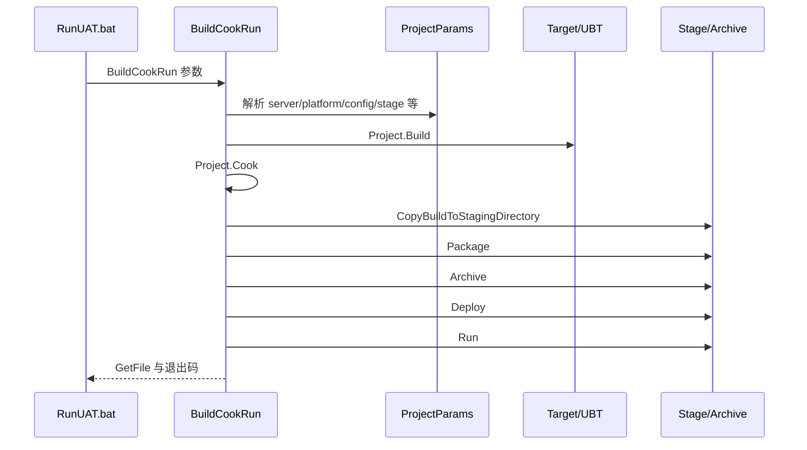

# UE Dedicated Server 构建、烘焙与运行

> 以本机 UE5.8 源码已核对的 UBT/UAT 事实为边界，串起 Server.Target.cs、Build、Cook、Stage、Package、Archive/Deploy 与运行冒烟。

## 元数据

- 版本基线：UE5.8.0 / CL55116800 / ++UE5+Release-5.8
- 适用范围：使用 UnrealBuildTool（UBT）和 AutomationTool（UAT）构建、烘焙、暂存、打包、归档并运行 Dedicated Server 的项目。
- 适用范围：覆盖 Windows/Win64、Linux 目标平台的命令组织、服务端目标规则、烘焙产物、运行配置和最小双客户端冒烟。
- 兼容性边界：版本敏感事实只来自本机 UE5.8 指定源码；项目 Target 名、模块名、地图名、路径和平台 SDK 均不是本文已知事实。
- 兼容性边界：Program Files 下的引擎目录仅作为只读证据源，不应被项目脚本、清理脚本或人工命令修改。
- 兼容性边界：所有带 `<Project>`、`<Map>`、`<Workspace>`、`<StageDir>` 或 `<ArchiveDir>` 的命令都是示意，必须替换后再执行。
- 兼容性边界：示意 `Server.Target.cs` 结构不代表本机存在同名 Target，也不保证包含项目所需的全部规则字段。
- 官方 5.8 文档：https://dev.epicgames.com/documentation/en-us/unreal-engine
- 最后更新：2026-08-06

## 概述

Dedicated Server（专用服务器）是以服务端权威状态、网络连接和玩法规则为核心的构建目标。
它不是把客户端可执行文件改名后运行，而是由 TargetType、编译定义、烘焙数据和运行参数共同形成。
UBT（UnrealBuildTool）负责读取 TargetRules、解析模块并产出目标二进制。
UAT（UnrealAutomationTool）负责把构建、Cook、Stage、Package、Archive、Deploy 和 Run 组织成自动化流程。
Build.bat 是本机引擎提供的 UBT 批处理入口，RunUAT.bat 是本机引擎提供的 AutomationTool 批处理入口。
服务端目标的第一道边界是 `TargetType.Server`，第二道边界是 `WITH_SERVER_CODE` 等编译定义。
服务端运行的第一道门是二进制可启动，第二道门是 Cook 产物齐全，第三道门是端口监听和地图选择正确。
完整验收不能只看 Build 成功，还要验证 Stage 目录、Pak/IoStore 容器、Archive 制品和实际双客户端连接。
本文把“已从本机源码核对的事实”和“项目落地时的示意方案”明确分开。
任何项目实际 Target 名、地图名和目录名都应从项目自身文件清单、构建日志和产物中确认。

## 1. 事实边界与源码证据

本文只把以下本机文件作为 UE5.8 版本敏感事实来源。

| 编号 | 本机源码/脚本路径 | 核对重点 |
| --- | --- | --- |
| 1 | `C:\Program Files\Epic Games\UE_5.8\Engine\Source\Programs\UnrealBuildTool\Configuration\Rules\TargetRules.cs` | `TargetType`、Server、Type、CookedData、EditorOnlyData、TargetType 别名和默认编译方向 |
| 2 | `C:\Program Files\Epic Games\UE_5.8\Engine\Source\Programs\UnrealBuildTool\Configuration\UEBuildTarget.cs` | `WITH_EDITOR`、`WITH_EDITORONLY_DATA`、`WITH_CLIENT_CODE`、`WITH_SERVER_CODE` 等定义写入 |
| 3 | `C:\Program Files\Epic Games\UE_5.8\Engine\Source\Programs\AutomationTool\AutomationUtils\ProjectParams.cs` | Dedicated Server 参数、平台/配置、Stage/Archive/Pak/IoStore/Run 校验与属性 |
| 4 | `C:\Program Files\Epic Games\UE_5.8\Engine\Source\Programs\AutomationTool\Scripts\BuildCookRun.Automation.cs` | BuildCookRun 阶段顺序、DefaultMap 与 Dedicated Server 的 `ServerDefaultMap` 选择 |
| 5 | `C:\Program Files\Epic Games\UE_5.8\Engine\Build\BatchFiles\Build.bat` | UBT 入口位置、参数转发、dotnet/UBT 构建与退出码 |
| 6 | `C:\Program Files\Epic Games\UE_5.8\Engine\Build\BatchFiles\RunUAT.bat` | AutomationTool 入口、编译/预编译选择、参数转发和退出码 |

源码行号会随补丁变化，因此本文以符号、参数和分支含义为主。
本机核对命中的是 UE5.8.0 / CL55116800 / ++UE5+Release-5.8 对应文件，不代表任意分支的实现都相同。
Program Files 下的文件不能作为项目输出目录，也不能作为清洁制品目录。
项目自己的 `.Target.cs`、`.uproject`、`DefaultEngine.ini`、CI 脚本和 Target 名需要项目团队单独核对。

## 2. 核心概念表

| 概念 | 英文 | 作用 | 本机核对锚点 | 常见误区 |
| --- | --- | --- | --- | --- |
| 构建工具 | UnrealBuildTool / UBT | 解析 TargetRules、模块和平台并生成目标 | `Build.bat`、`TargetRules.cs`、`UEBuildTarget.cs` | 以为 UAT 会替代 UBT 的目标规则 |
| 自动化工具 | UnrealAutomationTool / UAT | 编排 Build、Cook、Stage、Package、Archive、Deploy、Run | `RunUAT.bat`、`BuildCookRun.Automation.cs` | 只把 UAT 当成压缩脚本 |
| 目标类型 | TargetType | 区分 Game、Editor、Client、Server、Program | `TargetRules.cs` | 把 Client 当作没有服务器代码的 Server |
| 服务端目标 | Server Target | 生成 Cooked monolithic server 目标 | `TargetType.Server` | 编造一个项目实际 Target 名 |
| 编译定义 | Compile Definitions | 控制编辑器、客户端、服务器代码编译边界 | `UEBuildTarget.cs` | 只看可执行文件名不看宏 |
| 烘焙 | Cook | 将资源处理为目标平台运行数据 | `BuildCookRun.Automation.cs`、`ProjectParams.cs` | 把 Cook 当作复制源文件 |
| 暂存 | Stage | 把构建和 Cook 产物整理到运行/打包目录 | `Project.CopyBuildToStagingDirectory` | 没有 Stage 就直接要求 Pak/Deploy |
| 打包 | Package | 将 Stage 内容制作成平台交付形式 | `Project.Package` | 以为 Archive 等于 Package |
| 归档 | Archive | 把制品复制到归档目录 | `Project.Archive` | 覆盖旧制品而不保留版本 |
| 部署 | Deploy | 把已准备的制品部署到目标位置 | `Project.Deploy` | 把本地 Archive 当成远端部署成功 |
| IoStore | I/O Store | 生成 I/O Store 容器文件 | `-iostore`、`-skipiostore` | 同时开启互斥或不兼容的输出策略 |
| Pak | Pak | 生成 Pak 文件 | `-pak` | 未 Stage 就要求生成 Pak |
| Manifest | Streaming Install Manifest | 为流式安装/分块等流程生成清单 | `-manifests` | 清理时丢掉唯一可追踪清单 |
| 运行 | Run | 构建后启动游戏或服务端 | `-run`、`Project.Run` | 运行成功等于登录和复制成功 |

## 3. 构建闭环

构建闭环的最小链路是：TargetRules → UBT → Server 二进制 → UAT BuildCookRun → Cook → Stage。
交付链路继续经过 Package、Archive 或 Deploy，运行链路最后进入 ServerDefaultMap 和监听验证。
每个阶段都应留下构建版本、配置、平台、命令行和产物目录。
缺少任一阶段的证据，排障时就可能把“未生成”误认为“运行时加载失败”。

```mermaid
flowchart LR
    A[Server.Target.cs 示意] --> B[UBT 读取 TargetRules]
    B --> C[TargetType.Server 与编译定义]
    C --> D[Build.bat 转发到 UnrealBuildTool]
    D --> E[Server 二进制]
    E --> F[RunUAT.bat BuildCookRun]
    F --> G[Build]
    G --> H[Cook]
    H --> I[Stage]
    I --> J{Pak / IoStore}
    J --> K[Package]
    J --> L[Archive]
    K --> L
    L --> M[Deploy 或运行目录]
    M --> N[ServerDefaultMap]
    N --> O[监听与双客户端冒烟]
    O --> P[日志、Manifest、符号与构建报告]
```



图中的节点是流程语义，具体项目可跳过某些可选输出，但必须记录跳过原因。
`BuildCookRun` 在源码中按 Build、Cook、复制到 Stage、Package、Archive、Deploy、Run、GetFile 的顺序组织调用。
各方法是否真正执行工作由 `ProjectParams` 中的参数和内部条件决定。
因此“调用顺序存在”不等于“每次命令都会产生所有类型制品”。

## 4. Server.Target.cs 结构

`Server.Target.cs` 是项目侧 TargetRules 文件，文件名和类名由项目决定。
本文没有核对任何项目的真实 Target 名，下面仅展示结构示意。

```csharp
// 方案示意：<Project>、<Module> 和路径都是占位符，不是本机项目事实。
using UnrealBuildTool;

public class <Project>ServerTarget : TargetRules
{
    public <Project>ServerTarget(TargetInfo Target) : base(Target)
    {
        Type = TargetType.Server;
        ExtraModuleNames.Add("<Module>");
    }
}
```

上例的关键不是类名，而是把 `Type` 设置为 `TargetType.Server`。
`ExtraModuleNames` 代表项目需要加入的模块列表，实际模块名必须以项目文件为准。
如果项目有多个服务端 Target，应该为每个 Target 明确平台、配置和输出命名策略。
不要把 `MyGameServer` 或其他名称写成用户项目已经存在的事实。
不要在 TargetRules 中硬编码本机 Program Files 引擎路径。
不要把 Cook、Stage 和运行参数塞进 TargetRules；它们属于 UAT/运行配置层。
TargetRules 解决“编译什么”，ProjectParams 解决“怎样执行流水线”。

### 4.1 TargetType.Server 的本机事实

本机 `TargetRules.cs` 在 `TargetType` 枚举中列出 Game、Editor、Client、Server、Program。
其中 Server 的注释描述为 Cooked monolithic game server executable，并说明不含 client code。
同文件的 `Type` 属性类型是 `global::UnrealBuildTool.TargetType`，默认值为 Game。
同文件还有一个静态 `TargetRules.TargetType` 别名类。
别名类提供 Game、Editor、Client、Server、Program 五个常量，常量类型仍然是全局枚举。
因此源码中可能出现 `TargetType.Server` 的别名用法，也可能出现全限定枚举用法。
遇到命名冲突时，应以编译器解析和当前文件上下文为准。

### 4.2 Server 相关默认属性

本机 `TargetRules.cs` 中，`bBuildRequiresCookedData` 的默认表达式对 Game、Client、Server 为真。
这表示这些目标默认按需要 Cooked Data 的方向构建，不能把 Server 当作 Editor 目标处理。
本机 `bBuildWithEditorOnlyData` 的默认表达式只对 Editor 或 Program 为真。
该属性的注释说明它影响 `WITH_EDITORONLY_DATA` 的编译方向，且不同平台存在额外约束。
本机 `bWithClientCode` 的默认表达式是 `Type != TargetType.Server`。
本机 `bWithServerCode` 的默认表达式是 `Type != TargetType.Client`。
这两个属性解释了“服务端不带客户端代码”和“客户端不带服务端代码”之间的默认边界。
如果项目显式覆写这些属性，应把覆写原因、目标平台和运行验证写进构建记录。

## 5. UEBuildTarget 与编译定义

`UEBuildTarget.cs` 是 UBT 目标构建阶段的事实锚点之一。
本机源码在生成全局编译环境时写入编辑器、客户端和服务端相关定义。
当规则满足编辑器条件时会加入 `WITH_EDITOR=1`，否则在没有已有定义时加入 `WITH_EDITOR=0`。
当 `bBuildWithEditorOnlyData == false` 时会加入 `WITH_EDITORONLY_DATA=0`。
随后根据 `Rules.bWithClientCode` 写入 `WITH_CLIENT_CODE=0/1`。
随后根据 `Rules.bWithServerCode` 写入 `WITH_SERVER_CODE=0/1`。
因此 `WITH_SERVER_CODE` 不是一个只由文件名推断的字符串，而是由 TargetRules 属性进入全局编译环境。
本机 `TargetRules.cs` 在 Server 分支还加入 `UE_SERVER=1` 与 `USE_NULL_RHI=1`。
这些定义影响模块中条件编译和服务器运行形态，但不替代 UAT 的 Cook、Stage 或 Run 参数。

| 定义 | 写入条件/来源 | 解释边界 |
| --- | --- | --- |
| `UE_SERVER=1` | TargetRules 的 Server 类型分支 | 本机源码确认的 Server 分支定义 |
| `USE_NULL_RHI=1` | TargetRules 的 Server 类型分支 | 本机源码确认的 Server 分支定义 |
| `WITH_EDITOR=1/0` | UEBuildTarget 按编辑器编译条件 | 不等于运行时是否有编辑器进程 |
| `WITH_EDITORONLY_DATA=0` | `bBuildWithEditorOnlyData == false` | 具体平台还受源码注释中的平台规则约束 |
| `WITH_CLIENT_CODE=0/1` | `Rules.bWithClientCode` | 默认 Server 为 0 的方向 |
| `WITH_SERVER_CODE=0/1` | `Rules.bWithServerCode` | 默认 Client 为 0 的方向 |

不要通过手工在项目 `.cpp` 中定义这些宏来模拟 Server Target。
应该让 UBT 从 TargetRules 和目标类型生成一致的编译环境。

## 6. Build.bat：UBT 入口

本机 `Engine/Build/BatchFiles/Build.bat` 的注释说明它应位于该目录，复制到其他位置运行可能不正确。
脚本约定前三个位置参数分别是游戏名、平台名和配置名，其他参数直接传给 UnrealBuildTool。
脚本首先检查相对的 Engine/Source 目录，然后把当前工作目录切换到 Engine/Source。
脚本调用 `GetDotnetPath.bat` 检查 dotnet 环境。
如果存在 UBT 工程或相应脚本，它可能先构建 UnrealBuildTool。
脚本最终以 `dotnet <UnrealBuildTool.dll> %*` 形式运行 UBT，并返回 UBT 退出码。
因此 Build.bat 的职责是入口、路径、锁和转发，不是项目 TargetRules 的替代实现。
在 CI 中应记录 Build.bat 的完整参数和返回码。

```bat
REM 方案示意：<ProjectServer>、<Workspace> 是占位符。
"C:\Program Files\Epic Games\UE_5.8\Engine\Build\BatchFiles\Build.bat" <ProjectServer> Win64 Development -Project="<Workspace>\<Project>.uproject"
```

上面的 Windows 路径只代表调用位置示意，不表示允许修改 Program Files。
`<ProjectServer>` 必须替换为项目实际 Target 名，不能从本文推断。
`Win64` 和 `Development` 是示意的平台与配置值。

## 7. RunUAT.bat：AutomationTool 入口

本机 `Engine/Build/BatchFiles/RunUAT.bat` 的注释说明它同样应位于 Engine/Build/BatchFiles。
脚本将当前工作目录切换到 Engine 根目录，并检查 dotnet。
它识别 `-msbuild-verbose`、`-compile`、`-nocompileuat` 和 `-noturnkeyvariables` 等入口参数。
未被强制跳过时，脚本会根据安装构建、预编译条件和工程文件选择编译或使用预编译 AutomationTool。
运行阶段进入 UAT 二进制所在目录，并以 `dotnet AutomationTool.dll %*` 转发其余参数。
脚本保存 UAT 退出码，并在需要时处理 Turnkey 产生的环境变量文件。
UAT 非零退出码会进入失败分支并返回失败状态。
因此 RunUAT.bat 失败可能发生在 dotnet、AutomationTool 编译、参数校验、Cook、Stage、Package 或 Run 阶段。

| 入口 | 主要工具 | 直接职责 | 典型调用 |
| --- | --- | --- | --- |
| `Build.bat` | UnrealBuildTool | 构建指定 Target | `<Target> <Platform> <Configuration>` |
| `RunUAT.bat` | AutomationTool | 编排 BuildCookRun 等自动化命令 | `BuildCookRun -project=...` |
| `Build.bat` | UBT | 将额外参数原样转发到 UBT | `-Project=...` 等项目参数 |
| `RunUAT.bat` | UAT | 解析 ProjectParams 并控制流水线 | `-server -stage -archive` |

## 8. ProjectParams：Dedicated Server 参数

本机 `ProjectParams.cs` 的参数帮助与解析代码是 BuildCookRun 命令差异的主要事实来源。
`DedicatedServer` 属性解析 `dedicatedserver` 和 `server` 两个命令名。
因此 `-server` 是本机源码中与 `-dedicatedserver` 对应的输入别名。
`NoClient` 解析 `noclient`，含义是只运行服务端而不启动客户端。
`ServerTargetPlatforms` 同时接受 `ServerTargetPlatform` 和 `ServerPlatform` 的参数形式。
`ServerConfigsToBuild` 可从 `serverconfig` 解析多个以 `+` 分隔的配置名。
`StageDirectoryParam` 解析 `stagingdirectory`，`ArchiveDirectoryParam` 解析 `archivedirectory`。
`Pak`、`IoStore`、`SkipIoStore`、`Stage`、`Archive`、`Run` 和 `Manifests` 都有对应属性。

| 命令参数 | 本机源码含义 | 注意事项 |
| --- | --- | --- |
| `-server` | DedicatedServer 别名 | 不代表项目 Target 名固定 |
| `-dedicatedserver` | DedicatedServer 明确写法 | 仍需补 project/平台/配置 |
| `-noclient` | 不运行客户端，只运行服务端 | 受 ProjectParams 组合校验 |
| `-serverconfig=Development` | 选择服务端配置 | 可按源码逻辑使用 `+` 分隔 |
| `-serverplatform=Win64` | 服务端目标平台别名 | 与 `-servertargetplatform` 对应 |
| `-servertargetplatform=Linux` | 服务端目标平台 | 需要平台工具链 |
| `-stage` | 开启暂存 | Pak/Deploy 依赖 Stage 或 SkipStage |
| `-stagingdirectory=<dir>` | 指定暂存目录 | 使用独立构建目录 |
| `-archive` | 开启归档 | 不等于部署成功 |
| `-archivedirectory=<dir>` | 指定归档目录 | 防止覆盖旧版本 |
| `-pak` | 生成 Pak | 本机校验要求 Stage/SkipStage |
| `-iostore` | 生成 I/O Store 容器 | 需按平台策略验证 |
| `-skipiostore` | 覆盖不运行 IoStore | 不等于删除旧容器 |
| `-manifests` | 生成 streaming install manifests | 与 Cook/Stage 绑定 |
| `-run` | 构建后运行游戏 | 不等于登录成功 |

本机源码校验 `Pak` 无 Stage 时会报错，除非使用允许的 SkipStage 语义。
本机源码校验 Deploy 无 Stage 时会报错。
本机源码校验 `-noclient` 只能与 `-server` 或 CookOnTheFly 相关路径使用。
本机源码还校验 `-pak` 与 `-fileserver` 不可同时使用。

## 9. BuildCookRun 阶段

本机 `BuildCookRun.Automation.cs` 定义 `BuildCookRun` 类，并在 `ExecuteBuild` 中建立参数、调用 `DoBuildCookRun`。
`DoBuildCookRun` 依次调用 `Project.Build`、`Project.Cook`、`Project.CopyBuildToStagingDirectory`、`Project.Package`、`Project.Archive`、`Project.Deploy`、`Project.Run` 和 `Project.GetFile`。
本文将 `CopyBuildToStagingDirectory` 称为 Stage 阶段，是对方法职责的中文解释。
各阶段是否真正产生制品由参数、平台和项目实现决定。



| 阶段 | 源码调用锚点 | 主要证据 |
| --- | --- | --- |
| Build | `Project.Build` | Server 二进制与编译日志 |
| Cook | `Project.Cook` | Cooked Data、地图和 Cook 日志 |
| Stage | `Project.CopyBuildToStagingDirectory` | 可运行 Stage 目录 |
| Package | `Project.Package` | Pak/IoStore 或平台交付形式 |
| Archive | `Project.Archive` | 版本化归档目录 |
| Deploy | `Project.Deploy` | 目标位置与部署日志 |
| Run | `Project.Run` | 进程、地图、端口和退出码 |

## 10. ServerDefaultMap 选择

本机 `BuildCookRun.Automation.cs` 的 `GetDefaultMap` 先寻找项目 `Config/DefaultEngine.ini`。
如果项目配置文件不存在，它会尝试引擎配置路径中的 BaseEngine.ini。
当 DedicatedServer 参数为真时，`GetDefaultMapFromIni` 使用 `ServerDefaultMap` 作为配置键。
如果 DedicatedServer 没有找到服务端地图，它会再尝试 `GameDefaultMap`。
如果仍未找到 DefaultMap，本机代码把 `/Engine/Maps/Entry` 作为回退值。
服务端 Target、Cook 数据和 ServerDefaultMap 是三个不同维度。

```ini
; 方案示意：项目 Config/DefaultEngine.ini，不是本机项目事实。
GameDefaultMap=/Game/Maps/<ClientMap>
ServerDefaultMap=/Game/Maps/<ServerMap>
```

配置示意的重点是服务端存在独立的 `ServerDefaultMap` 语义。
如果只配置 GameDefaultMap，DedicatedServer 路径可能按源码回退到它。
如果两者都没有，运行 `/Engine/Maps/Entry` 往往不是项目想要的战斗地图，应在验收中明确记录。
日志应记录最终选择的地图字符串，而不是只记录“服务器启动成功”。

## 11. Win64、Linux 与产物隔离

Win64 通常以 Windows 主机上的 Build.bat/RunUAT.bat 作为入口。
Linux 可以作为 UBT/UAT 的目标平台参数，但需要目标平台工具链和项目模块支持。
ProjectParams 为服务端提供 `ServerTargetPlatform` 与 `ServerPlatform` 别名。
服务器跨平台构建时，Cook 平台、Stage 目录、二进制目录和运行节点要分别记录。
不能把 Win64 的可执行文件、Pak 或 IoStore 容器当成 Linux 制品。
不能把同一个 Stage 目录先写 Win64 再写 Linux，除非项目有严格隔离和清单策略。

| 维度 | Win64 示意 | Linux 示意 | 验收重点 |
| --- | --- | --- | --- |
| Build 平台 | `Win64` | `Linux` | 工具链、Target、配置 |
| Server 参数 | `-serverplatform=Win64` | `-servertargetplatform=Linux` | 目标平台选择 |
| Stage | 独立 Win64 Stage | 独立 Linux Stage | 不混用目录 |
| Archive | Win64 版本目录 | Linux 版本目录 | BuildId 与平台标签 |
| Run | Windows 进程 | Linux 进程/容器 | 权限、端口、日志 |

```bat
REM 方案示意：不代表当前机器安装了 Linux SDK。
"C:\Program Files\Epic Games\UE_5.8\Engine\Build\BatchFiles\Build.bat" <ProjectServer> Linux Development -Project="<Workspace>\<Project>.uproject"
```

## 12. 命令与配置示例

所有 `<...>` 都是项目占位符，示例不会声称存在实际 Target 名。

```bat
REM 方案示意：只 Build Server。
"C:\Program Files\Epic Games\UE_5.8\Engine\Build\BatchFiles\Build.bat" <ProjectServer> Win64 Development -Project="<Workspace>\<Project>.uproject"
```

```bat
REM 方案示意：Server-only Cook/Stage。
"C:\Program Files\Epic Games\UE_5.8\Engine\Build\BatchFiles\RunUAT.bat" BuildCookRun -project="<Workspace>\<Project>.uproject" -noP4 -server -noclient -serverconfig=Development -serverplatform=Win64 -stage -stagingdirectory="<StageDir>"
```

```bat
REM 方案示意：Pak + Archive。
"C:\Program Files\Epic Games\UE_5.8\Engine\Build\BatchFiles\RunUAT.bat" BuildCookRun -project="<Workspace>\<Project>.uproject" -noP4 -server -noclient -serverconfig=Development -serverplatform=Win64 -stage -pak -archive -archivedirectory="<ArchiveDir>"

REM 方案示意：IoStore + Archive。
"C:\Program Files\Epic Games\UE_5.8\Engine\Build\BatchFiles\RunUAT.bat" BuildCookRun -project="<Workspace>\<Project>.uproject" -noP4 -server -noclient -serverconfig=Development -serverplatform=Win64 -stage -iostore -archive -archivedirectory="<ArchiveDir>"
```

如果要明确不运行 IoStore，可在项目允许的组合中增加 `-skipiostore`。
`-pak` 和 `-iostore` 的实际输出必须查看制品目录与日志，不要只看命令行。

## 13. 清洁制品、Manifest 与符号

清洁（Clean）不是把整个引擎目录删除，而是清理项目工作区中可重建的中间产物。
Program Files 下的 UE5.8 安装目录只读，不能作为清理目标。
常见项目清洁范围包括项目 `Binaries`、`Intermediate`、`Saved` 下的构建缓存和自定义 Stage/Archive 目录。
清洁前先保存构建命令、Target、平台、配置、提交号和错误日志。
清洁后重新生成的制品必须带新的 BuildId，不能与旧 Archive 混用。
Manifest 要和对应 Cook/Stage/容器版本一起保存，避免只有清单而找不到内容。
符号文件要和实际二进制严格匹配，并进入受控的符号存储，不应上传到客户端运行目录。
服务器发布包可以按安全策略移除开发符号，但 Crash 解析流程必须能从 BuildId 找到符号。

```text
<Workspace>/
  Binaries/                 # 项目二进制示意
  Intermediate/             # UBT 中间产物示意
  Saved/                    # 项目运行与工具输出示意
  BuildArtifacts/
    <BuildId>/
      Stage/
      PakOrIoStore/
      Manifests/
      Symbols/
      Logs/
      Archive/
```

以上目录是项目制品管理示意，不是本文声称存在的本机目录。
Manifest 要绑定平台、配置、Target、Cook 参数和 BuildId。
符号要按 BuildId、平台、配置和模块版本保存，不能用“最新符号”覆盖历史构建。

## 14. 双客户端冒烟

双客户端冒烟的目的，是证明 Server 二进制、地图、监听、登录和最小复制可以连成一条路径。
它不是压力测试，也不是完整网络一致性测试。

```powershell
# 方案示意：<ProjectServer>Server.exe 不代表本机已有此文件。
& '<StageDir>\<ProjectServer>Server.exe' '<ServerMap>?Port=7777' -log -unattended -NoSound

# 方案示意：两个客户端分别启动。
& '<ClientDir>\<Project>.exe' '127.0.0.1:7777' -log
& '<ClientDir>\<Project>.exe' '127.0.0.1:7777' -log
```

运行前确认服务端已经选择预期的 ServerDefaultMap。
运行后确认两个客户端都完成连接/登录，而不是只有进程窗口出现。
至少记录服务器日志、两个客户端日志、构建 ID、地图、端口和连接时间。
如果项目使用平台票据或外部认证，冒烟脚本必须替换为项目实际认证流程。

```powershell
# 方案示意：端口值必须替换为项目实际配置。
Get-NetTCPConnection -State Listen -LocalPort 7777
```

端口监听只证明基础端口状态，仍需验证协议、登录和初始复制。

## 15. 清单与验收矩阵

| 验收层 | 必查证据 | 通过标准 |
| --- | --- | --- |
| UBT | Target、平台、配置、编译日志 | 目标明确且无编译错误 |
| Cook | Cook 日志、地图、资源错误 | 目标地图和依赖完成 |
| Stage | 文件清单、大小、时间、版本 | 可运行目录自洽 |
| Pak/IoStore | 容器、索引、清单 | 与 Stage 和配置匹配 |
| Archive | BuildId、提交号、平台、配置 | 目录不可混淆或覆盖 |
| Symbols | 二进制匹配、上传记录 | Crash 可按 BuildId 符号化 |
| Run | 退出码、监听、地图、登录 | 最小冒烟完成 |

## 16. 失败路径

| 阶段 | 症状 | 优先检查 | 处置方向 |
| --- | --- | --- | --- |
| Build | Target 找不到 | 项目实际 Target 文件和类名 | 不猜名字，重新列清单 |
| Build | 服务端代码条件错误 | `Type`、`bWithServerCode`、`WITH_SERVER_CODE` | 修 Target 后清洁重编 |
| Cook | 地图缺失 | `ServerDefaultMap`、Cook 日志 | 修配置并重新 Cook |
| Stage | 二进制或资源不全 | Stage 清单、复制日志 | 新建干净 Stage |
| Pak | 校验要求 Stage | `-stage`/`-skipstage` 组合 | 按 ProjectParams 约束重跑 |
| IoStore | 容器缺失 | `-iostore`、`-skipiostore` | 单路线重新生成 |
| Archive | 制品覆盖 | Archive 目录命名和并发 | 改为 BuildId 目录 |
| Run | 进程启动即退 | 地图、依赖、参数、退出码 | 先用 Loose Stage 定位 |
| Smoke | 客户端连不上 | 监听、端口、地址、认证 | 分离网络与业务问题 |
| Crash | 无法解析栈 | 符号与 BuildId | 追补符号并冻结发布 |

## 17. 真实源码定位

下表列出本机核对过的代表性符号、属性或脚本锚点。

| 文件 | 本机核对锚点 | 说明 |
| --- | --- | --- |
| `TargetRules.cs` | `enum TargetType` | Game、Editor、Client、Server、Program |
| `TargetRules.cs` | `TargetType.Server` | Cooked monolithic server、无 client code 的目标语义 |
| `TargetRules.cs` | `public TargetType Type` | 默认 Target 类型是 Game |
| `TargetRules.cs` | `bBuildRequiresCookedData` | Game/Client/Server 默认需要 Cooked Data |
| `TargetRules.cs` | `bBuildWithEditorOnlyData` | Editor/Program 默认方向 |
| `TargetRules.cs` | `bWithClientCode` / `bWithServerCode` | 客户端/服务端代码边界 |
| `TargetRules.cs` | `TargetRules.TargetType.Server` | Server 枚举别名 |
| `UEBuildTarget.cs` | `WITH_EDITOR` / `WITH_EDITORONLY_DATA` | 编辑器相关定义 |
| `UEBuildTarget.cs` | `WITH_CLIENT_CODE` / `WITH_SERVER_CODE` | 客户端/服务端编译定义 |
| `ProjectParams.cs` | `DedicatedServer` / `NoClient` | `server`/`dedicatedserver`/`noclient` |
| `ProjectParams.cs` | `ServerTargetPlatforms` / `ServerConfigsToBuild` | 服务端平台与配置 |
| `ProjectParams.cs` | `StageDirectoryParam` / `ArchiveDirectoryParam` | Stage/Archive 目录 |
| `ProjectParams.cs` | `Pak` / `IoStore` / `SkipIoStore` / `Manifests` | 容器和清单选项 |
| `ProjectParams.cs` | `Run` | 构建后的 Run 阶段 |
| `BuildCookRun.Automation.cs` | `ExecuteBuild` / `DoBuildCookRun` | 参数设置与阶段入口 |
| `BuildCookRun.Automation.cs` | `GetDefaultMap` / `GetDefaultMapFromIni` | DefaultMap 与 ServerDefaultMap |
| `Build.bat` | `:Main` / `:ReadyToBuild` | UBT 入口、dotnet、参数转发 |
| `RunUAT.bat` | `:RunPrecompiled` / `:DoRunUAT` | UAT 编译/预编译和参数转发 |

这些符号是本机源码事实锚点，不表示项目可以直接调用所有私有方法。
需要确认行为时，按当前版本再次搜索并阅读局部上下文。

## 18. 验证命令

以下命令只读本机 UE5.8 指定文件，适合版本升级或门禁失败时复核。

```powershell
$engine = 'C:\Program Files\Epic Games\UE_5.8\Engine'
$files = @(
  "$engine\Source\Programs\UnrealBuildTool\Configuration\Rules\TargetRules.cs",
  "$engine\Source\Programs\UnrealBuildTool\Configuration\UEBuildTarget.cs",
  "$engine\Source\Programs\AutomationTool\AutomationUtils\ProjectParams.cs",
  "$engine\Source\Programs\AutomationTool\Scripts\BuildCookRun.Automation.cs",
  "$engine\Build\BatchFiles\Build.bat",
  "$engine\Build\BatchFiles\RunUAT.bat"
)
$files | ForEach-Object { [pscustomobject]@{ Exists = Test-Path -LiteralPath $_; Path = $_ } }
```

该命令只做 Test-Path，不写入 Program Files。

```powershell
rg -n --no-heading `
  -e 'TargetType\.Server|bBuildRequiresCookedData|bBuildWithEditorOnlyData|bWithClientCode|bWithServerCode' `
  -e 'WITH_EDITOR|WITH_EDITORONLY_DATA|WITH_CLIENT_CODE|WITH_SERVER_CODE' `
  -e 'dedicatedserver|noclient|serverconfig|serverplatform|servertargetplatform|stagingdirectory|archivedirectory|skipiostore|iostore|manifests' `
  -e 'ServerDefaultMap|DoBuildCookRun|Project\.Build|Project\.Cook|Project\.Package|Project\.Archive|Project\.Deploy|Project\.Run' `
  $files
```

项目侧验证命令是示意，所有 `<...>` 路径都必须替换。

```powershell
Test-Path -LiteralPath '<Workspace>\<Project>.uproject'
Test-Path -LiteralPath '<Workspace>\Source\<Project>Server.Target.cs'
Test-Path -LiteralPath '<Workspace>\Config\DefaultEngine.ini'
Get-ChildItem -LiteralPath '<StageDir>' -Recurse -File | Select-Object FullName, Length
```

## 19. 最佳实践

### 实践 1：Target 名以项目清单为准

先列出项目实际 `.Target.cs` 和构建目标，再编写 CI 命令。
不要从文档中的 `<ProjectServer>` 推断项目存在某个 Target。

### 实践 2：固定版本基线

构建报告同时记录 UE5.8.0、CL55116800、分支标识、项目提交和工具链环境。
版本升级先重新核对六个源码锚点，再更新命令和门禁。

### 实践 3：把 Build 与 BuildCookRun 分开验收

UBT 成功只说明目标二进制构建通过。
UAT 成功还要继续验证 Cook、Stage、容器、Archive 和运行。

### 实践 4：Server-only 命令显式使用 NoClient

当目标是纯服务端冒烟时，明确使用 `-server -noclient` 组合。
这样可以减少客户端启动对诊断结果的干扰。

### 实践 5：平台和配置显式记录

把 `-serverplatform`、`-serverconfig` 和 Target 写入制品元数据。
Win64 与 Linux 使用独立 Stage、Archive 和 Manifest。

### 实践 6：ServerDefaultMap 设为必验项

每次服务端构建都记录最终地图来源，是 ServerDefaultMap、GameDefaultMap 还是引擎回退。
禁止在生产环境静默接受意外的 `/Engine/Maps/Entry`。

### 实践 7：Pak 与 IoStore 分路线

一次流水线明确主要容器路线，分别保存参数和制品。
不要把旧 Pak、旧 IoStore 和新 Stage 混在同一目录。

### 实践 8：Stage 和 Archive 不复用脏目录

每个 BuildId 使用独立 Stage 和 Archive，避免旧文件掩盖 Cook 缺失。
清洁前保存日志、Manifest 和符号索引。

### 实践 9：符号随版本归档

符号按 BuildId、平台、配置和模块版本保存。
Crash 无法符号化时，版本不应被标记为完全可发布。

### 实践 10：双客户端冒烟后再做压力测试

先证明一个 Server 加两个 Client 能启动、连接、登录和完成初始复制。
再扩大并发、地图复杂度、网络故障和长时间运行测试。

## 20. 常见问题 FAQ

### Q1：为什么 Server.Target.cs 写了 Server，但没有 Cooked 数据？

TargetType.Server 解决的是目标编译方向，不替代 UAT Cook。
需要检查是否执行了 BuildCookRun 的 Cook/Stage 路径，以及地图和依赖是否进入 Stage。

### Q2：`-server` 和 `-dedicatedserver` 有什么差异？

本机 ProjectParams 解析代码把 `server` 和 `dedicatedserver` 都映射到 DedicatedServer 属性。
团队可以选一种标准写法，但应以当前分支源码为准。

### Q3：什么时候使用 `-noclient`？

当目标是只运行服务端、不启动客户端的流程时使用。
本机源码还对它的合法组合做了校验，不能脱离 `-server` 或相关 CookOnTheFly 路径任意使用。

### Q4：为什么 `-pak` 报错要求 Stage？

ProjectParams 对 Pak 与 Stage 有组合约束；没有 Stage 时必须显式使用允许的 SkipStage 语义。
先确认目标是从现有 Stage 生成 Pak，还是需要完整重新 Stage。

### Q5：`-iostore` 与 `-skipiostore` 应怎样使用？

发布脚本应只保留清晰的一条路线，并检查输出容器，而不是依赖冲突开关的隐式优先级。
`-skipiostore` 不是清除已有容器的命令。

### Q6：ServerDefaultMap 没配置会发生什么？

源码路径会先尝试服务端键，再按 DedicatedServer 分支回退到 GameDefaultMap，最后回退到 `/Engine/Maps/Entry`。
项目应把最终地图作为日志和冒烟验收项。

### Q7：Build.bat 和 RunUAT.bat 为什么都需要 dotnet？

本机脚本分别需要调用 UnrealBuildTool.dll 或 AutomationTool.dll，并在必要时编译对应工具。
dotnet、工具 DLL、批处理所在目录和退出码都应纳入 CI 诊断。

### Q8：Linux Server 能否直接使用 Win64 Cook 结果？

不应这样假设。平台、二进制、Cook 数据、容器和运行依赖要按目标平台单独验证。
使用平台参数只是选择目标，不等于 SDK 已安装。

### Q9：Archive 成功后为什么运行仍然失败？

Archive 只说明归档阶段完成，不保证地图、端口、配置、动态库、容器和权限都满足运行条件。
从 Archive 解包后要执行独立的 Server 启动和双客户端冒烟。

### Q10：为什么不能删除 Program Files 下的引擎目录来“清洁重编”？

本文把 Program Files 引擎当作只读证据源。清洁应针对项目工作区的 Binaries、Intermediate、Saved、Stage 或 Archive。
引擎安装损坏应走安装/版本管理流程，不应由项目清洁脚本删除。

## 21. 关联阅读

- [UBT构建系统与编译配置](01-UBT构建系统与编译配置.md)
- [UAT与自动化打包](02-UAT与自动化打包.md)
- [资源管理与热更新](04-资源管理与热更新.md)
- [全栈质量门禁与灰度回滚](08-全栈质量门禁与灰度回滚.md)
- [网络同步](../06-网络同步/README.md)
- [服务端](../../游戏服务端/README.md)
- [质量](../../游戏测试与质量/README.md)
- [引擎源码分析](../12-引擎源码分析/README.md)

这些链接用于补充工具链、网络、服务端、质量和源码阅读背景。
本文的 UE5.8 版本事实仍以元数据和前述六个本机源码文件为边界。

## 22. 更新日志

| 日期 | 版本 | 更新内容 |
| --- | --- | --- |
| 2026-08-06 | v1.0 | 新增 UE5.8 Dedicated Server 构建、烘焙、暂存、容器、归档与运行专题；核对 UBT/UAT 指定源码入口、参数和 ServerDefaultMap。 |

本篇首次创建，项目占位符、Server.Target.cs 和命令均明确标注为示意。
后续引擎补丁升级时，应重新执行 Test-Path、rg、行数、BOM、diff 和 check_repo 验证。
