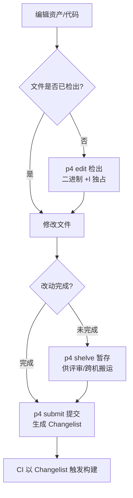
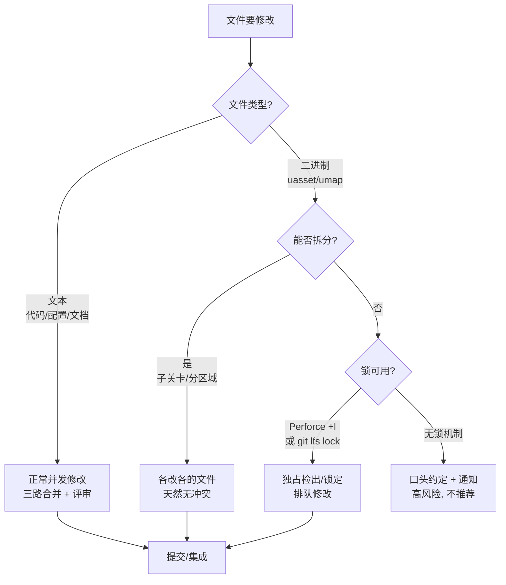
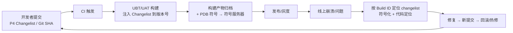

# 12 版本控制与资产协作

> 版本基线：UE 5.8.0（本机 `Engine/Build/Build.version`：CL 55116800，分支 `++UE5+Release-5.8`）。
> 适用范围：UE5 项目的源码与资产版本控制、多人协作与 CI 集成；覆盖 Perforce 与 Git LFS 两条主流路线，兼顾单机/主机/移动与 DS（Dedicated Server）项目。
> 事实边界：Perforce / Git LFS 属于平台工具，命令与配置以实际部署为准；UE 相关结论（uasset 二进制合并限制、关卡拆分方式、检出策略、实验性文本资产格式）以官方文档与工程经验为边界，涉及版本差异处已标注"待核对"。
> 官方参考：https://dev.epicgames.com/documentation/en-us/unreal-engine （"版本控制 / Source Control" 章节）。
> 最后更新：2026-08-07。

## 一、概述

UE 项目的版本控制与纯代码项目有本质区别：**资产（`.uasset` / `.umap`）是二进制文件**，不能像源码一样做三路合并；同时一个现代项目动辄数万资产、数十人协作，版本控制策略直接决定团队的生产效率与冲突成本。

本文围绕两条主流路线展开：

- **Perforce（Helix Core）**：UE 官方推荐、主机与大型团队主流。基于"检出-提交"模型，天然适合二进制资产；
- **Git + Git LFS**：代码优先/中小团队主流。基于"本地仓库 + 推送"模型，用 LFS 把大二进制资产挪到指针文件之外。

核心矛盾始终是同一个：**二进制资产"不可合并"，只能靠拆分、锁定与流程来避免冲突**。因此本文的篇幅重点不是工具命令本身，而是：

1. UE 资产的二进制本质与"哪些能 diff、哪些不能"；
2. 两条路线各自的检出/提交/锁定工作流；
3. 关卡拆分与多人协作的组织方式；
4. 锁 vs 合并的策略矩阵；
5. CI 中 changelist / build id 的追溯链路；
6. 备份与恢复。

## 二、核心概念（表格速览）

| 概念 | 是什么 | 关键点 |
| --- | --- | --- |
| `.uasset` / `.umap` | UE 二进制资产文件（序列化包） | 不可文本合并，只能锁定/排队 |
| 文本资产 | `.uproject` / `.uplugin` / `.ini` / `*.Build.cs` / `*.Target.cs` | 可 diff、可合并，走正常评审 |
| Text Asset（实验） | UE5 实验性 JSON 风格文本资产（`.utxt`） | 便于 diff 但功能受限，待核对 |
| Changelist（CL） | Perforce 提交编号 | 全局递增，是构建/符号追溯的主键 |
| Commit / SHA | Git 提交编号 | 本地生成，push 后成为团队事实 |
| Depot / Stream | Perforce 仓库与流（分支） | Stream 自带继承/映射语义 |
| Workspace | Perforce 客户端工作区（映射视图） | 一人一工作区，映射到子目录 |
| 检出 / Checkout | 打开文件进入可写状态 | 二进制资产应配独占检出（`+l`） |
| Shelve | 暂存未提交改动 | 代码评审、跨机搬运 |
| 独占锁 | 同一时刻仅一人可写 | P4 `+l` 文件类型 / `git lfs lock` |
| LFS 指针文件 | Git 仓库内的小文本替身 | `oid sha256:` + `size`，真实内容在 LFS 服务器 |
| `.gitattributes` | 定义 LFS 跟踪规则 | `*.uasset filter=lfs diff=lfs merge=lfs -text` |
| 分支 / 集成 | 并行开发与合并回流 | 二进制资产跨分支合并 ≈ 复制覆盖 |
| Build ID | 构建版本号（含 changelist） | UBT/UAT 注入，崩溃符号按它归档 |
| 符号服务器 | 按 changelist 归档 PDB | 崩溃栈还原的前提 |
| `.p4ignore` / `.gitignore` | 忽略生成物清单 | Intermediate/Saved/Binaries 等不入库 |
| Level Instance | 关卡实例（UE5.0+） | 子关卡实例化，避免复制粘贴冲突 |
| World Partition | 世界分区（UE5.0+） | 大世界按网格切分，多人分区域编辑 |

## 三、原理详解

### 3.1 UE 资产的二进制本质

UE 资产是 **UPackage 序列化产物**：`.uasset` 内部由包文件头（`FPackageFileSummary`）、导入表（Import Table）、导出表（Export Table）与依赖引用构成。这意味着：

- **引用是"指针"而非文本路径**：两个资产之间的关系（如材质引用贴图、关卡引用 Actor 资产）在二进制里是索引与对象引用，文本 diff 工具看到的只是乱码；
- **版本无关的字节变化**：同一次逻辑修改，因 UE 版本、保存方式（全量/增量保存）、压缩策略不同，字节级 diff 会爆炸式变化；
- **编辑器独占写入**：资产保存由编辑器负责，外部工具直接改字节会破坏包结构，导致"资产打不开/引用丢失"。

因此行业共识是：**`.uasset`/`.umap` 不做文本合并，只做"锁定 + 排队"或"整体覆盖"**。而以下文件是纯文本，可以正常 diff/合并/评审：

- 工程描述：`.uproject`、`.uplugin`；
- 配置：`Config/Default*.ini`（注意 `Saved/Config` 是本地生成，不入库）；
- 代码：`*.h` / `*.cpp` / `*.Build.cs` / `*.Target.cs`；
- 构建与 CI 脚本、文档。

**实验性 Text Asset 格式**：UE5.0+ 提供 JSON 风格的文本资产（`.utxt`），目标是让资产可读可 diff；但官方定位为实验性，复杂资产（蓝图、体积数据等）支持受限，跨版本稳定性一般（具体启用方式与限制**待核对**）。生产项目通常仍以二进制资产为主。

### 3.2 Perforce 工作流（团队/美术主流）

Perforce 的模型是"服务器权威 + 工作区检出"：

1. 每个开发者/美术一个 **Workspace**，通过映射（`//depot/Game/... //ws/Game/...`）只拉取需要的子目录；
2. 修改文件前先 **Checkout（检出）**，文件从只读变为可写；二进制资产建议使用 `+l`（独占）类型，同一时刻只允许一个人检出；
3. 修改完成后 **Submit（提交）**，形成全局递增的 **Changelist**；
4. 未完成的改动可 **Shelve（暂存）** 到服务器，供他人取用或评审；
5. 分支通过 **Stream**（流）管理：main → dev/feature，资产跨流集成时是"整体复制覆盖"，必须走评审与人工确认。



*图释：Perforce 的检出-提交主循环。二进制资产靠 `+l` 独占检出把"并发写"转化为"排队写"，冲突从合并问题降级为流程问题。*

关键命令见 4.1 节。**UE 编辑器原生集成 Perforce**：在"编辑器偏好设置 → 源码管理"中选择 Perforce 并登录后，Content Browser 内修改资产会自动提示检出（默认开启"修改资产时提示检出"），提交也可在编辑器内完成。

### 3.3 Git LFS 工作流（代码优先/小团队）

Git LFS 的思路：**仓库里只存小指针文件，大文件内容放 LFS 服务器**。

1. 通过 `.gitattributes` 声明哪些扩展名走 LFS（`*.uasset`、`*.umap`、`*.uplugin` 等）；
2. `git add` 时，LFS 钩子把真实文件上传到 LFS 存储，并把指针文件（`version` + `oid sha256:` + `size`）写入 Git 对象库；
3. `git clone` 后执行 `git lfs pull` 拉取真实内容（部分 CI 环境需显式执行）；
4. 二进制"锁"通过 `git lfs lock` 实现：锁定的文件在他人 `git lfs locks` 中可见，配合服务端 hook 可强制"锁定后才能 push"。

指针文件示例（真实内容在 LFS 服务器，Git 仓库里只有这一行文本）：

```text
version https://git-lfs.github.com/spec/v1
oid sha256:4d7a214614ab2935c943f9e0ff69d22eadbb8f32b1258daa5e2b24ed1f859875
size 1326
```

与 Perforce 的差异：

- **没有全局递增 changelist**，构建追溯用 commit SHA（或打 tag 生成版本号）；
- **检出是隐式的**（工作区永远可写），二进制冲突在 `git pull`/`git merge` 时表现为指针文件冲突或整文件覆盖，必须靠 `lock` 与流程规避；
- UE 编辑器内置的 Git 源码管理插件（`GitSourceControl`）能力有限：基本 add/commit 可用，对 LFS 锁的集成与 Perforce 相比弱很多（具体支持程度**待核对**），多数 Git 团队在编辑器外管理提交。

### 3.4 关卡拆分与多人协作

关卡（`.umap`）是 UE 协作中**最大的冲突源**：整关一个文件，两人同时编辑必然冲突。组织方式按 UE 版本演进有三档：

1. **传统子关卡（Level Streaming）**：主关卡 + 若干子关卡（持久关卡/流送关卡），每个成员负责不同子关卡，互不重叠；
2. **Level Instance（关卡实例，UE5.0+）**：把一组 Actor 打包成"关卡实例"资产，作为实例摆进关卡——避免"复制粘贴式"的重复资产冲突，改一处实例化定义即可批量生效；
3. **World Partition（世界分区，UE5.0+）**：大世界按网格自动切分，配合 Data Layer（数据图层）按内容类型（地形/植被/玩法/碰撞）分层加载；多人可分区并行编辑（协作编辑的具体配置与限制**待核对**）。

无论哪种方式，配套约定都比工具更重要：

- **区域所有权**：每块地图/每个子关卡指定 owner，改动前在团队频道声明；
- **粒度控制**：避免"顺手改整关"——只检出自负责任务涉及的文件；
- **公共资产只读**：全局通用的资产（公共材质、公共网格体）由固定 owner 修改，其他人只引用不修改；
- **定期集成**：主干每日集成，缩短冲突窗口。

### 3.5 二进制合并策略：锁 vs 合并



*图释：二进制冲突处理决策树。优先靠"拆分"让两个人根本不会碰到同一个文件；拆不掉时靠"锁"排队；两者都没有时只能靠纪律，属于高风险状态。*

策略要点：

- **文本走合并、二进制走锁**是铁律；任何"二进制合并工具"（社区/第三方方案）都属于高风险动作，使用前需在真实验证环境做兼容性测试；
- Perforce 中 `+l` 文件类型 = 独占检出（他人 `p4 edit` 会被拒）；普通类型 + 手动 `p4 lock` 只锁不占（**待核对**：锁在提交时释放等细节以 P4 文档为准）；
- Git LFS 的 `lock` 是软约束：默认不拦截 push，需服务端 hook（如 `git-lfs-locks` 相关策略）才能真正生效；
- 冲突发生后的处理顺序：回滚一方 → 重新导出/合并内容 → 提交，**绝不手工改二进制字节**。

### 3.6 CI 与版本控制集成（changelist / build id）

版本控制是构建追溯链的起点：**提交号 → 构建号 → 产物 → 符号 → 崩溃/回滚**。



*图释：提交号贯穿构建、发布、排障、回滚的完整追溯链。没有 changelist 关联的构建，崩溃符号化与回滚定位都无从下手。*

落地要点：

- **Build ID 注入**：UE 构建链从 `Engine/Build/Build.version`（本机 5.8 为 CL 55116800）读取 Changelist；UAT 打包参数可覆盖/注入版本号（如 `-Changelist=`，具体参数名以 UAT 帮助为准，**待核对**）；
- **符号归档**：Windows 构建的 PDB 必须按 changelist 归档到符号服务器，否则崩溃栈无法还原（与 08 篇"全栈质量门禁"的 Crash 门禁呼应）；
- **产物与源码强绑定**：制品库中每个构建包记录 changelist/SHA + 分支 + 配置，支持"这个包对应哪版代码"一键反查；
- **回滚 = 重建**：从旧 changelist 重新构建发布，而非覆盖当前产物。

### 3.7 备份与恢复

- **Perforce 服务端**：官方方案是 **Checkpoint + Journal** 周期性备份（可配合增量）；灾难恢复时用 checkpoint 还原 + journal 重放；客户端误删文件可从服务器 `p4 print //depot/path/file#rev` 取回任意历史版本；
- **Git 远端**：维护远端镜像 + 定期 `git gc`；误删分支/提交可用 `git reflog`、`git fsck` 找回；LFS 存储本身也要纳入备份（很多团队只备份了 Git 仓库而忘了 LFS 对象，恢复后资产全变指针文件）；
- **资产损坏恢复顺序**：先从 VCS 恢复上一版本 → 对比损坏内容 → 必要时删除并重新导入源文件（美术源文件如 FBX/PSD 应另有独立备份体系）；
- **演练**：备份方案必须定期做恢复演练，尤其是"LFS 对象完整性"与"checkpoint 可还原性"。

## 四、代码与示例

### 4.1 Perforce 常用命令

```bash
# 连接与工作区
p4 info
p4 set P4CLIENT=my_ws
p4 client -o            # 查看当前工作区映射

# 检出（二进制资产建议独占：文件类型 +l，见下）
p4 edit Content/Maps/Lobby.umap
p4 add  -t binary+l Content/Characters/Hero.uasset   # 新增二进制并设为独占类型
p4 opened                                             # 查看自己检出的文件

# 提交 / 暂存
p4 submit -d "Lobby: 新增出生点与光照"
p4 shelve -c 12345                                    # 暂存到 changelist
p4 unshelve -s 12345                                  # 取回暂存

# 回退 / 取历史版本
p4 revert Content/Maps/Lobby.umap
p4 print //depot/Game/Content/Maps/Lobby.umap#42      # 打印第 42 版内容
```

### 4.2 Git LFS 配置

```bash
# 一次性安装钩子
git lfs install

# 声明跟踪规则（会写入 .gitattributes）
git lfs track "*.uasset" "*.umap" "*.uplugin" "*.uproject"

# .gitattributes 生成内容（示意）
cat .gitattributes
# *.uasset filter=lfs diff=lfs merge=lfs -text
# *.umap   filter=lfs diff=lfs merge=lfs -text

# 常规流程（LFS 自动接管二进制）
git add .
git commit -m "feat: Lobby 关卡与角色资产"
git push

# 克隆后拉取真实内容
git clone <url> && cd <repo> && git lfs pull

# 二进制锁
git lfs lock "Content/Maps/Lobby.umap"
git lfs locks
git lfs unlock "Content/Maps/Lobby.umap"

# 迁移历史中的大文件到 LFS（会重写历史，需团队同步，谨慎）
git lfs migrate info   --include="*.uasset,*.umap"
git lfs migrate import --include="*.uasset,*.umap" --everything
```

### 4.3 UE 编辑器源码管理设置

```text
编辑器偏好设置（Editor Preferences）→ 常规（General）→ 源码管理（Source Control）：
  提供商（Provider）：Perforce / Git / Subversion / Plastic SCM ...
  勾选：修改资产时提示检出（Prompt for Checkout on Asset Modification）

Content Browser 右键 → 源码管理（Source Control）：
  检出 / 提交 / 查看历史 / Diff（文本资产）

工程配置文件（示意，按需核对键名）：
  Config/DefaultEditor.ini
  [/Script/UnrealEd.EditorEngine]
  ; 源码管理提供者配置以编辑器 UI 生成为准
```

### 4.4 CI 取版本号示例

```bash
# Perforce：取最新 changelist（示意）
p4 changes -m1 //depot/Game/...#have

# Git：取 commit SHA（示意）
git rev-parse --short HEAD

# UAT 打包时注入版本（参数名以 UAT -help 为准，待核对）
RunUAT.bat BuildCookRun -project=MyGame.uproject -platform=Win64 \
  -clientconfig=Shipping -Changelist=12345
```

## 五、最佳实践

1. **首选 Perforce 存资产**：美术/策划工作流（检出、独占锁、P4V 图形界面）最顺；Git LFS 用于代码优先或分布式小团队；
2. **二进制资产一律 `+l` 独占或 LFS lock**，把并发写变成排队写；
3. **关卡按子关卡/Level Instance/World Partition 拆分**，并建立区域所有权表；
4. **公共资产设 owner**，其他人只读引用；
5. **不入库生成物**：`Intermediate/`、`Saved/`、`Binaries/`、`DerivedDataCache/`、`.vs/`、`*.user`（用 `.p4ignore`/`.gitignore` 统一忽略）；
6. **提交信息规范**：关联任务单号，描述"改了什么、为什么"，方便 changelist 反查；
7. **每日集成主干**，缩短冲突窗口；分支合并走评审；
8. **CI 构建必须记录 changelist/SHA**，PDB 按 changelist 归档符号服务器；
9. **备份要含 LFS 对象与 checkpoint/journal**，且定期演练恢复；
10. **迁移/合并工具先验证再启用**：任何"uasset 合并工具"都在隔离环境做兼容性测试。

## 六、FAQ

**Q1：为什么 `.uasset` 不能像代码一样合并？**
因为它是 UPackage 序列化产物，引用关系是二进制索引而非文本路径；两个版本合并出来的字节大概率既破坏包结构又丢失引用，编辑器直接打不开。结论：二进制只锁不合。

**Q2：团队到底用 Perforce 还是 Git LFS？**
看构成：美术/策划占比高、主机/大型项目 → Perforce（UE 官方推荐）；纯代码/小团队、已有 Git 基础设施 → Git LFS。两者可混用（代码 Git + 资产 Perforce 的团队也存在），但混用会增加工具链复杂度。

**Q3：Git LFS 拉下来发现文件全是"指针文件"内容怎么办？**
说明 LFS 对象没拉下来：执行 `git lfs install` 后 `git lfs pull`；CI 环境常见此问题，检查是否安装了 LFS 钩子与网络权限。

**Q4：两个策划同时改同一张地图，怎么避免？**
结构性解法是拆子关卡/Level Instance/World Partition；流程性解法是区域所有权 + 改动前声明 + 公共资产 owner 制；最后一道是独占锁。

**Q5：误把大文件提交进了 Git 普通历史（绕过 LFS）？**
用 `git lfs migrate import --include="*.uasset,*.umap" --everything` 重写历史，但这是破坏性操作：需要团队协调、强制推送、清空远端重新 clone；正式操作前先备份并在副本上演练。

**Q6：changelist 与崩溃符号怎么关联？**
CI 构建时记录 changelist/SHA 并生成 Build ID，PDB 按该 ID 归档到符号服务器；线上崩溃带上 Build ID 即可反查代码版本并符号化。没有这层关联，崩溃栈只能看到地址。

**Q7：`Intermediate/`、`Saved/` 要不要提交？**
不提交。它们是可再生的本地生成物（编译中间文件、缓存、本地配置）；误提交会造成无意义冲突与仓库膨胀。Binaries 视团队策略（源码工程一般不提交）。

**Q8：`uasset` 打开报错/打不开，怎么恢复？**
按顺序：从 VCS 恢复上一版本 → 若损坏发生在本地，`p4 revert` / `git restore` 丢弃本地改动 → 仍不行则删除资产并重新导入源文件（美术源文件单独备份）。

**Q9：分支策略怎么选？**
Perforce 用 Stream（main 为主干，dev/feature 为子流，资产跨流集成按整体覆盖评审）；Git 用主干 + 特性分支 + PR 评审。关键是"主干常绿、每日集成、二进制资产尽量只在主干改"。

**Q10：从 Perforce 迁到 Git LFS 要注意什么？**
历史资产体积与 LFS 配额（迁移前评估）；`+l` 独占语义要换成 LFS lock + 服务端 hook；编辑器内的检出提示与提交集成会变弱；迁移后先小团队试点再全量。

## 七、关联阅读

- [01-UBT构建系统与编译配置.md](01-UBT构建系统与编译配置.md)：构建系统与版本注入（Build.version / BuildVersion.h）的基础；
- [02-UAT与自动化打包.md](02-UAT与自动化打包.md)：打包管线如何消费 changelist 与版本号；
- [04-资源管理与热更新.md](04-资源管理与热更新.md)：资产组织、Chunk 与版本清单（版本控制的"产物侧"）；
- [06-Interchange与DataValidation.md](06-Interchange与DataValidation.md)：导入管线与数据校验，配合 CI 门禁防止坏资产入库；
- [08-全栈质量门禁与灰度回滚.md](08-全栈质量门禁与灰度回滚.md)：质量门禁、灰度回滚与版本追溯闭环（符号服务器/Crash 门禁）。

## 八、更新日志

- 2026-08-07：创建本篇，作为 08-工具链与打包发布 的"版本控制与资产协作"专题（Perforce / Git LFS / 关卡拆分 / 锁与合并 / CI 追溯 / 备份恢复）。
