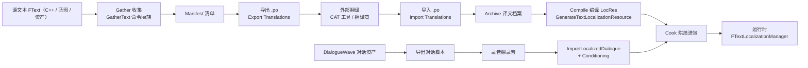
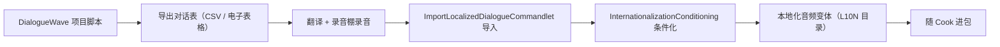
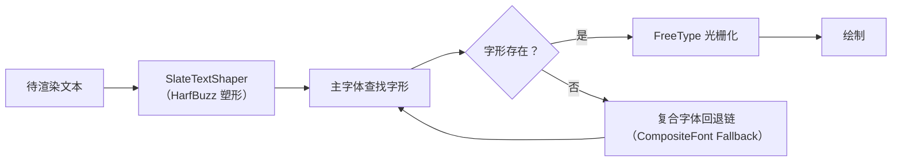

# 13 本地化发布工作流（Gather → Translate → Import → Cook）

> **元数据（Metadata）**
>
> | 项 | 内容 |
> |---|---|
> | 版本基线 | UE 5.8.0（CL 55116800，`++UE5+Release-5.8`） |
> | 适用范围 | 单机 / 联机项目的本地化发布：文本收集、翻译流转、语音本地化、字体与 Cook 集成、发布前 QA |
> | 事实边界 | 文中 5.8 事实均对照本机引擎源码只读核对（`C:\Program Files\Epic Games\UE_5.8\Engine`）；无法核对项一律标注"待核对" |
> | 官方参考 | https://dev.epicgames.com/documentation/en-us/unreal-engine （Localization Dashboard / Internationalization） |
> | 最后更新 | 2026-08-07 |

## 概述

本地化（Localization，L10N）是把游戏内容从源语言适配到多语言市场的完整工程链，UE 中的标准流程可以归纳为四个阶段：

**收集（Gather）→ 翻译（Translate）→ 导入（Import）→ 烘焙（Cook）**。

这条链由两条支线组成：

- **文本支线**：源码 / 资产中的 `FText` → 收集为 Manifest（清单）→ 导出 `.po` 交给翻译流程 → 导入回 Archive（译文档案）→ 编译为 LocRes 二进制资源 → 随 Cook 进包 → 运行时由 `FTextLocalizationManager` 按当前 Culture（文化）查找译文。
- **资产支线**：本地化资产（L10N 目录变体）与本地化音频（DialogueWave 对话波形）→ 条件化（Conditioning）→ 随 Cook 进包 → 运行时按文化加载对应变体。

本机 5.8 有两个重要的结构变化（已源码核对，全篇以此为基准）：

1. **国际化（Internationalization）不再是独立 Runtime 模块，已并入 Core**：文本管线位于 `Engine\Source\Runtime\Core\Public\Internationalization` 与 `Private\Internationalization`，而不是旧版的 `Runtime\Internationalization`。
2. **Localization 模块从 Editor 目录移至 Developer 目录**：`Engine\Source\Developer\Localization` 承载目标配置、PO 解析、报告生成等逻辑；编辑器侧只剩 `Editor\LocalizationDashboard`（面板）与 `Editor\LocalizationCommandletExecution`（任务执行）。

本地化不是"上线前一个月"的工作：FText 规范、Namespace 规划、字体回退链、文本膨胀预算都必须在项目早期定下，否则后期补课的代价极高。本篇按发布视角串起"工具 → 流程 → 验收"的完整闭环。

**适用读者与前置知识**：客户端程序（FText 规范与管线接入）、本地化/制作人（Dashboard 与翻译流转）、QA（发布验收）；建议先读 `01-引擎基础\10-FName与FText底层` 了解 FText 底层，再读本篇的发布流程。

## 核心概念表

| 术语 | 中文 | 说明（本机 5.8 源码位置） |
|---|---|---|
| Culture | 文化 | 语言 + 区域组合（如 `zh-Hans`、`ja`、`en-US`），运行时表示见 `Core\Public\Internationalization\Culture.h` |
| FText | 本地化文本 | 唯一可被收集 / 翻译的文本类型，见 `Core\Public\Internationalization\Text.h` |
| Namespace / Key | 命名空间 / 键 | 文本定位标识（`Namespace|Key`），工具见 `TextNamespaceUtil.h`、`TextKey.h` |
| Gather | 收集 | 从源码与资产中收集可翻译文本的过程 |
| Manifest | 收集清单 | 源文本与键的映射，`InternationalizationManifest.h` |
| Archive | 译文档案 | 每个目标语言的译文映射，`InternationalizationArchive.h` |
| LocRes | 本地化资源 | 编译后的二进制译文资源，`TextLocalizationResource.h` / `TextLocalizationResourceVersion.h` |
| PO | Portable Object | 通用翻译交换格式，`Developer\Localization\Private\PortableObjectFormatDOM.cpp` |
| Localization Target | 本地化目标 | 一个"收集 + 翻译"单元，`Developer\Localization\Public\LocalizationTargetTypes.h` |
| L10N | 本地化资产目录 | 资产级本地化变体机制，`Runtime\Engine\Private\Internationalization\EnginePackageLocalizationCache.cpp` |
| StringTable | 字符串表 | 数据驱动文本，`StringTableCore.h` / `StringTableRegistry.h` + `Runtime\Engine\Private\Internationalization\StringTable.cpp` |
| DialogueWave | 对话波形 | 含语音与字幕的对话资产，配合 `ImportLocalizedDialogueCommandlet` |
| Composite Font | 复合字体 | 主字体 + 回退字体链，`SlateCore\Private\Fonts\CompositeFont.cpp` |

## 原理详解

### 1. 本地化发布管线总览（四阶段）



（图释：主链为文本四阶段；底部支线为语音本地化，两条支线在 Cook 环节汇合后统一进包。）

四个阶段的职责划分：

- **Gather（收集）**：把项目中所有 `FText` 收集为 Manifest，回答"有哪些文本、来自哪里"。
- **Translate（翻译）**：导出 `.po` 交给翻译流程，译文与原文一一对应。
- **Import（导入）**：译文写入 Archive，并产出冲突 / 进度 / 字数报告。
- **Cook（烘焙）**：编译 LocRes 并随包发布；运行时按文化查找译文，找不到则回退源语言。

各阶段的输入 / 输出 / 主要工具汇总：

| 阶段 | 输入 | 主要工具 | 输出 |
|---|---|---|---|
| Gather | 源码、蓝图、资产中的 FText | `GatherText*Commandlet` 族 | Manifest / Archive 原始数据 |
| Translate | Manifest + `.po` | Dashboard 导出、外部 CAT 工具 | 翻译后的 `.po` |
| Import | `.po` | Dashboard 导入（`ImportTextFor*`） | Archive 译文 + 报告 |
| Cook | Archive | `GenerateTextLocalizationResourceCommandlet` | LocRes 二进制资源 |
| 运行时 | LocRes + L10N 资产 | `FTextLocalizationManager` | 按文化显示的文本 |

### 2. 本地化 Target 与 Localization Dashboard

Localization Dashboard（本地化面板，模块 `Editor\LocalizationDashboard`）是编辑器的图形入口，围绕"本地化目标（Localization Target）"工作：

- 目标类型：**Engine 目标**（引擎自带文本，如编辑器、引擎 UI）与**项目目标**（Game、插件等），类型定义见 `Developer\Localization\Public\LocalizationTargetTypes.h`（`ULocalizationTarget`、`ELocalizationTargetConflictStatus` 冲突状态枚举等，已核对）。
- 每个目标可配置：收集范围（哪些模块 / 资产 / 插件）、目标语言列表、导出目录、字数报告等；配置持久化在项目 `Config\Localization` 目录（文本格式，具体字段以本机为准）。
- Dashboard 的按钮动作最终都通过 `Editor\LocalizationCommandletExecution` 模块执行，核心任务函数见 `Public\LocalizationCommandletTasks.h`（本机核对）：

实践中通常"一个产品一个项目目标"，插件 / DLC 可拆分为独立目标以便单独排期与验收；引擎目标一般保持官方默认，除非你修改了引擎自带文本。

| 任务函数 | 面板动作 |
|---|---|
| `GatherTextForTarget(s)` | 收集文本（"Gather Text"） |
| `ExportTextForCulture / ExportTextForTarget(s)` | 导出译文（"Export Translations"，`.po`） |
| `ImportTextForCulture / ImportTextForTarget(s)` | 导入译文（"Import Translations"，`.po`） |
| `CompileTextForTarget(s)` | 编译 LocRes |
| `GenerateWordCountReportsForTarget(s)` | 生成字数统计报告 |
| `ExportDialogueScriptFor*` | 导出对话脚本（供录音） |
| `ImportDialogueScriptFor*` | 导入翻译后的对话脚本 |
| `ImportDialogueFor*` | 导入本地化对话音频 |
| `ReportLoadedAudioAssets` | 报告已加载音频资产 |

任务由 `LocalizationCommandletExecution::FTask`（任务名 + 脚本路径）驱动，脚本由 `Developer\Localization\Private\LocalizationConfigurationScript.cpp` 生成——因此命令行入口以 Dashboard 生成的脚本为准，不推荐手写等价命令。

### 3. 文本收集（Gather）

收集由 UnrealEd 命令let 族完成（`Editor\UnrealEd\Private\Commandlets`，本机核对）：

- `GatherTextCommandlet` / `GatherTextCommandletBase`：收集总入口与基类。
- `GatherTextFromSourceCommandlet`：收集 C++ 源码中的 `FText`（`LOCTEXT` / `NSLOCTEXT` / `INVTEXT`）。
- `GatherTextFromAssetsCommandlet`：收集资产中的 `FText`（蓝图、UMG、DataTable 等）。
- `GatherTextFromMetadataCommandlet`：收集资产元数据中的文本。
- `GenerateGatherManifestCommandlet` / `GenerateGatherArchiveCommandlet`：由收集结果生成清单 / 档案。
- `StabilizeLocalizationKeys` / `FixConflictingLocalizationKeys`：稳定键（避免文本重命名导致译文丢失）与修复键冲突。

关键数据类位于 `Core\Public\Internationalization\`（已核对）：`GatherableTextData.h`（可收集文本数据结构）、`InternationalizationManifest.h`（`FInternationalizationManifest`）、`InternationalizationArchive.h`（`FInternationalizationArchive`）、`InternationalizationMetadata.h`（元数据）、`TextKey.h`（`FTextKey`）、`TextNamespaceUtil.h`（Namespace 工具）。

引擎自身的收集配置可作为项目配置的同构参考（本机核对 `Engine\Config\Localization\`）：`Engine.ini`、`Editor.ini`、`Category.ini`、`Keywords.ini`、`PropertyNames.ini`、`ToolTips.ini`、`PortableObjectImport.ini`、`PortableObjectExport.ini`、`WordCount.ini`、`RepairData.ini`。

Gather 的产出物是 Manifest 与 Archive 的原始数据，它们不是最终发布资源，后续还要编译为 LocRes。

### 4. 翻译导入导出（.po）

- **PO 格式支持**：`Developer\Localization\Private\PortableObjectFormatDOM.cpp`（PO 文档对象模型的解析与生成）+ `PortableObjectPipeline.cpp`（导入导出流水线）。导入 / 导出配置模板见 `Engine\Config\Localization\PortableObjectImport.ini` 与 `PortableObjectExport.ini`（已核对）。
- **导出**：Dashboard "Export Translations" → 按目标语言生成 `.po` 文件，条目包含 `msgctxt`（`Namespace|Key`）、`msgid`（原文）、`msgstr`（待译）。
- **翻译**：`.po` 交给翻译商或 CAT 工具（PoEdit、SDL Trados 等第三方工具，UE 侧只保证格式互通）。
- **导入**：Dashboard "Import Translations" → 译文写入 Archive；命令行导出可由 `InternationalizationExportCommandlet` 完成（本机核对存在）。
- **健康检查**：导入时检测冲突（`ELocalizationTargetConflictStatus`，`LocalizationTargetTypes.h:28`）；`GenerateTextLocalizationReportCommandlet` 生成报告；`DetectOrphanedLocalizedAssetsCommandlet` 检测孤儿本地化资产。

`.po` 文件片段（示意）：

```po
#. 译文说明注释
msgctxt "GameUI|MainMenu.Title"
msgid "Play"
msgstr "开始游戏"
```

注意：5.8 的 UnrealEd 命令let 目录中未见旧版的 `ImportLocalizationCommandlet` / `ExportLocalizationCommandlet`，导入导出的标准入口是 Dashboard 任务（`LocalizationCommandletTasks`）及其生成的脚本；底层命令名细节标注"待核对"。

### 5. 语音本地化（对话与音频）

语音本地化的载体是 **DialogueWave**（对话波形资产，同时承载语音与字幕），管线命令let 均已在本机核对存在：

- `ImportLocalizedDialogueCommandlet`（`Editor\UnrealEd\Classes\Commandlets\ImportLocalizedDialogueCommandlet.h` 与 `Private\Commandlets\ImportLocalizedDialogueCommandlet.cpp`）：从翻译后的对话表格导入本地化语音与字幕。
- `InternationalizationConditioningCommandlet`：对话音频"条件化"——把录音裁剪 / 重采样为与文本时长匹配的版本。
- Dashboard 任务：`ExportDialogueScriptFor*`（导出对话脚本供录音棚使用）、`ImportDialogueScriptFor*`（导入翻译后的脚本）、`ImportDialogueFor*`（导入录音）、`ReportLoadedAudioAssets`（报告已加载音频资产）。

标准流程（示意）：



（图释：对话音频走"脚本外发 → 回填导入 → 条件化"的异步链路，与文本翻译并行，是本地化排期中最长的环节。）

音频资产变体与 L10N 目录的精确组织方式、`USoundWave` 本地化变体的加载细节标注"待核对"。

### 6. 字体与排版（多语言字体回退）

Slate 字体栈位于 `Runtime\SlateCore\Private\Fonts`（本机核对）：

| 文件 | 职责 |
|---|---|
| `CompositeFont.cpp` / `FontCacheCompositeFont.cpp` | 复合字体（Composite Font）与回退链（Fallback）管理 |
| `FontCacheFreeType.cpp` | FreeType 字形光栅化 |
| `FontCacheHarfBuzz.cpp` | HarfBuzz 复杂文本塑形（阿拉伯语连字、印地语重组等） |
| `SlateTextShaper.cpp` / `FontCache.cpp` | 文本塑形入口与字体缓存 |
| `UnicodeBlockRange.cpp` | Unicode 区块范围工具 |



（图释：主字体缺字形时沿复合字体回退链逐级查找，这是避免"豆腐块"（缺字方框）的核心机制。）

多语言排版要点：

- 中文 / 日文 / 韩文建议单独配置 CJK 回退字体，避免主字体混排。
- 文本膨胀预算：德语、俄语通常比英语长 20-40%，UI 布局需预留空间。
- 从右到左（RTL，如阿拉伯语）与竖排语言需专项排版验证。
- 行高、按钮内边距与文本框换行策略同样要按最长译文校准，而不只是字体本身。

### 7. 平台语言包与 Cook 集成

- **编译 LocRes**：`GenerateTextLocalizationResourceCommandlet` 把 Archive 编译为二进制 LocRes（数据类见 `TextLocalizationResource.h`，版本号见 `TextLocalizationResourceVersion.h`）。
- **产物结构**：引擎自身 LocRes 输出到 `Engine\Content\Localization\`（本机核对：`Category`、`Editor`、`EditorTutorials`、`Engine`、`Keywords`、`PropertyNames`、`ToolTips` 目录）；项目 LocRes 按"目标 / 文化"组织在项目 `Content\Localization` 下。
- **运行时加载**：`FInternationalization` 初始化后由 `FTextLocalizationManager`（`TextLocalizationManager.h`）加载 LocRes 并响应文化切换；启动语言可通过命令行 `-culture=` 指定（示意，参数以官方文档为准）。
- **Cook 集成**：LocRes 作为内容资源被 Cook / Stage 进包，随 DLC / 热更包分发时同样生效（与本章 04-资源管理与热更新 衔接）。
- **字符串表**：数据驱动文本用 StringTable（`StringTableCore.h` / `StringTableRegistry.h`，资产侧 `UStringTable` 见 `Runtime\Engine\Private\Internationalization\StringTable.cpp`），适合大量文案外置管理、减少源码重编译。
- 平台商店语言映射、系统语言自动匹配等平台侧细节标注"待核对"。

Cook 阶段注意：LocRes 属于"内容"，要确保其进入正确的 Chunk（本地化包 / 首发包），否则上线后发现缺译文只能靠热更补，成本很高。

### 8. QA 与回归（本地化构建验证）

- **报告**：`GenerateTextLocalizationReportCommandlet` 生成翻译报告；WordCount 字数报告（引擎参考配置 `Engine\Config\Localization\WordCount.ini`）用于翻译量估算与结算。
- **冲突 / 孤儿检测**：`ELocalizationTargetConflictStatus` 冲突状态；`DetectOrphanedLocalizedAssetsCommandlet` 清理孤儿资产；`FixConflictingLocalizationKeys` 修复键冲突。
- **伪本地化测试**：`Core\Public\Internationalization\LocTesting.h` 提供本地化测试辅助（如伪文化），用于在翻译未完成前验证布局与编码是否健壮。
- **发布回归流程（建议）**：构建 → 逐语言冒烟（启动、主菜单、核心玩法路径）→ 字体溢出截图对比 → 音频试听 → 键冲突报告清零 → 才允许发布。
- **CI 自动化**：`Programs\AutomationTool\Localization\`（本机核对：`LocalizationConfigFile.cs` / `LocalizationConfigFileBuilder.cs` / `LocalizationProvider.cs` / `LocalizationUtilities.cs`）可在自动化构建链中生成并执行本地化配置。

验证命令（示意，参数以 Dashboard 生成脚本为准）：

```bat
:: 伪本地化语言冒烟：强制以测试文化启动
UnrealEditor-Cmd.exe YourGame.uproject -game -culture=xx -ExecCmds="quit"
```

伪本地化（Pseudolocalization）可提前暴露硬编码文本、布局溢出与编码问题，是成本最低的回归手段。

### 9. FText 最佳实践衔接（与 01-10 篇）

本仓库 `01-引擎基础\10-FName与FText底层` 覆盖 FText 的底层实现与选型；本篇从发布视角给出衔接要点：

- 一切用户可见文本用 **FText**，不用 `FString` / `FName` 硬编码（否则无法收集、无法翻译）。
- 用 `LOCTEXT` / `NSLOCTEXT` / `INVTEXT` 声明文本；**Namespace 规划**决定键的组织方式（模块 / 功能域），键稳定可避免译文丢失（配合 `StabilizeLocalizationKeys`）。
- 动态文本用 `FText::Format` 占位符（`{0}`），**禁止字符串拼接**——不同语言的语序不同，拼接无法翻译。
- 数字 / 日期 / 货币等文化相关格式化走引擎 API（`FastDecimalFormat.h`、`TextChronoFormatter.h`）；文本比较 / 大小写转换也走文化感知 API（`TextComparison.h`、`TextTransformer.h`）。
- 大量文案用 StringTable 或 DataTable + FText 引用，减少源码改动与重编译。
- 牢记译文膨胀：UI 布局、字体、换行都要为多语言预留空间（见第 6 节）。

## 代码 / 示例

> 以下均为示意 / 节选；真实命令参数以 Dashboard 生成脚本与官方文档为准。

命令行收集（示意）：

```bat
UnrealEditor-Cmd.exe YourGame.uproject -run=GatherTextCommandlet -Config=YourGatherConfig.ini
```

C++ 文本声明（节选）：

```cpp
#define LOCTEXT_NAMESPACE "GameUI.MainMenu"

LOCTEXT("PlayButton", "Play");
FText::Format(LOCTEXT("Welcome", "Welcome, {0}!"), PlayerName);

#undef LOCTEXT_NAMESPACE
```

`.po` 导出片段（示意）：

```po
msgctxt "GameUI.MainMenu.PlayButton"
msgid "Play"
msgstr ""
```

## 最佳实践

1. 立项即定 FText 规范与 Namespace 规划，拒绝后期补救式本地化。
2. 每个迭代跑一次 Gather，尽早暴露新文本、键冲突与收集遗漏。
3. 键保持稳定；重命名文本用工具迁移（`StabilizeLocalizationKeys`），避免译文丢失。
4. 翻译分批导入，每批跑冲突报告与字数统计。
5. 语音与文本分开排期：对话脚本先冻结，录音后置（录音是长周期环节）。
6. 字体回退链与文本膨胀预算在 UI 规范阶段定死，避免上线前改布局。
7. 发布前执行伪本地化测试与全语言冒烟，截图留档。
8. 将本地化纳入 CI：收集 → 报告 → 门禁（冲突为 0、缺失率低于阈值）。
9. 文化相关格式化（数字 / 日期 / 货币）用引擎 API，不手写。
10. 保留 LocRes 与 Archive 的版本管理，回滚与差异比对有据可查。

## FAQ

1. **为什么我的文本不显示翻译？** —— 确认是 `FText`、已收集进 Manifest、该文化有 Archive 译文，且 LocRes 已重新编译。
2. **`.po` 导入后没有变化？** —— 检查键冲突状态与导入目标文化，导入后重新 Compile。
3. **中文字体出现方框（豆腐块）？** —— 复合字体回退链未配置 CJK 字体。
4. **译文比原文长导致 UI 截断？** —— 布局预留膨胀空间，或用自动换行 / 缩放类控件。
5. **音频与字幕不同步？** —— 使用 `ImportLocalizedDialogue` + Conditioning 流程重做该条音频。
6. **可以只翻译部分语言吗？** —— 可以，Target 按语言配置；未翻译语言回退源语言。
7. **LocRes 是文本还是二进制？** —— 二进制资源（`TextLocalizationResource`），由 Archive 编译生成。
8. **蓝图中能收集 FText 吗？** —— 能，`GatherTextFromAssetsCommandlet` 收集资产内 FText。
9. **启动时如何强制某语言？** —— 使用 `-culture=` 启动参数（示意，以官方文档为准）。
10. **引擎自带文本可以本地化吗？** —— 可以，Engine Target 已包含引擎 LocRes 输出结构。
11. **`.po` 与 `.locres` 有什么关系？** —— `.po` 是翻译交换格式，`.locres` 是编译后的运行时资源；翻译流程只碰 `.po`，发布只带 `.locres`。
12. **多语言包可以后补吗？** —— 可以，新增语言只需为新 Culture 走一遍 Gather → 翻译 → 编译 → 热更 / 补丁流程，但首发规划越晚成本越高。

## 关联阅读

- [04-资源管理与热更新.md](04-资源管理与热更新.md)（资源组织与热更，LocRes 随包 / 热更分发）
- [02-UAT与自动化打包.md](02-UAT与自动化打包.md)（UAT 自动化与打包流程）
- [08-全栈质量门禁与灰度回滚.md](08-全栈质量门禁与灰度回滚.md)（发布门禁，本地化报告可作为门禁输入）
- [10-FName与FText底层.md](../01-引擎基础/10-FName与FText底层.md)（文本类型底层实现与选型）
- [01-UMG框架与控件系统.md](../07-UI与性能优化/01-UMG框架与控件系统.md)（UI 文本控件与多语言展示）

## 更新日志

- 2026-08-07：初稿。基于本机 UE 5.8（CL 55116800）源码只读核对：国际化并入 Core、Localization 模块位于 Developer、命令let 清单、Dashboard 任务函数（`LocalizationCommandletTasks`）、字体栈文件、引擎本地化配置与内容结构；无法核对项已如实标注"待核对"。
