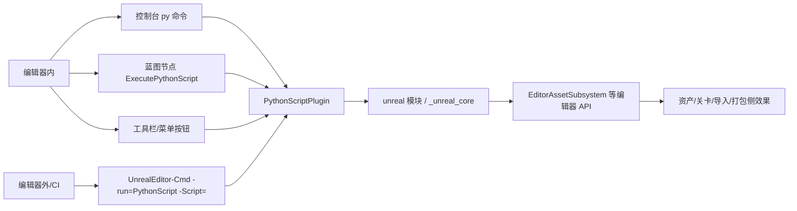
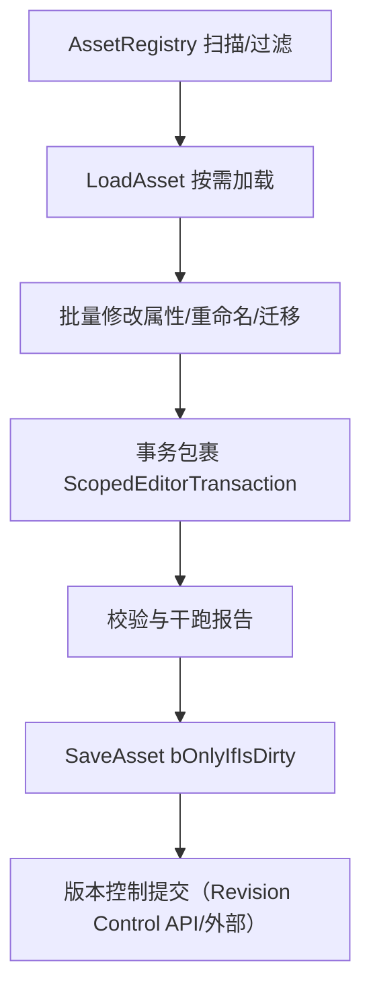
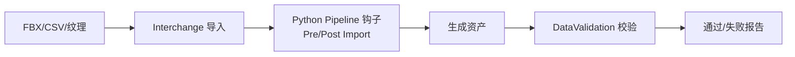

# 14 Python 编辑器脚本与资产自动化（UE 5.8）

> 本文是「08-工具链与打包发布」的自动化收尾篇：以 Python Script Plugin 为主线，覆盖编辑器内脚本、命令行/CI 运行、批量资产处理、数据表与导入自动化，并与 Interchange 导入管线（06 篇）、UAT 打包（02 篇）、插件与编辑器扩展（03 篇）衔接。

## 元数据

| 项目 | 内容 |
|---|---|
| 版本基线 | UE 5.8.0 / CL 55116800 / `++UE5+Release-5.8` |
| 适用范围 | 编辑器自动化、批量资产处理、导入后处理、CI/命令行脚本（Editor 目标，非运行时） |
| 事实边界 | 符号与路径均先经本机引擎源码只读核对（`Engine\Plugins\Experimental\PythonScriptPlugin`、`Engine\Source\Editor\UnrealEd\Public\Subsystems`、`Engine\Source\Runtime\Interchange` 等）；无法核对项一律标注「待核对」 |
| 官方参考 | https://dev.epicgames.com/documentation/en-us/unreal-engine （Python Scripting / Interchange / UAT） |
| 最后更新 | 2026-08-07 |

## 概述

Python 编辑器脚本（Python Editor Scripting）是 UE 编辑器自动化的事实标准：它把编辑器内几乎所有 `BlueprintCallable` 编辑器 API 以 `unreal` 模块暴露给 Python，开发者可以用一门脚本语言完成批量资产操作、数据表生成、导入后处理、CI 冒烟等任务，而不必编译 C++ 插件。

本章其余篇目解决了「怎么构建（01）、怎么打包（02）、怎么扩展编辑器（03）、怎么管理资源与热更（04）、怎么定义导入管线（06）」的问题；本文解决「怎么用脚本把上述环节串起来自动化」的问题，是资产生产链路的「胶水层」。

### UE 5.8 关键变化速览（本机核对）

1. **旧编辑器函数库在本机 5.8 源码中未命中**：`EditorAssetLibrary` / `EditorLevelLibrary` / `EditorFilterLibrary` / `EditorLoadingAndSavingUtils` 四个头文件在全引擎源码检索（`Engine\Source` 递归）中均不存在。5.8 推荐的脚本入口是 **Subsystem 族**：`EditorAssetSubsystem`、`EditorActorSubsystem`、`UnrealEditorSubsystem`（`UnrealEd\Public\Subsystems\`）。
2. **`unreal` 模块由编译扩展 + Python 辅助层提供**：`Content\Python\unreal_core.py` 首行 `from _unreal_core import *`，即 Python 侧 `import unreal` 实际来自 C++ 扩展 `_unreal_core` 与辅助脚本的叠加。
3. **Interchange Python 管线基类位于 Runtime 源码**：`Engine\Source\Runtime\Interchange\Engine\Public\InterchangePythonPipelineBase.h`（不再是插件目录下的独立文件）。
4. **命令行执行仍走命令let**：`UPythonScriptCommandlet` 解析 `-Script=` 参数并强制启用 Python（官方文档惯用 `-run=python` 写法，见「原理详解-5」）。
5. **远程执行/调试资产内置**：`Content\Python` 下含 `remote_execution.py` 与 `debugpy_unreal.py`，支持 VSCode 调试。

## 核心概念表

| 概念 | 说明 | 5.8 本机证据/入口 |
|---|---|---|
| Python Script Plugin | Experimental 插件，提供 Python 运行时与 `unreal` 模块 | `Engine\Plugins\Experimental\PythonScriptPlugin\PythonScriptPlugin.uplugin`（Version 1.0，「Python Editor Script Plugin」，`EnabledByDefault:false`） |
| `unreal` 模块 | Python 侧入口，暴露全部可脚本化编辑器 API | `_unreal_core` 扩展 + `Content\Python\unreal_core.py` |
| 编辑器 Subsystem 族 | 5.8 推荐的脚本 API：资产/关卡/世界操作 | `EditorAssetSubsystem`、`EditorActorSubsystem`、`UnrealEditorSubsystem` 等（`UnrealEd\Public\Subsystems\`） |
| `py` 控制台执行器 | 编辑器控制台运行脚本文件或代码 | `FPythonCommandExecutor`（`StaticName() = "Python"`），内部以 `py "..."` 调用（PythonScriptPlugin.cpp L636/L675） |
| `pyexec`（REPL） | 交互式 Python 会话执行器 | `FPythonREPLCommandExecutor`（`StaticName() = "PythonREPL"`，PythonScriptPlugin.cpp L405-409） |
| 命令let | 无头/CI 运行脚本的官方通道 | `UPythonScriptCommandlet`（`-run=PythonScript -Script="..."`，解析见 PythonScriptCommandlet.cpp L20-35） |
| `unreal.PythonScriptLibrary` | 蓝图可调用的 Python 执行库 | `IsPythonAvailable` / `ExecutePythonCommand` / `ExecutePythonCommandEx` / `ExecutePythonScript`（PythonScriptLibrary.h） |
| `ScopedEditorTransaction` | Python 事务包装，支持 Ctrl+Z 撤销 | `FPyScopedEditorTransaction`（PyEditor.h） |
| Interchange Python Pipeline | 导入管线中的 Python 钩子 | `UInterchangePythonPipelineBase : UInterchangePipelineBase`（Runtime\Interchange\Engine\Public） |
| 远程执行/调试 | VSCode 等 IDE 远程调试 Python | `Content\Python\remote_execution.py`、`debugpy_unreal.py` |

## 原理详解

### 1. 插件架构与加载顺序

本机 `PythonScriptPlugin.uplugin`（节选）：

```json
{
	"Version": 1,
	"VersionName": "1.0",
	"FriendlyName": "Python Editor Script Plugin",
	"Category": "Scripting",
	"EnabledByDefault": false,
	"IsBetaVersion": true,
	"Modules": [
		{ "Name": "PythonScriptPluginPreload", "Type": "Runtime", "LoadingPhase": "EarliestPossible" },
		{ "Name": "PythonScriptPlugin", "Type": "UncookedOnly", "LoadingPhase": "PreDefault" }
	]
}
```

两个模块的分工（节选）：

- `PythonScriptPluginPreload`：`EarliestPossible` 加载，保证 Python 运行时在引擎早期初始化（命令行 `-ForceEnablePython` 等开关在这里被处理）。
- `PythonScriptPlugin`：`UncookedOnly` + `PreDefault`，仅编辑器/开发目标存在，运行时不打包进游戏；负责注册 `unreal` 模块、控制台执行器与命令let。

项目启用方式：在 `.uproject` 的 `Plugins` 数组加入 `"PythonScriptPlugin"`（Enabled true），或在编辑器中启用该插件后重启。命令行开关 `-ForceEnablePython` / `-EnablePython` / `-DisablePython` 可强制覆盖（PythonScriptPlugin.cpp L109/L115/L151 核对）。

### 2. `unreal` 模块与类型暴露机制

`import unreal` 之所以能拿到全部编辑器 API，是因为：

1. 插件启动时在 C++ 侧构建 `_unreal_core` 扩展模块（PyCore.cpp 中 `ImportUnrealModule` 等注册逻辑）；
2. `Content\Python\unreal_core.py` 做 Python 层包装（`from _unreal_core import *`），并附带类型提示辅助；
3. 编辑器 C++ 侧所有 `UFUNCTION(BlueprintCallable)` 的静态函数与 Subsystem 方法会通过反射系统自动生成 Python 绑定——**「蓝图可调用」≈「Python 可调用」**是选择脚本 API 的判据；
4. 插件还提供 `SphinxDocs` 目录与文档生成命令let（`PythonOnlineDocsCommandlet`），用于生成离线 API 参考。

因此脚本里看到的类（`unreal.EditorAssetSubsystem`、`unreal.EditorActorSubsystem`、`unreal.EditorUtilityLibrary`、`unreal.AssetRegistryHelpers` 等）都对应真实的 C++ 类型，方法名与参数名保持 C++ 风格（如 `LoadAsset(AssetPath)`）。

### 3. 编辑器 API 分层：Subsystem 族取代旧 Library

本机 5.8 检索结论（`Engine\Source` 递归 `*.h`）：`EditorAssetLibrary.h`、`EditorLevelLibrary.h`、`EditorFilterLibrary.h`、`EditorLoadingAndSavingUtils.h` **全部未命中**；而 `UnrealEd\Public\Subsystems\` 下存在完整子系统族：

```
ActorEditorContextSubsystem / AssetEditorSubsystem / BrowseToAssetOverrideSubsystem
BrushEditingSubsystem / CollectionManagerScriptingSubsystem / EditorActorSubsystem
EditorAssetSubsystem / EditorSubsystemBlueprintLibrary / ImportSubsystem
MaterialShaderValueTypeSubsystem / PanelExtensionSubsystem
PropertyVisibilityOverrideSubsystem / UnrealEditorSubsystem
```

脚本侧常用入口（本机核对签名）：

| 子系统 | 已核对函数（节选） |
|---|---|
| `unreal.EditorAssetSubsystem` | `LoadAsset(AssetPath)`、`GetPathNameForLoadedAsset(LoadedAsset)`、`DoesAssetExist(AssetPath)`、`SaveAsset(AssetPath, bOnlyIfIsDirty=True)`、`SaveLoadedAsset(Asset, bOnlyIfIsDirty=True)`、`DoesDirectoryExist(DirectoryPath)`、`FindPackageReferencersForAsset(AssetPath, bLoadAssetsToConfirm=False)`、`DeleteAsset(AssetPathToDelete)`、`DuplicateAsset(Source, Dest)`、`RenameAsset(Source, Dest)` 及 Revision Control 函数族 |
| `unreal.EditorActorSubsystem` | `GetAllLevelActors()`、`GetAllLevelActorsComponents()`、`GetActorReference(PathToActor)`、`SpawnActorFromClass(ActorClass, Location, Rotation=ZeroRotator, bTransient=False)`、`DestroyActor(Actor)`、`DestroyActors(Actors)` |
| `unreal.UnrealEditorSubsystem` | `GetEditorWorld()`、`GetGameWorld()` |

> 若团队仍在旧教程中看到 `unreal.EditorAssetLibrary` 用法，需注意其在本机 5.8 中已不可用（「移除」或「改名」以官方发布说明为准，此处待核对）；迁移路径即改为同名 Subsystem 调用。

### 4. 四条执行路径



图释：编辑器内（`py` 控制台、蓝图节点、菜单按钮）与编辑器外（命令行命令let）最终都汇入 PythonScriptPlugin，通过 `unreal` 模块调用编辑器 API。

- **控制台 `py`**：`py "C:/MyScript.py"` 运行文件，`py <代码>` 直接执行（执行器描述「Execute Python scripts (including files)」）。
- **蓝图节点**：`K2Node_ExecutePythonScript` 提供「Execute Python Script」蓝图节点（`unreal.PythonScriptLibrary.ExecutePythonScript` 的变参包装），可传参取返回值。
- **菜单/工具栏**：插件菜单内置「Execute Python Script…」入口（`FPythonCommandMenuImpl::Menu_ExecutePython`），可绑定到工具栏。
- **命令let**：CI 无头运行的标准通道，见下一节。

### 5. 命令行运行与 CI 集成

本机 `UPythonScriptCommandlet`（PythonScriptCommandlet.cpp）核对要点：

1. 手动解析 `-Script=` 参数（支持引号内路径），注释明确说明「不走常规命令行解析，因为脚本路径可能含引号与转义」；
2. 自动调用 `IPythonScriptPlugin::Get()->ForceEnablePythonAtRuntime()`，无需额外开关；
3. Python 不可用时输出错误：`"Python script cannot run as Python support is disabled!"` 并以非零逻辑退出。

命令let 名派生遵循引擎惯例（`U<Name>Commandlet` → `-run=<Name>`，本机类名 `UPythonScriptCommandlet`，即 `-run=PythonScript`）；官方文档惯用写法 `-run=python -script=...` 与此命令let 对应（大小写不敏感，具体别名机制待核对）。

```powershell
# 无头运行（CI 推荐）
UnrealEditor-Cmd.exe "D:\MyProject\MyProject.uproject" `
  -run=PythonScript -Script="D:\MyProject\Content\Python\CI\ValidateAssets.py" `
  -unattended -nosplash -nullrhi -log="D:\Logs\py_validate.log"
```

脚本内以 `sys.exit(0)` / `sys.exit(1)` 控制命令let 退出码，CI 据此判定成败。

### 6. 批量资产处理流水线



图释：批量任务建议按「注册表扫描 → 按需加载 → 修改 → 事务 → 校验 → 保存 → 提交」七步走，任何一步失败可整批回滚。

要点：

- **扫描用 AssetRegistry，不直接遍历目录**：`unreal.AssetRegistryHelpers` 获取注册表，按路径/类过滤，避免加载全部资产（性能与内存关键）。
- **按需加载**：`EditorAssetSubsystem.LoadAsset("/Game/...")` 只加载需要改的对象。
- **保存**：`SaveAsset(Path, bOnlyIfIsDirty=True)` 只存脏资产，避免大规模无意义写盘。
- **事务**：`unreal.ScopedEditorTransaction("批量重命名")` 包裹修改，出错时编辑器内可撤销。
- **引用安全**：重命名/删除前用 `FindPackageReferencersForAsset` 检查引用方。

### 7. 数据表与导入自动化

数据表（DataTable）是策划配置的常见载体，脚本侧两类做法：

1. **CSV → DataTable 导入**：脚本读取外部 CSV（`unreal.PythonScriptLibrary` 之外用标准库 `csv`/`json`），校验列结构后调用数据表工厂导入，或直接生成 `.uasset` 的导入源再走编辑器导入流程；更工程化的做法是把 CSV 作为源文件，通过 UAT/Interchange 统一导入。
2. **Interchange Python Pipeline 挂钩**：本机核对 `UInterchangePythonPipelineBase : UInterchangePipelineBase`（`BlueprintType, Abstract`）与 `UInterchangePythonPipelineAsset : UObject`（`Engine\Source\Runtime\Interchange\Engine\Public\InterchangePythonPipelineBase.h`）。用 Python 子类实现 `ExecutePreImportPipeline` / `ExecutePostImportPipeline` 等虚函数，即可在任意资产的导入链路上做「改导入选项、补默认值、命名规范、自动校验」等后处理，与 06-Interchange 篇的 C++ Pipeline 互补。



图释：Python Pipeline 位于 Interchange 导入与资产落盘之间，是最佳的后处理插入点；最终仍以 06 篇的 DataValidation 做门禁。

### 8. 错误处理、日志与可观测性

- 脚本异常默认打印到输出日志（`LogPython` 类别），但**不会自动使命令let 失败**——必须在顶层捕获异常并 `sys.exit(1)`。
- `unreal.log()` / `unreal.log_warning()` / `unreal.log_error()` 输出到 UE 日志体系，与编辑器 Output Log 同源。
- 长任务用「干跑（dry-run）模式 + 正式模式」两阶段：干跑只报告将做什么，正式模式才写资产，CI 先干跑后执行。
- 批处理耗时场景考虑 `-unattended`（跳过弹窗）与关闭自动保存干扰（`-NoSaveConfig` 等，按项目需要）。

## 代码/示例

以下代码均为「节选/示意」，以本机 5.8 API 签名为准。

### 示例 1：基础读写（节选）

```python
import unreal

if not unreal.PythonScriptLibrary.is_python_available():
    unreal.log_error("Python 不可用（插件未启用）")
    raise SystemExit(1)

asset_sub = unreal.EditorAssetSubsystem()
asset_path = "/Game/Props/SM_Crate"
if asset_sub.does_asset_exist(asset_path):
    asset = asset_sub.load_asset(asset_path)
    unreal.log("Loaded: {}".format(asset_sub.get_path_name_for_loaded_asset(asset)))
```

> 说明：Python 绑定采用 snake_case（C++ 的 `LoadAsset` → `load_asset`），布尔参数 `bOnlyIfIsDirty` → `b_only_if_is_dirty`，与 C++ 头文件签名一一对应。

### 示例 2：批量重命名 + 引用检查（节选）

```python
import unreal

asset_sub = unreal.EditorAssetSubsystem()
tx = unreal.ScopedEditorTransaction("批量重命名 A_ 前缀")

renamed, skipped = 0, 0
for path in ["/Game/Props/A_SM_01", "/Game/Props/A_SM_02"]:
    if not asset_sub.does_asset_exist(path):
        skipped += 1
        continue
    refs = asset_sub.find_package_referencers_for_asset(path, False)
    if refs:
        unreal.log_warning("{} 仍有引用方 {} 个，跳过".format(path, len(refs)))
        skipped += 1
        continue
    target = path.replace("A_", "B_")
    if asset_sub.rename_asset(path, target):
        renamed += 1

del tx  # 结束事务
unreal.log("完成：重命名 {} 个，跳过 {} 个".format(renamed, skipped))
```

### 示例 3：遍历关卡 Actor（节选）

```python
import unreal

actor_sub = unreal.EditorActorSubsystem()
world = unreal.UnrealEditorSubsystem().get_editor_world()
if not world:
    raise SystemExit(1)

for actor in actor_sub.get_all_level_actors():
    if actor.get_class().get_name() == "StaticMeshActor":
        unreal.log("{} @ {}".format(actor.get_actor_label(), actor.get_actor_location()))
```

### 示例 4：命令let 入口脚本（示意）

```python
import sys
import unreal

def main() -> int:
    try:
        # 业务逻辑：校验、批处理、生成报告
        ...
        return 0
    except Exception as exc:  # noqa: BLE001
        unreal.log_error("自动化失败: {}".format(exc))
        return 1

if __name__ == "__main__":
    sys.exit(main())
```

### 示例 5：Interchange Python Pipeline 骨架（示意）

```python
import unreal

@unreal.uclass()
class MyImportPipeline(unreal.InterchangePythonPipelineBase):
    @unreal.ufunction(params=[unreal.InterchangeBaseNodeContainer])
    def execute_post_import_pipeline(self, node_container):
        unreal.log("PostImport: 遍历节点做命名规范与默认值修正")
        # node_container.get_nodes() 遍历，按 DisplayLabel 规则改名
```

> 说明：`@unreal.uclass()` / `@unreal.ufunction()` 装饰器来自 unreal 模块的 Python 类生成机制（`generate_class`，PyCore.cpp 中核对到 `generate_class`/`generate_struct` 错误路径）；具体基类方法名以 Interchange 头文件为准（本处 `execute_post_import_pipeline` 为示意，实际虚函数名待核对）。

## 最佳实践

1. **API 以本机 5.8 为准**：旧教程的 `EditorAssetLibrary` 等在本机未命中，统一走 Subsystem 族（见原理 3）。
2. **脚本即代码**：放入项目 `Content\Python\` 或独立插件 `Scripts\` 目录，纳入版本控制；命名带前缀区分（如 `CI_`、`Tool_`）。
3. **幂等与干跑**：批处理脚本支持 `--dry-run`，CI 先干跑再执行。
4. **事务包裹一切写操作**：`ScopedEditorTransaction` 让误操作可在编辑器内撤销。
5. **按需加载 + 脏检查保存**：`SaveAsset(..., b_only_if_is_dirty=True)`，避免全量写盘。
6. **引用安全**：删除/重命名前 `find_package_referencers_for_asset`。
7. **退出码纪律**：命令let 入口 `sys.exit(0/1)`，CI 才可靠。
8. **无头运行**：CI 使用 `UnrealEditor-Cmd.exe -unattended -nullrhi`，避免弹窗挂起。
9. **日志结构化**：输出 `unreal.log()` 并落盘 `-log=...`，失败时可追溯。
10. **性能**：扫描走 AssetRegistry，不要 `os.walk` 内容目录；大批量时考虑分片与进度日志。

## FAQ

1. **5.8 还能用 `unreal.EditorAssetLibrary` 吗？** 本机 5.8 全引擎源码未命中该头文件，疑似已被移除；请改用 `unreal.EditorAssetSubsystem`（同名方法）。
2. **怎么在命令行跑 Python 脚本？** `UnrealEditor-Cmd.exe <Project>.uproject -run=PythonScript -Script="<绝对路径>.py"`（命令let 名 `PythonScript` 本机核对；官方文档惯用 `-run=python`，待核对）。
3. **`py` 与 `pyexec` 有什么区别？** `py` 运行脚本文件或单条代码（执行器名 `Python`）；`pyexec` 进入交互式 REPL（执行器名 `PythonREPL`）。
4. **脚本改了资产但没落盘？** 修改后需要显式 `save_asset`（默认 `b_only_if_is_dirty=True`），否则仅在内存中。
5. **CI 无头跑要注意什么？** 用 `UnrealEditor-Cmd.exe` + `-unattended -nosplash -nullrhi`；确保脚本顶层捕获异常并 `sys.exit(1)`。
6. **引擎自带的 Python 版本是多少？** 本机未核对到版本号常量（待核对）；脚本应避免依赖 3.12+ 专属语法，兼容 3.9-3.11 为宜。
7. **能 `pip install` 第三方库吗？** 插件含 `PipInstall` 模块与 `Content\Python\PipInstallUtils`（本机核对存在）；具体启用命令（如控制台命令）待核对，离线环境需自备 wheel。
8. **蓝图能调用 Python 吗？** 能：`K2Node_ExecutePythonScript`（「Execute Python Script」节点，`unreal.PythonScriptLibrary.execute_python_script` 变参版），可传参并取回输出。
9. **如何用 VSCode 调试编辑器 Python？** 插件内置 `remote_execution.py`（Remote Execution）与 `debugpy_unreal.py`（本机核对存在）；完整接线步骤待核对官方文档。
10. **导入资产后想自动跑脚本怎么办？** 用 Interchange Python Pipeline（`UInterchangePythonPipelineBase` 子类）挂在导入链路上；或监听 `ImportSubsystem` 事件。
11. **脚本运行中弹窗卡死 CI？** 加 `-unattended`，并避免调用弹窗类编辑器 UI（消息对话框、保存提示）。
12. **批处理 1000 个资产很慢？** 用 AssetRegistry 过滤减少加载量、复用已加载对象、避免逐资产 `save_asset` 全量写盘、可并行（注意编辑器 API 线程安全边界）。

## 关联阅读

- [06-Interchange与DataValidation.md](06-Interchange与DataValidation.md)：导入管线与校验门禁（Python Pipeline 的宿主）
- [02-UAT与自动化打包.md](02-UAT与自动化打包.md)：打包侧自动化，与命令let 衔接
- [03-插件开发与编辑器扩展.md](03-插件开发与编辑器扩展.md)：C++ 侧编辑器扩展，与脚本侧互补

## 更新日志

- 2026-08-07：创建。基于本机 UE 5.8.0（CL 55116800）源码核对：插件 uplugin/模块结构、`py`/`pyexec` 执行器、`UPythonScriptCommandlet` 的 `-Script=` 解析、Subsystem 族 API（EditorAssetSubsystem/EditorActorSubsystem/UnrealEditorSubsystem）、旧 Library 未命中、`InterchangePythonPipelineBase` 位置、`unreal_core.py` 结构；未核对项已标注「待核对」。
