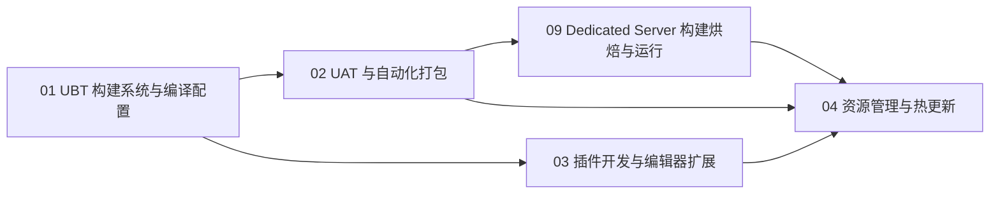

# 08-工具链与打包发布

> 面向 UE（Unreal Engine 4 / 5）客户端开发者的工具链与发布知识库。
> 覆盖：UBT 构建系统、UAT 自动化打包、Dedicated Server 构建/烘焙/运行、插件开发与编辑器扩展、资源管理与热更新。

## 一、分类简介

UE 项目的工程化能力很大程度上取决于对官方工具链的掌握程度。本分类围绕一条主线展开：

**源码 → 编译 → 打包 → 发布 → 热更**。

- **UBT（UnrealBuildTool）** 是 UE 的构建系统，负责解析工程结构、组织模块依赖、驱动编译器产出目标二进制；
- **UAT（UnrealAutomationTool）** 是 UE 的自动化工具集，负责 Cook（烘焙）、Stage（暂存）、Package（打包）、Archive（归档）以及自动化测试；
- **插件（Plugin）** 是 UE 中代码与资源的最高级组织单元，编辑器扩展（工具栏、菜单、编辑器工具窗口、Slate UI）是提升开发效率的关键手段；
- **Dedicated Server 构建与运行** 把 Server.Target.cs、UBT/UAT、Cook/Stage、Pak/IoStore、Archive 和双客户端冒烟串成可验收的服务端交付链路；
- **资源管理与热更新** 决定项目上线后的内容组织方式、包体构成与持续迭代能力（Pak/Chunk、版本清单、差量更新）。

这些内容前后衔接：先会编译，才能谈打包；会打包，才能理解服务端与客户端的发布形态；理解 Pak/Chunk，才能真正落地热更新方案。

## 二、文件列表

| 文件 | 一句话简介 | 前置要求 |
| --- | --- | --- |
| [01-UBT构建系统与编译配置.md](01-UBT构建系统与编译配置.md) | 讲解 UBT 的原理与启动链路、Target.cs / Build.cs、模块与依赖、Development/Shipping 等配置类型、完整编译管线 | 无 |
| [02-UAT与自动化打包.md](02-UAT与自动化打包.md) | 讲解 UAT 架构、BuildCookRun 打包命令、Cook/Stage/Package/Archive 四阶段、各平台打包与自动化测试 | 先读 01 |
| [03-插件开发与编辑器扩展.md](03-插件开发与编辑器扩展.md) | 讲解 .uplugin 插件结构、模块类型、编辑器扩展（工具栏/菜单/编辑器工具窗口/Slate） | 先读 01 |
| [04-资源管理与热更新.md](04-资源管理与热更新.md) | 讲解资产组织规范、Pak/Chunk 打包、热更新方案、版本管理与迁移 | 先读 02 |
| [05-GameFeatures特性插件.md](05-GameFeatures特性插件.md) | 讲解 GameFeatures 玩法模块化（GameFeaturePlugin/Action、加载激活状态机、DLC 内容） | 先读 03 |
| [06-Interchange与DataValidation.md](06-Interchange与DataValidation.md) | 讲解 Interchange 资产导入管线与 DataValidation 资产数据验证/CI 门禁 | 先读 03 |
| [07-Shader编译管线与PSO.md](07-Shader编译管线与PSO.md) | 讲解 Shader 编译基础设施（SCW/DDC 缓存）与 PSO 预缓存优化 | 先读 01 |
| [08-全栈质量门禁与灰度回滚.md](08-全栈质量门禁与灰度回滚.md) | 串起 UBT/UAT、CI/CD 构建矩阵、自动化测试、Cook/Stage/Pak/签名、Crash/Trace 门禁、服务端安全与灰度回滚 | 先读 01、02；发布协同必读 |
| [09-UE Dedicated Server构建烘焙与运行.md](<09-UE Dedicated Server构建烘焙与运行.md>) | 以 UE5.8 本机源码为边界，讲解 Server.Target.cs、UBT/UAT、BuildCookRun、ServerDefaultMap、Cook/Stage/Pak/IoStore、Archive 与双客户端冒烟 | 先读 01、02；需结合网络/服务端 |

## 三、学习顺序建议

1. **第一步：01-UBT 构建系统与编译配置**（必读）
   理解 Target / Module / 配置类型是使用 UE 工程化能力的地基。只有能独立解释"Shipping 与 Development 的区别""Build.cs 里每个依赖字段的作用"，后续内容才能顺畅。
2. **第二步：02-UAT 与自动化打包**（必读）
   掌握 Cook/Stage/Package/Archive 流水线，能独立跑通 Windows 打包，并能在 CI 上配置自动化构建与自动化测试。
3. **第三步：09-UE Dedicated Server 构建烘焙与运行**（服务端发布必读）
   在 UAT 基础上理解 Server.Target.cs、Server/NoClient 参数、ServerDefaultMap、Win64/Linux 产物、Pak/IoStore/Archive 和双客户端冒烟。
4. **第四步：03-插件开发与编辑器扩展**（建议）
   团队工具链建设依赖插件化思维：把工具做成插件、把通用代码做成 Runtime 插件，是多人协作与代码复用的最佳实践。
5. **第五步：04-资源管理与热更新**（上线前必读）
   涉及包体拆分、更新策略、版本兼容，建议在项目立项阶段就阅读并制定规范，上线前再临阵磨枪代价极高。

## 四、配套知识分类

本知识库其他分类与本分类的关系：

- 客户端渲染、Gameplay 框架类知识：工具链解决"怎么构建/打包"，业务知识解决"写什么"；
- 性能优化分类：打包阶段的 Cook 设置、DDC 缓存、压缩格式直接与包体、加载性能相关；
- 网络/服务器分类：热更新依赖版本服务、CDN 与下载器，通常需要与服务端团队配合设计。

## 五、阅读约定

- 文中命令均以 Windows 环境为主，Linux / macOS 下对应 `.sh` 脚本，参数一致；
- 示例代码中的项目名统一使用 `MyGame`，模块名统一使用 `MyGameCore`；
- 涉及引擎版本的差异会以「UE5.0 / UE5.3 / UE5.4」等方式标注，未标注内容通常对 UE4.27 与 UE5.x 均适用。
