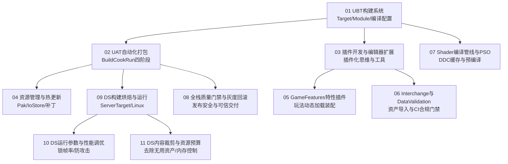

# 08 工具链与打包发布

> 知识成熟度：L2（子域工程手册，已按 14 篇核心专题与 UE5.8 源码基线全面标准化）。
>
> 领域权威导航：[游戏知识 Domain MOC](../../00_Index/domains/游戏知识.md) ｜ [游戏知识总目录](../README.md)。

---

## 1. 核心定位与设计思想

「08-工具链与打包发布」是虚幻引擎商业项目交付的工程化生命线。现代 AAA 游戏项目的研发成败，高度依赖自动化、工业级的工具链体系支撑：
- **自研构建流水线（UBT/UAT）**：UnrealBuildTool 负责解析 C# Target/Module 依赖图并调度编译工具链；UnrealAutomationTool 串联 Cook（烘焙）、Stage（暂存）、Package（打包）与 Archive（归档）自动化全流程；
- **内容解耦与特性装配**：基于 GameFeatures 插件体系实现玩法特性的热插拔与动态装配，依托 Interchange 管线与 DataValidation 实现资产自动化验证与质量门禁；
- **全平台交付与着色器防卡顿**：深入 Shader 编译管线（SCW/DDC），通过 PSO（管线状态对象）预编译缓存彻底消除运行时着色器编译卡顿（Shader Stutter）；
- **专用服务器（DS）工业化构建**：打通 Server.Target.cs、Linux 跨平台交叉编译、Pak/IoStore 资源打包、服务器内容深度裁剪（Strip Server Content）与性能调优。

---

## 2. 专题矩阵与知识状态

| 专题文件（Canonical 路径） | 知识类型 | 成熟度 | 核心工程关注点与落地场景 |
| :--- | :---: | :---: | :--- |
| [01-UBT构建系统与编译配置.md](../../知识/08-工程实践与质量/构建编译与制品/01-UBT构建系统与编译配置.md) | Concept | L2 | UBT 编译管线：Target.cs / Build.cs 依赖拓扑、Debug/Development/Shipping 编译配置、预编译头 PCH 与增量编译加速 |
| [02-UAT与自动化打包.md](../../知识/08-工程实践与质量/构建编译与制品/02-UAT与自动化打包.md) | Concept | L2 | UAT 架构与 BuildCookRun 命令、Cook 资源转换、Stage 暂存、Package 打包与 Archive 归档四阶段流水线 |
| [03-插件开发与编辑器扩展.md](../../知识/08-工程实践与质量/编辑器工具与资产自动化/03-插件开发与编辑器扩展.md) | Concept | L2 | .uplugin 插件组织、Runtime/Editor 模块划分、Toolbar/Menu 扩展、EditorUtilityWidget 与 Slate 定制工具 |
| [04-资源管理与热更新.md](../../知识/08-工程实践与质量/持续交付与发布治理/04-资源管理与热更新.md) | Concept | L2 | PrimaryAssetLabel 资源分包、Pak/IoStore Chunk 划分、差量补丁（Patch）生成、版本清单 Manifest 与热更下载 |
| [05-GameFeatures特性插件.md](../../知识/03-引擎架构与资源系统/插件装配与初始化/05-GameFeatures特性插件.md) | Concept | L2 | GameFeatures 模块化玩法插件：Action 装配器、插件加载/激活状态机、DLC 动态交付与独立资产隔离 |
| [06-Interchange与DataValidation.md](../../知识/08-工程实践与质量/编辑器工具与资产自动化/06-Interchange与DataValidation.md) | Concept | L2 | Interchange 自定义资产导入管线、UEditorValidator 资产合规校验、CI 门禁拦截不合规命名与超规纹理 |
| [07-Shader编译管线与PSO.md](../../知识/08-工程实践与质量/构建编译与制品/07-Shader编译管线与PSO.md) | Concept | L2 | ShaderCompileWorker、DDC 共享衍生数据缓存、PSO 运行时记录（PSO Cache）与提前预编译防止掉帧 |
| [08-全栈质量门禁与灰度回滚.md](../../知识/08-工程实践与质量/持续交付与发布治理/08-全栈质量门禁与灰度回滚.md) | Concept | L2 | CI/CD 自动化构建矩阵、自动化单元/回归测试门禁、Crash/Trace 诊断分析、灰度发布与自动化回滚策略 |
| [09-UE Dedicated Server构建烘焙与运行.md](<../../知识/08-工程实践与质量/构建编译与制品/09-UE%20Dedicated%20Server构建烘焙与运行.md>) | Concept | L2 | Server.Target.cs 编写、Linux 跨平台编译环境配置、无客户端资产烘焙（Cook Server）、双端冒烟测试 |
| [10-UE Dedicated Server运行参数与性能调优.md](<../../知识/08-工程实践与质量/调试与性能分析/10-UE%20Dedicated%20Server运行参数与性能调优.md>) | Concept | L2 | NetServerMaxTickRate 锁帧率、服务器无渲染休眠策略、网络参数调优、连接超时判定与 DDoS 防护 |
| [11-DS内容裁剪与服务器资源预算.md](../../知识/08-工程实践与质量/构建编译与制品/11-DS内容裁剪与服务器资源预算.md) | Concept | L2 | 服务器端动画与音频剥离、材质贴图与碰撞体精简、内存配额监控与 Linux 进程开销极限压降 |
| [12-版本控制与资产协作.md](../../知识/08-工程实践与质量/工程设计与协作/12-版本控制与资产协作.md) | Concept | L2 | 二进制资产（uasset）协作难题、Perforce 独占排他锁工作流、Git LFS 大文件治理与多分支合并策略 |
| [13-本地化发布工作流.md](../../知识/08-工程实践与质量/持续交付与发布治理/13-本地化发布工作流.md) | Concept | L2 | Localization Dashboard 文本提取、多语言 PO 导入导出、音频语音本地化与文化特定资产替换 |
| [14-Python编辑器脚本与资产自动化.md](../../知识/08-工程实践与质量/编辑器工具与资产自动化/14-Python编辑器脚本与资产自动化.md) | Concept | L2 | unreal.EditorSubsystem 族、Python 自动化重命名与贴图格式转换、批量关卡烘焙与无头（Headless）CLI 执行 |

---

## 3. 逻辑学习顺序建议

```mermaid
flowchart TD
    A[01 UBT构建系统<br/>Target/Module/编译配置] --> B[02 UAT自动化打包<br/>BuildCookRun四阶段]
    A --> C[03 插件开发与编辑器扩展<br/>插件化思维与工具]
    B --> D[04 资源管理与热更新<br/>Pak/IoStore/补丁]
    C --> E[05 GameFeatures特性插件<br/>玩法动态加载装配]
    C --> F[06 Interchange与DataValidation<br/>资产导入与CI合规门禁]
    A --> G[07 Shader编译管线与PSO<br/>DDC缓存与预编译]
    B --> H[09 DS构建烘焙与运行<br/>ServerTarget/Linux]
    H --> I[10 DS运行参数与性能调优<br/>锁帧率/防攻击]
    H --> J[11 DS内容裁剪与资源预算<br/>去除无用资产/内存控制]
    B --> K[08 全栈质量门禁与灰度回滚<br/>发布安全与可信交付]
```

1. **第一阶段（编译与打包基本功）**：精读 `01-UBT构建系统与编译配置` 与 `02-UAT与自动化打包`，彻底搞清编译依赖关系与自动化命令行打包流程。
2. **第二阶段（模块化插件与资产合规）**：学习 `03-插件开发`、`05-GameFeatures` 与 `06-Interchange与DataValidation`，掌握模块化解耦与资产上传门禁。
3. **第三阶段（掉帧消除与热更交付）**：主攻 `07-Shader编译管线与PSO` 与 `04-资源管理与热更新`，解决项目上线面临的着色器卡顿与版本增量补丁问题。
4. **第四阶段（专用服务器与工业化交付）**：深入 `09~11 DS 构建/调优/裁剪` 与 `08-全栈质量门禁`，打通 Dedicated Server 生产环境交付。

---

## 4. 游戏与引擎工程落地场景

- **首发进入游戏卡顿清零**：在研发期内录制完整游戏全流程的 PSO 状态，打包时生成稳定 PSO 缓存并于首屏加载界面异步预热，消除所有首次释放技能卡顿；
- **Dedicated Server 极度精简**：通过配置 `Server.Target.cs` 与内容白名单，将客户端的骨骼蒙皮顶点、音效、粒子与高模全部剥离，使 Linux 纯净镜像小于 2GB、单实例内存低于 500MB；
- **CI 自动化拦截不规范资产**：配置 DataValidation 预提交钩子，当美术提交未开启 Mipmap 的 4K 贴图或缺少碰撞的网格体时自动报错并阻断提交。

---

## 5. 跨域技术依赖与前后置导航

- **向下扎根（计算机底座）**：
  - 编译链接与 ABI：[00-10 编译链接与ABI](../../00-计算机与工程基础/10-编译链接与ABI/README.md)
  - 软件工程与持续交付：[00-15 软件工程与构建](../../00-计算机与工程基础/15-软件工程与构建/README.md)
  - 容器云与编排：[00-16 容器云与可观测性](../../00-计算机与工程基础/16-容器云与可观测性/README.md)
- **向上驱动（引擎源码剖析）**：
  - DS 启动与监听源码：[12-32 DS启动与监听源码](../12-引擎源码分析/32-UE%20Dedicated%20Server启动与监听源码.md)
  - UNetDriver 源码：[12-33 UNetDriver与连接通道源码](../12-引擎源码分析/33-UNetDriver与连接通道源码.md)
  - Lyra GameFeatures 源码：[12-40 Lyra-Experience与GameFeature源码](../12-引擎源码分析/40-Lyra-Experience与GameFeature源码.md)
- **横向协同（服务端与质量）**：
  - 服务端 DS 平台化：[游戏服务端 05-UE Dedicated Server平台化](../../游戏服务端/05-UE%20Dedicated%20Server平台化/README.md)
  - 自动化测试与压测：[游戏测试与质量](../../游戏测试与质量/README.md)
