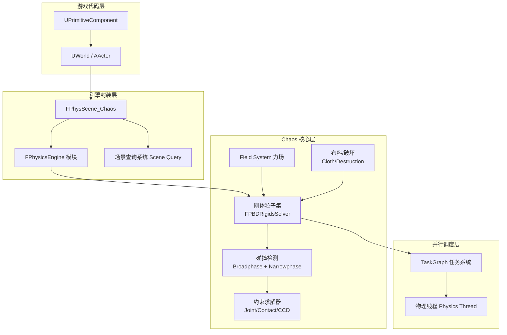
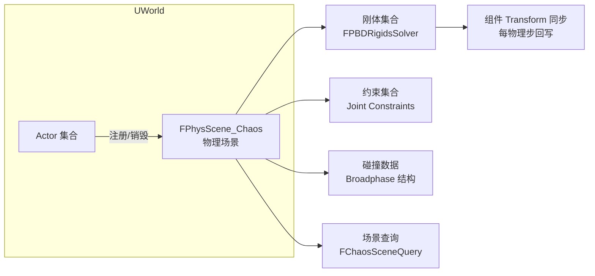
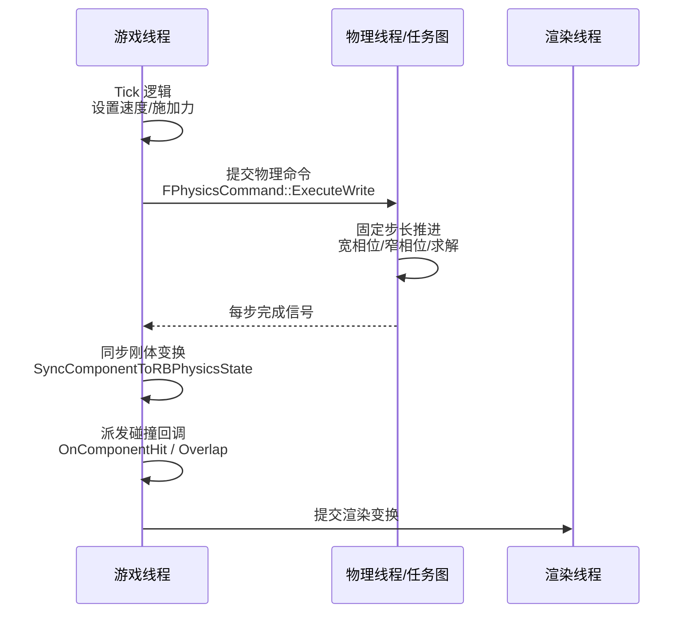
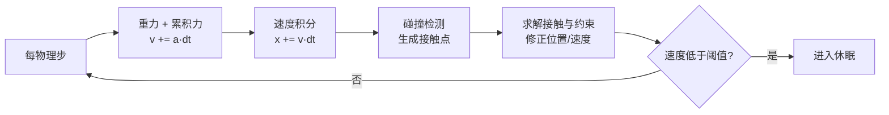
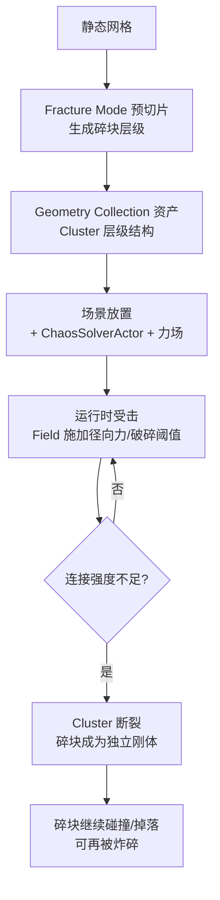

# 01-Chaos物理引擎概览

> 适用版本：UE 5.x（UE5.0 起 Chaos 为默认物理后端；涉及版本差异会单独标注）

## 概述

**Chaos** 是 Epic Games 自研的高性能物理系统，从 UE 4.23 开始以实验性插件形式引入，UE 4.26 加入破坏（Destruction）能力，到 **UE 5.0 正式成为引擎默认物理后端**，全面替代了长期使用的 NVIDIA PhysX。它不是一个简单的"换皮"：Chaos 从底层重新设计了粒子/刚体统一架构，并把**刚体模拟、布料模拟、破坏模拟**收敛到同一套核心之上，让"墙被炸碎、碎块继续碰撞、布料挂在碎块上"这类跨域交互成为原生能力。

对 UE 客户端开发者而言，理解 Chaos 需要抓住四件事：

- **物理场景**：每个 World 对应一个物理场景（`FPhysScene_Chaos`），所有刚体、约束、查询都在其中注册；
- **线程模型**：物理模拟在游戏线程之外的物理线程/任务图上运行，理解"谁在哪个线程改什么数据"是避免踩坑的前提；
- **刚体动力学**：质量、力、冲量、力矩如何决定一个物体的运动，这是所有物理玩法的数学地基；
- **性能预算**：物理是典型的 CPU 密集型系统，需要从数量、迭代、时间步长三个维度做预算管理。

本文是"物理系统"分类的第一篇，目标是建立整体框架：先讲 Chaos 的演进与架构，再深入物理场景与线程模型，然后给出刚体动力学基础，最后简述 Chaos 破坏系统与性能预算。

## 核心概念

| 概念 | 英文 | 说明 | 关键点 |
| --- | --- | --- | --- |
| Chaos 物理系统 | Chaos Physics | Epic 自研物理后端，UE5 默认 | 刚体/布料/破坏统一核心 |
| 物理场景 | FPhysScene | 每个 UWorld 持有的物理世界 | 刚体、约束、查询的注册地 |
| 物理场景句柄 | FPhysicsSceneHandle | Chaos 层的场景封装 | 同步/异步两种模式 |
| 刚体 | Rigid Body | 有质量、可受力、可碰撞的物体 | 由几何体 + 物理材质组成 |
| 动力学刚体 | Dynamic Body | 受重力/力/冲量驱动 | `bSimulatePhysics = true` |
| 运动学刚体 | Kinematic Body | 位置由外部（动画/逻辑）驱动 | 不参与动力学求解 |
| 求解器 | Solver | 求解接触与约束的迭代器 | 位置/速度两阶段迭代 |
| 宽相位 | Broadphase | 粗筛潜在碰撞对 | BVH/网格加速结构 |
| 窄相位 | Narrowphase | 精确求接触点/法线 | 凸体 GJK/EPA，网格采样 |
| 物理线程 | Physics Thread | 执行模拟的线程 | UE 默认异步模拟场景 |
| 固定时间步长 | Fixed Tick | 物理以固定步长推进 | 默认 120Hz（1/120s） |
| 休眠 | Sleeping | 静止刚体进入低开销状态 | 醒来需要超过阈值扰动 |
| 连续碰撞检测 | CCD | 防止高速穿透 | 扫掠式碰撞/Sweep |
| 几何集合 | Geometry Collection | Chaos 破坏的网格资产 | 由碎块（Cluster）层级构成 |
| 力场系统 | Field System | 按空间施加物理影响的系统 | 驱动破坏/扰动的主要手段 |

## 原理详解

### 从 PhysX 到 Chaos：演进路线

UE4 时代物理后端是 NVIDIA PhysX（UE4.26 前默认），它成熟稳定，但存在三个先天问题：

1. **黑盒**：闭源 SDK，Epic 无法修改底层行为，也难以深度集成到引擎渲染/动画管线；
2. **分裂**：刚体（PhysX）、布料（APEX/NvCloth）、破坏（APEX Destruction）是三套独立系统，跨域交互（布料挂在碎块上）成本极高；
3. **破坏能力弱**：PhysX 本身没有真正的"断裂/碎裂"模拟，APEX 破坏是预切片的假破坏。

Chaos 的演进大致分四个阶段：

| 版本 | 里程碑 | 说明 |
| --- | --- | --- |
| UE 4.23~4.25 | 实验性引入 | Chaos 作为实验插件提供刚体/布料基础能力 |
| UE 4.26~4.27 | 破坏系统完善 | Chaos Destruction 与 Field System 进入可用状态 |
| UE 5.0 | 成为默认后端 | 新项目默认 Chaos；PhysX 仍可选 |
| UE 5.3+ | 持续收敛 | 物理控制组件、Chaos Vehicles 稳定、布料工具升级 |

> 注意：UE 5.8 中 PhysX 集成代码已移除（本机 5.8 源码中已无 PhysX 物理模块，仅残留少量构建键与第三方二进制），Chaos 是唯一物理后端。不要在新项目里依赖 PhysX 专属特性。

### Chaos 架构分层

Chaos 的架构可以抽象为四层：



要点说明：

- **引擎封装层**负责把 UE 的 `UPrimitiveComponent`（盒体/球体/胶囊体/网格体组件）翻译成 Chaos 的物理对象，并管理组件变换与物理位置的同步（`FPhysScene::SyncComponentToRBPhysicsState` 等）；
- **物理核心层**以"粒子（Particle）"为基本单元，刚体、布料顶点、破坏碎块在核心层都是粒子集合的不同形态（`FPBDRigidParticle` / `FPBDPositionConstraint` 等），这正是 Chaos 能跨域交互的原因；
- **并行调度层**决定模拟跑在哪些线程上，见下文线程模型。

### 物理场景与世界

UE 中每个 `UWorld` 都会创建一个物理场景（`FPhysScene`），实际类型是 `FPhysScene_Chaos`。它是所有物理内容的"容器"：



与物理场景相关的几个关键事实：

- **场景查询（Scene Query）**：`LineTrace`、`Sweep`、`Overlap` 等查询走的是 `FChaosSceneQuery`，它与模拟（Simulation）相对独立，可以离线查询也可以在线查询；
- **同步/异步场景**：UE 历史上物理场景分 `SyncScene` 与 `AsyncScene`。Chaos 默认把模拟放在异步场景中运行（通过 `FPhysScene_Chaos` 的 solver 线程），游戏线程只做提交与结果回读，从而避免物理模拟阻塞游戏逻辑；
- **多世界**：编辑器里每个 `UWorld`（主世界、预览世界、蓝图编辑器世界）都有独立物理场景，彼此不共享刚体；
- **网络**：服务器与客户端各自有独立物理场景，物理模拟默认**只在服务器权威**，客户端通过变换同步（`ReplicatedMovement` / 插值）呈现，需要小心的是：不要指望客户端物理模拟与服务器完全一致（浮点误差与线程时序都会导致发散）。

### 物理线程模型

UE 的物理执行涉及三个线程角色：

| 线程 | 职责 | 说明 |
| --- | --- | --- |
| 游戏线程（GT） | 提交物理操作、读取物理结果、触发碰撞回调 | 提交时把"意图"打包进命令缓冲区 |
| 物理线程（PT） | 执行模拟求解 | Chaos 的 solver 运行于此，可再并行切分 |
| 渲染线程（RT） | 读取变换渲染 | 变换由 GT 同步，RT 只管绘制 |



开发中最重要的三条线程规则：

1. **不要在物理线程直接改游戏对象**：物理回调（如 `OnComponentHit`）默认在游戏线程派发，但某些 Chaos 内部回调可能在物理线程执行，修改 `UActorComponent` 状态前需要切回游戏线程（用 `AsyncTask(ENamedThreads::GameThread, ...)` 或 `FFunctionGraphTask`）；
2. **物理命令缓冲区**：`FPhysicsCommand::ExecuteWrite/ExecuteRead` 是引擎用来保证"游戏线程提交、物理线程消费"安全的机制，游戏线程上的写操作会排队到物理步进时执行，所以**同一帧内立即读取物理结果可能拿不到最新值**；
3. **Tick 与固定步长**：游戏 Tick 是变步长的，物理模拟通常按**固定步长**推进（5.8 中专用物理线程默认以 `p.Chaos.Thread.DesiredHz`=60 的目标频率推进；异步模式可在 Project Settings → Physics → Framerate 的 `Async Fixed Time Step Size` 调整，默认 1/30；5.8 已无 `p.Chaos.Solver.FixedStep` 这个 CVar）。物理步长与帧率不同步时，引擎会插值刚体位置用于渲染，这就是"物理比帧率平滑"的原因。

### 刚体动力学基础

刚体运动由**牛顿第二定律**与**角动量守恒**共同决定。核心方程如下：

| 物理量 | 公式 | 说明 |
| --- | --- | --- |
| 力 | F = m·a | 力 = 质量 × 加速度 |
| 加速度 | a = F / m | 同等力下质量越大加速度越小 |
| 冲量 | J = F·Δt = m·Δv | 瞬间改变速度的手段（AddImpulse） |
| 动量 | p = m·v | 碰撞守恒的核心量 |
| 力矩 | τ = r × F | 力臂 × 力，产生角加速度 |
| 转动惯量 | I | 由质量分布决定，Chaos 自动从几何体计算 |
| 角动量 | L = I·ω | 角速度 ω 与惯性张量 I 的关系 |

在 UE/Chaos 中的落地方式：

- **质量**：`UPrimitiveComponent::SetMassScale` 调整缩放系数；实际质量 = 几何体体积 × 密度（来自物理材质），Chaos 会自动计算；`bOverrideMass` 可直接指定；
- **力**：`AddForce`（持续力，每物理步都施加）、`AddForceAtLocation`（偏移力臂产生力矩）；
- **冲量**：`AddImpulse`（瞬时速度突变，常用于击飞/爆炸）、`AddImpulseAtLocation`（带旋转冲击）；
- **力矩**：`AddTorqueInRadians` / `AddAngularImpulseInRadians`；
- **休眠**：刚体速度与角速度低于阈值并持续一段时间后自动休眠（Sleeping），醒来需要外部扰动超过阈值。`stat chaos` 里可以看到 `Sleeping Bodies` 数量——把不动的物体尽快休眠是最大性能杠杆。



### UE5 Chaos 破坏系统简述

Chaos Destruction 是 UE5 物理的招牌能力：**任意静态网格可以在运行时被真实地打碎**，碎块之间保留可断裂的连接（Cluster），断裂后继续参与刚体碰撞。

关键资产与工具：

| 资产/工具 | 作用 | 说明 |
| --- | --- | --- |
| Geometry Collection（几何集合） | 破坏的网格资产 | 由 Fracture Mode 从静态网格生成 |
| Fracture Mode（断裂模式） | 编辑器工具 | 选择切片方式（Uniform/Voronoi/Radial/Planar） |
| Cluster | 碎块聚类 | 多个碎块聚合为一个可整体运动的 Cluster |
| Field System（力场） | 运行时施加力的系统 | Radial Vector、Noise、Culling 等场 |
| ChaosSolverActor | 破坏求解器 Actor | 负责一片区域破坏的模拟 |

破坏的典型流程：



运行时破坏通过 **Field System** 驱动：`Radial Vector`（径向力）、`Noise`（随机扰动）、`Culling`（裁剪范围）组合成一个 Field 网络，在 `ChaosSolverActor` 的 `FieldSystem` 组件上执行。UE5 提供了 `Fracture` 演示项目（Content Example）可快速上手。破坏系统的性能要点是**碎块数量**：每块都是独立刚体，数百块的连锁断裂很容易打满 CPU 预算。

### 物理性能预算

物理性能主要被五个因素决定：

| 因素 | 影响 | 预算建议 |
| --- | --- | --- |
| 动力学刚体数量 | 每个刚体参与宽相位/窄相位 | 同屏动态刚体尽量控制在数百以内 |
| 接触点数量 | 网格对网格接触昂贵 | 能用盒体/胶囊体不用网格碰撞 |
| 求解迭代次数 | 迭代越多越稳越贵 | 默认位置/速度迭代足够时别加 |
| CCD 刚体数量 | 每个 CCD 刚体开销数倍 | 只对高速小物体开 CCD |
| 布料/破坏对象 | 粒子量与约束量 | 布料 LOD、碎块上限 |

常用调试命令与统计：

| 命令/工具 | 用途 |
| --- | --- |
| `stat chaos` | Chaos 各项统计（刚体数、休眠数、求解时间） |
| `stat physics` | 物理整体开销 |
| `p.Chaos.Solver.Sleep.Enabled 1` | 启用求解器休眠（5.8 真实名称，默认 1） |
| `p.Chaos.Solver.Collision.Enabled 0/1` | 开关碰撞检测（5.8 真实名称，默认 1） |
| Chaos Visual Debugger（CVD） | 可视化物理线程的碰撞与约束状态 |
| `FreezeRendering` 配合 `stat` | 冻结渲染定位物理峰值 |

一条实用的经验公式：**先数"动态刚体数 × 是否休眠"，再看接触对，最后才考虑迭代**。绝大多数物理卡顿都来自"不该动的物体在动"或"网格碰撞被滥用"。

## 代码/蓝图示例

### C++：创建一个可物理模拟的物体并施加力

```cpp
// MyThrower.h
UCLASS()
class AMyThrower : public AActor
{
    GENERATED_BODY()
public:
    AMyThrower();

    UPROPERTY(VisibleAnywhere, BlueprintReadOnly)
    class UStaticMeshComponent* MeshComp;

    UFUNCTION(BlueprintCallable, Category = "Physics")
    void ThrowSphere(const FVector& ImpulseDirection, float ImpulseStrength);

    UFUNCTION(BlueprintCallable, Category = "Physics")
    void ApplyConstantForce(const FVector& Force, bool bWake);
};
```

```cpp
// MyThrower.cpp
#include "MyThrower.h"
#include "Components/StaticMeshComponent.h"

AMyThrower::AMyThrower()
{
    PrimaryActorTick.bCanEverTick = false;

    MeshComp = CreateDefaultSubobject<UStaticMeshComponent>(TEXT("MeshComp"));
    RootComponent = MeshComp;

    // 开启物理模拟：刚体动力学
    MeshComp->SetSimulatePhysics(true);
    // 质量缩放：让物体更"重"
    MeshComp->SetMassScale(NAME_None, 2.0f);
    // 开启重力
    MeshComp->SetEnableGravity(true);
}

void AMyThrower::ThrowSphere(const FVector& ImpulseDirection, float ImpulseStrength)
{
    // 冲量：瞬时速度突变（质量会参与换算：J = m·Δv）
    MeshComp->AddImpulse(ImpulseDirection.GetSafeNormal() * ImpulseStrength, NAME_None, /*bVelocityChange=*/false);
}

void AMyThrower::ApplyConstantForce(const FVector& Force, bool bWake)
{
    // 持续力：每个物理步都会施加
    MeshComp->AddForce(Force, NAME_None, /*bAccelChange=*/false, bWake);
}
```

要点：

- `bVelocityChange = true` 时忽略质量（直接改速度），适合做"统一手感"的击飞；
- `bAccelChange = true` 时 `Force` 被当作加速度而非力，适合让不同质量物体获得相同加速度；
- 施加物理操作后，结果要等物理步进才生效，不要在同一帧内 `AddImpulse` 后立刻读位置。

### 蓝图对照

1. 在关卡中放置一个 Static Mesh Actor，细节面板勾选 **Simulate Physics**；
2. 事件图表中调用 `Add Impulse` / `Add Force` / `Add Torque in Radians` 节点（都在 Physics 分类下）；
3. 需要读取物理状态时使用 `Get Physics Linear Velocity` / `Is Simulating Physics` / `Is Gravity Enabled`；
4. 观察物体是否休眠：选中物体看细节面板的 Physics 选项，静止物体在 `stat chaos` 中会出现在 Sleeping 列表。

### 破坏系统最小示例（蓝图思路）

1. 内容浏览器导入静态网格 → 菜单 Tools → Fracture Mode（或 Geometry → Fracture）；
2. 选择切片方式（如 Voronoi，碎块数 20~50），生成 Geometry Collection 资产；
3. 把资产拖入场景（会自动生成 GeometryCollectionActor），再放置一个 ChaosSolverActor 绑定；
4. 给 GeometryCollectionComponent 的 `OnChaosBreakEvent` 绑定事件，在碎块断裂时播放音效/特效；
5. 运行时调用蓝图节点 `Apply Radial Force`（作用于 FieldSystem）或 `Wake Rigid Bodies` 触发破坏。

## 最佳实践

- **默认用异步场景**：不要为省事把物理切成同步模式，异步模拟是 Chaos 性能与稳定性的基础；
- **数量预算先行**：开发现场先定"同屏动态刚体上限"，比如普通玩法 200、破坏场景 500，超了先砍数量再谈优化；
- **让物体尽快休眠**：静止的杂物设置合理休眠阈值（或手动 `PutRigidBodyToSleep`），休眠刚体几乎零开销；
- **高速物体开 CCD**：子弹、弹片等小而快的物体勾选 Use CCD，避免隧道效应穿墙，但别给所有物体开；
- **固定步长别乱改**：默认 120Hz 物理帧率适合绝大多数游戏；改低（如 60Hz）省 CPU 但会让高速碰撞变差，改高更稳但更贵；
- **质量用密度而非硬编码**：通过物理材质密度 + 几何体体积得到质量最自然，`SetMassScale` 做微调；
- **回调里只读不改**：`OnComponentHit` 回调中避免立即 `SetActorLocation` 或销毁 Actor（可能与物理线程竞争），用 `FTimerHandle` 延后一帧；
- **用 CVD 而不是猜**：Chaos Visual Debugger 能直接看到物理线程的碰撞点与约束，性能或穿模问题先开它看数据。

## 常见问题 FAQ

**Q1：UE5 里还能用 PhysX 吗？**
A：UE 5.x 中 PhysX 相关代码仍存在且部分项目可切回，但 Epic 已不再把它作为默认与长期方向。新项目、新功能（破坏、布料、车辆）都应使用 Chaos，不要依赖 PhysX 专属行为。

**Q2：`AddImpulse` 后物体没有动？**
A：先确认 `bSimulatePhysics` 已开启、重力正常、物体未被锁定（Lock 相关属性）；再确认没有其他约束/附着（Attach）把物体钉住；最后注意冲量在物理步进后才生效，别在提交后同帧断言结果。

**Q3：为什么两个物体穿了（隧道效应）？**
A：物体移动速度 × 物理步长 > 物体尺寸时就会穿透。对策：开启 CCD（Use CCD）、降低最大速度（Max Linear Velocity）、提高物理固定帧率（如 1/240）。

**Q4：物理很卡，第一步排查什么？**
A：开 `stat chaos` 看 Number of Bodies、Sleeping Bodies、Collision Detected。如果刚体数量正常，再看是否有大量未休眠的刚体、是否有网格碰撞（Mesh Collision）的接触对。80% 的卡顿来自这两个点。

**Q5：服务器与客户端物理不一样怎么办？**
A：这是预期行为——物理是浮点迭代，不同机器、不同线程时序必然发散。正确做法：物理模拟只在服务器跑（或只在客户端做表现），网络同步位置/旋转，客户端用插值平滑。不要把玩法判定依赖客户端本地物理。

**Q6：`stat chaos` 显示 Solver 迭代很高？**
A：迭代次数由 Project Settings 的 Physics 设置（位置/速度迭代）决定，堆叠场景（箱子塔）会触发更多迭代。先检查接触对是否过多（堆叠物体用更大接触面），再考虑切换求解器类型（如 PBD 换 XPBD，更稳定但更贵），最后才是降迭代。

**Q7：破坏碎块数量一多就卡？**
A：限制单次断裂的碎块总数（Fracture 时控制切片数），给碎块加"生命周期"（几秒后休眠或销毁），并用 Culling 场把玩家看不到区域的破坏模拟关掉。

## 关联阅读

- [02-碰撞检测与物理材质](02-碰撞检测与物理材质.md)：碰撞通道、Hit/Overlap 事件与物理材质——刚体"怎么撞"的细节；
- [03-物理约束与关节](03-物理约束与关节.md)：约束求解与关节——刚体"怎么连"；
- [04-布娃娃与物理动画](04-布娃娃与物理动画.md)：Chaos 在角色身上的应用——布娃娃、布料与物理动画；
- 01-引擎基础：UWorld/Component 生命周期是物理场景注册的基础；
- 06-网络同步：物理结果的服务器权威与客户端插值策略。
