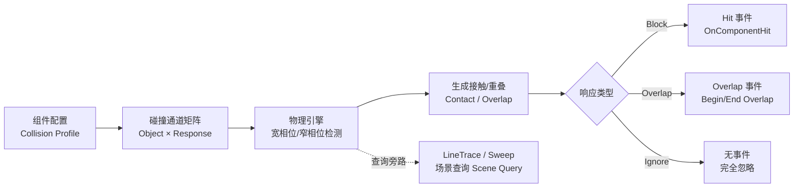
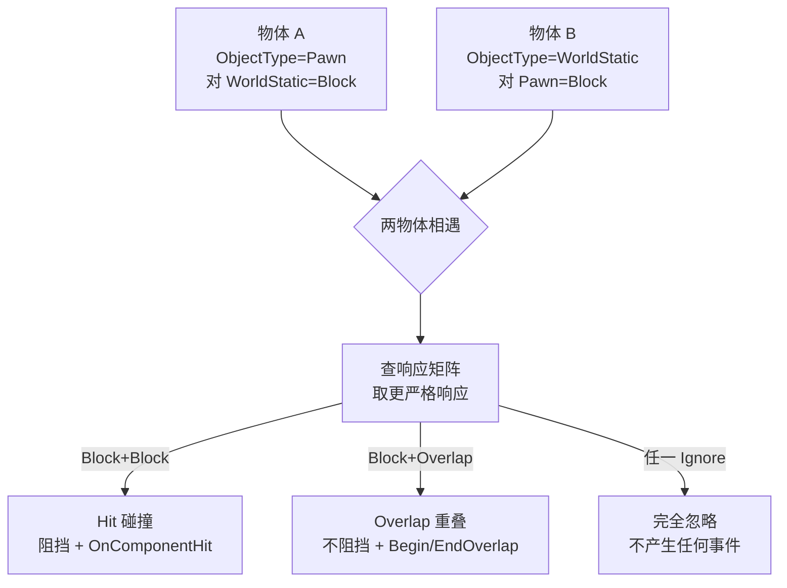
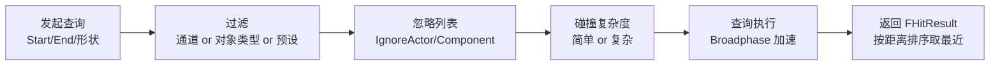
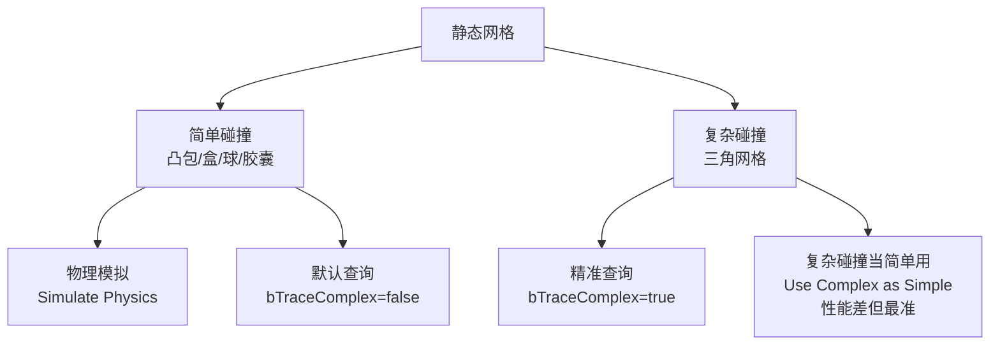

# 02-碰撞检测与物理材质

> 版本基准：UE 5.8.0（本机 `Engine/Build/Build.version`：CL 55116800，分支 `++UE5+Release-5.8`）。
> 源码依据：`C:\Program Files\Epic Games\UE_5.8\Engine\Source\Runtime\Engine\Classes\PhysicsEngine`、`Engine\Source\Runtime\PhysicsCore`。
> 适用范围：Chaos 碰撞通道、查询、事件和物理材质的运行时使用。
> 兼容性边界：UE 4.27/PhysX 仅作为历史迁移对照，当前物理后端以本机 UE 5.8 Chaos 源码为准。
> 最后更新：2026-08-05（统一 UE5.8 版本基线）。

## 概述

碰撞系统回答三个问题：**谁能与谁碰撞**（通道与响应）、**碰撞时通知谁**（事件）以及**碰撞后怎么表现**（物理材质）。在 UE 中这三件事分别由三套配置承载：

- **碰撞通道与预设（Collision Channel / Preset）**：定义"分类"与"回应方式"，是碰撞体系的骨架；
- **碰撞事件（Hit / Overlap）**：把物理层面的接触翻译成玩法层面的通知，是物理与游戏逻辑的接口；
- **物理材质（Physical Material）**：摩擦、弹性、密度、表面类型，决定接触后的力学行为与表现反馈。

再加上**射线/扫描查询（Line Trace / Sweep）**——它不是模拟碰撞，而是"问一句场景里这条线上有什么"，是命中判定、视线检测、AI 探测的通用工具。最后是**复杂碰撞**：什么时候用凸包、什么时候用三角网格，直接决定精度与性能的取舍。



## 核心概念

| 概念 | 英文 | 说明 | 关键点 |
| --- | --- | --- | --- |
| 对象类型 | Object Type | 物体的碰撞分类（ECC_WorldStatic 等） | 每个组件一个 Object Type |
| 碰撞响应 | Collision Response | 对某对象类型的回应方式 | Ignore / Overlap / Block 三态 |
| 碰撞预设 | Collision Preset | 一组"对象类型 + 响应矩阵"的配置 | 可在 Project Settings 全局管理 |
| 物理通道 | Physics Channel | 引擎预置通道（WorldStatic/Pawn 等） | 前 3 个可自定义改名 |
| 追踪通道 | Trace Channel | 查询专用通道（Visibility/Camera） | 只在查询中使用 |
| 命中事件 | Hit Event | Block 响应的接触通知 | OnComponentHit / Hit 委托 |
| 重叠事件 | Overlap Event | Overlap 响应的进入/离开通知 | BeginOverlap / EndOverlap |
| 物理材质 | Physical Material | 摩擦/弹性/密度/表面类型 | 资产 UPhysicalMaterial |
| 摩擦合并 | Friction Combine | 双方摩擦系数的合成方式 | Min/Max/Multiply/Average |
| 射线检测 | Line Trace | 单点对单点的查询 | 返回 FHitResult |
| 扫描检测 | Sweep | 形状沿路径移动的查询 | Capsule/Box/Sphere Sweep |
| 对象查询 | Object Query | 按对象类型过滤的查询 | 可以组合多种类型 |
| 简单碰撞 | Simple Collision | 凸体近似（盒/球/胶囊/凸包） | 物理模拟与查询默认用它 |
| 复杂碰撞 | Complex Collision | 三角网格碰撞 | 查询可用，物理模拟默认不支持 |
| 命中结果 | FHitResult | 查询返回的完整信息 | 位置/法线/距离/物理材质等 |

## 原理详解

### 碰撞通道体系

UE 的碰撞过滤本质是一个**二维矩阵**：每个物体有"对象类型"（Object Type），对矩阵中的每一列（其他对象类型或追踪通道）声明"回应方式"。两个物体相遇时，引擎取**双方各自声明的响应中更严格的那个**：

- **Block + Block → Block**（发生 Hit）；
- **Block + Overlap → Overlap**（发生 Overlap，不挡路）；
- **Block/Overlap + Ignore → Ignore**（任何一方 Ignore 即忽略）。



通道分为两大类：

| 通道类别 | 内置成员 | 用途 |
| --- | --- | --- |
| 物理通道（Object） | WorldStatic、WorldDynamic、Pawn、PhysicsBody、Vehicle、Destructible | 物体的"身份"，可自定义新增（上限 18 个对象通道） |
| 追踪通道（Trace） | Visibility、Camera | 只在 LineTrace/Sweep 查询中使用，表达"查询意图" |

在 Project Settings → Engine → Collision 中可以：

- 为前 3 个物理通道改名（如把 `WorldStatic` 改为 `Level`）；
- 新增自定义通道（注意对象通道数量上限）；
- 查看/编辑每个预设（Preset）的响应矩阵；
- 创建"Engine Trace Channel"（如 `Interaction`、`Melee`）供代码/蓝图查询使用。

### 碰撞预设（Collision Presets）

预设是"对象类型 + 全矩阵响应"的命名配置，挂在每个 `UPrimitiveComponent` 的 `Collision Profile Name` 上。常用内置预设：

| 预设 | 对象类型 | 典型行为 | 适用 |
| --- | --- | --- | --- |
| WorldStatic | WorldStatic | 阻挡 Pawn/PhysicsBody | 地面、墙体 |
| WorldDynamic | WorldDynamic | 阻挡大部分 | 可移动机关、门 |
| Pawn | Pawn | 阻挡 WorldStatic，Overlap 部分 | 角色胶囊体 |
| PhysicsActor | PhysicsBody | 全 Block，物理模拟 | 刚体道具 |
| CharacterMesh | Pawn | 阻挡 WorldStatic，Overlap 其他 | 角色骨骼网格 |
| OverlapAll | WorldDynamic | 全 Overlap | 触发区域 |
| IgnoreOnlyPawn | WorldDynamic | 忽略 Pawn，其余 Block | 特殊机关 |
| NoCollision | WorldStatic | 全 Ignore | 纯装饰 |

引擎判定"哪边响应生效"时遵循规则：**两个组件都查对方的响应声明，取更严格的回应**（Ignore 最松、Block 最严）。因此即使一个组件设置"全 Block"，只要对方声明 Ignore 自己，就依然不会碰撞——这在调试"为什么没撞上"时是第一个要检查的点。

### 碰撞事件：Hit 与 Overlap

**Hit 事件**（Block 响应产生）：`OnComponentHit`，物理接触发生时触发，参数包含撞击对象、法线、冲量等。适合：打击判定、落水判定、受击反馈。

**Overlap 事件**（Overlap 响应产生）：`OnComponentBeginOverlap` / `OnComponentEndOverlap`，进入/离开触发区域时触发，不产生物理阻挡。适合：拾取范围、敌人警戒圈、单向门。

| 对比项 | Hit | Overlap |
| --- | --- | --- |
| 所需响应 | Block | Overlap（双方） |
| 阻挡运动 | 是 | 否 |
| 触发条件 | 实际接触（含持续接触） | 进入/离开边界 |
| 参数 | 命中法线/冲量/物理材质 | 对方组件/其他重叠体 |
| 常用场景 | 打击、碰撞反馈 | 触发器、范围判定 |

需要特别记住的触发条件：

1. Hit 只在 Block 响应下产生，而且**移动方需要开启 `Simulation Generates Hit Events`**（或组件在模拟物理）；两个静止物体相叠不会反复触发 Hit；
2. Overlap 要求**至少一方声明 Overlap 响应**，且双方都要勾选 `Generate Overlap Events`；
3. 用 `SetActorLocation` 移动（瞬移）不会产生 Hit，只会产生 Overlap 判定（实际上瞬移连 Overlap 也不触发，除非 Sweep 参数为 true）；
4. 角色移动（CharacterMovement）产生的碰撞走的是 `OnComponentHit`（组件级）或 `OnActorHit`（Actor 级转发），两者都可用。

### 物理材质（Physical Material）

物理材质是 `UPhysicalMaterial` 资产（内容浏览器右键 → Physics → Physical Material），它决定"撞上之后怎么动"与"撞上之后反馈什么"：

| 属性 | 说明 | 典型值 |
| --- | --- | --- |
| Friction（摩擦） | 滑动阻力系数 | 冰 0.05，地面 0.6，橡胶 1.0 |
| Friction Combine Mode | 双方摩擦如何合成 | Average（默认）/ Min / Max / Multiply |
| Restitution（弹性） | 反弹系数，0 无反弹 1 完全反弹 | 橡胶球 0.7~0.9 |
| Restitution Combine Mode | 双方弹性如何合成 | 同上四种 |
| Density（密度） | 决定质量 = 体积 × 密度 | 水 1000，铁 7800（kg/m³） |
| Surface Type（表面类型） | 供音效/脚印/弹孔查表 | 自定义枚举，如金属/木头/肉 |
| RaiseMassToMinimum | 低于下限的质量提到下限 | 防止小物体质量过小抖动 |

两个关键机制：

- **合并模式（Combine Mode）**：碰撞双方的材质各自有摩擦/弹性，最终生效值由合并模式计算。例如冰面（0.05）与橡胶（1.0）Average 后是 0.525——如果想做"冰上滑"效果，需要把冰的摩擦设为极小且用 Min 合并；
- **表面类型**：不参与力学计算，但 `FHitResult::PhysMaterial->SurfaceType` 可以取到，用于脚步音效、子弹弹孔、滑行痕迹等表现层逻辑。

物理材质可以挂在多个层级：`UStaticMesh` 的 `Physics Material`（槽位材质）、`UPrimitiveComponent` 的 `PhysMaterialOverride`（组件覆盖）、骨骼体（Physics Asset 中每个 Body 的物理材质）。优先级：组件覆盖 > 骨骼体/槽位 > 网格资产默认。

### 射线检测与扫描查询（Scene Query）

场景查询（Scene Query）不走模拟，而是即时在碰撞数据上"问问题"。核心 API 都在 `UWorld` 上：

| API | 说明 |
| --- | --- |
| `LineTraceSingleByChannel` | 单线检测（返回第一个命中） |
| `LineTraceMultiByChannel` | 多线检测（返回所有命中，需排序） |
| `SweepSingleByChannel` | 形状沿直线扫描（盒子/球/胶囊） |
| `SphereTraceSingleByChannel` | 球体扫描，常用代理 |
| `OverlapAnyTestByChannel` | 只问"有没有重叠"（不返回命中详情，更快） |
| `LineTraceSingleByObjectType` | 按对象类型过滤（可组合多种类型） |
| `LineTraceSingleByProfile` | 按碰撞预设过滤 |

返回值 `FHitResult` 的关键字段：

| 字段 | 含义 |
| --- | --- |
| `bBlockingHit` | 是否命中（最重要，先看它） |
| `HitActor` / `HitComponent` | 命中对象 |
| `Time` / `Distance` | 从起点到命中点的比例/距离 |
| `ImpactPoint` | 世界坐标命中点 |
| `ImpactNormal` | 命中表面法线（世界坐标） |
| `Normal` | 表面法线（可能不同，受组件变换影响） |
| `PenetrationDepth` | 穿透深度（Sweep 时有用） |
| `PhysMaterial` | 命中点的物理材质（需 `bReturnPhysicalMaterial`） |
| `BoneName` | 命中的骨骼（对骨骼网格） |
| `Item` / `ElementIndex` | 命中的三角形/元素索引 |

查询参数（`FCollisionQueryParams`）常用项：

- `bTraceComplex`：true 时对复杂碰撞（三角网格）检测，false 用简单碰撞（默认）；
- `bReturnPhysicalMaterial`：返回物理材质（有额外开销）；
- `bReturnFaceIndex`：返回三角形索引（供"哪个面被打中"使用）；
- `AddIgnoredActor` / `AddIgnoredComponent`：跳过特定对象（例如不检测自己）；
- `TraceTag`：给查询命名，配合 `Show Collision` 可视化调试。



### 复杂碰撞：凸包与三角网格

UE 中"碰撞形状"分两级：

| 类型 | 说明 | 用途 |
| --- | --- | --- |
| 简单碰撞（Simple） | 球/盒/胶囊/凸包（KDOP、Hull） | 物理模拟、默认查询，性能好 |
| 复杂碰撞（Complex） | 三角网格（Triangle Mesh） | 精准查询（bTraceComplex=true），不可用于物理模拟 |

关键规则：

- **物理模拟（Simulate Physics）只用简单碰撞**——网格体组件即使勾选模拟物理，也只会用它的简单碰撞凸体，三角网格会被忽略；
- **查询默认也用简单碰撞**，只有 `bTraceComplex = true` 才对三角网格检测；对静态网格而言，`Collision Complexity` 设为 `Use Complex Collision as Simple` 可以让查询/模拟都直接使用网格本身（牺牲性能）；
- **凸包（Convex Hull）**是"能包住网格的最小凸多面体"，UE 支持 `Auto Convex Collision`（自动生成多个凸包近似凹形网格，如管道、L 形墙）；
- 在静态网格编辑器（Static Mesh Editor）的 Collision 面板可以：`Auto Convex Collision`（自动凸包）、`Copy Collision From Static Mesh`、手动添加盒体/球体/胶囊体/凸包，以及查看 `Collision Complexity`。



## 代码/蓝图示例

### C++：射线检测（Line Trace）

```cpp
#include "Engine/World.h"
#include "Engine/HitResult.h"
#include "CollisionQueryParams.h"

void AMyCharacter::TraceShoot(const FVector& AimStart, const FVector& AimEnd)
{
    FCollisionQueryParams Params;
    Params.bTraceComplex = false;          // 用简单碰撞，性能好
    Params.bReturnPhysicalMaterial = true; // 需要物理材质（弹孔/音效）
    Params.AddIgnoredActor(this);          // 忽略自己
    Params.AddIgnoredActor(GetAttachParentActor());
    Params.TraceTag = TEXT("PlayerShoot");

    FHitResult Hit;
    bool bHit = GetWorld()->LineTraceSingleByChannel(
        Hit,
        AimStart,
        AimEnd,
        ECC_Visibility,   // 使用追踪通道 Visibility
        Params
    );

    if (bHit && Hit.bBlockingHit)
    {
        // 命中：取命中点、法线与物理材质
        FVector ImpactPoint = Hit.ImpactPoint;
        FVector ImpactNormal = Hit.ImpactNormal;
        if (UPhysicalMaterial* PhysMat = Hit.PhysMaterial.Get())
        {
            EPhysicalSurface Surface = PhysMat->SurfaceType;
            // 根据 SurfaceType 播放对应音效/特效
        }
        // 对可破坏对象施加伤害
        if (Hit.GetActor())
        {
            Hit.GetActor()->TakeDamage(10.0f, /*...*/);
        }
    }
}
```

### C++：绑定 Overlap 事件（拾取触发）

```cpp
// 在 AMyPickup::BeginPlay 中
UPrimitiveComponent* Trigger = GetComponentByClass<UPrimitiveComponent>();
if (Trigger)
{
    // 要求：组件响应为 Overlap，且 GenerateOverlapEvents = true
    Trigger->OnComponentBeginOverlap.AddDynamic(this, &AMyPickup::OnBeginOverlap);
    Trigger->OnComponentEndOverlap.AddDynamic(this, &AMyPickup::OnEndOverlap);
}

void AMyPickup::OnBeginOverlap(UPrimitiveComponent* OverlappedComp, AActor* OtherActor,
    UPrimitiveComponent* OtherComp, int32 OtherBodyIndex, bool bFromSweep, const FHitResult& SweepResult)
{
    if (OtherActor && OtherActor != this && OtherActor->IsA<AMyCharacter>())
    {
        // bFromSweep 为 true 表示对方是"扫掠"进来的（如角色胶囊体移动）
        Collect();
    }
}

void AMyPickup::OnEndOverlap(UPrimitiveComponent* OverlappedComp, AActor* OtherActor,
    UPrimitiveComponent* OtherComp, int32 OtherBodyIndex)
{
    // 离开触发区
}
```

### C++：动态切换物理材质与碰撞响应

```cpp
// 切换到"冰面"手感：改摩擦并改用 Min 合并，让冰面完全滑
void AMyCharacter::EnableIcePhysics(UPrimitiveComponent* Comp)
{
    UPhysicalMaterial* IceMat = LoadObject<UPhysicalMaterial>(nullptr,
        TEXT("/Game/Physics/Materials/PM_Ice.PM_Ice"));
    if (IceMat)
    {
        Comp->SetPhysMaterialOverride(IceMat);
    }
}

// 运行时修改碰撞响应：让角色忽略某物体的碰撞
void AMyCharacter::IgnoreActor(AActor* ActorToIgnore, bool bIgnore)
{
    if (ActorToIgnore)
    {
        // 设置 Capsule 对对方组件的响应
        if (UPrimitiveComponent* Other = ActorToIgnore->GetComponentByClass<UPrimitiveComponent>())
        {
            GetCapsuleComponent()->IgnoreActorWhenMoving(ActorToIgnore, bIgnore);
        }
    }
}
```

### 蓝图对照

1. **射线检测**：蓝图节点 `Line Trace By Channel`（在 Collision 分类），输入 Start/End，输出 Hit Result 与 Return Value；勾选 `Trace Complex`、`Return PhysMat`；
2. **球体扫描**：`Sphere Trace By Channel`，需要提供 Radius；
3. **重叠事件**：组件细节面板勾选 `Generate Overlap Events`，事件图表中 `On Component Begin Overlap` / `On Component End Overlap` 事件节点；
4. **命中事件**：组件勾选 `Simulation Generates Hit Events`，使用 `On Component Hit` 事件；
5. **查询过滤**：`Get Hit Result Under Cursor by Channel`（鼠标拾取）、`Line Trace by Object Types`（多对象类型）、`Line Trace by Profile`（预设过滤）；
6. **调试**：编辑器控制台 `Show Collision`（显示碰撞体）、`Show Collision Complexity`（显示三角网格碰撞）。

## 最佳实践

- **通道语义化**：项目初始化时就把物理通道规划好（如 `Projectile`、`Interact`、`Melee`），预设集中管理，禁止到处硬编码 ECC 数字；
- **预设优先于单组件修改**：能改 Preset 就改 Preset，组件级响应覆盖（`SetCollisionResponseToChannel`）会让人难以追踪；
- **查询默认简单碰撞**：只有"必须命中网格细节"（如弹孔贴点）时才开 `bTraceComplex`，且配合距离限制；
- **Overlap 用于范围，Hit 用于接触**：触发区域用 Overlap（开销小、无阻挡），打击判定用 Hit/Sweep；
- **善用忽略列表**：射线从枪口出发先忽略持枪者与友方，避免自伤误判；
- **物理材质合并模式要刻意设计**：冰面 + Min、橡胶球 + Multiply（0.9×0.9）等，别被 Average 的"和稀泥"坑了手感；
- **静态网格的碰撞形状在资产里做**：`Auto Convex Collision` 生成凸包后，运行时零成本，不要用复杂碰撞硬扛；
- **网络下碰撞事件只在服务器判定**：伤害、拾取等逻辑放服务器，客户端只播表现，防止作弊与不同步。

## 常见问题 FAQ

**Q1：设置了碰撞但两个物体就是穿过去？**
A：按顺序排查：① 双方响应矩阵是否有一方 Ignore（取更严格规则）；② 预设是否被组件覆盖；③ 是否其中一个没有碰撞体（Collision Enabled 为 NoCollision）；④ 移动方式是瞬移（SetActorLocation 无 Sweep）——瞬移不产生碰撞，需要 Sweep 参数；

**Q2：OnComponentHit 不触发？**
A：确认响应是 Block、移动组件勾选了 `Simulation Generates Hit Events`（角色移动组件默认开）、并且对方不是 Ignore。另外**瞬移不会触发 Hit**，用 `AddActorWorldOffset(..., true)`（Sweep）移动才会。

**Q3：Overlap 不触发？**
A：三条件缺一不可：① 双方至少一方响应为 Overlap；② 双方 `Generate Overlap Events` 都勾选；③ 双方都有碰撞体且 Collision Enabled。还要注意：用 `SetActorLocation` 瞬移进入区域**不会**触发 BeginOverlap（需要 Sweep 或物理移动）。

**Q4：射线检测结果不准/有偏差？**
A：检查是否忽略了自己（AddIgnoredActor(this)）；检查 `bTraceComplex` 是否符合预期（简单/复杂碰撞结果不同）；Multi 查询记得按 Distance 排序；还有 `FCollisionQueryParams` 的 `TraceTag` 配合 `Show Collision` 可视化看实际检测路径。

**Q5：角色走在冰面上不滑？**
A：摩擦的最终值受 Combine Mode 影响。把冰的 Friction 设 0.05 的同时把合并模式设为 Min，才能保证地面（0.6）与冰（0.05）取最小。Average 模式下 0.6 与 0.05 会合成 0.325，依旧很"抓地"。

**Q6：弹孔/脚印音效怎么区分材质？**
A：用物理材质的 Surface Type。射线查询时 `bReturnPhysicalMaterial = true`，命中后读 `Hit.PhysMaterial->SurfaceType`，按枚举查音效/特效表（DataTable）。注意 SurfaceType 是引擎全局枚举，在 Project Settings → Physics 中自定义。

**Q7：角色胶囊体与网格碰撞不一致？**
A：胶囊体是角色的简单碰撞（用于移动/阻挡），骨骼网格（CharacterMesh）是视觉层，两者碰撞配置独立。被攻击判定等走胶囊体；需要"贴身细节"的判定走骨骼网格复杂碰撞或物理资产。别把玩法判定绑在骨骼网格上（每帧开销大且容易因动画抖动误判）。

## 关联阅读

- [01-Chaos物理引擎概览](01-Chaos物理引擎概览.md)：碰撞检测在物理场景中的位置（宽相位/窄相位）；
- [03-物理约束与关节](03-物理约束与关节.md)：碰撞禁用（Disable Collision）与约束的组合使用；
- [04-布娃娃与物理动画](04-布娃娃与物理动画.md)：物理资产中的碰撞体（骨骼体）配置；
- 03-游戏玩法编程：GAS/伤害系统与碰撞事件的配合；
- 05-AI 系统：射线检测在视线探测中的应用。
