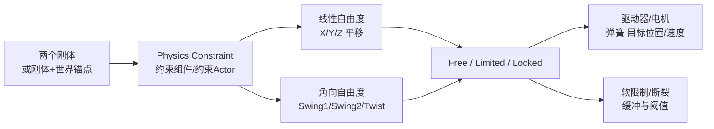
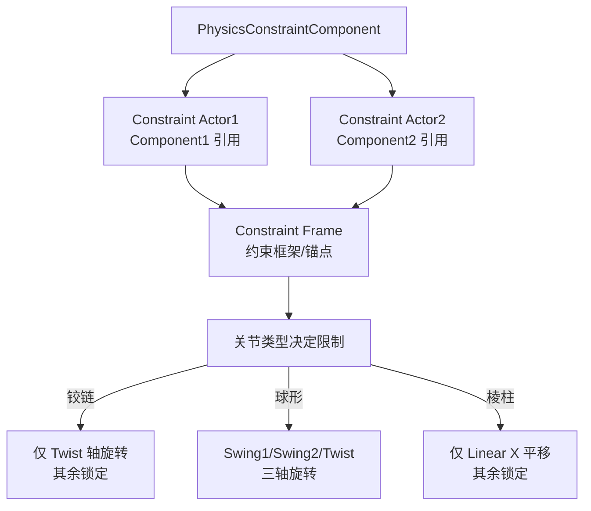
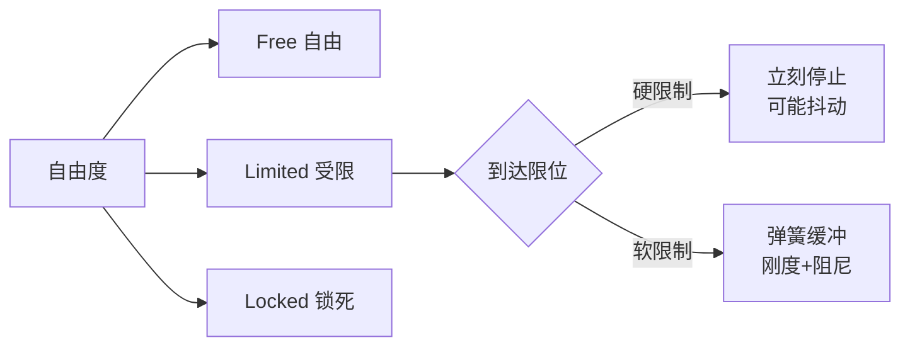
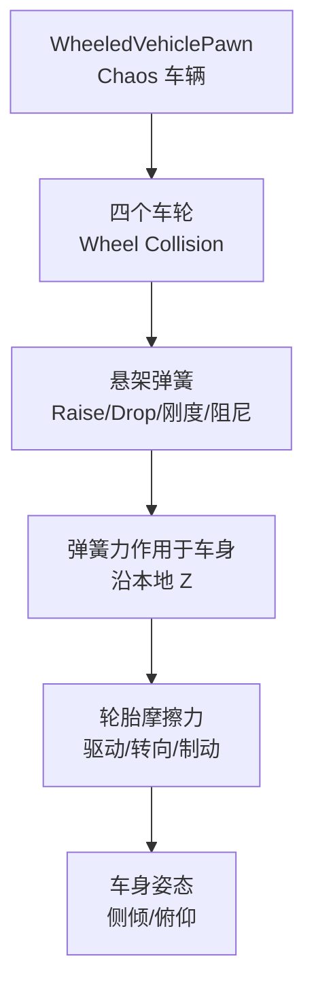
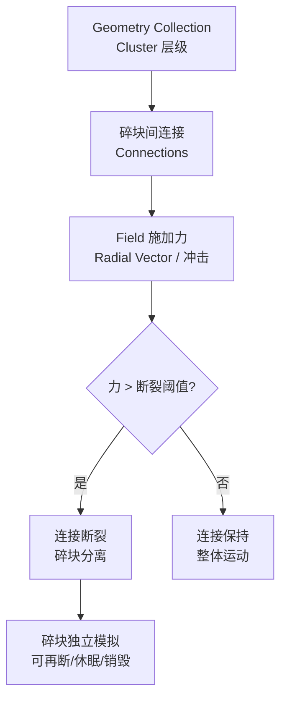

# 03-物理约束与关节

> 版本基准：UE 5.8.0（本机 `Engine/Build/Build.version`：CL 55116800，分支 `++UE5+Release-5.8`）。
> 源码依据：`C:\Program Files\Epic Games\UE_5.8\Engine\Source\Runtime\Engine\Classes\PhysicsEngine`、`Engine\Source\Runtime\PhysicsCore`。
> 适用范围：UPhysicsConstraintComponent、线性/角向自由度、驱动与可断裂约束。
> 兼容性边界：UE 4.27/PhysX 仅作为历史迁移对照，当前物理后端以本机 UE 5.8 Chaos 源码为准。
> 最后更新：2026-08-05（统一 UE5.8 版本基线）。

## 概述

单独的刚体只会自由落体与碰撞，而游戏里大量物体需要"**被连接起来**"：门绕轴旋转、摇杆在球窝里转动、抽屉沿滑轨拉出、车辆通过悬架贴地、尸体通过关节摆成布娃娃。这些全部由**物理约束（Physics Constraint）**实现。

UE 中约束的载体是 `UPhysicsConstraintComponent`（或独立的 `PhysicsConstraintActor`），它可以连接两个刚体（或一个刚体 + 世界锚点），通过限制**线性自由度（Linear DOF）**与**角向自由度（Angular DOF）**来约束相对运动。在此基础上，约束还可以：

- **锁定/限制**：把某个轴向完全锁死（Locked）、允许一定范围（Limited）或完全自由（Free）；
- **驱动**：用弹簧/电机把约束推向目标位置或速度（Constraint Drive / Motor）；
- **软限制**：到达限位时以弹性缓冲替代硬碰撞（Soft Limits）；
- **断裂**：受冲击超过阈值时约束断开（Breakable），Chaos 破坏系统的碎块连接正是基于这一机制。



## 核心概念

| 概念 | 英文 | 说明 | 关键点 |
| --- | --- | --- | --- |
| 约束组件 | PhysicsConstraintComponent | 挂在 Actor 上创建约束 | 连接两个组件或世界 |
| 铰链关节 | Hinge Joint | 只保留一个旋转轴 | 门、轮子、翻板 |
| 球形关节 | Ball-and-Socket | 三轴旋转、无平移 | 肩关节、摇杆、吊灯 |
| 棱柱关节 | Prismatic Joint | 只保留一个平移轴 | 抽屉、滑块、活塞 |
| 自由度 | Degree of Freedom | 6 个：3 平移 + 3 旋转 | 每个都可 Free/Limited/Locked |
| 角向分解 | Swing / Twist | 旋转分解为摆动+扭转 | Swing1/Swing2/Twist |
| 线性限制 | Linear Limits | 平移范围（Linear X/Y/Z） | 有限范围用最小/最大值 |
| 软限制 | Soft Limits | 限位处用弹簧缓冲 | 需要设置刚度与阻尼 |
| 驱动器 | Constraint Drive | 朝目标位置/速度施力 | Linear Drive / Angular Drive |
| 约束电机 | Constraint Motor | 持续旋转/移动的电机 | 传送带、铰盘 |
| 断裂约束 | Breakable Constraint | 受力超阈值断开 | 破坏系统的基础 |
| 悬架 | Suspension | 车辆轮子的弹簧支撑 | ChaosVehicles 悬架参数 |
| 约束求解器 | Constraint Solver | 迭代求解约束方程 | 链式约束成本高 |

## 原理详解

### Physics Constraint 组件与关节类型

约束连接**两个物理体**：`Component1`（被约束体）与 `Component2`（约束体，可留空表示"世界锚点"）。约束的旋转中心与坐标架由组件的 `ConstraintFrame`（约束框架）决定——两个组件的局部空间里各有一个参考框架，约束施加在两者的相对关系上。



三种最常用的关节类型（通过"自由度配置"组合实现）：

| 关节类型 | 线性自由度 | 角向自由度 | 典型应用 |
| --- | --- | --- | --- |
| 铰链（Hinge） | 全 Locked | Swing1/Swing2 Locked，Twist Limited/Free | 门、旋转平台、车轮 |
| 球形（Ball and Socket） | 全 Locked | 三轴 Free 或 Limited | 肩/髋关节、锁链节点、吊灯 |
| 棱柱（Prismatic/Slider） | Linear X Limited，其余 Locked | 全 Locked | 抽屉、滑块、液压杆 |

实际操作中，UE 的约束细节面板提供 `Linear Limits`（X/Y/Z：Free/Limited/Locked + 范围）与 `Angular Limits`（Swing1/Swing2/Twist 同样的三态 + 角度范围）两组配置，组合出任意关节行为。

### 自由度锁定与限制范围

每个自由度有三种状态：

| 状态 | 含义 | 用途 |
| --- | --- | --- |
| Free | 完全自由，无任何限制 | 需要放开的轴 |
| Limited | 在范围内运动，超限被阻止 | 门的开合角度、抽屉行程 |
| Locked | 完全锁死，相对位置/角度固定 | 不需要的轴全部锁死 |

限制范围设置：

- **线性限制**：`Linear X Limit` 选择 Limited 后，用 `Linear Limit Size`（半行程，即 ±值）或最小/最大值定义平移范围；
- **角向限制**：`Swing1 Limit Angle` / `Swing2 Limit Angle` / `Twist Limit Angle`，单位是度，表示单侧最大角度；
- **软限制（Soft Limits）**：勾选后限位不再是硬墙，而是弹簧缓冲，需要调 `Stiffness`（刚度）与 `Damping`（阻尼）。刚度越大越接近硬限位，阻尼控制回弹速度。



调试技巧：约束限位不准时，先看**约束框架（Constraint Frame）**是否与世界/组件朝向一致——框架偏了 90 度，Swing/Twist 的表现会完全错乱。选中约束组件后，在视口里能看到坐标系 Gizmo。

### 约束驱动器（Constraint Drive）

驱动器让约束"主动施力"，而不是被动限制。两类驱动：

| 驱动 | 目标 | 参数 | 用途 |
| --- | --- | --- | --- |
| Linear Drive | 目标位置（X/Y/Z） | Position Strength、Velocity Strength | 推杆、液压、升降平台 |
| Angular Drive | 目标角度（Swing/Twist） | Orientation Strength、Angular Velocity Strength | 转向舵、炮塔、关节电机 |

驱动本质是 PD 控制（比例 + 微分）：

```text
施加的力/力矩 = PositionStrength × 位置误差 + VelocityStrength × 速度误差
```

- **Position Strength（位置/角度刚度）**：越大越"硬"，越小越"软绵绵"；过大容易震荡；
- **Velocity Strength（速度阻尼）**：抑制速度，防止过冲与震荡；两者需要搭配调节；
- 驱动开启 `Enable Position Drive` / `Enable Velocity Drive` 后，通过 `SetConstraintTargetPosition` / `SetConstraintTargetOrientation`（C++ 或蓝图）实时更新目标。

约束电机（Constraint Motor）是另一类：它不追踪目标位置，而是**持续输出速度**（如 `Angular Velocity Target` + 最大扭矩），适合传送带、旋转齿轮这类"一直转"的需求。

### 悬挂系统：车辆与弹簧

悬挂的本质是"**给车轮一个沿车辆本地 Z 轴的弹簧约束**"，让车身悬浮在轮子之上，通过弹簧刚度与阻尼吸收路面冲击。

UE5 中两种实现路径：

#### 路径一：ChaosVehicles（推荐，车辆专用）

启用 ChaosVehicles 插件后，`UWheeledVehicleMovementComponent`（蓝图基类 `WheeledVehiclePawn`）提供完整车辆模拟，悬架是其子模块：

| 悬架参数 | 说明 | 典型值 |
| --- | --- | --- |
| Suspension Max Raise / Drop | 悬架向上压缩/向下拉伸的最大距离 | 0~10cm / 0~10cm |
| Suspension Force Offset | 弹簧力作用点偏移 | 0 |
| Suspension Max Force | 弹簧最大支撑力（越大越硬） | 5000+ |
| Suspension Damping | 阻尼（抑制震荡） | 2000~5000 |
| Wheel Radius | 车轮半径 | 30~50cm |
| Resting Load | 静止载荷（按轮重调整） | 自动计算 |

悬架每物理步计算：压缩量 → 弹簧力 = 刚度 × 压缩量 − 阻尼 × 压缩速度，力沿车轮本地 Z 轴施加给车身。



#### 路径二：通用弹簧约束（非车辆物体）

对于非车辆物体（弹跳平台、浮动球、布娃娃弹簧），用 `UPhysicsConstraintComponent` 的 **Linear Drive** 模拟弹簧：

1. 约束连接刚体与世界锚点；
2. 线性自由度全部 Limited（范围即弹簧行程）；
3. 开启 Linear Position Drive，Position Strength 当弹簧刚度、Velocity Strength 当阻尼；
4. 用 `SetConstraintTargetPosition` 更新目标点即可实现"弹簧拉向目标"。

这也正是"物理弹簧"的通用实现：**刚度 + 阻尼 + 目标位置 = 弹簧**。

### Chaos 破坏系统：断裂连接

Chaos Destruction 中的碎块连接本质就是**可断裂的约束**：

- Fracture Mode 预切片时，碎块间生成 Connections（连接/共面约束）；
- 运行时，冲击力（Field 径向力）超过连接的**断裂阈值（Damage Threshold）**时连接断开；
- 连接断开后，碎块成为独立刚体继续模拟，还可能再次被破坏（多层级 Cluster）。



与断裂相关的可调参数：

| 参数 | 作用 |
| --- | --- |
| 断裂阈值（Damage Threshold） | 连接能承受的最大冲击；越小越容易碎 |
| 碎块质量 | 质量影响冲击传递与断裂判定 |
| 连接数量 | 每块与邻居的连接越多越难断开 |
| Cluster 层级深度 | 层级越深，可碎裂次数越多 |

> 注意：破坏系统的断裂连接**不能**通过普通 `UPhysicsConstraintComponent` 手动创建——它是 Geometry Collection 内部的专用连接数据（如 `FChaosBreakingEventData`），但"受击 → 超阈值 → 断开"的思想与可断裂约束（Breakable）一致。

### 约束性能

约束求解是**迭代求解器**的一部分，成本与"约束数量 × 求解迭代次数"相关，链式约束（多个刚体串成链）尤其昂贵：

| 场景 | 成本特征 | 优化手段 |
| --- | --- | --- |
| 单约束（门） | 低 | 无需优化 |
| 多个独立约束 | 线性增长 | 保持数量在几十以内 |
| 链式约束（锁链/布娃娃） | 迭代耦合，指数变差 | 减少链长、休眠、LOD 简化 |
| 布娃娃（十几到几十个约束） | 每具尸体都是几十个约束 | 控制同屏布娃娃数量、快速休眠 |

| 手段 | 说明 |
| --- | --- |
| 约束休眠 | 静止的约束链自动休眠，醒来时再求解 |
| 关闭多余约束碰撞 | 约束连接的两个体默认互相碰撞，若不需要（如链环不互相撞）用 SetDisableCollision 关闭 |
| 降低迭代 | Project Settings 中减少求解迭代（先测稳定性） |
| 用骨骼约束替代 | 角色内部连接用 Physics Asset 的约束（更轻）而非场景约束组件 |
| 限制约束范围 | 自由度尽量 Locked，减少求解的自由变量 |

## 代码/蓝图示例

### C++：创建铰链约束（门）

```cpp
// 在 AMyDoor 中创建并配置约束组件
#include "PhysicsEngine/PhysicsConstraintComponent.h"

AMyDoor::AMyDoor()
{
    // 门板（刚体）
    DoorMesh = CreateDefaultSubobject<UStaticMeshComponent>(TEXT("DoorMesh"));
    DoorMesh->SetSimulatePhysics(true);
    RootComponent = DoorMesh;

    // 铰链约束：挂在本 Actor 上，连接门板与世界（Component2 留空=世界锚点）
    Hinge = CreateDefaultSubobject<UPhysicsConstraintComponent>(TEXT("Hinge"));
    Hinge->SetupAttachment(RootComponent);
    Hinge->SetConstrainedComponents(DoorMesh, NAME_None, nullptr, NAME_None);

    // 把约束锚点放到门轴位置（门边缘）
    Hinge->SetRelativeLocation(FVector(0.f, -50.f, 0.f));
}

void AMyDoor::BeginPlay()
{
    Super::BeginPlay();

    // 配置为铰链：线性全锁，Swing 全锁，仅 Twist 允许 ±90 度
    Hinge->SetLinearXLimit(ELinearConstraintMotion::LCM_Locked, 0.f);
    Hinge->SetLinearYLimit(ELinearConstraintMotion::LCM_Locked, 0.f);
    Hinge->SetLinearZLimit(ELinearConstraintMotion::LCM_Locked, 0.f);

    Hinge->SetAngularSwing1Limit(EAngularConstraintMotion::ACM_Locked, 0.f);
    Hinge->SetAngularSwing2Limit(EAngularConstraintMotion::ACM_Locked, 0.f);
    Hinge->SetAngularTwistLimit(EAngularConstraintMotion::ACM_Limited, 90.f);

    // 让门在限位处软性缓冲，减少"哐当"
    Hinge->SetAngularTwistSoftConstraintParams(true, 1000.f, 200.f);
}
```

### C++：约束驱动（自动门/炮塔）

```cpp
void AMyTurret::AimAt(const FVector& WorldTarget)
{
    // 计算目标朝向并转为约束本地空间
    FVector LocalTarget = TurretPivot->GetComponentTransform().InverseTransformPosition(WorldTarget);
    FRotator TargetRot = LocalTarget.Rotation();

    // 开启角度驱动并设置目标（Orientation Drive）
    TurretConstraint->SetAngularDriveMode(EAngularDriveMode::SLERP);
    TurretConstraint->SetOrientationDriveSLERP(true);
    TurretConstraint->SetAngularOrientationTarget(TargetRot);
}

// 开启驱动的初始化（BeginPlay）
void AMyTurret::BeginPlay()
{
    Super::BeginPlay();
    TurretConstraint->SetAngularOrientationDrive(true, true); // 位置+速度驱动
    TurretConstraint->SetAngularDriveParams(500.f, 50.f, 1000.f); // 刚度/阻尼/最大扭矩
}
```

### 蓝图对照

1. **创建约束**：放置 Physics Constraint Actor，细节面板选择 Constraint Actor 1（被约束体）与 Constraint Actor 2（约束体/留空=世界），组件位置即约束锚点；
2. **关节类型速配**：Constraint 面板选择预设（Hinge/Ball and Socket/Prismatic 等）或手动配自由度；
3. **运行时控制**：`Set Constraint Angular Target Orientation`（转向）、`Set Constraint Linear Target Position`（推杆）、`Set Constraint Motor`（电机）；
4. **门/抽屉模板**：UE5 模板项目与 Lyra 中都有基于约束的门样例可参考。

### 悬挂系统最小示例（ChaosVehicles 蓝图）

1. 插件启用 ChaosVehicles → 创建 WheeledVehiclePawn 蓝图；
2. 添加 4 个 Vehicle Wheel 组件，设置车轮位置与 Suspension Max Raise/Drop；
3. 车辆组件 Wheel Setups 中把车轮挂到对应骨骼/位置，调 Suspension Max Force 与 Damping；
4. 调 Steering Curve、Torque Curve 后直接 Play，用 `stat chaos` 观察悬架是否震荡（震荡说明阻尼不足）。

## 最佳实践

- **锚点即一切**：约束组件位置就是关节中心，先摆锚点再调参数；锚点错了，再好的参数都是错的；
- **先 Locked 后放行**：配约束时先把所有自由度锁死，再逐个放开需要的轴，能快速定位问题轴；
- **限位用软限制**：门、抽屉等玩家频繁操作的约束开 Soft Limits，硬限位容易抖动和"哐当"；
- **驱动刚度从小到大调**：从低刚度开始，手感"软"再逐步加大，直接拉满会震荡甚至爆飞；
- **链式约束控制长度**：锁链、绳索等链条控制在 10~20 节以内，长链用"关节数少 + 高质量约束"方案；
- **连接体之间关碰撞**：约束连接的两个体默认互相碰撞，通常不需要（避免内部抖动），用 Disable Collision；
- **布娃娃别用场景约束**：角色骨骼间的关节用 Physics Asset 的约束（骨骼体 + 约束配置），更轻且与动画管线兼容；
- **破坏碎块设生命周期**：断裂后的碎块若不再参与玩法，几秒后休眠或销毁，防止约束/刚体数量膨胀。

## 常见问题 FAQ

**Q1：门推不动/推不开？**
A：检查约束锚点是否在门轴位置；检查 Twist 是否 Limited 且范围足够（Locked 就完全不能转）；检查门板是否 Simulate Physics；检查是否有其他组件/约束在别处也约束了门。

**Q2：约束物体疯狂抖动/震荡？**
A：① 驱动刚度太高（降 Position Strength）；② 阻尼太低（加 Velocity Strength）；③ 软限制刚度/阻尼不匹配；④ 约束连接的两个体碰撞未禁用（互相挤压）。逐项排查，先关驱动看是否稳定。

**Q3：锁链/布娃娃摆起来像面条？**
A：链节数太多 + 迭代不足。手段：减少链节数、增大链节质量、提高求解迭代、对远端链节用 LOD 简化（非关键链节合并成刚体）。布娃娃同时存在数量过多时也会变"软"。

**Q4：约束在运行时失效（脱开/断裂）？**
A：确认 Constraint 的 Linear/Angular Breakable 是否被意外勾选；断裂阈值是否被调得过低；受击事件（冲击）是否触发了断裂逻辑（破坏系统）——普通约束不会自己断，除非你开了 Breakable。

**Q5：车辆悬架上下弹个不停？**
A：阻尼不足。加大 Suspension Damping，同时检查 Resting Load 与悬架刚度是否匹配；车身过重而弹簧力不足也会导致悬架压死（增加 Suspension Max Force）。

**Q6：约束的方向不对（应该绕 X 轴转却绕 Y 转）？**
A：约束框架（Constraint Frame）的朝向与世界/组件不匹配。选中约束看 Gizmo 坐标系，把组件旋转到正确朝向，或手动调整 Constraint Frame 的旋转。Swing/Twist 是相对框架的，不是世界轴。

**Q7：破坏系统的碎块断不开？**
A：① Fracture 时连接未生成（检查碎块层级）；② 断裂阈值太高（Damage Threshold 调低）；③ Field 力不够或 Culling 范围没覆盖到碎块；④ 碎块处于休眠（用 Wake Rigid Bodies 唤醒后再施加冲击）。

## 关联阅读

- [01-Chaos物理引擎概览](01-Chaos物理引擎概览.md)：约束求解在物理步进中的位置；
- [02-碰撞检测与物理材质](02-碰撞检测与物理材质.md)：约束连接体的碰撞禁用与碰撞事件配合；
- [04-布娃娃与物理动画](04-布娃娃与物理动画.md)：Physics Asset 中的骨骼体约束（布娃娃的基础）；
- 04-动画系统：物理动画节点与约束驱动的混合使用；
- 06-网络同步：约束状态（门开合角度）的网络同步方案。
