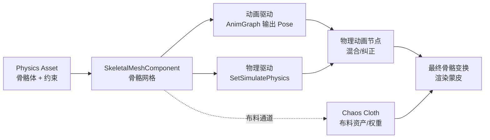
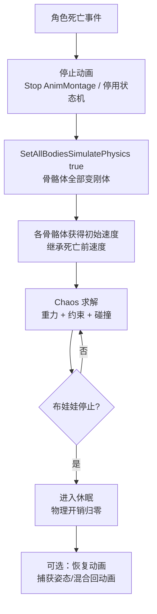
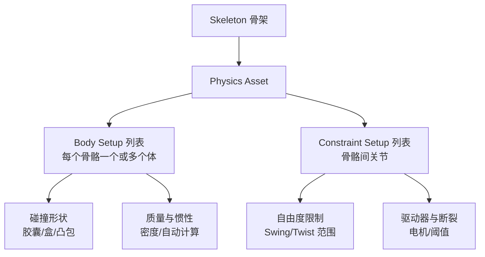
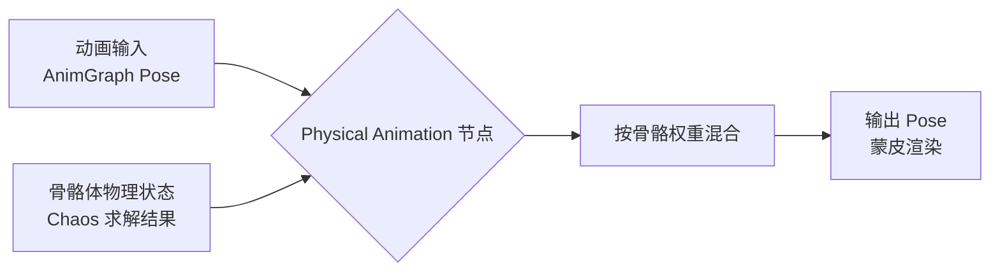
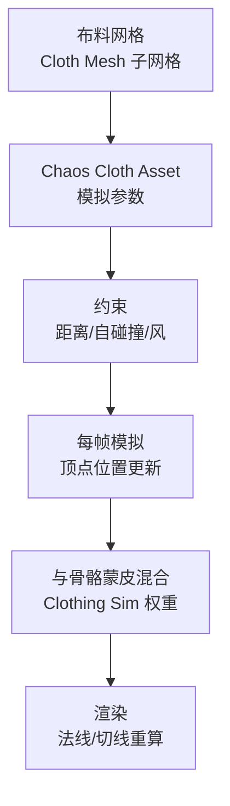

# 04-布娃娃与物理动画

> 适用版本：UE 5.x（Chaos 物理后端；Chaos Cloth 为 UE5 默认布料方案）

## 概述

前面三篇讲的都是"无生命物体"的物理，这一篇把物理搬到**角色身上**：角色死亡后像真人一样倒地挣扎（布娃娃）、衣服披风随动作飘动（布料）、以及物理与动画互相配合（物理动画混合、物理控制）。它们的共同点是把 **SkeletalMeshComponent** 与 **Chaos 物理**连接起来，让骨骼不再只受动画驱动，而是受物理驱动或"动画 + 物理"共同驱动。

四个核心领域：

- **Ragdoll 布娃娃**：死亡时把每个骨骼体切换为物理模拟，身体按真实力学倒地；
- **物理资产（Physics Asset）**：定义"哪些骨骼是物理体、形状质量如何、骨骼间约束如何"，布娃娃的配置源头；
- **布娃娃与动画混合**：物理动画节点（AnimNode_PhysicalAnimation）让物理跟随/纠正动画，死亡后可平滑回到动画；
- **布料与物理控制**：Chaos Cloth 让衣服独立模拟；物理控制组件（UE5.3+）让物理按目标姿态施力。



## 核心概念

| 概念 | 英文 | 说明 | 关键点 |
| --- | --- | --- | --- |
| 布娃娃 | Ragdoll | 死亡后全身物理模拟 | 由物理资产驱动 |
| 物理资产 | Physics Asset | 骨骼体 + 约束的配置资产 | 每个 Skeleton 一份 |
| 骨骼体 | Body Setup | 骨骼上的碰撞体（盒/球/胶囊/凸包） | 质量/惯性/物理材质 |
| 约束设置 | Constraint Setup | 骨骼体之间的关节 | 自由度/驱动/断裂 |
| 物理动画节点 | AnimNode_PhysicalAnimation | AnimGraph 中的物理混合节点 | 物理纠正动画/动画驱动物理 |
| 物理动画组件 | PhysicalAnimationComponent | 蓝图侧启用物理动画 | 按骨骼名配置 |
| 混合权重 | Physics Blend Weight | 物理与动画的混合比例 | 0=纯动画，1=纯物理 |
| 骨骼混合 | Bone Blending | 按骨骼局部混合 | 上半身动画+下半身物理 |
| Chaos Cloth | Chaos Cloth | UE5 布料模拟系统 | 替代旧 NvCloth/APEX |
| 布料资产 | Chaos Cloth Asset | 布料模拟参数资产 | 约束/自碰撞/风 |
| 运动学刚体 | Kinematic Body | 位置由动画/逻辑给定的刚体 | 碰撞但不受力 |
| 物理控制组件 | Physics Control Component | UE5.3+ 按目标姿态控制物理 | 替代部分物理动画需求 |

## 原理详解

### Ragdoll 布娃娃：死亡物理模拟

布娃娃的本质：**把骨骼网格上的每个骨骼体（Body）切换为动力学刚体**，骨骼体之间由物理资产中的约束连接成链，然后交给 Chaos 求解——角色就变成了一个"由关节连接的刚体人偶"，重力、碰撞、外力全部真实作用于它。



激活布娃娃的常用 API（`USkeletalMeshComponent`）：

| API | 作用 |
| --- | --- |
| `SetAllBodiesSimulatePhysics(true)` | 所有骨骼体开启模拟 |
| `SetAllBodiesBelowSimulatePhysics(BoneName, true)` | 某骨骼以下开启（局部布娃娃） |
| `SetSimulatePhysics(true)` | 组件级开关 |
| `WakeAllRigidBodies()` | 唤醒休眠中的骨骼体 |
| `SetPhysicsBlendWeight(0.0~1.0)` | 物理与动画混合权重 |
| `GetPhysicsBlendWeight()` | 读取当前混合权重 |
| `PutAllRigidBodiesToSleep()` | 让布娃娃休眠（结束后） |
| `SetCollisionEnabled` | 控制布娃娃碰撞开关 |

关键细节：

- **初始速度继承**：激活布娃娃前，角色的移动速度会传递给骨骼体（引擎在切换时用 `SetPhysicsLinearVelocity` 之类机制保留动量），否则会出现"原地软倒"的假感；
- **碰撞对象**：布娃娃骨骼体默认用物理资产的碰撞设置（通常对象类型 PhysicsBody），注意与地形/胶囊体的通道配置，避免尸体与角色胶囊体互穿；
- **不要销毁胶囊体**：布娃娃激活时通常把胶囊体碰撞关掉（`SetCollisionEnabled(NoCollision)`），角色控制权移交给骨骼体；布娃娃结束后要恢复。

### 物理资产（Physics Asset）：骨骼体与约束

物理资产（`UPhysicsAsset`）是布娃娃的"配置蓝图"。在 Persona（骨架编辑器）中打开骨骼网格后，可以从 **Asset Details → Create** 生成物理资产，或直接双击物理资产在 **Physics Asset Editor** 中编辑。

物理资产由两类条目组成：

| 条目 | 内容 | 关键设置 |
| --- | --- | --- |
| Body Setup（骨骼体） | 挂在某骨骼上的碰撞体 | 形状（盒/球/胶囊/凸包）、质量、惯性、物理材质、碰撞响应 |
| Constraint Setup（约束） | 父骨骼体之间的关节 | 自由度限制、驱动、断裂阈值、碰撞开关 |



编辑器里的常用操作：

- **自动生成**：Physics Asset Editor → `Tools → Generate Bodies`，按骨骼自动生成胶囊体（可控制覆盖率与轴向）；
- **手动调整**：选中骨骼体拖动绿色 Gizmo 调整大小/位置；每个体可加多个碰撞形状（复合体）；
- **质量调整**：每个 Body 可设密度或直接覆盖质量；整体可用 `Mesh → Set Mass` 缩放；
- **约束编辑**：`Constraints` 面板列出所有父子约束，双击打开窗口配置自由度与驱动；
- **碰撞调试**：编辑器里 Play 时勾选 `Show Collision` 查看骨骼体形状是否贴合骨骼（贴合差会"穿模"或"飘"）。

物理资产的质量设置直接决定布娃娃手感：**质量集中在躯干**（头/四肢轻），布娃娃倒下才自然；四肢质量均等会出现"轻飘飘"感。

### 布娃娃与动画混合：物理动画节点

布娃娃不是非黑即白——UE 提供多档"物理 × 动画"混合手段：

#### 手段一：Physics Blend Weight（简单混合）

`SetPhysicsBlendWeight(w)` 在**全局**把最终姿态从"动画"平滑过渡到"物理"：

- 0.0 = 纯动画（物理骨骼体休眠/不参与）；
- 1.0 = 纯物理（布娃娃）；
- 中间值 = 两者插值（物理纠偏程度）。

典型用途：死亡瞬间从 0 过渡到 1，实现"动画倒地逐渐变成物理倒地"；或者受击时短暂 0.3 让身体"歪一下"再回到 0。

#### 手段二：物理动画节点（AnimNode_PhysicalAnimation，按骨骼局部混合）

动画蓝图 AnimGraph 中的 Physical Animation 节点，可以把物理模拟结果与动画输入按**每根骨骼权重**混合，实现"上半身动画、下半身物理"等局部效果：

| 属性 | 说明 |
| --- | --- |
| SkeletalMeshComponent | 指向骨骼网格（物理来源） |
| Simulated Skeleton | 参与模拟的骨骼集合 |
| Alpha | 全局混合权重 |
| Alpha Scale Per Bone | 每根骨骼的局部权重曲线 |

工作方式：



配合 `UPhysicalAnimationComponent`（蓝图/代码侧）：

- 用 `ApplyPhysicalAnimationSettings(BoneName, Profile)` 为指定骨骼启用物理动画；
- 配置 `FPhysicalAnimationData`：物理动画的刚度/阻尼、是否继承速度等；
- 适合做"头发甩动、腰腹扭动、受击部位抖动"等局部物理表现。

#### 手段三：布娃娃结束后恢复动画

布娃娃结束后要"复活"回动画，标准流程：

1. 布娃娃停稳后，用 GetPhysicsLinearVelocity / 骨骼变换记录当前姿态；
2. 用 SnapTo 相关功能或直接把动画蓝图切换回正常状态机，并把混合权重从 1 平滑降到 0；
3. 关键：先关闭模拟再恢复动画，顺序错误会出现"动画与物理打架"的抽搐。

### 布料模拟简述（Chaos Cloth）

UE5 的布料系统是 **Chaos Cloth**（UE5.0 起默认，替代 UE4 的 NvCloth/APEX Clothing）。它把布料网格（Cloth Mesh）挂在骨骼网格的指定区域上，布料顶点作为"软体粒子"参与模拟，再与骨骼蒙皮混合。



关键概念与配置：

| 概念 | 说明 |
| --- | --- |
| 布料资产（Chaos Cloth Asset） | 布料模拟参数（重力、空气阻力、约束刚度） |
| 布料数据（Cloth Data） | 每个布料网格的顶点/权重数据（导入时生成） |
| 约束类型 | Distance（距离约束）、Self-Collision（自碰撞）、Wind（风） |
| 质量 | 布料质量密度，影响下垂与飘动 |
| 动画权重（Cloth LOD） | 远处布料退化为骨骼动画（省性能） |

编辑器流程：

1. 在 DCC（Maya/Blender）中把布料区域导出为子网格（Submesh）并命名；
2. 导入时勾选导入布料（Import Cloth），引擎自动生成布料数据；
3. 创建 Chaos Cloth Asset 并赋给骨骼网格组件（Clothing Simulation）；
4. 在骨骼网格编辑器里调整布料 LOD（LOD0 全模拟，LOD2+ 动画代替）。

> 提示：Chaos Cloth 的 Chaos Cloth Asset 与旧的 ClothingAsset（NvCloth）不兼容；UE5 新项目直接用 Chaos Cloth 资产。

### 物理控制与运动学

#### 运动学刚体（Kinematic）

不是所有"物理物体"都要参与动力学求解：

| 模式 | 行为 | 用途 |
| --- | --- | --- |
| 动力学（Dynamic） | 受力、碰撞、被推 | 布娃娃、杂物 |
| 运动学（Kinematic） | 位置由外部给定，能推别人但自己不受力 | 动画驱动的机关、车辆、角色身体 |

骨骼网格中"动画驱动但参与碰撞"的骨骼体就是运动学刚体——这也是角色默认状态（骨骼体不模拟，但碰撞体仍在工作）。

#### 常用物理控制 API

```cpp
// 设置/读取速度
MeshComp->SetPhysicsLinearVelocity(Velocity);
FVector V = MeshComp->GetPhysicsLinearVelocity();
MeshComp->SetPhysicsAngularVelocityInRadians(AngVel);

// 施加冲击（局部布娃娃）
MeshComp->AddImpulse(Force, NAME_None, true);
MeshComp->AddImpulseToAllBodiesBelow(Force, BoneName, true);

// 让骨骼体按目标姿态运动（运动学控制）
MeshComp->SetAllBodiesBelowSimulatePhysics(BoneName, false); // 关闭模拟=运动学
```

#### Physics Control 组件（UE5.3+）

UE5.3 引入 `UPhysicsControlComponent` 与 `FAnimNode_RigidBodyWithControl`（5.8 真实名称，`AnimNode_PhysicsControl` 不存在），把"物理动画"能力升级为通用物理控制框架：

- 按骨骼/骨骼组设置目标位置/朝向，物理通过弹簧力追踪目标（类似约束驱动）；
- 支持线性/角向强度曲线（按骨骼距离/权重调节）；
- 可在 AnimGraph 中直接配置（Physics Control 节点），或代码侧用组件控制。

它适合做"程序化防穿墙、受击扭曲、肢体目标跟随"等以前需要大量手写代码的物理玩法，是 UE5.3+ 物理动画的首选新方案。

## 代码/蓝图示例

### C++：激活布娃娃（死亡）

```cpp
// AMyCharacter::Die
void AMyCharacter::Die()
{
    if (!GetMesh() || bIsDead) { return; }
    bIsDead = true;

    // 1. 停止动画播放（停用动画蓝图的状态机输出）
    if (UAnimInstance* Anim = GetMesh()->GetAnimInstance())
    {
        Anim->Montage_Stop(0.2f);
        // 通知动画蓝图进入"死亡"状态（蓝图侧把输出切换到布娃娃混合）
        Anim->SetRootMotionMode(ERootMotionMode::NoRootMotion);
    }

    // 2. 关闭角色胶囊体碰撞，避免与尸体互相推挤
    GetCapsuleComponent()->SetCollisionEnabled(ECollisionEnabled::NoCollision);
    GetCapsuleComponent()->SetSimulatePhysics(false);

    // 3. 激活布娃娃：所有骨骼体开启物理模拟
    GetMesh()->SetSimulatePhysics(true);          // 组件级
    GetMesh()->SetAllBodiesSimulatePhysics(true); // 骨骼体级（确保全部）
    GetMesh()->WakeAllRigidBodies();

    // 4. 可选：给尸体一个初始冲击（继承死亡前的速度）
    FVector DeathVelocity = GetVelocity();
    GetMesh()->AddImpulse(DeathVelocity * 0.5f, NAME_None, /*bVelocityChange=*/true);

    // 5. 布娃娃稳定后（比如 8 秒后）休眠，省性能
    GetWorld()->GetTimerManager().SetTimer(SleepTimerHandle, this,
        &AMyCharacter::SleepRagdoll, 8.0f, false);
}

void AMyCharacter::SleepRagdoll()
{
    if (GetMesh())
    {
        GetMesh()->PutAllRigidBodiesToSleep();
    }
}
```

### C++：布娃娃与动画混合（物理动画节点）

```cpp
// 受击：让右臂短暂"物理歪一下"
void AMyCharacter::HitReaction()
{
    // 方式 A：全局混合权重（简单）
    GetMesh()->SetPhysicsBlendWeight(0.25f);
    GetWorld()->GetTimerManager().SetTimer(BlendResetHandle, [this]()
    {
        GetMesh()->SetPhysicsBlendWeight(0.0f);
    }, 0.3f, false);

    // 方式 B：物理动画组件（按骨骼启用）
    if (UPhysicalAnimationComponent* PhysAnim = GetMesh()->GetPhysicalAnimationComponent())
    {
        FPhysicalAnimationData Profile;
        Profile.BodyName = TEXT("arm_r");
        Profile.bIsLocalSimulation = true;
        Profile.OrientationStrength = 300.f;
        Profile.AngularVelocityStrength = 50.f;
        Profile.PositionStrength = 200.f;
        Profile.VelocityStrength = 30.f;
        PhysAnim->ApplyPhysicalAnimationSettings(TEXT("arm_r"), Profile);
    }
}
```

### 蓝图对照

1. **死亡布娃娃**：事件图表调用 `Set Simulate Physics`（SkeletalMeshComponent）→ `Set All Bodies Simulate Physics` → `Wake All Rigid Bodies`；别忘了先关胶囊体碰撞；
2. **混合权重**：`Set Physics Blend Weight` 节点（组件级）；动画蓝图里用 `Get Physics Blend Weight` 驱动状态机转换条件；
3. **物理动画节点**：AnimGraph 中搜索 `Physical Animation` 节点，连接动画输入，配 Simulated Skeleton 与骨骼权重；
4. **布料**：骨骼网格组件细节面板 `Clothing Simulation` 里指定 Chaos Cloth Asset；
5. **物理控制（UE5.3+）**：AnimGraph 添加 `Physics Control` 节点或添加 `Physics Control Component`，按骨骼设置目标姿态。

### 布娃娃结束恢复动画（完整流程）

```cpp
void AMyCharacter::ReviveFromRagdoll()
{
    // 1. 记录当前姿态（可选：作为动画过渡起点）
    FTransform RagdollPose = GetMesh()->GetSocketTransform(TEXT("pelvis"));

    // 2. 先关模拟（顺序关键！）
    GetMesh()->SetAllBodiesSimulatePhysics(false);
    GetMesh()->SetSimulatePhysics(false);
    GetMesh()->PutAllRigidBodiesToSleep();

    // 3. 恢复胶囊体
    GetCapsuleComponent()->SetCollisionEnabled(ECollisionEnabled::QueryAndPhysics);

    // 4. 恢复动画（动画蓝图从"死亡"状态切回"正常"状态机）
    if (UAnimInstance* Anim = GetMesh()->GetAnimInstance())
    {
        Anim->Montage_Play(GetReviveMontage());
    }

    // 5. 混合权重归零：完全由动画接管
    GetMesh()->SetPhysicsBlendWeight(0.0f);
}
```

## 最佳实践

- **物理资产先于代码**：布娃娃手感 80% 由物理资产决定（骨骼体形状贴合、质量分布、约束范围），先把资产调好再写代码；
- **质量集中在躯干**：头、四肢质量调低，躯干调高，倒地才自然；质量均等会出现"面条人"；
- **约束范围贴合关节**：肩关节 Swing 范围大、肘关节 Twist 范围小；范围过大肢体乱甩，过小僵硬；
- **布娃娃结束必须恢复**：不恢复模拟的"尸体"会持续参与碰撞且占用求解，复活流程要完整（先关模拟再开动画）；
- **同屏布娃娃限量**：每个布娃娃都是几十个约束，同屏超过 5~10 具就要用"简化布娃娃"（只模拟躯干）或快速休眠；
- **布料用 LOD**：LOD0 全模拟、LOD1 减面、LOD2 动画代替，远处角色布料不模拟，视觉几乎无损；
- **局部物理优于全局**：能只模拟某几根骨骼（PhysicalAnimation 按骨骼启用）就不要全身布娃娃；
- **通道配置要刻意**：尸体（PhysicsBody）与玩家胶囊体、NPC 碰撞的通道关系提前定好，避免尸体被推来推去或穿地。

## 常见问题 FAQ

**Q1：激活布娃娃后角色抽搐/乱飞？**
A：多半是激活前动画还在驱动骨骼（没停状态机），或骨骼体与碰撞体穿模（物理资产形状没贴合）。正确顺序：先停动画 → 关胶囊体碰撞 → 再开模拟；同时检查物理资产中骨骼体是否与相邻骨骼体重叠。

**Q2：布娃娃软绵绵/僵硬？**
A：软=约束驱动弱或阻尼低、质量轻；僵硬=约束范围太小、刚度高。逐个调：先加大约束的 Swing/Twist 范围（贴关节真实活动范围），再调质量分布（躯干重四肢轻）。

**Q3：死亡后角色穿进地面？**
A：① 骨骼体碰撞未开启（物理资产中 Body 的 Collision Enabled）；② 尸体与地面通道响应为 Ignore；③ 初始速度太大导致穿透（给骨骼体开 CCD 或限制初始冲量）；④ 物理步长内位移过大。

**Q4：物理动画节点没效果？**
A：确认 Simulated Skeleton 包含目标骨骼、该骨骼在物理资产中有骨骼体、Alpha 不为 0、且骨骼体没有被 SetAllBodiesSimulatePhysics(true) 完全接管（局部物理需要骨骼体保持"运动学+模拟"状态，物理动画节点自己管理模拟）。

**Q5：布料穿模/乱飘？**
A：① 布料资产的自碰撞没开或阈值太大；② 布料质量太小（风一吹就飞）；③ 布料区域与骨骼蒙皮权重冲突（Painting 权重检查）；④ 与骨骼体碰撞未配置（布料可以和骨骼体碰撞，需在布料资产中开启）。

**Q6：布娃娃复活后角色姿势怪？**
A：复活时姿态不连续。改进：复活时把动画蓝图切到"从布娃娃姿态过渡"的状态机（用 Capture Pose 或记录骨盆位置），或者干脆在布娃娃停稳后才允许复活，避免中途强切。

**Q7：布娃娃太多导致卡顿？**
A：预算管理：① 只对玩家附近的尸体激活完整布娃娃，远处的用"假尸体"（静态网格替换）；② 布娃娃 3~5 秒后 PutAllRigidBodiesToSleep；③ 简化物理资产（去掉手指等小骨骼的骨骼体）；④ 限制同屏布娃娃数量（队列淘汰最早者）。

## 关联阅读

- [01-Chaos物理引擎概览](01-Chaos物理引擎概览.md)：刚体与约束在 Chaos 中的求解基础；
- [02-碰撞检测与物理材质](02-碰撞检测与物理材质.md)：骨骼体碰撞通道与物理材质配置；
- [03-物理约束与关节](03-物理约束与关节.md)：Physics Asset 中约束的本质就是关节配置；
- 04-动画系统：AnimGraph、状态机与物理动画节点的配合；
- 06-网络同步：布娃娃的服务器权威与客户端表现（尸体通常只做表现层）。
