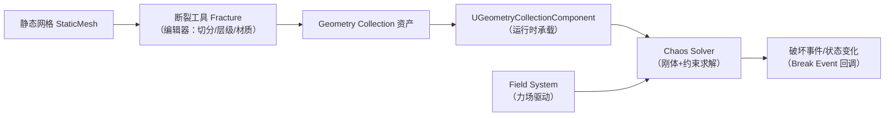
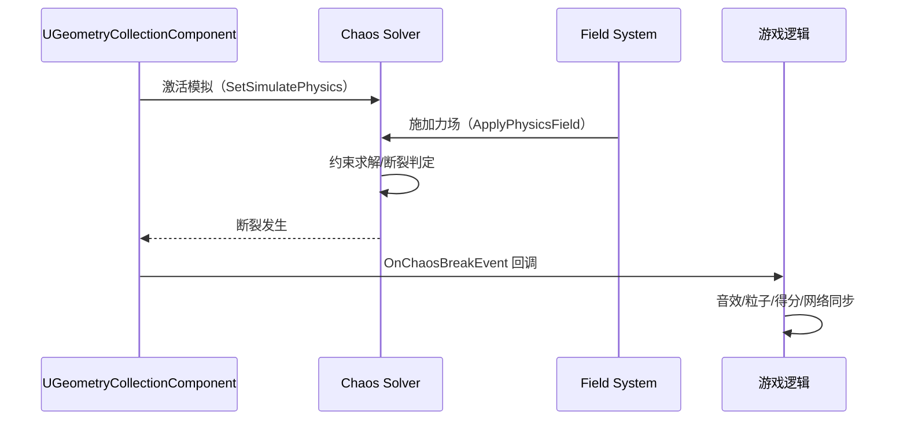
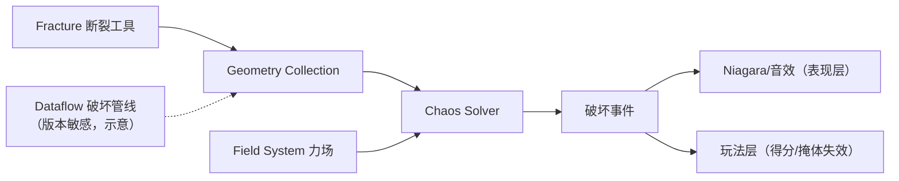

# 05 Chaos 破坏系统与 Field System

> 版本基准：UE 5.8.0（本机 `Engine/Build/Build.version`：CL 55116800，分支 `++UE5+Release-5.8`）。
> 适用范围：UE 客户端 · 物理破坏（Geometry Collection / Field System / 断裂与碎片模拟）。
> 事实边界：本文"本机核对"项来自只读检索本机 `C:\Program Files\Epic Games\UE_5.8\Engine`（`Source\Runtime\Experimental\GeometryCollectionEngine`、`ChaosSolverEngine`、`Chaos` 与 `Plugins\Experimental\*` 的 uplugin）；字段/枚举/节点细节以目标版本为准，无法核对处标注"待核对"。
> 官方参考：[Chaos Destruction 文档](https://dev.epicgames.com/documentation/en-us/unreal-engine/chaos-destruction-in-unreal-engine)、[Field System 文档](https://dev.epicgames.com/documentation/en-us/unreal-engine/field-system-in-unreal-engine)、[Unreal Engine 文档首页](https://dev.epicgames.com/documentation/en-us/unreal-engine)。
> 最后更新：2026-08-07（初稿）。

## 概述

**破坏系统（Destruction）** 是 Chaos 物理引擎的标志性能力：把一堵墙、一栋楼拆成**碎块（Chunks/Clusters）**，受力后按物理规律断裂、飞散、继续碰撞。UE 中它由三块拼成：

- **Geometry Collection（几何集合）**：破坏资产的网格表示，由"静态网格 → 断裂工具（Fracture）→ 层级碎块"加工而来；
- **Chaos Solver（物理求解器）**：负责碎块的刚体动力学与约束断裂求解；
- **Field System（力场系统）**：按空间施加"力/速度/损坏"等物理影响的机制，是"炸弹把墙炸开"这类效果的标准驱动手段。

本机 5.8 关键源码/插件状态（已核对）：

- 运行时模块：`Engine\Source\Runtime\Experimental\GeometryCollectionEngine`（`Private\GeometryCollection\GeometryCollectionComponent.cpp`、`GeometryCollectionActor.cpp`、`GeometryCollectionActor_ImmediateImpl.cpp`、`GeometryCollectionComponent.ispc`；`Public\GeometryCollection\GeometryCollectionComponent.h`、`GeometryCollectionActor.h`）；
- 求解器模块：`Engine\Source\Runtime\Experimental\ChaosSolverEngine`（`Public\Chaos\ChaosSolver.h`、`ChaosSolverActor.h`、`ChaosSolverComponentTypes.h`；`Private\Chaos\ChaosSolverActor.cpp`）；
- 力场：`Engine\Source\Runtime\Experimental\Chaos\Private\Field\FieldSystem.cpp`（`Public\Field\FieldSystem.h`）与 `Chaos\Private\PhysicsProxy\PerSolverFieldSystem.cpp`；组件在 `Engine\Source\Runtime\Experimental\FieldSystem\Source\FieldSystemEngine\Public\Field\FieldSystemComponent.h`；
- 编辑器/插件（Experimental）：`ChaosSolverPlugin`（Beta，默认启用）、`FieldSystemPlugin`（Beta，默认关闭，仅 `FieldSystemEditor` 模块）、`GeometryCollectionPlugin`（Beta，默认关闭，含 `GeometryCollectionEditor/Tracks/Sequencer/Nodes/DepNodes`）、`Fracture`、`ChaosDataflowSolver`、`ChaosEditor`、`ChaosFlesh` 等。

阅读本文前建议先读 01（Chaos 概览）与 03（约束与断裂连接）；本文补上"破坏资产管线 + Field 驱动 + 事件接入"的完整闭环。

## 核心概念表

| 概念 | 英文 | 说明（本机 5.8 依据） |
| --- | --- | --- |
| 几何集合 | Geometry Collection | 破坏资产（`UGeometryCollection`），由层级碎块组成，运行时由 `UGeometryCollectionComponent` 承载 |
| 碎块/簇 | Chunk / Cluster | 破坏资产的层级节点：大块由小块聚合，断裂沿层级进行 |
| 断裂工具 | Fracture Mode | 编辑器把静态网格切分为碎块的工具（`Plugins\Experimental\Fracture` 等编辑器能力） |
| 物理求解器 | Chaos Solver | 碎块刚体动力学与约束求解（`ChaosSolverEngine` 的 `UChaosSolver`/`AChaosSolverActor`） |
| 力场 | Field System | 按空间场施加物理影响的机制（`FieldSystemEngine` 的 `UFieldSystemComponent`、`ApplyPhysicsField`） |
| 破坏事件 | Break Event | 碎块断裂时的事件（`FOnChaosBreakEvent`、`OnChaosBreakEvent`、`OnRootBreakEvent`、`DispatchBreakEvent`） |
| 状态变化 | Physics State Change | 组件物理状态变化通知（`NotifyGeometryCollectionPhysicsStateChange`） |
| 事件过滤器 | Event Filter | 对破坏/碰撞/尾迹事件做统计与过滤（`ChaosBreakingEventFilter.cpp` 等） |

## 原理详解

### 4.1 破坏系统的整体链路



链路分两段：**编辑段**把静态网格加工成可破坏资产；**运行段**由组件 + 求解器 + 力场驱动断裂与飞散，并通过事件把"破坏"反馈给玩法（得分、音效、粒子）。

### 4.2 资产层：Geometry Collection 与层级碎块

Geometry Collection 是破坏的"资产契约"：编辑器用 Fracture 工具把静态网格切成若干**碎块**，碎块按**层级（Hierarchy）**组织成簇（Cluster）——大簇由小簇组成。层级的意义：

- **模拟粒度可控**：初始模拟粒度大（簇），受力后逐级碎裂为更小块，避免"一上来全是碎块"的性能灾难；
- **断裂成本分摊**：只有被破坏到的簇才分裂，未受影响的区域保持整体；
- **资产可复用**：一套碎块层级可配合不同 Field 与参数反复使用。

运行时承载类是 `UGeometryCollectionComponent`（本机 `GeometryCollectionComponent.h`）：继承自网格组件体系，提供 `SetSimulatePhysics(bool)`（`GeometryCollectionComponent.h` 约 657 行）、`ApplyPhysicsField(...)`（约 1141 行）、`OnChaosBreakEvent`/`OnRootBreakEvent`（约 1269/1278 行）、`DispatchBreakEvent`（约 1286 行）等接口。`AGeometryCollectionActor` 是标准的"组件 + 求解器"容器 Actor。

### 4.3 求解层：Chaos Solver

碎块的动力学由 Chaos Solver 承担（`ChaosSolverEngine`）：`UChaosSolver` 持有物理求解配置，`AChaosSolverActor` 是场景中的求解器 Actor（`ChaosSolverActor.h/.cpp`），`ChaosSolverComponentTypes.h` 提供组件与求解器的类型桥接。要点：

- 破坏与刚体、布料收敛在同一套 Chaos 核心之上（01 篇），因此"碎块砸到布料、布料挂在碎块上"是原生交互；
- 求解器按**物理场景（FPhysScene）**组织，与 `UWorld` 生命周期绑定；多个破坏区域可共享一个求解器 Actor 或各自独立；
- 断裂在求解器中体现为**约束的破坏（Constraint Breaking）**：簇内碎块由约束连接，超过断裂阈值即解除约束、碎块成为独立刚体（与 03 篇的断裂连接呼应）。



### 4.4 驱动层：Field System

Field System 是"按空间施加物理影响"的通用机制：在场景中放置**场节点（Field Node）**，定义"哪些区域、施加什么影响（力/速度/损坏）"，运行时由场系统求值后作用于物理代理（碎块刚体等）。本机 5.8 证据：

- 场求值核心在 `Chaos\Private\Field\FieldSystem.cpp`（`Public\Field\FieldSystem.h`），物理代理侧接入在 `Chaos\Private\PhysicsProxy\PerSolverFieldSystem.cpp`；
- 组件侧 `UFieldSystemComponent` 提供 `ApplyPhysicsField`/`AddPhysicsField` 类接口（`FieldSystem\Source\FieldSystemEngine\Public\Field\FieldSystemComponent.h`），是蓝图/C++ 施加场的入口；
- 编辑器支持（`FieldSystemPlugin`，Beta，默认关闭）提供可视化编辑；开启后工程可编辑场节点资产。

场节点的典型组合（示意，节点名以目标版本编辑器为准）：径向力（Radial）、噪声（Noise）、衰减（Falloff）与"损坏"（Damage）类节点叠加，得到"爆炸中心强、边缘弱、形态不规则"的冲击场。

### 4.5 事件层：破坏事件的玩法接入

破坏系统把"物理发生了什么"通过事件暴露给玩法：

- `FOnChaosBreakEvent`（`GeometryCollectionComponent.h` 约 53 行）：碎块断裂事件，携带 `FChaosBreakEvent`（碎块位置/速度等）；
- `OnChaosBreakEvent` / `OnRootBreakEvent`（约 1269/1278 行）：分别对应任意碎块断裂与"根级"断裂；
- `NotifyGeometryCollectionPhysicsStateChange`（约 1150 行）：组件物理状态变化（如开始模拟）通知；
- 事件过滤：`ChaosBreakingEventFilter.cpp`、`ChaosCollisionEventFilter.cpp`、`ChaosTrailingEventFilter.cpp`、`ChaosRemovalEventFilter.cpp`（`GeometryCollectionEngine\Private`）提供对事件流的统计/过滤（例如只关心大块断裂、批量合成碰撞事件），避免高频事件压垮玩法层。

## 代码 / 示例

### 5.1 施加爆炸力场（C++ 示意）

> 节选/示意：`UFieldSystemComponent`、`UGeometryCollectionComponent` 为真实类名（本机头文件已核对）；字段类型与函数签名以目标版本为准。

```cpp
// 示意：用 Field System 对几何集合施加一次径向冲击
#include "Field/FieldSystemComponent.h"
#include "GeometryCollection/GeometryCollectionComponent.h"

void UMyDestructionManager::ApplyExplosion(UGeometryCollectionComponent* GC, FVector Center, float Radius, float Magnitude)
{
    if (GC == nullptr || GC->GetFieldSystemComponent() == nullptr)
    {
        return;
    }

    // 示意：通过组件的 FieldSystem 施加物理场（构造场节点并调用 ApplyPhysicsField）
    UFieldSystemComponent* Field = GC->GetFieldSystemComponent();
    // Field->ApplyPhysicsField(/*Enable=*/true, /*FieldType=*/EFieldPhysicsType::Field_RadialVector, /*MetaData=*/..., /*FieldNode=*/...);
    // 实际场节点（径向力/噪声/衰减）的构建与参数以目标版本编辑器与 API 为准
}
```

### 5.2 监听破坏事件（蓝图/C++ 示意）

```cpp
// 示意：订阅破坏事件（真实委托名见 GeometryCollectionComponent.h）
void UMyDestructionManager::BindBreakEvents(UGeometryCollectionComponent* GC)
{
    if (GC == nullptr)
    {
        return;
    }
    // GC->OnChaosBreakEvent.AddDynamic(this, &UMyDestructionManager::HandleBreak);
}

// void UMyDestructionManager::HandleBreak(const FChaosBreakEvent& BreakEvent) { /* 音效/粒子/得分 */ }
```

蓝图侧同样可以绑定 `On Chaos Break Event`（事件图入口名以目标版本为准），事件回调里播放碎裂音效、生成 Niagara 碎片粒子并同步网络状态（服务器权威判定破坏结果，客户端播放表现，见 06-网络同步）。

### 5.3 开启编辑器插件（示意）

```json
{
    "Plugins": [
        { "Name": "FieldSystemPlugin", "Enabled": true },
        { "Name": "GeometryCollectionPlugin", "Enabled": true },
        { "Name": "ChaosSolverPlugin", "Enabled": true }
    ]
}
```

（示意；按工程需要开启。注意 `FieldSystemPlugin`/`GeometryCollectionPlugin` 默认关闭且标 Beta，开启后需回归验证。）

### 5.4 破坏资产的物理参数（示意）

碎块行为由资产级与求解器级参数共同决定（参数名以目标版本编辑器为准，此处为工作流示意）：

| 参数族 | 作用 | 工程建议 |
| --- | --- | --- |
| 碎块质量/密度 | 决定飞散轨迹与碰撞响应 | 按材质语义赋值，避免"轻如纸片"或"重如铅块" |
| 断裂阈值 | 约束断裂所需作用力 | 阈值过低会"一碰就碎"，过高则"炸不碎" |
| 阻尼/空气阻力 | 影响碎块滑行与飘散 | 室内小场景可加大阻尼收敛残骸 |
| 休眠策略 | 落定后进入休眠省算力 | 配合清理策略防止碎块堆积 |
| 求解器迭代 | 接触/约束求解精度 | 默认值起步，仅在穿模/抖动时上调 |

### 5.5 蓝图接入流程（示意）

1. 场景放置 `AGeometryCollectionActor`（或给 Actor 添加 `UGeometryCollectionComponent`）；
2. 资产指定 Geometry Collection，初始不激活模拟（由玩法触发）；
3. 用 Field（径向力/噪声/衰减）实现爆炸/冲击；
4. 绑定 `OnChaosBreakEvent`/`OnRootBreakEvent`（或蓝图事件入口）处理音效/粒子/得分；
5. 服务器记录"已破坏"状态并复制，客户端播放表现；
6. 落定休眠后按策略清理残骸。

## 与 Chaos 生态的协作

破坏不是孤立系统，它挂在 Chaos 生态里（本机 `Plugins\Experimental` 已核对目录）：

| 生态件 | 定位 | 与破坏的关系 |
| --- | --- | --- |
| `ChaosSolverPlugin` | 求解器编辑器支持（Beta，默认启用） | 破坏求解的编辑器配置入口 |
| `FieldSystemPlugin` | 场节点编辑器（Beta，默认关闭） | Field 可视化编辑 |
| `GeometryCollectionPlugin` | 几何集合资产编辑器（Beta，默认关闭） | 破坏资产创建/编辑 |
| `Fracture` | 断裂工具 | 静态网格 → 碎块层级的加工工具 |
| `ChaosDataflowSolver` / `GeometryDataflow` | 数据流（Dataflow）驱动求解/几何 | 新一代"数据流化"破坏管线（版本敏感） |
| `ChaosFlesh` | 软体/肌肉模拟 | 与破坏互补的软体破坏场景 |
| `ChaosNiagara` / `ChaosClothEditor` | 粒子与布料集成 | 碎块粒子表现与布料挂接 |



## 最佳实践

1. **碎块预算先行**：破坏资产的总碎块数与模拟粒度直接决定 CPU 成本。先定"同时活跃碎块上限"，再用簇层级控制"初始大块、逐级碎裂"，避免一次性全碎。
2. **层级即性能策略**：初始模拟用大簇（少刚体），断裂按需细化；重要建筑给 2~3 级层级，小装饰 1 级即可。
3. **事件节流**：破坏/碰撞事件高频触发，务必用事件过滤器或节流策略（只报大块、按帧合并），否则玩法层会被事件洪流淹没。
4. **服务器权威 + 客户端表现**：破坏结果（哪些碎块断裂、最终状态）以服务器为准，客户端只做表现；必要时用 `Replicated` 状态同步关键碎块的"已破坏"标记（见 06-网络同步）。
5. **Field 范围收敛**：力场半径/衰减要匹配场景尺寸，避免"炸一堵墙震碎整条街"；用噪声节点让破坏形态自然，但注意噪声随机性影响网络同步（服务器固定种子）。
6. **与 Niagara 联动**：碎块飞散 + 粒子补足表现（烟尘、火花）；粒子走 11 章方案，碎块物理走本文方案，两者通过破坏事件衔接。
7. **休眠与清理**：碎块落定后进入休眠（Sleeping），长时间静止的碎块按策略清理（Removal 事件/定时销毁），防止碎块无限堆积。
8. **版本敏感项单独记录**：Fracture 工具、数据流（Dataflow）破坏管线（`ChaosDataflowSolver`、`GeometryDataflow`）与字段节点都在演进，升级后回归"同一爆炸输入 → 一致的断裂表现"。

## 常见问题 FAQ

### Q1：Geometry Collection 和 Static Mesh 有什么区别？

Static Mesh 是"一个整体"；Geometry Collection 是"按层级组织的碎块集合"，每个碎块是独立物理体，可断裂、可飞行、可继续碰撞。破坏场景必须用 Geometry Collection。

### Q2：为什么我的墙一碰就全碎了？

大概率是模拟粒度过细或断裂阈值过低：检查资产层级（是否一开始就是最小碎块）、约束断裂阈值与激活方式（`SetSimulatePhysics` 时机）。破坏应该是"受足够大的力才裂开"。

### Q3：破坏太卡怎么办？

按顺序排查：碎块总数与活跃刚体数（用簇层级减少初始粒度）、求解器数量（多个求解器 Actor 会放大成本）、事件频率（用过滤器节流）、粒子/音效数量（破坏事件驱动的表现也要预算）。

### Q4：Field System 必须开插件吗？

运行时 `UFieldSystemComponent` 在引擎运行时模块中（`FieldSystemEngine`）；`FieldSystemPlugin` 是编辑器增强（场节点可视化编辑），不开也能用代码/蓝图调用 `ApplyPhysicsField`。按需开启并回归验证。

### Q5：破坏事件在服务器和客户端都要处理吗？

物理与破坏以服务器为权威（碰撞/断裂判定在服务器求解），客户端表现（音效、粒子、残骸外观）可在本地做。关键状态（哪些块已断）必须复制，否则两端表现分裂。

### Q6：怎么让碎块"飞"得自然？

用 Field 组合（径向力 + 噪声 + 衰减）而不是单点爆炸；给碎块合理质量与阻尼；配合"根级断裂"控制整体坍塌感。物理参数（质量、摩擦力）在物理资产/求解器配置中调。

### Q7：破坏后碎块永远留在场景里吗？

默认会留在场景并休眠；生产项目要加清理策略：休眠后延迟移除（Removal 事件/定时器）、只保留"代表性残骸"。注意移除时要同步服务器状态。

### Q8：布料/角色能挂在碎块上吗？

可以，因为破坏与布料收敛在同一 Chaos 核心（01 篇）；但成本很高，建议只在关键镜头使用，并用小范围场景验证。

### Q9：破坏能用于关卡"可破坏掩体"玩法吗？

可以，这是典型用法：掩体用 Geometry Collection，命中/爆炸用 Field 驱动，破坏事件触发玩法反馈（掩体失效、得分、重生）。注意网络同步与性能预算（同一时间活跃碎块上限）。

### Q10：官方资料在哪？

官方 Chaos Destruction 与 Field System 文档（见文首链接）是工作流权威；本机 5.8 源码 `Source\Runtime\Experimental\GeometryCollectionEngine`、`ChaosSolverEngine`、`Chaos\Private\Field` 是接口权威。

### Q11：数据流（Dataflow）破坏管线和传统 Fracture 有什么区别？

Dataflow 破坏管线（`ChaosDataflowSolver`/`GeometryDataflow`，实验性）把"切分、层级、材质"等步骤数据流化，比传统 Fracture 对话框更可编程、可复用；但它仍是版本敏感的演进特性，生产项目建议先验证目标版本的稳定度再迁移。

### Q12：软体（ChaosFlesh）和破坏能一起用吗？

可以同属 Chaos 生态协同（肌肉/软体挂接碎块），但成本高、工具链仍在演进；只在关键镜头/玩法核心使用，并严格控制模拟区域与分辨率。

## 常见排查速查

| 现象 | 优先排查 | 参考章节 |
| --- | --- | --- |
| 一碰就碎 | 断裂阈值过低、模拟粒度过细 | 4.2 / 5.4 |
| 炸不碎 | 阈值过高、Field 未生效、未激活模拟 | 4.4 / 5.1 |
| 碎块穿模 | 求解器迭代不足、碰撞体精度 | 4.3 / 02 篇 |
| 事件不触发 | 未绑定正确委托/过滤器过滤掉了 | 4.5 / 5.2 |
| 性能峰值爆表 | 碎块预算、事件洪流、求解器过多 | 性能预算与观测 |
| 两端表现不一致 | 破坏状态未复制、随机场未固定种子 | 最佳实践 4/6 |

排查原则：先确认"资产是否正确（层级/阈值）"，再确认"是否被激活/驱动（Field）"，最后确认"事件与表现链路是否接通"。

## 性能预算与观测

破坏是典型的"峰值成本"系统：平时零开销，爆炸瞬间把 CPU/内存打到峰值。按档位建立预算（示意，数值以项目实测为准）：

| 预算项 | 低端机 | 中端机 | 高端机 | 观测手段 |
| --- | --- | --- | --- | --- |
| 同时活跃碎块 | ≤ 64 | ≤ 256 | ≤ 1024 | 求解器统计/调试视图 |
| 单次爆炸新增刚体 | ≤ 16 | ≤ 64 | ≤ 256 | 事件计数（过滤器统计） |
| 求解器数量 | 1 | 1~2 | 2~4 | 场景求解器盘点 |
| 破坏事件/秒 | 节流 | 节流 | 可全量 | 事件过滤器 |
| 残骸保留时间 | 短（秒级） | 短~中 | 中 | 清理策略计时 |

观测工具：Chaos 求解统计（`stat chaos` 类命令，以目标版本为准）、事件过滤器输出、Insights/Profiler 的物理线程耗时；性能回归以"同场景同爆炸输入"为准。

## 关联阅读

- [01-Chaos物理引擎概览.md](./01-Chaos物理引擎概览.md)：破坏系统所在的 Chaos 架构、物理场景与线程模型。
- [02-碰撞检测与物理材质.md](./02-碰撞检测与物理材质.md)：碎块碰撞通道、Hit/Overlap 事件与物理材质（摩擦/弹性影响碎块滑落）。
- [03-物理约束与关节.md](./03-物理约束与关节.md)：约束与断裂连接——碎块间连接的本质。
- [04-布娃娃与物理动画.md](./04-布娃娃与物理动画.md)：物理驱动的另一面（角色/布料），与破坏共用 Chaos 核心。
- [15-物理系统源码](../12-引擎源码分析/15-物理系统源码.md)：FPhysScene/Chaos 求解器与物理线程的源码级剖析。
- [01-Niagara粒子系统基础](../11-VFX与Niagara/01-Niagara粒子系统基础.md)：破坏表现层的粒子方案（烟尘/火花/碎片拖尾）。

## 更新日志

- 2026-08-07：初稿创建。已核对本机 UE5.8 的 `GeometryCollectionEngine`/`ChaosSolverEngine`/`Chaos\Private\Field` 源码路径与 `GeometryCollectionComponent.h` 事件/接口符号、三个破坏相关插件的 uplugin 状态；Fracture 工具细节、Field 节点资产形态与破坏数据流标注"示意/待核对"。
