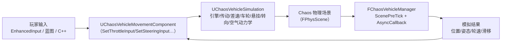
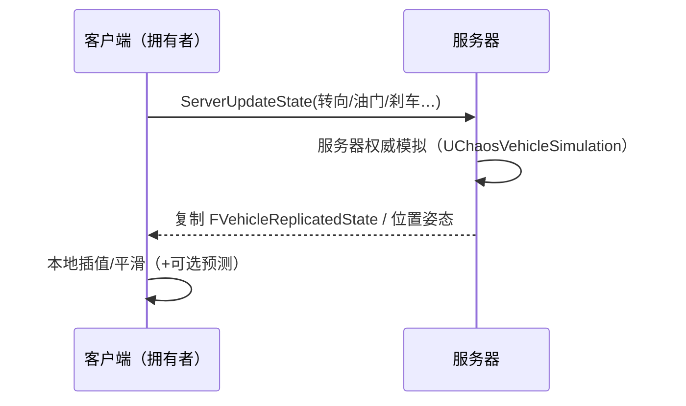

# 06 Chaos 车辆系统

> 版本基准：UE 5.8.0（本机 `Engine/Build/Build.version`：CL 55116800，分支 `++UE5+Release-5.8`）。
> 适用范围：UE 客户端 · 载具玩法（ChaosVehicles 插件 / WheeledVehiclePawn / 车辆调校 / 载具网络同步）。
> 事实边界：本文"本机核对"项来自只读检索本机 `C:\Program Files\Epic Games\UE_5.8\Engine\Plugins\Experimental\ChaosVehiclesPlugin`（`Source\ChaosVehicles\Public\*.h`、`ChaosVehicleManager.h`、`ChaosVehicleManagerAsyncCallback.h`）与 `Plugins\Experimental\ChaosModularVehicle` 的 uplugin；字段/枚举/参数以目标版本为准，无法核对处标注"待核对"。
> 官方参考：[Chaos Vehicles 官方文档](https://dev.epicgames.com/documentation/en-us/unreal-engine/chaos-vehicles-in-unreal-engine)、[Unreal Engine 文档首页](https://dev.epicgames.com/documentation/en-us/unreal-engine)。
> 最后更新：2026-08-07（初稿）。

## 概述

**Chaos 车辆系统（Chaos Vehicles）** 是 UE 基于 Chaos 物理引擎的载具方案，由实验性插件 **ChaosVehiclesPlugin** 提供，取代旧版 PhysX 车辆系统。核心是"一辆车 = 一个 Pawn + 一个车辆移动组件 + 一套由车轮/引擎/传动/悬挂等资产与参数构成的多体动力学模拟"。

本文覆盖（关键符号全部经本机 5.8 源码核对）：

- 插件与类骨架：`AWheeledVehiclePawn`、`UChaosVehicleMovementComponent` / `UChaosWheeledVehicleMovementComponent`、`UChaosVehicleSimulation`；
- 动力总成：引擎（扭矩曲线/怠速/转动惯量）、传动（自动/手动、齿比、换挡阈值）、差速器（前后分配）；
- 底盘：车轮资产 `UChaosVehicleWheel`（半径/质量/抓地/ABS/牵引力控制）、悬挂（行程/刚度/阻尼/防倾杆）、转向；
- 输入与网络：`FVehicleInputs`、`ServerUpdateState` 复制链路；
- 异步物理、性能与调试：`FChaosVehicleManager`、`p.Vehicle.*` CVar 调试可视化。

本机 5.8 关键状态（已核对）：

- 插件路径：`Engine\Plugins\Experimental\ChaosVehiclesPlugin`（Experimental 分类），模块 `ChaosVehicles`（Runtime）与 `ChaosVehiclesEditor`（Editor）；
- 新方向（同属 Experimental）：`ChaosModularVehicle`（模块化车辆，uplugin Version 0.1）与 `ChaosMover`，本文末节简述，不作为当前基准。

阅读本文前建议先读 01（Chaos 概览）与 03（约束与关节）；本文补上"载具资产装配 → 调校 → 网络 → 调试"的完整闭环。

## 核心概念表

| 概念 | 英文 | 说明（本机 5.8 依据） |
| --- | --- | --- |
| 载具 Pawn | WheeledVehiclePawn | `AWheeledVehiclePawn : APawn`，默认挂 `USkeletalMeshComponent Mesh` 与 `UChaosVehicleMovementComponent VehicleMovementComponent` |
| 车辆移动组件 | Vehicle Movement Component | `UChaosVehicleMovementComponent : UPawnMovementComponent`（基类）；轮式实现 `UChaosWheeledVehicleMovementComponent` |
| 车辆模拟 | Vehicle Simulation | `UChaosVehicleSimulation` / `UChaosWheeledVehicleSimulation`，纯物理侧模拟类（如 `ApplyAerodynamics`） |
| 车轮资产 | Wheel | `UChaosVehicleWheel : UObject`，半径/质量/抓地/悬挂/刹车等参数；`FChaosWheelSetup` 负责装配 |
| 引擎 | Engine | `FVehicleEngineConfig`：MaxTorque、MaxRPM、EngineIdleRPM、TorqueCurve（FRichCurve）、EngineRevUpMOI 等 |
| 传动 | Transmission | `FVehicleTransmissionConfig`：bUseAutomaticGears、FinalRatio、ForwardGearRatios、ChangeUpRPM/ChangeDownRPM、GearChangeTime、TransmissionEfficiency |
| 差速器 | Differential | `FVehicleDifferentialConfig`：FrontRearSplit（前后扭矩分配 0..1） |
| 转向 | Steering | `FVehicleSteeringConfig SteeringSetup` + 车轮 `MaxSteerAngle`/`bAffectedBySteering` |
| 车辆输入 | Vehicle Inputs | `FVehicleInputs`：Steering(-1..1)/Throttle(0..1)/Brake(0..1)/Pitch/Roll/Yaw/Handbrake |
| 网络状态 | Replicated State | `FVehicleReplicatedState : FVehicleInputs`；`ServerUpdateState(...)` 客户端输入上送、服务器模拟 |
| 车辆管理器 | Vehicle Manager | `FChaosVehicleManager`，随物理场景 tick，经 `FChaosVehicleManagerAsyncCallback` 异步执行模拟 |
| 调试可视化 | Debug Visualization | `FVehicleDebugParams` + `p.Vehicle.*` CVar（ShowCOM/ShowAllForces/BatchQueries 等） |

## 原理详解

### 1. 车辆系统整体架构



- **输入层**：组件把游戏输入（油门/刹车/转向/手刹/俯仰/滚转/偏航）经 `SetThrottleInput` 等接口写入输入结构（`FVehicleInputs` 风格）；
- **模拟层**：`UChaosVehicleSimulation` 子类按"引擎 → 传动 → 差速 → 车轮/悬挂 → 空气动力学"顺序求解，产出驱动力、制动力与轮胎侧向力；
- **物理层**：力施加到车辆刚体（BodyInstance），由 Chaos 求解器推进；`FChaosVehicleManager` 挂接物理场景，把模拟放进**异步回调**（`FChaosVehicleManagerAsyncCallback`，`TSimCallbackOutputHandle<FChaosVehicleManagerAsyncOutput>`），避免占用游戏线程。

### 2. 车辆资产与组件装配

一辆车在内容层由三块拼成：

1. **网格与动画**：`AWheeledVehiclePawn` 默认组件 `Mesh`（USkeletalMeshComponent，静态名 `VehicleMeshComponentName`）承载车身骨骼网格；轮子旋转用 `UVehicleAnimationInstance : UAnimInstance`（`FWheelAnimationData WheelAnimData`、`SetWheeledVehicleComponent`）或动画蓝图节点 `AnimNode_WheelController`（编辑器侧 `AnimGraphNode_WheelController` 提供蓝图节点）；
2. **移动组件**：`VehicleMovementComponent`（静态名 `VehicleMovementComponentName`）默认类型是 `UChaosWheeledVehicleMovementComponent`；如需自定义模拟，可继承 `UChaosVehicleMovementComponent` 后替换（WheeledVehiclePawn.h 头注释即此说明）；
3. **车轮资产**：每个车轮一个 `UChaosVehicleWheel` 子类资产，通过 `TArray<FChaosWheelSetup> WheelSetups` 装配；`FChaosWheelSetup`（已核对）含 `WheelClass`（TSubclassOf）、`BoneName`（挂点骨骼）、`AdditionalOffset`（附加偏移）；运行时会实例化为 `TArray<TObjectPtr<UChaosVehicleWheel>> Wheels`。

装配要点（已核对属性）：组件上 `WheelTraceCollisionResponses`（FCollisionResponseContainer）决定车轮悬挂射线与哪些通道碰撞；`bMechanicalSimEnabled` 是"机械模拟"总开关，关闭后引擎/传动/差速设置不生效（EditCondition 门控）。

### 3. 动力总成：引擎 → 传动 → 差速

**引擎（FVehicleEngineConfig EngineSetup）**：

| 属性 | 含义 |
| --- | --- |
| `MaxTorque` | 最大输出扭矩（N·m） |
| `MaxRPM` / `EngineIdleRPM` | 红线转速 / 怠速转速 |
| `TorqueCurve` | 扭矩-转速曲线（FRichCurve），`GetTorqueFromRPM(float EngineRPM)` 按曲线求值（内部按 20 个采样点归一化） |
| `EngineRevUpMOI` / `EngineRevDownRate` | 转速上升等效转动惯量 / 下降速率（影响油门响应手感） |
| `EngineBrakeEffect` | 松油门时的发动机制动效果 |

**传动（FVehicleTransmissionConfig TransmissionSetup）**：

- `bUseAutomaticGears`：自动挡开关，映射到 `Chaos::ETransmissionType`（已核对 `ChaosWheeledVehicleMovementComponent.h:405` 的 `bUseAutomaticGears ? Automatic : Manual` 映射）；
- `FinalRatio`（主减速比）、`ForwardGearRatios` / `ReverseGearRatios`（前进/倒挡齿比数组）、`bUseAutoReverse`（自动倒挡）；
- `ChangeUpRPM` / `ChangeDownRPM`（自动换挡转速阈值）、`GearChangeTime`（换挡耗时）、`TransmissionEfficiency`（传动效率）。

**差速器（FVehicleDifferentialConfig DifferentialSetup）**：`FrontRearSplit`（0..1）把扭矩在前轴/后轴间分配，是"前驱/后驱/四驱手感"的最直接旋钮（0 = 纯后驱、1 = 纯前驱，中间值按比例分配；具体分配算法以源码为准）。

### 4. 车轮与悬挂

`UChaosVehicleWheel` 是调校核心（以下全部本机核对）：

- **几何与质量**：`WheelRadius`、`WheelWidth`、`WheelMass`；
- **抓地**：`CorneringStiffness`（侧偏刚度，转弯抓地）、`FrictionForceMultiplier`（摩擦力倍率）、`SideSlipModifier`（侧滑修正 0..1）、`SlipThreshold` / `SkidThreshold`（打滑/拖滑判定阈值，用于轮胎痕迹与音效触发）；
- **控制位**：`bAffectedBySteering` / `bAffectedByBrake` / `bAffectedByHandbrake` / `bAffectedByEngine`（该轮是否受转向/刹车/手刹/动力影响——四驱、前驱、漂移车都靠这组开关组合）；
- **电子辅助**：`bABSEnabled`（防抱死）、`bTractionControlEnabled`（牵引力控制）、`MaxWheelspinRotation`（打滑转速上限）；
- **悬挂**：`SuspensionMaxRaise` / `SuspensionMaxDrop`（行程）、`SuspensionDampingRatio`（阻尼比）、`SpringRate`（弹簧刚度）、`SpringPreload`（预载）、`WheelLoadRatio`（载荷比 0..1）、`RollbarScaling`（防倾杆 0..1）；
- **刹车**：`MaxBrakeTorque`（最大制动力矩）。

> 悬挂本质是一根"射线 + 弹簧阻尼模型"：车轮射线（suspension trace）每帧从挂点向下探测地面，得到压缩量后按 `SpringRate × 压缩量` 计算支撑力，再经 `SuspensionDampingRatio` 阻尼衰减；`p.Vehicle.BatchQueries` 可把多轮射线查询合并批处理以省开销（见第 7 节）。

### 5. 转向与辅助控制

- `FVehicleSteeringConfig SteeringSetup`：转向总成参数（具体字段以本机源码为准）；
- 车辆级辅助配置（`ChaosVehicleMovementComponent.h` 已核对四个结构）：`FVehicleTorqueControlConfig`（直接扭矩控制，对应 `p.Vehicle.DisableTorqueControl`）、`FVehicleTargetRotationControlConfig`（目标姿态控制）、`FVehicleStabilizeControlConfig`（稳定控制，防翻滚辅助，对应 `p.Vehicle.DisableStabilizeControl`）、`FVehicleAerofoilConfig`（翼面升力/下压力）、`FVehicleThrustConfig`（推进器，飞行/悬浮载具用）；
- **空气动力学**：基础阻力/下压力来自 `DragCoefficient`、`DownforceCoefficient`、`DragArea`（面积内部按 `Cm2ToM2` 换算成平方米，`FillAerodynamicsSetup()` 组装 `Chaos::FSimpleAerodynamicsConfig`，已核对）。

### 6. 输入与网络同步

**输入结构（FVehicleInputs，已核对 ChaosVehicleManagerAsyncCallback.h:29）**：`SteeringInput(-1..1)`、`ThrottleInput(0..1)`、`BrakeInput(0..1)`、`PitchInput/RollInput/YawInput(-1..1)`、`HandbrakeInput(0..1)`。

**控制接口（UChaosVehicleMovementComponent，已核对）**：`SetThrottleInput(float)`、`SetBrakeInput(float)`、`SetSteeringInput(float)`、`SetPitchInput/SetRollInput/SetYawInput`、`SetHandbrakeInput(bool)`、`SetSleeping(bool)`；读取：`GetForwardSpeed()`、`GetForwardSpeedMPH()`（英里/小时）、`ResetVehicle()/ResetVehicleState()`；轮式组件另有 `GetEngineRotationSpeed()` / `GetEngineMaxRotationSpeed()`（BlueprintCallable）。

**复制模型（已核对）**：组件上有 `ServerUpdateState(SteeringInput, ThrottleInput, BrakeInput, ...)`（ChaosVehicleMovementComponent.h:1215 附近）与 `UPROPERTY(Transient, Replicated)` 状态；`FVehicleReplicatedState : FVehicleInputs` 是复制的车辆状态载荷；异步物理侧用 `FNetworkVehicleInputs : FNetworkPhysicsData` / `FNetworkVehicleStates : FNetworkPhysicsData`（ChaosVehicleManagerAsyncCallback.h:105/158）承载输入与状态快照。

典型做法（示意，详见最佳实践）：



> 车辆模拟默认在服务器权威跑；客户端输入先上送再由服务器推进。本地"手感预测"需要自行实现（见 FAQ），这是载具网络优化最花功夫的地方。

### 7. 异步物理与性能

- `FChaosVehicleManager`（ChaosVehicleManager.h，已核对）：`ScenePreTick(FPhysScene*, float DeltaTime)` 每物理帧驱动车辆模拟；`AsyncCallback`（`FChaosVehicleManagerAsyncCallback`）接收物理引擎异步回调，模拟在其中执行，`PendingOutputs`/`LatestOutput`（`TSimCallbackOutputHandle<FChaosVehicleManagerAsyncOutput>`）承载结果；
- 性能关键 CVar（已核对，ChaosVehicleMovementComponent.cpp:60-71）：`p.Vehicle.BatchQueries`（悬挂射线批处理）、`p.Vehicle.CacheTraceOverlap`（配合批处理的遮挡缓存）；
- 预算建议：限制同时激活的载具数量（距离/状态休眠 `SetSleeping`）、降低物理求解迭代次数（配合 01 篇物理场景配置）、用 `WheelTraceCollisionResponses` 缩小车轮碰撞通道。

### 8. 调试与调校

调试可视化全部经 `FVehicleDebugParams` 由 CVar 驱动（已核对清单，ChaosVehicleMovementComponent.cpp:60-71）：

| CVar | 作用 |
| --- | --- |
| `p.Vehicle.ShowCOM` | 显示质心（COM）标记 |
| `p.Vehicle.ShowModelOrigin` | 显示模型原点 |
| `p.Vehicle.ShowAllForces` | 显示作用于车辆的力向量 |
| `p.Vehicle.ShowAerofoilForces` / `p.Vehicle.ShowAerofoilSurface` | 翼面力与翼面位置/朝向可视化 |
| `p.Vehicle.DisableTorqueControl` / `p.Vehicle.DisableStabilizeControl` / `p.Vehicle.DisableAerodynamics` / `p.Vehicle.DisableAerofoils` / `p.Vehicle.DisableThrusters` | 逐一关闭子系统，用于定位问题 |
| `p.Vehicle.BatchQueries` / `p.Vehicle.CacheTraceOverlap` | 性能模式开关 |

编辑器侧：`ChaosVehiclesEditor` 提供资产工厂（`ChaosVehiclesFactory`、`AssetTypeActions_ChaosVehicles`）与动画节点；调校建议在 PIE 中开 `ShowAllForces` + 调整 `EngineRevUpMOI`/`SuspensionDampingRatio` 观察响应。

### 9. 模块化车辆与演进方向（实验）

- **ChaosModularVehicle**（`Engine\Plugins\Experimental\ChaosModularVehicle`，uplugin Version 0.1）：把车辆拆成"模块"（车轮模块、悬挂模块…）组合的下一代实验方案，本文不展开（能力未稳定，标"待核对"）；
- **ChaosMover**（`Plugins\Experimental\ChaosMover`）：通用运动学框架，可承载载具/角色统一运动模型，属可选演进方向。

## 验证命令

调试可视化与性能开关（已核对，`ChaosVehicleMovementComponent.cpp:60-71`）：

```text
p.Vehicle.ShowCOM              // 显示质心（COM）标记
p.Vehicle.ShowModelOrigin      // 显示模型原点
p.Vehicle.ShowAllForces        // 显示作用于车辆的全部力向量
p.Vehicle.ShowAerofoilForces   // 显示翼面力
p.Vehicle.ShowAerofoilSurface  // 显示翼面位置与朝向
p.Vehicle.DisableAerodynamics  // 临时关闭阻力/下压力（问题定位）
p.Vehicle.DisableThrusters     // 临时关闭推进器
p.Vehicle.BatchQueries         // 悬挂射线批处理（性能）
p.Vehicle.CacheTraceOverlap    // 配合 BatchQueries 的遮挡缓存
```

> `stat` 类车辆统计命令与专用调试面板（若有）以本机版本为准（标"待核对"）；调校时优先组合 `ShowAllForces` + `ShowCOM` + 单帧暂停观察。

## 调校工作流与数值示意

### 1. 基础悬挂（先让车"站得住"）

1. **质量与质心**：在物理资产/BodyInstance 设置车辆质量；开 `p.Vehicle.ShowCOM` 确认质心位于车轮矩形内、高度合理（过高易翻车，过低影响颠簸反馈）；
2. **悬挂行程**：`SuspensionMaxRaise`/`SuspensionMaxDrop` 按车型给 10-30 cm 量级；`SpringRate` 让静止时压缩约 1/3 行程；`SuspensionDampingRatio` 从 0.5-1.0 起步，过小会"跳"、过大显"钝"；
3. **抓地**：`FrictionForceMultiplier` 从 1.0 起步，`CorneringStiffness` 决定过弯信心，`SideSlipModifier` 收尾微调滑移。

### 2. 动力与传动

4. **引擎**：`MaxTorque`/`MaxRPM` 与车辆质量匹配（马力重量比决定加速感）；`TorqueCurve` 形状决定"低转有劲"还是"高转爆发"；`EngineRevUpMOI` 小 = 油门响应快；
5. **传动**：先开 `bUseAutomaticGears` 跑通，再用 `FinalRatio`（主减速比）与 `ForwardGearRatios`（齿比数组）调挡位密度；`ChangeUpRPM`/`ChangeDownRPM` 控制换挡转速窗口；`GearChangeTime` 影响换挡顿挫；
6. **差速**：`FrontRearSplit` 决定驱动特性（0 = 纯后驱、1 = 纯前驱），四驱从 0.4-0.6 起步。

### 3. 转向与收尾

7. **转向**：`MaxSteerAngle` 街机车 30-45°、拟真车 25-35°（量级示意）；低速转向不足可调高转向输入曲线；
8. **手感辅助**：需要"稳"开 `StabilizeControl`，需要可控漂移关 `StabilizeControl` 并调后轮抓地；
9. **刹车**：`MaxBrakeTorque` 与极速匹配（高速车制动力矩不足会刹不住）；手刹强度由 `bAffectedByHandbrake` 车轮组合决定。

### 4. 数值示意表（一辆"中型街机车"，全部为示意值，非引擎默认）

| 参数 | 示意值 | 说明 |
| --- | --- | --- |
| `WheelRadius` | 33 cm | 车轮半径 |
| `SpringRate` | 350 N/cm | 弹簧刚度（与质量匹配） |
| `SuspensionDampingRatio` | 0.7 | 阻尼比 |
| `SuspensionMaxRaise/MaxDrop` | 10 / 10 cm | 悬挂行程 |
| `FrictionForceMultiplier` | 1.1 | 全局摩擦倍率 |
| `MaxTorque` | 400 N·m | 引擎最大扭矩 |
| `MaxRPM` | 6000 | 红线转速 |
| `EngineIdleRPM` | 800 | 怠速 |
| `FinalRatio` | 3.5 | 主减速比 |
| `ForwardGearRatios` | 3.2 / 2.2 / 1.6 / 1.2 / 1.0 | 前进 5 挡 |
| `FrontRearSplit` | 0.4 | 偏后驱的四驱分配 |
| `MaxSteerAngle` | 35° | 前轮最大转角 |
| `MaxBrakeTorque` | 1200 | 最大制动力矩 |

> 以上数值仅演示"调校项与量级"，真实项目必须以手感实测为准，并配合 `ShowAllForces` 目视验证。

## 代码 / 示例

### 蓝图接线（节选，示意）

```text
[EnhancedInput 油门事件] --(float)--> SetThrottleInput
[EnhancedInput 转向事件] --(float)--> SetSteeringInput
[EnhancedInput 刹车事件] --(bool/float)--> SetBrakeInput / SetHandbrakeInput
[GetForwardSpeedMPH] --> HUD/仪表盘
```

### C++ 自定义车辆（示意，非完整工程）

```cpp
// 自定义车辆 Pawn：替换默认移动组件类型（节选示意）
UCLASS()
class MYGAME_API AMyCar : public AWheeledVehiclePawn
{
    GENERATED_BODY()
public:
    AMyCar()
    {
        // 用自定义移动组件替换默认 UChaosWheeledVehicleMovementComponent
        VehicleMovementComponent = CreateDefaultSubobject<UMyVehicleMovement>(TEXT("VehicleMovement"));
        // 说明：实际替换需配合构造函数 ObjectInitializer 与组件名常量 VehicleMovementComponentName
    }

    void TickInput(float Throttle, float Steering, bool bHandbrake)
    {
        UChaosWheeledVehicleMovementComponent* VMC =
            Cast<UChaosWheeledVehicleMovementComponent>(GetVehicleMovement());
        if (VMC)
        {
            VMC->SetThrottleInput(Throttle);
            VMC->SetSteeringInput(Steering);
            VMC->SetHandbrakeInput(bHandbrake);
        }
    }
};
```

### 网络复制示意（客户端输入上送）

```cpp
// 服务器权威：客户端把输入发给服务器（组件内建 ServerUpdateState，节选示意）
// 客户端：
GetVehicleMovementComponent()->ServerUpdateState(Steering, Throttle, Brake, Pitch, Roll, Yaw, Handbrake);
// 服务器：在 ServerUpdateState 实现内写入 FVehicleReplicatedState 并复制回客户端
// （具体函数签名以本机源码为准，见 ChaosVehicleMovementComponent.h:1215 附近）
```

> 以上代码为"节选/示意"，非可直接编译工程；真实项目请对照本机插件头文件。

## 最佳实践

1. **先调悬挂，再调动力**：悬挂行程/阻尼决定车辆是否"跳"或"塌"，先把 `SuspensionMaxRaise/MaxDrop`、`SpringRate`、`SuspensionDampingRatio` 调稳，再动引擎与传动；
2. **抓地三件套**：`FrictionForceMultiplier`（全局摩擦）、`CorneringStiffness`（侧向抓地）、`SideSlipModifier`（侧滑修正）是手感主旋钮；漂移 = 后轮 `bAffectedByHandbrake` + 低侧偏刚度；
3. **驱动力分配**：用 `bAffectedByEngine` 组合实现前驱/后驱/四驱，用 `FrontRearSplit` 微调；不要只靠扭矩硬拉；
4. **电子辅助按需开**：街机手感开 ABS/牵引力控制（`bABSEnabled`/`bTractionControlEnabled`），拟真手感关闭；
5. **网络**：服务器权威模拟 + 客户端输入上送；对拥有者做预测与平滑（参考 06-网络同步章节）；载具数量多时对非激活车辆 `SetSleeping(true)`；
6. **性能**：开启 `p.Vehicle.BatchQueries` 与 `p.Vehicle.CacheTraceOverlap`；限制同屏载具数；用 `WheelTraceCollisionResponses` 缩小车轮碰撞通道；
7. **调校留档**：把每辆车参数（引擎曲线截图、悬挂数值表）沉淀为资产与文档，避免"玄学调车"；
8. **版本注意**：ChaosVehiclesPlugin 属 Experimental，API 跨版本可能变动（如 5.x 中模块化车辆方案出现），升级前 diff 插件头文件。

## FAQ

1. **Q：Chaos 车辆和旧 PhysX 车辆什么关系？**
   A：旧车辆系统基于 PhysX，UE5 起由 Chaos 方案取代；本文全部基于 ChaosVehiclesPlugin 的 `UChaos(Wheeled)VehicleMovementComponent`。
2. **Q：车辆为什么自己不动？**
   A：检查 `bMechanicalSimEnabled`（关闭则引擎/传动/差速不生效）、油门输入是否写入（`SetThrottleInput`）、`bAffectedByEngine` 是否勾选、车轮射线是否与地面通道碰撞（`WheelTraceCollisionResponses`）。
3. **Q：车为什么"跳"？**
   A：悬挂过刚（`SpringRate` 大 + `SuspensionDampingRatio` 小）、行程过短（`SuspensionMaxRaise/MaxDrop`）、或车辆质量与弹簧不匹配；先看 `p.Vehicle.ShowAllForces` 的支撑力是否震荡。
4. **Q：转向迟钝/太灵怎么调？**
   A：`MaxSteerAngle`（车轮最大转角）、`FVehicleSteeringConfig` 转向速率、`SideSlipModifier` 与 `CorneringStiffness`（侧向抓地）。
5. **Q：车辆如何实现漂移手感？**
   A：后轮勾 `bAffectedByHandbrake`、降低后轮 `CorneringStiffness`/`FrictionForceMultiplier`、配合 `SideSlipModifier`；也可用 `SlipThreshold`/`SkidThreshold` 触发轮胎粒子与音效（联动 11-VFX 章节）。
6. **Q：网络下车辆抖动/穿地怎么处理？**
   A：确认服务器权威模拟开启且客户端只用复制状态渲染；对拥有者实现输入预测 + 服务器校正；非拥有者做插值；载具碰撞在客户端与服务器结果不同属正常，靠"服务器校正"收敛（细节标"待核对"，以官方多人文档为准）。
7. **Q：飞机/悬浮载具能做吗？**
   A：可以：`FVehicleThrustConfig`（推进器）与 `FVehicleAerofoilConfig`（翼面）即为此设计，`SetPitchInput/SetRollInput/SetYawInput` 提供姿态控制。
8. **Q：`p.Vehicle.ShowCOM` 有什么用？**
   A：显示质心位置；质心过高/偏移过大会导致翻车或转向异常，是调校第一排查项。
9. **Q：ChaosModularVehicle 能用吗？**
   A：5.8 中仍是 Experimental（Version 0.1），不建议生产项目依赖；可关注其与 ChaosVehicles 的关系（标"待核对"）。
10. **Q：车辆动画轮子不转？**
    A：用 `UVehicleAnimationInstance`（`SetWheeledVehicleComponent`）或动画蓝图 `AnimNode_WheelController` 驱动轮子骨骼；确认车轮 `BoneName` 与骨骼名一致。
11. **Q：车辆参数改了没效果？**
    A：确认修改位置正确——车轮参数在 `UChaosVehicleWheel` 资产、引擎/传动/差速在组件 `MechanicalSetup`（且 `bMechanicalSimEnabled` 为 true）；PIE 中改动资产需重开或重新实例化。
12. **Q：如何让 HUD 显示车速？**
    A：`GetForwardSpeed()`（cm/s）或 `GetForwardSpeedMPH()`（英里/小时）；需要 km/h 时自行换算（cm/s × 0.036）。

## 关联阅读

- 本章：[01-Chaos物理引擎概览.md](01-Chaos物理引擎概览.md)、[02-碰撞检测与物理材质.md](02-碰撞检测与物理材质.md)、[03-物理约束与关节.md](03-物理约束与关节.md)、[05-Chaos破坏系统与Field.md](05-Chaos破坏系统与Field.md)
- 源码层：[15-物理系统源码剖析（Chaos）](../12-引擎源码分析/15-物理系统源码.md)

## 更新日志

- 2026-08-07：初稿（UE5.8/CL55116800 基线；核心类/属性/CVar 均经本机 ChaosVehiclesPlugin 源码核对；ChaosModularVehicle 等实验项标注版本状态）。
