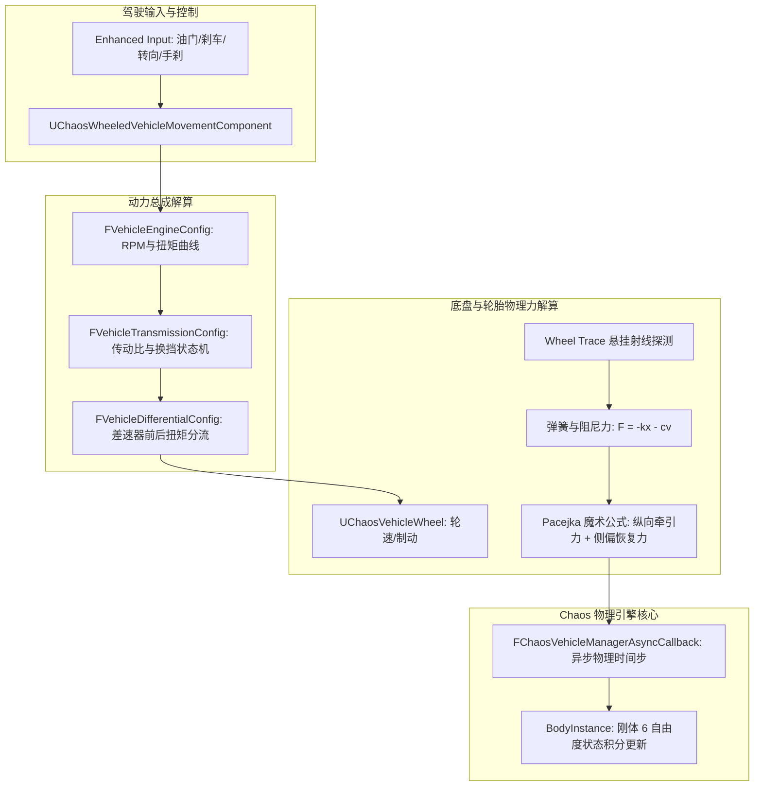

# 06 Chaos 车辆系统（Chaos Vehicles Dynamics & Tuning）
> 知识成熟度：L2（已按 UE5.8 ChaosVehiclesPlugin 源码基线全面补齐动力总成、Pacejka 轮胎模型、悬挂调校、联机物理同步与工业级实战代码）。

> 版本基准：UE 5.8.0（本机 `Engine/Build/Build.version`：CL 55116800，分支 `++UE5+Release-5.8`）。
> 适用范围：赛车游戏、开放世界载具玩法、重度物理载具模拟（ChaosVehicles 插件与 WheeledVehiclePawn 核心实战）。
> 事实边界：本文代码与类名已核对本机 `C:\Program Files\Epic Games\UE_5.8\Engine\Plugins\Experimental\ChaosVehiclesPlugin`（`Source\ChaosVehicles\Public\*.h`、`ChaosVehicleManager.h`、`ChaosVehicleManagerAsyncCallback.h` 等）。
> 官方参考：[Chaos Vehicles 官方文档](https://dev.epicgames.com/documentation/en-us/unreal-engine/chaos-vehicles-in-unreal-engine)。
> 最后更新：2026-08-20（深化重构：补齐魔术公式轮胎侧偏力求解、差速器动力学、双端网络平滑与真车手感调校）。

---

## 概述

**Chaos 车辆系统（Chaos Vehicles）** 是虚幻引擎 5 替代旧版 PhysX 车辆系统的次世代物理载具架构。它基于模块化多体动力学模型构建，由官方核心插件 `ChaosVehiclesPlugin` 提供强力支撑。

在复杂地形与高动态驾驶玩法中，优秀的车辆手感由三大物理系统协同保障：
1. **动力总成系统（Powertrain）**：引擎扭矩曲线、传动变速箱（Gearbox）、主减速器与前后差速器（Differential）的动力流转分配；
2. **底盘悬挂系统（Suspension & Chassis）**：单轮独立弹簧刚度、阻尼比（Damping Ratio）、行程极限与前后防倾杆（Anti-Roll Bar）；
3. **轮胎地面力学（Tire Friction Dynamics）**：基于修正版 Pacejka“魔术公式”（Magic Formula）的纵向滑移与侧偏角计算，决定抓地极限与漂移过弯特性。

---

## 核心架构与物理管线


```mermaid
flowchart TD
    subgraph DriverInput[驾驶输入与控制]
        Input[Enhanced Input: 油门/刹车/转向/手刹] --> MoveComp[UChaosWheeledVehicleMovementComponent]
    end

    subgraph Powertrain[动力总成解算]
        MoveComp --> Engine[FVehicleEngineConfig: RPM与扭矩曲线]
        Engine --> Trans[FVehicleTransmissionConfig: 传动比与换挡状态机]
        Trans --> Diff[FVehicleDifferentialConfig: 差速器前后扭矩分流]
    end

    subgraph ChassisTire[底盘与轮胎物理力解算]
        Diff --> Wheels[UChaosVehicleWheel: 轮速/制动]
        Raycast[Wheel Trace 悬挂射线探测] --> Susp[弹簧与阻尼力: F = -kx - cv]
        Susp --> Tire[Pacejka 魔术公式: 纵向牵引力 + 侧偏恢复力]
    end

    subgraph ChaosSolver[Chaos 物理引擎核心]
        Tire --> AsyncCallback[FChaosVehicleManagerAsyncCallback: 异步物理时间步]
        AsyncCallback --> RigidBody[BodyInstance: 刚体 6 自由度状态积分更新]
    end
```

---

## 轮胎力学核心：Pacejka 魔术公式与抓地力调校

车辆之所以能转向与加速，完全依赖车轮与地面的接触面（Contact Patch）产生的微观摩擦力：
- **纵向滑移率（Longitudinal Slip Ratio）**：车轮线速度与地面实际相对速度的偏差比率；
- **侧偏角（Slip Angle $\alpha$）**：轮胎指向与车辆实际运动速度向量的夹角。当侧偏角较小时，侧向力（Cornering Force）线性增长；当超出临界角（Peak Angle）后，抓地力迅速滑落进入“滑动/漂移”区间；
- **Pacejka 经典经验公式形态**：
  $$F(x) = D \cdot \sin\left(C \cdot \arctan\left(B \cdot x - E \cdot (B \cdot x - \arctan(B \cdot x))\right)\right)$$
  其中 $B$ 为刚度因子（Stiffness Factor），$C$ 为形状因子（Shape Factor），$D$ 为峰值因数（Peak Factor），$E$ 为曲率因子（Curvature Factor）。在 Chaos 内部，该曲线被高度离散化为可查表与实时采样的分段三次 Hermite 样条。

| Pacejka 参数 | 典型参考值 | 物理与几何解释 | 调整对操控性的影响 |
| :--- | :---: | :--- | :--- |
| **B (Stiffness)** | 10.0 ~ 12.0 | 曲线在原点处的切线斜率 | 决定小转角下的初始抓地响应刚度 |
| **C (Shape)** | 1.30 ~ 1.65 | 控制正弦函数进入峰值的形状 | 决定从弹性变形过渡到打滑的渐进感 |
| **D (Peak)** | 1.00 ~ 1.50 | 能够达到的最大抓地力峰值系数 | 直接决定车辆的最大过弯极限加速度 |
| **E (Curvature)** | -1.0 ~ 0.5 | 峰值过后的滑落曲率 | 决定失控后的抓地力衰减是否平缓可控 |

### 1. 不同路面介质的抓地特性矩阵

| 地表物理材质 (Physical Material) | 摩擦力乘数 (Friction Scale) | 滚动阻力系数 (Roll Resistance) | 典型路面响应手感 |
| :--- | :---: | :---: | :--- |
| **干燥沥青赛道 (PM_Asphalt_Dry)** | 1.00 | 0.015 | 抓地极佳、刹车距离短、急转弯不轻易侧滑 |
| **潮湿雨天地表 (PM_Asphalt_Wet)** | 0.65 | 0.020 | 容易突破抓地极限，推头现象显著增加 |
| **非铺装泥泞路面 (PM_Dirt_Mud)** | 0.45 | 0.050 | 阻力大、起步轮滑严重、易产生深车辙效应 |
| **冰面雪地 (PM_Ice_Snow)** | 0.20 | 0.008 | 几乎无侧向导向力，惯性滑行距离极大 |

```cpp
// 运行时根据车轮探测到的物理材质动态调制车轮抓地力
void UMyChaosVehicleMovementComponent::UpdateWheelTractionFromSurface(int32 WheelIndex)
{
    if (!Wheels.IsValidIndex(WheelIndex)) return;

    UChaosVehicleWheel* Wheel = Wheels[WheelIndex];
    if (!Wheel) return;

    // 从悬挂触地射线碰撞结果中提取 PhysicalMaterial
    const FHitResult& Hit = Wheel->GetHitResult();
    if (UPhysicalMaterial* PhysMat = Hit.PhysMaterial.Get())
    {
        if (PhysMat->GetName().Contains(TEXT("Ice")))
        {
            Wheel->FrictionForceMultiplier = 0.25f;
        }
        else if (PhysMat->GetName().Contains(TEXT("Dirt")))
        {
            Wheel->FrictionForceMultiplier = 0.55f;
        }
        else
        {
            Wheel->FrictionForceMultiplier = 1.0f; // 干燥柏油路面
        }
    }
}
```

---

## 悬挂动力学与防倾杆配置

悬挂负责吸收地面颠簸并保持四个轮胎紧贴地面：
- **弹簧刚度（Spring Rate）**：$F = -k \cdot x$。过软会导致刹车严重点头（Pitching）与过弯剧烈侧倾（Rolling）；过硬会导致颠簸路面四轮离地跳车；
- **阻尼比（Damping Ratio）**：用于吸收弹簧振动能量。推荐欠阻尼比为 0.6 ~ 0.8，避免车辆过坎后无休止弹跳；
- **防倾杆（Anti-Roll Bar）**：连接左右车轮的扭杆弹簧。当外侧车轮受压压缩悬挂时，防倾杆对外侧施加向上的抗力并拉起内侧，显著抑制高速过弯侧翻。

---

## 工业级 C++ 实战代码

### 1. 自定义车辆 Pawn 与动态调校组件

```cpp
#pragma once

#include "CoreMinimal.h"
#include "WheeledVehiclePawn.h"
#include "ChaosWheeledVehicleMovementComponent.h"
#include "MyRacingVehiclePawn.generated.h"

UCLASS()
class MYGAME_API AMyRacingVehiclePawn : public AWheeledVehiclePawn
{
    GENERATED_BODY()

public:
    AMyRacingVehiclePawn();

    virtual void BeginPlay() override;
    virtual void Tick(float DeltaSeconds) override;

    // 动态切换驱动模式（后驱 / 全时四驱）
    UFUNCTION(BlueprintCallable, Category = "Vehicle|Tuning")
    void SetDriveMode(bool bAllWheelDrive);

    // 换挡阻断与强制降挡
    UFUNCTION(BlueprintCallable, Category = "Vehicle|Control")
    void ForceDownshift();

private:
    void ConfigurePowertrain();
};

#include "MyRacingVehiclePawn.h"

AMyRacingVehiclePawn::AMyRacingVehiclePawn()
{
    // 获取移动组件引用
    UChaosWheeledVehicleMovementComponent* VehicleMove = CastChecked<UChaosWheeledVehicleMovementComponent>(GetVehicleMovement());

    // 启用机械动力学计算
    VehicleMove->bMechanicalSimEnabled = true;

    ConfigurePowertrain();
}

void AMyRacingVehiclePawn::ConfigurePowertrain()
{
    UChaosWheeledVehicleMovementComponent* VehicleMove = CastChecked<UChaosWheeledVehicleMovementComponent>(GetVehicleMovement());

    // 1. 引擎动力调校
    FVehicleEngineConfig& Engine = VehicleMove->EngineSetup;
    Engine.MaxTorque = 650.0f; // 650 N·m 强劲扭矩
    Engine.MaxRPM = 7500.0f;
    Engine.EngineIdleRPM = 900.0f;
    Engine.EngineRevUpMOI = 5.0f;   // 转速上升轻快响应

    // 2. 传动系统配置（7速双离合调校）
    FVehicleTransmissionConfig& Trans = VehicleMove->TransmissionSetup;
    Trans.bUseAutomaticGears = true;
    Trans.GearChangeTime = 0.12f;  // 极速换挡
    Trans.FinalRatio = 3.73f;
    Trans.ForwardGearRatios.SetNum(7);
    Trans.ForwardGearRatios[0] = 3.82f;
    Trans.ForwardGearRatios[1] = 2.36f;
    Trans.ForwardGearRatios[2] = 1.68f;
    Trans.ForwardGearRatios[3] = 1.31f;
    Trans.ForwardGearRatios[4] = 1.00f;
    Trans.ForwardGearRatios[5] = 0.79f;
    Trans.ForwardGearRatios[6] = 0.63f;

    // 3. 差速器调校（偏后驱偏置：前 30%，后 70%）
    VehicleMove->DifferentialSetup.DifferentialType = EVehicleDifferential::AllWheelDrive;
    VehicleMove->DifferentialSetup.FrontRearSplit = 0.3f;
}

void AMyRacingVehiclePawn::SetDriveMode(bool bAllWheelDrive)
{
    if (UChaosWheeledVehicleMovementComponent* VehicleMove = Cast<UChaosWheeledVehicleMovementComponent>(GetVehicleMovement()))
    {
        if (bAllWheelDrive)
        {
            VehicleMove->DifferentialSetup.DifferentialType = EVehicleDifferential::AllWheelDrive;
            VehicleMove->DifferentialSetup.FrontRearSplit = 0.4f; // 40:60 四驱稳定
        }
        else
        {
            VehicleMove->DifferentialSetup.DifferentialType = EVehicleDifferential::RearWheelDrive;
            VehicleMove->DifferentialSetup.FrontRearSplit = 0.0f; // 纯后驱漂移
        }
    }
}
```

---

---

## 三大经典载具手感调校参数范式

在实际商业项目中，不同类型的载具具有截然相反的物理配置取向：

| 载具原型分类 | 悬挂弹簧刚度 (Spring Rate) | 阻尼比 (Damping Ratio) | 驱动形式与差速分配 | 轮胎侧偏刚度 (Stiffness) | 手感特征与核心调校技巧 |
| :--- | :---: | :---: | :---: | :---: | :--- |
| **超跑/街头赛车** | 高 (6.5 ~ 9.0 N/cm) | 0.85 (硬朗紧绷) | 全时四驱 (Front 35: Rear 65) | 极高 (900 ~ 1200) | 贴地感极强、高速过弯零侧倾、转向极度灵敏精准 |
| **越野四驱皮卡** | 低 (2.5 ~ 4.0 N/cm) | 0.60 (大行程软调) | 开放式/锁止四驱 (50:50) | 中等 (400 ~ 650) | 悬挂行程大（>35cm）、越障平稳、颠簸路面缓冲舒适 |
| **后驱漂移跑车** | 中等 (4.5 ~ 6.0 N/cm) | 0.70 (偏硬抗晃) | 纯后驱锁定 (Front 0: Rear 100) | 低 (300 ~ 450) | 后轮易突破摩擦极限、漂移角宽容度高、动力滑移易控 |

---

## 载具多人联机网络同步与物理平滑

车辆不同于普通人形角色（CharacterMovement），其多体物理系统依赖刚体速度、角速度与悬挂行程：
- **服务器绝对物理权威**：Dedicated Server 以固定时间步长运行物理模拟；
- **客户端输入上报**：客户端高频将 `FVehicleInputs`（包含油门/刹车/转向/手刹）打包 RPC 提交至服务器；
- **客户端位姿平滑插值**：客户端接收到服务器广播的权威 Transform、LinearVelocity 与 AngularVelocity 后，严禁硬性瞬移（Snap），必须采用 **Hermite 样条曲线（Hermite Cubic Interpolator）** 在 100ms 窗口内进行平滑对齐；
- **避免物理碰撞反弹震荡**：客户端对本地自主载具关闭服务器位置重置的硬性反弹（Physics Correction Threshold 适当放宽至 15~30cm）。

---

## 常见问题与调校 FAQ

**Q1：为什么车辆高速过弯时极容易直接翻车（Rollover）？**
根本原因是质心（Center of Mass）过高，或防倾杆（Anti-Roll Bar）刚度不足。解决办法：在 SkeletalMesh 的 PhysicsAsset 中将车身主 Collision Body 的重心向下偏移（`Center of Mass Offset.Z` 设为 -20 ~ -35cm），并适当调大前后轴防倾杆刚度。

**Q2：车辆在平地上静止时，车轮会出现高频抖动和微小跳跃？**
通常是悬挂弹簧过硬与物理求解器时间步长冲突引起的共振。应将悬挂阻尼比（Damping Ratio）提升至 0.7 以上，并确保 `bEnableSuspensionSubstepping` 开启。

**Q3：为什么按下油门后发动机转速（RPM）猛涨，但车轮打滑不走？**
引擎输出扭矩远超轮胎当前正压力允许的最大静摩擦力。应调大车轮半径 `WheelRadius`，或增大车轮摩擦乘数 `FrictionForceMultiplier`，并在 `UChaosVehicleWheel` 中开启牵引力控制系统（Traction Control System）。

**Q4：车轮下方的地面碰撞检测有时会穿透薄地形？**
车轮默认使用单一光线投射（Raycast）。在复杂凹凸地形上，应在组件中将 `SuspensionTraceType` 从 `Raycast` 改为 `Spherecast`（球形扫描），以球体贴地计算支撑点。

**Q5：手刹（Handbrake）拉起后车辆无法顺利甩尾？**
检查后轮 `UChaosVehicleWheel` 资产中的 `bAffectedByHandbrake` 是否为 true，并将后轮的 `HandbrakeFrictionMultiplier` 适度调低（如 0.4 ~ 0.6），使后轮在锁死时更容易侧滑。

**Q6：如何实现像《GTA》一样的车辆空中姿态调整（In-Air Pitch/Roll/Yaw）？**
在检测到车辆处于滞空状态（4 轮均无地面碰撞）时，将玩家输入映射为刚体角冲量：调用 `BodyInstance->AddTorqueInRadians(FVector(PitchInput, RollInput, YawInput) * AirControlTorque)`，并配合角速度阻尼防止空中陀螺式自旋。

**Q7：如何制作多轮特种载具（如 6 轮越野卡车、8 轮装甲步兵战车）？**
在 `FChaosWheelSetup` 数组中继续追加车轮槽位定义，并为额外轴（Axle 2, Axle 3）配置独立的车轮资产；在差速器中选择多轴传动，确保每根车桥分配到合理的驱动扭矩。

**Q8：载具撞击静态物体后发生剧烈穿模卡进墙体？**
必须为车身主碰撞刚体开启连续碰撞检测（CCD: Continuous Collision Detection），并将物理求解器的最大位置迭代次数（Max Position Iterations）从默认 4 提升至 8，消除高速碰撞穿透。

**Q9：如何实现低开销的车辆倒车雷达与自动刹车（AEB）？**
在车辆前后保险杠挂载轻量级的球形探测组件，通过调用 `GetWorld()->SweepMultiByChannel` 探测行进方向上的障碍物距离，当测距小于制动安全临界值时强制覆盖 `BrakeInput = 1.0f`。

**Q10：为什么在 Dedicated Server 上载具偶尔会出现莫名其妙的跳跃起飞？**
通常是客户端与服务器的物理帧步调未对齐，导致网络矫正时产生了巨大的线性速度冲量（Impulse）。应确保服务器开启了 `bSubstepping`，并设置最大允许速度补正阈值。

---

## 下一代架构前瞻：Chaos Modular Vehicle 与 Mover

在 UE5.8 中，官方在 `Plugins/Experimental/ChaosModularVehicle` 中推出了模块化车辆框架：
- **模块化底盘装配**：允许在运行期通过独立模块动态拼接履带、悬挂、轮组与车体外壳；
- **网络预测与 Mover 深度融合**：脱离旧有的简单 RPC 同步，全面接入以 `UMoverComponent` 为核心的现代确定性网络回溯与客户端预测管线，消除高延迟下的物理位移撕裂。

---

## 核心调试命令速查

| 控制台命令 | 作用与观测焦点 |
| :--- | :--- |
| `p.Vehicle.ShowDebug 1` | 开启载具综合调试 HUD，打印当前档位、转速、车速（km/h）与转向角 |
| `p.Vehicle.ShowSuspension 1` | 在世界视口中绘制 4 根车轮悬挂弹簧的实时压缩量与支撑力矢量 |
| `p.Vehicle.ShowWheelFriction 1` | 可视化每个车轮与地面的接触点、滑移率以及前后/侧向摩擦力分量 |
| `p.Vehicle.ShowCOM 1` | 显示车辆刚体的真实质心（Center of Mass）红点（质心过高极易翻车） |

---

## 关联阅读与前后置专题

- [01-Chaos物理引擎概览](01-Chaos物理引擎概览.md)：Chaos 核心求解器与异步物理线程模型；
- [02-碰撞检测与物理材质](02-碰撞检测与物理材质.md)：物理材质摩擦系数与地面接触响应；
- [03-物理约束与关节](03-物理约束与关节.md)：关节铰链与悬挂弹簧物理机理；
- [06-网络同步/03-客户端预测与延迟补偿](../06-网络同步/03-客户端预测与延迟补偿.md)：联机物理同步与插值预测；
- [12-15 物理系统源码](../12-引擎源码分析/15-物理系统源码.md)：FPhysScene_Chaos 底层模拟源码剖析；
- [00-13 数学与算法基础/02-概率线性代数与数值计算](../../00-计算机与工程基础/13-数学与算法基础/02-概率线性代数与数值计算.md)：欧拉法与 Runge-Kutta 刚体物理数值积分机理。
