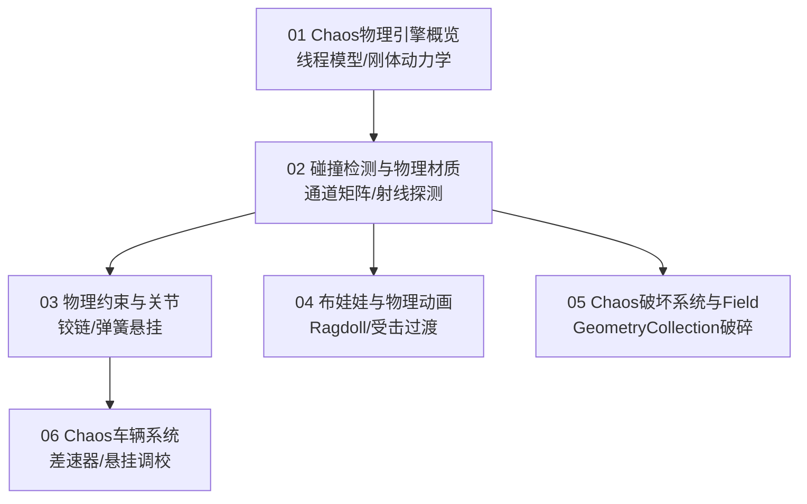

# 09 物理系统

> 知识成熟度：L2（子域工程手册，已按 6 篇核心专题与 UE5.8 源码基线全面标准化）。
>
> 领域权威导航：[游戏知识 Domain MOC](../../00_Index/domains/游戏知识.md) ｜ [游戏知识总目录](../README.md)。

---

## 1. 核心定位与设计思想

「09-物理系统」负责虚幻引擎世界中物体的运动动力学、碰撞交互、机械约束与物理破碎仿真。UE5 彻底告别了旧有的 PhysX，全面采用原生自研的 **Chaos** 物理引擎：
- **异步物理解算（Async Physics Tick）**：支持将物理模拟从游戏主线程中剥离出来，以恒定高帧率运行在独立工作线程中，有效消除因逻辑帧抖动引发的物理穿模与不确定性；
- **确定性碰撞通道与射线查询**：通过 Collision Channels 与 Preset 响应矩阵（Ignore/Overlap/Block）精确过滤物体交叠与阻挡，为武器命中射线检测（LineTrace）与扫描探测（Sweep）提供低开销支持；
- **机械约束与骨骼物理动画**：利用 Physics Constraint Component 模拟铰链、球窝与悬挂减震，以 Physical Animation 混合骨骼动画与物理冲击，实现逼真的受击晃动与自然布娃娃（Ragdoll）死亡表现；
- **次时代破坏与力场驱动**：基于 Geometry Collection 资产分层与 Field System（力场系统），实现建筑爆破、掩体穿透碎裂以及 GPU 碎块飞溅的高拟真表现。

---

## 2. 专题矩阵与知识状态

| 专题文件（Canonical 路径） | 知识类型 | 成熟度 | 核心工程关注点与落地场景 |
| :--- | :---: | :---: | :--- |
| [01-Chaos物理引擎概览.md](../../知识/04-图形动画与物理仿真/物理求解与动力学/01-Chaos物理引擎概览.md) | Concept | L2 | Chaos 核心架构演进、异步物理 Tick 线程模型、刚体动力学求解器方程、连续碰撞检测（CCD）与性能开销预算 |
| [02-碰撞检测与物理材质.md](../../知识/04-图形动画与物理仿真/物理求解与动力学/02-碰撞检测与物理材质.md) | Concept | L2 | 碰撞通道划分、响应矩阵过滤、OnComponentHit/BeginOverlap 事件管线、物理材质摩擦力/弹性与 SceneQuery 射线探测 |
| [03-物理约束与关节.md](../../知识/04-图形动画与物理仿真/物理求解与动力学/03-物理约束与关节.md) | Concept | L2 | 铰链/球形/棱柱关节自由度（DOF）锁定、约束驱动器与弹簧马达参数调优、破坏断裂连接机制 |
| [04-布娃娃与物理动画.md](../../知识/04-图形动画与物理仿真/物理求解与动力学/04-布娃娃与物理动画.md) | Concept | L2 | Ragdoll 布娃娃激活流程、PhysicsAsset 碰撞体拓扑、物理动画组件（PhysicalAnimationComponent）受击混播、Chaos Cloth 布料 |
| [05-Chaos破坏系统与Field.md](../../知识/04-图形动画与物理仿真/物理求解与动力学/05-Chaos破坏系统与Field.md) | Concept | L2 | Geometry Collection 破碎分层、Fracture 几何碎块生成、Field System（径向力场/锚定力场）与断裂事件同步 |
| [06-Chaos车辆系统.md](../../知识/04-图形动画与物理仿真/物理求解与动力学/06-Chaos车辆系统.md) | Concept | L2 | WheeledVehiclePawn 载具体系：引擎扭矩曲线、传动比、差速器模式、车轮独立悬挂弹簧与载具网络物理同步 |

---

## 3. 逻辑学习顺序建议

1. **第一阶段（物理底座与碰撞规则）**：精读 `01-Chaos物理引擎概览` 与 `02-碰撞检测与物理材质`，建立物理异步解算认知，掌握射线与碰撞通道的最佳工程实践。
2. **第二阶段（约束机构与载具仿真）**：研读 `03-物理约束与关节` 与 `06-Chaos车辆系统`，掌握铰链门锁、吊灯晃动与复杂多轮车辆的物理调校。
3. **第三阶段（动画结合与次世代破坏）**：学习 `04-布娃娃与物理动画` 与 `05-Chaos破坏系统与Field`，打通角色受击断肢、死亡瘫软与大场景建筑爆破的物理落地。

---

## 4. 游戏与引擎工程落地场景

- **高速子弹穿墙防漏检**：对狙击弹道与快速移动投射物启用连续碰撞检测（CCD）并适当放大碰撞半径，彻底根除高帧率下的“穿墙隧道效应”（Tunneling）；
- **角色受击局部物理晃动**：使用 PhysicalAnimationComponent 将受击部位骨骼权重提升至 0.8，施加局部冲量（AddImpulse），其余骨骼保持姿态图求值，实现拳拳到肉的受击反馈；
- **多人联机载具物理同步**：在 Dedicated Server 上以固定时间步长（Fixed Tick）运行 Chaos 载具模拟，客户端通过网络接收位置、线速度与角速度，配合 Hermite 样条曲线进行平滑插值。

---

## 5. 跨域技术依赖与前后置导航

- **向下扎根（计算机与算法底座）**：
  - 向量、四元数与刚体变换：[游戏算法 02-数学与碰撞](../../游戏算法/02-数学与碰撞/README.md)
  - 碰撞检测数学理论：[游戏算法 02-数学与碰撞/04-碰撞检测](../../知识/02-数学与游戏算法/空间查询与碰撞/04-碰撞检测.md)
- **向上驱动（引擎源码剖析）**：
  - 物理系统底层源码：[12-15 物理系统源码](../../知识/04-图形动画与物理仿真/物理求解与动力学/15-物理系统源码.md)
  - Chaos 破坏源码：[12-37 Chaos破坏与Field源码](../../知识/04-图形动画与物理仿真/物理求解与动力学/37-Chaos破坏与Field源码.md)
- **横向协同（动画与特效）**：
  - 骨骼姿态与动画图：[04-动画系统](../04-动画系统/README.md)
  - 粒子特效力场碰撞：[11-VFX与Niagara](../11-VFX与Niagara/README.md)
