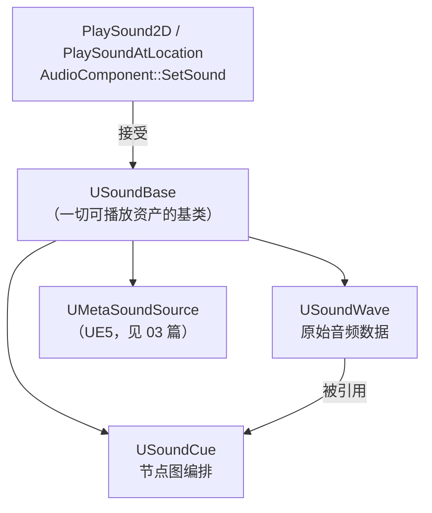
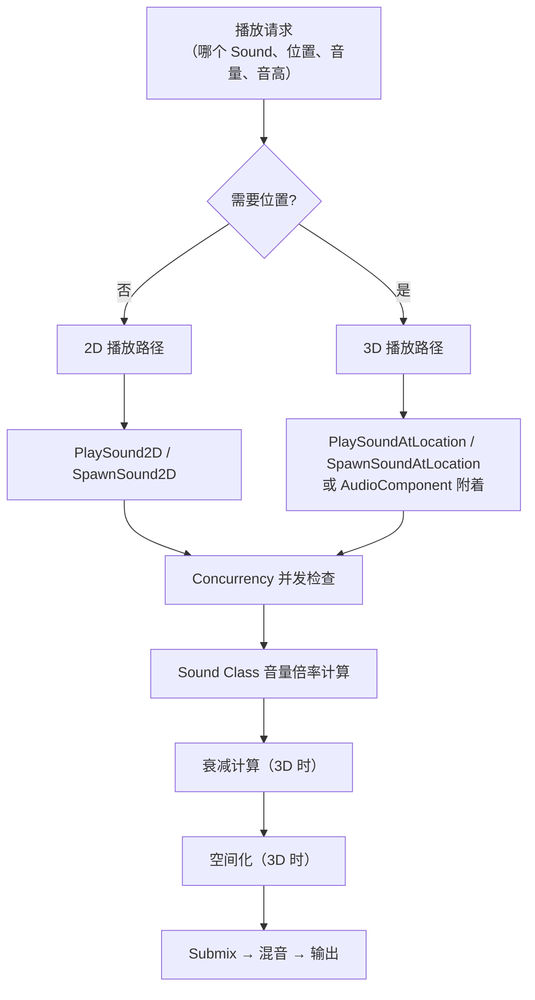
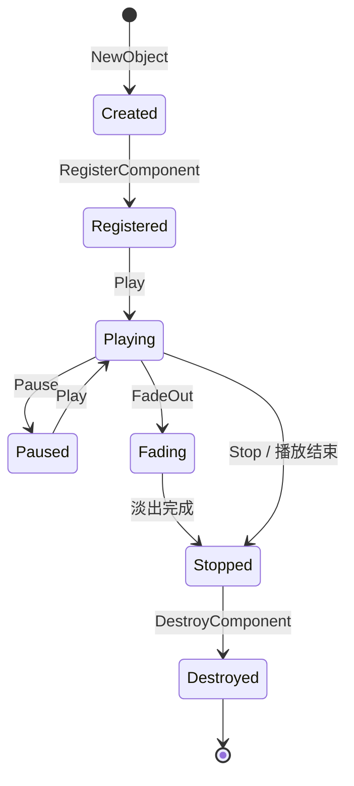
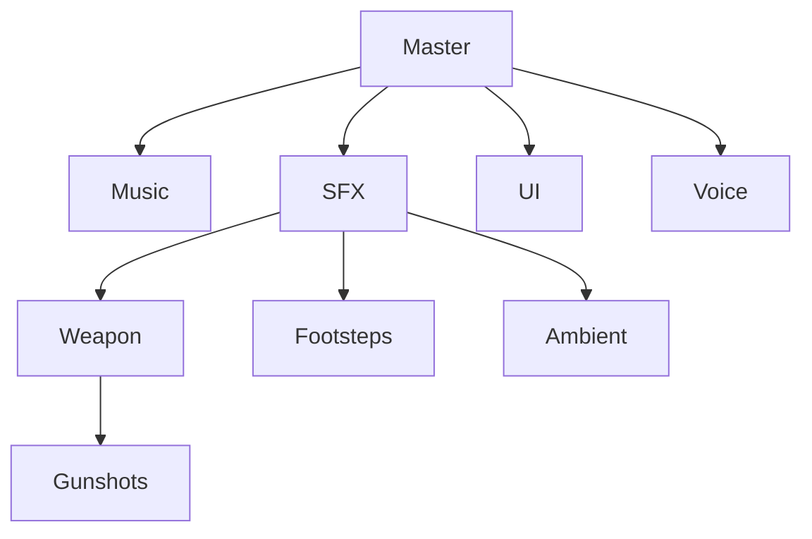
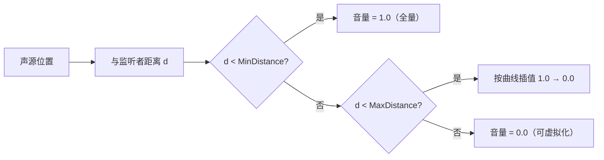

# 01 音频基础与播放

> 所属系列：10-音频系统（UE 客户端）
> 版本基准：UE 5.8.0（本机 `Engine/Build/Build.version`：CL 55116800，分支 `++UE5+Release-5.8`）。
> 源码依据：`C:\Program Files\Epic Games\UE_5.8\Engine\Source\Runtime\Engine\Classes\Sound`、`Engine\Source\Runtime\AudioMixer`。
> 适用范围：SoundWave/SoundCue、播放调用、Sound Class/Mix、Submix 的运行时使用。
> 兼容性边界：UE 4.27 仅作为历史兼容性/迁移对照，当前行为以 UE 5.8 为准。
> 前置知识：UE 编辑器基础、蓝图基础（或 C++ 基础）
> 最后更新：2026-08-05（统一 UE5.8 版本基线）。
> 官方参考：[Unreal Engine UE5.8 官方文档总页](https://dev.epicgames.com/documentation/en-us/unreal-engine)。

---

## 一、概述

从"磁盘上的一个 WAV 文件"到"玩家耳机里的一声枪响"，UE 的音频链路大致为：

**导入 → 资产（USoundWave / USoundCue）→ 播放调用 → 音效类混音（Sound Class / Sound Mix）→ 衰减与空间化 → Submix → 输出设备**

本文覆盖这条链路的前半段，包含五个部分：

1. **音频资产**：WAV / 压缩 / 流送三种形态的差异与选择；
2. **SoundBase 体系**：USoundBase、USoundWave、USoundCue 的职责与关系；
3. **播放方式**：PlaySound2D / PlaySoundAtLocation / PlaySoundAtLocation / UAudioComponent 四种打法及适用场景；
4. **音量与混音**：Sound Class 树与 Sound Mix 的全局音量控制；
5. **衰减入门**：理解衰减资产的基本概念，为第 02 篇做铺垫。

学完本文，你应该能：把一段音频放进游戏并用正确的方式播放出来；为 UI、武器、脚步配置不同的播放路径；实现"进入商店压低 BGM"之类的混音玩法；并且知道声音"不响、太响、糊成一团"时该去哪里排查。

> 说明：本文不涉及 MetaSound 与 Submix DSP 效果链，相关内容见第 03 篇；衰减与空间化的完整内容见第 02 篇。

---

## 二、核心概念（表格）

| 概念 | 类别 | 一句话作用 | 关键点 |
| ---- | ---- | ---- | ---- |
| USoundBase | C++ 类 | 一切可播放音频的基类 | PlaySound 系列接口接收它作为参数 |
| USoundWave | 资产 | 单个音频数据（WAV / Ogg / FLAC） | 可循环、可流送、可设置解压方式 |
| USoundCue | 资产 | 节点图形式的"播放编排" | 随机、混合、延迟、条件分支 |
| UAudioComponent | Actor 组件 | 挂在场景里的发声体 | 有位置、可附着、可淡入淡出 |
| PlaySound2D | 静态函数 | 播放 2D 声音 | 不参与 3D 空间化，适合 UI / 全局 |
| PlaySoundAtLocation | 静态函数 | 在指定坐标播放 3D 声音 | fire-and-forget，不返回可控句柄 |
| SpawnSound2D / AtLocation | 静态函数 | 生成可控制的音频组件 | 返回 UAudioComponent* |
| USoundClass | 资产 | 音量的分组与树状管理 | 可嵌套，可整体调音量倍率 |
| USoundMix | 资产 | 一组"音量调整方案" | 配合 Sound Class Adjuster 使用 |
| USoundAttenuation | 资产 | 距离衰减与空间化设置 | 本文入门，第 02 篇详解 |
| USoundConcurrency | 资产 | 并发播放限制 | 防止同组音效"叠成音海" |
| USoundSubmix | 资产 | 混音总线 | 本文提及，第 03 篇详解 |

（表 1：01 篇核心概念速览）

---

## 三、原理详解

### 3.1 音频资产：格式、采样率与解压方式

#### 3.1.1 三种资产形态

| 形态 | 代表格式 | 内存占用 | 播放延迟 | 适用场景 |
| ---- | ---- | ---- | ---- | ---- |
| 无损 PCM | WAV (PCM) | 大 | 低（可流送） | 关键短音效、语音 |
| 有损压缩 | Ogg Vorbis | 小 | 需解压 | 音乐、环境长音 |
| 流送 Streaming | 任意格式边读边播 | 极小 | 首次播放可能卡 | 超长音乐、过场语音 |

要点：

- **WAV（PCM）**：未压缩的采样数据，音质无损但体积大。1 分钟 44.1kHz / 16bit / 立体声约为 10.6 MB。适合短促、高频触发的音效。
- **压缩（Ogg Vorbis）**：UE 导入时默认转为 Ogg Vorbis 有损压缩，体积约为 WAV 的 1/10。代价是解码 CPU 开销与音质损失，压缩质量（Compression Quality，0~100）可在导入设置里调整。
- **流送（Streaming）**：不把整段音频载入内存，而是从磁盘（或打包后的 .pak）按需读取解码。适合数分钟长的音乐与语音。首次触发时可能有几十毫秒的读取延迟，可通过预加载缓解。
- **FLAC**：UE5 亦支持无损压缩格式，介于 WAV 与 Ogg 之间，按需选用。

#### 3.1.2 采样率、位深与声道

- **采样率**：建议全项目统一 44.1kHz 或 48kHz。混音器内部按项目设置处理（默认 48kHz），导入时会做重采样。
- **位深**：16bit 是行业主流；24bit 适合高动态范围素材；引擎内部混音为浮点（32bit float），不会在混音阶段丢精度。
- **声道数**：**单声道（Mono）是 3D 音效的标准**——单声道素材才能被"空间化"；立体声素材用于 2D / BGM；多声道（5.1 / 7.1）用于影院级内容。

> 一个常见误区：把立体声素材当 3D 音效播放，空间感会很弱。3D 空间化（Pan / HRTF）主要作用于单声道素材，详见第 02 篇。

#### 3.1.3 Decompression Type（解压方式）

在 Sound Wave 资产的 Details 面板中：

| 选项 | 行为 | 适用场景 |
| ---- | ---- | ---- |
| Synchronous（同步） | 加载时立即解压进内存 | 短音效、需要极低播放延迟 |
| Asynchronous（异步） | 后台线程解压，避免主线程卡顿 | 大多数压缩音效 |
| Streaming（流送） | 边播边解压 | 长音乐、长语音 |

另外还有 **Loading Behavior**（按需加载 / 常驻）等设置，发布前建议在 Project Settings → Audio 里统一检查。

### 3.2 USoundBase 体系：Wave、Cue 与它们的继承关系



（图 1：SoundBase 继承关系与播放接口）

- **USoundBase**：抽象基类，定义了播放所需的统一接口（时长、是否循环、衰减引用、Sound Class 归属等）。所有"能播的东西"都继承它，因此播放接口只需依赖它。
- **USoundWave**：最底层的"数据容器"。它持有音频缓冲（或流送句柄）、采样率、声道数、时长等信息。它自己也可以被直接播放（此时没有编排逻辑）。
- **USoundCue**：一个由节点组成的**播放图**：Sound Wave Player 节点引用具体 Wave，再通过 Random / Mixer / Delay / Modulator 等节点组合出"每次播放有 20% 概率换一个变体、30% 概率改一下音高"之类的行为。它是纯 CPU 侧的编排，不改变音频数据本身。

| 对比项 | USoundWave | USoundCue |
| ---- | ---- | ---- |
| 内容 | 音频数据 | 播放逻辑图 |
| 随机 / 变体 | 不支持 | 支持（Random 节点） |
| 混合多个声音 | 不支持 | 支持（Mixer 节点） |
| 运行开销 | 最低 | 有少量节点求值开销 |
| 适合 | 单一、确定的声音 | 需要变化 / 组合的声音 |

> 实践：同一个枪械开火音，通常会做成一个 SoundCue：内部用 Random 节点在 3~5 个 Wave 变体间随机，再叠加一个低音量机械音 Wave。

### 3.3 播放方式：四种打法与选择

UE 提供了从"最省事"到"最可控"的播放接口，选择依据是：**要不要位置？要不要后续控制？**

| 接口 | 2D/3D | 可控性 | 适用场景 |
| ---- | ---- | ---- | ---- |
| PlaySound2D | 2D | 无（fire-and-forget） | UI 点击、系统提示、全局反馈 |
| PlaySoundAtLocation（蓝图节点） | 3D | 无 | 用世界位置的即发音效 |
| PlaySoundAtLocation | 3D | 无 | 武器开火、爆炸、脚步 |
| SpawnSound2D / SpawnSoundAtLocation | 2D/3D | 返回 AudioComponent | 循环音、需要 Fade / 停止的音 |
| UAudioComponent（手动挂载） | 3D | 完全可控 | 角色身上常驻组件、载具引擎声 |

#### 3.3.1 播放流程总览



（图 2：音频播放完整流程）

#### 3.3.2 各方式详解

**PlaySound2D**：把声音作为"全局声音"播放，没有位置、没有衰减、不做空间化。音量受 Sound Class 与 Master 音量控制。典型用途：UI 点击、任务完成提示。

**PlaySoundAtLocation**：在世界坐标播放 3D 声音。引擎内部创建一个临时的音频组件，播放结束后自动销毁。注意：它**不返回句柄，无法中途停止或淡出**；如果需要在 3 秒后打断它，请改用 SpawnSoundAtLocation 保存组件引用。

**SpawnSound2D / SpawnSoundAtLocation**：返回 `UAudioComponent*`。保存引用后可调用 `Play / Stop / FadeIn / FadeOut / SetVolumeMultiplier / SetPitchMultiplier`。循环音效（引擎声、风扇声、篝火声）几乎必用这条路径。

**UAudioComponent（手动创建 / 挂载）**：把音频组件挂在角色或 Actor 上，`AttachToComponent` 后位置随 Actor 移动，适合持续发声的物体（载具引擎、飞行器、NPC 说话）。

#### 3.3.3 UAudioComponent 生命周期



（图 3：UAudioComponent 生命周期状态机）

关键行为：

- `bAutoActivate = false` 时，`Play()` 才真正发声；否则 `RegisterComponent()` 后立即按 `bAutoActivate` 播放。
- `FadeIn(float FadeInDuration, float FadeVolumeLevel)` / `FadeOut(...)` 用于淡入淡出，避免爆音（Click/Pop）。
- 播放自然结束后组件不会自动销毁，`OnAudioFinished` 委托会触发；若 Spawn 系列函数传了 `bAutoDestroy = true`，则在结束后自动销毁。

### 3.4 音量与混音：Sound Class 与 Sound Mix

#### 3.4.1 Sound Class 树

Sound Class 是一棵音量树，任何 Sound 资产都要指定一个 Sound Class（默认 Master）：



（图 4：典型 Sound Class 树）

- 每个节点都有 `Volume`（倍率，默认 1.0），**实际音量 = 沿树一路乘下来的结果**。例如：Master 0.8 × SFX 0.9 × Weapon 1.0 × Gunshots 1.0 = 0.72。
- 运行时可用「Set Sound Class Volume」（蓝图）调整某个 Class 的音量；但更推荐用 Sound Mix 做"临时方案"，因为 Mix 支持入栈出栈、自动淡入淡出。

#### 3.4.2 Sound Mix：临时混音方案

**USoundMix** 资产包含一个 **SoundClassAdjuster** 列表：每个 Adjuster 针对某个 Sound Class 设置 `VolumeAdjuster`（倍率）、`PitchAdjuster`、`Priority` 等，并带**淡入淡出时间**（Fade In / Fade Out Time）。

典型玩法：进战斗时压低 BGM：

1. 创建 `USoundMix` 资产，命名如 `SM_CombatDuck`；
2. 添加一个 Adjuster：目标 Sound Class = Music，VolumeAdjuster = 0.3，Fade In Time = 0.5s；
3. 进入战斗：`Push Sound Mix Modifier`；退出战斗：`Pop Sound Mix Modifier`（自动按 Fade Out Time 淡回）。

- **Push / Pop 是栈式**：可以压多层（例如"死亡时再压低所有音效"），Pop 时逐层恢复。
- **SetBaseSoundMix**：设置"常驻基线"混音，通常用于不同区域的基础混音风格切换。
- Sound Mix 也常用于**过场动画**：压低环境音、抬高对白。

```cpp
// C++：推入 / 弹出混音
UGameplayStatics::PushSoundMixModifier(this, CombatMix);
UGameplayStatics::PopSoundMixModifier(this, CombatMix);
```

#### 3.4.3 音量层级总览（从高到低）

| 层级 | 控制方式 | 典型值 |
| ---- | ---- | ---- |
| 平台 / 系统音量 | OS 音量 | 由平台管理 |
| Master 音量 | Sound Class Master | 1.0 |
| Sound Class 树 | 各级 Volume 倍率 | 0.0 ~ 2.0 |
| Sound Mix Adjuster | Push / Pop 栈 | 0.0 ~ 1.0 |
| 单次播放倍率 | PlaySound 参数 / 组件 VolumeMultiplier | 0.0 ~ 1.5 |
| 衰减 | 距离计算（3D 时） | 0.0 ~ 1.0 |

### 3.5 音频衰减基础（第 02 篇预告）

衰减（Attenuation）决定"声音离得越远越轻"。核心概念先行铺垫：

- **USoundAttenuation 资产**：一份可复用的衰减配置，可在 Sound 资产上直接引用，也可以在播放时覆盖（PlaySoundAtLocation 的 AttenuationSettings 参数）。
- **Falloff Distance**：Min Distance（衰减起始距离）与 Max Distance（衰减结束距离）。Min 之内音量不变，Min~Max 之间按曲线下降，超过 Max 听不见（可被虚拟化）。
- **衰减曲线**：线性 / 对数 / 自然 / 反向对数等算法，影响"远近距离感"的听感。
- **附加衰减**：还可以随距离增加低通滤波（越来越闷）、降低空间化权重等。



（图 5：衰减判定流程；曲线形态与空间化细节见第 02 篇）

---

## 四、代码 / 蓝图示例

### 4.1 C++ 示例

#### 示例 1：2D 播放（UI 音效）

```cpp
// 头文件
#include "Kismet/GameplayStatics.h"

// 播放 2D 音效，不关心位置
UGameplayStatics::PlaySound2D(this, UIAsset, /*VolumeMultiplier*/ 1.0f,
                              /*PitchMultiplier*/ 1.0f, /*StartTime*/ 0.0f);
```

#### 示例 2：3D 一次性播放（开火音）

```cpp
// 在枪口位置播放开火音，fire-and-forget
UGameplayStatics::PlaySoundAtLocation(
    this,
    FireSound,                          // USoundBase*
    MuzzleLocation,                     // FVector：枪口世界坐标
    FRotator::ZeroRotator,              // 旋转（影响多声道朝向，一般忽略）
    1.0f,                               // VolumeMultiplier
    FMath::RandRange(0.95f, 1.05f),     // PitchMultiplier：轻微随机，避免机械感
    0.0f,                               // StartTime
    FireAttenuation,                    // USoundAttenuation*（覆盖资产自带配置）
    nullptr,                            // USoundConcurrency*
    nullptr                             // AActor* OwningActor（用于声源归属 / 调试）
);
```

#### 示例 3：生成可控音频组件（循环音效）

```cpp
// 生成篝火循环音，保存引用以便淡出
UAudioComponent* FireAC = UGameplayStatics::SpawnSoundAtLocation(
    this, FireLoopSound, FireLocation, FRotator::ZeroRotator,
    1.0f, 1.0f, 0.0f, FireAttenuation, nullptr, /*bAutoDestroy*/ true);

// ……若干秒后淡出并停止
if (FireAC)
{
    FireAC->FadeOut(0.5f, 0.0f); // 0.5 秒淡出到静音
    FireAC->Stop();              // 可在 FadeOut 结束后调用
}
```

#### 示例 4：附着在角色上的音频组件

```cpp
// 在角色初始化中创建脚步音频组件
UAudioComponent* FootstepAC = NewObject<UAudioComponent>(this);
FootstepAC->bAutoActivate = false;   // 不自动播放
FootstepAC->AttachToComponent(GetRootComponent(),
    FAttachmentTransformRules::KeepRelativeTransform);
FootstepAC->RegisterComponent();     // 注册后组件才生效
FootstepAC->SetSound(FootstepCue);
FootstepAC->SetVolumeMultiplier(0.8f);

// 需要时播放（SoundCue 内部可随机变体）
void AMyCharacter::PlayFootstep()
{
    FootstepAC->Play();
}
```

#### 示例 5：Sound Mix 控制

```cpp
// 头文件
UPROPERTY(EditDefaultsOnly, Category = "Audio")
TObjectPtr<USoundMix> CombatDuckMix;

void AMyGameMode::EnterCombat()
{
    UGameplayStatics::PushSoundMixModifier(this, CombatDuckMix);
}

void AMyGameMode::ExitCombat()
{
    UGameplayStatics::PopSoundMixModifier(this, CombatDuckMix);
}
```

### 4.2 蓝图示例

#### 示例 A：UI 按钮点击音效（2D）

1. 在按钮的 OnClicked 事件中拖出 **Play Sound 2D** 节点；
2. Sound 参数选 `W_ButtonClick`（一个 Sound Wave 或 Cue）；
3. 完成，不需要任何位置信息。

#### 示例 B：武器开火音效（3D，带随机音高）

1. 在武器 Fire 事件中拖出 **Play Sound at Location**；
2. Sound = `SC_Gun_Fire`（SoundCue，内部 Random 节点已随机变体）；
3. Location = 枪口 Socket 的世界位置（`Get Socket Location`）；
4. Pitch Multiplier 接 `Random Float in Range(0.95, 1.05)`。

#### 示例 C：循环引擎声（可控组件）

1. 拖出 **Spawn Sound at Location**（或 Spawn Sound 2D），Sound = `W_EngineLoop`（勾选 Looping）；
2. 用 **Promote to Variable** 保存返回的 Audio Component 引用；
3. 车辆启动时对它 `Play()`，关闭时 `Fade Out` + `Stop()`；
4. 若引擎声随转速变化，用 `Set Pitch Multiplier` 接 RPM 归一化值。

#### 示例 D：进入区域压低 BGM（Sound Mix）

1. 在关卡里放一个 Trigger Volume；
2. Overlap Begin 时 `Push Sound Mix Modifier(SM_CombatDuck)`；
3. Overlap End 时 `Pop Sound Mix Modifier(SM_CombatDuck)`；
4. 别忘了在 Sound Mix 资产里把 Music 的 VolumeAdjuster 设为 0.3 左右并设置 Fade In / Out Time。

---

## 五、最佳实践

1. **统一采样率与响度标准**：全项目 44.1kHz 或 48kHz；响度以 -18 ~ -14 LUFS 为目标，避免逐个调音量。
2. **3D 音效用单声道素材**：空间化依赖单声道；立体声素材做 2D / BGM。
3. **短音效用 Wave 直连，有变体需求才上 Cue**：Cue 有节点求值开销，数量少无所谓，成百上千并发时要谨慎。
4. **Fire-and-forget 与可控组件要分清**：需要停止 / 淡出的声音必须走 Spawn 系列并保存引用。
5. **循环音效统一走组件 + FadeIn / FadeOut**：直接 Play / Stop 循环音容易爆音。
6. **音高随机化**：开火、脚步等高频音效给 Pitch 加 ±5% 随机，减少"机械感"与相位堆积。
7. **音量分层管理**：不要在每个播放点写死音量倍率，用 Sound Class 树做全局分层、Sound Mix 做临时变化。
8. **主音量可调**：游戏设置里至少提供 Master / Music / SFX / Voice 四路音量，映射到 Sound Class。
9. **相同音效并发限制**：给脚步、开火等高频音效配置 Sound Concurrency（如最大 4~8 个并发 + 劫夺策略），防止"音海"。
10. **资源命名规范**：`SC_`（SoundCue）、`W_`（SoundWave）、`A_`（Attenuation）、`M_`（SoundMix）、`S_`（Submix）。
11. **发布前做响度走查**：用 Audio Mixer 的响度统计或外部工具检查最响 / 最弱场景，统一动态范围。
12. **异步加载音频**：UI 或过场用的大音效建议通过 Asset Manager / 软引用预加载，避免首次播放卡顿。

---

## 六、常见问题 FAQ

**Q1：PlaySound2D 播放了但听不到声音？**
按顺序排查：① Master 音量 / 平台音量是否为 0；② 该 Sound 的 Sound Class 树某级音量是否为 0；③ 是否有 Sound Mix 把它压到 0；④ 声音是否被 Concurrency 拒绝（看 LogAudio 警告）；⑤ 资产是否 Cook 进包。

**Q2：PlaySoundAtLocation 播了但没声音？**
① 位置是否在监听者可听范围内（超出 Max Distance）；② 衰减资产是否被意外覆盖（Min / Max 过小）；③ 是否被几何体遮挡且 Occlusion 开得过大；④ 声音是否为立体声且空间化权重过低。

**Q3：声音有爆音（Click / Pop）？**
① 循环音直接 Stop 而不是 FadeOut；② 素材本身头尾有 DC 偏移；③ 音量倍率链相乘超过 1.0 造成削波；④ 并发数过多导致 Voice 被硬切（劫夺时无淡出）。

**Q4：循环声音怎么优雅停止？**
`FadeOut(0.2~0.5s, 0.0f)` 后再 `Stop()`。注意在销毁 Actor 前停止组件，避免残留声音。

**Q5：同一种音效同时播放太多，糊成一团？**
给该 Sound（或 Cue）配置 USoundConcurrency：Max Count = 4~8，Resolution Rules 选"Steal Newest / Oldest"等；再配合 Sound Class 的 Priority。

**Q6：游戏设置里的音量怎么持久化？**
把 Sound Class 的音量倍率保存到 SaveGame / Config，进游戏时用「Set Sound Class Volume」或直接设置 `USoundClass::Properties.Volume` 并 `SaveConfig()`。

**Q7：播放时明显卡顿（Hitch）？**
① 该声音是同步解压且首次播放——改为 Asynchronous 或 Streaming；② 使用软引用 / 资产预加载；③ 检查是否在游戏线程触发了磁盘 IO。

**Q8：UI 音效被 3D 音效"带跑"了？**
确认 UI 音效用的是 PlaySound2D（不走空间化），且 Sound Class 挂在 UI 分支下。

**Q9：切关卡后音效还在响？**
旧关卡的音频组件在 Level 卸载时未销毁。把长音效组件挂到 GameInstance / 持久 Actor，或用 `UGameplayStatics::StopAllSounds()` 做关卡切换处理。

**Q10：移动端上音效延迟大？**
移动端音频延迟与平台 API 有关；UE 提供 Audio Mixer 平台设置与延迟补偿（Latency）。可尝试降低采样率、减少 Submix 效果链。

**Q11：SoundCue 里的 Random 节点不随机？**
检查 Random 节点的 `Randomize Pitch` / `Randomize Volume` 设置与各分支的 Weight；确认节点输出正确连接到 Output 节点。

**Q12：为什么监听者离远了声音直接"断掉"而不是渐弱？**
衰减曲线的 Max Distance 设小了，或曲线末端斜率过陡；调大 Max Distance 并把曲线末端改为缓降。

---

## 七、关联阅读

- 下一篇：[02-衰减与3D空间音效.md](./02-衰减与3D空间音效.md)：衰减曲线、空间化、HRTF、Audio Volume 混响、遮挡传播、环境区域音效。
- 第 03 篇：[03-MetaSound与程序化音频.md](./03-MetaSound与程序化音频.md)：MetaSound 节点图、Submix 与 DSP 效果链、性能优化与中间件集成。
- 分类导航：[README.md](./README.md)
- 官方文档：Unreal Engine 文档 → Audio 概述（Sound / Audio Components / Sound Mixes / Sound Classes）。
- 相关分类：Gameplay（AI 听觉感知）、动画（音画同步）、UI（UI 音效规范）。
