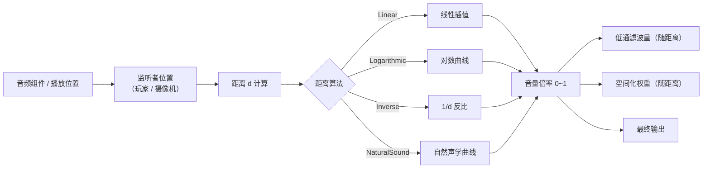
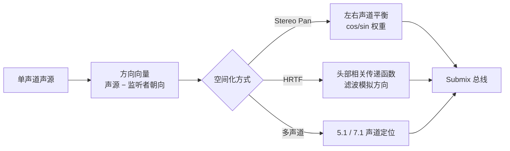
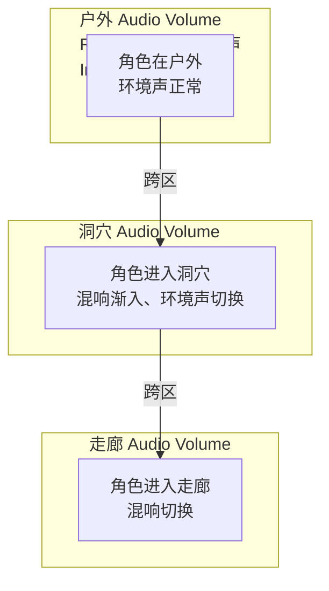
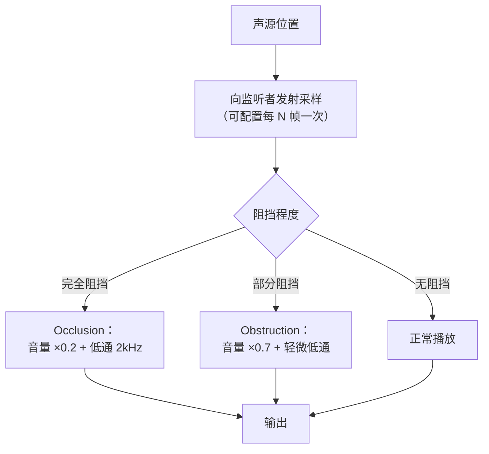

# 02 衰减与 3D 空间音效

> 所属系列：10-音频系统（UE 客户端）
> 版本基准：UE 5.8.0（本机 `Engine/Build/Build.version`：CL 55116800，分支 `++UE5+Release-5.8`）。
> 源码依据：`C:\Program Files\Epic Games\UE_5.8\Engine\Source\Runtime\Engine\Classes\Sound`、`Engine\Source\Runtime\AudioMixer`。
> 适用范围：衰减、空间化、遮挡、传播和环境音的运行时使用。
> 兼容性边界：UE 4.27 仅作为历史兼容性/迁移对照，当前行为以 UE 5.8 为准。
> 前置知识：已完成第 01 篇（播放方式、音量混音）
> 最后更新：2026-08-05（统一 UE5.8 版本基线）。
> 官方参考：[Unreal Engine UE5.8 官方文档总页](https://dev.epicgames.com/documentation/en-us/unreal-engine)。

---

## 一、概述

第 01 篇解决了"怎么把声音放出来"，本篇解决"怎么让声音**长在场景里**"：

- **衰减（Attenuation）**：声音随距离变轻、变闷；
- **空间化（Spatialization）**：声音有方向、有"左右前后"；
- **混响与反射（Reverb / Reflection）**：声音有"环境感"（洞穴、走廊、户外）；
- **遮挡与传播（Occlusion / Propagation）**：隔墙声音变闷、绕墙角声音变弱；
- **环境音与区域音效（Ambient / Zone）**：把声音"铺"进整个区域。

UE 的 3D 音频核心资产是 **USoundAttenuation**（衰减 + 空间化参数集合），配套机制有 Audio Volume（区域混响 / 遮挡参数）、Ambient Sound（环境声 Actor）。声音最终的空间感 = 衰减 × 空间化 × 混响 × 遮挡 的叠加结果。

学完本文，你应该能：为不同尺寸的声源配置正确的衰减曲线；理解 Stereo Pan 与 HRTF 的区别并知道何时启用；用 Audio Volume 搭建"洞穴 / 走廊 / 户外"的区域混响；开启并调优遮挡效果；用 Ambient Sound 铺场景氛围。

---

## 二、核心概念（表格）

| 概念 | 类别 | 一句话作用 | 关键点 |
| ---- | ---- | ---- | ---- |
| USoundAttenuation | 资产 | 衰减 + 空间化的参数集合 | 可复用、可在播放时覆盖 |
| FSoundAttenuationSettings | 结构体 | 衰减参数的具体数据 | 距离算法、曲线、滤波、空间化 |
| Falloff Distance | 参数 | 衰减的起止距离 | Min 内全量，Max 外静音 |
| Distance Algorithm | 枚举 | 衰减曲线的数学形态 | Linear / Log / LogReverse / Inverse / NaturalSound |
| Spatialization | 功能 | 让声音有方向感 | 只对单声道素材有效 |
| Stereo Pan | 空间化方式 | 按角度做左右声道平衡 | 简单、开销低 |
| HRTF | 空间化方式 | 头部相关传递函数模拟方向 | 更真实，需插件支持 |
| Spatialization Plugin | 插件 | 第三方空间化（Oculus / Steam Audio） | 平台差异大 |
| Audio Volume | Actor（体积） | 区域混响 / 遮挡参数覆盖 | Interior / Exterior 区分室内外 |
| Reverb Settings | 参数 | 混响的类型与湿干比 | 房间大小、衰减、密度 |
| Occlusion | 功能 | 几何体完全遮挡 | 音量衰减 + 低通滤波 |
| Obstruction | 功能 | 几何体部分遮挡 | 轻量、开销小 |
| Propagation | 功能 | 声音穿透 / 衍射传播 | 一般靠中间件实现 |
| AmbientSound | Actor | 循环播放环境声 | 常配音频组件 + 区域触发 |

（表 1：02 篇核心概念速览）

---

## 三、原理详解

### 3.1 衰减：距离与曲线

#### 3.1.1 衰减计算流程



（图 1：衰减与附加效果的计算流程）

#### 3.1.2 距离算法对比

FSoundAttenuationSettings 的 `DistanceAlgorithm` 可选：

| 算法 | 曲线形态 | 听感特点 | 适用场景 |
| ---- | ---- | ---- | ---- |
| Linear | 直线 | 简单直接，远近变化均匀 | 快速原型、小型声源 |
| Logarithmic | 对数（先快后慢） | 近处衰减快、远处平缓，接近人耳感知 | 大多数场景的默认选择 |
| LogReverse | 反向对数（先慢后快） | 近处几乎不变、远处骤降 | 大范围声源、BGM 型环境声 |
| Inverse | 反比 1/d | 物理点声源近似 | 拟真需求 |
| NaturalSound | 自然声学曲线 | 综合模拟真实声场 | 高保真场景 |

曲线形态示意（对数 vs 线性）：

```text
音量
1.0 ┤  ╭────── Linear（线性）
    │ ╭╯
    │╭╯
    │╯
    ├────────────────────────────── Log（对数：近快远缓）
    │
0.0 ┼──────────────────────────────► 距离
    0          Min             Max
```

#### 3.1.3 Falloff Distance 与曲线编辑器

- **Min Distance**：小于该距离，音量恒为 1.0（防止声源贴脸时音量爆表）。
- **Max Distance**：大于该距离，音量恒为 0.0；此时若开启虚拟化，声音会被"虚拟化"（停止混音、保留逻辑，回来时恢复），见第 03 篇性能章节。
- 在 USoundAttenuation 资产中可以用 **曲线编辑器** 自定义 Volume / Pitch / LowPass 随距离的曲线，覆盖算法默认形态。

> 设计经验：开火、爆炸这类"冲击型"音效衰减要快（Log，Max 30~80m）；环境声、BGM 型声音衰减要慢（LogReverse，Max 数百米甚至无穷）；语音对话衰减居中（Max 15~30m）。

#### 3.1.4 随距离的附加效果

UE 允许把衰减与更多效果绑定：

- **LowPass Filter**：距离越远越"闷"，模拟空气吸收；
- **Pitch**：距离衰减可轻微拉低音高（模拟多普勒以外的远距离感，谨慎使用）；
- **Spatialization Weight**：远处声音可以"退化成 2D"（降低定位感），减少定位压力；
- **Air Absorption**（UE5）：按距离与湿度衰减高频，提高拟真度。

### 3.2 空间化：让声音有方向

#### 3.2.1 空间化管线



（图 2：3D 空间化处理管线）

#### 3.2.2 Stereo Pan

- 原理：把单声道信号按声源相对监听者的水平角，分配到左右声道（`左 = cos(θ)`、`右 = sin(θ)` 之类的权重）。
- 特点：开销极低，任何平台都能跑；但**没有前后与上下感**（前后只能靠音量差异暗示）。
- 适用：绝大多数游戏音效（枪声、脚步、机关），是默认方案。

#### 3.2.3 HRTF（头部相关传递函数）

- 原理：用一组与方向相关的滤波器（来自真人头部测量的传递函数）模拟"声音从某个方向进入双耳"的频谱变化，从而产生前后、上下的定位感。
- 特点：定位更真实，尤其对**耳机用户**；CPU 开销更高；需要平台 / 插件支持。
- UE 中 HRTF 通常通过**空间化插件**接入：Oculus Audio（Meta Quest）、Steam Audio（Valve）、Windows Sonic / Dolby Atmos（Xbox / PC 空间音频）。
- 何时用：以耳机为主要输出设备的游戏（FPS、VR）强烈建议；外放为主的休闲游戏收益有限。

#### 3.2.4 空间化相关的关键设置

| 设置 | 位置 | 作用 |
| ---- | ---- | ---- |
| Spatialization Method | Attenuation 资产 | Pan / HRTF / 插件选择 |
| Spatialization（开关） | Attenuation 资产 | 是否空间化（立体声素材可关闭） |
| Stereo Panning | Attenuation 资产 | 多声道 / 立体声素材的环绕定位 |
| Non-Spatialized Radius | Attenuation 资产 | 声源离监听者过近时退化为 2D，避免"头内声像" |
| Volume / Pitch 衰减 | Attenuation 资产 | 见 3.1 |

### 3.3 混响与反射：Audio Volume

#### 3.3.1 Audio Volume 是什么

**Audio Volume** 是一个可在关卡中放置的体积 Actor，用来在**区域内**覆盖音频行为：

- **Reverb Settings**：区域混响类型与参数（房间大小、衰减时间、密度）；
- **Interior / Exterior**：声明区域是室内还是室外（影响遮挡采样与混响强度）；
- **Occlusion / Reverb 参数覆盖**：可以覆盖区域内声源的遮挡强度。



（图 3：多 Audio Volume 的区域混响布局）

#### 3.3.2 混响参数

UE 的 Reverb Settings 主要参数（对应经典 Schroeder 混响模型）：

| 参数 | 含义 | 调节直觉 |
| ---- | ---- | ---- |
| Reverb Intensity | 混响强度（湿干比） | 0 无混响，1 全湿 |
| Reverb Delay | 早期反射延迟 | 越大空间感越"空" |
| Reverb Gain | 混响尾音增益 | 尾音长短 |
| Decay Time | 衰减时间 | 越大越"空旷" |
| Density | 反射密度 | 越大越"紧密" |
| HF Damping | 高频衰减 | 越大越"闷" |

#### 3.3.3 混响如何生效（前置条件）

混响不是默认就有的：它需要混响效果器出现在音频链路中。UE 中两种常见路径：

1. **默认混响**：UE 内置的默认 Submix 链含混响节点时，Audio Volume 的 Reverb Settings 自动驱动它（适合快速原型）；
2. **自定义 Submix**：在项目里搭好 Reverb Submix（见第 03 篇），再把 Audio Volume 的混响参数接入。

> 注意：**Dry（直达声）+ Wet（混响声）的比例**是混响听感的关键。Audio Volume 负责"告诉混响器空间长什么样"，实际的混响 DSP 由 Submix 效果链提供。

### 3.4 遮挡与传播

#### 3.4.1 Occlusion 与 Obstruction 的区别

| 术语 | 含义 | 表现 | 开销 |
| ---- | ---- | ---- | ---- |
| Occlusion | 完全遮挡（如隔墙） | 音量大幅下降 + 低通变闷 | 高（要采样几何体） |
| Obstruction | 部分遮挡（如墙角） | 轻微音量 / 频谱变化 | 低 |

UE 的遮挡通过向监听者方向做**几何采样**（球体追踪 / 射线）判断阻挡：



（图 4：遮挡判定流程示意；具体数值取决于你的 Attenuation / Occlusion 设置）

关键设置：

- **Occlusion Trace Channel**：指定用哪个碰撞通道做采样；
- **Occlusion Sampling Interval**：每帧采样很贵，通常每 0.1~0.3 秒采一次；
- **Occlusion Low Pass Filter**：遮挡时低通频率（越小越闷）；
- **Occlusion Volume Attenuation**：遮挡时音量倍率；
- **bUseComplexCollisionForOcclusion**：是否用复杂碰撞（精确但更贵）。

#### 3.4.2 传播（Propagation）

真实世界中声音会绕过障碍物（衍射）并沿路径传播，单纯"音量 + 低通"的遮挡不够真实。高级传播需要中间件：

- **Steam Audio**（Valve 免费插件）：提供基于声学模拟的传播、衍射、反射；
- **Wwise / FMOD**：自带 Obstruction / Occlusion 曲线，可配合自建传播模型；
- UE 原生：UE5 的部分平台支持内置空间音频，但完整的传播模拟仍建议中间件。

### 3.5 环境音与区域音效

#### 3.5.1 AmbientSound

**AmbientSound** 是一个自带音频组件、默认循环播放的 Actor，用于放置环境声（鸟叫、流水、风声）：

- 单点环境音：放置多个小半径 AmbientSound，衰减 Max 设 20~40m；
- 大区域环境音：把衰减 Max 调大（LogReverse），或把声源挂在区域中心 + 大半径；
- 触发式环境音：不勾选自动播放，用蓝图在玩家进入区域时 `Play()`。

#### 3.5.2 区域音效的组合套路

一个完整的"森林区域"音频方案示例：

1. **基底氛围**：2~3 个 AmbientSound（鸟、风、树叶）覆盖整个区域，LogReverse 大半径衰减；
2. **局部点缀**：随机触发的一次性音效（树枝断裂、动物叫声），用触发器 + Random Delay；
3. **区域混响**：一个 Audio Volume 包住区域，Interior = false，Reverb 强度低；
4. **过渡**：区域边界放 Trigger Volume，用 Sound Mix 淡入淡出两套环境声（见 01 篇 3.4）。

---

## 四、代码 / 蓝图示例

### 4.1 C++ 示例

#### 示例 1：运行时创建衰减资产

```cpp
#include "Sound/SoundAttenuation.h"

USoundAttenuation* CreateAttenuation(UObject* Outer)
{
    USoundAttenuation* Att = NewObject<USoundAttenuation>(Outer);
    FSoundAttenuationSettings& S = Att->Attenuation;

    S.bAttenuate = true;                  // 启用距离衰减
    S.FalloffDistance.MinDistance = 300.f; // 3 米内全量
    S.FalloffDistance.MaxDistance = 5000.f; // 50 米外静音
    S.DistanceAlgorithm = EAttenuationDistanceModel::Logarithmic;
    S.bSpatialize = true;                 // 启用空间化
    S.SpatializationAlgorithm = ESoundSpatializationAlgorithm::SPATIALIZATION_Default;
    S.bEnableLowPassFilter = true;        // 随距离低通
    S.LowPassFilterFrequency = 4000.0f;   // 距离最大时的截止频率
    S.bEnableOcclusion = true;            // 启用遮挡
    S.OcclusionFilterFrequency = 2000.0f;
    S.OcclusionVolumeAttenuation = 0.2f;
    return Att;
}
```

#### 示例 2：播放时覆盖衰减

```cpp
// 用临时衰减参数播放，不建资产
UGameplayStatics::PlaySoundAtLocation(
    this, FireSound, Location, FRotator::ZeroRotator,
    1.0f, 1.0f, 0.0f, MyAttenuationAsset);
```

#### 示例 3：运行时切换 AudioComponent 的衰减

```cpp
UAudioComponent* AC = UGameplayStatics::SpawnSoundAtLocation(
    this, LoopSound, Location, FRotator::ZeroRotator);

// 进入洞穴后切换衰减（更短、更闷）
if (AC)
{
    AC->AttenuationOverrides = CaveAttenuation->Attenuation;
    AC->bOverrideAttenuation = true;
}
```

> 注：`AttenuationOverrides` + `bOverrideAttenuation` 是 UAudioComponent 上覆盖衰减的常用字段；也可以在 SetSound 之前直接在资产上引用衰减。

### 4.2 蓝图示例

#### 示例 A：创建并使用衰减资产

1. Content Browser → 右键 → Audio → **Sound Attenuation**，命名 `A_Weapon_Medium`；
2. Details：Falloff Distance Min = 300、Max = 6000；Distance Algorithm = Logarithmic；
3. 勾选 Spatialization（Method 默认 Pan）；
4. 在枪械的 SoundCue / SoundWave 资产 Details → Attenuation 里引用它（或播放时传入）。

#### 示例 B：搭建区域混响（Audio Volume）

1. Place Actors 面板搜索 **Audio Volume**，拖进洞穴区域，缩放覆盖洞穴空间；
2. Details → Reverb Settings：Reverb Intensity 0.8、Decay Time 2.5s、HF Damping 0.4；
3. 勾选 **Interior Volume** = true（室内）；
4. 在 Project Settings 或默认 Submix 中确保有 Reverb 效果器（见 03 篇）；
5. 进入洞穴测试：声音应明显"空旷"起来。

#### 示例 C：遮挡（Occlusion）配置

1. 在 `A_Weapon_Medium` 的 Details 中勾选 **Enable Occlusion**；
2. Occlusion Trace Channel 选 `Visibility`（或项目自定义通道）；
3. Occlusion Sampling Interval = 0.15s；
4. Occlusion Volume Attenuation = 0.15，Occlusion Filter Frequency = 1500Hz；
5. 游戏里站到墙后听枪声：应又轻又闷；从墙后出来恢复。

#### 示例 D：环境音铺设

1. Place Actors 搜索 **AmbientSound**，放到森林中心；
2. 把它的音频组件 Sound 设为 `W_ForestWind`（Looping）；
3. 在其上引用 `A_Ambient_Large`（LogReverse、Max 500m）；
4. 复制 2~3 个，分别放鸟叫、水流，错开位置与音量。

---

## 五、最佳实践

1. **按声源类型建衰减模板**：`A_Weapon_Medium`、`A_Voice_Near`、`A_Ambient_Large`、`A_Explosion_Big`，全项目复用，避免每个资产手调。
2. **距离参数按玩法定**：PVP 竞技类可听声辨位是核心，衰减 Max 要覆盖交战距离；休闲类可以短一些省性能。
3. **3D 音效必须单声道**：立体声素材空间化效果差且更耗 CPU；音乐与 UI 走 2D。
4. **遮挡采样间隔别太低**：每帧采样几何体是性能杀手，0.1~0.3s 一次足够。
5. **Audio Volume 要包住场景**：宁可多个小体积叠加，也别一个巨大体积误伤相邻区域；体积之间用优先级（Priority）控制嵌套时的权重。
6. **室内外标记要准确**：Interior / Exterior 影响遮挡与混响行为，洞穴、建筑内部务必标记 Interior。
7. **耳机为主打 HRTF**：FPS / VR 项目接 HRTF 插件（Oculus / Steam Audio）；外放为主的项目用 Pan 即可。
8. **混响宁缺毋滥**：混响过量会让音频"糊"；Wet 控制在 -6dB 以下起步，逐步加。
9. **环境音要"三层"**：基底氛围 + 局部点缀 + 区域过渡，比单个大循环声自然得多。
10. **关卡提交检查**：用 Audio Volume 的调试可视化（选中时显示体积）检查覆盖范围；用 `Stat Audio` 观察并发数。
11. **多普勒效应**：高速载具场景可开启 Doppler（Attenuation 资产），但要注意移动端 CPU 开销。
12. **区域切换用 Sound Mix 淡入淡出**：环境音硬切会非常出戏，见 01 篇的 Mix 用法。

---

## 六、常见问题 FAQ

**Q1：距离稍远就完全听不到？**
检查 Max Distance 是否过小、算法是否选了 Linear 且 Min 很大；音频调试时把监听者移到声源旁边确认基础音量正常。

**Q2：声音忽大忽小、没有稳定距离感？**
① 衰减曲线抖动——自定义曲线关键点太少；② 遮挡采样开启但几何体反复横跳；③ 多普勒开启且物体快速运动。

**Q3：空间化没效果，声音像"贴在耳朵上"？**
① 素材是立体声——换成单声道；② Spatialization 未勾选；③ Non-Spatialized Radius 太大，近距离退化为 2D。

**Q4：HRTF 勾了没反应？**
HRTF 需要空间化插件（Oculus / Steam Audio）且平台支持；纯 Pan 模式下 HRTF 选项无效。确认插件已启用、目标平台支持。

**Q5：Audio Volume 放好了但没有混响？**
① 混响效果器没接入 Submix（见 03 篇）；② Reverb Intensity 为 0；③ 玩家不在体积内（检查重叠与体积缩放）；④ 默认混响被自定义 Submix 覆盖。

**Q6：隔墙声音一点都不闷？**
① Occlusion 未勾选或采样通道不对（声源与墙不在同一碰撞通道）；② Occlusion Filter Frequency 设太高；③ 采样间隔太大导致响应慢。

**Q7：遮挡采样很卡？**
降低采样频率（0.2~0.3s）、用 Visibility 简单通道、不要开 Complex Collision；大量声源时只对重要声源开遮挡。

**Q8：环境音在不同区域重叠很乱？**
用 Sound Mix + Trigger 做区域淡入淡出；环境音 Sound Class 单独建分支便于统一控制；衰减 Max 与区域大小匹配。

**Q9：多普勒音高变化太夸张？**
Doppler 强度（Doppler Intensity）调低到 0.5~1.0；速度过快物体关闭多普勒。

**Q10：玩家转头声音方向不对？**
检查监听器（Audio Listener）是否挂在正确的组件上（通常是玩家控制器 / 摄像机）；第三人称游戏注意监听器位置与朝向同步。

**Q11：移动端空间化开销大？**
移动端默认用 Stereo Pan 即可；关闭 HRTF、降低遮挡采样频率、减少同时空间化的声源数（靠并发限制）。

**Q12：洞穴里枪声应该"又闷又长"，现在只有长？**
混响太长而高频没压：调低 Reverb 的 HF Damping 会让高频更快衰减；同时配合 Occlusion 低通，才能得到"闷"。

---

## 七、关联阅读

- 上一篇：[01-音频基础与播放.md](./01-音频基础与播放.md)：播放方式、Sound Class / Sound Mix 混音。
- 下一篇：[03-MetaSound与程序化音频.md](./03-MetaSound与程序化音频.md)：Submix 混响 / EQ 效果链是 Audio Volume 混响生效的基础；MetaSound 可做程序化环境音。
- 分类导航：[README.md](./README.md)
- 官方文档：Unreal Engine 文档 → Audio：Sound Attenuation、Audio Volume、Ambient Sound、Spatialization。
- 相关：物理系统（遮挡采样与碰撞）、Gameplay（AI 听觉感知范围与衰减联动）。
