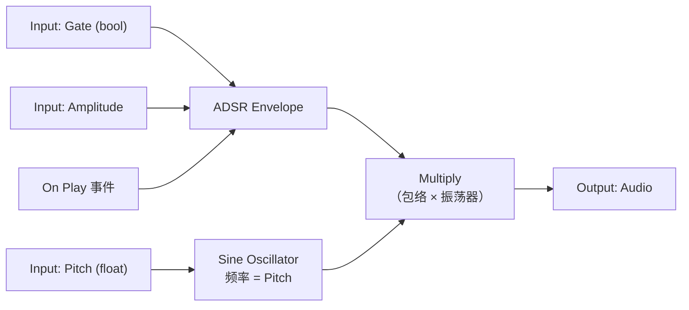
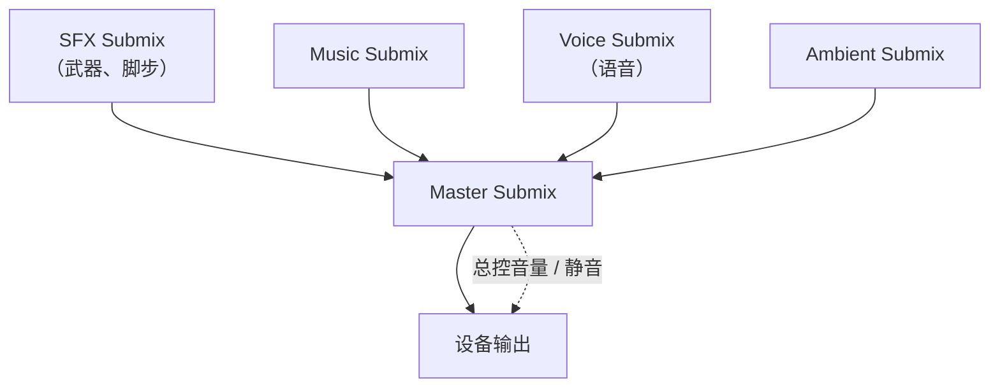
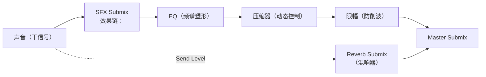
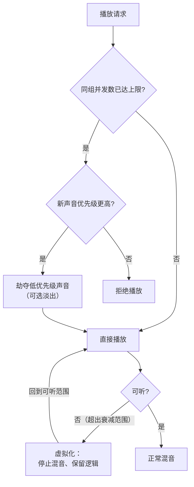

# 03 MetaSound 与程序化音频

> 所属系列：10-音频系统（UE 客户端）
> 版本基准：UE 5.8.0（本机 `Engine/Build/Build.version`：CL 55116800，分支 `++UE5+Release-5.8`）。
> 源码依据：`C:\Program Files\Epic Games\UE_5.8\Engine\Plugins\Runtime\Metasound`、`Engine\Plugins\Runtime\AudioModulation`。
> 适用范围：MetaSound、Submix/DSP、Audio Modulation 和程序化音频；编辑器节点细节需以本机插件为准。
> 兼容性边界：UE 4.27 不提供本文全部 MetaSound 能力，仅作为历史对照，不作为当前基准。
> 前置知识：第 01、02 篇；蓝图 / C++ 基础
> 最后更新：2026-08-05（统一 UE5.8 版本基线）。

---

## 一、概述

前两篇讲的是"播放现成录音"。本篇讲"**合成与加工声音**"：

- **MetaSound**：用节点图实时"算"出声音（程序化音频），并暴露参数给蓝图 / C++ 驱动；
- **Sound Submix 与 DSP**：把音频路由进效果链（EQ、压缩、混响、延迟），搭建专业混音总线；
- **Audio Modulation（音频调制）**：用 LFO / 包络等自动调制音量、音高、滤波（UE5 特性）；
- **中间件集成**：Wwise / FMOD 与 UE 音频系统的关系与取舍；
- **音频性能优化**：并发数、虚拟化、内存、CPU 预算与调试工具。

学完本文，你应该能：创建一个带参数的 MetaSound 并用游戏逻辑驱动它；搭出一条 EQ → 压缩 → 混响的 Submix 链并给不同声音分组；理解 Wwise 集成时 UE 侧该做什么；并会用并发 / 虚拟化 / 流送等手段把音频性能控制在预算内。

---

## 二、核心概念（表格）

| 概念 | 类别 | 一句话作用 | 关键点 |
| ---- | ---- | ---- | ---- |
| MetaSound | 资产 | 节点图形式的音频"程序" | UE5.0+，节点驱动 DSP |
| MetaSound Source | 资产 | 可像 SoundWave 一样播放的 MetaSound | 5.8 仍为 `UMetaSoundSource`（无更名） |
| MetaSound Patch | 资产 | 可复用的子图（参数化模块） | 5.8 仍为 `UMetaSoundPatch`（无更名） |
| Input / Output 节点 | 节点 | 暴露参数 / 输出音频 | 蓝图可驱动 |
| ADSR Envelope | 节点 | 音量包络（起音/衰减/保持/释放） | 合成器基础 |
| Oscillator | 节点 | 振荡器（正弦/锯齿/方波/噪声） | 程序化音源 |
| Midi To Frequency | 节点 | MIDI 音符转频率 | 音乐系统 |
| USoundSubmix | 资产 | 混音总线节点 | 可嵌套、可挂效果器 |
| Submix Effect | 效果器 | DSP 效果（EQ/压缩/混响/延迟） | 挂到 Submix 的效果链 |
| Master Submix | 资产 | 最终输出总线 | 所有声音汇入 |
| Send Level | 参数 | 发送到某 Submix 的干/湿比例 | 空间混响的常用做法 |
| Audio Modulation | 系统 | 参数调制（LFO/包络/随机） | UE5 特性，替代部分蓝图每帧驱动 |
| USoundConcurrency | 资产 | 并发 / 虚拟化策略 | 性能关键 |
| Virtualization | 功能 | 听不见的声音"挂起" | 省 CPU 的关键机制 |
| Wwise / FMOD | 中间件 | 第三方音频引擎 | 通过插件集成，替换 UE 音频 |

（表 1：03 篇核心概念速览）

---

## 三、原理详解

### 3.1 MetaSound：节点图与参数化

#### 3.1.1 什么是 MetaSound

MetaSound 是 UE5 引入的**音频节点图系统**：声音不是录音，而是由节点网络实时计算出来的。节点包括振荡器、噪声、包络、滤波器、数学运算、逻辑判断、时钟等，数据流在音频渲染线程上逐块（Block）执行。

两种资产形态：

| 形态 | 作用 | 5.8 类名 | 类比 |
| ---- | ---- | ---- | ---- |
| MetaSound Source | 可直接播放的"完整声音" | `UMetaSoundSource` | 类似 SoundWave |
| MetaSound Patch | 可复用的参数化子图 | `UMetaSoundPatch` | 类似 SoundCue / 函数 |

> 版本提示：5.8 中资产类名仍为 `UMetaSoundSource`（Source）与 `UMetaSoundPatch`（Patch），并未更名（"UE5.5 更名 OneShot/Graph"的说法与 5.8 源码不符）。下文统称 MetaSound。

#### 3.1.2 一个最小的合成器节点图



（图 1：简单合成器 MetaSound 节点图示意）

#### 3.1.3 参数化：把节点暴露成 Input

- 在 MetaSound 编辑器中把任意节点的属性 **Promote to Input**，就能成为资产的外部输入；
- 输入类型：Float、Bool、Int、String、Enum、Trigger（触发型）等；
- 播放时由蓝图 / C++ 提供参数值 → 实现"同一资产、不同声音"（技能等级越高音调越高、血量越低音效越抖等）。

常用节点族（UE5 官方节点目录）：

| 节点族 | 例子 | 用途 |
| ---- | ---- | ---- |
| Sources | Sine / Sawtooth / Square / Noise | 基础声源 |
| Envelopes | ADSR、AHDSR | 音量包络 |
| Filters | OnePole、State Variable Filter | 频谱塑形 |
| Delays | Delay、Echo、Flanger | 时间类效果 |
| Math / Logic | Add、Multiply、If、Select | 信号运算 |
| Conversions | Midi To Frequency、Lin To Exp | 单位换算 |
| Sequencers / Clocks | Trigger Sequencer、Clock | 节奏与事件 |

#### 3.1.4 播放与参数驱动

MetaSound 资产本质上仍是 USoundBase（UMetaSoundSource），所以：

- 蓝图：**Play Sound 2D / at Location** 直接播放；
- 参数：通过返回的 AudioComponent 的 **Set Float Parameter / Set Trigger Parameter** 等按名字驱动（`UAudioComponent::SetFloatParameter` 等）；
- C++：同上，函数在 UAudioComponent 上。

### 3.2 程序化音频生成（合成器简述）

程序化音频 = 用算法实时生成波形，而非播放录音。适用场景：

- **无限变化的音效**：脚步（每步随机细节）、引擎转速、武器充能（参数连续变化）；
- **动态音乐**：根据战斗状态实时改变节奏 / 配器；
- **节省内存**：合成声音体积为零。

基础合成套路：

```text
振荡器（音色） → 包络（响度形状） → 滤波（频谱） → 增益 → 输出
```

常用数学：`频率 = MIDI 音符号 → 440 × 2^((n−69)/12)`；包络用 ADSR 四段线性 / 指数插值；噪声（白 / 粉）做风声、打击乐瞬态。

> 注意：程序化音频的"听感打磨"成本高，小团队建议"录音为主、合成点缀"；MetaSound 特别适合**参数连续变化**的声音（引擎、脚步、氛围）。

### 3.3 Sound Submix 与 DSP 效果链

#### 3.3.1 Submix 是什么

**Submix（混音子总线）**是音频路由节点：每个声音先进入自己归属的 Submix，Submix 可以嵌套，最终汇入 **Master Submix** 输出到设备。



（图 2：典型 Submix 路由结构）

#### 3.3.2 Submix 效果链（DSP）

每个 Submix 可以挂一串**效果器**（Submix Effect Chain），按顺序处理：



（图 3：Submix 效果链 + Send 混响）

| 效果器 | 作用 | 典型设置 |
| ---- | ---- | ---- |
| Submix EQ（参量均衡） | 修正频谱：去浑浊、提亮 | 低切 80Hz、中频 -2dB |
| Dynamics Processor（压缩器） | 压动态、提升响度感 | 阈值 -18dB、Ratio 3:1 |
| Submix Effect Reverb | 空间混响 | Decay 1.5s、Wet -6dB |
| Delay（延迟） | 回声 / 立体声加宽 | 反馈 30% |
| Limiter | 保护不削波 | 输出上限 -1dB |

关键概念：

- **干 / 湿比（Dry / Wet）**：直达声与效果声的比例，Send 混响时由 **Send Level** 控制；
- **Parent Submix**：嵌套路由，例如"所有 UI 音效 → UI Submix → Master"；
- **Solo / Mute**：调试利器，单独听某条总线；
- 声音归属：SoundWave / SoundCue / MetaSound 资产上可指定 `SoundSubmixObject`；组件也有 `SoundSubmixOverride`。

### 3.4 Audio Modulation 简述（UE5 特性）

Audio Modulation 让"参数随时间自动变化"不依赖每帧蓝图：

- **USoundModulationParameter**：声明可被调制的参数（音量、音高、低通频率等）；
- **USoundModulator**：调制源——LFO（正弦/方波/采样保持）、Envelope（包络）、Random（随机）；
- **应用方式**：在 SoundWave / SoundCue 的 Modulation 设置里挂上调制器，或通过 Audio Modulation 路由资产（`USoundModulationPatch`）做复杂混合。

典型用途：风的音量用 LFO 缓慢起伏；机关运转音高用随机调制制造不稳定感；不用写一行蓝图。

### 3.5 中间件集成简述（Wwise / FMOD）

UE 原生音频系统（含 MetaSound）已经很强，但大型项目常选择中间件：

| 对比项 | UE 原生 | Wwise / FMOD |
| ---- | ---- | ---- |
| 编辑工具 | 编辑器内节点图 | 独立软件（工程制） |
| 混音复杂度 | 中 | 高（Profiler、Bus、State 强大） |
| 平台适配 | 引擎维护 | 中间件厂商维护 |
| 程序化能力 | MetaSound 强 | 各有特色（Wwise 有 Wwise Synth） |
| 成本 | 免费 | 授权费 / 分成 |

Wwise 集成要点（UE 侧）：

1. 安装 Wwise UE 插件，用 Integration 工具生成 UAsset 桥接层；
2. 关卡放 `AkAudioEvent` 触发器，蓝图 `Post Ak Event`；
3. UE 的 Gameplay 逻辑照旧，声音资产全部在 Wwise Authoring 里管理；
4. 注意：接入中间件后，UE 原生 Sound / MetaSound 与 Wwise 事件是**两套并行体系**，别混用。

### 3.6 音频性能优化

#### 3.6.1 并发音效数与虚拟化



（图 4：并发限制与虚拟化流程）

- **USoundConcurrency**：同一组声音的最大并发数、劫夺规则（Steal Oldest / Newest / Quietest）、虚拟化模式（PlayWhenSilent / PlayWhenSilentNoVirtualize / Throttle / Pause 等）；
- **虚拟化（Virtualization）**：超出可听范围的声音不再参与混音，逻辑保留；回来时恢复——这是省 CPU 的最大头；
- **优先级（Priority）**：混音器按优先级决定谁先被劫夺；语音 > 战斗音效 > 环境音是常见排序。

#### 3.6.2 内存与流送

- 短音效：压缩后进内存（Asynchronous）；
- 长音乐 / 长语音：**Streaming**，几乎不占常驻内存；
- 全项目声音总数有上限：Project Settings → Audio → **Max Channels**（最大并发 Voice 数），过高会放大 CPU / 内存；
- Cook 前检查：`LogAudio` 或打包报告中的声音大小统计，砍掉用不到的音效。

#### 3.6.3 CPU 预算

| 开销来源 | 控制手段 |
| ---- | ---- |
| 解码 | 尽量 Ogg 压缩 + 流送；避免大量同步解压 |
| 空间化 | 单声道素材、Pan 优先；HRTF 只在必要平台开 |
| 遮挡采样 | 采样间隔 0.1~0.3s；只对重要声源开 |
| Submix 效果链 | 效果器数量 × 音频块数；混响慎开多个 |
| MetaSound | 节点数 × 每块执行次数；复杂合成控制并发数 |
| 采样率转换 | 全项目统一采样率 |

#### 3.6.4 调试工具

- **Stat Audio**：并发数、CPU 占用、活跃声源数；
- **Audio Debugger（AudioDebugger）**：可视化每条 Voice 的状态、音量、衰减、虚拟化；
- **LogAudio**：`LogAudio Verbose` 看播放 / 拒绝日志；
- **无声测试**：把 Master 静音后跑玩法，用调试器确认"该响的都响了"。

---

## 四、代码 / 蓝图示例

### 4.1 C++ 示例

#### 示例 1：播放 MetaSound 并驱动参数

```cpp
#include "Kismet/GameplayStatics.h"
#include "Audio/AudioComponent.h" // 或 Components/AudioComponent.h

// 头文件声明：
// UPROPERTY(EditDefaultsOnly) TObjectPtr<UMetaSoundSource> ChargeSound;

void AMyAbility::StartCharging()
{
    UAudioComponent* AC = UGameplayStatics::SpawnSound2D(this, ChargeSound);
    if (AC)
    {
        AC->SetFloatParameter(TEXT("ChargeAmount"), 0.0f); // 暴露的 Float 输入
        AC->SetTriggerParameter(TEXT("Start"));            // 暴露的 Trigger 输入
        ChargingAC = AC;
    }
}

void AMyAbility::TickCharge(float Normalized)
{
    if (ChargingAC.IsValid())
    {
        ChargingAC->SetFloatParameter(TEXT("ChargeAmount"), Normalized);
    }
}
```

#### 示例 2：动态创建 Submix 并挂 EQ

```cpp
#include "Sound/SoundSubmix.h"
#include "SubmixEffects/SubmixEffectEQ.h" // SubmixEffectSubmixEQ

USoundSubmix* CreateFxSubmix(UObject* Outer)
{
    USoundSubmix* Submix = NewObject<USoundSubmix>(Outer);
    Submix->RegisterWithAudioDevice(); // 注册到音频设备

    USubmixEffectSubmixEQPreset* EQPreset = NewObject<USubmixEffectSubmixEQPreset>(Outer);
    FSoundEffectSubmixEQSettings Settings;
    // 设置 EQ 频段（参数略）
    EQPreset->SetSettings(Settings);

    Submix->SubmixEffectChain.Add(EQPreset); // 效果链
    return Submix;
}
```

#### 示例 3：为声音指定 Submix

```cpp
// 让某个 SoundWave 走自定义 Submix
SoundWave->SoundSubmixObject = MyFxSubmix;
SoundWave->MarkPackageDirty();

// 或在音频组件上临时覆盖
AudioComponent->SoundSubmixOverride = MyFxSubmix;
```

### 4.2 蓝图示例

#### 示例 A：创建并播放 MetaSound

1. Content Browser → 右键 → Audio → **MetaSound Source**，命名 `MS_ChargeUp`；
2. 打开编辑器：拖入 Sine Oscillator、ADSR Envelope、Multiply、Output；
3. 把 Sine 的频率 Promote to Input（Float，名 `ChargeAmount`）；
4. 把 Envelope 的 Trigger 输入 Promote to Input（Trigger，名 `Start`）；
5. 保存后回到关卡蓝图：**Play Sound 2D** → Sound = MS_ChargeUp，返回 AudioComponent；
6. 对它调用 **Set Float Parameter**（Name = ChargeAmount，Value 随技能进度）；
7. 释放技能时 **Set Trigger Parameter**（Name = Start）触发包络。

#### 示例 B：搭 Submix 总线

1. Content Browser → 右键 → Audio → **Sound Submix**，创建 `S_Master`、`S_Music`、`S_SFX`、`S_Reverb`；
2. S_Music / S_SFX 的 Parent Submix = S_Master；
3. S_Master 挂 **Submix Effect Limiter**（输出 -1dB）；
4. S_SFX 挂 **Submix Effect Submix EQ** + **Dynamics Processor**；
5. 给武器 SoundCue 的 SoundSubmixObject 设为 S_SFX；
6. 音乐 SoundWave 设 S_Music；语音设 S_Voice——之后就能在总线上统一处理。

#### 示例 C：Send 混响

1. `S_Reverb` 上挂 **Submix Effect Reverb**（Decay 1.8s，Wet 大一点）；
2. 在 S_SFX 的 **Submix Send** 列表添加一项：Target = S_Reverb，Send Level = 0.25；
3. 于是所有走 S_SFX 的声音都带一点空间混响；调节 Send Level 即调湿声量。

#### 示例 D：并发与虚拟化配置

1. Content Browser → 右键 → Audio → **Sound Concurrency**，命名 `C_GunShots`；
2. Max Count = 6；Resolution Rules = Steal Newest（新声挤掉最老的）；
3. Virtualization Mode = PlayWhenSilent；
4. 在枪械 SoundCue 的 Concurrency 里引用它；
5. 用 **Stat Audio** 验证并发峰值被限制住。

---

## 五、最佳实践

1. **录音为主、MetaSound 点缀**：MetaSound 适合"参数连续变化"的声音；一次性音效用录音更省心。
2. **MetaSound 命名规范**：`MS_` 前缀；输入参数命名统一（Pitch / Volume / Gate / Start）。
3. **暴露输入克制**：只暴露真正会被驱动的参数，其余在资产内部固定，减少误用与每帧开销。
4. **Submix 分层**：Master / Music / SFX / Voice / Ambient 五条总线起步，效果器尽量挂在分支而非 Master。
5. **Send 混响优于全链混响**：需要空间感的声源走 Send，避免所有声音都吃混响 CPU。
6. **限幅器放最后**：Master 上挂 Limiter 防削波，动态控制交给前面的压缩器。
7. **并发策略先行**：每个高频音效组（枪、脚步）配置 Concurrency，配合虚拟化，是移动端不掉帧的前提。
8. **虚拟化模式按需**：PlayWhenSilent 适合大多数；需要"回来瞬间响应"的声音用 PlayWhenSilentNoVirtualize。
9. **优先级排序**：语音 > 关键玩法音效 > 环境音；被劫夺的声音要设计得"听感损失小"（环境音优先牺牲）。
10. **性能预算化**：定下"同时最多 N 个 Voice"并用 Stat Audio 抽查峰值；超了就缩衰减范围或合并声源。
11. **移动端简化**：关闭 HRTF、减少 MetaSound 并发、缩短遮挡采样、降低 Max Channels。
12. **中间件切换要早决策**：项目中期从原生切 Wwise / FMOD 成本极高，立项时就定。

---

## 六、常见问题 FAQ

**Q1：MetaSound 播出来是"滋滋"的底噪？**
① 振荡器频率超范围（0~Nyquist）；② 包络缺失导致点击声（加 Attack/Release）；③ 增益链数值过大（检查 Multiply 后增益）；④ Output 接了多个节点产生混叠。

**Q2：MetaSound 参数在蓝图里改了没反应？**
① 参数没 Promote to Input（或名字拼错）；② 用 Trigger 输入必须调用 Set Trigger Parameter；③ 该输入被资产内部常量覆盖；④ 播放的不是这个实例（检查引用）。

**Q3：Submix 效果器没生效？**
① 声音资产没指定该 Submix；② 效果器没 Enable（Preset 里未启用）；③ 效果链顺序问题（EQ 在混响前/后听感不同）；④ 该 Submix 没被任何声音使用。

**Q4：混响效果器挂上了但很干？**
检查 Send Level（0 则无湿声）与 Reverb 的 Wet/Dry 参数；Audio Volume 区域混响还需要 Reverb Submix 存在（见 02 篇 Q5）。

**Q5：声音一多就爆音 / 破音？**
Master 挂 Limiter；各总线压缩器阈值调低；检查单条总线增益链；降低 Max Channels 让引擎主动拒绝而不是削波。

**Q6：移动端一开打就卡？**
① 并发太多——加 Concurrency + 虚拟化；② 每帧驱动大量 MetaSound 参数——改为 Audio Modulation；③ 遮挡采样太密——加间隔；④ 采样率不统一导致重采样。

**Q7：虚拟化后声音回来有"跳变"？**
虚拟化切换会瞬时改变混音状态，声音短暂"啪"一下；用 Fade 处理虚拟化恢复，或对关键声音关闭虚拟化。

**Q8：Wwise 和 UE 原生声音混在一起乱？**
两套体系并存时做好分工：如 UI / 过场用 Wwise，玩法音效用 UE 原生（或反之），避免同一个声音两处触发。

**Q9：MetaSound 在 Cook 后行为不一样？**
① 检查是否用了非实时节点（如录音回放）；② 参数默认值在 Cook 后取资产默认；③ 确认编辑器与 Cook 的采样率设置一致。

**Q10：Stat Audio 显示大量 Voice 但耳朵里没声？**
大概率被虚拟化（无声是正常的）；确认虚拟化阈值与衰减 Max 匹配，别让"本该听见"的声音被虚拟化。

**Q11：Submix 的 EQ 调了半天听不出区别？**
先 Solo 该 Submix 确认信号确实经过它；EQ 频段 Q 值太大或增益太小；用频谱视图（Audio Debugger / 外部工具）对照。

**Q12：想给"全局音乐"加侧链闪避（Ducking）？**
用 Sound Mix 的 SoundClassAdjuster（01 篇）做"事件型"闪避；更细的侧链压缩需要 DSP 编程或中间件。

---

## 七、关联阅读

- 上一篇：[02-衰减与3D空间音效.md](./02-衰减与3D空间音效.md)：Audio Volume 混响依赖本篇的 Reverb Submix；遮挡与空间化是性能优化的对象。
- 第 01 篇：[01-音频基础与播放.md](./01-音频基础与播放.md)：播放方式与 Sound Mix 混音。
- 分类导航：[README.md](./README.md)
- 官方文档：Unreal Engine 文档 → Audio：MetaSound、Sound Submix、Submix Effects、Audio Modulation、Sound Concurrency。
- 相关：Gameplay（技能参数驱动 MetaSound）、性能（Stat Audio / 优化）、美术（音频资产规范）。
