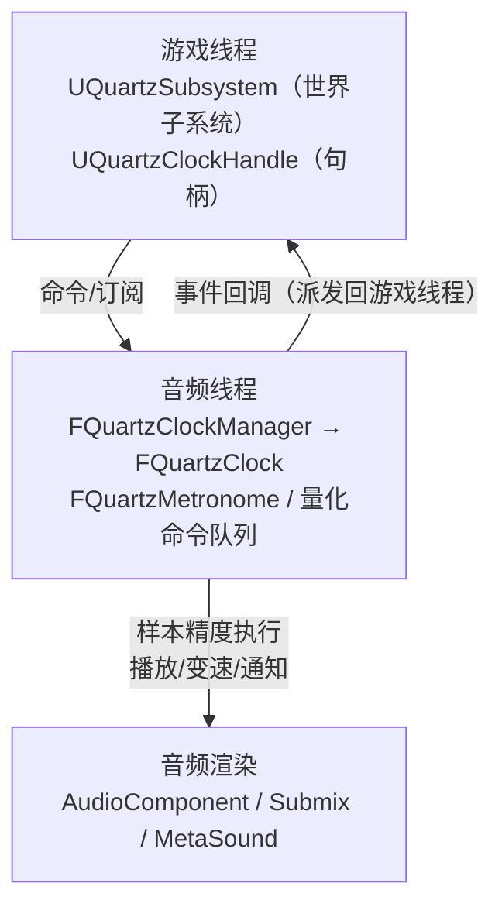
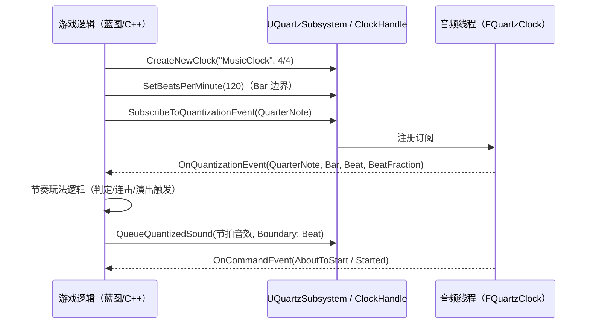

# 04 Quartz 音频时钟与节奏同步

> 版本基准：UE 5.8.0（本机 `Engine/Build/Build.version`：CL 55116800，分支 `++UE5+Release-5.8`）。
> 适用范围：UE 客户端 · 音频时钟（Quartz）/ 量化调度 / 节奏驱动玩法（音游、音乐演出、节拍同步）。
> 事实边界：本文"本机核对"项来自只读检索本机 `C:\Program Files\Epic Games\UE_5.8\Engine\Source\Runtime\AudioMixer\Public\Quartz\`（QuartzSubsystem.h、AudioMixerClockHandle.h、AudioMixerClock.h、AudioMixerClockManager.h、QuartzMetronome.h）与 `Source\Runtime\Engine\Classes\Sound\QuartzQuantizationUtilities.h`；枚举/字段/函数签名以目标版本为准，无法核对处标注"待核对"。
> 官方参考：[Quartz 官方文档](https://dev.epicgames.com/documentation/en-us/unreal-engine/quantized-audio-clock-and-transport-in-unreal-engine)、[Unreal Engine 文档首页](https://dev.epicgames.com/documentation/en-us/unreal-engine)。
> 最后更新：2026-08-07（初稿）。

## 概述

**Quartz** 是 UE 的"量化音频时钟"系统：在音频引擎内部维护**音乐时钟**（BPM、节拍、小节、Transport），并允许把声音播放、时钟变速、事件通知等操作**对齐到节拍边界（量化）**执行，实现**样本级精度（sample-accurate）**的节奏同步。它解决的是"普通 Play Sound 对不齐拍子"的问题——音游判定、音乐演出、BPM 变化的过场音乐都靠它。

本文覆盖（API 全部经本机 5.8 源码核对）：

- 架构：`UQuartzSubsystem`（世界子系统）与 `UQuartzClockHandle`（时钟句柄）双 UObject 层 + 音频线程 `FQuartzClock`/`FQuartzClockManager`/`FQuartzMetronome`；
- 核心概念：时钟、BPM、量化（Quantization）、量化边界（FQuartzQuantizationBoundary）、Transport 时间戳；
- 用法：创建时钟、订阅节拍事件、量化播放、变速/暂停/恢复、多时钟同步；
- 实战：音频驱动游戏逻辑、与 MetaSound 协作、延迟与性能注意。

**什么时候需要 Quartz**：任何"时间轴必须与音乐对齐"的需求——音游判定、节拍音效、音乐演出、BPM 变速、鼓点驱动的画面反馈。**什么时候不需要**：一次性音效（UI 点击、开枪）、循环环境声、无节奏要求的对白——这些用普通 `PlaySound`/`PlaySound2D` 即可，不要为它们引入时钟开销。

## 核心概念表

| 概念 | 英文 | 说明（本机 5.8 依据） |
| --- | --- | --- |
| 音频时钟 | Quartz Clock | 由 `UQuartzSubsystem` 管理的音乐时钟（名称唯一），内部在音频线程推进（`FQuartzClock`） |
| 时钟句柄 | Clock Handle | `UQuartzClockHandle`，蓝图/C++ 操作时钟的句柄对象（`CreateNewClock` 返回） |
| 拍/小节 | Beat / Bar | Transport 计数单位；`FQuartzTransportTimeStamp`（Bars/Beat/BeatFraction/Seconds） |
| BPM | Beats Per Minute | 每分钟节拍数；`SetBeatsPerMinute` / `GetBeatsPerMinute` |
| 量化 | Quantization | `EQuartzCommandQuantization`：Bar/Beat/音符（1/32..Whole、附点、三连音）/Tick/None |
| 量化边界 | Quantization Boundary | `FQuartzQuantizationBoundary`：Quantization + Multiplier + CountingReferencePoint + 若干开关 |
| Transport | Transport | 时钟的"播放头"：当前小节/拍/秒（`ResetTransport` 归零） |
| 量化命令 | Quantized Command | 在边界执行的命令：播放声音/变速/传输重置/启动其他时钟/通知（`EQuartzCommandType`） |
| 节拍事件 | Metronome Event | 订阅量化边界后的回调：`FOnQuartzMetronomeEventBP`（ClockName, QuantizationType, NumBars, Beat, BeatFraction） |

## 原理详解

### 1. 架构分层



- **游戏线程层**：`UQuartzSubsystem : UTickableWorldSubsystem`（`AudioMixer\Public\Quartz\QuartzSubsystem.h:46`，UCLASS DisplayName="Quartz"）负责创建/删除时钟；`UQuartzClockHandle : UObject, FQuartzTickableObject`（`AudioMixerClockHandle.h:27`，BlueprintType/Transient/ClassGroup=Quartz）承载具体操作；
- **音频线程层**：`Audio::FQuartzClockManager` 管理全部时钟，`FQuartzClock` 推进时间与命令队列，`FQuartzMetronome` 计算节拍；量化命令在音频回调中以样本精度触发，随后把事件派发回游戏线程；
- 两个线程通过"命令初始化数据 + 时钟代理（FQuartzClockProxy）"通信，游戏线程不直接触碰音频线程对象。

### 2. 创建时钟与生命周期

```cpp
// 蓝图/C++：创建时钟（签名已核对 QuartzSubsystem.h:95）
UQuartzClockHandle* Handle = UQuartzSubsystem::Get(WorldContextObject)
    ->CreateNewClock(WorldContextObject, TEXT("MusicClock"), FQuartzClockSettings(),
                     /*bOverrideSettingsIfClockExists*/ false,
                     /*bUseAudioEngineClockManager*/ true);
```

- `FQuartzClockSettings`（已核对 QuartzQuantizationUtilities.h:226）：`TimeSignature`（默认 4/4）+ `bIgnoreLevelChange`（关卡切换时是否保持时钟）；
- `FQuartzTimeSignature`：`NumBeats`（分子，默认 4）、`BeatType`（`EQuartzTimeSignatureQuantization`：/2 /4 /8 /16 /32，默认 QuarterNote）、`OptionalPulseOverride`（奇数拍号用 `FQuartzPulseOverrideStep` 逐拍覆盖，含 `NumberOfPulses` 与 `PulseDuration`）；
- 删除/查询：`DeleteClockByName`、`DeleteClockByHandle`（引用出参，删除后置空）、`DoesClockExist`；
- `IsQuartzEnabled()`（静态）查询系统可用性；`SetQuartzSubsystemTickableWhenPaused(bool)` 控制游戏暂停时时钟是否继续走（音游暂停菜单常用）。

### 3. 量化：把命令对齐到拍子

**量化单位（EQuartzCommandQuantization，已核对 QuartzQuantizationUtilities.h:45 全枚举）**：

| 类别 | 值 |
| --- | --- |
| 结构单位 | `Bar`（按拍号）、`Beat`（按拍号与 Pulse Override） |
| 常规音符 | `ThirtySecondNote`(1/32)、`SixteenthNote`、`EighthNote`、`QuarterNote`、`HalfNote`、`WholeNote` |
| 附点音符 | `DottedSixteenthNote`、`DottedEighthNote`、`DottedQuarterNote`、`DottedHalfNote`、`DottedWholeNote` |
| 三连音 | `SixteenthNoteTriplet`、`EighthNoteTriplet`、`QuarterNoteTriplet`、`HalfNoteTriplet` |
| 其他 | `Tick`（=1/32，最小粒度）、`Count`（隐藏计数）、`None`（尽快执行） |

**量化边界（FQuartzQuantizationBoundary，已核对 QuartzQuantizationUtilities.h:488）**：

- `Quantization`：目标单位（默认 `None`）；
- `Multiplier`：等几个单位后触发（默认 1.0）；
- `CountingReferencePoint`（`EQuarztQuantizationReference`）：`BarRelative`（从每小节起点算）、`TransportRelative`（从时钟启动算）、`CurrentTimeRelative`（从当前时刻算）；——注意：**引擎枚举名自带拼写 typo `EQuarztQuantizationReference`**（源码注释亦承认，用 DisplayName 掩盖），引用时以引擎实际名为准；
- `bFireOnClockStart`（时钟未启动时是否在启动瞬间触发，默认 true）、`bCancelCommandIfClockIsNotRunning`（时钟未运行是否取消命令，默认 false）、`bResetClockOnQueued` / `bResumeClockOnQueued`（入队时附带重置/恢复传输）。

### 4. 命令类型与事件委托

**命令类型（EQuartzCommandType，已核对）**：`PlaySound`（边界处样本级播放，立即占 voice slot）、`QueueSoundToPlay`（临近边界再取 voice，避免过早占用）、`RetriggerSound`（量化循环重触发）、`TickRateChange`（量化变速）、`TransportReset`（量化归零）、`StartOtherClock`（量化启动另一时钟，多时钟同步）、`Notify`（纯通知，取时间用）、`Custom`（自定义）。

**命令生命周期委托（EQuartzCommandDelegateSubType，已核对）**：`CommandOnFailedToQueue`（入队失败：时钟不存在/并发限制）、`CommandOnQueued`（已交给音频线程）、`CommandOnCanceled`（执行前被取消）、`CommandOnAboutToStart`（即将开始，与声音起始同步的最佳回调）、`CommandOnStarted`（音频线程上已执行）。

**节拍回调委托（已核对 QuartzQuantizationUtilities.h:218-222）**：

```cpp
DECLARE_DYNAMIC_MULTICAST_DELEGATE_FiveParams(FOnQuartzMetronomeEvent, FName, ClockName,
    EQuartzCommandQuantization, QuantizationType, int32, NumBars, int32, Beat, float, BeatFraction);
DECLARE_DYNAMIC_MULTICAST_DELEGATE_TwoParams(FOnQuartzCommandEvent, EQuartzCommandDelegateSubType, EventType, FName, Name);
// BP 版本为 FOnQuartzMetronomeEventBP / FOnQuartzCommandEventBP（单播动态委托）
```

### 5. 时钟控制与订阅 API（UQuartzClockHandle，行号均指 AudioMixerClockHandle.h）

| 分类 | 函数（已核对） |
| --- | --- |
| 启停 | `StopClock(WorldContextObject, bool CancelPendingEvents, UQuartzClockHandle*& ClockHandle)`(56)、`PauseClock`(59)、`ResumeClock`(62)、`IsClockRunning`(71) |
| 传输 | `ResetTransport`(65)、`ResetTransportQuantized`(68) |
| 变速 | `SetBeatsPerMinute(..., float BeatsPerMinute = 60.f)`(124)、`SetThirtySecondNotesPerMinute(..., float = 960.f)`(121)、`SetTicksPerSecond(..., float = 10.f)`(115)、`SetMillisecondsPerTick(..., float = 100.f)`(112)、`SetSecondsPerTick(..., float = 0.25f)`(118)、`GetBeatsPerMinute`(140)——均带量化边界，**变速本身可以对齐到拍子** |
| 时间 | `GetCurrentTimestamp`(87) → `FQuartzTransportTimeStamp`；`GetDurationOfQuantizationTypeInSeconds(..., float Multiplier = 1.0f)`(83) |
| 订阅 | `SubscribeToQuantizationEvent(WorldContextObject, EQuartzCommandQuantization, FOnQuartzMetronomeEventBP, UQuartzClockHandle*&)`(99)、`SubscribeToAllQuantizationEvents`(102)、`UnsubscribeFromTimeDivision`(105) |
| 通知 | `NotifyOnQuantizationBoundary(WorldContextObject, FQuartzQuantizationBoundary, FOnQuartzCommandEventBP, float InMsOffset = 0.f)`(74) |
| 播放 | `QueueQuantizedSound(WorldContextObject, UQuartzClockHandle*&, const FAudioComponentCommandInfo&, FOnQuartzCommandEventBP, FQuartzQuantizationBoundary)`(160) |
| 多时钟 | `StartOtherClock(WorldContextObject, FName OtherClockName, FQuartzQuantizationBoundary, FOnQuartzCommandEventBP)`(95) |

> 时间戳 `FQuartzTransportTimeStamp`（已核对）：`Bars`、`Beat`、`BeatFraction`（当前拍内小数进度）、`Seconds`（发生时刻秒数）；`IsZero()`/`Reset()`。

### 6. 音频驱动游戏逻辑（典型流程）



要点：**节奏事件在音频线程按样本精度计算、派发回游戏线程回调**，因此游戏逻辑拿到的 `BeatFraction` 是"这一拍的实际进度"，可直接用于判定窗口、鼓点闪光、镜头节拍震动等。

### 7. 与 MetaSound / Submix 协作及性能注意

- **MetaSound 协作**：Quartz 负责"何时"（时间轴），MetaSound 负责"何声"（合成）；可在节拍事件里改 MetaSound 参数；BPM 相关参数统一由 Quartz 时钟驱动，避免两套节拍器对不齐；
- **延迟与同步**：命令在音频线程按样本计数执行，天然抗游戏线程卡顿；但"游戏线程收到回调"仍有少量派发延迟，需要精确判定时用 `BeatFraction`/`Seconds` 而非回调到达时刻；`Audio::FQuartzClockTickRate`（已核对）提供 `SetFramesPerTick`/`SetMillisecondsPerTick`/`SetSecondsPerTick`/`SetThirtySecondNotesPerMinute`/`SetBeatsPerMinute`/`SetSampleRate` 与 `GetFramesPerDuration(...)` 换算工具；
- **性能**：时钟数量保持个位数（每时钟有节拍器与命令队列开销）；`SubscribeToAllQuantizationEvents` 只在调试时用；`LogAudioQuartz` 日志类别可观察时钟行为；移动端可用性以平台为准（标"待核对"）。

### 8. 时间签名与奇数拍号（Pulse Override）

- 默认 4/4：`FQuartzTimeSignature` 的 `NumBeats = 4`、`BeatType = EQuartzTimeSignatureQuantization::QuarterNote`（分母 /4）；
- 拍号分母：`EQuartzTimeSignatureQuantization` 提供 /2 /4 /8 /16 /32 五种（已核对）；
- **奇数拍号（7/8、5/4、11/16…）**：用 `OptionalPulseOverride` 数组逐拍覆盖默认等分——每个元素是 `FQuartzPulseOverrideStep`（`NumberOfPulses` 脉冲数 + `PulseDuration` 每个脉冲的时值，已核对）；
- 换算工具：`TimeSignatureQuantizationToCommandQuantization(const EQuartzTimeSignatureQuantization&)` 把拍号分母映射为量化单位（已核对声明）；
- 注意：`Bar` 边界的小节长度随拍号变化（Bar = NumBeats 拍），使用 `BarRelative` 边界前先确认拍号。

### 9. 延迟模型与样本精度说明

- **命令执行**：量化命令在音频线程按"帧/样本计数"触发，执行误差在样本级（约几十微秒量级，取决于采样率）；
- **回调派发**：事件从音频线程派发回游戏线程存在调度延迟（毫秒级）；引擎用延迟跟踪器统计趋势（已核对 `FQuartLatencyTracker`：`PushLatencyTrackerResult`/`GetLifetimeAverageLatency`/`GetMinLatency`/`GetMaxLatency`）；
- **结论**：判定/演出逻辑的"时间"一律取回调参数（`BeatFraction`/`Seconds`）或 `GetCurrentTimestamp`，不要用回调到达时刻。

### 10. 何时用 / 何时不用 Quartz（选择矩阵）

| 需求 | 方案 | 说明 |
| --- | --- | --- |
| 音游判定 | Quartz 订阅节拍 | `BeatFraction` 提供拍内进度，判定窗口可计算 |
| 节拍循环音效 | Quartz + RetriggerSound | 样本级重触发，无累积漂移 |
| BPM 变速（过场/关卡） | Quartz `SetBeatsPerMinute` | 变速本身可量化到小节线 |
| 多时钟（BGM + 音效轨） | Quartz `StartOtherClock` | 多时钟按边界对齐启动 |
| 一次性 UI 音效 | 普通 `PlaySound` | 无需时钟开销 |
| 循环环境声 | 普通播放 + `bLooping` | 不需要拍点对齐 |
| MetaSound 实时合成 | MetaSound 自带时钟/定时 | 无强节拍需求时更轻量 |
| 联机节奏同步 | 服务器时间基准 + 客户端 Quartz | Quartz 本身不跨端同步 |

## 验证命令与调试

- **日志**：`LogAudioQuartz`（已核对 `DECLARE_LOG_CATEGORY_EXTERN(LogAudioQuartz, Log, All)`）观察时钟创建/命令入队/执行日志；
- **控制台命令**：完整命令清单以本机版本为准（标"待核对"），不虚构命令名；
- **调试流程**：
  1. `CreateNewClock` 后 `GetCurrentTimestamp` 打印 Transport（应随节拍前进）；
  2. 订阅 `QuarterNote` 打印 `BeatFraction`，确认回调频率 = BPM/60；
  3. `SetBeatsPerMinute` + Bar 边界，观察变速是否发生在小节线；
  4. 若事件不触发，检查 `IsClockRunning` 与 `bCancelCommandIfClockIsNotRunning` 设置。

## 常见场景方案表

| 场景 | 推荐方案 |
| --- | --- |
| 音游判定 | 主时钟 + `SubscribeToQuantizationEvent(Beat/Tick)` + `BeatFraction` 判定窗口 |
| 音乐演出/过场 | MasterClock + `QueueQuantizedSound` + `StartOtherClock` 对齐多时钟 |
| BPM 变化 | `SetBeatsPerMinute` + Bar 边界（变速落在小节线） |
| 暂停菜单 | `PauseClock` + `SetQuartzSubsystemTickableWhenPaused` 决策 |
| 鼓点闪光/镜头震动 | `OnQuantizationEvent` 驱动 Niagara/相机（联动 11-VFX、03-07 相机篇） |
| 音效节拍循环 | `QueueQuantizedSound` + `RetriggerSound`（量化循环重触发） |
| 多时钟同步 | `StartOtherClock(OtherClockName, QuantizationBoundary)` |

## 术语速查

| 术语 | 英文 | 一句话说明 |
| --- | --- | --- |
| 时钟 | Clock | 一根独立推进的音乐时间轴（名称唯一，由子系统管理） |
| 时钟句柄 | Clock Handle | 操作时钟的 UObject 句柄（`UQuartzClockHandle`） |
| 拍号 | Time Signature | 小节结构（分子/分母，默认 4/4），可逐拍覆盖（Pulse Override） |
| 传输 | Transport | 时钟播放头（小节/拍/拍内进度/秒） |
| 量化 | Quantization | 对齐单位（Bar/Beat/音符/Tick/None） |
| 量化边界 | Quantization Boundary | "何时触发"的完整描述（单位 + 倍数 + 参考系 + 开关） |
| 命令 | Command | 在边界执行的操作（播放/变速/重置/通知…） |
| 命令事件 | Command Event | 命令生命周期回调（入队/取消/将开始/已开始/失败） |
| 节拍事件 | Metronome Event | 每个边界触发的节拍回调（小节/拍/进度） |
| 样本精度 | Sample Accurate | 在音频样本粒度上执行，不随帧率抖动 |

## 代码 / 示例

### 蓝图流程（节选，示意）

```text
BeginPlay
 ├─ Get Quartz Subsystem
 ├─ CreateNewClock("MusicClock", TimeSignature = 4/4)
 └─ ClockHandle
     ├─ SetBeatsPerMinute(120, 量化边界=Bar)
     ├─ SubscribeToQuantizationEvent(QuarterNote) → Event(ClockName, QuantizationType, NumBars, Beat, BeatFraction)
     │     └─ 节奏判定 / 演出触发
     └─ QueueQuantizedSound(节拍音效, Boundary: Quantization=Beat, Multiplier=1)
           → CommandEvent(AboutToStart / Started)
```

### C++ 示意（签名依据本机头文件，节选）

```cpp
// 创建时钟并订阅四分之一拍事件（示意）
UQuartzSubsystem* Quartz = UQuartzSubsystem::Get(this);
UQuartzClockHandle* Handle = Quartz->CreateNewClock(this, TEXT("MusicClock"), FQuartzClockSettings());
if (Handle)
{
    FOnQuartzMetronomeEventBP Event;
    Event.BindDynamic(this, &AMyRhythmActor::OnBeat);
    Handle->SubscribeToQuantizationEvent(this, EQuartzCommandQuantization::QuarterNote, Event, Handle);

    FOnQuartzCommandEventBP Delegate;
    Handle->SetBeatsPerMinute(this,
        FQuartzQuantizationBoundary(EQuartzCommandQuantization::Bar),
        Delegate, Handle, /*BeatsPerMinute*/ 120.f);
}

void AMyRhythmActor::OnBeat(FName ClockName, EQuartzCommandQuantization QuantizationType,
    int32 NumBars, int32 Beat, float BeatFraction)
{
    // 节奏驱动玩法：判定窗口、连击、镜头震动……
}
```

> 注意：`SetBeatsPerMinute` 等"带边界"函数会把变速本身量化到拍子边界；C++ 中 `UQuartzClockHandle*&` 出参需传左值；以上为节选示意，请对照本机头文件编译。

### 常用蓝图节点清单（示意，节点名以本机为准）

| 类别 | 蓝图节点（示意） |
| --- | --- |
| 子系统 | Get Quartz Subsystem |
| 时钟 | Create New Clock / Delete Clock By Name / Does Clock Exist |
| 句柄操作 | Set Beats Per Minute / Set Seconds Per Tick / Get Beats Per Minute |
| 启停 | Stop Clock / Pause Clock / Resume Clock / Is Clock Running |
| 传输 | Reset Transport / Get Current Timestamp |
| 订阅 | Subscribe To Quantization Event / Subscribe To All Quantization Events / Unsubscribe From Time Division |
| 播放 | Queue Quantized Sound |
| 通知 | Notify On Quantization Boundary |

## 最佳实践

1. **一个游戏一根主时钟**：音乐/演出共用一根"MasterClock"，派生节拍事件；确需多时钟时用 `StartOtherClock` 量化对齐，而不是各自 `CreateNewClock` 裸跑；
2. **变速走量化**：BPM 变化用 `SetBeatsPerMinute` + 量化边界（如 Bar 边界），保证变速发生在小节线上；
3. **判定用时间戳**：精确判定窗口基于 `FQuartzTransportTimeStamp.Seconds`/`BeatFraction`，不要用回调到达时刻（有游戏线程派发延迟）；
4. **声音用 QueueQuantizedSound**：普通 `PlaySound` 无样本精度；需要"准点响"的节拍音效一律走 `QueueQuantizedSound` 量化命令；
5. **暂停处理**：音游暂停用 `PauseClock` + `SetQuartzSubsystemTickableWhenPaused` 决策（暂停菜单音乐是否需要停摆）；
6. **调试**：打开 `LogAudioQuartz` 观察时钟/命令日志；`GetCurrentTimestamp` 打印 Transport 状态；临时用 `SubscribeToAllQuantizationEvents` 做全量观测后取消；
7. **与 MetaSound 配合**：把 BPM/节拍参数统一由 Quartz 驱动，MetaSound 只做合成与参数映射，避免双节拍器漂移；
8. **资源开销**：时钟数保持个位数；避免每帧调用时钟 API（高频查询用缓存或事件驱动）。

## FAQ

1. **Q：Quartz 和普通 Play Sound 有什么区别？**
   A：普通播放"立刻响，响多快取决于调用时机"；Quartz 把播放/事件排进音频线程的量化队列，按拍子边界样本级执行，误差不随帧率抖动。
2. **Q：CreateNewClock 的 bUseAudioEngineClockManager 是什么？**
   A：指定时钟是否挂到音频引擎级时钟管理器（默认 true）；引擎侧实现细节标"待核对"，一般保持默认。
3. **Q：量化边界 CountingReferencePoint 三种模式怎么选？**
   A：BarRelative（从每小节头算，音乐小节内定位）、TransportRelative（从时钟启动算，全局累计）、CurrentTimeRelative（从当前时刻算，例如"三拍后"）。
4. **Q：时钟在关卡切换时还在吗？**
   A：`UQuartzSubsystem` 是世界子系统，默认随世界销毁；`FQuartzClockSettings.bIgnoreLevelChange` 相关行为需实测（标"待核对"）；跨关卡音乐建议由 GameInstance 层统一管理或重建设计。
5. **Q：为什么我的节拍事件偶尔提前/延后？**
   A：事件回调在游戏线程派发，存在调度延迟；请用回调携带的 `BeatFraction`/`Seconds` 计算真实进度，而不是回调到达的机器时间。
6. **Q：BPM 120 时 Tick 对应多少秒？**
   A：120 BPM 下每拍 0.5 秒（60/120），1/32 音符是四分音符的 1/8，即 0.5/8 = 0.0625 秒；更稳妥的做法是用 `GetDurationOfQuantizationTypeInSeconds(EQuartzCommandQuantization::Tick)` 直接取引擎换算结果。
7. **Q：可以让音效跟随 BPM 循环吗？**
   A：可以：`QueueQuantizedSound` 配 `EQuartzCommandType::RetriggerSound`（量化循环重触发）语义；具体蓝图节点与参数以本机为准。
8. **Q：Quartz 能驱动 MetaSound 参数吗？**
   A：可以：节拍事件里改 MetaSound 参数即可；更精细的样本级参数插值需 MetaSound 侧配合（标"待核对"）。
9. **Q：暂停时时钟还走吗？**
   A：默认随世界/游戏暂停行为而定；可用 `SetQuartzSubsystemTickableWhenPaused` 显式控制（音游暂停菜单按需选择）。
10. **Q：多人游戏中节奏要同步吗？**
    A：Quartz 是本地音频时钟，不直接跨客户端同步；联机节奏类玩法需服务器下发节奏基准/时间戳，客户端对齐（实现方案标"待核对"）。
11. **Q：CreateNewClock 之后立刻播放会准吗？**
    A：时钟启动后 Transport 从 0 起算，命令按量化边界执行；需要"即刻起拍"时结合 `bFireOnClockStart` 边界或先 `ResetTransport`（细节标"待核对"）。
12. **Q：Quartz 在 Dedicated Server 上能用吗？**
    A：Quartz 依赖音频引擎时钟，服务器通常无音频输出/禁用音频，一般只在客户端使用；服务器只做玩法逻辑权威（标"待核对"）。

## 关联阅读

- 本章：[01-音频基础与播放.md](01-音频基础与播放.md)、[02-衰减与3D空间音效.md](02-衰减与3D空间音效.md)、[03-MetaSound与程序化音频.md](03-MetaSound与程序化音频.md)
- 玩法联动：[07-相机系统与视口](../03-游戏玩法编程/07-相机系统与视口.md)（节奏驱动的镜头演出可参考）

## 更新日志

- 2026-08-07：初稿（UE5.8/CL55116800 基线；UQuartzSubsystem/UQuartzClockHandle API、量化枚举/边界结构均经本机源码核对；`EQuarztQuantizationReference` 引擎 typo 已如实标注）。
