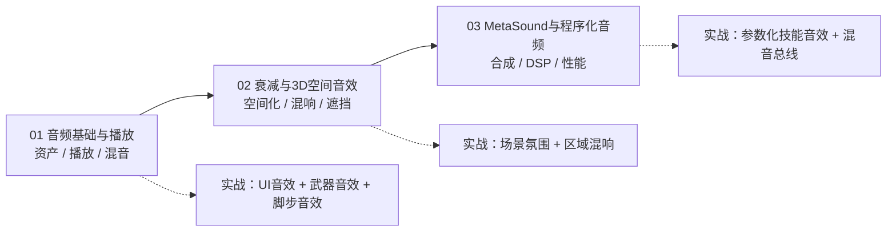

# 10-音频系统

> **分类目录**：`C:\project\git\游戏知识\10-音频系统`
> **适用引擎**：Unreal Engine 4.27 / UE 5.x（正文以 UE5.3+ 为主，4.27 差异处单独标注）
> **目标读者**：UE 客户端开发（蓝图 / C++）
> **最后更新**：2026-08-04

---

## 一、分类简介

音频（Audio）是游戏沉浸感的重要支柱：UI 反馈、角色语音、武器开火、环境氛围、音乐混音……UE 提供了一条从资产导入、播放调度、3D 空间化、混音总线（Submix）到程序化音频（MetaSound）的完整管线。

本分类面向 UE 客户端开发者，共 3 篇正文 + 1 篇导航，覆盖：

1. **音频基础与播放**：音频资产（WAV / 压缩 / 流送）、SoundBase 体系、四种播放方式、音量与混音、衰减入门；
2. **衰减与 3D 空间音效**：衰减曲线、空间化（Pan / HRTF）、Audio Volume 混响、遮挡与传播、环境音；
3. **MetaSound 与程序化音频**：节点图、程序化合成、Submix 与 DSP 效果链、中间件集成、性能优化。

学完本分类，你应该能独立完成：在项目里导入并规范组织音频资产；按场景选择正确的播放方式；配置合理的 3D 衰减与空间化；用 Audio Volume 做区域混响；用 MetaSound 做参数化/程序化声音；并排查常见的"没声音 / 声音糊 / 掉声"问题。

---

## 二、文件列表

| 文件 | 一句话简介 |
| ---- | ---- |
| [README.md](./README.md) | 本导航：分类简介、文件清单、学习顺序建议。 |
| [01-音频基础与播放.md](./01-音频基础与播放.md) | 从资产到扬声器：音频格式、SoundBase 体系、2D/3D 播放、音量混音、衰减入门。 |
| [02-衰减与3D空间音效.md](./02-衰减与3D空间音效.md) | 让声音"长在场景里"：衰减曲线、空间化、混响、遮挡传播、环境区域音效。 |
| [03-MetaSound与程序化音频.md](./03-MetaSound与程序化音频.md) | 用节点图"合成"声音：MetaSound、Submix DSP 链、性能优化与中间件集成。 |
| [04-Quartz音频时钟与节奏同步.md](./04-Quartz音频时钟与节奏同步.md) | Quartz 音频时钟：UQuartzSubsystem/ClockHandle、BPM/节拍/量化、音频驱动游戏逻辑与 MetaSound 协作。 |

---

## 三、学习顺序建议

### 路线 A：零基础入门（推荐）

1. 先读 **01-音频基础与播放**：掌握"资产 → 播放 → 混音"的最小闭环，能播放、能调音量、能控制生命周期；
2. 再读 **02-衰减与3D空间音效**：把声音放进 3D 世界，理解距离衰减、左右定位、环境混响；
3. 最后读 **03-MetaSound与程序化音频**：进阶内容 —— 程序化声音、DSP 效果链、性能与中间件。

### 路线 B：有基础、按需查阅

- 遇到"怎么播放 / 为什么不响"→ 查 01 的「播放方式」与「FAQ」；
- 遇到"声音没有空间感 / 距离感不对"→ 查 02；
- 遇到"想做参数化音效 / 挂 EQ 压缩"→ 查 03；
- 遇到"掉声 / 爆音 / 内存高"→ 先看 03 的「音频性能优化」，再回头补 01 的「音量与混音」。

### 路线 C：性能与发布前检查

1. 03 篇的「音频性能优化」（并发、虚拟化、内存）；
2. 01 篇的「最佳实践」（响度标准、命名规范、资源规范）；
3. 02 篇的「最佳实践」（衰减参数规范、区域规划）。

---

## 四、学习路径图

---

## 五、写作约定

- 术语首次出现给出英文原名，中英混排；
- 蓝图节点名用「」，C++ 类名 / 函数名用代码格式；
- 版本差异显式标注（4.27 / 5.x）；
- 涉及引擎私有实现的部分标注"机制概述"，以官方文档为准。

## 六、关联入口

- 上级分类：`..\README.md`（游戏知识总导航）
- 相关分类：渲染（音画联动）、动画（音画同步）、Gameplay（AI 听觉感知、玩家状态与音频触发）、UI（UI 音效规范）
