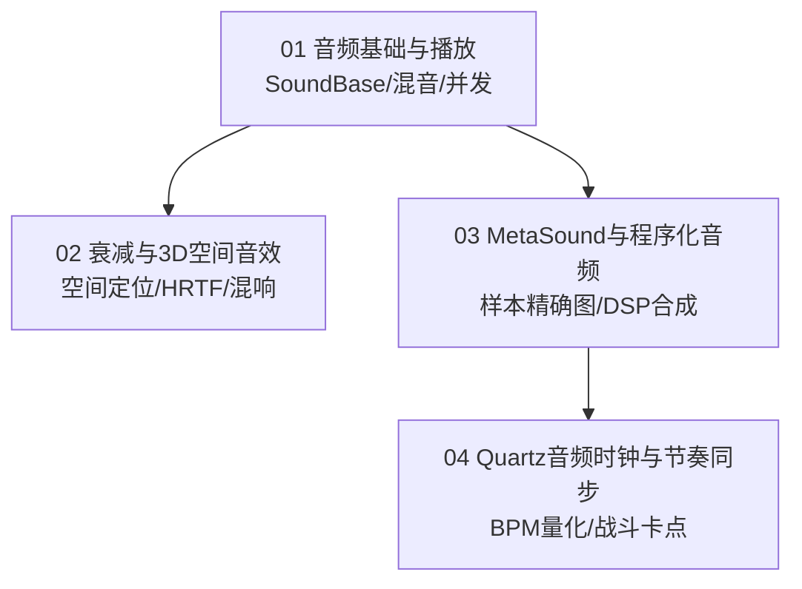

# 10 音频系统

> 知识成熟度：L2（子域工程手册，已按 4 篇核心专题与 UE5.8 源码基线全面标准化）。
>
> 领域权威导航：[游戏知识 Domain MOC](../../00_Index/domains/游戏知识.md) ｜ [游戏知识总目录](../README.md)。

---

## 1. 核心定位与设计思想

「10-音频系统」负责虚幻引擎中声音资产的播放调度、3D 空间化定位、环境混响与次时代程序化数字信号处理（DSP）。虚幻引擎原生集成了现代化的 **AudioMixer** 混音流水线与 **MetaSound** 系统：
- **层次化播放与并发管理**：以 `USoundBase` 为基类，统一管理 SoundWave 采样与 SoundCue/MetaSound 合成资产，通过 SoundConcurrency 严格限制同一声源的并发声道数与偷取（Voice Stealing）策略；
- **真实 3D 空间声学模拟**：提供基于距离的对数/自然衰减曲线、HRTF（头部相关传输函数）双耳空间化渲染、AudioVolume 区域混响以及视线遮挡（Occlusion）与低通滤波计算；
- **次时代程序化 DSP（MetaSound）**：以样本精确度（Sample-Accurate）图表取代传统黑盒音效，支持实时调制、FM/波表合成与 Submix 总线动态混音处理；
- **高精度音频时钟（Quartz）**：通过独立音频渲染线程驱动的高精度时钟，实现毫秒级 BPM 节拍量化对齐，为节奏动作与战斗音乐无缝卡点提供底层保障。

---

## 2. 专题矩阵与知识状态

| 专题文件（Canonical 路径） | 知识类型 | 成熟度 | 核心工程关注点与落地场景 |
| :--- | :---: | :---: | :--- |
| [01-音频基础与播放.md](01-音频基础与播放.md) | Concept | L2 | WAV 资产导入与压缩比率、SoundBase 层次、PlaySound2D/AtLocation 播放生命周期、SoundClass 混音总线与并发管理 |
| [02-衰减与3D空间音效.md](02-衰减与3D空间音效.md) | Concept | L2 | SoundAttenuation 距离衰减模型、HRTF 双耳空间定位、AudioVolume 室内混响预设、几何视线遮挡（Occlusion）与透射参数 |
| [03-MetaSound与程序化音频.md](03-MetaSound与程序化音频.md) | Concept | L2 | MetaSoundSource 样本精确图表、变量输入输出、动态 DSP 滤波器节点、Submix 效果链串接与内存常驻治理 |
| [04-Quartz音频时钟与节奏同步.md](04-Quartz音频时钟与节奏同步.md) | Concept | L2 | UQuartzSubsystem 音频时钟句柄、BPM 节拍量化触发器、音频线程与 GameThread 双向指令队列与玩法卡点 |

---

## 3. 逻辑学习顺序建议

```mermaid
flowchart TD
    A[01 音频基础与播放<br/>SoundBase/混音/并发] --> B[02 衰减与3D空间音效<br/>空间定位/HRTF/混响]
    A --> C[03 MetaSound与程序化音频<br/>样本精确图/DSP合成]
    C --> D[04 Quartz音频时钟与节奏同步<br/>BPM量化/战斗卡点]
```

1. **第一阶段（资产规格与播放控制）**：精读 `01-音频基础与播放`，掌握不同音效类型（UI/脚步/环境/语音）的压缩比与 SoundConcurrency 并发限制，避免声道耗尽爆音。
2. **第二阶段（3D 空间声学与环境感）**：深入 `02-衰减与3D空间音效`，配置空间衰减范围、开启 HRTF 并在地牢/洞穴布置 AudioVolume 实现自然混响。
3. **第三阶段（程序化音效与音乐互动）**：主攻 `03-MetaSound与程序化音频` 与 `04-Quartz音频时钟与节奏同步`，构建具备参数动态调制的载具引擎声与节奏卡点技能。

---

## 4. 游戏与引擎工程落地场景

- **移动端多声源并发爆音治理**：为脚步声配置全局限制 4 个声道、近距离优先（Stop Quietest），消除百人混战时的音频卡顿与内存剧烈波动；
- **动态物理载具引擎转速声**：使用 MetaSound 接收 C++ 传入的引擎 RPM 浮点数，实时改变合成器振荡频率与失真度，单份资产表现全转速声音；
- **战斗音乐节拍对齐**：使用 QuartzClock 设定 120BPM，在下一个第 4 拍小节线（Bar）到来时精确切换战斗激昂配乐并派发特效通知。

---

## 5. 跨域技术依赖与前后置导航

- **向下扎根（计算机底座）**：
  - 任务调度与多线程队列：[00-04 C++并发与内存模型](../../00-计算机与工程基础/04-C++并发与内存模型/README.md)
  - 硬件音频驱动与系统调用：[00-06 操作系统](../../00-计算机与工程基础/06-操作系统/README.md)
- **向上驱动（引擎源码剖析）**：
  - 音频系统引擎源码：[12-16 音频系统源码](../12-引擎源码分析/16-音频系统源码.md)
  - Lyra 相机与音频联动：[12-45 Lyra-相机音频与游戏阶段源码](../12-引擎源码分析/45-Lyra-相机音频与游戏阶段源码.md)
- **横向协同（动画与玩法）**：
  - 动画 Notify 音效触发：[04-动画系统](../04-动画系统/README.md)
  - 武器开火与击中反馈：[03-游戏玩法编程](../03-游戏玩法编程/README.md)
