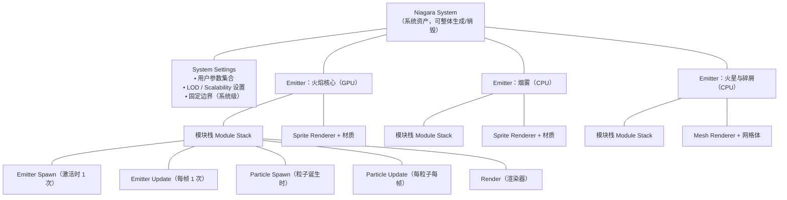
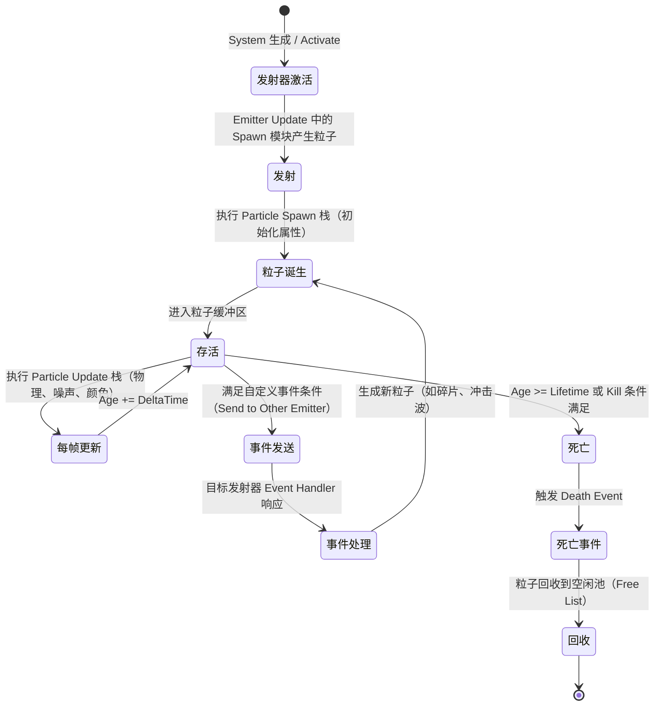

# 01-Niagara 粒子系统基础

> 适用范围：UE 客户端 · 视觉特效
> 版本基准：UE 5.x（涉及 4.x 差异处单独标注）

## 1. 概述

Niagara 是虚幻引擎新一代的粒子与视觉特效系统，自 UE 4.20 引入、UE5 全面接管并移除了旧版 Cascade。与 Cascade"固定管线 + 有限模块"的思路不同，Niagara 采用**数据驱动 + 模块化栈**架构：粒子的一切行为（发射、更新、渲染、事件）都由可自由组合的模块决定，模块之间通过**粒子属性**和**数据接口**交换数据。

本篇文章解决"入门"问题，目标读者是已经会用材质、但第一次接触 Niagara 的客户端程序员。学完本篇，你应该能：

- 说清 Niagara System / Emitter / Module 三层的职责与包含关系；
- 理解粒子属性（Attribute）的本质：它只是粒子结构体上的数据字段；
- 区分 CPU 与 GPU 发射器、Sprite / Mesh / Ribbon 渲染器的适用场景；
- 掌握发射模块与更新模块的执行时机，读懂粒子生命周期；
- 知道 Niagara 相对 Cascade 强在哪里，以及迁移时要注意什么。

高级内容（数据接口、事件、蓝图/C++ 交互、性能）请阅读本分类的 02、03 篇。

## 2. 核心概念（表格）

### 2.1 架构级概念

| 概念 | 英文 | 一句话说明 |
| --- | --- | --- |
| 系统 | Niagara System | 一个完整特效资产，包含多个发射器与系统级设置，可整体生成/销毁 |
| 发射器 | Emitter | 系统内的独立"粒子生产车间"，拥有自己的模块栈、渲染器与模拟目标（CPU/GPU） |
| 模块 | Module | 栈中的最小功能单元，读写粒子/发射器属性，是行为的基本组成 |
| 模块栈 | Module Stack | 发射器内按固定顺序执行的模块列表，决定每帧粒子如何被更新 |
| 粒子属性 | Particle Attribute | 存储在每个粒子上的数据字段（位置、速度、颜色、自定义字段等） |
| 数据接口 | Data Interface (DI) | 粒子与外部数据（碰撞、音频、网格体、渲染目标等）之间的桥接对象 |
| 用户参数 | User Parameter | 暴露给外部（蓝图/C++/Sequencer）的入口参数，命名空间为 `User.` |
| 事件 | Event | 粒子/发射器之间传递消息的机制（出生、死亡、碰撞、自定义） |
| 渲染器 | Renderer | 决定粒子如何被绘制：Sprite、Mesh、Ribbon、Light 等 |
| 模拟阶段 | Simulation Stage | UE5 引入的多轮次、类 Compute Shader 的粒子/网格模拟能力 |

### 2.2 数据流概念

| 概念 | 说明 |
| --- | --- |
| 命名空间 | 属性名的前缀体系：`Particles.`（粒子级）、`Emitter.`（发射器级）、`User.`（外部可设）、`System.`、`Engine.` |
| 参数绑定 | 模块参数可绑定到其他属性或表达式，实现"一个值驱动多个模块" |
| 发射器局部空间 | Local Space：粒子在发射器局部坐标系中模拟，跟随发射器移动（如拖尾跟随角色） |
| 确定性模拟 | Deterministic：相同输入产生相同结果，用于回放、网络同步等场景 |
| 固定边界 | Fixed Bounds：手动指定的粒子包围盒，供剔除与 GPU 分配使用 |

## 3. 原理详解

### 3.1 Niagara 架构层级

Niagara 的核心设计是**严格的三层包含关系**：System 包含 Emitter，Emitter 包含 Module Stack 与 Renderer。任何复杂的特效（爆炸、火焰、雨、传送门）都可以拆解为这个结构：



各层职责如下：

| 层级 | 主要职责 | 生命周期 |
| --- | --- | --- |
| System | 管理 Emitter 集合、系统级用户参数、LOD/可扩展性、系统级固定边界 | 生成（Spawn）→ 运行 → 销毁（自动或手动） |
| Emitter | 持有粒子缓冲区、选择 CPU/GPU 模拟、执行模块栈、挂载渲染器与事件处理器 | 随 System 激活/停用 |
| Module | 读写属性、调用数据接口、按栈顺序累加修改 | 每帧/每次事件按既定顺序执行 |
| Particle | 单个粒子数据，如 Position/Velocity/Color/Age 等 | 诞生 → 更新 → 死亡回收 |

> 记忆口诀：**System 管"整套特效"，Emitter 管"一种粒子"，Module 管"一个行为"，Particle 管"一条数据"。**

### 3.2 System / Emitter / Module 详解

#### 3.2.1 System（系统）

一个 Niagara System 资产（`UNiagaraSystem`）在内容浏览器中以 `.uasset` 存在（默认前缀 `NS_`）。它包含：

- **System Settings**：系统级参数、LOD 距离、可扩展性设置、系统级固定边界；
- **若干个 Emitter**：同一特效的不同"层"，例如火焰 = 核心发光层 + 外层烟 + 火星；
- **用户参数集合**：`User.` 命名空间下的参数，暴露给蓝图/C++/Sequencer 动态修改。

系统可以在世界中通过 `NiagaraComponent` 实例化（蓝图节点 `Spawn System at Location` 等），也可以作为模块化资产被其他系统引用。

#### 3.2.2 Emitter（发射器）

Emitter（`UNiagaraEmitter`，默认前缀 `NE_`）是真正的"模拟单元"，关键设置包括：

| 设置项 | 选项/含义 | 说明 |
| --- | --- | --- |
| Sim Target | CPU / GPU | 选择模拟运行在 CPU 还是 GPU（Compute Shader） |
| Local Space | 开关 | 粒子在发射器局部空间模拟，随发射器移动 |
| Determinism | 开关 | 确定性模拟（固定随机种子、固定步长），用于回放/同步 |
| Fixed Bounds | 包围盒 | 提供剔除用的包围盒；关闭则每帧动态计算，代价高 |
| Scalability | 质量档 | 按 Low/Medium/High/Epic/Cinematic 配置不同的行为 |
| LOD | 距离分级 | UE5 中可按与相机距离切换发射器/模块组合 |

#### 3.2.3 Module（模块）与模块栈执行顺序

模块栈是 Emitter 内部按类别分组的模块列表，**执行顺序自上而下**。不同类别模块的执行时机不同：

| 栈类别 | 执行时机 | 典型模块示例 |
| --- | --- | --- |
| Emitter Spawn | 发射器激活时执行 1 次 | 初始化发射器级状态、生成锚点数据 |
| Emitter Update | 每个模拟帧执行 1 次（发射器级） | Spawn Rate、Spawn Per Frame、发射器级颜色 |
| Particle Spawn | 每个粒子诞生时执行 1 次 | Initialize Particle（初始位置/速度/寿命） |
| Particle Update | 每帧对每个存活粒子执行 | Apply Gravity、Apply Drag、Noise、Scale Sprite Size |
| Event Handler | 收到事件时执行 | 死亡事件生成新粒子、碰撞响应 |
| Render | 每帧渲染前执行 | Sprite Renderer / Mesh Renderer / Ribbon Renderer |
| Simulation Stage | UE5，可多轮迭代执行 | 网格流体、群体模拟、邻域搜索 |

理解执行顺序是调试的关键：例如"在 Particle Spawn 里设置速度，在 Particle Update 里加重力"——前者只在出生瞬间生效，后者每帧叠加。若把重力模块放在 Spawn 段，粒子将只会获得一个初始速度增量而不是持续加速。

### 3.3 粒子属性与数据接口

#### 3.3.1 粒子属性（Attribute）的本质

粒子本质上是**一块结构化的内存**（CPU 端是结构体数组/SoA，GPU 端是缓冲区），属性就是这块内存上的字段。模块栈做的所有事情，本质上都是"读属性 → 计算 → 写属性"。

常用内置属性（UE5 口径）：

| 属性 | 类型 | 说明 |
| --- | --- | --- |
| `Particles.Position` | FVector3f | 粒子位置（世界或局部，取决于 Local Space） |
| `Particles.Velocity` | FVector3f | 速度，用于运动与碰撞 |
| `Particles.Color` | FLinearColor | 颜色与 Alpha，默认乘到材质 `Particle Color` |
| `Particles.SpriteSize` | FVector2f | Sprite 渲染尺寸 |
| `Particles.Mass` | float | 质量，用于碰撞、物理力 |
| `Particles.Age` | float | 已存活时间（秒），UE5 中的核心时间属性 |
| `Particles.Lifetime` | float | 总寿命（秒），Age ≥ Lifetime 时粒子死亡 |
| `Particles.UniqueID` | int32 | 粒子唯一 ID，用于事件定位与 Ribbon 排序 |
| `Particles.RibbonID` | int32 | Ribbon 分段归属 ID |
| `Particles.DynamicMaterialParameter` | float | 透传给材质实例的动态参数 |
| `Particles.MeshOrientation` | FQuat | Mesh 粒子的朝向 |

自定义属性：在模块中通过"Add Particle Attribute"（或蓝图节点）创建任意类型的新属性，例如 `Particles.BurnAmount`、`Particles.EmberSeed`。自定义属性是 Niagara 相对 Cascade 最本质的解放：**粒子的数据结构由你定义**。

#### 3.3.2 数据接口（Data Interface）

数据接口是 Niagara 与外部世界通信的桥梁。模块通过 DI 提供的函数读取外部数据，例如：

| 数据接口 | 用途 | 典型函数 |
| --- | --- | --- |
| Collision Query | 粒子碰撞检测（CPU 场景查询/GPU 深度） | `Collision Position`、`Collision Normal`、`Has Collision` |
| Audio Spectrum | 读取音频频谱驱动粒子 | `Get Audio Spectrum`、`Get Audio Frequencies` |
| Skeletal Mesh | 从骨骼网格体采样位置/朝向/速度 | `Sample Skinned Position`、`Get Nearest Bone` |
| Static Mesh | 从静态网格体采样 | `Sample Mesh Position` |
| Spline | 沿样条发射/约束粒子 | `Get Spline Position`、`Get Spline Direction` |
| Render Target 2D | 读写 RT 像素（纹理演化） | `Get Render Target Size`、`Set Render Target Value` |
| Grid 2D/3D Collection | 网格化数据存取（流体、场） | `Set Grid Value`、`Get Grid Value` |
| Neighbor Grid 3D | 邻域搜索（群体、毛发） | `Get Neighbor Index` |
| Curl Noise / Noise | 程序化噪声场 | `Sample Curl Noise` |

DI 的详细原理与高级用法（碰撞、音频、网格体采样）见《02-Niagara高级技巧》。

### 3.4 发射器类型

#### 3.4.1 模拟类型：CPU 与 GPU

| 维度 | CPU 发射器 | GPU 发射器 |
| --- | --- | --- |
| 运行位置 | CPU（多线程 Task Graph） | GPU Compute Shader |
| 粒子规模 | 数千～数万量级 | 数万～数十万量级 |
| 数据回读 | 支持（可读粒子数据） | 不支持（回读代价极高） |
| 事件支持 | 完整（生成/死亡/碰撞/自定义） | 受限（GPU↔GPU 部分支持，CPU 事件不可靠） |
| 数据接口 | 几乎所有 DI 可用 | 部分 DI 有 GPU 版本（碰撞、噪声、网格采样等） |
| 固定边界 | 建议开启 | 强烈建议开启（否则需保守估算） |
| 典型用途 | 玩法交互粒子、事件链特效 | 大规模环境粒子：雨、烟、尘埃、火花雨 |

#### 3.4.2 渲染类型：Sprite / Mesh / Ribbon / Light / Component

| 渲染器 | 绘制方式 | 适用场景 | 注意事项 |
| --- | --- | --- | --- |
| Sprite Renderer | 始终面向相机的公告板四边形 | 火焰、烟雾、火花、冲击波 | 最常用；材质负责大部分外观（序列帧、径向渐变） |
| Mesh Renderer | 实例化静态网格体 | 碎片、花瓣、岩石崩落 | 支持网格体 LOD 与实例化；注意三角形预算 |
| Ribbon Renderer | 按 RibbonID 连接粒子成丝带 | 激光、闪电、拖尾、水流 | 粒子需携带 RibbonID/宽度/朝向；连接顺序影响形态 |
| Light Renderer | 每个粒子一个点光源 | 极少量：篝火补光 | 光源极贵，尽量不用粒子做光源 |
| Component Renderer | 每个粒子生成一个组件 | 少用 | 开销最大，几乎只用于特殊需求 |
| 2D Ribbon（UE5.4+） | 面向相机的丝带 | 拖尾、轨迹 | 新渲染器，排序与形态更稳定 |

> 提示：渲染器决定"画成什么样"，材质决定"画出来是什么颜色/形状"（Alpha 遮罩、SubUV 序列帧、渐变），二者不要混淆。

### 3.5 发射与更新模块

#### 3.5.1 发射（Spawn）模块

| 模块 | 行为 | 适用 |
| --- | --- | --- |
| Spawn Burst Instantaneous | 一次性生成 N 个粒子 | 爆炸、冲击、命中瞬间 |
| Spawn Burst Instantaneous（循环） | 每 X 秒爆发一次 | 周期性爆裂 |
| Spawn Rate | 每秒匀速生成 N 个 | 持续喷涌：火焰、喷泉、烟雾 |
| Spawn Per Frame | 每帧生成 N 个 | 帧率相关场景（慎用，帧率越高粒子越多） |
| Spawn Per Unit | 发射器每移动单位距离生成 N 个 | 角色脚印、雨滴沿轨迹 |

发射模块的输出进入 "Particle Spawn" 栈，由 Initialize Particle 等模块完成初值设定。

#### 3.5.2 更新（Update）模块

| 模块 | 作用 | 说明 |
| --- | --- | --- |
| Initialize Particle | 设置初始位置/速度/颜色/寿命 | 几乎所有发射器必备 |
| Apply Gravity | 施加重力加速度 | 可设置自定义重力向量 |
| Apply Drag | 速度阻尼 | 让粒子减速，模拟空气阻力 |
| Curl Noise / Noise | 噪声扰动 | 让运动"有机化"，避免机械直线 |
| Vortex | 漩涡力 | 龙卷风、涡流 |
| Scale Sprite Size | 尺寸随时间变化 | 烟雾扩散变大、火花变小 |
| Color Over Life（自定义） | 颜色随 Age 变化 | 通过模块绑定 Age 实现渐变 |
| Kill Particles in Volume | 区域外粒子死亡 | 配合体积裁剪 |
| Age Update | 累加 Age、判定死亡 | 内置逻辑，一般由引擎处理 |

### 3.6 粒子生命周期

一个粒子的完整生命流程如下：



关键点：

1. **时间属性**：UE5 中用 `Particles.Age`（秒）与 `Particles.Lifetime`（秒）；`Age >= Lifetime` 即死亡。Cascade 时代的 `NormalizedAge`（0~1）在 UE5 中已移除，改为自行计算 `Age / Lifetime`。
2. **死亡不是立即销毁**：粒子死亡后进入发射器的空闲池（Free List），下一个新粒子会复用其内存槽位——所以"粒子数"是缓冲区内峰值，不是累计生成数。
3. **死亡事件**：死亡瞬间可发送 Death Event，由本发射器或其他发射器的事件处理器捕获，用于生成次级特效（爆炸残片、烟雾）或更新计数。
4. **发射器生命周期**：System 激活 → Emitter Spawn（1 次）→ 每帧 Emitter Update → System 停用/销毁 → Emitter 清理。

### 3.7 与旧 Cascade 对比

| 维度 | Cascade（已移除） | Niagara（现行） |
| --- | --- | --- |
| 架构 | 固定管线，模块种类有限且不可扩展 | 数据驱动模块栈，可自由组合、自定义模块 |
| GPU 模拟 | 不支持 | 原生支持（Compute Shader） |
| 粒子属性 | 固定字段（位置/速度/颜色/尺寸…） | 任意自定义属性，数据结构由你定义 |
| 数据接口 | 无 | 碰撞、音频、网格体、样条、渲染目标、网格场等丰富 DI |
| 事件通信 | 无 Send/Receive 概念 | 出生/死亡/碰撞/自定义事件 + Data Channel |
| 脚本扩展 | 需改引擎 C++ | 蓝图 Scratch Pad、模块资产、C++ 模块类均可 |
| 调试工具 | Particle Emitter 面板 | Niagara Debugger（属性面板、GPU 调试绘制） |
| 渲染类型 | Sprite/Mesh/Ribbon/Beam（Beam 发射器） | Sprite/Mesh/Ribbon/Light/Component/2D Ribbon（Beam 用 Ribbon+样条替代） |
| 可扩展性 | 无 Scalability 分档 | Scalability + 系统 LOD 距离分级 |
| 现状 | UE5 已删除 | 标准特效方案 |

## 4. 代码 / 蓝图示例

### 4.1 在编辑器中创建 Niagara System

1. 内容浏览器右键 → **FX → Niagara System**（或选择模板：Fountain、Simple Sprite Burst、GPU Sprite 等）；
2. 在 Niagara 编辑器中，左侧 **Emitter** 面板添加/删除发射器；
3. 选中发射器，右侧 **模块栈** 点击 "+" 添加模块（按类别：Spawn / Update / Render）；
4. 给渲染器指定材质与网格体；
5. 在 **User Parameters** 面板添加对外参数（如 `User.Speed`、`User.Color`），然后在模块参数上绑定它们。

### 4.2 蓝图生成特效

常用节点：

| 蓝图节点 | 说明 |
| --- | --- |
| `Spawn System at Location` | 在世界坐标生成特效，可选择自动销毁（Auto Destroy） |
| `Spawn System Attached` | 附着到组件/骨骼插槽（如武器、手掌、头部） |
| `Set Float / Vector / Color Variable`（Niagara 分类） | 按名称设置 `User.` 参数 |
| `Activate / Deactivate` | 激活/停用组件上的系统 |
| `On System Finished`（事件） | 特效播放完毕回调，用于回收与连锁触发 |

示例流程（受击爆裂）：

```text
角色受击(Event Hit)
  ├─ Spawn System at Location（HitFX，命中点，Auto Destroy = true）
  ├─ Set Variable: User.ImpactNormal = HitNormal
  └─ Set Variable: User.FlashColor = 受击颜色
  （系统内部：Sprite 爆裂 + 死亡事件生成碎片，详见 02 篇）
```

### 4.3 C++ 生成与设置参数

```cpp
// 头文件
#include "NiagaraFunctionLibrary.h"
#include "NiagaraComponent.h"
#include "NiagaraSystem.h"

// 在世界中生成特效
UNiagaraComponent* FXComp = UNiagaraFunctionLibrary::SpawnSystemAtLocation(
    this,                        // WorldContext
    HitFXAsset,                  // UNiagaraSystem*
    HitLocation,                 // FVector
    FRotator::ZeroRotator,       // 旋转
    FVector::OneVector,          // 缩放
    true,                        // bAutoDestroy：播放完毕自动销毁
    true,                        // bAutoActivate：生成后立即激活
    ENCPoolMethod::AutoRelease,  // 池化方式（见 02 篇）
    true                         // bPreCullCheck：先做剔除预检查
);

// 设置用户参数（名称与 Niagara 资产中 User 参数完全一致，大小写敏感）
FXComp->SetVariableFloat(FName("User.Speed"), 500.0f);
FXComp->SetVariableVec3(FName("User.ImpactNormal"), ImpactNormal);
FXComp->SetVariableColor(FName("User.FlashColor"), FLinearColor::Red);

// 绑定播放结束回调（需在生成前或生成后立即绑定）
FXComp->OnSystemFinished.AddDynamic(this, &AMyCharacter::OnHitFXFinished);
```

> 参数名匹配要点：必须与 Niagara 资产里 **User 参数面板** 中的名称逐字一致（含大小写）；建议在资产里统一命名规范（如 `User.` + 帕斯卡命名）。

### 4.4 生命周期控制 API（C++ / 蓝图）

| 接口 | 作用 |
| --- | --- |
| `Activate(bool bReset)` | 激活系统（bReset 是否重置模拟） |
| `Deactivate()` | 停用：不再发射新粒子，已有粒子继续播放到结束 |
| `SetAutoActivate(bool)` | 设置生成时是否自动激活 |
| `IsActive()` | 查询是否激活 |
| `SetPaused(bool)` | 暂停/恢复模拟（Debug 常用） |
| `AdvanceSimulation(float, TickGroup)` | 手动推进模拟（离线/预览） |
| `ReinitializeSystem()` | 强制重新初始化所有发射器 |
| `SetAsset(UNiagaraSystem*)` | 运行时更换特效资产 |
| `SetLODDistance(float)` | 手动指定系统 LOD 距离（配合系统 LOD 分级） |
| `OnSystemFinished` | 播放完成委托（C++ 委托 / 蓝图事件） |

## 5. 最佳实践

1. **一个特效一个 System，分层用 Emitter**：火焰拆成"核心发光 + 烟 + 火星"三个 Emitter，比三个独立 System 更好管理、更省 Draw Call（同一系统内同材质发射器有机会合并）。
2. **参数一律走 `User.` 参数**：不要在模块里硬编码数值；美术调参和程序驱动都靠 User 参数。
3. **命名规范**：System 资产前缀 `NS_`，Emitter 前缀 `NE_`，参数前缀 `User.`，资产名包含用途（如 `NS_Fire_Camp_Large`）。
4. **默认开启 Fixed Bounds**：先在 Emitter 设置里开启并填写合适的包围盒（详见 03 性能篇）。
5. **谨慎使用 Local Space**：跟随角色的拖尾用 Local Space 会抖动，一般用 World Space + 发射器跟随（Attached）。
6. **确定性模拟按需开启**：需要网络同步、回放、录像比对时开启 Determinism；平时关闭以换取性能。
7. **善用模板与示例工程**：官方 Content Examples 的 Niagara 关卡是学习模块组合的最佳教材。
8. **先 CPU 后 GPU**：除非确认粒子规模必须上万，先做 CPU 版本，逻辑清晰后再迁移 GPU。
9. **材质与渲染器分离思考**：外观变化优先改材质（SubUV、渐变），结构变化才动发射器。

## 6. 常见问题 FAQ

**Q1：Niagara 和 Cascade 能混用吗？**
UE5 已完全移除 Cascade。旧项目迁移路径：使用 UE 自带的 Cascade 转换工具将粒子系统转成 Niagara，再人工修正模块与材质（Cascade 的 Fixed Relative Bounding Box 对应 Niagara 的 Fixed Bounds 等）。

**Q2：粒子生成后什么都看不见，常见原因？**
① 渲染器未指定材质或材质为全透明；② User 参数（如尺寸/数量）为 0；③ Local Space 导致粒子远离发射器原点；④ 系统被 Distance Culling 或可扩展性档位关闭；⑤ 粒子 Lifetime 为 0 秒（立即死亡）；⑥ 发射器 Sim Target 为 GPU 而平台不支持（检查 `fx.Niagara.EnableGPUSimulation`）。

**Q3：Spawn Per Frame 和 Spawn Rate 有什么区别？**
Per Frame 每帧生成固定数量，与帧率耦合（60fps 比 30fps 多一倍粒子，不建议用于正式特效）；Rate 按秒生成，与帧率解耦，是标准做法。

**Q4：为什么粒子数量看起来"超预算"？**
Niagara 显示的数量是缓冲区当前存活数；一次性 Burst 大量粒子 + 长 Lifetime 会造成峰值。优化思路：降低峰值（分批 Burst）或缩短 Lifetime（详见 03 篇）。

**Q5：UE5 中怎么算粒子归一化年龄？**
`NormalizedAge` 已移除，用 `Particles.Age / Particles.Lifetime` 自行计算（注意 Lifetime 为 0 时做除零保护）。

**Q6：我想让粒子"知道"自己在哪个骨骼/碰到墙壁，怎么做？**
这是数据接口的职责：骨骼采样用 Skeletal Mesh DI，碰撞用 Collision Query DI，详见《02-Niagara高级技巧》3.1 节。

**Q7：粒子在移动端不显示/性能差？**
移动端 ES3.1 对 GPU 粒子支持有限，优先 CPU 发射器 + 低档 Scalability；详见《03-VFX性能优化》3.5 节。

## 7. 关联阅读

- [02-Niagara高级技巧.md](./02-Niagara高级技巧.md)：数据接口、事件通信、CPU/GPU 选型、蓝图/C++ 交互
- [03-VFX性能优化.md](./03-VFX性能优化.md)：粒子预算、LOD、合批、移动端限制与性能分析命令
- 02-渲染与图形：材质（半透明/Additive/SubUV）、Draw Call 原理
- 官方文档：Unreal Engine 文档「Niagara 概述」「Niagara 粒子系统」章节
- 官方示例工程：Content Examples → Niagara 关卡
