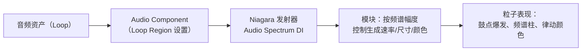
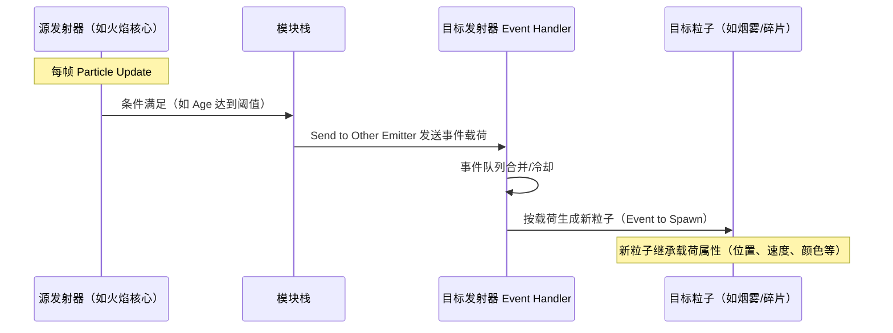
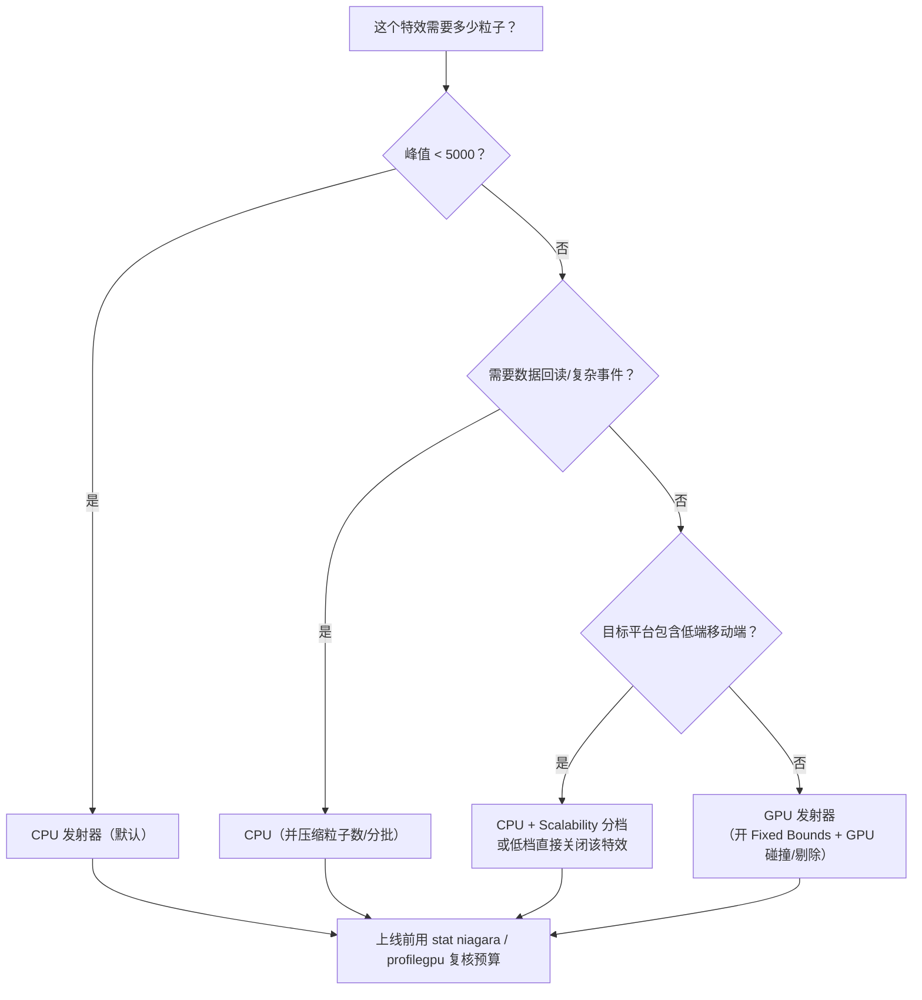
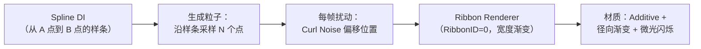

# 02-Niagara 高级技巧

> 适用范围：UE 客户端 · 视觉特效
> 版本基准：UE 5.x（涉及 4.x 差异处单独标注）
> 兼容性边界：适用于 UE5.8 编辑器/运行时，UE4.27 与早期 UE5 仅作迁移背景，具体模块以正文为准。
> 官方参考：[Unreal Engine UE5.8 官方文档总页](https://dev.epicgames.com/documentation/en-us/unreal-engine)。
> 最后更新：2026-08-06（本轮元数据维护）。
> 前置要求：已读完《01-Niagara粒子系统基础》，能独立搭建基础 Sprite 特效

## 1. 概述

基础篇解决了"Niagara 是什么、粒子怎么动"；本篇解决"粒子如何感知世界、如何彼此通信、如何与玩法代码协作"。这是从"会搭特效"到"能交付项目级特效"的分水岭。

本篇覆盖六大主题：

1. **数据接口（Data Interface）**：碰撞、音频频谱、网格体采样、样条、渲染目标等外部数据接入；
2. **事件与粒子通信**：Send/Receive 事件机制、Data Channel；
3. **CPU vs GPU 模拟选型**：何时用 GPU、何时必须 CPU，以及各自的坑；
4. **Ribbon / Beam 特效**：拖尾、激光、闪电的实现思路；
5. **Niagara 与蓝图/C++ 交互**：NiagaraComponent 全 API、参数设置、池化、Data Channel；
6. **Niagara 与材质配合**：材质域、粒子属性透传、SubUV、软粒子。

## 2. 核心概念（表格）

| 概念 | 英文 | 一句话说明 |
| --- | --- | --- |
| 数据接口 | Data Interface (DI) | 模块调用外部数据源的桥接对象，分 CPU/GPU 版本 |
| 碰撞查询 | Collision Query | 检测粒子与场景/表面的碰撞，输出位置、法线、深度 |
| 音频频谱 | Audio Spectrum | 读取音频组件 FFT 频谱，驱动粒子表现 |
| 网格体采样 | Skeletal/Static Mesh DI | 从骨骼/静态网格体采样位置、朝向、速度 |
| 粒子事件 | Particle Event | 粒子间传递消息：出生、死亡、碰撞、自定义 |
| 发送事件 | Send to Other Emitter | 发射器主动向目标发射器发送事件 |
| 事件处理器 | Event Handler | 接收事件并执行响应逻辑（生成粒子、改属性） |
| 数据通道 | Niagara Data Channel | UE5 引入的蓝图/C++ ↔ Niagara 批量数据通道（替代 NPC） |
| GPU 模拟 | GPU Simulation | 用 Compute Shader 在 GPU 上模拟海量粒子 |
| Ribbon | 丝带渲染器 | 按 ID 将粒子串成带子：拖尾、激光、闪电 |
| Beam | 光束 | Niagara 无独立 Beam 发射器，用 Ribbon + 样条/锚点实现 |
| 模拟阶段 | Simulation Stage | UE5 多轮次迭代计算能力，用于网格流体、群体模拟 |
| 参数集合 | Niagara Parameter Collection (NPC) | 旧版全局参数容器，UE5 已弃用，改用 Data Channel |
| 特效池化 | Niagara Pooling | 复用已销毁的 NiagaraComponent，降低生成/销毁抖动 |

## 3. 原理详解

### 3.1 数据接口详解

#### 3.1.1 数据接口的工作原理

数据接口是 C++ 类（继承 `UNiagaraDataInterface`），向模块栈暴露一组**可调用函数**。在模块中放入 DI 相关节点后，Niagara 会把调用编译进粒子更新代码：CPU 发射器直接调用 C++ 函数，GPU 发射器则把函数翻译成 HLSL 在 Compute Shader 中执行。

因此 DI 的选择直接影响性能：

- CPU 版本灵活（可访问 UObject、做复杂查询），但每粒子调用有函数开销；
- GPU 版本必须在 Shader 内可表达（只能采样纹理/缓冲区、做数学运算），但吞吐量极高。

#### 3.1.2 碰撞数据接口（Collision Query）

UE5 中碰撞 DI 名为 **Collision Query**（早期版本叫 Collision）。核心概念：

| 项目 | 说明 |
| --- | --- |
| 碰撞模式 | CPU（Scene Query）/ GPU（基于深度/距离场的异步碰撞） |
| 信道 | 可指定碰撞通道（如 WorldStatic、Pawn）与对象类型 |
| 物理材质响应 | 反弹系数（Restitution）、摩擦（Friction）来自物理材质 |
| 输出属性 | Collision Position、Collision Normal、Collision Velocity、Collision Depth |
| 碰撞事件 | 可启用 Collision Event，由 Event Handler 接收 |

CPU 与 GPU 碰撞对比：

| 维度 | CPU 碰撞 | GPU 碰撞 |
| --- | --- | --- |
| 实现 | 场景查询（每粒子 Raycast/Sweep） | 深度缓冲/距离场采样（异步） |
| 粒子上限 | 数千级别（查询昂贵） | 数万级别 |
| 精度 | 高（真实几何体查询） | 取决于深度缓冲分辨率 |
| 需要设置 | 碰撞通道配置 | 需要启用 Scene Depth 渲染、固定边界 |
| 典型用途 | 玩家身上的命中粒子 | 大规模雨滴落地、沙尘反弹 |

> 注意：GPU 碰撞依赖场景深度（Scene Depth）。需要在项目设置中确认 GPU 粒子读取 Scene Depth 已启用，且被碰撞物体必须写入深度（半透明物体会"穿透"）。

#### 3.1.3 音频数据接口（Audio Spectrum）

**Audio Spectrum** DI 读取指定音频组件（Audio Component）的 FFT 频谱数据，输出到 `Audio Spectrum` 浮点数组属性，通过 `Get Audio Spectrum` / `Get Audio Frequencies` 等函数取用。

典型流程（音乐可视化）：



要点：

- 需在音频资产的 **Loop Region**（循环区域）内设置 FFT 分析范围，粒子才会"听到"音乐；
- 旧版 **Audio Player** DI（每个粒子播声音）已弃用，声音播放请走普通 Audio Component，粒子只负责"看"频谱；
- 频谱数据每帧更新，适合节奏类玩法与 UI 动效联动。

#### 3.1.4 网格体采样数据接口

| DI | 采样内容 | 典型函数 | 典型用途 |
| --- | --- | --- | --- |
| Skeletal Mesh | 骨骼位置/朝向/速度，最近骨骼、最近点 | `Sample Skinned Position`、`Get Nearest Bone`、`Get Skinned Velocity` | 角色喷血、伤口火花、脚印尘土、剑气轨迹 |
| Static Mesh | 网格体表面位置/法线 | `Sample Mesh Position`、`Get Mesh Triangle` | 建筑物灰尘、场景碎裂 |
| Landscape | 地形高度/法线/材质 | `Get Height`、`Get Normal` | 雨滴落地、脚印、尘雾 |
| Spline | 样条上的位置/切线/朝向 | `Get Spline Position`、`Get Spline Direction` | 沿路径飞行的粒子、丝带引导 |

Skeletal Mesh DI 需要绑定 `SkeletalMeshComponent`（通过 NiagaraComponent 的 `SetVariableActor` / 蓝图节点绑定），并注意：

- 采样骨骼/最近点模式有性能差异：`Closest Point` 每粒子查询代价高于 `Nearest Bone`；
- 网格体需要开启对应的碰撞/采样设置（Readable 属性），否则采样结果异常；
- 骨骼网格体的蒙皮数据只在渲染线程可用，CPU 粒子采样依赖物理资产配置，需按文档开启。

#### 3.1.5 其他常用数据接口速查表

| DI | 用途 | 备注 |
| --- | --- | --- |
| Render Target 2D / Volume | 粒子读写渲染目标，做流体/溶解演化 | 配合材质采样可实现"像素级特效" |
| Grid 2D / 3D Collection | 网格化场数据读写 | Simulation Stage 常用 |
| Neighbor Grid 3D | 邻域粒子搜索 | 群体、毛发、蜂群 |
| Array（Niagara Array） | 外部传入数组数据 | 蓝图/C++ 用 Array 函数库写入 |
| Camera | 相机位置/朝向/FOV | 粒子相对相机行为 |
| Curl Noise / Noise / Voronoi | 程序化噪声场 | 有机运动、地形样貌 |
| Physics Field | 物理场（力场） | 与 Chaos 物理联动 |
| Simple Counter | 线程安全计数器 | 全局粒子计数、限制 |
| Data Channel | 蓝图/C++ ↔ Niagara 数据通道 | UE5 推荐，见 3.5 节 |

### 3.2 事件与粒子通信（Send / Receive）

#### 3.2.1 事件机制概述

Niagara 的事件系统让粒子与粒子、发射器与发射器之间可以传递消息。事件分两类来源：

| 事件类型 | 触发时机 | 典型载荷 |
| --- | --- | --- |
| Spawn Event | 粒子诞生时 | 位置、速度、初始属性 |
| Death Event | 粒子死亡时 | 死亡位置、速度、缩放、颜色 |
| Collision Event | 粒子碰撞时（需启用） | 碰撞位置、法线、深度 |
| Location Event | 粒子经过指定区域时（Location 模块） | 位置、进入方向 |
| 自定义事件 | 模块调用 `Send to Other Emitter` 主动发送 | 任意载荷属性 |

#### 3.2.2 事件流（Send/Receive）



实现步骤：

1. **发送端**：源发射器添加 `Send to Other Emitter` 模块，指定目标发射器（同 System 内）、事件类型与要发送的载荷属性（如 Position、Velocity、Scale）；
2. **接收端**：目标发射器的模块栈添加 **Event Handler**（Event Handler 类别），选择 Source（本发射器/系统内其他发射器）与 Event 类型；
3. **响应**：Event Handler 选择执行模式（如 Spawn Particles），把事件载荷映射到新粒子的初始化属性上。

典型用途：

- 火焰核心粒子死亡 → 生成烟粒子和火星（死亡事件链）；
- 受击粒子碰撞 → 生成冲击波与碎片（碰撞事件）；
- 雨滴落地 → 生成涟漪（碰撞事件 + 位置载荷）；
- 连环爆炸：A 爆炸粒子死亡事件触发 B 爆炸（自定义事件链）。

#### 3.2.3 事件使用注意事项

- **事件是"堆积"的**：每帧事件量大时，Event Handler 会累积处理，注意事件冷却（Cooldown）与上限设置；
- **GPU 限制**：GPU 发射器之间的事件支持有限（部分版本仅支持 GPU→GPU 的 Spawn/Death），GPU→CPU 事件涉及读回，代价极高，尽量避免；
- **载荷属性要显式声明**：发送端不勾选的属性，接收端读不到；
- 事件系统是**同帧处理**的（模拟帧内同步），不会跨帧延迟，除非显式排队。

### 3.3 CPU vs GPU 模拟选型

#### 3.3.1 决策对比

| 维度 | CPU 模拟 | GPU 模拟 |
| --- | --- | --- |
| 粒子规模 | 数百～数千（上限受 CPU 预算约束） | 数万～数十万（受显存与带宽约束） |
| 每粒子成本 | 模块 C++ 调用，灵活但慢 | Shader 并行，吞吐高 |
| 数据回读 | 可（读粒子数据做玩法逻辑） | 不可（Readback 昂贵且异步） |
| 事件 | 全类型支持 | GPU↔GPU 有限支持；不接 CPU 事件 |
| 碰撞 | CPU Scene Query / 部分 DI | GPU 碰撞（深度/距离场） |
| 固定边界 | 建议开启 | 必须开启（分配与剔除依赖） |
| 确定性 | 可开启 | 难以保证（并行归约顺序不定） |
| 调试 | 易（断点、属性面板） | 难（需 GPU 调试绘制） |
| 移动端 | 兼容好 | ES3.1 部分设备不支持 |

#### 3.3.2 选型决策流程



经验法则：

- 小于 5000 粒子的特效一律 CPU，逻辑简单、兼容性好；
- 上万粒子的环境特效（雨、雪、烟、尘埃、星尘）优先 GPU；
- 与玩法强耦合（需要知道"粒子在哪"、逐粒子交互）的用 CPU；
- 移动端优先 CPU + 严格预算（见 03 篇 3.5 节）。

### 3.4 Ribbon / Beam 特效

#### 3.4.1 Ribbon 渲染器原理

Ribbon Renderer 把携带相同 **RibbonID** 的粒子按顺序连接成带状网格（Triangle Strip）。每个粒子需要提供：

| 属性 | 作用 |
| --- | --- |
| `Particles.RibbonID` | 分带 ID：相同 ID 的粒子串成一条带 |
| `Particles.RibbonWidth` | 该粒子的带宽度（可随 Age 变化实现渐变收尾） |
| `Particles.RibbonFacing` | 带子的朝向（默认面向相机） |
| `Particles.RibbonLinkOrder` | 连接顺序（数值排序，保证粒子按正确顺序相连） |

关键难点是**连接顺序**：粒子按生成顺序自然排序，但经过物理更新后顺序可能错乱，需要：

- 让粒子沿单一方向运动（速度恒定），避免交叉；
- 或显式维护 `RibbonLinkOrder` 属性；
- 或使用 `RibbonID` 分段（如闪电分多段，每段独立）。

#### 3.4.2 Beam（光束）的实现

Cascade 有独立的 Beam 发射器，Niagara 没有——光束用以下两种方式实现：

| 方案 | 做法 | 适用 |
| --- | --- | --- |
| 锚点粒子 + Ribbon | 起点/终点两个"锚点"粒子（不渲染或极淡），中间粒子沿两点连线分布，Ribbon 连接 | 激光、光束、传送门连线 |
| 样条 + Ribbon | Spline DI 采样样条位置生成粒子，Ribbon 连接，配合噪声扰动 | 闪电（样条 + 每帧随机扰动） |

闪电特效典型结构：



#### 3.4.3 面向相机的 Ribbon（5.8）

5.8 中并无"2D Ribbon"渲染器（"UE5.4 新增 2D Ribbon"与 5.8 源码不符）；面向相机的丝带通过 Ribbon Renderer 的 **Facing Mode = Screen** 实现，配合 RibbonID/宽度渐变即可获得稳定的拖尾效果。

### 3.5 Niagara 与蓝图 / C++ 交互

#### 3.5.1 NiagaraComponent 核心 API

| 方法（C++ / 蓝图节点） | 作用 |
| --- | --- |
| `SetVariableFloat / Int / Bool` | 设置标量 User 参数 |
| `SetVariableVec2 / Vec3 / Vec4` | 设置向量参数 |
| `SetVariableColor` | 设置颜色（FLinearColor） |
| `SetVariableQuat` | 设置四元数（旋转） |
| `SetVariableActor / Object` | 绑定 Actor/Object（如 SkeletalMeshComponent、AudioComponent） |
| `SetVariableTexture / StaticMesh` | 绑定纹理、网格体 |
| `SetNiagaraVariableFloat(FNiagaraVariable, value)` | 以 FNiagaraVariable 为键设置（蓝图节点 `Set Niagara Variable`） |
| `Activate / Deactivate / IsActive` | 生命周期控制 |
| `SetAutoActivate` | 自动激活开关 |
| `SetPaused` | 暂停模拟 |
| `ReinitializeSystem` | 重新初始化 |
| `SetAsset` | 运行时换特效资产 |
| `SetLODDistance` | 手动设置 LOD 距离 |
| `SetGpuComputeDebug` | 开启 GPU 粒子调试绘制 |
| `OnSystemFinished` | 播放完毕回调 |

#### 3.5.2 特效池化（Pooling）

频繁 Spawn/Destroy 特效会产生组件生成开销与 GC 压力。Niagara 提供内置池：

```cpp
// ENCPoolMethod 选项
None          // 不入池，直接生成/销毁
AutoRelease   // 播放完自动回池（推荐，回调后复用）
ManualRelease // 手动调用 ReleaseToPool 回池
FreeInPool    // 立即回池（较少用）
```

建议：

- 高频特效（受击、脚步、弹孔）用 `AutoRelease` + `SpawnSystemAtLocation`；
- 池方法需在生成时指定，同一种特效保持一致的池化策略；
- 池化组件会复用资产引用，避免在池化组件上每帧改 `SetAsset`（会破坏池化）。

#### 3.5.3 参数集合 NPC 的废弃与 Data Channel

- **NiagaraParameterCollection（NPC）**：旧版全局参数容器，**UE5 已弃用**，不要在新项目使用；
- **Niagara Data Channel（UE5.0+）**：替代方案，用于蓝图/C++ 与 Niagara 之间**批量、低频、结构化**的数据交换（如：服务器下发的风暴参数表、敌人波次信息）。

Data Channel 工作方式：

1. 创建 **Niagara Data Channel** 资产，定义数据结构（字段列表）；
2. 发射器中添加 **Send Data Channel / Receive Data Channel** 模块绑定该资产；
3. 蓝图/C++ 通过对应函数向通道写入数据（如 `Send Data to Niagara Data Channel` 节点）；
4. 粒子模块按字段读取（如 `Get Data Channel Float`）。

> 适用边界：Data Channel 适合"整块数据下发"（数组、表格、低频状态），不适合每帧高频小参数——高频小参数直接用 `SetVariable*` 或组件属性。

#### 3.5.4 每帧驱动参数的坑

- `SetVariable*` 每帧调用会有函数调用与数据上传开销，高频参数（如连击条）可考虑缓存在 C++ 并在变化时才设置；
- 大批量数组数据优先走 Niagara Array DI（`SetNiagaraArrayFloat` 等），避免逐元素 Set；
- 需要与特效"双向实时"通信时（粒子数据回传玩法），用 Data Channel 或事件导出（UE5 中 Export DI 已弃用，用 Data Channel 替代）。

### 3.6 Niagara 与材质配合

#### 3.6.1 材质域与混合模式选择

| 特效类型 | 推荐混合模式 | 说明 |
| --- | --- | --- |
| 火焰/发光 | Additive | 颜色叠加，天然发光感，便宜 |
| 烟雾/灰尘 | Translucent（Alpha） | 需要真实遮挡与渐变 |
| 冲击波/能量 | Modulate / Additive | 屏闪、扭曲类 |
| 液体/半透明实体 | Translucent + Depth Fade | 需要景深感 |

#### 3.6.2 粒子属性到材质的通路

| 材质输入/节点 | 数据来源 | 用途 |
| --- | --- | --- |
| `Particle Color` | `Particles.Color` | 颜色与 Alpha 主通路 |
| `Particle Position` | `Particles.Position` | 位置相关计算（如世界空间渐变） |
| `Particle Size` | SpriteSize | 尺寸相关遮罩 |
| `Particle Dynamic Parameter` | `Particles.DynamicMaterialParameter` | 单个浮点动态参数（如溶解进度） |
| SubUV 节点 | Sprite Renderer 的 SubUV 设置 | 序列帧动画（火焰、爆炸帧序列） |
| Custom Primitive Data | 组件自定数据 | 高级透传（较少用于粒子） |

#### 3.6.3 SubUV 序列帧

1. 准备精灵图（Sprite Sheet，如 4×4 的爆炸帧）；
2. Sprite Renderer 勾选 **Sub UVs**，设置 Sub Image Size；
3. 材质用 `SubUV` 节点（Blend = 根据粒子 Age 在帧间插值）；
4. 配合 `Particles.SubImageIndex` 可由模块手动控制帧号（如按速度选帧）。

#### 3.6.4 软粒子与深度淡出

- **Soft Particles（软粒子）**：材质开启"Soft Particles"，采样 Scene Depth 做近裁剪淡出，避免粒子与场景硬切边；需要平台支持 Scene Depth；
- **Depth Fade**：材质节点 `DepthFade` 按距离淡出，解决粒子嵌进墙体的问题；
- 移动端注意：软粒子依赖深度缓冲，低端机或未开深度渲染时无效（对策见 03 篇 3.5 节）。

#### 3.6.5 材质实例与动态材质参数

- 同一发射器的粒子共用材质实例；修改外观走材质参数集（MPC）或 Niagara 的 `Particles.DynamicMaterialParameter`；
- 每粒子独立材质参数（如每粒子不同纹理）会破坏合批与实例化，非必要不用。

## 4. 代码 / 蓝图示例

### 4.1 C++：完整技能特效（生成 + 参数 + 回调 + 池化）

```cpp
// 头文件
#include "NiagaraFunctionLibrary.h"
#include "NiagaraComponent.h"
#include "NiagaraSystem.h"

void AMyCharacter::CastSkillFX(const FVector& TargetPos)
{
    // 1. 生成特效（AutoRelease 池化 + 自动销毁）
    UNiagaraComponent* BeamFX = UNiagaraFunctionLibrary::SpawnSystemAtLocation(
        this, SkillBeamSystem, GetActorLocation(),
        (TargetPos - GetActorLocation()).Rotation(),
        FVector::OneVector, true, true,
        ENCPoolMethod::AutoRelease, true);

    if (!BeamFX) return;

    // 2. 设置参数：目标点、颜色、力度
    BeamFX->SetVariableVec3(FName("User.TargetPosition"), TargetPos);
    BeamFX->SetVariableColor(FName("User.BeamColor"), SkillColor);
    BeamFX->SetVariableFloat(FName("User.Power"), CurrentPower);

    // 3. 绑定播放结束回调
    BeamFX->OnSystemFinished.AddDynamic(this, &AMyCharacter::OnSkillFXFinished);
}

void AMyCharacter::OnSkillFXFinished(UNiagaraComponent* FinishedComponent)
{
    // 池化模式下组件会自动回池，这里只做玩法收尾（如结算判定）
    LastSkillFX = nullptr;
}
```

### 4.2 蓝图：死亡事件链（火焰 → 烟 + 火星）

```text
【发射器 A：火焰核心（CPU）】
  Particle Update
    ├─ Send to Other Emitter（目标：烟雾发射器，Event=Death）
    │    载荷：Position、Velocity、Color、Scale
    └─ Send to Other Emitter（目标：火星发射器，Event=Death）
         载荷：Position、Velocity

【发射器 B：烟雾（CPU）】
  Event Handler（Source=火焰核心，Event=Death）
    └─ Spawn Particles（Event to Spawn，继承载荷初始化位置/速度）
  Particle Spawn：初始化颜色 = 载荷 Color

【发射器 C：火星（CPU）】
  Event Handler（Source=火焰核心，Event=Death）
    └─ Spawn Particles + Apply Gravity
```

### 4.3 蓝图：碰撞事件生成涟漪

```text
【发射器：雨滴（GPU，碰撞启用）】
  Particle Update
    ├─ Collision Query（GPU 模式，输出碰撞位置/法线）
    └─ Collision Event 启用（Event=Collision）

【发射器：涟漪（CPU）】
  Event Handler（Source=雨滴，Event=Collision）
    └─ Spawn Particles
      载荷映射：Position ← Collision Position
      初始化：SpriteSize 由小变大，Lifetime 0.5s
```

### 4.4 C++：Data Channel 写入示例（概念）

```cpp
// 概念示意：向名为 "StormData" 的 Niagara Data Channel 写入一组风暴参数
// 具体 API 随引擎版本有差异，以 UE5 对应头文件为准
// FNiagaraDataChannelHandler* Handler = GetNiagaraDataChannel(WorldContext, "StormData");
// Handler->WriteData(ChannelWriter, [](FNiagaraDataChannelWriter& Writer){ ... });
```

### 4.5 C++：绑定骨骼网格体到采样 DI

```cpp
// 让粒子可以采样角色骨骼
UNiagaraComponent* FXComp = UNiagaraFunctionLibrary::SpawnSystemAttached(
    BloodFX, SkeletalMeshComponent, NAME_None,
    FVector::ZeroVector, FRotator::ZeroRotator,
    EAttachLocation::KeepRelativeOffset, true, true,
    ENCPoolMethod::AutoRelease, true);

// 将骨骼网格体组件传给 Skeletal Mesh DI（User 参数绑定 Actor/Object）
FXComp->SetVariableActor(FName("User.TargetSkeletalMesh"), SkeletalMeshComponent->GetOwner());
```

> 前提：发射器中 Skeletal Mesh DI 的绑定源选择 User 参数，且类型匹配（SkeletalMeshComponent）。

## 5. 最佳实践

1. **事件链控制在 1~2 级**：A 死 → B 生 → C 生 的链条越深，每帧事件堆积越不可控；用冷却与上限保护。
2. **GPU 特效必开 Fixed Bounds 与 GPU Culling**：否则剔除失效、分配保守，性能雪崩（详见 03 篇）。
3. **碰撞预算分开算**：碰撞是特效里最贵的操作之一，CPU 碰撞粒子数控制在数百内；大规模碰撞走 GPU 碰撞。
4. **参数入口统一**：玩法侧只通过 User 参数与 Data Channel 接触特效，禁止美术在模块里硬编码玩法数值。
5. **高频小参数缓存、批量大数据走 Array/Data Channel**：避免每帧大量 SetVariable。
6. **Ribbon 特效优先固定方向运动**，避免粒子交叉导致的丝带撕裂；闪电用样条 + 噪声扰动而非纯随机。
7. **半透明特效材质保持简单**：Additive 优先，减少 overdraw（多层半透明叠加是移动端杀手）。
8. **池化一致性**：同一特效在所有调用点使用相同的池化策略（AutoRelease），避免池内组件状态混乱。
9. **版本特性按需使用**：Data Channel、Simulation Stage 等新特性先确认团队引擎版本再采用（5.8 无"2D Ribbon"，面向相机丝带用 Facing Mode=Screen）。
10. **调试工具用起来**：Niagara Debugger（属性面板、GPU 粒子绘制）、`fx.Niagara.GpuComputeDebug.DrawDebugEnabled`（5.8）、`stat niagara`。

## 6. 常见问题 FAQ

**Q1：GPU 粒子收不到事件 / 事件不触发？**
GPU 发射器事件支持受限：GPU→CPU 事件涉及读回通常不可用；GPU→GPU 的 Spawn/Death 事件在多数版本可用。排查：① 确认目标发射器也是 GPU；② 事件载荷属性在发送端已勾选；③ 事件 Handler 的 Source 与 Event 类型正确。

**Q2：碰撞没反应，粒子直接穿过地面？**
① 碰撞 DI 的信道/对象类型未包含地面（WorldStatic）；② GPU 碰撞需要 Scene Depth 且物体写入深度（半透明会被穿透）；③ 粒子速度过快导致深度采样错过表面（增大碰撞采样或降低速度）；④ Fixed Bounds 过小导致粒子被剔除。

**Q3：每帧 SetVariable 会不会卡？**
会有开销：函数调用 + 参数上传。几百个组件每帧调用会明显影响帧率；优化：变化时才设置、合并参数、用 Data Channel/Array 批量传输。

**Q4：Ribbon 粒子顺序乱、丝带扭曲？**
检查 RibbonID 是否稳定、运动方向是否一致；必要时手动维护 RibbonLinkOrder；或将 Ribbon Renderer 的 Facing Mode 设为 Screen（5.8 无 2D Ribbon 渲染器）。

**Q5：NPC（Niagara Parameter Collection）在 UE5 还能用吗？**
已弃用。请迁移到 Niagara Data Channel 或组件参数；旧资产升级时编辑器会给出提示。

**Q6：Beam 特效怎么做？**
Niagara 没有 Beam 发射器：激光用"锚点粒子 + Ribbon"或"样条采样 + Ribbon"；闪电用样条 + 每帧噪声扰动 + Ribbon + Additive 材质。

**Q7：粒子采样的骨骼网格体没反应？**
确认 Skeletal Mesh DI 绑定的是骨骼组件本身（而非 Actor）、网格体开启了采样所需设置、且 DI 绑定源（User 参数）类型匹配。

**Q8：音乐可视化没数据？**
检查音频资产的 Loop Region 是否设置、Audio Component 是否在播放、DI 是否指向正确的组件（世界中有多个音频组件时易指错）。

## 7. 关联阅读

- [01-Niagara粒子系统基础.md](./01-Niagara粒子系统基础.md)：架构、属性、生命周期基础
- [03-VFX性能优化.md](./03-VFX性能优化.md)：GPU 粒子预算、Fixed Bounds、移动端限制
- 02-渲染与图形：半透明混合、材质域、Scene Depth 相关章节
- 10-音频系统：音频组件与频谱分析基础
- 官方文档：Unreal Engine 文档「Niagara 数据接口」「Niagara 事件」「Niagara Data Channel」章节
