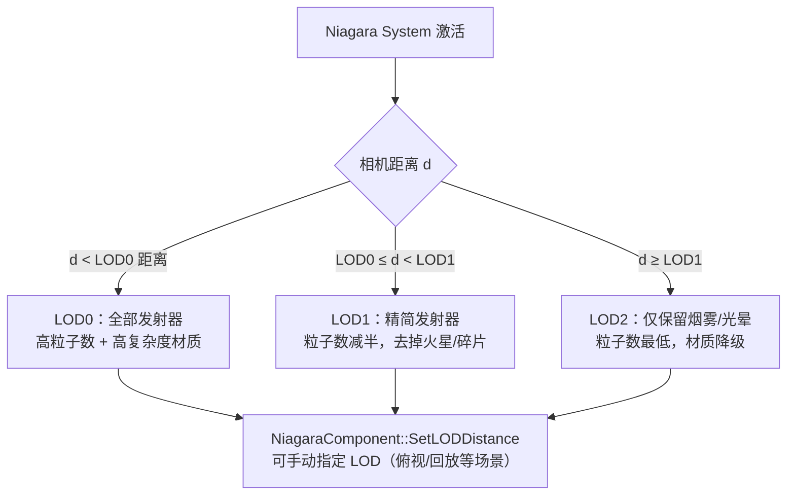
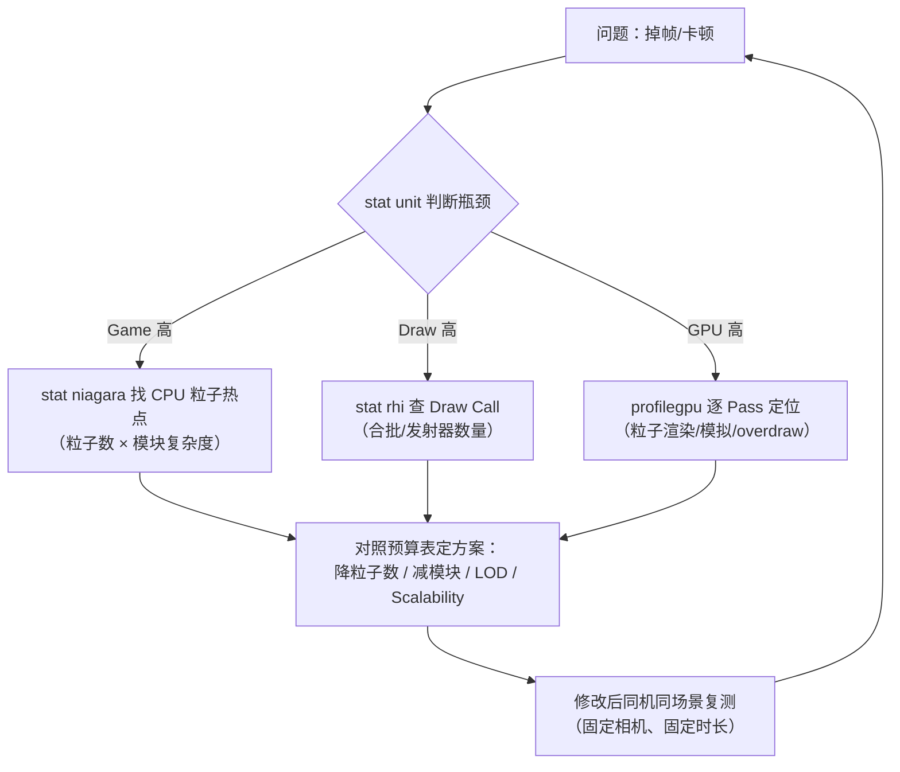

# 03-VFX 性能优化

> 适用范围：UE 客户端 · 视觉特效
> 版本基准：UE 5.x（涉及 4.x 差异处单独标注）
> 前置要求：已读完 01、02 两篇；具备基本 Profiler 使用经验

## 1. 概述

VFX 是渲染与 CPU 模拟中**最容易被低估的性能消耗源**：一个"看起来不错"的特效动辄上千粒子、多层半透明、多个发射器，而它在画面中的占比可能只有 5%。优化 VFX 的核心不是"少做特效"，而是**建立预算意识 + 分档控制 + 持续测量**。

本文覆盖六大主题：

1. **粒子数量预算与 LOD**：平台预算基准、系统 LOD、Scalability 分档；
2. **固定/动态发射器**：Fixed Bounds 的原理与代价；
3. **材质复杂度与半透明排序**：overdraw、排序问题与对策；
4. **Draw Call 与合批**：粒子的提交路径与合并手段；
5. **移动端 VFX 限制与对策**：ES3.1、纹理、overdraw 的现实约束；
6. **性能分析命令**：`stat niagara`、`profilegpu` 等一整套测量方法。

## 2. 核心概念（表格）

| 概念 | 英文 | 一句话说明 |
| --- | --- | --- |
| 粒子预算 | Particle Budget | 各平台允许的粒子数量/特效开销上限，先定预算再做特效 |
| 可扩展性 | Scalability | 按质量档（Low/Medium/High/Epic/Cinematic）切换特效配置 |
| 系统 LOD | System LOD | UE5 中按相机距离切换发射器组合与参数 |
| 固定边界 | Fixed Bounds | 手动指定粒子包围盒，供剔除与 GPU 分配 |
| 动态边界 | Dynamic Bounds | 每帧从粒子计算包围盒，准确但昂贵 |
| 过度绘制 | Overdraw | 同一像素被多次写入，半透明特效的头号杀手 |
| 半透明排序 | Translucent Sorting | 按距离排序透明物体，排序错误导致视觉穿帮 |
| 合批 | Batching / Instancing | 多个绘制合并为一次 Draw Call 的手段 |
| Draw Call | Draw Call | CPU 提交给 GPU 的一次绘制指令，数量是开销指标 |
| 软粒子 | Soft Particles | 按场景深度淡出粒子边缘，需要 Scene Depth |
| stat 命令 | stat / console command | 引擎内置统计命令，用于性能测量 |

## 3. 原理详解

### 3.1 粒子数量预算与 LOD

#### 3.1.1 粒子开销从哪来

一个 CPU 粒子的每帧成本 = **粒子数 × 模块复杂度**：

- 每多一个 Update 模块，就是每个粒子多一段计算；
- 粒子更新通常并行在 Task Graph 上，但内存带宽（读写粒子字段）是硬上限；
- 粒子越多，Spawn/Death 的事件、碰撞查询、排序等附属成本越高。

GPU 粒子的成本在 Compute Shader 吞吐与显存带宽：粒子数上万后，单纯增加模块就会明显拉高 GPU 时间。

#### 3.1.2 平台预算参考（经验值，非官方标准）

| 平台/档位 | CPU 粒子（同时存活） | GPU 粒子 | 说明 |
| --- | --- | --- | --- |
| 低端移动（千元机） | 500 ~ 1500 | 0（禁用 GPU 特效） | 单场景同时可见特效 ≤ 3 个 |
| 中端移动 | 1500 ~ 4000 | 2000 ~ 8000 | 关键特效才允许大粒子数 |
| 高端移动 | 3000 ~ 6000 | 5000 ~ 15000 | 需注意发热与功耗 |
| PC 中端 | 5000 ~ 10000 | 10000 ~ 30000 | 视游戏类型浮动 |
| PC 高端/主机 | 10000 ~ 20000 | 30000 ~ 100000+ | 仍需 LOD 与剔除 |

> 预算必须**按"同时可见的合计"**计算，而不是单个特效。战斗场景 5 个角色同时放技能时，合计粒子数才是真实压力。

#### 3.1.3 系统 LOD（UE5 距离分级）

UE5 的 Niagara 支持**系统级 LOD**：在 System Settings 中定义 LOD 距离（如 LOD0=0~3000、LOD1=3000~8000、LOD2=8000+），并为每个 Emitter 指定**允许出现的 LOD 范围**。距离远了，系统自动启用低档发射器组合：



配置要点：

- System Settings → **LOD** 面板添加距离档位；每个 Emitter 的 **LOD** 属性设置其生效范围；
- LOD 切换是**渐进式**的（模块按 LOD 合并），切换时注意不要让粒子数量突变造成视觉"跳变"；
- 运行时可通过 `SetLODDistance` 手动指定距离（如 UI 预览、镜面反射场景），覆盖自动计算。

#### 3.1.4 Scalability 分档（质量档）

Niagara 的 Scalability 让**同一个资产**在不同质量档下表现不同：

| 配置入口 | 作用 |
| --- | --- |
| 模块参数上的 Scalability | 同一参数按 Low/Medium/High/Epic/Cinematic 给不同值（如 Spawn Rate 各档 100/300/600/1000/1500） |
| Emitter 级 Scalability | 控制发射器在各档是否启用 |
| 项目设置 → Niagara | 全局档位与默认值 |
| 设备 Profile / 命令行 | `sg.` 系列命令切换质量档（如 `sg.EffectsQuality 2`） |

实践原则：

- **低档 = 关闭非必要发射器 + 大幅降粒子数**，而不是"稍微少一点"；
- 移动端档位在项目立项时就定好（通常只允许 Low/Medium 两档）；
- Scalability 是美术资产的一部分：制作时就分档，而不是上线前补。

#### 3.1.5 距离剔除

- 系统/组件有距离剔除（Cull Distance），远处直接不模拟；
- 使用 `Cull By Distance` 等模块或组件级剔除设置；
- 注意：**剔除依赖包围盒**——Fixed Bounds 设得过大，远处特效无法被剔除（见 3.2 节）。

### 3.2 固定 / 动态发射器

#### 3.2.1 Fixed Bounds（固定边界）

发射器的 **Fixed Bounds** 是手动填写的包围盒（相对发射器原点），作用有两个：

1. **剔除判断**：相机视野与包围盒不相交 → 整个发射器跳过模拟与渲染；
2. **GPU 分配**：GPU 发射器依赖包围盒估计粒子活动范围，用于缓冲区分配与剔除。

#### 3.2.2 动态边界（Dynamic Bounds）的代价

关闭 Fixed Bounds 时，引擎每帧需要：

- CPU：遍历所有粒子计算包围盒（O(n) 额外开销）；
- GPU：需要把粒子数据回读或做保守估算，可能破坏 GPU 模拟的流水线；
- 结果：粒子在飞行中包围盒"膨胀-收缩"，剔除效果差，且带来每帧抖动。

#### 3.2.3 实践建议

| 场景 | 建议 |
| --- | --- |
| 范围基本固定的特效（喷泉、篝火、固定位置爆裂） | 开启 Fixed Bounds，给出略大于粒子活动范围的盒子 |
| 范围会大幅变化的特效（大爆炸扩散、飞行轨迹很长的特效） | 开启 Fixed Bounds 并取"最坏情况"范围；或拆分成多个发射器分别给边界 |
| 永远不填 | 不推荐：动态边界 + 大范围运动 = 双重开销 |

> 经验：Fixed Bounds **宁大勿小**（小了会裁掉粒子），但也不要大得离谱（大了无法剔除）。填完后用 `fx.Niagara.GpuComputeDebug` 或调试绘制在场景里肉眼核对。

### 3.3 材质复杂度与半透明排序

#### 3.3.1 Overdraw：半透明的真实成本

半透明物体**不写深度、逐层混合**，同一像素被 N 层粒子覆盖就要执行 N 次像素着色与混合。全屏火焰 + 全屏烟雾叠在一起时，overdraw 可能达到 5~10 倍，直接拖垮 GPU。

控制手段（按性价比排序）：

1. **减少粒子尺寸**（像素面积 × 层数 = overdraw）；
2. **减少层数**：Additive 特效可互相"覆盖"而非叠加多层；
3. **材质精简**：像素着色器指令数越少越好（Unlit、无法线、无复杂噪声）；
4. **尽早"熄灭"**：缩短粒子可见寿命，避免拖尾层长时间重叠；
5. **粒子尺寸随距离缩小**：远景粒子小像素化，结合 LOD 减层。

#### 3.3.2 半透明排序

透明物体的渲染顺序按"排序键"（默认相机距离）排序，粒子系统参与全局透明排序。常见问题：

- 粒子与粒子、粒子与半透明物体之间**穿插穿帮**（排序键相同或距离判断不准）；
- 排序键基于对象中心/包围盒，大特效内部层级混乱；
- 每帧重新排序带来 CPU 开销。

常用对策：

| 手段 | 说明 |
| --- | --- |
| Renderer 的 Sort Mode | 粒子间排序模式：View Depth（视图深度）/ View Distance（距离）/ Custom Ascending/Descending（自定义键） |
| Depth Fade / Soft Particles | 从视觉上"抹掉"排序瑕疵，比强行排序更便宜有效 |
| 分层透明度 | 把大特效拆成"实体层 + 光效层"，减少透明穿插 |
| Ribbon 设 Facing Mode=Screen | 规避传统 Ribbon 排序伪影（5.8 无 2D Ribbon） |
| 避免透明物体相互穿插 | 关卡设计层面减少"半透明墙 + 半透明粒子"组合 |

相关命令：

| 命令 | 作用 |
| --- | --- |
| `r.TranslucentSortPolicy` | 全局透明排序策略（5.8 真实名称，默认按距离） |
| Project Settings → Rendering → Translucent Sort Axis | 排序轴向（5.8 为项目设置，非 CVar） |
| `r.SeparateTranslucency` | 独立半透明通道（版本相关，部分平台默认开） |

> 排序没有银弹：视觉问题优先用 Depth Fade 软化，不要迷信"调排序策略"能解决一切。

#### 3.3.3 材质复杂度清单

评审一个粒子材质时逐项过：

- [ ] 混合模式是否可降为 Additive / Modulate（比 Alpha 便宜）？
- [ ] 是否 Unlit？（粒子几乎不需要光照，除非特殊需求）
- [ ] 是否使用了 Scene Depth（软粒子）？移动端是否支持？
- [ ] 纹理数量与采样次数（SubUV 一次采样 vs 多张纹理混合）？
- [ ] 是否有每像素噪声/复杂函数（可改为顶点或预处理纹理）？
- [ ] 是否开启了半透明阴影、折射、反射（都是贵功能）？

### 3.4 Draw Call 与合批

#### 3.4.1 粒子如何产生 Draw Call

每个发射器每帧的渲染提交大致为：

```text
1 个发射器
  ├─ 深度预通道（Depth PrePass，视设置）
  ├─ 主通道绘制（1 次 Draw Call：Sprite/Mesh/Ribbon）
  ├─ 阴影通道（若参与阴影，如 Mesh 粒子）
  └─ 其他通道（反射、自定义深度等，视设置）
```

也就是说，一个"10 个发射器"的特效系统，基础就有 **10+ 个 Draw Call**，还没算阴影与深度通道。多个特效叠加、多个角色放技能时，Draw Call 数会迅速膨胀。

#### 3.4.2 合批与实例化原理

| 机制 | 原理 | 对粒子的意义 |
| --- | --- | --- |
| 实例化（Instancing） | 一次 Draw Call 提交多份相同网格/几何 | Mesh 粒子用实例化静态网格；Sprite 粒子默认一个调用绘制全部 |
| 合并（Batching） | 相同材质/状态的对象合并绘制 | 同一 System 内同材质的多个发射器有机会合并 |
| 排序破坏 | 半透明对象按深度排序，穿插时无法合并 | 透明粒子天然比不透明更难合批 |
| 材质参数差异 | 不同材质实例/不同参数打断合批 | 每个粒子独享材质参数 = 合批终结者 |

#### 3.4.3 降低 Draw Call 的手段

| 手段 | 说明 | 优先级 |
| --- | --- | --- |
| 合并发射器 | 同一特效的多个小发射器合并进一个 System（同材质可合批） | ★★★ |
| 共用材质 | 尽量让发射器共用同一材质实例（参数差异用属性传递） | ★★★ |
| 减少系统数量 | 高频小特效（弹孔、脚步）用池化 + 单个系统多发射器 | ★★★ |
| Mesh 粒子用实例化 | 确认 Mesh Renderer 开启实例化，网格体 LOD 合理 | ★★ |
| 开启 Fixed Bounds | 被剔除的发射器不产生任何提交 | ★★ |
| 避免每粒子独立材质参数 | 不透明粒子的材质参数变化会打断合批 | ★★ |
| 阴影通道控制 | 粒子 Mesh 不需要阴影时关闭 Cast Shadow | ★ |

> 判断标准：`stat rhi` / `stat scenerendering` 看 Draw Call 总数；把某个特效临时隐藏，对比 Draw Call 差值，就知道它"贡献"了多少。

### 3.5 移动端 VFX 限制与对策

#### 3.5.1 移动端硬约束

| 限制 | 影响 | 对策 |
| --- | --- | --- |
| ES3.1 无通用 Compute（部分设备） | GPU 粒子不可用或仅特定设备可用 | 移动端默认 CPU 粒子；GPU 特效仅在高端机档位开启 |
| 填充率/带宽有限 | overdraw 放大数倍，全屏特效极贵 | 严格控制粒子尺寸与层数，避免全屏特效 |
| 纹理压缩（ASTC/ETC2） | 大纹理占显存，压缩格式影响质量 | VFX 纹理走平台压缩，控制在合理尺寸 |
| 无 Scene Depth（部分场景） | 软粒子失效，粒子与场景硬切 | 材质兜底 Depth Fade；或关闭软粒子 |
| 无 MSAA/低分辨率 | 边缘锯齿明显 | 粒子用透明遮罩纹理，避免硬边 |
| 发热与功耗 | 长时间高粒子数导致降频 | 粒子预算打 7 折执行，热点特效限时 |

#### 3.5.2 移动端特效评审清单

- [ ] 该特效是否在移动端可见？低档是否直接关闭？
- [ ] 粒子总数是否在预算内（见 3.1.2 表）？
- [ ] 材质是否 Unlit + Additive + 单张纹理？
- [ ] 是否开启 Fixed Bounds？
- [ ] 软粒子是否降级为 Depth Fade？
- [ ] 是否有动态光源/阴影粒子？（移动端禁止）
- [ ] 是否在真机上用 `stat gpu` / `profilegpu` 实测过？

#### 3.5.3 移动端 Scalability 落地

```text
项目设置
  └─ Scalability（Effects 相关档位）
      ├─ Low    ：关闭 GPU 发射器、粒子数 ×0.3、关闭软粒子
      ├─ Medium ：粒子数 ×0.6、保留核心发射器
      └─ High   ：完整特效（仅高端设备）

设备 Profile（如 Android_High.ini）可覆盖档位，
运行时通过 sg.EffectsQuality N 或平台判定切换。
```

> 建议：**移动端特效在制作时就用"Low 档"预览**，美术在低档下做外观，高档只是加分项——这能避免上线前"删特效"的惨剧。

### 3.6 性能分析命令

#### 3.6.1 常用命令总表

| 命令 | 作用 | 使用时机 |
| --- | --- | --- |
| `stat niagara` | CPU 侧每个 System/Emitter 的粒子数、生成/销毁数、耗时 | 定位 CPU 粒子热点 |
| `stat particles` | 旧版 Cascade 统计（UE5 中意义有限） | 兼容旧项目时对照 |
| `stat gpu` | GPU 总览（含粒子渲染/模拟耗时） | GPU 侧第一眼 |
| `profilegpu` | 逐 Pass GPU 耗时火焰图 | 精确定位 GPU 热点 |
| `stat scenerendering` | 场景渲染统计（Draw Call、三角形） | 检查提交量 |
| `stat rhi` | RHI 层统计（Draw Call 数） | 核对合批效果 |
| `stat unit` | 帧预算分解（Game/Draw/GPU） | 全局判断瓶颈在 CPU 还是 GPU |
| `stat niagara` + `stat startfile/stopfile` | 配合 Unreal Insights 采集 | 深入分析 |

#### 3.6.2 Niagara 相关 CVar（以版本实际输出为准）

| CVar | 作用 |
| --- | --- |
| `fx.NiagaraAllowGPUParticles 0` | 全局关闭 GPU 粒子（5.8 真实名称，默认 1） |
| `Niagara.GPUCulling 0/1` | 开关 GPU 粒子剔除（5.8 真实名称，无 fx. 前缀，默认 1） |
| `fx.Niagara.GpuComputeDebug.DrawDebugEnabled` | GPU 粒子包围盒/剔除调试绘制（5.8） |
| `fx.MaxNiagaraGPUParticlesSpawnPerFrame` | 限制单帧 GPU 粒子生成数（5.8 真实名称，默认 2000000） |
| `r.TranslucentSortPolicy` / Translucent Sort Axis（项目设置） | 透明排序策略与轴向（5.8） |
| `r.ScreenPercentage` | 渲染分辨率缩放（移动端压分辨率测试） |
| `r.MobileContentScaleFactor` | 移动端内容缩放 |

> 版本提醒：CVar 名称在不同引擎版本可能变化。以当前版本的 `help fx.Niagara` / `help r.Translucency` 输出为准，不要盲抄旧笔记。

#### 3.6.3 分析方法论（VFX 专项）



实操要点：

- **固定复测环境**：同一地图、同一相机、同一操作序列、同一机型，数据才可比；
- **一次只改一个变量**：粒子数、材质、包围盒分开测，避免归因错误；
- **A/B 开关**：用 `fx.NiagaraAllowGPUParticles`（5.8）、隐藏单个系统等方式做对照；
- **看峰值更要看 P95**：特效爆发帧（技能释放瞬间）的耗时才是玩家体感。

#### 3.6.4 stat niagara 输出解读

```text
Niagara Systems  (CPU)   Total Particles: 18432   ...
  NS_Fire_Large          Emitters: 3   Particles: 8000   Update: 0.42ms
  NS_Smoke_Env           Emitters: 1   Particles: 6000   Update: 0.31ms
```

关注列：

- **Particles**：当前存活粒子数（对比预算）；
- **Spawned/Killed**：每秒生成/销毁数（峰值来源）；
- **Update 耗时**：该发射器 CPU 模拟耗时（模块复杂度直接体现）；
- 某发射器 Update 耗时异常高 → 逐个模块开关（Mute）定位元凶。

## 4. 代码 / 蓝图示例

### 4.1 蓝图：按平台切换特效档位

```text
Event BeginPlay
  ├─ Get Platform（或设备 Profile 判定）
  ├─ Branch：是否低端移动？
  │    ├─ 是 → Spawn System at Location（User.QualityLevel = 0）
  │    │        Set Float Variable：User.SpawnScale = 0.3
  │    └─ 否 → Spawn System at Location（User.QualityLevel = 2）
  │             Set Float Variable：User.SpawnScale = 1.0
  └─ 发射器内：Spawn Rate 参数绑定 User.SpawnScale 的乘法
```

> 更推荐的方式：全部交给 Scalability 档位（`sg.EffectsQuality`），代码只在极端情况下强制覆盖。

### 4.2 C++：运行时限制 GPU 粒子峰值（示例）

```cpp
// 概念示例：释放大招前临时提高预算，结束后恢复
void AMyCharacter::BeginUltimateFX()
{
    if (UNiagaraComponent* FX = UltimateFXComponent)
    {
        FX->SetLODDistance(0.f);            // 强制最高 LOD
        FX->SetVariableFloat(FName("User.ParticleScale"), 1.0f);
    }
}

void AMyCharacter::EndUltimateFX()
{
    if (UNiagaraComponent* FX = UltimateFXComponent)
    {
        FX->SetLODDistance(10000.f);        // 恢复自动 LOD（示例值）
    }
}
```

### 4.3 控制台实测流程（操作示例）

```text
# 1. 固定测试环境，开启统计
stat unit
stat niagara
stat rhi

# 2. GPU 侧定位
profilegpu

# 3. A/B 开关
fx.NiagaraAllowGPUParticles 0        # 关闭 GPU 粒子，对比（5.8）
show Particles                       # 隐藏/显示粒子系统（查看"没粒子"的帧预算）

# 4. 压测与恢复
fx.MaxNiagaraGPUParticlesSpawnPerFrame 2000    # 限制单帧 GPU 生成（5.8）
```

### 4.4 性能验收清单（交付前）

- [ ] 各平台 `stat unit` 下 VFX 合计占比达标（如移动端 Game+GPU ≤ 2ms 中特效预算）；
- [ ] 无 GPU 粒子在移动端 Low 档残留；
- [ ] 所有发射器有 Fixed Bounds；
- [ ] 场景最激烈时刻粒子峰值 < 预算上限；
- [ ] Draw Call 增量在控制内（`stat rhi` 对比）；
- [ ] 技能释放瞬间（P95）不出现明显掉帧。

## 5. 最佳实践

1. **预算先行**：立项时把各平台 VFX 预算写进团队规范，特效评审按预算卡点。
2. **先减"单位成本"再减"数量"**：同样 1000 粒子的特效，材质 200 指令 vs 20 指令，GPU 差距巨大；先精简材质，再砍粒子数。
3. **三层防线**：LOD（距离）→ Scalability（质量档）→ 预算（粒子数），三层都做好才叫优化。
4. **Fixed Bounds 是免费的午餐**：所有正式特效必须填，验收清单强制项。
5. **移动端从 Low 档开始做**：低档外观先过关，高档是加分项。
6. **事件与碰撞是最贵的模块**：无脑挂碰撞查询的发射器，性能一定翻车；能省则省。
7. **池化 + 合批是移动端双保险**：高频特效必须池化，同材质发射器必须能合批。
8. **数据说话**：每次优化都留前后对比数据（同场景、同相机、stat 截图），沉淀成团队经验表。
9. **警惕"编辑器里快，真机上卡"**：粒子与材质优化一律以真机数据为准。
10. **版本升级后复测**：引擎版本升级可能改变 Niagara 调度与 CVar 行为，重要特效回归测试。

## 6. 常见问题 FAQ

**Q1：`stat niagara` 显示粒子数不多，但 GPU 很慢？**
瓶颈多半在渲染侧：材质复杂度、overdraw、粒子尺寸过大或透明层数过多。用 `profilegpu` 定位到粒子渲染 Pass，检查像素着色器指令数与绘制面积。

**Q2：GPU 粒子在移动端白屏/不显示？**
ES3.1 设备无通用 Compute，或 `fx.NiagaraAllowGPUParticles`（5.8）被关闭。对策：移动端走 CPU 发射器，或按设备 Profile 只在高档开 GPU。

**Q3：远处的特效依然占开销？**
检查：① 是否开了 Fixed Bounds（过大则无法剔除）；② 系统 LOD 距离是否配置；③ 组件 Cull Distance 设置；④ Scalability 是否在低档关闭该发射器。

**Q4：粒子与场景穿插闪烁？**
半透明排序问题：加 Depth Fade/软粒子、调整 Renderer Sort Mode、减少透明穿插层数；Ribbon 类将 Facing Mode 设为 Screen（5.8 无 2D Ribbon）。

**Q5：一次爆炸 2 万粒子，帧率骤降？**
CPU 发射器 2 万粒子几乎必卡。对策：① 拆成"核心 2000（CPU）+ 外围 18000（GPU）"；② 缩短 Lifetime 降低存活峰值；③ 限制单帧 Spawn（`fx.MaxNiagaraGPUParticlesSpawnPerFrame`，5.8）。

**Q6：粒子带阴影后 Draw Call 翻倍？**
阴影通道会额外提交。非必要关闭粒子阴影（Cast Shadow = false），或让粒子材质不参与阴影。

**Q7：`stat niagara` 里看不到 GPU 发射器的耗时？**
GPU 模拟耗时在 `stat gpu` / `profilegpu` 的 Compute 阶段，CPU 统计里没有。GPU 粒子调试绘制用 `fx.Niagara.GpuComputeDebug.DrawDebugEnabled`（5.8）。

**Q8：合批为什么没生效？**
透明排序、不同材质实例、每粒子动态材质参数都会打断合批；同一发射器内粒子通常已实例化，跨发射器合批条件更苛刻，不要指望"自动合批"。

## 7. 关联阅读

- [01-Niagara粒子系统基础.md](./01-Niagara粒子系统基础.md)：粒子属性、发射器类型基础
- [02-Niagara高级技巧.md](./02-Niagara高级技巧.md)：GPU 模拟、事件、数据接口的性能含义
- 02-渲染与图形：Draw Call、半透明渲染、Scene Depth、材质优化章节
- 07-UI与性能优化：性能预算方法论、Profiler/Unreal Insights 使用
- 官方文档：Unreal Engine 文档「Niagara 性能」「Niagara 可扩展性」「控制台命令」章节
