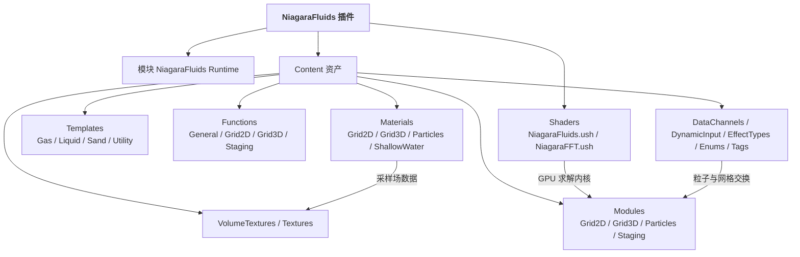
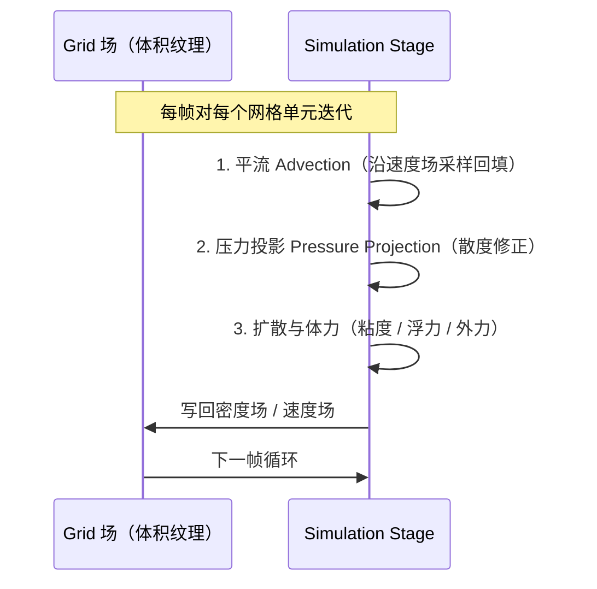
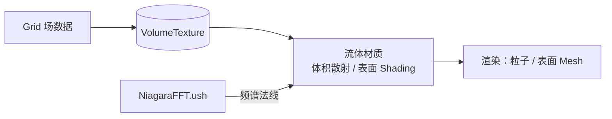

# 04 Niagara 流体模拟（Niagara Fluids）

## 元数据

| 项目 | 值 |
|---|---|
| 版本基线 | UE5.8.0（CL 55116800 / ++UE5+Release-5.8） |
| 适用范围 | 特效开发者 / TA：基于 Niagara 官方流体工具箱实现烟雾、水、火焰、沙粒等 GPU 流体模拟；含性能预算与移动端风险提示 |
| 事实边界 | 插件路径、uplugin 元数据、模块名、公共头文件、Content / Shaders 目录结构均经本机 Engine\Plugins\FX\NiagaraFluids 只读核对；求解器内部实现、模板资产具体名称、移动端支持矩阵等无法核实项标注「待核对」 |
| 官方参考 | https://dev.epicgames.com/documentation/en-us/unreal-engine |
| 最后更新 | 2026-08-07 |

## 概述

Niagara Fluids 是 Epic 官方随引擎分发的流体模拟工具箱，uplugin 描述原文为「Fluid simulation toolkit for Niagara」。它把网格法流体求解（Grid 2D / Grid 3D）与 Niagara 的 GPU 粒子体系结合：流体场数据存储在网格（体积纹理）中，粒子通过 Simulation Stage 与 Data Channel 与之交换数据，从而在 Niagara 生态内直接实现烟雾、水、火焰、沙等效果，无需接入第三方求解器（如 Houdini 场、Alembic 缓存回放）。

本机 UE5.8（CL 55116800）核对事实：

| 事实项 | 核对值 |
|---|---|
| 插件路径 | Engine\Plugins\FX\NiagaraFluids\NiagaraFluids.uplugin |
| 版本 / 名称 | Version 1 / VersionName 1.0 / FriendlyName NiagaraFluids |
| 状态 | IsBetaVersion: true（Beta 版；无 Experimental 标签） |
| 模块 | NiagaraFluids（Runtime，LoadingPhase Default），依赖 Niagara |
| 公共接口 | INiagaraFluids : IModuleInterface，提供 Get() / IsAvailable() |
| Shaders | NiagaraFFT.ush、NiagaraFluids.ush |
| 内容资产 | Templates（Gas / Liquid / Sand / Utility）、Modules（Grid2D / Grid3D / Particles / Staging）、Functions（General / Grid2D / Grid3D / Staging）、Materials（含 ShallowWater）、VolumeTextures、DataChannels、DynamicInput、EffectTypes、Enums、Tags、Blueprints、Meshes、Textures |

> 结论：5.8 中 NiagaraFluids 是单 Runtime 模块的轻量插件，全部功能以内容资产（模板 + 模块 + 函数 + 材质）形式提供，代码侧仅暴露模块接口——「使用」主要发生在 Niagara 编辑器与材质层，C++ 扩展点很少。

## 核心概念表

| 概念 | 英文 | 说明 |
|---|---|---|
| 网格流体 | Grid-based Fluid | 将空间离散为网格单元，在网格上求解流体方程（欧拉视角），与 SPH 等粒子法相对 |
| 密度场 | Density Field | 网格上的标量场，描述烟雾浓度 / 流体物质分布 |
| 速度场 | Velocity Field | 网格上的矢量场，描述流体运动方向与速率 |
| 平流 | Advection | 沿速度方向搬运场量，是流体运动的核心步骤 |
| 压力投影 | Pressure Projection | 修正速度场使其满足不可压缩条件（散度为零）的步骤 |
| Simulation Stage | Simulation Stage | Niagara 的 GPU 可编程阶段，可对网格逐单元执行求解 |
| Data Channel | Data Channel | 粒子属性与网格 / 纹理数据之间的交换通道 |
| 体积纹理 | Volume Texture | 3D 纹理，Grid3D 场的存储与采样载体 |
| FFT | Fast Fourier Transform | 频域合成水波的方法；本机 Shaders 目录含 NiagaraFFT.ush |
| 模板 | Template | 插件开箱即用的效果资产，按 Gas / Liquid / Sand / Utility 分类 |

## 原理详解

### 1. 插件结构与模块

NiagaraFluids 的代码面非常薄：单一 Runtime 模块，公共头文件仅 INiagaraFluids.h，声明模块接口类 INiagaraFluids（继承 IModuleInterface），提供静态 Get() / IsAvailable() 供外部查询模块是否加载。实际功能集中在 Content 资产与 Shaders 两个目录。



图释：插件 = 1 个 Runtime 模块 + 2 个 ush 着色器 + 一套内容资产；求解内核以 Niagara 模块与函数的形式存在于 Content 中，着色器提供 FFT 等底层算法支持。

模块加载（C++，节选）：

```cpp
// INiagaraFluids.h（本机核对，节选）
#include "Modules/ModuleInterface.h"
#include "Modules/ModuleManager.h"

class INiagaraFluids : public IModuleInterface
{
public:
    static inline INiagaraFluids& Get()
    {
        return FModuleManager::LoadModuleChecked<INiagaraFluids>(TEXT("NiagaraFluids"));
    }
    static inline bool IsAvailable()
    {
        return FModuleManager::Get().IsModuleLoaded(TEXT("NiagaraFluids"));
    }
};
```

### 2. 网格流体求解基础

流体模拟的欧拉法主循环在 Niagara 中由 Simulation Stage 对网格逐单元执行。简化为三步：

1. 平流（Advection）：把上一帧的密度场 / 速度场沿当前速度场方向采样回填，使物质随流体运动；
2. 压力投影（Projection）：求解压力场并修正速度场，保证不可压缩（散度为零）——这是 Grid3D 最贵的步骤；
3. 扩散与体力（Diffusion & Forces）：粘度扩散、重力 / 浮力 / 自定义力场叠加。



图释：三步迭代全部在 GPU 上以 Simulation Stage 完成，场数据落在体积纹理中；粒子侧通过 Data Channel 读取场量驱动自身运动（如烟雾粒子采样密度场决定透明度）。

Grid2D 与 Grid3D 的取舍：

| 维度 | 适用 | 成本 | 典型用法 |
|---|---|---|---|
| Grid 2D | 平面流体、水面高度场、贴墙烟雾 | 低（N×N 单元） | 水面波纹、2D 烟雾、贴图扰动 |
| Grid 3D | 立体烟雾 / 火焰 / 液体内部 | 高（N³ 单元） | 爆炸烟雾、龙卷风、体积火焰 |

### 3. 资产体系与模板

Content 目录结构（本机核对）语义：

- Templates：开箱效果模板 —— Gas（气体类：烟雾 / 火焰）、Liquid（液体类：水）、Sand（沙粒类）、Utility（工具类）；
- Modules：可复用求解模块 —— Grid2D / Grid3D 为网格求解器模块，Particles 为粒子侧模块，Staging 为暂存 / 中间数据模块；
- Functions：求解函数库 —— General（通用）、Grid2D / Grid3D（网格专用）、Staging（暂存）；
- Materials：渲染材质 —— Grid2D / Grid3D 为场可视化材质，Particles 为粒子渲染材质，ShallowWater 为浅水表面材质族，Utility 为工具材质；
- VolumeTextures / Textures：默认场数据（含 Grid2D_DebugGizmos 调试纹理）；
- DataChannels / DynamicInput / EffectTypes / Enums / Tags：Niagara 资产配套。

模板复用方式：在 Niagara 编辑器中创建基于模板的 System，再按需替换 Emitter / 模块 / 材质，而不是从零搭求解器。

### 4. 流体渲染

流体渲染分「场可视化」与「表面渲染」两条路：

- 体积渲染（体积纹理采样）：粒子或材质直接采样 VolumeTexture（密度场、速度场），通过 alpha / 散射近似体散射，适合烟雾、火焰尾迹；
- 表面渲染：Liquid 模板的水面用 ShallowWater 材质族，结合高度场（Grid2D）与 FFT 法线扰动（NiagaraFFT.ush）呈现水面反射 / 折射；
- FFT 水波：NiagaraFFT.ush 提供频域波浪合成（频谱 → IFFT → 高度 / 法线），是官方水波类模板的底层支撑（具体模板资产名待核对）。



图释：场数据上卷为体积纹理，材质层决定以体积散射还是表面方式呈现；FFT 为水面提供高频细节。

### 5. 与刚体 / 地形交互

流体与场景交互主要经 Data Channel 把外部数据（碰撞体、地形高度、几何体场）送入网格：

- 碰撞数据接口：把刚体 / 静态网格的碰撞写入网格场的「障碍」标记，平流与投影时跳过或反弹障碍单元；
- ChaosNiagara（本机核对存在：Engine\Plugins\Experimental\ChaosNiagara）：Chaos 物理事件 → Niagara 数据的实验性桥接，可用于碎块碰撞溅起粒子 / 流体（与破坏系统联动方向，具体接口待核对）；
- PCGNiagaraInterop（本机核对存在：Engine\Plugins\Experimental\PCGInterops\PCGNiagaraInterop）：PCG 与 Niagara 互操作，可把 PCG 生成的地形 / 分布数据喂给 Niagara 流体。

### 6. 烟雾 / 水 / 火焰实现思路

基于模板的落地路径：

| 效果 | 起点模板 | 关键调整 |
|---|---|---|
| 烟雾 | Gas | 调低扩散，增大浮力 / 湍流，用密度场控制透明度 |
| 火焰 | Gas | 双场：温度场（决定颜色 / 发光）+ 密度场（形状）；叠加噪声扰动 |
| 水面 / 液体 | Liquid | 高度场 + FFT 法线；必要时叠加 Grid3D 模拟液体内部 |
| 沙粒 | Sand | 粒子在网格场（高度 / 密度）上运动，配合碰撞滑动 |

工程上建议：一个效果 = 一个 Grid（或多个叠加）+ 粒子层（发射 / 采样 / 渲染）+ 材质层；把常用组合沉淀为项目模板，避免每次从零搭建。

### 7. 性能预算

网格分辨率是成本主变量：

- Grid3D 内存：N³ × 每单元字节数 × 场数量（密度 + 速度 3 分量 + 压力 ≈ 每单元 20~40 字节），128³ 约 200 万单元，256³ 直接 ×8；
- GPU 计算：每个 Simulation Stage 每帧对全部单元迭代，分辨率 ×8 意味着求解时间约 ×8（压力投影迭代可能更差）；
- 建议起点：2D 用 128~512，3D 用 32~64，按目标帧率逐档上调；多 Grid 场景按视觉重要性分配分辨率（近景高、远景低）；
- 复用：同模板多实例可共享求解资源，避免每实例独立 Grid（示意，具体复用机制待核对）。

| 分辨率 | 单元数（3D） | 相对成本 | 建议用途 |
|---|---|---|---|
| 32³ | 3.3 万 | 1× | 移动端 / 远景烟雾 |
| 64³ | 26 万 | 8× | 中景烟雾 / 火焰 |
| 128³ | 209 万 | 64× | 主机 / PC 高品质流体 |
| 256³ | 1677 万 | 512× | 影视级（需专业显卡） |

### 8. 移动端限制

待核对：本机未验证 NiagaraFluids 在移动端（Android / iOS）的支持矩阵。风险提示：体积纹理采样、大 Grid GPU 求解、Simulation Stage 对移动 GPU 的带宽与寄存器压力大；建议移动端仅用 Grid 2D + 低分辨率，或以预烘培序列代替实时求解。

### 9. 调试与验证

- NiagaraDebugger（编辑器）：逐 Emitter 查看粒子属性与 Simulation Stage 中间数据；
- 场可视化：使用插件的 Grid2D / Grid3D 材质直接显示密度 / 速度场，或 Grid2D_DebugGizmos 调试纹理（本机核对存在）；
- stat niagara 查看粒子与模拟开销（命令名待核对）；
- 常规验证：静止场景下场应趋于稳定；密度场随发射源增长；关闭外力后流场按预期衰减。

### 10. 常见问题定位

| 现象 | 可能原因 | 排查方向 |
|---|---|---|
| 流体不动 | 外力 / 发射源未连接，或平流方向错误 | 检查速度场写入与 Data Channel 连接 |
| 流体闪烁 | 分辨率过低或投影迭代不足 | 提高分辨率 / 检查场精度 |
| GPU 掉帧明显 | Grid 分辨率过高或多实例独立求解 | 降分辨率、合并 Grid、开 LOD |
| 表面异常 | 高度场与法线场不同步 | 检查 ShallowWater 材质输入与 FFT 参数 |

### 11. 方案选型：NiagaraFluids vs 其他流体方案

| 方案 | 实时性 | 保真度 | 成本 | 适用 |
|---|---|---|---|---|
| NiagaraFluids（本文） | 实时 GPU | 中（网格分辨率受限） | 免费随引擎 | 游戏内烟雾 / 水 / 火焰 / 沙 |
| 顶点动画纹理（VAT） | 实时回放 | 高（离线模拟） | 需离线模拟工具 | 预烘培的爆炸 / 液体（无交互） |
| Houdini 场 / 缓存 | 回放或导入 | 极高 | 工具链成本 | 影视级特效资产 |
| 第三方实时流体插件 | 实时 | 中高 | 商业授权 | 需要更高级求解器时 |
| Niagara 传统粒子模拟 | 实时 | 低（无网格） | 免费 | 简单烟雾 / 火花（非真实流体） |

选型建议：需要「玩家可交互、可反复触发」的流体用 NiagaraFluids；追求最高质量且无需交互时用 VAT / 离线缓存；需求超出网格法能力（如大规模液体飞溅）再评估第三方方案。

## 代码 / 示例

启用插件（.uproject，节选）：

```json
{
    "Plugins": [
        { "Name": "NiagaraFluids", "Enabled": true },
        { "Name": "Niagara", "Enabled": true }
    ]
}
```

C++ 查询模块（节选）：

```cpp
if (INiagaraFluids::IsAvailable())
{
    // 插件已加载，可安全引用其内容资产
    INiagaraFluids& Fluids = INiagaraFluids::Get();
}
```

蓝图侧：在 Content Browser 中创建 Niagara System 时选择 NiagaraFluids 的 Gas / Liquid / Sand 模板即可开始使用，无需 C++。

## 最佳实践

1. 先 2D 后 3D：能用 Grid2D 表达的效果不要上 Grid3D，成本差一个数量级；
2. 分辨率从低到高：以 64³ 起调，确认观感后再升档，避免开发期 GPU 卡死；
3. 场数量最小化：只保留效果必需的场（密度 / 速度），多余场成倍消耗显存与带宽；
4. 模板优先：官方 Gas / Liquid / Sand 模板是调好的起点，先改参数再改模块；
5. 多实例复用：同屏多个流体效果优先共享 Grid 与模块，而非复制 System；
6. 与 ChaosNiagara / PCGNiagaraInterop 联动前先做最小验证（实验性插件接口可能变化）；
7. 移动端降级预案：分辨率降级 + 关闭体积采样 + 预烘培序列兜底；
8. 记录基线：用 stat niagara 与 GPU 分析器记录每个 Grid 的帧开销，形成预算表；
9. 开发期常开场可视化，便于定位「看不见的流体」问题；
10. 版本锁定：插件为 Beta 属性，升级引擎前先做兼容验证并备份自定义 System。

## FAQ

Q1：NiagaraFluids 是官方插件吗？在哪里？
A：是，随引擎分发于 Engine\Plugins\FX\NiagaraFluids；5.8 中为 Beta 状态（IsBetaVersion: true）。

Q2：它与 Houdini 场 / 预烘培缓存有何区别？
A：实时 GPU 求解，可交互、可受玩家影响；代价是分辨率与物理保真度低于离线模拟。

Q3：必须写 C++ 才能用吗？
A：不需要。插件代码面仅模块接口，功能全部以 Niagara 资产（模板 / 模块 / 材质）提供。

Q4：Grid 2D 和 Grid 3D 怎么选？
A：平面 / 水面 / 贴墙效果用 2D；立体烟雾、火焰、液体内部用 3D，预算按 N³ 评估。

Q5：内存占用怎么估算？
A：约 N³ × 每单元字节数 × 场数量；128³ 多场约数十 MB 显存级，256³ 约 ×8。

Q6：可以做出逼真的水面吗？
A：可以。Liquid 模板 + FFT 法线（NiagaraFFT.ush）+ 反射折射，可满足游戏级水面；影视级需更高分辨率与更多场。

Q7：移动端能用吗？
A：待核对官方支持矩阵；风险较高，建议 Grid2D 低分辨率或预烘培。

Q8：流体能受碰撞影响吗？
A：可以，通过 Data Channel 注入碰撞障碍；Chaos 事件联动可经 ChaosNiagara（实验性）接入。

Q9：和 Chaos 破坏系统怎么配合？
A：经 ChaosNiagara 把碎块碰撞事件转为粒子 / 流体数据；详见关联阅读中的破坏篇。

Q10：升级引擎后模板会变吗？
A：Beta 插件资产结构可能调整，升级前备份自定义 System 并对照模板差异。

Q11：多个流体效果同时存在怎么控制总预算？
A：为每个效果分配分辨率档位（近景高 / 远景低），优先共享 Grid 与模块；用 stat niagara 记录各效果开销并设预算上限。

Q12：能叠加多个 Grid 实现复杂效果吗？
A：可以。例如火焰 = 温度场 Grid + 密度场 Grid 叠加，再经材质层合成；注意每个 Grid 独立计预算。

## 关联阅读

- [01-Niagara粒子系统基础.md](./01-Niagara粒子系统基础.md)：粒子系统与 Emitter / Module 基础
- [02-Niagara高级技巧.md](./02-Niagara高级技巧.md)：Data Channel 与高级交互技巧
- [03-VFX性能优化.md](./03-VFX性能优化.md)：粒子预算、LOD 与移动端优化
- [05-Chaos破坏系统与Field.md](<../09-物理系统/05-Chaos破坏系统与Field.md>)：破坏系统，流体与碎块联动的基础

## 更新日志

- 2026-08-07：创建。插件路径、uplugin 元数据、模块与资产结构经本机 UE5.8（CL 55116800）核对。
