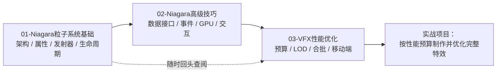

# 11-VFX 与 Niagara 特效（分类导航）

> 游戏全栈知识库 · UE 客户端 · 视觉特效分类
>
> 版本基准：Unreal Engine 5.x（文中特性以 UE5 为主，涉及旧版本差异处会单独注明）

## 分类简介

本分类覆盖虚幻引擎（UE）客户端视觉特效（VFX）的核心体系：**Niagara 粒子系统**。

Niagara 是 UE 自 4.20 起逐步引入、并在 UE5 中彻底取代旧 Cascade 粒子系统的下一代特效框架。它以"数据驱动 + 模块化栈"为核心设计，支持 CPU / GPU 双轨模拟、丰富的数据接口（碰撞、音频、网格体采样、样条、渲染目标等）、粒子事件通信、以及面向大规模计算的 Simulation Stage（模拟阶段）。对于客户端程序员而言，VFX 不仅是美术资产的堆叠，更涉及渲染成本、Draw Call、半透明排序、移动端适配等一系列工程问题——这正是本分类要讲清楚的内容。

本分类共 3 篇正文 + 1 篇导航，从 **基础原理 → 高级技巧 → 性能优化** 逐层递进，每篇均包含核心概念表格、原理详解、代码/蓝图示例、最佳实践与 FAQ。

## 前置知识

阅读本分类前，建议先完成以下分类的学习：

| 前置分类 | 关联内容 | 原因 |
| --- | --- | --- |
| 01-引擎基础 | 组件系统、Tick、世界坐标、蓝图/C++ 基础 | Niagara 以组件（NiagaraComponent）形式存在于世界中，参数设置依赖蓝图/C++ 基础 |
| 02-渲染与图形 | 材质（半透明、Additive）、Draw Call、渲染管线 | 粒子最终由材质呈现，性能问题大多出在渲染侧 |
| 07-UI与性能优化 | 性能预算、Profiler 方法论 | VFX 是性能大头，需要统一的测量与预算思路 |

## 文件列表

| 文件 | 一句话简介 |
| --- | --- |
| `README.md` | 本分类导航：简介、文件列表、学习顺序与关联分类 |
| `01-Niagara粒子系统基础.md` | Niagara 架构（System/Emitter/Module）、粒子属性与数据接口、发射器类型（CPU/GPU、Sprite/Mesh/Ribbon）、发射与更新模块、粒子生命周期、与旧 Cascade 对比 |
| `02-Niagara高级技巧.md` | 数据接口（碰撞/音频/网格体采样）、事件与粒子通信（Send/Receive）、CPU vs GPU 模拟选型、Ribbon/Beam 特效、Niagara 与蓝图/C++ 交互、Niagara 与材质配合 |
| `03-VFX性能优化.md` | 粒子数量预算与 LOD、固定/动态发射器、材质复杂度与半透明排序、Draw Call 与合批、移动端 VFX 限制与对策、`stat niagara` 等性能分析命令 |

## 学习顺序建议

### 第 1 步：先读 01 基础篇

目标是建立 Niagara 的**心智模型**：System 里装 Emitter，Emitter 里跑模块栈，模块读写粒子属性，渲染器负责绘制。这一篇不需要记 API，但要理解"粒子到底是什么数据"以及"模块栈的执行顺序"。

### 第 2 步：再读 02 高级篇

当你能徒手搭出一个 Sprite 粒子特效后，再进入高级篇：如何让粒子"感知世界"（碰撞、音频、骨骼网格体）、如何让粒子之间通信（事件）、如何在 CPU/GPU 之间选型、如何从蓝图/C++ 精确控制特效。这一篇偏实战，建议边读边在编辑器里对照。

### 第 3 步：最后读 03 性能篇

VFX 的性能问题往往在项目后期集中爆发。性能篇给出预算基准、LOD 体系、合批与半透明排序的原理、移动端限制以及一套完整的分析命令（`stat niagara` 等），建议在**动手做正式项目特效之前**通读一遍，把预算意识前置。

### 配套练习建议

1. 用模板创建一个 Niagara System，逐项打开模块栈观察属性变化（配合 Niagara Debugger）。
2. 做一个"受击爆裂"特效：Sprite 粒子 + 碰撞 + 死亡事件生成碎片（用到 01、02 两篇内容）。
3. 用 `stat niagara` 和 `profilegpu` 对比不同粒子数量、不同材质下的开销，建立自己的预算表（03 篇方法）。
4. 在 Windows 与移动端（Android/iOS）分别跑同一特效，观察差异并做 Scalability 分档。

## 本分类与相邻分类的关系

| 相邻分类 | 在本分类中的角色 |
| --- | --- |
| 02-渲染与图形 | 提供材质、半透明、Draw Call 的底层原理支撑；Niagara 材质配合详见 02 高级篇 |
| 03-游戏玩法编程 | 特效的蓝图/C++ 调用（SpawnSystemAtLocation、参数设置）属于玩法编程的一部分 |
| 07-UI与性能优化 | 提供通用性能分析方法论与 Profiler 工具链，VFX 是其中最典型的应用场景 |
| 10-音频系统 | 音频频谱数据接口（Audio Spectrum）可将音乐节奏驱动粒子，属于跨分类应用 |

## 维护与写作规范

- 技术口径以 **UE 5.x** 为准；提及旧版本（4.x）差异时明确标注版本号。
- 目录内文件命名：`NN-主题.md`，NN 为两位序号，与分类目录序号保持一致。
- 新增知识点时先更新本文 README 的文件列表与学习顺序，再补充正文。
- 涉及引擎命令（CVar、stat）时注明"以当前版本实际输出为准"，避免版本漂移误导。

## 关联阅读

- [01-Niagara粒子系统基础.md](./01-Niagara粒子系统基础.md)
- [02-Niagara高级技巧.md](./02-Niagara高级技巧.md)
- [03-VFX性能优化.md](./03-VFX性能优化.md)
- 知识库根目录 `README.md`（全栈知识地图）
- 官方文档：Unreal Engine 文档「Niagara 概述」「Niagara 数据接口」「Niagara 性能」章节
