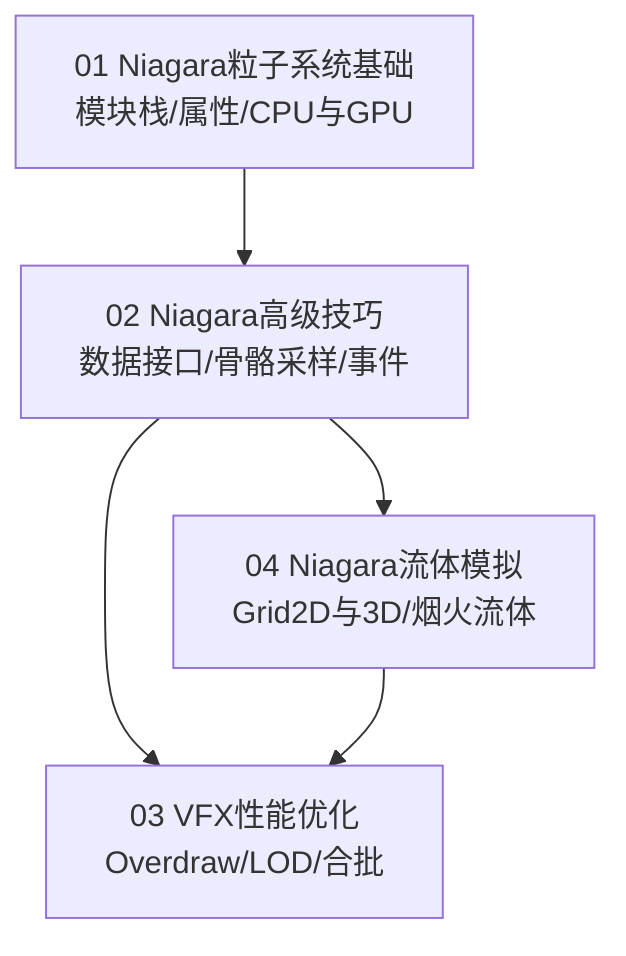

# 11 VFX与Niagara

> 知识成熟度：L2（子域工程手册，已按 4 篇核心专题与 UE5.8 源码基线全面标准化）。
>
> 领域权威导航：[游戏知识 Domain MOC](../../00_Index/domains/游戏知识.md) ｜ [游戏知识总目录](../README.md)。

---

## 1. 核心定位与设计思想

「11-VFX与Niagara」负责虚幻引擎中粒子视觉特效、GPU 大规模并行模拟与流体动力学仿真。UE5 全面以自研的 **Niagara** 框架作为次时代特效工业标准：
- **数据驱动与模块化栈**：通过 System → Emitter → Module 三层层次结构，允许技术美术与程序员以图表节点或 HLSL 编写发射、更新与事件处理逻辑；
- **CPU / GPU 双轨模拟管线**：支持小规模复杂逻辑的 CPU 模拟（支持射线碰撞与游戏逻辑回调），以及依托 Compute Shader 百万级粒子实时运算的 GPU 模拟；
- **丰富的数据接口（Data Interfaces）**：原生打通骨骼网格体顶点采样（Skeletal Mesh DI）、音频频谱数据（Audio Spectrum）、深度缓冲碰撞与流体空间网格；
- **高级仿真与性能预算**：基于 Grid2D/Grid3D 与 Simulation Stage 实现实时气态烟雾、火焰与流体解算，结合发射器 LOD 与剔除策略严格控制 Overdraw 渲染带宽。

---

## 2. 专题矩阵与知识状态

| 专题文件（Canonical 路径） | 知识类型 | 成熟度 | 核心工程关注点与落地场景 |
| :--- | :---: | :---: | :--- |
| [01-Niagara粒子系统基础.md](01-Niagara粒子系统基础.md) | Concept | L2 | Niagara 架构栈：System/Emitter/Module、粒子属性通道、CPU vs GPU 选型、Sprite/Mesh/Ribbon 渲染器与生命周期管理 |
| [02-Niagara高级技巧.md](02-Niagara高级技巧.md) | Concept | L2 | 数据接口 DI（骨骼采样/距离场碰撞/音频驱动）、粒子间事件通信（Events）、C++ 参数动态绑定与 NiagaraParameterCollection |
| [03-VFX性能优化.md](03-VFX性能优化.md) | Concept | L2 | 半透明 Overdraw 压降、粒子数量预算与 Scalability 分级、固定边界框（Fixed Bounds）消除 CPU 遍历、stat niagara 性能判读 |
| [04-Niagara流体模拟.md](04-Niagara流体模拟.md) | Concept | L2 | NiagaraFluids 网格流体（Grid2D/Grid3D）、Navier-Stokes 方程数值求解近似、GPU 模拟阶段调度、烟雾火焰与性能边界控制 |

---

## 3. 逻辑学习顺序建议

```mermaid
flowchart TD
    A[01 Niagara粒子系统基础<br/>模块栈/属性/CPU与GPU] --> B[02 Niagara高级技巧<br/>数据接口/骨骼采样/事件]
    B --> C[04 Niagara流体模拟<br/>Grid2D与3D/烟火流体]
    B --> D[03 VFX性能优化<br/>Overdraw/LOD/合批]
    C --> D
```

1. **第一阶段（心智模型与基础搭建）**：精读 `01-Niagara粒子系统基础`，掌握粒子属性在模块栈间的流转顺序与发射器渲染器配置。
2. **第二阶段（环境交互与高级数据流）**：深入 `02-Niagara高级技巧`，利用骨骼网格体采样让粒子依附角色身体，利用事件生成次级碎片粒子。
3. **第三阶段（流体物理与空间模拟）**：研读 `04-Niagara流体模拟`，掌握基于体素网格的火焰、烟雾与水体物理仿真。
4. **第四阶段（性能封顶与预算压降）**：精读 `03-VFX性能优化`，建立严格的粒子半径裁剪与半透明排序控制，避免大规模特效造成 GPU 填充率雪崩。

---

## 4. 游戏与引擎工程落地场景

- **角色受击全身流光斩击**：通过 Skeletal Mesh Data Interface 实时提取蒙皮顶点坐标与法线，沿刀刃挥动轨迹生成带光效拖尾的 Ribbon 粒子带；
- **大规模技能半透明填充率治理**：设置粒子最大屏幕尺寸阈值，远距离使用不透明几何体 Mesh 粒子替代大量堆叠的 Sprite，将半透明开销降低 70%；
- **可交互地面积雪与沙石印痕**：利用 Grid2D 流体配合 RenderTarget，将角色脚印坐标写入高度图，实时驱动地面凹陷与粒子飞溅。

---

## 5. 跨域技术依赖与前后置导航

- **向下扎根（计算机底座）**：
  - GPU 计算着色器与异构：[00-08 计算机体系结构与性能](../../00-计算机与工程基础/08-计算机体系结构与性能/README.md)
  - 数值积分与微积分运动模拟：[游戏算法 02-数学与碰撞](../../游戏算法/02-数学与碰撞/README.md)
- **向上驱动（引擎源码剖析）**：
  - Niagara 引擎源码实现：[12-17 Niagara源码](../12-引擎源码分析/17-Niagara源码.md)
- **横向协同（渲染与音频）**：
  - 材质着色与半透明混合：[02-渲染与图形](../02-渲染与图形/README.md)
  - 音频频谱驱动粒子：[10-音频系统](../10-音频系统/README.md)
